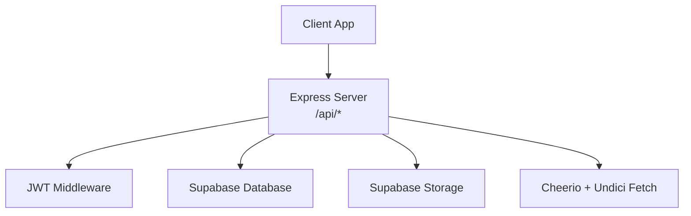
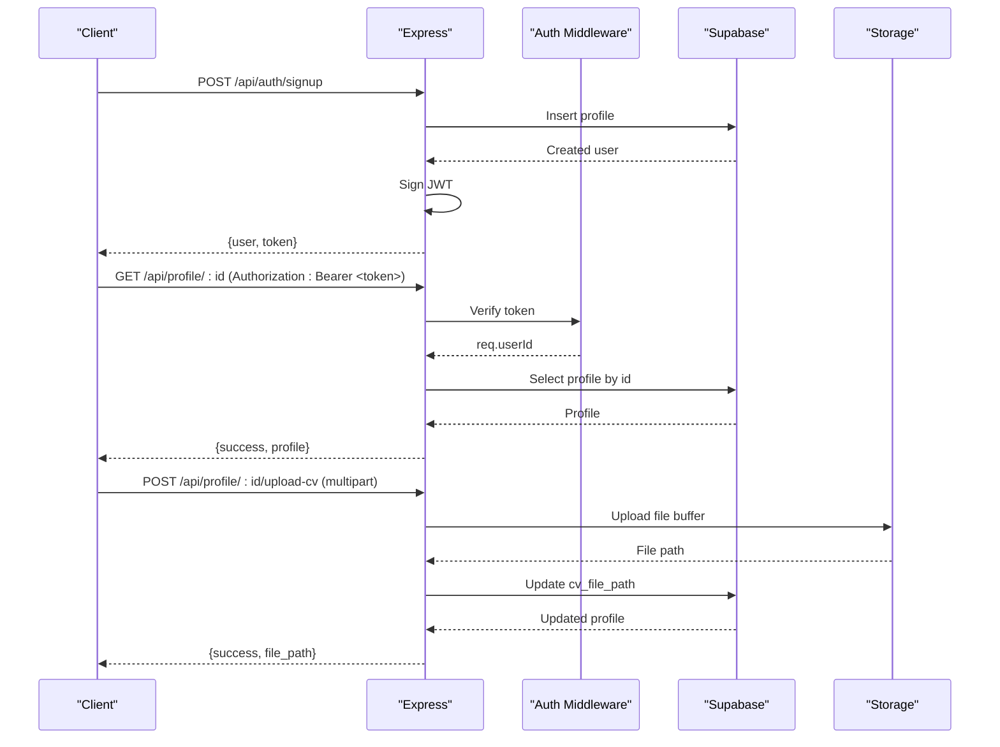
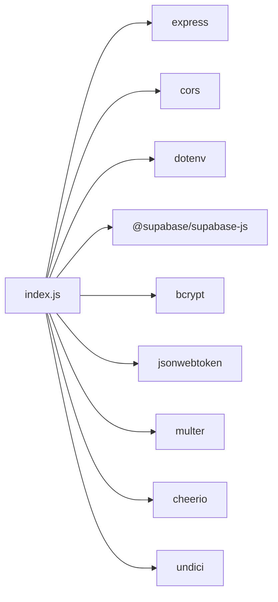

# API Reference

<cite>
**Referenced Files in This Document**
- [index.js](file://aischolarpath-backend-main/aischolarpath-backend-main/index.js)
- [package.json](file://aischolarpath-backend-main/aischolarpath-backend-main/package.json)
</cite>

## Table of Contents
1. Introduction
2. Project Structure
3. Core Components
4. Architecture Overview
5. Detailed Component Analysis
6. Dependency Analysis
7. Performance Considerations
8. Troubleshooting Guide
9. Conclusion

## Introduction
This document provides comprehensive API documentation for the ScholarPathAI backend. It covers authentication, profile management, scholarship matching, discovery (web scraping), reference data endpoints, and supporting features such as applications, shortlists, notifications, roadmap generation, and document tools. Each endpoint includes request/response schemas, authentication requirements, error responses, and notes on rate limiting where applicable.

## Project Structure
The backend is a single-file Express application that:
- Loads environment variables and validates required configuration at startup
- Sets up CORS, JSON parsing, file upload handling, and Supabase client
- Defines all routes under /api/* with middleware-based authentication
- Implements business logic for profiles, scholarships, universities, matches, applications, shortlists, notifications, discovery/scraping, and roadmap generation

**Diagram sources**
- [index.js:1-29](file://aischolarpath-backend-main/aischolarpath-backend-main/index.js#L1-L29)
- [index.js:31-48](file://aischolarpath-backend-main/aischolarpath-backend-main/index.js#L31-L48)
- [index.js:50-68](file://aischolarpath-backend-main/aischolarpath-backend-main/index.js#L50-L68)
- [index.js:1182-1493](file://aischolarpath-backend-main/aischolarpath-backend-main/index.js#L1182-L1493)

**Section sources**
- [index.js:1-29](file://aischolarpath-backend-main/aischolarpath-backend-main/index.js#L1-L29)
- [package.json:1-14](file://aischolarpath-backend-main/aischolarpath-backend-main/package.json#L1-L14)

## Core Components
- Authentication: JWT-based token issuance and verification for protected routes
- Profile Management: CRUD operations, CV upload, CV analysis placeholder, overview
- Scholarship Matching: Run matching algorithm and retrieve stored matches
- Discovery (Scraping): Single/bulk scraping, structured extraction, official page scraping, logs
- Reference Data: Scholarships, universities, language prep guides, attestation guides
- Applications & Shortlist: Track applications and maintain shortlists
- Notifications: Create, list, mark read, deadline reminders
- Roadmap: Generate personalized roadmap based on nearest deadline

**Section sources**
- [index.js:31-48](file://aischolarpath-backend-main/aischolarpath-backend-main/index.js#L31-L48)
- [index.js:69-188](file://aischolarpath-backend-main/aischolarpath-backend-main/index.js#L69-L188)
- [index.js:574-692](file://aischolarpath-backend-main/aischolarpath-backend-main/index.js#L574-L692)
- [index.js:1182-1493](file://aischolarpath-backend-main/aischolarpath-backend-main/index.js#L1182-L1493)
- [index.js:189-288](file://aischolarpath-backend-main/aischolarpath-backend-main/index.js#L189-L288)
- [index.js:821-932](file://aischolarpath-backend-main/aischolarpath-backend-main/index.js#L821-L932)
- [index.js:982-1100](file://aischolarpath-backend-main/aischolarpath-backend-main/index.js#L982-L1100)
- [index.js:1545-1595](file://aischolarpath-backend-main/aischolarpath-backend-main/index.js#L1545-L1595)

## Architecture Overview
The server uses an Express app with a centralized JWT authentication middleware to protect sensitive routes. Data persistence is handled via Supabase (PostgreSQL + Storage). Scraping functionality uses undici fetch and cheerio to parse HTML content and store results or update reference data.

**Diagram sources**
- [index.js:518-573](file://aischolarpath-backend-main/aischolarpath-backend-main/index.js#L518-L573)
- [index.js:31-48](file://aischolarpath-backend-main/aischolarpath-backend-main/index.js#L31-L48)
- [index.js:93-145](file://aischolarpath-backend-main/aischolarpath-backend-main/index.js#L93-L145)

## Detailed Component Analysis

### Authentication Endpoints
- POST /api/auth/signup
  - Purpose: Register a new user and return a JWT
  - Request body: full_name (string), email (string), password (string)
  - Success response: success (boolean), user (object: id, full_name, email), token (string)
  - Errors: 400 if missing fields; 500 on database errors
  - Notes: Passwords are hashed before storage; JWT expires in 7 days

- POST /api/auth/login
  - Purpose: Authenticate user and return a JWT
  - Request body: email (string), password (string)
  - Success response: success (boolean), user (object: id, full_name, email), token (string)
  - Errors: 400 if missing fields; 401 invalid credentials; 500 on database errors

- POST /api/auth/forgot-password
  - Purpose: Generate a reset token for the given email
  - Request body: email (string)
  - Success response: success (boolean), message (string), reset_token (string)
  - Errors: 400 if missing email; 500 on database errors

- POST /api/auth/reset-password
  - Purpose: Reset password using a valid reset token
  - Request body: reset_token (string), new_password (string)
  - Success response: success (boolean), message (string)
  - Errors: 400 if missing fields; 401 invalid/expired token; 500 on database errors

- Authorization header format for protected routes:
  - Header: Authorization: Bearer <jwt_token>
  - Token payload contains user id; verified against JWT_SECRET

Error codes summary:
- 400: Missing or invalid request parameters
- 401: Invalid credentials or expired token
- 403: Not authorized (e.g., accessing another user’s resource)
- 404: Resource not found
- 500: Internal server or database errors

**Section sources**
- [index.js:518-573](file://aischolarpath-backend-main/aischolarpath-backend-main/index.js#L518-L573)
- [index.js:1101-1181](file://aischolarpath-backend-main/aischolarpath-backend-main/index.js#L1101-L1181)
- [index.js:31-48](file://aischolarpath-backend-main/aischolarpath-backend-main/index.js#L31-L48)

### Profile Management APIs (/api/profile/*)
- PATCH /api/profile
  - Purpose: Update current user’s profile fields
  - Auth: Required
  - Request body (partial updates allowed): full_name, cgpa, ielts_score, target_country, target_degree, target_department
  - Success response: success (boolean), profile (object)
  - Errors: 500 on database errors

- GET /api/profile/:id
  - Purpose: Get profile by id (only owner can view)
  - Auth: Required
  - Path param: id (must match authenticated user)
  - Success response: success (boolean), profile (object)
  - Errors: 403 unauthorized; 404 not found; 500 on database errors

- POST /api/profile/:id/upload-cv
  - Purpose: Upload CV to storage and link to profile
  - Auth: Required
  - Content-Type: multipart/form-data with field name: cv
  - Success response: success (boolean), file_path (string)
  - Errors: 400 no file; 403 unauthorized; 500 on storage/update errors

- POST /api/profile/:id/analyze
  - Purpose: Placeholder for CV analysis; stores extracted data and updates profile fields
  - Auth: Required
  - Success response: success (boolean), extracted (object with mock fields)
  - Errors: 403 unauthorized; 500 on database errors

- GET /api/profile/:id/overview
  - Purpose: Dashboard summary including profile completeness and match stats
  - Auth: Required
  - Success response: success (boolean), overview (object with profile_completeness, summary, top_recommendations)
  - Errors: 403 unauthorized; 404 not found; 500 on database errors

Rate limiting: Not implemented in code.

**Section sources**
- [index.js:69-188](file://aischolarpath-backend-main/aischolarpath-backend-main/index.js#L69-L188)
- [index.js:693-749](file://aischolarpath-backend-main/aischolarpath-backend-main/index.js#L693-L749)

### Scholarship Matching APIs
- POST /api/profile/:id/match-scholarships
  - Purpose: Compute eligibility against active scholarships and persist matches
  - Auth: Required
  - Path param: id (must match authenticated user)
  - Logic: Filters scholarships by target_country if present; evaluates CGPA, IELTS, degree criteria; computes match_score and status; clears old matches then inserts new ones
  - Success response: success (boolean), matches (array of match objects with evidence)
  - Errors: 403 unauthorized; 404 profile not found; 500 on database errors

- GET /api/profile/:id/matches
  - Purpose: Retrieve stored matches for a profile sorted by match_score descending
  - Auth: Required
  - Path param: id (must match authenticated user)
  - Success response: success (boolean), matches (array with scholarship and university details)
  - Errors: 403 unauthorized; 500 on database errors

Notes:
- Eligibility evaluation considers min_cgpa, min_ielts, required_degree from scholarship eligibility_criteria
- Status values: Eligible, Missing Requirements, Not Eligible

**Section sources**
- [index.js:574-692](file://aischolarpath-backend-main/aischolarpath-backend-main/index.js#L574-L692)

### Discovery Endpoints (/api/discovery/*)
- POST /api/discovery/scrape
  - Purpose: Scrape a listing page using CSS selectors and log results
  - Auth: Required
  - Request body: url (string), item_selector (string), title_selector (optional string), link_selector (optional string)
  - Success response: success (boolean), items_found (number), items (array of {title, link}), log (object)
  - Errors: 400 missing required fields; 500 network or database errors

- GET /api/discovery/logs
  - Purpose: View recent scraping logs
  - Success response: success (boolean), logs (array)

- POST /api/discovery/scrape-bulk
  - Purpose: Scrape multiple URLs with same selectors; includes 2-second delay between requests
  - Auth: Required
  - Request body: urls (array of strings), item_selector (string), title_selector (optional), link_selector (optional)
  - Success response: success (boolean), total_items_found (number), results (array per URL)
  - Errors: 400 invalid input; 500 per URL failures logged

- POST /api/discovery/scrape-and-structure
  - Purpose: Scrape listing page, visit each item page, extract fields via pattern matching, upsert into scholarships
  - Auth: Required
  - Request body: listing_url (string), item_selector (string), country (string), max_items (optional number)
  - Success response: success (boolean), processed (number), results (array with extracted fields and flags)
  - Errors: 400 missing fields; 500 on processing errors

- POST /api/discovery/scrape-official
  - Purpose: Scrape a single official scholarship page and upsert into scholarships
  - Auth: Required
  - Request body: title (string), url (string), country (string)
  - Success response: success (boolean), scholarship (object), extracted (object), deadline_found (boolean)
  - Errors: 400 missing fields; 500 on processing errors

- POST /api/discovery/scrape-official-bulk
  - Purpose: Bulk scrape multiple official pages with 2-second delays
  - Auth: Required
  - Request body: scholarships (array of {title, url, country})
  - Success response: success (boolean), processed (number), results (array)
  - Errors: 400 invalid input; 500 per URL failures logged

Rate limiting:
- Bulk endpoints include a fixed 2-second delay between requests to be polite to target sites. No explicit rate limit enforcement beyond this delay.

**Section sources**
- [index.js:1182-1493](file://aischolarpath-backend-main/aischolarpath-backend-main/index.js#L1182-L1493)

### Reference Data Endpoints
- GET /api/scholarships
  - Purpose: List scholarships with optional filters
  - Query params: country, scholarship_type, department, degree_level
  - Success response: success (boolean), scholarships (array with university details)
  - Errors: 500 on database errors

- GET /api/scholarships/:id
  - Purpose: Get a single scholarship by id
  - Success response: success (boolean), scholarship (object)
  - Errors: 404 not found; 500 on database errors

- GET /api/universities
  - Purpose: List universities with filters; includes those with direct scholarships or country-wide scholarships
  - Query params: country, degree_program, search
  - Success response: success (boolean), universities (limited array)
  - Errors: 500 on database errors

- GET /api/universities/:id
  - Purpose: Get a single university by id
  - Success response: success (boolean), university (object)
  - Errors: 404 not found; 500 on database errors

- GET /api/language-prep/:testType
  - Purpose: Return static guide for test type (IELTS, TOEFL, PTE)
  - Success response: success (boolean), test_type (string), guide (object with sections, score_range, typical_requirement, free_resources, study_plan)
  - Errors: 404 unknown test type

- GET /api/language-prep/profile/:profileId
  - Purpose: Personalized language prep info comparing current score to matched scholarship requirements
  - Auth: Required
  - Success response: success (boolean), current_ielts_score, highest_required_score, needs_improvement (boolean|null), requirements_by_scholarship (array), guide (object)
  - Errors: 403 unauthorized; 404 profile not found; 500 on database errors

- GET /api/attestation/:authority
  - Purpose: Static steps for authorities (HEC, IBCC, MOFA)
  - Success response: success (boolean), authority (string), steps (array)
  - Errors: 404 unknown authority

- POST /api/attestation/:authority/init/:profileId
  - Purpose: Initialize tracked steps for a profile based on authority guide
  - Auth: Required
  - Success response: success (boolean), steps (array)
  - Errors: 403 unauthorized; 404 unknown authority; 500 on database errors

- GET /api/attestation/profile/:profileId
  - Purpose: Get tracked steps for a profile
  - Auth: Required
  - Success response: success (boolean), steps (array)
  - Errors: 403 unauthorized; 500 on database errors

- PATCH /api/attestation/:id/complete
  - Purpose: Mark a step as done
  - Auth: Required
  - Success response: success (boolean), step (object)
  - Errors: 404 step not found; 403 unauthorized; 500 on database errors

**Section sources**
- [index.js:189-288](file://aischolarpath-backend-main/aischolarpath-backend-main/index.js#L189-L288)
- [index.js:289-402](file://aischolarpath-backend-main/aischolarpath-backend-main/index.js#L289-L402)
- [index.js:403-517](file://aischolarpath-backend-main/aischolarpath-backend-main/index.js#L403-L517)

### Applications and Shortlist
- POST /api/applications
  - Purpose: Create or start tracking an application
  - Auth: Required
  - Request body: profile_id, scholarship_id, status (default saved), notes, next_action, next_action_date
  - Success response: success (boolean), application (object)
  - Errors: 400 missing required fields; 500 on database errors

- PATCH /api/applications/:id
  - Purpose: Update application status/notes
  - Auth: Required
  - Success response: success (boolean), application (object)
  - Errors: 404 not found; 403 unauthorized; 500 on database errors

- GET /api/applications/:profileId
  - Purpose: Get all applications for a profile with scholarship details
  - Auth: Required
  - Success response: success (boolean), applications (array)
  - Errors: 403 unauthorized; 500 on database errors

- DELETE /api/applications/:id
  - Purpose: Remove an application from tracker
  - Auth: Required
  - Success response: success (boolean), message (string)
  - Errors: 404 not found; 403 unauthorized; 500 on database errors

- POST /api/shortlist
  - Purpose: Add item (scholarship or university) to shortlist
  - Auth: Required
  - Request body: profile_id, item_type (scholarship|university), item_id
  - Success response: success (boolean), shortlisted (object)
  - Errors: 400 invalid item_type or missing fields; 500 on database errors

- DELETE /api/shortlist/:id
  - Purpose: Remove item from shortlist
  - Auth: Required
  - Success response: success (boolean), message (string)
  - Errors: 500 on database errors

- GET /api/shortlist/:profileId
  - Purpose: Get full shortlist with details
  - Auth: Required
  - Success response: success (boolean), scholarships (array), universities (array)
  - Errors: 403 unauthorized; 500 on database errors

**Section sources**
- [index.js:750-820](file://aischolarpath-backend-main/aischolarpath-backend-main/index.js#L750-L820)
- [index.js:821-932](file://aischolarpath-backend-main/aischolarpath-backend-main/index.js#L821-L932)

### Notifications
- POST /api/notifications
  - Purpose: Create a notification
  - Auth: Required
  - Request body: profile_id, type, title, message (optional)
  - Success response: success (boolean), notification (object)
  - Errors: 400 missing required fields; 500 on database errors

- GET /api/notifications/:profileId
  - Purpose: Get all notifications for a profile
  - Auth: Required
  - Success response: success (boolean), notifications (array)
  - Errors: 403 unauthorized; 500 on database errors

- PATCH /api/notifications/:id/read
  - Purpose: Mark a notification as read
  - Auth: Required
  - Success response: success (boolean), notification (object)
  - Errors: 404 not found; 403 unauthorized; 500 on database errors

- POST /api/notifications/check-deadlines/:profileId
  - Purpose: Check upcoming deadlines within 14 days and create reminders
  - Auth: Required
  - Success response: success (boolean), message (string), notifications (array)
  - Errors: 403 unauthorized; 500 on database errors

**Section sources**
- [index.js:982-1100](file://aischolarpath-backend-main/aischolarpath-backend-main/index.js#L982-L1100)

### Document Tools
- POST /api/documents/cv/convert
  - Purpose: Convert CV to Europass (placeholder)
  - Content-Type: multipart/form-data with field name: cv
  - Success response: success (boolean), message (string), download_url (string)
  - Errors: 400 no file uploaded; 500 on server errors

- POST /api/documents/letter/generate
  - Purpose: Generate recommendation letter from draft (placeholder)
  - Content-Type: multipart/form-data with field name: draft
  - Success response: success (boolean), message (string), letter_text (string)
  - Errors: 400 no draft uploaded; 500 on server errors

**Section sources**
- [index.js:933-967](file://aischolarpath-backend-main/aischolarpath-backend-main/index.js#L933-L967)

### Chatbot
- POST /api/chat
  - Purpose: Placeholder chat endpoint
  - Request body: message (string)
  - Success response: success (boolean), reply (string)
  - Errors: 400 no message provided; 500 on server errors

**Section sources**
- [index.js:969-981](file://aischolarpath-backend-main/aischolarpath-backend-main/index.js#L969-L981)

### Roadmap
- GET /api/roadmap/:profileId
  - Purpose: Generate personalized roadmap based on nearest scholarship deadline among eligible/missing-requirements matches
  - Auth: Required
  - Success response: success (boolean), based_on_scholarship (string), deadline (string ISO), roadmap (array of tasks with target_date and is_overdue)
  - Errors: 403 unauthorized; 500 on database errors

**Section sources**
- [index.js:1545-1595](file://aischolarpath-backend-main/aischolarpath-backend-main/index.js#L1545-L1595)

### Miscellaneous
- GET /api/health
  - Purpose: Health check
  - Success response: status (string), message (string)

- GET /api/test-db
  - Purpose: Test Supabase connection
  - Success response: connected (boolean), data (array)
  - Errors: 500 if connection fails

- GET /api/scholarships/pending/review
  - Purpose: List scholarships pending review (status under_review)
  - Success response: success (boolean), count (number), pending (array)
  - Errors: 500 on database errors

- PATCH /api/scholarships/:id/approve
  - Purpose: Approve a scholarship (mark active) and optionally update eligibility_criteria/deadline
  - Auth: Required
  - Success response: success (boolean), scholarship (object)
  - Errors: 500 on database errors

**Section sources**
- [index.js:56-68](file://aischolarpath-backend-main/aischolarpath-backend-main/index.js#L56-L68)
- [index.js:1494-1526](file://aischolarpath-backend-main/aischolarpath-backend-main/index.js#L1494-L1526)

## Dependency Analysis
Key runtime dependencies used by the API:
- express: HTTP server and routing
- cors: Cross-origin support
- dotenv: Environment variable loading
- @supabase/supabase-js: Database and storage client
- bcrypt: Password hashing
- jsonwebtoken: JWT creation and verification
- multer: Multipart file uploads
- cheerio: HTML parsing for scraping
- undici: HTTP client for fetching web pages

Environment variables required at startup:
- SUPABASE_URL, SUPABASE_KEY, JWT_SECRET
- Optional: PORT

**Diagram sources**
- [package.json:1-14](file://aischolarpath-backend-main/aischolarpath-backend-main/package.json#L1-L14)
- [index.js:1-29](file://aischolarpath-backend-main/aischolarpath-backend-main/index.js#L1-L29)

**Section sources**
- [package.json:1-14](file://aischolarpath-backend-main/aischolarpath-backend-main/package.json#L1-L14)
- [index.js:1-29](file://aischolarpath-backend-main/aischolarpath-backend-main/index.js#L1-L29)

## Performance Considerations
- Connection pooling: The HTTP agent is configured with a maximum of 50 concurrent connections and keep-alive timeouts to optimize outbound requests during scraping.
- Rate limiting: No built-in rate limiting; bulk scrapers include a fixed 2-second delay between requests to avoid overwhelming target sites.
- Database queries: Many endpoints perform joins and filtering; ensure appropriate indexes on frequently queried columns (e.g., profiles.id, scholarships.status, matches.profile_id).
- File uploads: Multer memory storage is used; consider disk storage for large files to reduce memory pressure.
- Error handling: Centralized error handler returns generic 500 responses; consider adding structured error types and logging.

[No sources needed since this section provides general guidance]

## Troubleshooting Guide
Common issues and resolutions:
- Missing environment variables: Startup will exit if SUPABASE_URL, SUPABASE_KEY, or JWT_SECRET are not set. Ensure .env is configured correctly.
- Authentication failures:
  - 401: No token provided or invalid/expired token. Verify Authorization header format and token validity.
  - 403: Accessing another user’s resource. Ensure the token belongs to the requested profile id.
- Database errors:
  - 500: Check Supabase credentials and table schema compatibility. Inspect error messages in responses.
- Scraping failures:
  - Network errors or non-OK responses when fetching pages. Validate URLs and selectors.
  - Bulk endpoints may fail per URL; check logs for individual failures.
- File uploads:
  - 400: No file provided. Ensure multipart/form-data and correct field names (cv, draft).

**Section sources**
- [index.js:1-10](file://aischolarpath-backend-main/aischolarpath-backend-main/index.js#L1-L10)
- [index.js:31-48](file://aischolarpath-backend-main/aischolarpath-backend-main/index.js#L31-L48)
- [index.js:1527-1531](file://aischolarpath-backend-main/aischolarpath-backend-main/index.js#L1527-L1531)

## Conclusion
The ScholarPathAI backend provides a robust set of APIs for authentication, profile management, scholarship matching, discovery/scraping, reference data access, applications, shortlists, notifications, and roadmap generation. Authentication is enforced via JWT middleware, and most endpoints follow consistent success/error response patterns. For production use, consider implementing rate limiting, robust file storage, enhanced error logging, and additional validation to improve reliability and security.

[No sources needed since this section summarizes without analyzing specific files]