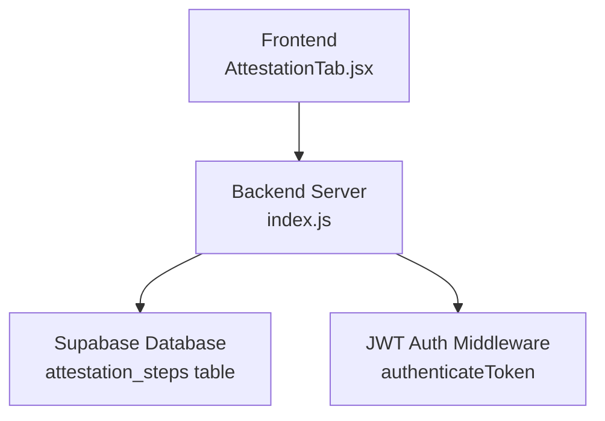
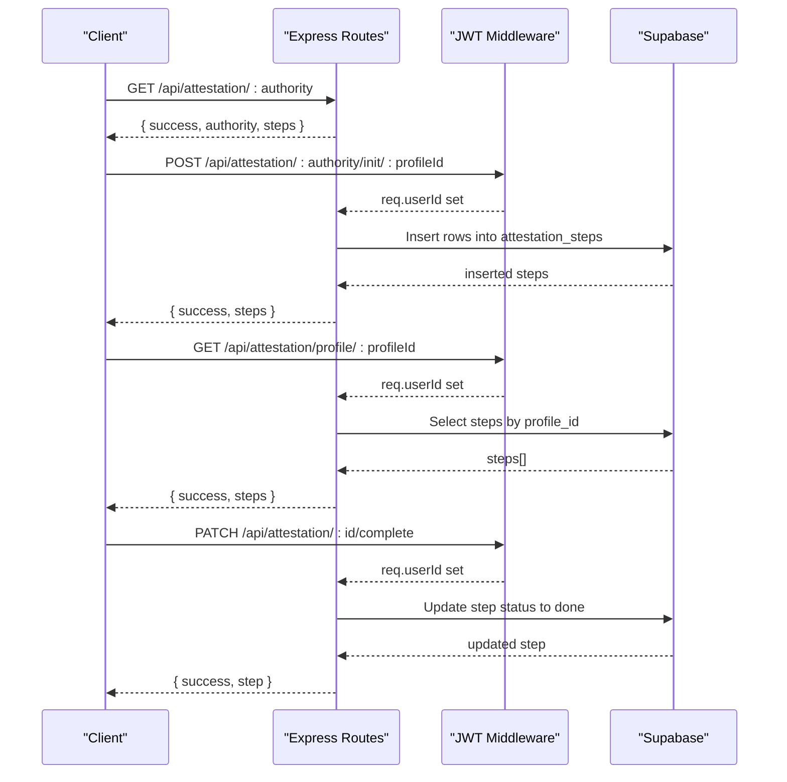
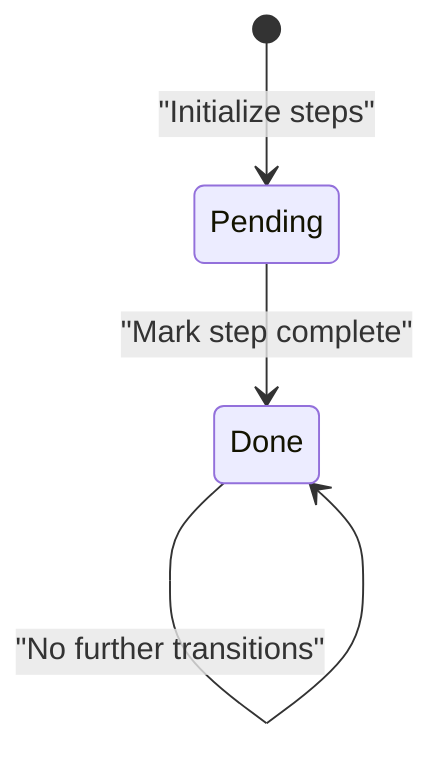
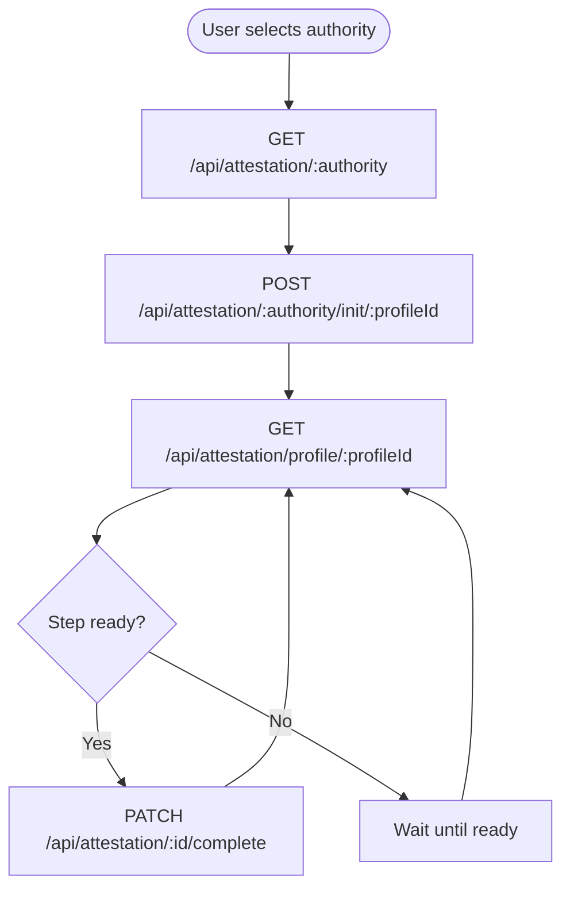
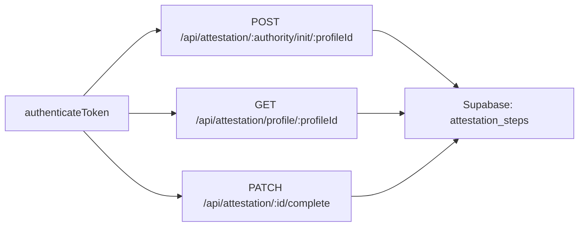

# Attestation Workflow API

<cite>
**Referenced Files in This Document**
- [index.js](file://aischolarpath-backend-main/aischolarpath-backend-main/index.js)
- [AttestationTab.jsx](file://scholarpath-frontend (2)/scholarpath/src/pages/AttestationTab.jsx)
- [mockData.js](file://scholarpath-frontend (2)/scholarpath/src/data/mockData.js)
</cite>

## Table of Contents
1. [Introduction](#introduction)
2. [Project Structure](#project-structure)
3. [Core Components](#core-components)
4. [Architecture Overview](#architecture-overview)
5. [Detailed Component Analysis](#detailed-component-analysis)
6. [Dependency Analysis](#dependency-analysis)
7. [Performance Considerations](#performance-considerations)
8. [Troubleshooting Guide](#troubleshooting-guide)
9. [Conclusion](#conclusion)

## Introduction
This document provides detailed API documentation for the document attestation workflow endpoints under /api/attestation/*. It covers:
- Retrieving step-by-step attestation guides for HEC, IBCC, and MOFA authorities
- Initializing tracked steps for a specific authority and profile
- Retrieving all tracked attestation steps with progress tracking for a profile
- Marking individual steps as completed
It also explains workflow states, step progression logic, authority-specific procedures, and integration patterns for document verification processes.

## Project Structure
The attestation workflow is implemented in the backend Express application and referenced by the frontend UI. The core implementation resides in a single server file that defines routes, middleware, and data access to Supabase. The frontend includes an Attestation tab that displays static guidance and can be extended to call these APIs.

**Diagram sources**
- [index.js:32-47](file://aischolarpath-backend-main/aischolarpath-backend-main/index.js#L32-L47)
- [index.js:427-517](file://aischolarpath-backend-main/aischolarpath-backend-main/index.js#L427-L517)
- [AttestationTab.jsx:1-72](file://scholarpath-frontend (2)/scholarpath/src/pages/AttestationTab.jsx#L1-L72)

**Section sources**
- [index.js:1-59](file://aischolarpath-backend-main/aischolarpath-backend-main/index.js#L1-L59)
- [AttestationTab.jsx:1-72](file://scholarpath-frontend (2)/scholarpath/src/pages/AttestationTab.jsx#L1-L72)

## Core Components
- Authority guide lookup: Returns predefined step-by-step instructions per authority (HEC, IBCC, MOFA).
- Step initialization: Creates tracked steps for a profile based on the selected authority’s guide.
- Progress retrieval: Lists all tracked steps for a profile, ordered by authority and step order.
- Step completion: Marks a specific step as done after ownership validation.

Key behaviors:
- All mutating or profile-scoped endpoints require authentication via JWT token.
- Steps are stored in a dedicated table and associated with a profile and authority.
- Step status transitions from pending to done; no other transitions are enforced by the endpoint.

**Section sources**
- [index.js:404-435](file://aischolarpath-backend-main/aischolarpath-backend-main/index.js#L404-L435)
- [index.js:437-464](file://aischolarpath-backend-main/aischolarpath-backend-main/index.js#L437-L464)
- [index.js:467-486](file://aischolarpath-backend-main/aischolarpath-backend-main/index.js#L467-L486)
- [index.js:489-517](file://aischolarpath-backend-main/aischolarpath-backend-main/index.js#L489-L517)

## Architecture Overview
The attestation workflow follows a simple state machine driven by user actions:
- A user selects an authority and retrieves its guide.
- The user initializes tracked steps for their profile.
- The user views progress across all authorities.
- The user marks steps as completed as they finish each task.

**Diagram sources**
- [index.js:427-435](file://aischolarpath-backend-main/aischolarpath-backend-main/index.js#L427-L435)
- [index.js:437-464](file://aischolarpath-backend-main/aischolarpath-backend-main/index.js#L437-L464)
- [index.js:467-486](file://aischolarpath-backend-main/aischolarpath-backend-main/index.js#L467-L486)
- [index.js:489-517](file://aischolarpath-backend-main/aischolarpath-backend-main/index.js#L489-L517)

## Detailed Component Analysis

### GET /api/attestation/:authority
Purpose: Retrieve the authoritative, step-by-step guide for a given authority.

- Path parameters:
  - authority: One of HEC, IBCC, MOFA (case-insensitive; normalized to uppercase)
- Authentication: Not required
- Success response:
  - success: boolean
  - authority: string (normalized)
  - steps: array of step objects with step_order and description
- Error responses:
  - 404: Unknown authority
  - 500: Database or server error (if any)

Authority-specific procedures:
- HEC: For Bachelor’s and Master’s degrees and transcripts
- IBCC: For Matric (SSC) and Intermediate (HSSC) certificates
- MOFA: Final attestation/apostille after HEC or IBCC

Integration notes:
- Frontend currently renders static guidance from mock data but can call this endpoint to fetch live steps.
- Use this endpoint to populate UI checklists before initializing tracked steps.

**Section sources**
- [index.js:404-435](file://aischolarpath-backend-main/aischolarpath-backend-main/index.js#L404-L435)
- [mockData.js:256-309](file://scholarpath-frontend (2)/scholarpath/src/data/mockData.js#L256-L309)
- [AttestationTab.jsx:1-72](file://scholarpath-frontend (2)/scholarpath/src/pages/AttestationTab.jsx#L1-L72)

### POST /api/attestation/:authority/init/:profileId
Purpose: Initialize tracked steps for a specific authority and profile.

- Path parameters:
  - authority: One of HEC, IBCC, MOFA
  - profileId: The authenticated user’s profile ID
- Authentication: Required (JWT)
- Behavior:
  - Validates that profileId matches the authenticated user
  - Looks up the authority guide
  - Inserts one row per step into attestation_steps with status 'pending'
- Success response:
  - success: boolean
  - steps: array of created step records
- Error responses:
  - 403: Not authorized (profileId mismatch)
  - 404: Unknown authority
  - 500: Database or server error

Workflow impact:
- Creates a fresh set of tracked steps per authority for the profile
- Enables subsequent progress tracking and completion updates

**Section sources**
- [index.js:437-464](file://aischolarpath-backend-main/aischolarpath-backend-main/index.js#L437-L464)

### GET /api/attestation/profile/:profileId
Purpose: Retrieve all tracked attestation steps for a profile with progress tracking.

- Path parameters:
  - profileId: The authenticated user’s profile ID
- Authentication: Required (JWT)
- Behavior:
  - Validates that profileId matches the authenticated user
  - Retrieves all steps for the profile, ordered by authority then step_order
- Success response:
  - success: boolean
  - steps: array of step records including id, authority, step_order, step_description, status
- Error responses:
  - 403: Not authorized (profileId mismatch)
  - 500: Database or server error

Progress calculation:
- Clients can compute progress per authority by counting steps with status 'done' vs total steps
- Overall progress can be computed across all authorities

**Section sources**
- [index.js:467-486](file://aischolarpath-backend-main/aischolarpath-backend-main/index.js#L467-L486)

### PATCH /api/attestation/:id/complete
Purpose: Mark an individual step as completed.

- Path parameters:
  - id: The step record ID to complete
- Authentication: Required (JWT)
- Behavior:
  - Fetches the step to verify existence and ownership
  - Updates status to 'done'
- Success response:
  - success: boolean
  - step: updated step record
- Error responses:
  - 404: Step not found
  - 403: Not authorized (step belongs to another profile)
  - 500: Database or server error

State transition:
- Only transitions from 'pending' to 'done' are supported by this endpoint
- Idempotent: marking an already 'done' step again will update it to 'done'

**Section sources**
- [index.js:489-517](file://aischolarpath-backend-main/aischolarpath-backend-main/index.js#L489-L517)

### Workflow States and Step Progression Logic
States:
- pending: Initial state when steps are created
- done: Final state after completing a step

Progression rules:
- Steps are created in 'pending' during initialization
- Users mark steps as 'done' individually
- No automatic progression between steps; users control completion
- Ordering is preserved via step_order within each authority

**Diagram sources**
- [index.js:437-464](file://aischolarpath-backend-main/aischolarpath-backend-main/index.js#L437-L464)
- [index.js:489-517](file://aischolarpath-backend-main/aischolarpath-backend-main/index.js#L489-L517)

### Authority-Specific Procedures
- HEC: Degree and transcript attestation process
- IBCC: Matric and Intermediate certificate equivalence and attestation
- MOFA: Final apostille after HEC or IBCC

These procedures are defined in the backend’s static guide and can be retrieved via the GET endpoint.

**Section sources**
- [index.js:404-435](file://aischolarpath-backend-main/aischolarpath-backend-main/index.js#L404-L435)
- [mockData.js:256-309](file://scholarpath-frontend (2)/scholarpath/src/data/mockData.js#L256-L309)

### Integration Patterns for Document Verification Processes
- Frontend display: Use GET /api/attestation/:authority to render official steps
- Initialization: Call POST /api/attestation/:authority/init/:profileId to start tracking
- Progress dashboard: Use GET /api/attestation/profile/:profileId to show current status
- Completion: Use PATCH /api/attestation/:id/complete to mark tasks done
- Security: Always include Authorization header with valid JWT for protected endpoints

**Diagram sources**
- [index.js:427-435](file://aischolarpath-backend-main/aischolarpath-backend-main/index.js#L427-L435)
- [index.js:437-464](file://aischolarpath-backend-main/aischolarpath-backend-main/index.js#L437-L464)
- [index.js:467-486](file://aischolarpath-backend-main/aischolarpath-backend-main/index.js#L467-L486)
- [index.js:489-517](file://aischolarpath-backend-main/aischolarpath-backend-main/index.js#L489-L517)

## Dependency Analysis
- Authentication dependency: All protected endpoints rely on the JWT middleware to set req.userId
- Data dependency: Endpoints read/write to the attestation_steps table in Supabase
- Authority guide dependency: Static guide data drives step creation and retrieval

**Diagram sources**
- [index.js:32-47](file://aischolarpath-backend-main/aischolarpath-backend-main/index.js#L32-L47)
- [index.js:437-517](file://aischolarpath-backend-main/aischolarpath-backend-main/index.js#L437-L517)

**Section sources**
- [index.js:32-47](file://aischolarpath-backend-main/aischolarpath-backend-main/index.js#L32-L47)
- [index.js:437-517](file://aischolarpath-backend-main/aischolarpath-backend-main/index.js#L437-L517)

## Performance Considerations
- Batch operations: Initialization inserts multiple rows at once; ensure database indexes on profile_id and authority for efficient queries
- Caching: Authority guides are static and can be cached client-side to reduce repeated requests
- Rate limiting: Consider adding rate limits if many clients initialize or query frequently
- Pagination: If attestation steps grow large, consider pagination for profile queries

[No sources needed since this section provides general guidance]

## Troubleshooting Guide
Common issues and resolutions:
- 401 Unauthorized: Missing or invalid JWT token; ensure Authorization header is set correctly
- 403 Forbidden: profileId does not match authenticated user; verify token claims and request parameters
- 404 Not Found: Unknown authority or step not found; validate inputs and IDs
- 500 Server Error: Database errors or unexpected exceptions; check logs and environment configuration

Authentication flow:
- Ensure JWT_SECRET is configured
- Verify token expiration and signing algorithm

Database connectivity:
- Confirm SUPABASE_URL and SUPABASE_KEY are set
- Validate table schema exists for attestation_steps

**Section sources**
- [index.js:32-47](file://aischolarpath-backend-main/aischolarpath-backend-main/index.js#L32-L47)
- [index.js:427-517](file://aischolarpath-backend-main/aischolarpath-backend-main/index.js#L427-L517)

## Conclusion
The attestation workflow API provides a clear, secure, and extensible system for managing document attestation processes across HEC, IBCC, and MOFA authorities. By combining static guidance with dynamic step tracking, users can follow official procedures while monitoring their progress. The endpoints enforce proper authorization and maintain a simple state model that supports real-world workflows.

[No sources needed since this section summarizes without analyzing specific files]