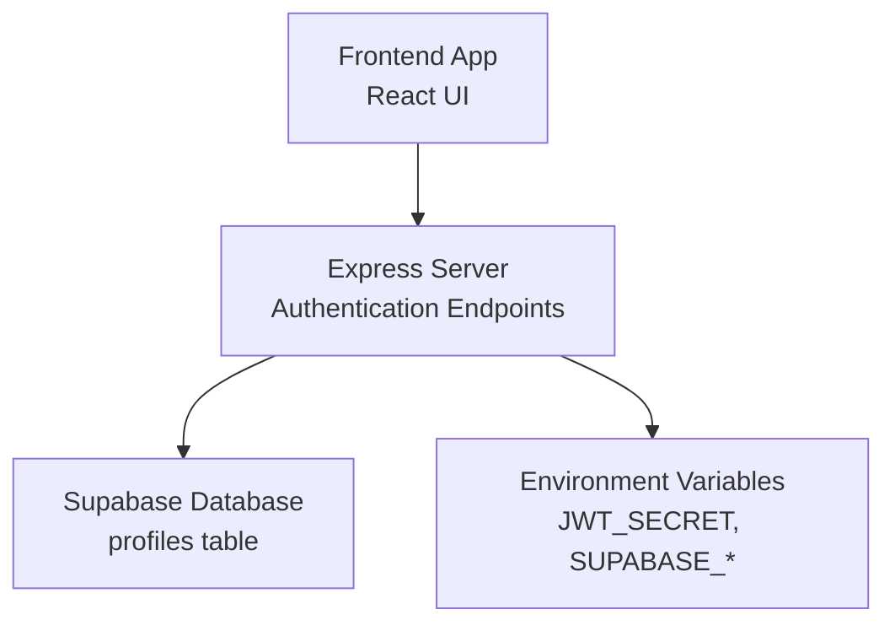
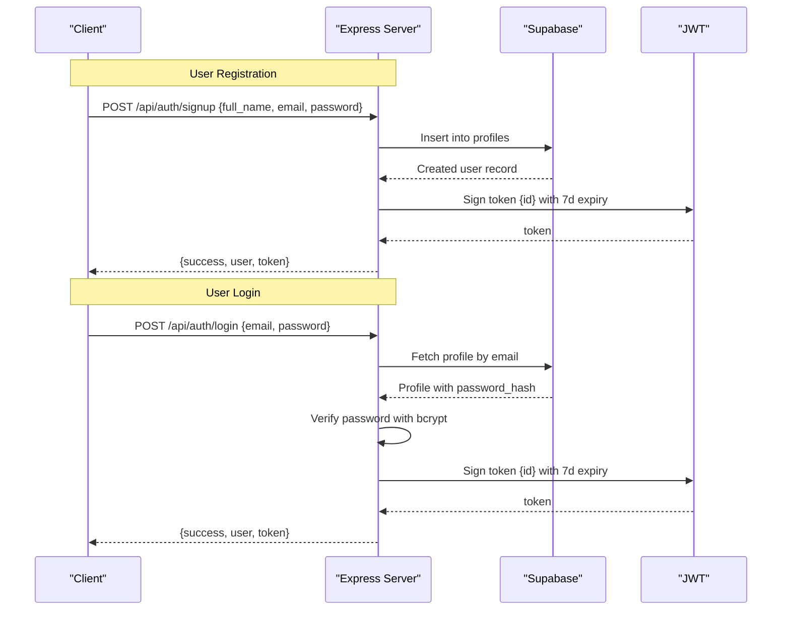
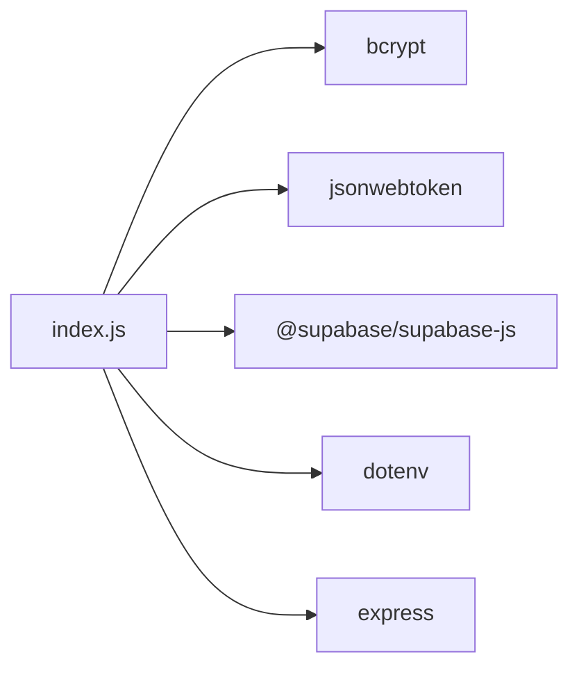

# Authentication API

<cite>
**Referenced Files in This Document**
- [index.js](file://aischolarpath-backend-main/aischolarpath-backend-main/index.js)
- [package.json](file://aischolarpath-backend-main/aischolarpath-backend-main/package.json)
- [AuthModal.jsx](file://scholarpath-frontend (2)/scholarpath/src/components/AuthModal.jsx)
</cite>

## Table of Contents
1. [Introduction](#introduction)
2. [Project Structure](#project-structure)
3. [Core Components](#core-components)
4. [Architecture Overview](#architecture-overview)
5. [Detailed Component Analysis](#detailed-component-analysis)
6. [Dependency Analysis](#dependency-analysis)
7. [Performance Considerations](#performance-considerations)
8. [Troubleshooting Guide](#troubleshooting-guide)
9. [Conclusion](#conclusion)
10. [Appendices](#appendices)

## Introduction
This document provides comprehensive API documentation for the authentication endpoints used by ScholarPathAI. It covers user registration and login, including request/response schemas, error handling, token generation and verification, and security considerations such as password hashing and middleware-based authorization. It also includes integration guidance for frontend applications.

## Project Structure
The backend is an Express application that exposes REST endpoints for authentication and other features. The authentication logic is implemented in a single server file with environment-driven configuration and Supabase as the data store. The frontend contains an authentication modal component that currently uses mock behavior but can be integrated with the backend endpoints documented here.

**Diagram sources**
- [index.js:1-54](file://aischolarpath-backend-main/aischolarpath-backend-main/index.js#L1-L54)
- [package.json:1-14](file://aischolarpath-backend-main/aischolarpath-backend-main/package.json#L1-L14)

**Section sources**
- [index.js:1-54](file://aischolarpath-backend-main/aischolarpath-backend-main/index.js#L1-L54)
- [package.json:1-14](file://aischolarpath-backend-main/aischolarpath-backend-main/package.json#L1-L14)

## Core Components
- Authentication endpoints:
  - POST /api/auth/signup: Creates a new user profile and returns a JWT.
  - POST /api/auth/login: Authenticates a user and returns a JWT.
- Security middleware:
  - authenticateToken: Validates JWT from Authorization header and attaches user id to request.
- Data layer:
  - Supabase client configured via environment variables; profiles stored in a database table.

Key implementation references:
- Signup flow: [index.js:519-540](file://aischolarpath-backend-main/aischolarpath-backend-main/index.js#L519-L540)
- Login flow: [index.js:543-573](file://aischolarpath-backend-main/aischolarpath-backend-main/index.js#L543-L573)
- Token verification middleware: [index.js:32-47](file://aischolarpath-backend-main/aischolarpath-backend-main/index.js#L32-L47)
- Environment validation: [index.js:4-10](file://aischolarpath-backend-main/aischolarpath-backend-main/index.js#L4-L10)

**Section sources**
- [index.js:32-47](file://aischolarpath-backend-main/aischolarpath-backend-main/index.js#L32-L47)
- [index.js:519-573](file://aischolarpath-backend-main/aischolarpath-backend-main/index.js#L519-L573)
- [index.js:4-10](file://aischolarpath-backend-main/aischolarpath-backend-main/index.js#L4-L10)

## Architecture Overview
The authentication architecture follows a standard pattern:
- Client sends credentials to signup or login endpoints.
- Server validates input, hashes or verifies passwords using bcrypt, and issues a JWT with a 7-day expiration signed with a secret from environment variables.
- Protected routes require a valid JWT provided in the Authorization header; the server verifies it and attaches the decoded user id to the request context.

**Diagram sources**
- [index.js:519-573](file://aischolarpath-backend-main/aischolarpath-backend-main/index.js#L519-L573)
- [index.js:32-47](file://aischolarpath-backend-main/aischolarpath-backend-main/index.js#L32-L47)

## Detailed Component Analysis

### POST /api/auth/signup
Purpose: Register a new user and issue an authenticated session token.

Request
- Method: POST
- Path: /api/auth/signup
- Content-Type: application/json
- Body schema:
  - full_name: string (optional based on current validation)
  - email: string (required)
  - password: string (required)

Response
- Success (200):
  - success: boolean
  - user: object containing at least id, full_name, email
  - token: string (JWT)
- Validation failure (400):
  - success: boolean
  - error: string describing missing fields

Error Handling
- Missing required fields return 400 with a descriptive message.
- Database errors return 500 with error details.

Security Notes
- Passwords are hashed before storage using bcrypt with a salt rounds parameter.
- A JWT is generated with a 7-day expiration using a secret from environment variables.

Integration Example (conceptual)
- Frontend collects full_name, email, password and sends a JSON POST to /api/auth/signup.
- On success, store the returned token securely (e.g., in memory or secure storage) and include it in subsequent requests via the Authorization header.

**Section sources**
- [index.js:519-540](file://aischolarpath-backend-main/aischolarpath-backend-main/index.js#L519-L540)

### POST /api/auth/login
Purpose: Authenticate a user and issue an authenticated session token.

Request
- Method: POST
- Path: /api/auth/login
- Content-Type: application/json
- Body schema:
  - email: string (required)
  - password: string (required)

Response
- Success (200):
  - success: boolean
  - user: object containing at least id, full_name, email
  - token: string (JWT)
- Authentication failure (401):
  - success: boolean
  - error: string indicating invalid credentials

Processing Flow
- Validate presence of email and password.
- Retrieve user profile by email from the database.
- Compare provided password with stored hash using bcrypt.
- If valid, sign a JWT with user id and 7-day expiration.
- Return user info and token.

Error Handling
- Missing fields return 400.
- Invalid credentials return 401.
- Database errors return 500.

Integration Example (conceptual)
- Frontend submits email and password to /api/auth/login.
- On success, persist the token and attach it to future requests using the Authorization header.

**Section sources**
- [index.js:543-573](file://aischolarpath-backend-main/aischolarpath-backend-main/index.js#L543-L573)

### Authentication Middleware: authenticateToken
Purpose: Protect routes by validating JWT tokens.

Behavior
- Reads Authorization header and extracts the token.
- Verifies the token using the configured secret.
- On success, attaches decoded user id to req.userId and proceeds.
- On failure or missing token, returns appropriate HTTP status with error message.

Usage
- Applied to protected routes (e.g., profile updates, matches).

Error Responses
- 401 if no token is provided.
- 403 if token is invalid or expired.

**Section sources**
- [index.js:32-47](file://aischolarpath-backend-main/aischolarpath-backend-main/index.js#L32-L47)

### Security Considerations
- Password Hashing: Passwords are hashed using bcrypt before being stored in the database. Never store plaintext passwords.
- Token Management:
  - Tokens are signed with a secret from environment variables.
  - Tokens expire after 7 days.
  - Clients should store tokens securely and send them in the Authorization header for protected endpoints.
- Input Validation: Basic presence checks are performed for required fields; consider adding stricter validation (e.g., email format, password strength).
- Environment Configuration: Required environment variables (SUPABASE_URL, SUPABASE_KEY, JWT_SECRET) are validated at startup.

**Section sources**
- [index.js:4-10](file://aischolarpath-backend-main/aischolarpath-backend-main/index.js#L4-L10)
- [index.js:32-47](file://aischolarpath-backend-main/aischolarpath-backend-main/index.js#L32-L47)
- [index.js:519-573](file://aischolarpath-backend-main/aischolarpath-backend-main/index.js#L519-L573)

## Dependency Analysis
The authentication system depends on:
- Express for routing and middleware.
- bcrypt for password hashing and comparison.
- jsonwebtoken for signing and verifying JWTs.
- @supabase/supabase-js for database operations.
- dotenv for loading environment variables.

**Diagram sources**
- [package.json:1-14](file://aischolarpath-backend-main/aischolarpath-backend-main/package.json#L1-L14)
- [index.js:1-27](file://aischolarpath-backend-main/aischolarpath-backend-main/index.js#L1-L27)

**Section sources**
- [package.json:1-14](file://aischolarpath-backend-main/aischolarpath-backend-main/package.json#L1-L14)
- [index.js:1-27](file://aischolarpath-backend-main/aischolarpath-backend-main/index.js#L1-L27)

## Performance Considerations
- Password hashing cost: bcrypt salt rounds affect performance; ensure balance between security and latency.
- Token size: Keep payloads minimal to reduce overhead.
- Database queries: Minimize unnecessary reads/writes during auth flows.
- Connection pooling: Ensure Supabase client is configured appropriately for your workload.

[No sources needed since this section provides general guidance]

## Troubleshooting Guide
Common Issues and Resolutions
- Missing environment variables:
  - Symptom: Server fails to start.
  - Resolution: Provide SUPABASE_URL, SUPABASE_KEY, and JWT_SECRET in environment configuration.
- Invalid or missing token:
  - Symptom: 401 or 403 responses on protected routes.
  - Resolution: Ensure Authorization header includes a valid, non-expired token.
- Validation errors:
  - Symptom: 400 responses on signup/login.
  - Resolution: Include required fields (email, password) in request body.
- Database errors:
  - Symptom: 500 responses with error messages.
  - Resolution: Check Supabase connectivity and permissions; inspect error details.

**Section sources**
- [index.js:4-10](file://aischolarpath-backend-main/aischolarpath-backend-main/index.js#L4-L10)
- [index.js:32-47](file://aischolarpath-backend-main/aischolarpath-backend-main/index.js#L32-L47)
- [index.js:519-573](file://aischolarpath-backend-main/aischolarpath-backend-main/index.js#L519-L573)

## Conclusion
The authentication API provides secure user registration and login with robust password hashing and JWT-based session management. The middleware enforces token validation for protected resources. Integrating the frontend involves sending credentials to the appropriate endpoints, storing tokens securely, and attaching them to subsequent requests. Proper environment configuration and error handling are essential for reliable operation.

[No sources needed since this section summarizes without analyzing specific files]

## Appendices

### Request/Response Examples (Conceptual)
- Signup
  - Request: POST /api/auth/signup
    - Body: { "full_name": "Jane Doe", "email": "jane@example.com", "password": "securePassword123" }
  - Response (200):
    - { "success": true, "user": { "id": "...", "full_name": "Jane Doe", "email": "jane@example.com" }, "token": "eyJ..." }
  - Response (400):
    - { "success": false, "error": "Email and password are required" }

- Login
  - Request: POST /api/auth/login
    - Body: { "email": "jane@example.com", "password": "securePassword123" }
  - Response (200):
    - { "success": true, "user": { "id": "...", "full_name": "Jane Doe", "email": "jane@example.com" }, "token": "eyJ..." }
  - Response (401):
    - { "success": false, "error": "Invalid email or password" }

[No sources needed since this section provides conceptual examples]

### Frontend Integration Pattern
- Collect user inputs in the AuthModal component.
- On submit, call the appropriate endpoint (/api/auth/signup or /api/auth/login).
- Store the returned token securely and include it in the Authorization header for subsequent requests.
- Handle errors by displaying user-friendly messages based on HTTP status codes.

**Section sources**
- [AuthModal.jsx:1-84](file://scholarpath-frontend (2)/scholarpath/src/components/AuthModal.jsx#L1-L84)