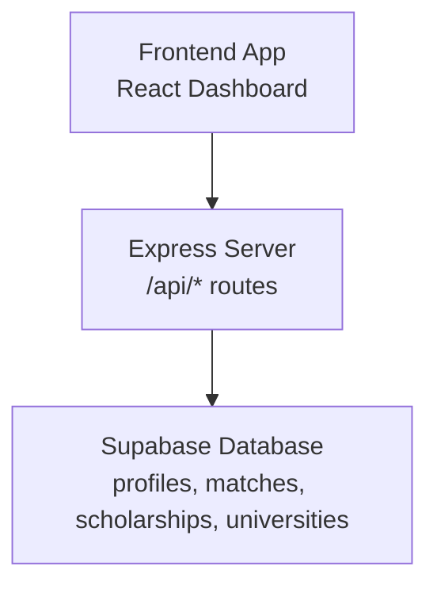
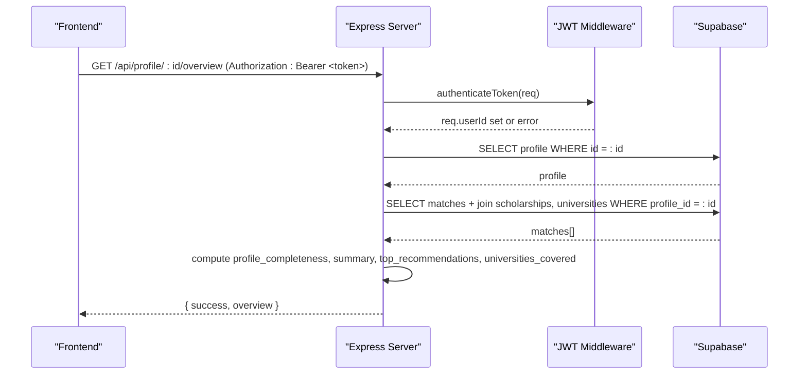
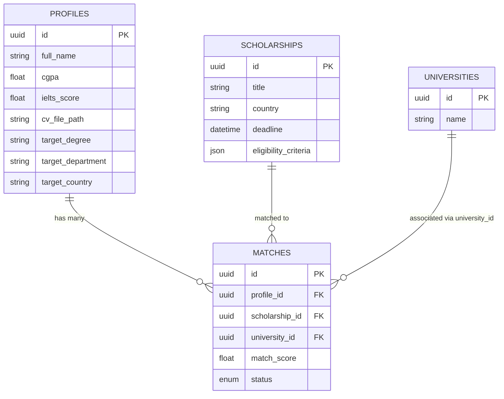
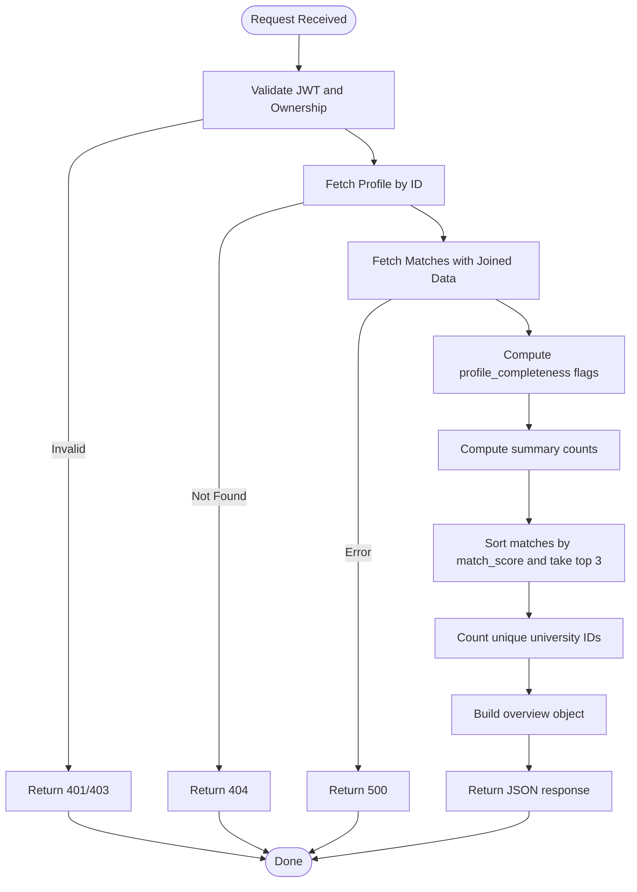
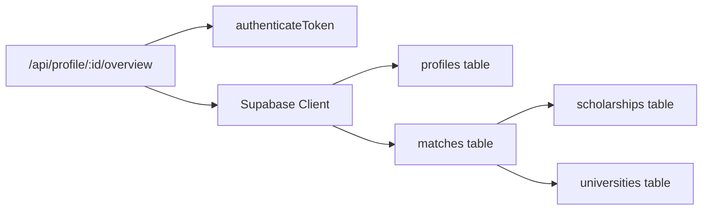

# Dashboard & Analytics API

<cite>
**Referenced Files in This Document**
- [index.js](file://aischolarpath-backend-main/aischolarpath-backend-main/index.js)
- [Dashboard.jsx](file://scholarpath-frontend (2)/scholarpath/src/pages/Dashboard.jsx)
- [mockData.js](file://scholarpath-frontend (2)/scholarpath/src/data/mockData.js)
</cite>

## Table of Contents
1. [Introduction](#introduction)
2. [Project Structure](#project-structure)
3. [Core Components](#core-components)
4. [Architecture Overview](#architecture-overview)
5. [Detailed Component Analysis](#detailed-component-analysis)
6. [Dependency Analysis](#dependency-analysis)
7. [Performance Considerations](#performance-considerations)
8. [Troubleshooting Guide](#troubleshooting-guide)
9. [Conclusion](#conclusion)

## Introduction
This document provides API documentation for the dashboard and analytics endpoints, focusing on the GET /api/profile/:id/overview endpoint. It explains how the endpoint returns comprehensive profile statistics including profile completeness metrics, summary counts of eligible/missing/not eligible scholarships, top recommendations sorted by match score, and university coverage analysis. It also details data aggregation logic, performance considerations for large datasets, and caching strategies for frequently accessed dashboard data.

## Project Structure
The backend is an Express application that exposes REST endpoints and integrates with Supabase for data access. The frontend is a React application that renders the dashboard UI and currently uses mock data; it can be wired to call the overview endpoint to display live analytics.

**Diagram sources**
- [index.js:29-54](file://aischolarpath-backend-main/aischolarpath-backend-main/index.js#L29-L54)

**Section sources**
- [index.js:1-54](file://aischolarpath-backend-main/aischolarpath-backend-main/index.js#L1-L54)
- [Dashboard.jsx:1-21](file://scholarpath-frontend (2)/scholarpath/src/pages/Dashboard.jsx#L1-L21)

## Core Components
- Authentication middleware validates JWT tokens and attaches the user ID to requests.
- The overview endpoint retrieves the authenticated user’s profile and their scholarship matches, then aggregates dashboard metrics.
- Related endpoints include profile retrieval, matching execution, and shortlist management.

Key responsibilities:
- Enforce authorization per profile.
- Fetch profile and related matches efficiently.
- Compute completeness flags, summary counts, top recommendations, and university coverage.

**Section sources**
- [index.js:32-47](file://aischolarpath-backend-main/aischolarpath-backend-main/index.js#L32-L47)
- [index.js:694-749](file://aischolarpath-backend-main/aischolarpath-backend-main/index.js#L694-L749)

## Architecture Overview
The overview endpoint follows a secure request flow: client sends a JWT-authenticated GET request, server validates identity, queries profile and matches from Supabase, computes aggregated dashboard data, and returns a structured JSON response.

**Diagram sources**
- [index.js:32-47](file://aischolarpath-backend-main/aischolarpath-backend-main/index.js#L32-L47)
- [index.js:694-749](file://aischolarpath-backend-main/aischolarpath-backend-main/index.js#L694-L749)

## Detailed Component Analysis

### Endpoint: GET /api/profile/:id/overview
Purpose:
- Provide a comprehensive dashboard snapshot for the authenticated user’s profile.

Authentication:
- Requires a valid JWT token in the Authorization header.
- Ensures the requested profile belongs to the authenticated user.

Request:
- Method: GET
- Path: /api/profile/:id/overview
- Headers: Authorization: Bearer <jwt_token>
- Path parameter:
  - id: string — the profile identifier (must match the authenticated user)

Response structure:
- success: boolean
- overview: object
  - profile_completeness: object
    - has_cgpa: boolean — true if CGPA is present
    - has_ielts: boolean — true if IELTS score is present
    - has_cv: boolean — true if CV file path is present
    - has_target_degree: boolean — true if target degree is present
  - summary: object
    - total_scholarships_checked: number — total matches for this profile
    - eligible: number — count where status equals Eligible
    - missing_requirements: number — count where status equals Missing Requirements
    - not_eligible: number — count where status equals Not Eligible
    - universities_covered: number — count of unique university IDs among matches
  - top_recommendations: array — up to three highest-scoring matches sorted by match_score descending

Error responses:
- 401: No token provided
- 403: Invalid/expired token or unauthorized profile access
- 404: Profile not found
- 500: Database or processing error

Data aggregation logic:
- Profile completeness flags are derived directly from presence of profile fields.
- Summary counts are computed by filtering matches by status.
- Top recommendations are obtained by sorting matches by match_score and taking the top three.
- University coverage is calculated by counting distinct university IDs across matches.

Performance characteristics:
- Two database reads: one for profile, one for matches with joined scholarship and university fields.
- Sorting and slicing occur in memory; for very large match sets, consider pagination or server-side ordering.
- Unique university count uses a Set-based approach for O(n) complexity.

Caching strategy recommendations:
- Cache the overview response keyed by profile_id with a short TTL (e.g., 1–5 minutes) since underlying data changes infrequently.
- Invalidate cache when:
  - A new match run completes for the profile.
  - Profile fields change (e.g., CGPA, IELTS, CV upload).
- Use in-memory cache for development or a distributed cache (e.g., Redis) for production.

Example usage notes:
- Frontend should call this endpoint after login and store the token in headers.
- Display profile strength indicators using profile_completeness.
- Show summary cards for eligible/missing/not eligible counts.
- Render top_recommendations as a ranked list.

**Section sources**
- [index.js:32-47](file://aischolarpath-backend-main/aischolarpath-backend-main/index.js#L32-L47)
- [index.js:694-749](file://aischolarpath-backend-main/aischolarpath-backend-main/index.js#L694-L749)

### Related Endpoints and Data Flow

#### Run Matching: POST /api/profile/:id/match-scholarships
Purpose:
- Execute matching logic against active scholarships and persist results into matches.

Behavior:
- Validates ownership of profile.
- Retrieves profile and active scholarships (optionally filtered by target country).
- Computes eligibility evidence, status, and match_score per scholarship.
- Clears previous matches for the profile and inserts fresh results.

Impact on overview:
- Running this endpoint updates the dataset used by the overview endpoint, potentially invalidating cached overview data.

**Section sources**
- [index.js:575-673](file://aischolarpath-backend-main/aischolarpath-backend-main/index.js#L575-L673)

#### Retrieve Matches: GET /api/profile/:id/matches
Purpose:
- Return stored matches for a profile, ordered by match_score descending, with enriched scholarship and university details.

Usage:
- Useful for detailed views beyond the overview’s top three recommendations.

**Section sources**
- [index.js:676-692](file://aischolarpath-backend-main/aischolarpath-backend-main/index.js#L676-L692)

#### Profile Retrieval: GET /api/profile/:id
Purpose:
- Fetch full profile details for the authenticated user.

Usage:
- Supports profile editing and completeness checks.

**Section sources**
- [index.js:94-110](file://aischolarpath-backend-main/aischolarpath-backend-main/index.js#L94-L110)

### Class and Data Model Relationships
The overview endpoint relies on these entities and relationships:

**Diagram sources**
- [index.js:694-749](file://aischolarpath-backend-main/aischolarpath-backend-main/index.js#L694-L749)

### Processing Logic Flowchart
Overview endpoint processing steps:

**Diagram sources**
- [index.js:694-749](file://aischolarpath-backend-main/aischolarpath-backend-main/index.js#L694-L749)

## Dependency Analysis
- Authentication dependency: All protected routes rely on the authenticateToken middleware which verifies JWT and sets req.userId.
- Database dependencies: Supabase client configured with environment variables for URL and key.
- External integrations: None beyond Supabase for this endpoint.

**Diagram sources**
- [index.js:29-54](file://aischolarpath-backend-main/aischolarpath-backend-main/index.js#L29-L54)
- [index.js:694-749](file://aischolarpath-backend-main/aischolarpath-backend-main/index.js#L694-L749)

**Section sources**
- [index.js:29-54](file://aischolarpath-backend-main/aischolarpath-backend-main/index.js#L29-L54)
- [index.js:694-749](file://aischolarpath-backend-main/aischolarpath-backend-main/index.js#L694-L749)

## Performance Considerations
- Query efficiency:
  - The endpoint performs two queries: profile lookup and matches with joins. Ensure indexes exist on profiles.id and matches.profile_id.
  - Joins select only necessary fields to reduce payload size.
- In-memory operations:
  - Sorting matches by match_score and slicing top three is efficient for typical dataset sizes. For very large match sets, consider server-side ordering and limiting before fetching all rows.
- Caching:
  - Implement short-lived caching for overview responses to reduce repeated computations and database load.
  - Invalidate cache on profile updates or when running new matches.
- Connection pooling:
  - The server configures an HTTP agent with connection limits and timeouts; ensure Supabase client benefits from connection reuse.

[No sources needed since this section provides general guidance]

## Troubleshooting Guide
Common issues and resolutions:
- 401 Unauthorized:
  - Cause: Missing or malformed Authorization header.
  - Resolution: Include Authorization: Bearer <jwt_token>.
- 403 Forbidden:
  - Cause: Token is invalid/expired or requesting another user’s profile.
  - Resolution: Refresh token and ensure id matches req.userId.
- 404 Not Found:
  - Cause: Profile does not exist.
  - Resolution: Verify profile id and existence in database.
- 500 Internal Server Error:
  - Cause: Database query failure or unexpected error.
  - Resolution: Check Supabase credentials, network connectivity, and logs.

Operational tips:
- Validate environment variables at startup to catch configuration errors early.
- Log errors with context (profile id, user id) to aid debugging.

**Section sources**
- [index.js:32-47](file://aischolarpath-backend-main/aischolarpath-backend-main/index.js#L32-L47)
- [index.js:694-749](file://aischolarpath-backend-main/aischolarpath-backend-main/index.js#L694-L749)

## Conclusion
The GET /api/profile/:id/overview endpoint delivers a robust dashboard snapshot by combining profile completeness, aggregate scholarship match statistics, top recommendations, and university coverage insights. It enforces strict authentication, performs efficient data aggregation, and can be further optimized with caching and indexing. Integrating the frontend to call this endpoint will replace static mock data with live, personalized analytics for users.

[No sources needed since this section summarizes without analyzing specific files]