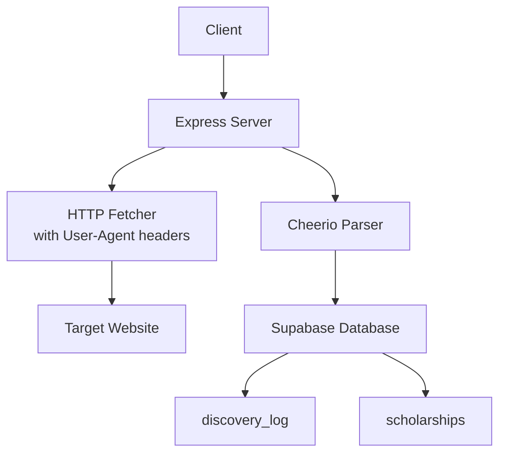
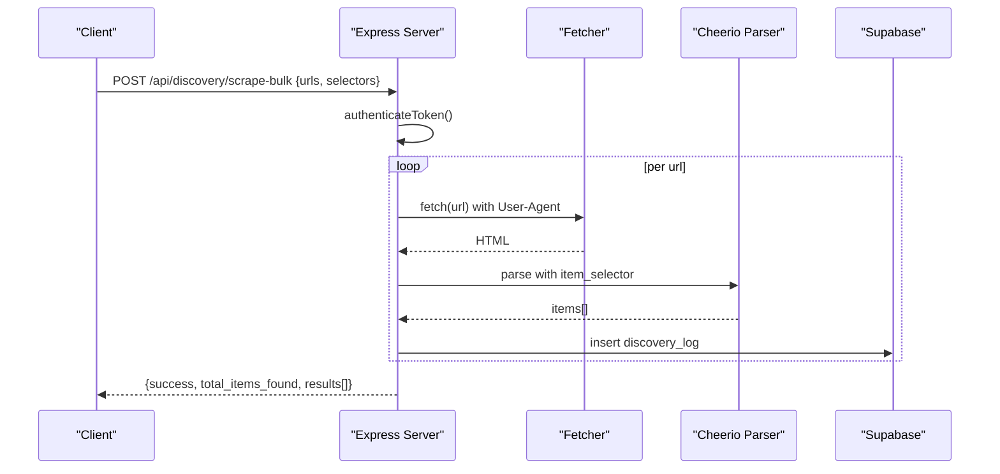
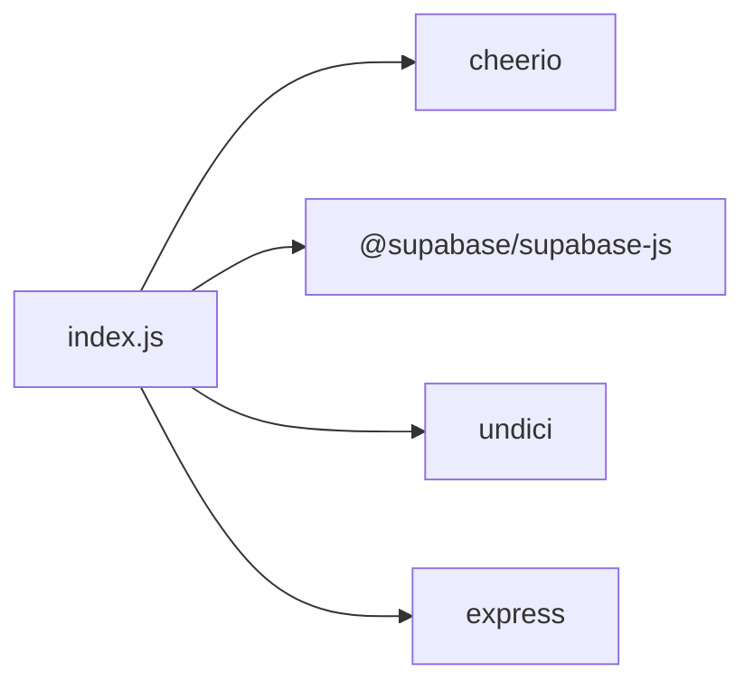

# Discovery & Scraping API

<cite>
**Referenced Files in This Document**
- [index.js](file://aischolarpath-backend-main/aischolarpath-backend-main/index.js)
- [package.json](file://aischolarpath-backend-main/aischolarpath-backend-main/package.json)
</cite>

## Table of Contents
1. [Introduction](#introduction)
2. [Project Structure](#project-structure)
3. [Core Components](#core-components)
4. [Architecture Overview](#architecture-overview)
5. [Detailed Component Analysis](#detailed-component-analysis)
6. [Dependency Analysis](#dependency-analysis)
7. [Performance Considerations](#performance-considerations)
8. [Troubleshooting Guide](#troubleshooting-guide)
9. [Conclusion](#conclusion)

## Introduction
This document provides API documentation for discovery and web scraping endpoints under /api/discovery/*. It covers bulk scraping operations to discover new scholarship opportunities from official sources using a Cheerio-based scraping framework. It details request parameters for target websites, selector strategies, rate limiting controls, response formats (extracted data structures, parsing results), error handling, retry mechanisms, timeout handling, and monitoring capabilities for long-running scraping operations.

## Project Structure
The backend is an Express application that exposes REST endpoints for authentication, profile management, scholarships, and discovery/scraping. The discovery endpoints are implemented in the main server file and rely on:
- Node’s fetch for HTTP requests
- Cheerio for HTML parsing
- Supabase for persistence (discovery logs, scholarships, etc.)
- An undici Agent configured with connection limits and timeouts

**Diagram sources**
- [index.js:1182-1243](file://aischolarpath-backend-main/aischolarpath-backend-main/index.js#L1182-L1243)
- [index.js:1258-1309](file://aischolarpath-backend-main/aischolarpath-backend-main/index.js#L1258-L1309)
- [index.js:1310-1390](file://aischolarpath-backend-main/aischolarpath-backend-main/index.js#L1310-L1390)
- [index.js:1391-1493](file://aischolarpath-backend-main/aischolarpath-backend-main/index.js#L1391-L1493)

**Section sources**
- [index.js:1-30](file://aischolarpath-backend-main/aischolarpath-backend-main/index.js#L1-L30)
- [package.json:1-14](file://aischolarpath-backend-main/aischolarpath-backend-main/package.json#L1-L14)

## Core Components
- Authentication middleware: All discovery endpoints require a valid JWT token via Authorization header.
- Scrapers:
  - Single-page scraper: extracts listing items by CSS selectors.
  - Bulk scraper: scrapes multiple URLs sequentially with delays.
  - Scrape-and-structure: scrapes listing pages, then visits each item page to extract eligibility criteria and deadlines using pattern matching.
  - Official page scrapers: scrape single or multiple official scholarship pages directly and upsert into scholarships table.
- Monitoring:
  - Discovery logs endpoint to view recent scraping activity.
  - Pending review endpoint to list scraped scholarships awaiting manual verification.

**Section sources**
- [index.js:32-47](file://aischolarpath-backend-main/aischolarpath-backend-main/index.js#L32-L47)
- [index.js:1182-1243](file://aischolarpath-backend-main/aischolarpath-backend-main/index.js#L1182-L1243)
- [index.js:1245-1257](file://aischolarpath-backend-main/aischolarpath-backend-main/index.js#L1245-L1257)
- [index.js:1258-1309](file://aischolarpath-backend-main/aischolarpath-backend-main/index.js#L1258-L1309)
- [index.js:1310-1390](file://aischolarpath-backend-main/aischolarpath-backend-main/index.js#L1310-L1390)
- [index.js:1391-1493](file://aischolarpath-backend-main/aischolarpath-backend-main/index.js#L1391-L1493)
- [index.js:1494-1505](file://aischolarpath-backend-main/aischolarpath-backend-main/index.js#L1494-L1505)

## Architecture Overview
The discovery pipeline performs authenticated requests, fetches target pages, parses HTML with Cheerio, normalizes extracted fields, persists results to Supabase, and returns structured responses. Rate limiting is enforced via fixed delays between requests. Errors are logged to discovery_log and returned to clients.

**Diagram sources**
- [index.js:1258-1309](file://aischolarpath-backend-main/aischolarpath-backend-main/index.js#L1258-L1309)

## Detailed Component Analysis

### Authentication
- All discovery endpoints require a Bearer token in the Authorization header.
- Middleware validates the token and attaches user context.

**Section sources**
- [index.js:32-47](file://aischolarpath-backend-main/aischolarpath-backend-main/index.js#L32-L47)

### Endpoint: POST /api/discovery/scrape
- Purpose: Scrape a single listing page and extract items using CSS selectors.
- Request body:
  - url: string (required)
  - item_selector: string (required)
  - title_selector: string (optional; if omitted, uses item text)
  - link_selector: string (optional; if omitted, uses href from item)
- Behavior:
  - Fetches page with a browser-like User-Agent.
  - Parses with Cheerio using provided selectors.
  - Resolves relative links to absolute URLs when possible.
  - Persists a discovery_log entry with status success/needs_review and raw snapshot.
- Response:
  - success: boolean
  - items_found: number
  - items: array of {title, link}
  - log: object representing the created discovery_log row
- Errors:
  - 400: missing required fields
  - 500: network or parsing errors; also persisted in discovery_log with status failed

**Section sources**
- [index.js:1182-1243](file://aischolarpath-backend-main/aischolarpath-backend-main/index.js#L1182-L1243)

### Endpoint: GET /api/discovery/logs
- Purpose: View recent scraping logs for monitoring.
- Response:
  - success: boolean
  - logs: array of discovery_log entries (limited to last 20)

**Section sources**
- [index.js:1245-1257](file://aischolarpath-backend-main/aischolarpath-backend-main/index.js#L1245-L1257)

### Endpoint: POST /api/discovery/scrape-bulk
- Purpose: Scrape multiple URLs with the same selectors in one call.
- Request body:
  - urls: array of strings (required)
  - item_selector: string (required)
  - title_selector: string (optional)
  - link_selector: string (optional)
- Behavior:
  - Sequential processing with a fixed 2-second delay between requests to avoid rate limiting.
  - For each URL: fetch, parse, normalize links, persist discovery_log, collect results.
- Response:
  - success: boolean
  - total_items_found: number (sum across all URLs)
  - results: array of {url, items_found, log_id?|error?}
- Errors:
  - 400: invalid inputs
  - Per-URL failures recorded in results with error message; discovery_log marked failed

**Section sources**
- [index.js:1258-1309](file://aischolarpath-backend-main/aischolarpath-backend-main/index.js#L1258-L1309)

### Endpoint: POST /api/discovery/scrape-and-structure
- Purpose: Scrape a listing page, visit each item page, and extract structured fields (IELTS, GPA/CGPA, deadline) using pattern matching.
- Request body:
  - listing_url: string (required)
  - item_selector: string (required)
  - country: string (required)
  - max_items: number (optional; default 5)
- Behavior:
  - Scrapes listing page to get item titles and links.
  - Visits each item page with a 2-second delay.
  - Extracts eligibility_criteria (min_ielts, min_cgpa, required_degree) and deadline via regex patterns.
  - Upserts into scholarships table with status under_review and last_verified_at timestamp.
- Response:
  - success: boolean
  - processed: number
  - results: array of {title, saved, extracted, deadline_found, error?}
- Errors:
  - 400: missing required fields
  - 500: overall failure; per-item errors included in results

**Section sources**
- [index.js:1310-1390](file://aischolarpath-backend-main/aischolarpath-backend-main/index.js#L1310-L1390)

### Endpoint: POST /api/discovery/scrape-official
- Purpose: Scrape a single official scholarship page directly and upsert into scholarships.
- Request body:
  - title: string (required)
  - url: string (required)
  - country: string (required)
- Behavior:
  - Fetches page, extracts eligibility_criteria and deadline via regex.
  - Upserts scholarships with status under_review and last_verified_at.
- Response:
  - success: boolean
  - scholarship: object (upserted record)
  - extracted: object (eligibility_criteria)
  - deadline_found: boolean
- Errors:
  - 400: missing required fields
  - 500: network or parsing errors

**Section sources**
- [index.js:1391-1439](file://aischolarpath-backend-main/aischolarpath-backend-main/index.js#L1391-L1439)

### Endpoint: POST /api/discovery/scrape-official-bulk
- Purpose: Scrape multiple official scholarship pages in one request.
- Request body:
  - scholarships: array of {title, url, country} (required)
- Behavior:
  - Sequential processing with a 2-second delay between requests.
  - For each: fetch, parse, extract fields, upsert scholarships.
- Response:
  - success: boolean
  - processed: number
  - results: array of {title, saved, extracted, error?}
- Errors:
  - 400: invalid inputs
  - Per-URL failures recorded in results

**Section sources**
- [index.js:1440-1493](file://aischolarpath-backend-main/aischolarpath-backend-main/index.js#L1440-L1493)

### Endpoint: GET /api/scholarships/pending/review
- Purpose: Retrieve scholarships that have been scraped but not yet verified.
- Response:
  - success: boolean
  - count: number
  - pending: array of scholarship records with status under_review

**Section sources**
- [index.js:1494-1505](file://aischolarpath-backend-main/aischolarpath-backend-main/index.js#L1494-L1505)

### Data Models and Normalization
- Extracted items:
  - Basic items: {title, link}
  - Structured items: include eligibility_criteria {min_ielts, min_cgpa, required_degree}, deadline, apply_url, source_url, status, last_verified_at
- Link normalization:
  - Relative links resolved to absolute using base URL when possible.
- Status tracking:
  - discovery_log: status values include success, needs_review, failed
  - scholarships: status under_review until approved

**Section sources**
- [index.js:1182-1243](file://aischolarpath-backend-main/aischolarpath-backend-main/index.js#L1182-L1243)
- [index.js:1310-1390](file://aischolarpath-backend-main/aischolarpath-backend-main/index.js#L1310-L1390)
- [index.js:1391-1493](file://aischolarpath-backend-main/aischolarpath-backend-main/index.js#L1391-L1493)

### Selector Strategies
- item_selector: CSS selector targeting each listing item container.
- title_selector: optional CSS selector within item to extract title text.
- link_selector: optional CSS selector within item to extract href.
- If title_selector/link_selector are omitted, defaults to item text and item href respectively.

**Section sources**
- [index.js:1182-1243](file://aischolarpath-backend-main/aischolarpath-backend-main/index.js#L1182-L1243)
- [index.js:1258-1309](file://aischolarpath-backend-main/aischolarpath-backend-main/index.js#L1258-L1309)

### Ethical Scraping Practices
- Respectful User-Agent headers set for requests.
- Fixed delays between requests to reduce load on target sites.
- Best-effort extraction without aggressive crawling; limited items via max_items where applicable.

**Section sources**
- [index.js:1182-1243](file://aischolarpath-backend-main/aischolarpath-backend-main/index.js#L1182-L1243)
- [index.js:1258-1309](file://aischolarpath-backend-main/aischolarpath-backend-main/index.js#L1258-L1309)
- [index.js:1310-1390](file://aischolarpath-backend-main/aischolarpath-backend-main/index.js#L1310-L1390)

### Retry Mechanisms and Timeouts
- No explicit retry logic is implemented in the current endpoints.
- Global HTTP agent configuration includes connection and keep-alive timeouts; however, individual fetch calls do not specify per-request timeouts.
- Recommendations:
  - Add per-request timeout handling and exponential backoff retries for robustness.
  - Implement circuit breaker behavior for repeated failures to specific domains.

**Section sources**
- [index.js:16-25](file://aischolarpath-backend-main/aischolarpath-backend-main/index.js#L16-L25)
- [index.js:1182-1243](file://aischolarpath-backend-main/aischolarpath-backend-main/index.js#L1182-L1243)
- [index.js:1258-1309](file://aischolarpath-backend-main/aischolarpath-backend-main/index.js#L1258-L1309)

### Monitoring Capabilities
- Discovery logs:
  - Each scrape operation writes to discovery_log with status and raw_snapshot for inspection.
  - Logs can be retrieved via /api/discovery/logs.
- Pending review:
  - Use /api/scholarships/pending/review to identify newly scraped scholarships awaiting approval.
- Approval workflow:
  - Approved scholarships transition to active status via /api/scholarships/:id/approve.

**Section sources**
- [index.js:1245-1257](file://aischolarpath-backend-main/aischolarpath-backend-main/index.js#L1245-L1257)
- [index.js:1494-1505](file://aischolarpath-backend-main/aischolarpath-backend-main/index.js#L1494-L1505)

## Dependency Analysis
- External libraries:
  - express: HTTP server and routing
  - cheerio: HTML parsing
  - @supabase/supabase-js: database interactions
  - undici: HTTP client with global agent configuration
  - cors, dotenv, bcrypt, jsonwebtoken, multer: supporting utilities
- Coupling:
  - Discovery endpoints depend on fetch, cheerio, and Supabase.
  - Authentication middleware couples all protected routes to JWT validation.

**Diagram sources**
- [package.json:1-14](file://aischolarpath-backend-main/aischolarpath-backend-main/package.json#L1-L14)
- [index.js:1-30](file://aischolarpath-backend-main/aischolarpath-backend-main/index.js#L1-L30)

**Section sources**
- [package.json:1-14](file://aischolarpath-backend-main/aischolarpath-backend-main/package.json#L1-L14)
- [index.js:1-30](file://aischolarpath-backend-main/aischolarpath-backend-main/index.js#L1-L30)

## Performance Considerations
- Rate limiting:
  - Fixed 2-second delays between requests in bulk operations to mitigate rate limiting risks.
- Connection pooling:
  - Global undici Agent configured with connection limits and timeouts to manage concurrency.
- Parsing efficiency:
  - Cheerio parsing is lightweight; ensure selectors are precise to minimize DOM traversal overhead.
- Database writes:
  - Batch inserts for discovery logs; upserts for scholarships to avoid duplicates.

[No sources needed since this section provides general guidance]

## Troubleshooting Guide
Common issues and resolutions:
- Missing required fields:
  - Ensure all required parameters are provided; endpoints return 400 with descriptive messages.
- Network errors:
  - Check target site availability; errors are persisted in discovery_log with status failed.
- Selector mismatches:
  - Verify CSS selectors match the target page structure; adjust selectors accordingly.
- Token errors:
  - Ensure Authorization header contains a valid JWT; middleware returns 401/403 for invalid tokens.
- Monitoring failures:
  - Use /api/discovery/logs to inspect recent attempts and raw snapshots for diagnostics.

**Section sources**
- [index.js:1182-1243](file://aischolarpath-backend-main/aischolarpath-backend-main/index.js#L1182-L1243)
- [index.js:1245-1257](file://aischolarpath-backend-main/aischolarpath-backend-main/index.js#L1245-L1257)
- [index.js:1258-1309](file://aischolarpath-backend-main/aischolarpath-backend-main/index.js#L1258-L1309)

## Conclusion
The discovery and scraping API provides flexible tools to extract scholarship listings and structured eligibility data from official sources. It supports single and bulk operations, enforces respectful scraping practices, and offers monitoring through discovery logs and pending review workflows. Future enhancements should include explicit retry mechanisms, per-request timeouts, and more robust error handling to improve reliability for long-running scraping tasks.