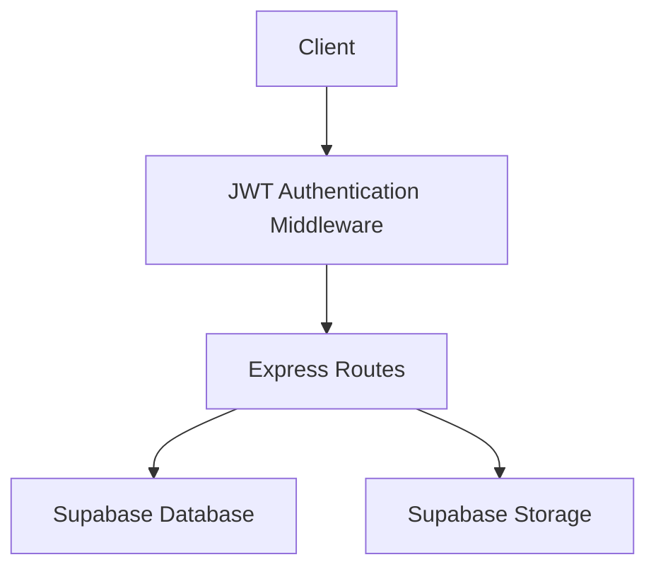
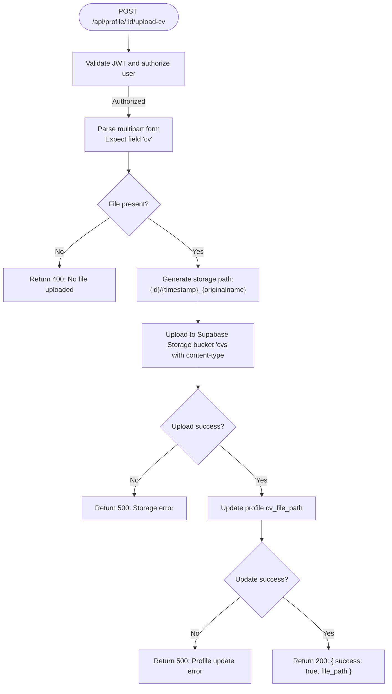
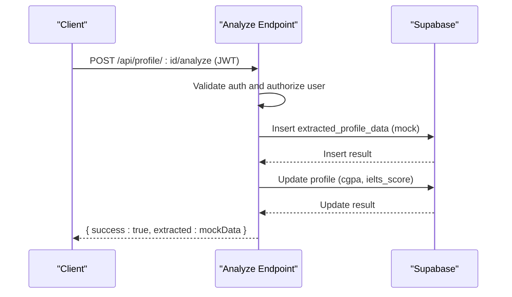
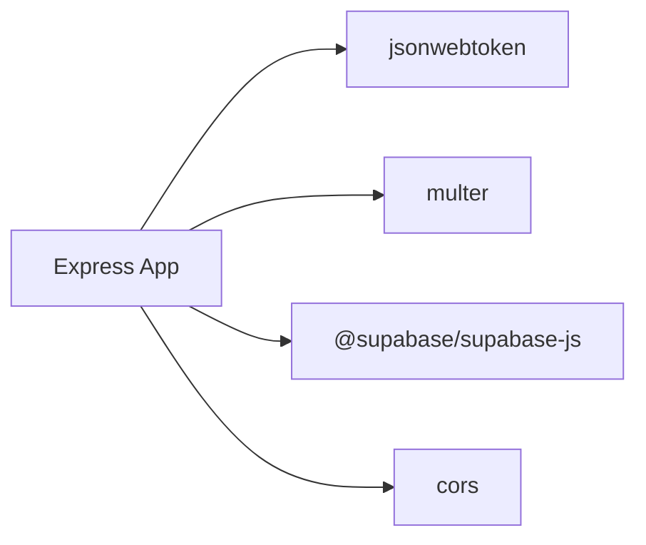

# Profile Management API

<cite>
**Referenced Files in This Document**
- [index.js](file://aischolarpath-backend-main/aischolarpath-backend-main/index.js)
- [package.json](file://aischolarpath-backend-main/aischolarpath-backend-main/package.json)
</cite>

## Table of Contents
1. [Introduction](#introduction)
2. [Project Structure](#project-structure)
3. [Core Components](#core-components)
4. [Architecture Overview](#architecture-overview)
5. [Detailed Component Analysis](#detailed-component-analysis)
6. [Dependency Analysis](#dependency-analysis)
7. [Performance Considerations](#performance-considerations)
8. [Troubleshooting Guide](#troubleshooting-guide)
9. [Conclusion](#conclusion)

## Introduction
This document provides detailed API documentation for profile management endpoints under /api/profile/*. It covers:
- PATCH /api/profile to update user profiles
- GET /api/profile/:id to retrieve a profile with authorization checks
- POST /api/profile/:id/upload-cv to upload a CV to Supabase Storage and link it to the profile
- POST /api/profile/:id/analyze to analyze a CV using mock data extraction and update profile fields

It also documents authentication requirements, parameter validation, error responses, and file upload specifications including supported formats and size limits.

## Project Structure
The backend is implemented as an Express application with middleware for CORS, JSON parsing, JWT-based authentication, and Multer for handling file uploads. Data persistence and storage are handled via Supabase (database and storage).



**Diagram sources**
- [index.js:31-48](file://aischolarpath-backend-main/aischolarpath-backend-main/index.js#L31-L48)
- [index.js:50-54](file://aischolarpath-backend-main/aischolarpath-backend-main/index.js#L50-L54)
- [index.js:26-27](file://aischolarpath-backend-main/aischolarpath-backend-main/index.js#L26-L27)

**Section sources**
- [index.js:1-59](file://aischolarpath-backend-main/aischolarpath-backend-main/index.js#L1-L59)
- [package.json:1-14](file://aischolarpath-backend-main/aischolarpath-backend-main/package.json#L1-L14)

## Core Components
- Authentication middleware validates JWT tokens and attaches the authenticated user ID to requests.
- Profile endpoints use Supabase to read/write profile records and related tables.
- File upload endpoint uses Multer to handle multipart form data and Supabase Storage to persist CV files.
- CV analysis endpoint currently uses mock data to simulate extraction and updates profile fields accordingly.

Key responsibilities:
- PATCH /api/profile: Update selected profile fields for the authenticated user.
- GET /api/profile/:id: Retrieve profile data with strict authorization checks.
- POST /api/profile/:id/upload-cv: Upload CV to Supabase Storage and update profile with file path.
- POST /api/profile/:id/analyze: Extract mock data from CV and update profile fields.

**Section sources**
- [index.js:32-47](file://aischolarpath-backend-main/aischolarpath-backend-main/index.js#L32-L47)
- [index.js:70-91](file://aischolarpath-backend-main/aischolarpath-backend-main/index.js#L70-L91)
- [index.js:94-110](file://aischolarpath-backend-main/aischolarpath-backend-main/index.js#L94-L110)
- [index.js:112-145](file://aischolarpath-backend-main/aischolarpath-backend-main/index.js#L112-L145)
- [index.js:147-188](file://aischolarpath-backend-main/aischolarpath-backend-main/index.js#L147-L188)

## Architecture Overview
The profile management flow involves:
- Client sends requests with Authorization header containing a valid JWT.
- Middleware verifies token and sets req.userId.
- Route handlers enforce authorization by comparing req.params.id with req.userId.
- Handlers interact with Supabase database and storage as needed.

```mermaid
sequenceDiagram
participant C as "Client"
participant M as "Auth Middleware"
participant R as "Profile Route"
participant S as "Supabase"
C->>M : Request with Authorization header
M-->>C : 401 if no token; 403 if invalid/expired
M->>R : Forward request with req.userId
R->>S : Query/Update profile or storage
S-->>R : Result or error
R-->>C : JSON response
```

**Diagram sources**
- [index.js:32-47](file://aischolarpath-backend-main/aischolarpath-backend-main/index.js#L32-L47)
- [index.js:94-110](file://aischolarpath-backend-main/aischolarpath-backend-main/index.js#L94-L110)
- [index.js:112-145](file://aischolarpath-backend-main/aischolarpath-backend-main/index.js#L112-L145)
- [index.js:147-188](file://aischolarpath-backend-main/aischolarpath-backend-main/index.js#L147-L188)

## Detailed Component Analysis

### PATCH /api/profile
Updates the authenticated user’s profile with optional fields. Only provided fields are updated.

- Method: PATCH
- Path: /api/profile
- Authentication: Required (Bearer JWT)
- Request Body:
  - full_name: string (optional)
  - cgpa: number (optional)
  - ielts_score: number (optional)
  - target_country: string (optional)
  - target_degree: string (optional)
  - target_department: string (optional)
- Success Response:
  - { success: true, profile: <updated profile object> }
- Error Responses:
  - 401: No token provided
  - 403: Invalid or expired token
  - 500: Database update error

Notes:
- The endpoint updates only the fields present in the request body.
- Updates apply to the row where id equals the authenticated user’s id.

**Section sources**
- [index.js:70-91](file://aischolarpath-backend-main/aischolarpath-backend-main/index.js#L70-L91)

### GET /api/profile/:id
Retrieves the profile identified by :id for the authenticated user.

- Method: GET
- Path: /api/profile/:id
- Authentication: Required (Bearer JWT)
- Path Parameters:
  - id: string (must match the authenticated user’s id)
- Success Response:
  - { success: true, profile: <profile object> }
- Error Responses:
  - 401: No token provided
  - 403: Invalid/expired token or not authorized to view this profile
  - 404: Profile not found
  - 500: Database query error

Authorization:
- The endpoint enforces that the requested id matches the authenticated user’s id.

**Section sources**
- [index.js:94-110](file://aischolarpath-backend-main/aischolarpath-backend-main/index.js#L94-L110)

### POST /api/profile/:id/upload-cv
Uploads a CV file to Supabase Storage and links it to the profile.

- Method: POST
- Path: /api/profile/:id
- Sub-path: /upload-cv
- Authentication: Required (Bearer JWT)
- Path Parameters:
  - id: string (must match the authenticated user’s id)
- Request:
  - Content-Type: multipart/form-data
  - Field name: cv (single file)
- File Handling:
  - Stored in memory during upload (Multer memory storage)
  - Uploaded to Supabase Storage bucket "cvs"
  - Storage path generated as: {id}/{timestamp}_{originalname}
  - Content-Type set to the file’s MIME type
- Success Response:
  - { success: true, file_path: "<storage path>" }
- Error Responses:
  - 400: No file uploaded
  - 401: No token provided
  - 403: Invalid/expired token or not authorized
  - 500: Storage upload error or profile update error

Supported Formats and Size Limits:
- Supported formats: Any MIME type accepted by Supabase Storage (commonly PDF, DOCX, TXT). The server does not restrict MIME types beyond passing through file.mimetype.
- Size limits: Not enforced by the server. Requests may be constrained by client-side limits or platform constraints.

Storage Path Generation:
- Format: {profile_id}/{unix_timestamp}_{original_filename}
- Example: "123/1710000000000_resume.pdf"

Profile Update:
- After successful upload, the profile record is updated with cv_file_path set to the storage path.



**Diagram sources**
- [index.js:112-145](file://aischolarpath-backend-main/aischolarpath-backend-main/index.js#L112-L145)

**Section sources**
- [index.js:112-145](file://aischolarpath-backend-main/aischolarpath-backend-main/index.js#L112-L145)

### POST /api/profile/:id/analyze
Analyzes the user’s CV using mock data extraction and updates profile fields.

- Method: POST
- Path: /api/profile/:id
- Sub-path: /analyze
- Authentication: Required (Bearer JWT)
- Path Parameters:
  - id: string (must match the authenticated user’s id)
- Behavior:
  - Uses mock extracted data to simulate AI extraction
  - Inserts extracted data into extracted_profile_data table
  - Updates profile fields: cgpa and ielts_score
- Success Response:
  - { success: true, extracted: <mock extracted data object> }
- Error Responses:
  - 401: No token provided
  - 403: Invalid/expired token or not authorized
  - 500: Database insert/update error

Mock Extracted Data Fields:
- cgpa: number
- ielts_score: number
- degree_level: string
- department: string
- skills: array of strings

Note:
- This endpoint currently uses mock data. Replace with real AI extraction logic when available.



**Diagram sources**
- [index.js:147-188](file://aischolarpath-backend-main/aischolarpath-backend-main/index.js#L147-L188)

**Section sources**
- [index.js:147-188](file://aischolarpath-backend-main/aischolarpath-backend-main/index.js#L147-L188)

## Dependency Analysis
External dependencies relevant to profile endpoints:
- express: HTTP server and routing
- cors: Cross-origin resource sharing
- jsonwebtoken: JWT verification for authentication
- multer: Multipart form parsing for file uploads
- @supabase/supabase-js: Database and storage client

Environment variables required:
- SUPABASE_URL
- SUPABASE_KEY
- JWT_SECRET



**Diagram sources**
- [package.json:1-14](file://aischolarpath-backend-main/aischolarpath-backend-main/package.json#L1-L14)
- [index.js:1-15](file://aischolarpath-backend-main/aischolarpath-backend-main/index.js#L1-L15)

**Section sources**
- [package.json:1-14](file://aischolarpath-backend-main/aischolarpath-backend-main/package.json#L1-L14)
- [index.js:1-15](file://aischolarpath-backend-main/aischolarpath-backend-main/index.js#L1-L15)

## Performance Considerations
- File uploads are stored in memory before being sent to Supabase Storage. For large files, consider configuring Multer with disk storage or adjusting memory limits to avoid high memory usage.
- Avoid unnecessary re-uploads by checking existing cv_file_path on the profile before uploading.
- Use efficient queries and limit returned fields where possible to reduce payload sizes.
- Consider adding rate limiting and request size limits at the server level to protect against abuse.

[No sources needed since this section provides general guidance]

## Troubleshooting Guide
Common issues and resolutions:
- Missing or invalid JWT:
  - Ensure Authorization header includes Bearer token.
  - Verify token is signed with the correct secret and has not expired.
- Not authorized:
  - Confirm that the requested profile id matches the authenticated user’s id.
- No file uploaded:
  - Ensure the request uses multipart/form-data and includes the field named cv.
- Storage or database errors:
  - Check environment variables (SUPABASE_URL, SUPABASE_KEY, JWT_SECRET).
  - Inspect error messages returned by Supabase for details.

**Section sources**
- [index.js:32-47](file://aischolarpath-backend-main/aischolarpath-backend-main/index.js#L32-L47)
- [index.js:94-110](file://aischolarpath-backend-main/aischolarpath-backend-main/index.js#L94-L110)
- [index.js:112-145](file://aischolarpath-backend-main/aischolarpath-backend-main/index.js#L112-L145)
- [index.js:147-188](file://aischolarpath-backend-main/aischolarpath-backend-main/index.js#L147-L188)

## Conclusion
The profile management API provides secure, authenticated endpoints to update profiles, retrieve profile data, upload CVs to Supabase Storage, and perform mock CV analysis. Proper authentication and authorization checks ensure users can only access and modify their own data. When integrating with clients, ensure correct headers, proper multipart form structure for uploads, and handle error responses gracefully.

[No sources needed since this section summarizes without analyzing specific files]