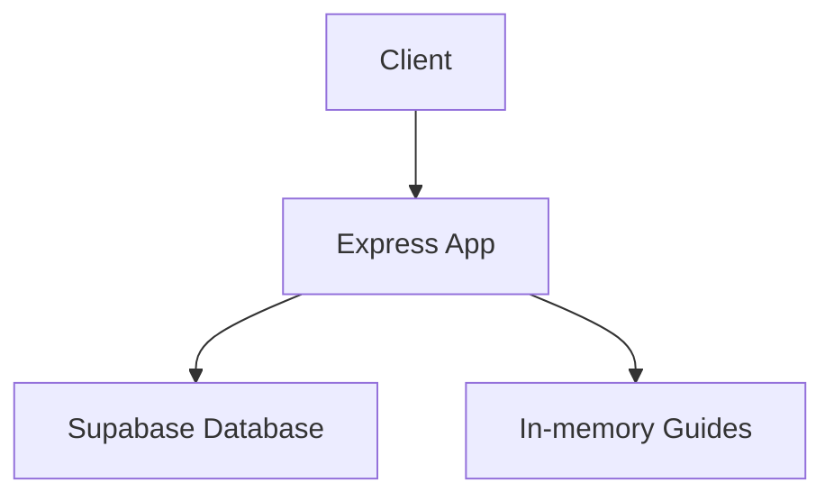
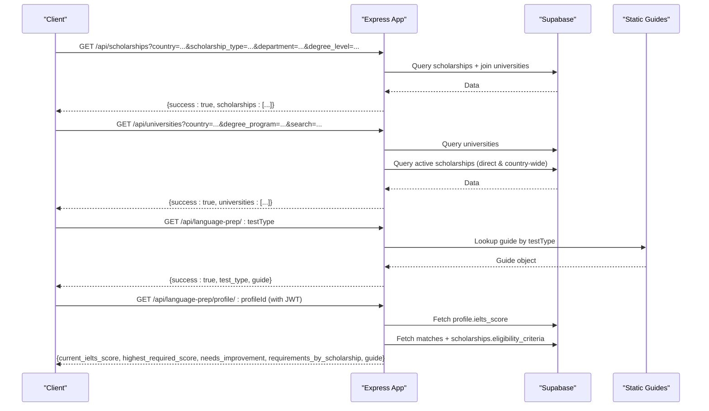
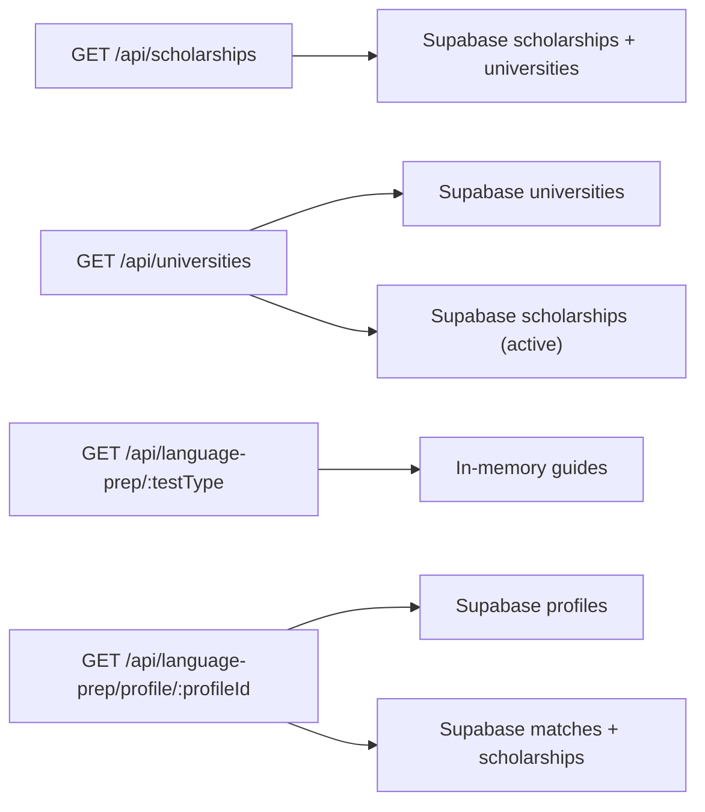

# Reference Data API

<cite>
**Referenced Files in This Document**
- [index.js](file://aischolarpath-backend-main/aischolarpath-backend-main/index.js)
</cite>

## Table of Contents
1. [Introduction](#introduction)
2. [Project Structure](#project-structure)
3. [Core Components](#core-components)
4. [Architecture Overview](#architecture-overview)
5. [Detailed Component Analysis](#detailed-component-analysis)
6. [Dependency Analysis](#dependency-analysis)
7. [Performance Considerations](#performance-considerations)
8. [Troubleshooting Guide](#troubleshooting-guide)
9. [Conclusion](#conclusion)

## Introduction
This document provides comprehensive API documentation for the reference data endpoints that power scholarship discovery, university search, and language preparation guidance. It covers:
- GET /api/scholarships with filtering by country, scholarship_type, department, and degree_level
- GET /api/universities with filters for country, degree_program, and text search
- GET /api/language-prep/:testType for static guides supporting IELTS, TOEFL, and PTE
- GET /api/language-prep/profile/:profileId for personalized recommendations based on profile data and scholarship requirements

Each endpoint includes request parameters, response schemas, and example payloads derived from the implementation.

## Project Structure
The backend is implemented as a single Express application with all routes defined in one file. The relevant reference data endpoints are registered in the main server file and interact with a Supabase database for scholarships and universities, while language prep guides are served from an in-memory static object.

**Diagram sources**
- [index.js:1-50](file://aischolarpath-backend-main/aischolarpath-backend-main/index.js#L1-L50)
- [index.js:189-206](file://aischolarpath-backend-main/aischolarpath-backend-main/index.js#L189-L206)
- [index.js:224-271](file://aischolarpath-backend-main/aischolarpath-backend-main/index.js#L224-L271)
- [index.js:289-353](file://aischolarpath-backend-main/aischolarpath-backend-main/index.js#L289-L353)
- [index.js:355-402](file://aischolarpath-backend-main/aischolarpath-backend-main/index.js#L355-L402)

**Section sources**
- [index.js:1-50](file://aischolarpath-backend-main/aischolarpath-backend-main/index.js#L1-L50)

## Core Components
- Scholarship listing with multi-field filters
- University directory with country, program, and name search
- Static language test preparation guides (IELTS, TOEFL, PTE)
- Personalized language prep recommendations tied to user profile and matched scholarships

**Section sources**
- [index.js:189-206](file://aischolarpath-backend-main/aischolarpath-backend-main/index.js#L189-L206)
- [index.js:224-271](file://aischolarpath-backend-main/aischolarpath-backend-main/index.js#L224-L271)
- [index.js:289-353](file://aischolarpath-backend-main/aischolarpath-backend-main/index.js#L289-L353)
- [index.js:355-402](file://aischolarpath-backend-main/aischolarpath-backend-main/index.js#L355-L402)

## Architecture Overview
The reference data API follows a simple request-response pattern:
- Clients send HTTP GET requests with query or path parameters
- The Express app validates inputs and builds queries against Supabase
- For language prep, static guides are returned directly from memory
- Responses are wrapped in a consistent envelope with success flags and data

**Diagram sources**
- [index.js:189-206](file://aischolarpath-backend-main/aischolarpath-backend-main/index.js#L189-L206)
- [index.js:224-271](file://aischolarpath-backend-main/aischolarpath-backend-main/index.js#L224-L271)
- [index.js:289-353](file://aischolarpath-backend-main/aischolarpath-backend-main/index.js#L289-L353)
- [index.js:355-402](file://aischolarpath-backend-main/aischolarpath-backend-main/index.js#L355-L402)

## Detailed Component Analysis

### GET /api/scholarships
Lists scholarships with optional filters. Joins related university data.

- Method: GET
- Path: /api/scholarships
- Authentication: Not required
- Query Parameters:
  - country: string (optional)
  - scholarship_type: string (optional)
  - department: string (optional)
  - degree_level: string (optional)
- Response Schema:
  - success: boolean
  - scholarships: array of objects
    - Each scholarship includes fields from the scholarships table plus joined university fields: name, official_portal_url

Example Request:
- GET /api/scholarships?country=Australia&scholarship_type=University-funded&department=Computer Science&degree_level=Bachelor’s

Example Response:
- {
    "success": true,
    "scholarships": [
      {
        "id": "...",
        "title": "...",
        "country": "Australia",
        "scholarship_type": "University-funded",
        "department": "Computer Science",
        "degree_level": "Bachelor’s",
        "universities": {
          "name": "University of Melbourne",
          "official_portal_url": "https://..."
        }
      }
    ]
  }

Notes:
- Filters are applied using equality checks; omitting a parameter means no filter on that field.
- If no results match, the response returns an empty scholarships array.

**Section sources**
- [index.js:189-206](file://aischolarpath-backend-main/aischolarpath-backend-main/index.js#L189-L206)

### GET /api/universities
Searches universities with filters and limits results to top 10. Includes universities that either have direct scholarships or are covered by country-wide scholarships.

- Method: GET
- Path: /api/universities
- Authentication: Not required
- Query Parameters:
  - country: string (optional)
  - degree_program: string (optional) — matches against an array field containing offered programs
  - search: string (optional) — case-insensitive substring match on university name
- Response Schema:
  - success: boolean
  - universities: array of up to 10 university objects

Example Request:
- GET /api/universities?country=Canada&degree_program=Master’s&search=Toronto

Example Response:
- {
    "success": true,
    "universities": [
      {
        "id": "...",
        "name": "University of Toronto",
        "country": "Canada",
        "degree_programs": ["Bachelor’s","Master’s","PhD"],
        "website": "https://www.utoronto.ca/"
      }
    ]
  }

Behavior Details:
- Applies basic filters first (country, degree_program, search).
- Then intersects with universities that have active scholarships directly linked or countries covered by active country-wide scholarships.
- Returns at most 10 results.

**Section sources**
- [index.js:224-271](file://aischolarpath-backend-main/aischolarpath-backend-main/index.js#L224-L271)

### GET /api/language-prep/:testType
Returns static preparation guides for supported tests.

- Method: GET
- Path: /api/language-prep/:testType
- Path Parameter:
  - testType: string — must be one of IELTS, TOEFL, PTE (case-insensitive)
- Response Schema:
  - success: boolean
  - test_type: string (uppercased)
  - guide: object
    - full_name: string
    - sections: array of strings
    - score_range: string
    - typical_requirement: string
    - free_resources: array of strings
    - study_plan: array of strings

Example Request:
- GET /api/language-prep/ielts

Example Response:
- {
    "success": true,
    "test_type": "IELTS",
    "guide": {
      "full_name": "International English Language Testing System",
      "sections": ["Listening","Reading","Writing","Speaking"],
      "score_range": "0-9 bands",
      "typical_requirement": "6.0 - 7.5 depending on program",
      "free_resources": [
        "British Council IELTS free practice materials",
        "IELTS Liz (free lessons and tips)",
        "Cambridge IELTS past papers (books 10-18)"
      ],
      "study_plan": [
        "Week 1-2: Diagnostic test + identify weak sections",
        "Week 3-6: Focused practice on weakest sections daily",
        "Week 7-8: Full-length mock tests under timed conditions",
        "Week 9: Final review and light practice before test day"
      ]
    }
  }

Error Handling:
- Unknown test type returns 404 with a descriptive error message.

**Section sources**
- [index.js:289-353](file://aischolarpath-backend-main/aischolarpath-backend-main/index.js#L289-L353)

### GET /api/language-prep/profile/:profileId
Provides personalized language prep recommendations by comparing the user’s current IELTS score to the highest requirement among their matched scholarships. Requires authentication.

- Method: GET
- Path: /api/language-prep/profile/:profileId
- Authentication: Required (JWT via Authorization header)
- Path Parameter:
  - profileId: string — must match the authenticated user’s ID
- Response Schema:
  - success: boolean
  - current_ielts_score: number or null
  - highest_required_score: number or null
  - needs_improvement: boolean or null
  - requirements_by_scholarship: array of objects
    - scholarship: string (title)
    - required: number (min_ielts)
    - gap: number or null (required - current, rounded to one decimal)
  - guide: object — static IELTS guide

Example Request:
- GET /api/language-prep/profile/abc123
- Headers: Authorization: Bearer <jwt>

Example Response:
- {
    "success": true,
    "current_ielts_score": 6.5,
    "highest_required_score": 7.0,
    "needs_improvement": true,
    "requirements_by_scholarship": [
      {
        "scholarship": "Melbourne International Undergraduate Scholarship",
        "required": 7.0,
        "gap": 0.5
      }
    ],
    "guide": { ... }
  }

Error Handling:
- Unauthorized access (profileId mismatch) returns 403.
- Profile not found returns 404.
- Database errors return 500 with error details.

Processing Logic:
- Retrieves the user’s IELTS score from their profile.
- Retrieves all matches for the profile along with associated scholarship eligibility criteria.
- Computes the highest required IELTS score across eligible scholarships.
- Calculates per-scholarship gaps and whether improvement is needed.
- Attaches the static IELTS guide to the response.

**Section sources**
- [index.js:355-402](file://aischolarpath-backend-main/aischolarpath-backend-main/index.js#L355-L402)

## Dependency Analysis
- External Services:
  - Supabase client used for querying scholarships, universities, profiles, and matches
- Middleware:
  - CORS enabled
  - JSON body parsing
  - JWT-based authentication for protected endpoints
- In-memory Data:
  - Static language prep guides for IELTS, TOEFL, PTE

**Diagram sources**
- [index.js:189-206](file://aischolarpath-backend-main/aischolarpath-backend-main/index.js#L189-L206)
- [index.js:224-271](file://aischolarpath-backend-main/aischolarpath-backend-main/index.js#L224-L271)
- [index.js:289-353](file://aischolarpath-backend-main/aischolarpath-backend-main/index.js#L289-L353)
- [index.js:355-402](file://aischolarpath-backend-main/aischolarpath-backend-main/index.js#L355-L402)

**Section sources**
- [index.js:1-50](file://aischolarpath-backend-main/aischolarpath-backend-main/index.js#L1-L50)
- [index.js:189-206](file://aischolarpath-backend-main/aischolarpath-backend-main/index.js#L189-L206)
- [index.js:224-271](file://aischolarpath-backend-main/aischolarpath-backend-main/index.js#L224-L271)
- [index.js:289-353](file://aischolarpath-backend-main/aischolarpath-backend-main/index.js#L289-L353)
- [index.js:355-402](file://aischolarpath-backend-main/aischolarpath-backend-main/index.js#L355-L402)

## Performance Considerations
- University search caps results to 10 entries to limit payload size and processing time.
- Multiple database queries are executed for university filtering; consider indexing strategies on frequently filtered fields (e.g., country, status).
- Static language prep guides are served from memory, ensuring minimal latency.
- Authentication middleware adds negligible overhead but ensures secure access to profile-specific data.

[No sources needed since this section provides general guidance]

## Troubleshooting Guide
Common issues and how they are handled:
- Missing or invalid test type in /api/language-prep/:testType returns 404 with a clear error message.
- Unauthorized access to profile-scoped endpoints returns 403 when profileId does not match the authenticated user.
- Database errors propagate as 500 responses with error messages.
- General unhandled errors are caught by a centralized error handler returning a generic 500 response.

Recommendations:
- Validate query parameters on the client side to reduce unnecessary requests.
- Ensure JWT tokens are included for protected endpoints.
- Log server-side errors for debugging and monitoring.

**Section sources**
- [index.js:345-353](file://aischolarpath-backend-main/aischolarpath-backend-main/index.js#L345-L353)
- [index.js:355-370](file://aischolarpath-backend-main/aischolarpath-backend-main/index.js#L355-L370)
- [index.js:1527-1531](file://aischolarpath-backend-main/aischolarpath-backend-main/index.js#L1527-L1531)

## Conclusion
The Reference Data API provides robust endpoints for discovering scholarships, searching universities, and accessing language preparation resources. Filtering capabilities and consistent response envelopes simplify integration. Protected endpoints ensure privacy for personalized recommendations. Following the documented schemas and parameters will enable reliable client implementations.

[No sources needed since this section summarizes without analyzing specific files]