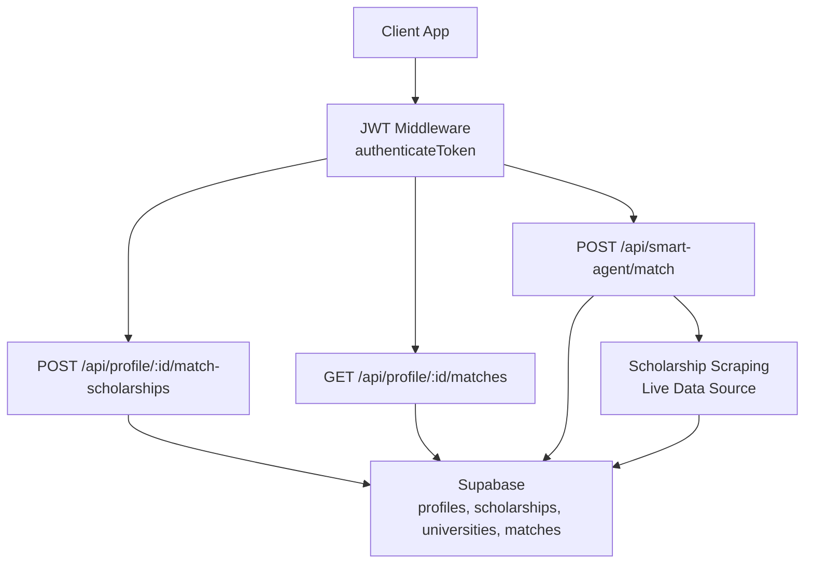
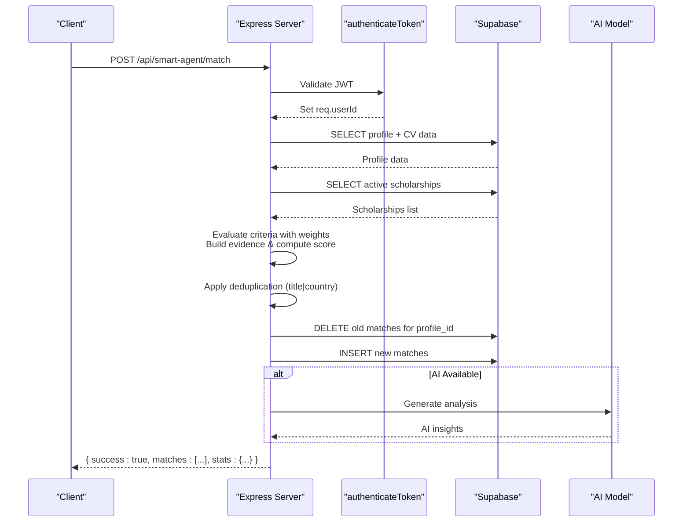
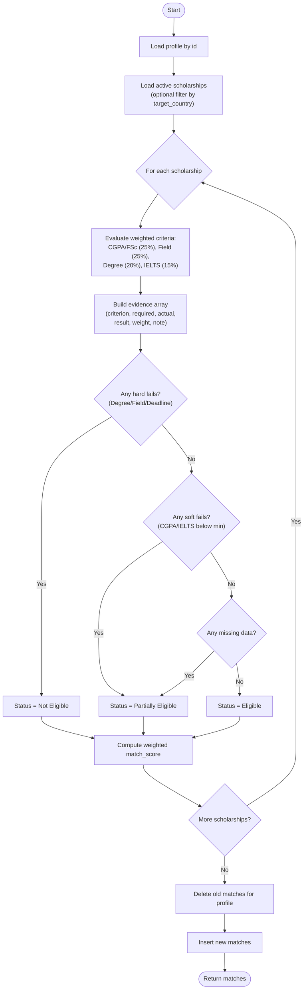
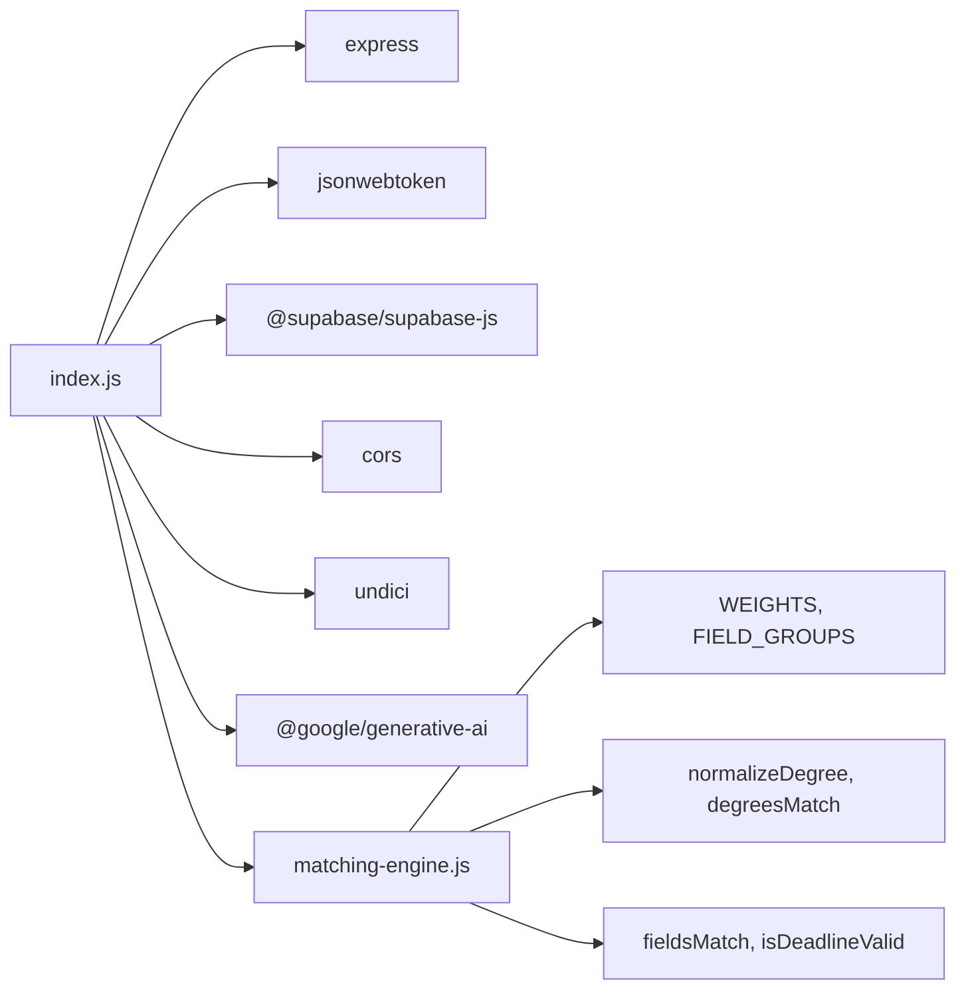

# Scholarship Matching API

<cite>
**Referenced Files in This Document**
- [index.js](file://aischolarpath-backend-main/aischolarpath-backend-main/index.js)
- [matching-engine.js](file://aischolarpath-backend-main/aischolarpath-backend-main/matching-engine.js)
- [package.json](file://aischolarpath-backend-main/aischolarpath-backend-main/package.json)
</cite>

## Update Summary
**Changes Made**
- Updated POST /api/profile/:id/match-scholarships endpoint documentation to reflect enhanced matching algorithm with weighted scoring
- Added comprehensive documentation for the new Smart Agent endpoint (/api/smart-agent/match) with deduplication functionality
- Enhanced evidence reporting format to include detailed criterion evaluation with weights and reasons
- Updated status determination logic to support "Partially Eligible" and "Not Scored" states
- Added performance considerations for large dataset handling with deduplication

## Table of Contents
1. [Introduction](#introduction)
2. [Project Structure](#project-structure)
3. [Core Components](#core-components)
4. [Architecture Overview](#architecture-overview)
5. [Detailed Component Analysis](#detailed-component-analysis)
6. [Dependency Analysis](#dependency-analysis)
7. [Performance Considerations](#performance-considerations)
8. [Troubleshooting Guide](#troubleshooting-guide)
9. [Conclusion](#conclusion)

## Introduction
This document provides comprehensive API documentation for the scholarship matching functionality. It focuses on:
- **POST /api/profile/:id/match-scholarships**: Runs the weighted matching algorithm against all scholarships, evaluates eligibility criteria (CGPA, IELTS scores, degree requirements), computes match scores with weighted methodology, determines status, and persists results.
- **GET /api/profile/:id/matches**: Retrieves stored matches for a profile with built-in sorting by match score.
- **POST /api/smart-agent/match**: Advanced matching endpoint with intelligent scholarship discovery, deduplication, and AI-powered analysis.

The matching logic evaluates each criterion defined in a scholarship's eligibility criteria against the user's profile data using weighted scoring methodology and produces an evidence array that documents criterion-by-criterion evaluation. Status is determined as Eligible, Partially Eligible, Not Eligible, or Not Scored based on the weighted evaluation outcomes.

## Project Structure
The backend is implemented as a single Express application with Supabase integration for data persistence. Authentication is handled via JWT middleware. The matching endpoints are part of this server and interact with the profiles, scholarships, universities, and matches tables.

**Diagram sources**
- [index.js:98-113](file://aischolarpath-backend-main/aischolarpath-backend-main/index.js#L98-L113)
- [index.js:780-973](file://aischolarpath-backend-main/aischolarpath-backend-main/index.js#L780-L973)
- [index.js:975-992](file://aischolarpath-backend-main/aischolarpath-backend-main/index.js#L975-L992)
- [index.js:2667-2994](file://aischolarpath-backend-main/aischolarpath-backend-main/index.js#L2667-L2994)

**Section sources**
- [index.js:1-70](file://aischolarpath-backend-main/aischolarpath-backend-main/index.js#L1-L70)
- [package.json:1-13](file://aischolarpath-backend-main/aischolarpath-backend-main/package.json#L1-L13)

## Core Components
- **Authentication middleware**: Validates JWT tokens and attaches the authenticated user ID to requests.
- **Weighted Matching Engine**: Evaluates eligibility criteria with weighted scoring methodology (CGPA 25%, Field 25%, Degree 20%, IELTS 15%, Experience 10%, Country 5%).
- **Smart Agent**: Advanced matching with live scholarship scraping, deduplication, and AI-powered analysis.
- **Evidence Generation**: For each criterion, records required value, actual value, result (Pass/Fail/Missing), weight, and explanatory notes.
- **Status Determination**: Supports multiple states - Eligible, Partially Eligible, Not Eligible, Not Scored based on weighted evaluation.

Key responsibilities:
- **Criterion Evaluation**: CGPA/FSc percentage, Field/Department matching, Degree level validation, IELTS scores, deadline checking.
- **Weighted Scoring**: Percentage-based scoring with configurable weights per criterion type.
- **Deduplication**: Removes duplicate scholarship matches based on title and country combinations.
- **AI Integration**: Optional Gemini-powered analysis and recommendations.

**Section sources**
- [index.js:98-113](file://aischolarpath-backend-main/aischolarpath-backend-main/index.js#L98-L113)
- [index.js:780-973](file://aischolarpath-backend-main/aischolarpath-backend-main/index.js#L780-L973)
- [matching-engine.js:1-66](file://aischolarpath-backend-main/aischolarpath-backend-main/matching-engine.js#L1-L66)

## Architecture Overview
The matching workflow involves:
- Authorization check via JWT middleware.
- Profile retrieval from the database.
- Querying active scholarships, optionally filtered by target country.
- In-memory evaluation of eligibility criteria per scholarship with weighted scoring.
- Deduplication of results based on title+country combinations.
- Persisting computed matches after clearing old ones.
- Returning the newly inserted matches with enriched data.

**Diagram sources**
- [index.js:98-113](file://aischolarpath-backend-main/aischolarpath-backend-main/index.js#L98-L113)
- [index.js:2667-2994](file://aischolarpath-backend-main/aischolarpath-backend-main/index.js#L2667-L2994)

## Detailed Component Analysis

### Endpoint: POST /api/profile/:id/match-scholarships
- **Purpose**: Run the weighted matching algorithm against all scholarships for the authenticated user's profile and persist results.
- **Authentication**: Required via JWT.
- **Path parameters**:
  - id: The profile ID (must match the authenticated user).
- **Request body**: None.
- **Processing steps**:
  - Verify authorization and load profile.
  - Load active scholarships; optionally filter by profile's target_country.
  - For each scholarship:
    - Extract eligibility_criteria.
    - Evaluate CGPA/FSc, Field/Department, Degree, and IELTS criteria against profile fields with weighted scoring.
    - Build evidence array with criterion, required, actual, result, weight, and note.
    - Determine status: Not Eligible if hard fails; Partially Eligible if soft fails or missing data; Eligible otherwise; Not Scored if no criteria.
    - Compute match_score as weighted percentage of passed criteria.
  - Clear existing matches for the profile.
  - Insert new matches and return them.

**Response structure**:
- success: boolean
- matches: array of match objects with fields:
  - profile_id: string
  - scholarship_id: string
  - university_id: string | null
  - match_score: string (percentage formatted to two decimals)
  - status: "Eligible" | "Partially Eligible" | "Not Eligible" | "Not Scored"
  - evidence: array of criterion evaluations:
    - criterion: "CGPA" | "FSc %" | "Field" | "Degree" | "IELTS" | "Deadline" | "Country"
    - required: number | string
    - actual: number | string | null
    - result: "Pass" | "Fail" | "Missing"
    - weight: number (criterion weight)
    - note: string (optional explanation)

**Error responses**:
- 403: Not authorized (profile id mismatch).
- 404: Profile not found.
- 500: Database errors during query, delete, or insert.

**Scoring methodology**:
- Weighted scoring: match_score = Σ(weight × pass_value) / Σ(weights_used)
- Weights: CGPA/FSc (25%), Field (25%), Degree (20%), IELTS (15%)
- If no criteria are defined for a scholarship, match_score defaults to 0 (Not Scored).

**Evidence reporting format**:
- Each criterion yields one evidence entry with:
  - criterion: name of the evaluated requirement
  - required: threshold or expected value from scholarship
  - actual: user's current value or null if missing
  - result: Pass, Fail, or Missing
  - weight: numerical weight assigned to this criterion
  - note: additional context or explanation

**Status determination rules**:
- **Not Eligible**: Hard fails (degree mismatch, field mismatch, expired deadline) or fatal failures.
- **Partially Eligible**: Soft fails (CGPA/IELTS slightly below minimum) or missing data.
- **Eligible**: All evaluated criteria pass.
- **Not Scored**: No applicable criteria found.

**Section sources**
- [index.js:780-973](file://aischolarpath-backend-main/aischolarpath-backend-main/index.js#L780-L973)

#### Matching Algorithm Flowchart

**Diagram sources**
- [index.js:818-949](file://aischolarpath-backend-main/aischolarpath-backend-main/index.js#L818-L949)

### Endpoint: GET /api/profile/:id/matches
- **Purpose**: Retrieve stored matches for the authenticated user's profile.
- **Authentication**: Required via JWT.
- **Path parameters**:
  - id: The profile ID (must match the authenticated user).
- **Response structure**:
  - success: boolean
  - matches: array of match objects enriched with:
    - scholarships: title, country, deadline, apply_url
    - universities: name
  - Sorting: By match_score descending (highest first).

**Error responses**:
- 403: Not authorized (profile id mismatch).
- 500: Database error while retrieving matches.

Note: Filtering by status or other fields is not exposed via query parameters in this endpoint; clients can filter client-side using the returned matches.

**Section sources**
- [index.js:975-992](file://aischolarpath-backend-main/aischolarpath-backend-main/index.js#L975-L992)

### Smart Agent Endpoint: POST /api/smart-agent/match
- **Purpose**: Advanced matching with intelligent scholarship discovery, deduplication, and AI-powered analysis.
- **Authentication**: Required via JWT.
- **Request body**:
  - profileId: string (the profile ID to analyze)
- **Processing steps**:
  - Load profile and CV extracted data in parallel.
  - Discover scholarships via scraping for target country, fallback to database.
  - Merge scraped and database scholarships with deduplication by title+country.
  - Run weighted matching engine with enhanced evidence generation.
  - Calculate probability/chance of getting each scholarship.
  - Apply final deduplication to remove duplicate matches.
  - Store matches in database and generate AI analysis.
  - Return comprehensive results with statistics and insights.

**Response structure**:
- success: boolean
- matches: array of deduplicated match objects with:
  - All standard match fields plus enhanced data
  - chance: number (0-95% probability)
  - chance_label: string ("High Chance", "Good Chance", etc.)
  - chance_color: string ("green", "blue", etc.)
  - title: enhanced display title
  - funding: funding coverage information
  - funding_value: monetary value if available
- scholarship_count: number (total unique scholarships checked)
- scrape_info: object containing source information
- stats: object with counts by status
- analysis: string (AI-generated summary and recommendations)
- profile_summary: object with profile characteristics

**Deduplication Logic**:
- Primary deduplication during scholarship merging: `title|country` combination
- Final deduplication after matching: ensures clean non-redundant recommendations
- Uses JavaScript Set for O(n) deduplication performance

**Section sources**
- [index.js:2667-2994](file://aischolarpath-backend-main/aischolarpath-backend-main/index.js#L2667-L2994)

## Dependency Analysis
External dependencies relevant to the matching endpoints:
- **Express**: HTTP server and routing.
- **JSON Web Tokens (jsonwebtoken)**: Authentication middleware.
- **Supabase client**: Database interactions for profiles, scholarships, universities, and matches.
- **CORS**: Cross-origin request handling.
- **Undici agent**: Connection pooling configuration for outbound requests.
- **Google Generative AI**: Optional AI-powered analysis and recommendations.

**Diagram sources**
- [package.json:1-13](file://aischolarpath-backend-main/aischolarpath-backend-main/package.json#L1-L13)
- [index.js:1-70](file://aischolarpath-backend-main/aischolarpath-backend-main/index.js#L1-L70)
- [matching-engine.js:1-66](file://aischolarpath-backend-main/aischolarpath-backend-main/matching-engine.js#L1-L66)

**Section sources**
- [package.json:1-13](file://aischolarpath-backend-main/aischolarpath-backend-main/package.json#L1-L13)
- [index.js:1-70](file://aischolarpath-backend-main/aischolarpath-backend-main/index.js#L1-L70)

## Performance Considerations
- **Database queries**:
  - The matching endpoint loads all active scholarships once per run. If the dataset grows large, consider indexing scholarships.status and scholarships.country to optimize filtering.
  - The matches retrieval endpoint orders by match_score; ensure an index on matches.profile_id and matches.match_score for efficient sorting and filtering.
  - Smart Agent performs parallel queries for profile and CV data to reduce latency.
- **In-memory processing**:
  - Criterion evaluation and scoring occur in memory per scholarship. For very large scholarship catalogs, consider batching or streaming results to reduce peak memory usage.
  - Deduplication uses JavaScript Set for O(n) performance when removing duplicates by title+country combinations.
- **Write operations**:
  - The endpoint deletes all previous matches before inserting new ones. For high-frequency runs, consider upsert strategies or incremental updates to minimize write amplification.
  - Smart Agent includes error handling for database schema variations (reasons column optional).
- **Connection pooling**:
  - An undici agent is configured with connection limits and timeouts. Tune these values based on expected concurrency and network conditions.
- **Caching**:
  - Introduce caching for frequently accessed scholarships or profile data if read patterns indicate hotspots.
  - Smart Agent caches scraped scholarship data with last_verified_at timestamps.
- **AI Integration**:
  - Optional Gemini API calls are wrapped in try-catch blocks to prevent failures from blocking core functionality.
  - Fallback analysis provided when AI service is unavailable.

## Troubleshooting Guide
Common issues and resolutions:
- **Authentication failures**:
  - Ensure Authorization header includes a valid JWT token. Invalid or expired tokens will return 403.
- **Profile not found**:
  - Verify the profile exists and belongs to the authenticated user.
- **Database errors**:
  - Check Supabase connectivity and table schemas. Errors during select, delete, or insert will return 500 with error messages.
- **Empty matches**:
  - If no scholarships match the profile's target_country or there are no active scholarships, the matches array may be empty.
- **Deduplication issues**:
  - If receiving duplicate scholarships, verify that title and country fields are consistently formatted across data sources.
- **AI analysis not appearing**:
  - Check GEMINI_API_KEY configuration. AI features are optional and won't affect core matching functionality.
- **Performance issues**:
  - Monitor database query performance and consider adding indexes for frequently queried fields.
  - Check network latency for external API calls (scraping, AI services).

**Section sources**
- [index.js:98-113](file://aischolarpath-backend-main/aischolarpath-backend-main/index.js#L98-L113)
- [index.js:780-973](file://aischolarpath-backend-main/aischolarpath-backend-main/index.js#L780-L973)
- [index.js:2667-2994](file://aischolarpath-backend-main/aischolarpath-backend-main/index.js#L2667-L2994)

## Conclusion
The scholarship matching API provides a robust mechanism to evaluate user profiles against scholarship eligibility criteria using weighted scoring methodology, compute match scores, and persist detailed evidence for transparency. The system now includes:

- **Enhanced Weighted Matching**: Sophisticated scoring with configurable weights per criterion type
- **Advanced Smart Agent**: Intelligent scholarship discovery with live scraping and deduplication
- **Comprehensive Evidence Reporting**: Detailed criterion-by-criterion evaluation with weights and explanations
- **Multiple Status States**: Support for Eligible, Partially Eligible, Not Eligible, and Not Scored classifications
- **AI-Powered Analysis**: Optional Gemini integration for personalized recommendations

The POST endpoint performs end-to-end matching and storage, while the GET endpoint retrieves stored matches sorted by relevance. The Smart Agent provides advanced features including deduplication, probability calculation, and AI analysis. Proper authentication, clear response structures, and deterministic scoring make the system reliable and user-friendly. For scaling, focus on database indexing, connection tuning, caching strategies, and efficient deduplication algorithms.