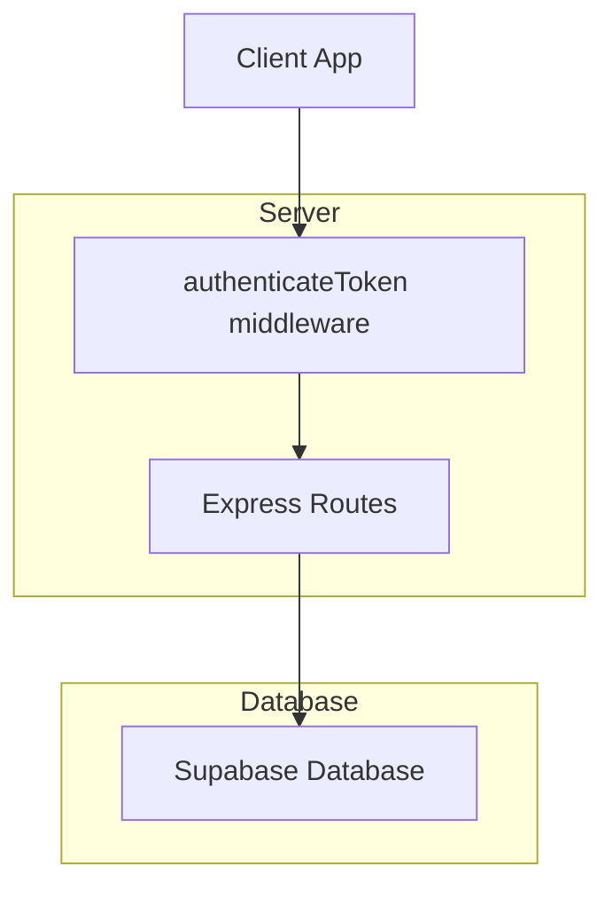
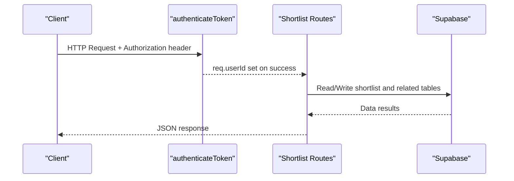
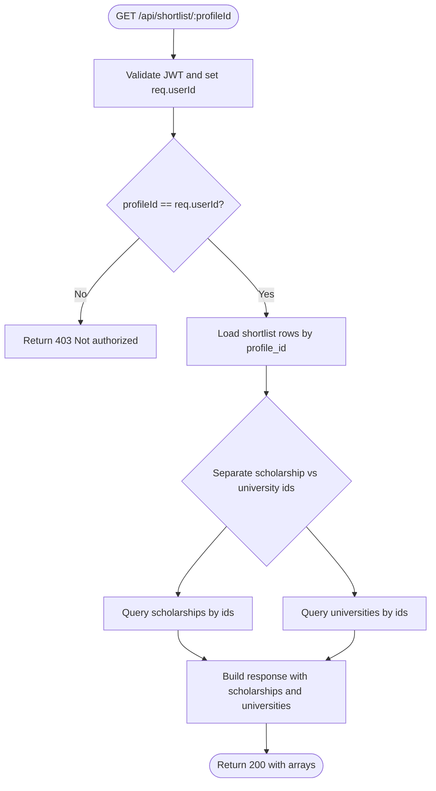
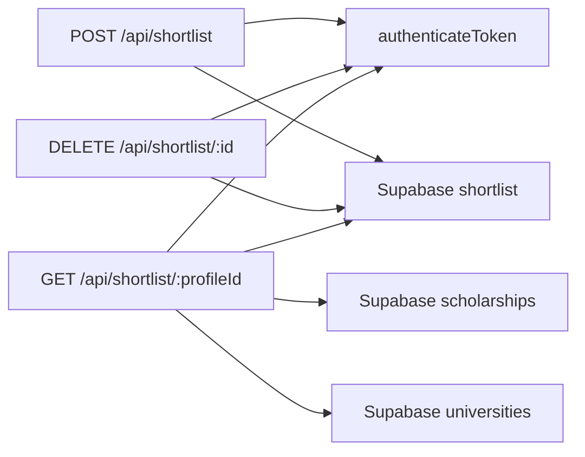

# Shortlist Management API

<cite>
**Referenced Files in This Document**
- [index.js](file://aischolarpath-backend-main/aischolarpath-backend-main/index.js)
</cite>

## Table of Contents
1. Introduction
2. Project Structure
3. Core Components
4. Architecture Overview
5. Detailed Component Analysis
6. Dependency Analysis
7. Performance Considerations
8. Troubleshooting Guide
9. Conclusion

## Introduction
This document specifies the shortlist management endpoints under /api/shortlist*. It covers:
- POST /api/shortlist to add items (scholarship or university) to a user’s shortlist with validation
- DELETE /api/shortlist/:id to remove an item from a shortlist
- GET /api/shortlist/:profileId to retrieve a complete shortlist for a profile, including associated scholarship and university details

It also documents authorization checks, request/response schemas, data relationships, common usage examples, and error handling scenarios.

## Project Structure
The shortlist endpoints are implemented in a single Express application file that defines routes, authentication middleware, and database interactions via Supabase. The relevant logic is contained within one server entry point.

**Diagram sources**
- [index.js:32-47](file://aischolarpath-backend-main/aischolarpath-backend-main/index.js#L32-L47)
- [index.js:750-820](file://aischolarpath-backend-main/aischolarpath-backend-main/index.js#L750-L820)

**Section sources**
- [index.js:32-47](file://aischolarpath-backend-main/aischolarpath-backend-main/index.js#L32-L47)
- [index.js:750-820](file://aischolarpath-backend-main/aischolarpath-backend-main/index.js#L750-L820)

## Core Components
- Authentication middleware validates JWT tokens and attaches the authenticated user ID to requests.
- Shortlist endpoints enforce ownership by comparing the requested profileId against the authenticated user ID.
- Data operations use Supabase to read/write shortlist entries and fetch related scholarship/university records.

Key responsibilities:
- Validate inputs for adding shortlist items
- Enforce authorization for all shortlist operations
- Return enriched shortlist data with referenced entities

**Section sources**
- [index.js:32-47](file://aischolarpath-backend-main/aischolarpath-backend-main/index.js#L32-L47)
- [index.js:750-820](file://aischolarpath-backend-main/aischolarpath-backend-main/index.js#L750-L820)

## Architecture Overview
The shortlist feature follows a standard REST pattern with JWT-based authentication and Supabase-backed persistence.

**Diagram sources**
- [index.js:32-47](file://aischolarpath-backend-main/aischolarpath-backend-main/index.js#L32-L47)
- [index.js:750-820](file://aischolarpath-backend-main/aischolarpath-backend-main/index.js#L750-L820)

## Detailed Component Analysis

### POST /api/shortlist — Add item to shortlist
Adds a scholarship or university to the authenticated user’s shortlist.

- Authorization: Required (JWT). Middleware sets req.userId.
- Path: /api/shortlist
- Method: POST
- Headers: Authorization: Bearer <token>
- Body schema:
  - profile_id: string or integer (required)
  - item_type: "scholarship" | "university" (required)
  - item_id: string or integer (required)
- Validation:
  - All three fields must be present
  - item_type must be exactly "scholarship" or "university"
- Success response (200):
  - success: boolean
  - shortlisted: object representing the inserted shortlist row
- Error responses:
  - 400: Missing fields or invalid item_type
  - 401: No token provided
  - 403: Invalid or expired token
  - 500: Database error

Example flow:
- Client sends POST with { profile_id, item_type, item_id }
- Server validates input and inserts into shortlist table
- Server returns the newly created shortlist entry

**Section sources**
- [index.js:750-771](file://aischolarpath-backend-main/aischolarpath-backend-main/index.js#L750-L771)

### DELETE /api/shortlist/:id — Remove item from shortlist
Removes a specific shortlist entry by its primary key.

- Authorization: Required (JWT)
- Path: /api/shortlist/:id
- Method: DELETE
- URL parameter:
  - id: string or integer (primary key of the shortlist row)
- Success response (200):
  - success: boolean
  - message: "Removed from shortlist"
- Error responses:
  - 401: No token provided
  - 403: Invalid or expired token
  - 500: Database error

Notes:
- There is no explicit ownership check in this route; deletion is by primary key. Clients should ensure they only delete entries belonging to the current user at the application layer.

**Section sources**
- [index.js:774-783](file://aischolarpath-backend-main/aischolarpath-backend-main/index.js#L774-L783)

### GET /api/shortlist/:profileId — Retrieve full shortlist with details
Returns all shortlist entries for a given profile along with referenced scholarship and university details.

- Authorization: Required (JWT)
- Path: /api/shortlist/:profileId
- Method: GET
- URL parameter:
  - profileId: string or integer (must match the authenticated user’s ID)
- Authorization check:
  - If profileId does not equal req.userId, returns 403 Not authorized
- Success response (200):
  - success: boolean
  - scholarships: array of scholarship objects matching item_ids where item_type = "scholarship"
  - universities: array of university objects matching item_ids where item_type = "university"
- Error responses:
  - 401: No token provided
  - 403: Invalid/expired token or unauthorized access to another user’s shortlist
  - 500: Database error

Data relationships:
- Each shortlist entry references either a scholarship or a university via item_id based on item_type
- The endpoint performs two queries to fetch referenced entities by their IDs

**Diagram sources**
- [index.js:786-820](file://aischolarpath-backend-main/aischolarpath-backend-main/index.js#L786-L820)

**Section sources**
- [index.js:786-820](file://aischolarpath-backend-main/aischolarpath-backend-main/index.js#L786-L820)

### Common Usage Examples

- Add a scholarship to your shortlist
  - Request:
    - Method: POST
    - Path: /api/shortlist
    - Headers: Authorization: Bearer <token>
    - Body: { "profile_id": "<your_profile_id>", "item_type": "scholarship", "item_id": "<scholarship_id>" }
  - Response: { "success": true, "shortlisted": { ... } }

- Remove an item from your shortlist
  - Request:
    - Method: DELETE
    - Path: /api/shortlist/<shortlist_entry_id>
    - Headers: Authorization: Bearer <token>
  - Response: { "success": true, "message": "Removed from shortlist" }

- Get your complete shortlist with details
  - Request:
    - Method: GET
    - Path: /api/shortlist/<your_profile_id>
    - Headers: Authorization: Bearer <token>
  - Response: { "success": true, "scholarships": [...], "universities": [...] }

**Section sources**
- [index.js:750-820](file://aischolarpath-backend-main/aischolarpath-backend-main/index.js#L750-L820)

### Error Handling Scenarios

- Missing or invalid item_type when adding
  - Status: 400
  - Message indicates item_type must be 'scholarship' or 'university'

- Missing required fields when adding
  - Status: 400
  - Message indicates which fields are required

- Unauthorized access to another user’s shortlist
  - Status: 403
  - Message: Not authorized

- Authentication failures
  - 401: No token provided
  - 403: Invalid or expired token

- Database errors
  - Status: 500
  - Message includes underlying error details

**Section sources**
- [index.js:32-47](file://aischolarpath-backend-main/aischolarpath-backend-main/index.js#L32-L47)
- [index.js:750-820](file://aischolarpath-backend-main/aischolarpath-backend-main/index.js#L750-L820)

## Dependency Analysis
- Authentication dependency: All shortlist endpoints rely on the authenticateToken middleware to validate JWTs and attach the user ID.
- Database dependency: All endpoints interact with Supabase to persist and retrieve shortlist entries and related entities.
- Coupling: The GET endpoint couples shortlist rows with external entities (scholarships, universities), requiring additional queries to enrich the response.

**Diagram sources**
- [index.js:32-47](file://aischolarpath-backend-main/aischolarpath-backend-main/index.js#L32-L47)
- [index.js:750-820](file://aischolarpath-backend-main/aischolarpath-backend-main/index.js#L750-L820)

**Section sources**
- [index.js:32-47](file://aischolarpath-backend-main/aischolarpath-backend-main/index.js#L32-L47)
- [index.js:750-820](file://aischolarpath-backend-main/aischolarpath-backend-main/index.js#L750-L820)

## Performance Considerations
- The GET endpoint performs multiple queries: one for shortlist rows and separate queries for scholarships and universities by ID lists. For large shortlists, consider batching or using relational joins if supported by the database client.
- Avoid excessive client-side retries on 4xx/5xx responses; implement proper error handling and backoff strategies.
- Ensure JWT verification is efficient and cached where appropriate at the infrastructure level.

[No sources needed since this section provides general guidance]

## Troubleshooting Guide
- 401 Unauthorized: Verify the Authorization header contains a valid Bearer token.
- 403 Forbidden:
  - When adding/removing: Ensure the token is valid.
  - When reading: Ensure profileId matches the authenticated user’s ID.
- 400 Bad Request:
  - Ensure all required fields are present for POST.
  - Ensure item_type is exactly "scholarship" or "university".
- 500 Internal Server Error:
  - Check database connectivity and permissions.
  - Inspect server logs for detailed error messages.

**Section sources**
- [index.js:32-47](file://aischolarpath-backend-main/aischolarpath-backend-main/index.js#L32-L47)
- [index.js:750-820](file://aischolarpath-backend-main/aischolarpath-backend-main/index.js#L750-L820)

## Conclusion
The shortlist management API provides secure, validated endpoints to manage user-curated lists of scholarships and universities. Authorization ensures users can only access their own shortlists, while enrichment queries return comprehensive details for quick decision-making. Proper error handling and clear request/response schemas support reliable integration across clients.

[No sources needed since this section summarizes without analyzing specific files]