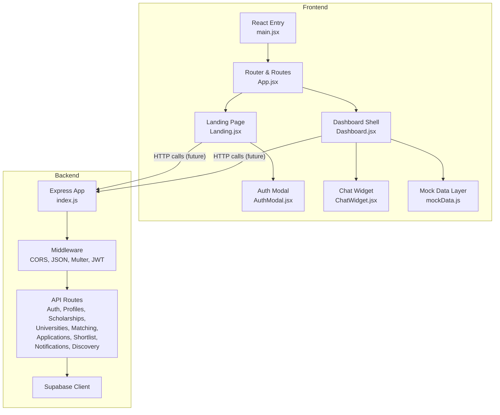
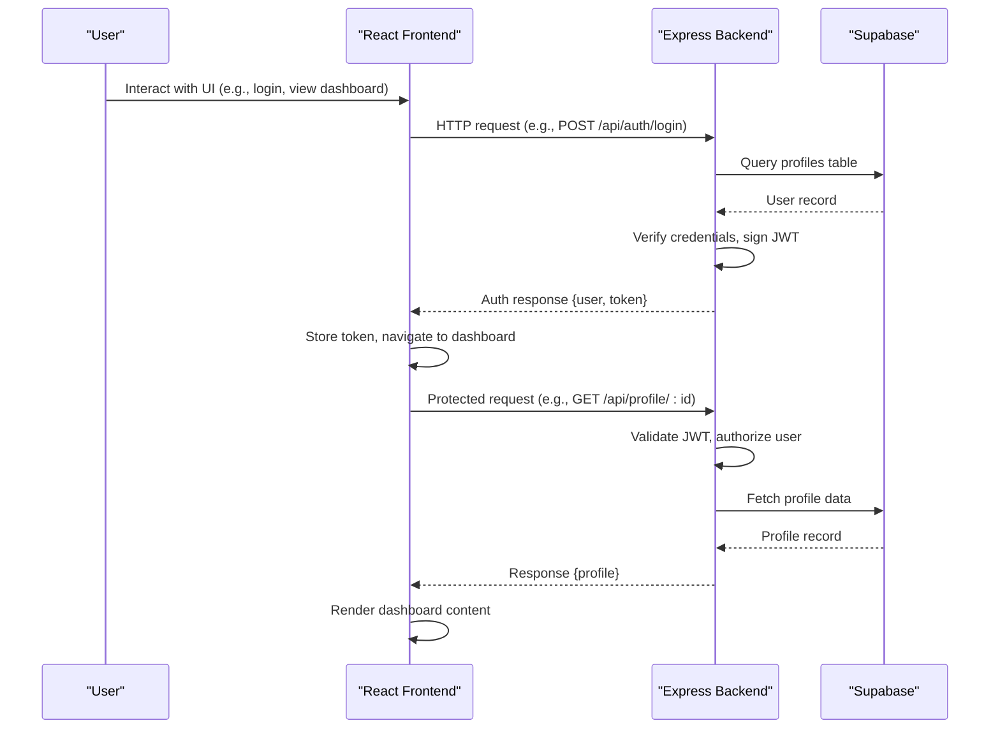
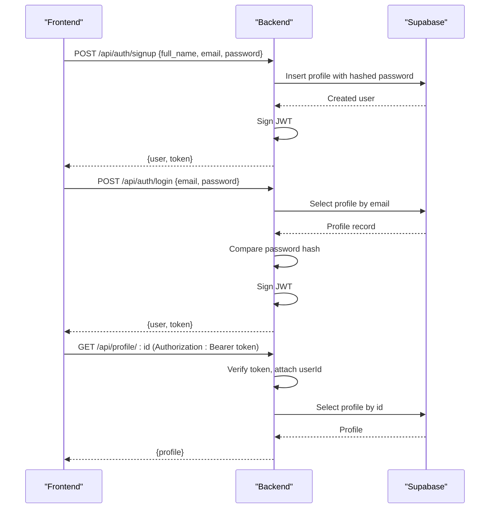
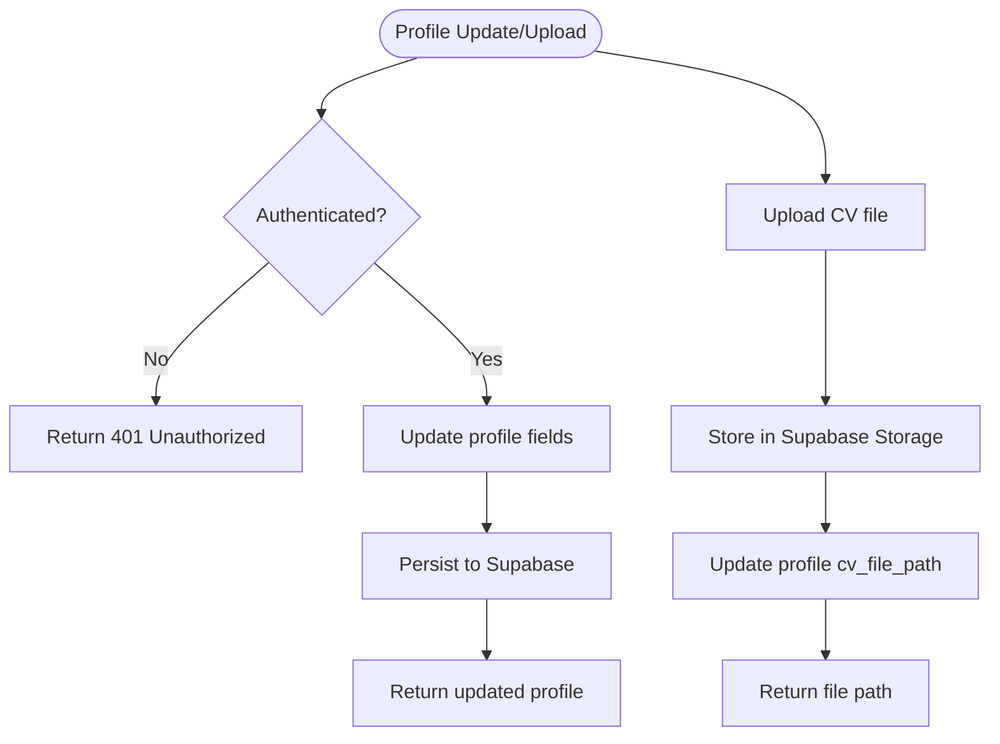
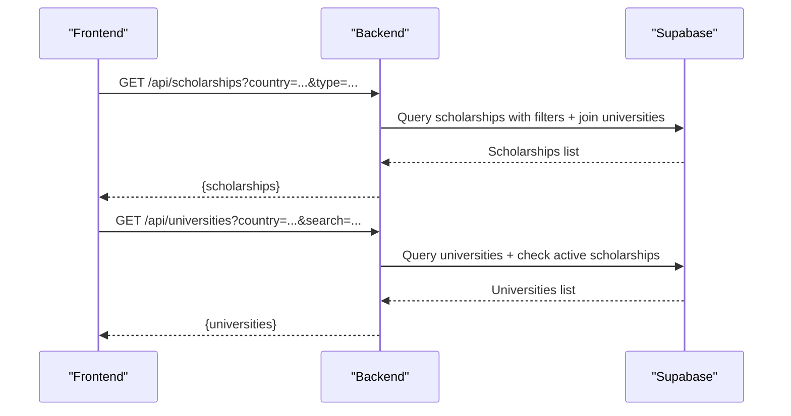
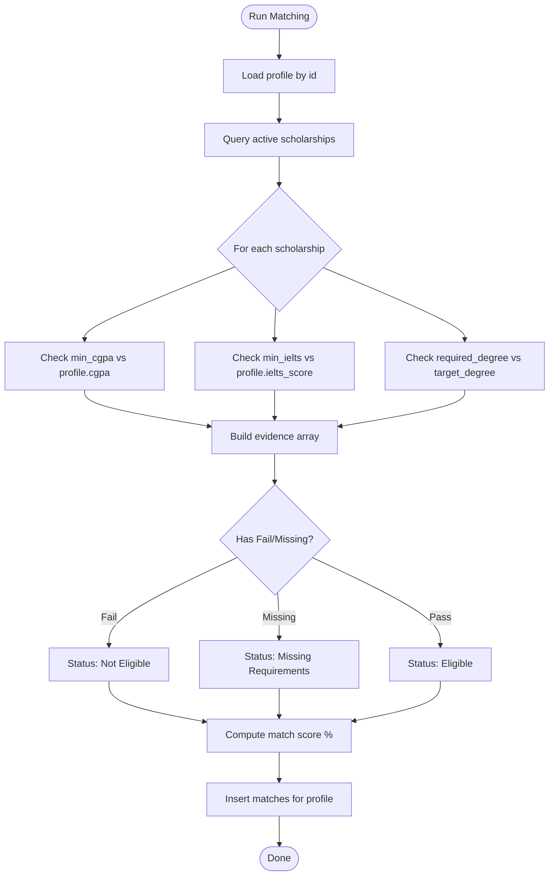
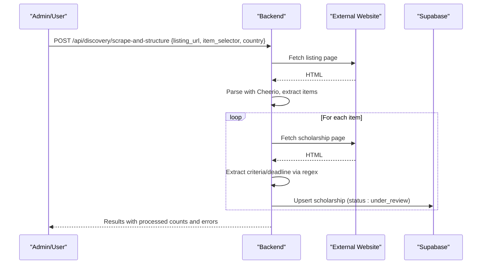
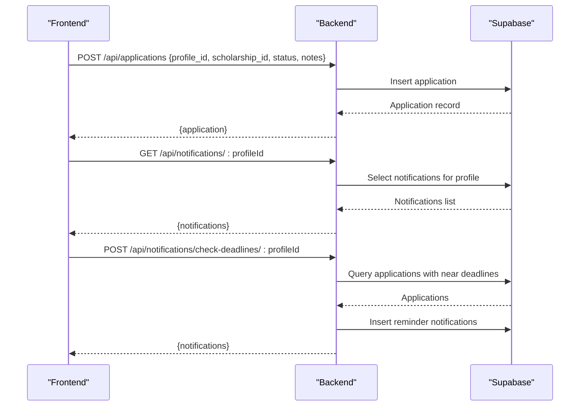
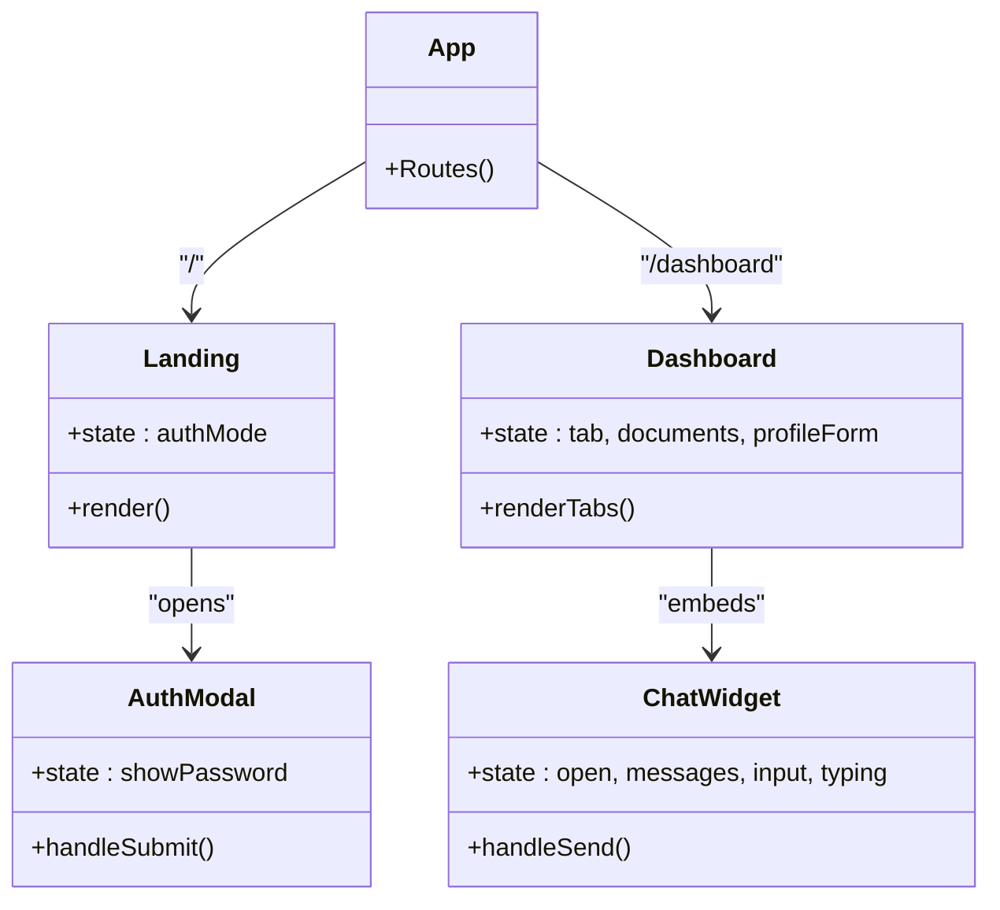
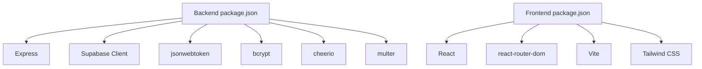

# Architecture Overview

<cite>
**Referenced Files in This Document**
- [index.js](file://aischolarpath-backend-main/aischolarpath-backend-main/index.js)
- [package.json](file://aischolarpath-backend-main/aischolarpath-backend-main/package.json)
- [App.jsx](file://scholarpath-frontend (2)/scholarpath/src/App.jsx)
- [main.jsx](file://scholarpath-frontend (2)/scholarpath/src/main.jsx)
- [Dashboard.jsx](file://scholarpath-frontend (2)/scholarpath/src/pages/Dashboard.jsx)
- [Landing.jsx](file://scholarpath-frontend (2)/scholarpath/src/pages/Landing.jsx)
- [AuthModal.jsx](file://scholarpath-frontend (2)/scholarpath/src/components/AuthModal.jsx)
- [ChatWidget.jsx](file://scholarpath-frontend (2)/scholarpath/src/components/ChatWidget.jsx)
- [mockData.js](file://scholarpath-frontend (2)/scholarpath/src/data/mockData.js)
</cite>

## Table of Contents
1. [Introduction](#introduction)
2. [Project Structure](#project-structure)
3. [Core Components](#core-components)
4. [Architecture Overview](#architecture-overview)
5. [Detailed Component Analysis](#detailed-component-analysis)
6. [Dependency Analysis](#dependency-analysis)
7. [Performance Considerations](#performance-considerations)
8. [Troubleshooting Guide](#troubleshooting-guide)
9. [Conclusion](#conclusion)

## Introduction
ScholarPathAI is a full-stack application that helps students discover and apply for scholarships by matching their academic profiles to relevant opportunities. The system separates concerns into:
- A React frontend that renders the user interface, manages local state, and navigates between pages.
- An Express backend that exposes RESTful APIs for authentication, profile management, scholarship discovery, matching, document tools, notifications, and web scraping.
- A Supabase-backed database that stores profiles, scholarships, universities, matches, applications, shortlists, attestation steps, notifications, and discovery logs.

The architecture emphasizes clear boundaries: the frontend focuses on UI and user interactions; the backend centralizes business logic, security, data access, and integrations with external services like Supabase Storage and third-party websites via scraping.

## Project Structure
The repository contains two primary projects:
- Backend: an Express server with middleware for CORS, JSON parsing, file uploads, JWT authentication, and route handlers for all features.
- Frontend: a React application using Vite, React Router, Tailwind CSS, and component-based pages and reusable UI elements.

**Diagram sources**
- [main.jsx:1-11](file://scholarpath-frontend (2)/scholarpath/src/main.jsx#L1-L11)
- [App.jsx:1-15](file://scholarpath-frontend (2)/scholarpath/src/App.jsx#L1-L15)
- [Landing.jsx:1-211](file://scholarpath-frontend (2)/scholarpath/src/pages/Landing.jsx#L1-L211)
- [Dashboard.jsx:1-187](file://scholarpath-frontend (2)/scholarpath/src/pages/Dashboard.jsx#L1-L187)
- [AuthModal.jsx:1-84](file://scholarpath-frontend (2)/scholarpath/src/components/AuthModal.jsx#L1-L84)
- [ChatWidget.jsx:1-104](file://scholarpath-frontend (2)/scholarpath/src/components/ChatWidget.jsx#L1-L104)
- [mockData.js:1-349](file://scholarpath-frontend (2)/scholarpath/src/data/mockData.js#L1-L349)
- [index.js:1-1599](file://aischolarpath-backend-main/aischolarpath-backend-main/index.js#L1-L1599)

**Section sources**
- [main.jsx:1-11](file://scholarpath-frontend (2)/scholarpath/src/main.jsx#L1-L11)
- [App.jsx:1-15](file://scholarpath-frontend (2)/scholarpath/src/App.jsx#L1-L15)
- [package.json:1-14](file://aischolarpath-backend-main/aischolarpath-backend-main/package.json#L1-L14)
- [package.json:1-28](file://scholarpath-frontend (2)/scholarpath/package.json#L1-L28)

## Core Components
- Authentication and Authorization:
  - JWT-based token issuance on signup/login and verification on protected routes.
  - Middleware extracts and validates tokens, attaching user identity to requests.
- Profile Management:
  - Update and retrieve profile data linked to authenticated users.
  - Upload CVs to Supabase Storage and persist file paths.
  - Placeholder endpoint for AI-driven CV analysis.
- Scholarship and University Discovery:
  - Filtered listing endpoints for scholarships and universities.
  - Web scraping endpoints to fetch and parse external pages, extract eligibility criteria, deadlines, and store results.
- Matching Engine:
  - Evaluates student eligibility against scholarship requirements and computes match scores.
  - Stores matches and provides overview summaries and top recommendations.
- Applications and Shortlists:
  - Track applications per profile with status, notes, and next actions.
  - Manage shortlisted items (scholarships/universities).
- Notifications and Roadmaps:
  - Create and read notifications, including deadline reminders.
  - Generate personalized roadmaps based on nearest scholarship deadlines.
- Static Guides:
  - Language preparation guides and attestation authority steps served as static reference data.

**Section sources**
- [index.js:32-48](file://aischolarpath-backend-main/aischolarpath-backend-main/index.js#L32-L48)
- [index.js:70-188](file://aischolarpath-backend-main/aischolarpath-backend-main/index.js#L70-L188)
- [index.js:190-288](file://aischolarpath-backend-main/aischolarpath-backend-main/index.js#L190-L288)
- [index.js:519-573](file://aischolarpath-backend-main/aischolarpath-backend-main/index.js#L519-L573)
- [index.js:575-749](file://aischolarpath-backend-main/aischolarpath-backend-main/index.js#L575-L749)
- [index.js:751-820](file://aischolarpath-backend-main/aischolarpath-backend-main/index.js#L751-L820)
- [index.js:822-932](file://aischolarpath-backend-main/aischolarpath-backend-main/index.js#L822-L932)
- [index.js:983-1100](file://aischolarpath-backend-main/aischolarpath-backend-main/index.js#L983-L1100)
- [index.js:1183-1505](file://aischolarpath-backend-main/aischolarpath-backend-main/index.js#L1183-L1505)
- [index.js:1546-1595](file://aischolarpath-backend-main/aischolarpath-backend-main/index.js#L1546-L1595)

## Architecture Overview
The system follows a client-server model:
- Frontend: React app with routing and components. Currently uses mock data for demo purposes but is structured to call backend APIs when integrated.
- Backend: Express server with modular route handlers and middleware. Uses Supabase for relational data and storage. Includes robust error handling and environment validation at startup.
- Database: Supabase Postgres with tables inferred from usage: profiles, scholarships, universities, matches, applications, shortlist, attestation_steps, notifications, discovery_log.

**Diagram sources**
- [index.js:519-573](file://aischolarpath-backend-main/aischolarpath-backend-main/index.js#L519-L573)
- [index.js:70-110](file://aischolarpath-backend-main/aischolarpath-backend-main/index.js#L70-L110)
- [App.jsx:1-15](file://scholarpath-frontend (2)/scholarpath/src/App.jsx#L1-L15)
- [Dashboard.jsx:1-187](file://scholarpath-frontend (2)/scholarpath/src/pages/Dashboard.jsx#L1-L187)

## Detailed Component Analysis

### Authentication Flow (JWT)
- Signup: Creates a profile with hashed password, returns user info and a JWT valid for seven days.
- Login: Validates email/password, signs and returns a JWT.
- Protected Routes: Middleware verifies token presence and validity, attaches user ID to request context, and enforces ownership checks where applicable.
- Password Reset: Generates a time-bound reset token stored in the profile record; resets password after verifying token and expiry.

**Diagram sources**
- [index.js:519-573](file://aischolarpath-backend-main/aischolarpath-backend-main/index.js#L519-L573)
- [index.js:32-48](file://aischolarpath-backend-main/aischolarpath-backend-main/index.js#L32-L48)
- [index.js:70-110](file://aischolarpath-backend-main/aischolarpath-backend-main/index.js#L70-L110)

**Section sources**
- [index.js:519-573](file://aischolarpath-backend-main/aischolarpath-backend-main/index.js#L519-L573)
- [index.js:32-48](file://aischolarpath-backend-main/aischolarpath-backend-main/index.js#L32-L48)
- [index.js:1102-1181](file://aischolarpath-backend-main/aischolarpath-backend-main/index.js#L1102-L1181)

### Profile and Document Management
- Update Profile: Partial updates for CGPA, IELTS score, target country/degree/department.
- View Profile: Authorized retrieval by user ID.
- Upload CV: File uploaded to memory, then stored in Supabase Storage under a user-scoped path; file path persisted in profile.
- Analyze CV: Placeholder endpoint to integrate future AI extraction service; currently inserts mock extracted data and updates profile fields.

**Diagram sources**
- [index.js:70-188](file://aischolarpath-backend-main/aischolarpath-backend-main/index.js#L70-L188)

**Section sources**
- [index.js:70-188](file://aischolarpath-backend-main/aischolarpath-backend-main/index.js#L70-L188)

### Scholarship and University Discovery
- List Scholarships: Supports filtering by country, type, department, degree level; joins university details.
- List Universities: Filters by country, degree programs, search term; includes universities with direct scholarships or country-wide scholarships.
- Single Entities: Endpoints to retrieve specific scholarship or university by ID.

**Diagram sources**
- [index.js:190-288](file://aischolarpath-backend-main/aischolarpath-backend-main/index.js#L190-L288)

**Section sources**
- [index.js:190-288](file://aischolarpath-backend-main/aischolarpath-backend-main/index.js#L190-L288)

### Matching Algorithm
- Input: Student profile (CGPA, IELTS, target degree/department/country).
- Process: For each active scholarship, evaluate eligibility criteria (minimum CGPA, minimum IELTS, required degree), compute pass/fail/missing evidence, derive match score percentage, and assign status (Eligible, Missing Requirements, Not Eligible).
- Output: Persist matches per profile, enable overview aggregation and top recommendations.

**Diagram sources**
- [index.js:575-673](file://aischolarpath-backend-main/aischolarpath-backend-main/index.js#L575-L673)

**Section sources**
- [index.js:575-673](file://aischolarpath-backend-main/aischolarpath-backend-main/index.js#L575-L673)

### Web Scraping Architecture
- Generic Scraper: Fetches a URL, parses HTML with Cheerio using provided selectors, extracts titles and links, logs results.
- Bulk Scraper: Iterates multiple URLs with delays to avoid rate limiting, logs outcomes.
- Scrape-and-Structure: Scrapes listing pages, visits individual scholarship pages, extracts eligibility criteria and deadlines via pattern matching, upserts into scholarships table with “under_review” status.
- Official Page Scraper: Directly scrapes official scholarship pages for structured data.
- Pending Review Endpoint: Lists scholarships awaiting manual verification.

**Diagram sources**
- [index.js:1183-1505](file://aischolarpath-backend-main/aischolarpath-backend-main/index.js#L1183-L1505)

**Section sources**
- [index.js:1183-1505](file://aischolarpath-backend-main/aischolarpath-backend-main/index.js#L1183-L1505)

### Application Tracking and Notifications
- Applications: Create, update, list, delete applications per profile with status, notes, and next actions.
- Notifications: Create notifications, list per profile, mark as read, and generate deadline reminders for upcoming applications.
- Roadmap: Generate personalized task roadmap based on nearest scholarship deadline among eligible or missing-requirements matches.

**Diagram sources**
- [index.js:822-932](file://aischolarpath-backend-main/aischolarpath-backend-main/index.js#L822-L932)
- [index.js:983-1100](file://aischolarpath-backend-main/aischolarpath-backend-main/index.js#L983-L1100)
- [index.js:1546-1595](file://aischolarpath-backend-main/aischolarpath-backend-main/index.js#L1546-L1595)

**Section sources**
- [index.js:822-932](file://aischolarpath-backend-main/aischolarpath-backend-main/index.js#L822-L932)
- [index.js:983-1100](file://aischolarpath-backend-main/aischolarpath-backend-main/index.js#L983-L1100)
- [index.js:1546-1595](file://aischolarpath-backend-main/aischolarpath-backend-main/index.js#L1546-L1595)

### Frontend Component-Based Structure
- Routing: Root app defines routes for landing and dashboard.
- Landing Page: Marketing content with auth modal triggers for login/signup.
- Dashboard: Tabbed interface aggregating overview, profile, attestation, universities, scholarships, CV builder, and FAQ tabs; integrates chat widget.
- Auth Modal: Local form handling for demo; currently navigates directly without backend integration.
- Chat Widget: Local chat UI with canned responses; placeholder for backend chat endpoint.

**Diagram sources**
- [App.jsx:1-15](file://scholarpath-frontend (2)/scholarpath/src/App.jsx#L1-L15)
- [Landing.jsx:1-211](file://scholarpath-frontend (2)/scholarpath/src/pages/Landing.jsx#L1-L211)
- [Dashboard.jsx:1-187](file://scholarpath-frontend (2)/scholarpath/src/pages/Dashboard.jsx#L1-L187)
- [AuthModal.jsx:1-84](file://scholarpath-frontend (2)/scholarpath/src/components/AuthModal.jsx#L1-L84)
- [ChatWidget.jsx:1-104](file://scholarpath-frontend (2)/scholarpath/src/components/ChatWidget.jsx#L1-L104)

**Section sources**
- [App.jsx:1-15](file://scholarpath-frontend (2)/scholarpath/src/App.jsx#L1-L15)
- [Landing.jsx:1-211](file://scholarpath-frontend (2)/scholarpath/src/pages/Landing.jsx#L1-L211)
- [Dashboard.jsx:1-187](file://scholarpath-frontend (2)/scholarpath/src/pages/Dashboard.jsx#L1-L187)
- [AuthModal.jsx:1-84](file://scholarpath-frontend (2)/scholarpath/src/components/AuthModal.jsx#L1-L84)
- [ChatWidget.jsx:1-104](file://scholarpath-frontend (2)/scholarpath/src/components/ChatWidget.jsx#L1-L104)

## Dependency Analysis
- Backend Dependencies:
  - Express for HTTP server and routing.
  - Supabase JS client for database and storage operations.
  - JSON Web Token for authentication.
  - Bcrypt for password hashing.
  - Cheerio for HTML parsing during scraping.
  - Multer for file uploads.
  - Undici agent for connection pooling and timeouts.
  - CORS and dotenv for cross-origin requests and environment configuration.
- Frontend Dependencies:
  - React and ReactDOM for UI rendering.
  - React Router for navigation.
  - Vite for build tooling.
  - Tailwind CSS for styling.

**Diagram sources**
- [package.json:1-14](file://aischolarpath-backend-main/aischolarpath-backend-main/package.json#L1-L14)
- [package.json:1-28](file://scholarpath-frontend (2)/scholarpath/package.json#L1-L28)

**Section sources**
- [package.json:1-14](file://aischolarpath-backend-main/aischolarpath-backend-main/package.json#L1-L14)
- [package.json:1-28](file://scholarpath-frontend (2)/scholarpath/package.json#L1-L28)

## Performance Considerations
- Connection Pooling: Backend configures an undici agent with connection limits and timeouts to manage concurrent outbound requests efficiently during scraping.
- Rate Limiting and Delays: Bulk scraping introduces delays between requests to respect external site policies and reduce risk of throttling.
- Query Optimization: Filtering and selective field selection reduce payload sizes; joins are used judiciously to minimize N+1 queries.
- Storage Efficiency: CV files are stored in Supabase Storage with user-scoped paths; only metadata (file path) is kept in the database.
- Caching Strategy: No explicit caching layer is implemented; consider adding Redis or in-memory caches for frequently accessed static guides and filtered lists if traffic increases.

[No sources needed since this section provides general guidance]

## Troubleshooting Guide
- Environment Variables: Startup validates required variables (SUPABASE_URL, SUPABASE_KEY, JWT_SECRET); missing values cause immediate exit.
- Authentication Errors:
  - Missing or invalid token returns 401/403 responses with descriptive messages.
  - Ownership checks prevent unauthorized access to other users’ resources.
- Database Errors:
  - All Supabase operations return error messages; centralized error handler catches unhandled exceptions and responds with 500 status.
- Scraping Issues:
  - Network failures and selector mismatches are logged; scrape endpoints insert failure records with error snapshots for review.
- File Uploads:
  - Multer ensures files are present; storage upload errors propagate back to clients.

**Section sources**
- [index.js:5-10](file://aischolarpath-backend-main/aischolarpath-backend-main/index.js#L5-L10)
- [index.js:32-48](file://aischolarpath-backend-main/aischolarpath-backend-main/index.js#L32-L48)
- [index.js:1528-1531](file://aischolarpath-backend-main/aischolarpath-backend-main/index.js#L1528-L1531)
- [index.js:1183-1505](file://aischolarpath-backend-main/aischolarpath-backend-main/index.js#L1183-L1505)

## Conclusion
ScholarPathAI’s architecture cleanly separates frontend presentation from backend business logic and data persistence. The Express server implements secure authentication, comprehensive profile and application management, a robust matching engine, and flexible web scraping capabilities to populate scholarships and universities. The React frontend provides a modern, component-based UI with routing and local state, designed to integrate seamlessly with the backend APIs. Scalability considerations include connection pooling, careful query design, and potential addition of caching layers. The system boundaries are well-defined, with external integrations limited to Supabase and third-party websites via controlled scraping.