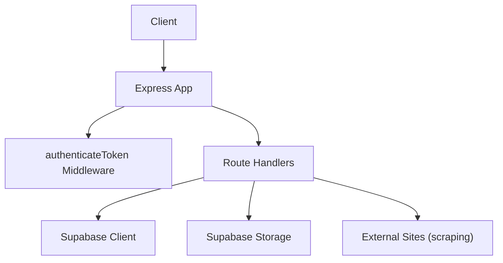
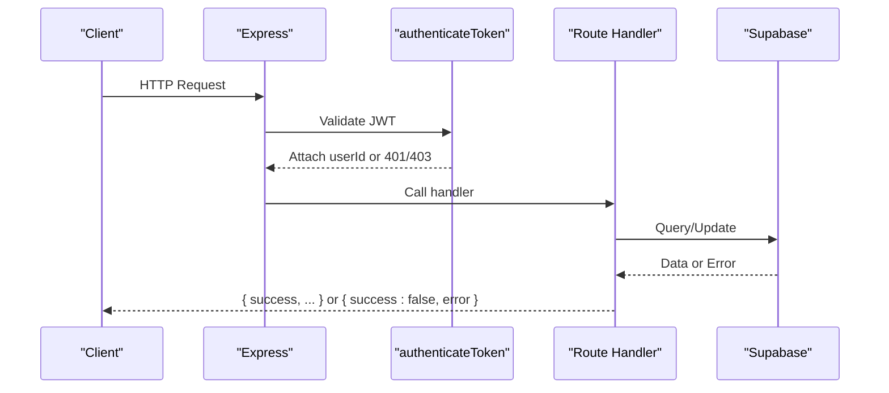
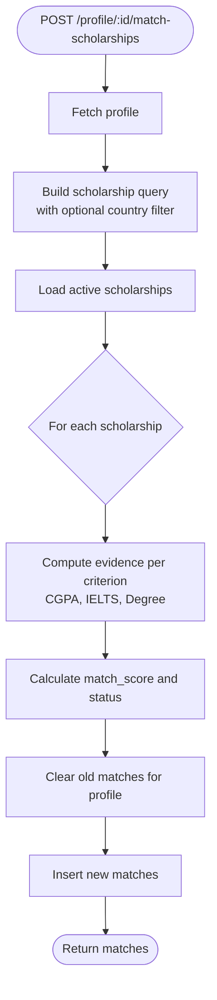
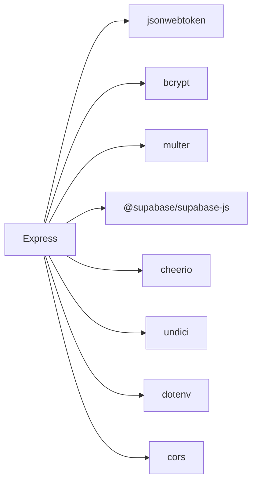

# API Design Patterns

<cite>
**Referenced Files in This Document**
- [index.js](file://aischolarpath-backend-main/aischolarpath-backend-main/index.js)
- [package.json](file://aischolarpath-backend-main/aischolarpath-backend-main/package.json)
</cite>

## Table of Contents
1. Introduction
2. Project Structure
3. Core Components
4. Architecture Overview
5. Detailed Component Analysis
6. Dependency Analysis
7. Performance Considerations
8. Troubleshooting Guide
9. Conclusion

## Introduction
This document explains the RESTful API design patterns implemented in ScholarPathAI’s backend. It focuses on resource-based endpoints, consistent HTTP conventions (GET, POST, PUT/PATCH, DELETE), standardized success/error responses, URL naming conventions, parameter passing strategies, and status code usage. It also covers the middleware pattern for authentication and authorization, request validation approaches, and error response standardization. Examples are provided for profiles, scholarships, universities, and matching functionality.

## Project Structure
The backend is a single-file Express application that:
- Initializes middleware (CORS, JSON parsing, file upload).
- Defines an authentication middleware using JWT.
- Registers routes grouped by domain: auth, profile, scholarships, universities, matching, shortlist, applications, documents, chat, notifications, discovery/scraping, roadmap, and health/test utilities.
- Integrates with Supabase for data persistence and storage.
- Exposes a centralized error handler for unhandled exceptions.

**Diagram sources**
- [index.js:1-59](file://aischolarpath-backend-main/aischolarpath-backend-main/index.js#L1-L59)
- [index.js:32-48](file://aischolarpath-backend-main/aischolarpath-backend-main/index.js#L32-L48)
- [index.js:50-68](file://aischolarpath-backend-main/aischolarpath-backend-main/index.js#L50-L68)

**Section sources**
- [index.js:1-59](file://aischolarpath-backend-main/aischolarpath-backend-main/index.js#L1-L59)
- [package.json:1-14](file://aischolarpath-backend-main/aischolarpath-backend-main/package.json#L1-L14)

## Core Components
- Authentication middleware: Validates JWT from Authorization header and attaches user identity to requests.
- Resource controllers: Route handlers implement CRUD-like operations over resources such as profiles, scholarships, universities, matches, shortlist, applications, and notifications.
- Data layer: Uses Supabase client for relational queries and Supabase Storage for file uploads.
- Scraping tools: Endpoints fetch and parse external pages to discover or structure scholarship information.
- Error handling: Centralized error handler returns a uniform failure envelope; route handlers return consistent success envelopes.

Key implementation references:
- Authentication middleware: [index.js:32-48](file://aischolarpath-backend-main/aischolarpath-backend-main/index.js#L32-L48)
- Health and DB test endpoints: [index.js:57-68](file://aischolarpath-backend-main/aischolarpath-backend-main/index.js#L57-L68)
- Central error handler: [index.js:1527-1531](file://aischolarpath-backend-main/aischolarpath-backend-main/index.js#L1527-L1531)

**Section sources**
- [index.js:32-48](file://aischolarpath-backend-main/aischolarpath-backend-main/index.js#L32-L48)
- [index.js:57-68](file://aischolarpath-backend-main/aischolarpath-backend-main/index.js#L57-L68)
- [index.js:1527-1531](file://aischolarpath-backend-main/aischolarpath-backend-main/index.js#L1527-L1531)

## Architecture Overview
The API follows a resource-oriented design with clear separation between authentication, business logic, and data access.

**Diagram sources**
- [index.js:32-48](file://aischolarpath-backend-main/aischolarpath-backend-main/index.js#L32-L48)
- [index.js:50-68](file://aischolarpath-backend-main/aischolarpath-backend-main/index.js#L50-L68)

## Detailed Component Analysis

### Authentication and Authorization
- Pattern: JWT-based token in Authorization header. Middleware verifies token and sets req.userId.
- Access control: Many routes enforce ownership by comparing req.userId with resource identifiers in path params.
- Status codes: 401 for missing token, 403 for invalid/expired token or unauthorized access, 400 for validation errors, 404 for not found, 500 for server errors.

References:
- Middleware: [index.js:32-48](file://aischolarpath-backend-main/aischolarpath-backend-main/index.js#L32-L48)
- Ownership checks examples: [index.js:94-110](file://aischolarpath-backend-main/aischolarpath-backend-main/index.js#L94-L110), [index.js:112-145](file://aischolarpath-backend-main/aischolarpath-backend-main/index.js#L112-L145), [index.js:575-580](file://aischolarpath-backend-main/aischolarpath-backend-main/index.js#L575-L580)

**Section sources**
- [index.js:32-48](file://aischolarpath-backend-main/aischolarpath-backend-main/index.js#L32-L48)
- [index.js:94-110](file://aischolarpath-backend-main/aischolarpath-backend-main/index.js#L94-L110)
- [index.js:112-145](file://aischolarpath-backend-main/aischolarpath-backend-main/index.js#L112-L145)
- [index.js:575-580](file://aischolarpath-backend-main/aischolarpath-backend-main/index.js#L575-L580)

### Profiles API
- PATCH /api/profile: Update current user’s profile fields. Returns updated profile.
- GET /api/profile/:id: Retrieve profile by id (owner-only).
- POST /api/profile/:id/upload-cv: Upload CV to storage and link to profile.
- POST /api/profile/:id/analyze: Analyze CV and update extracted fields (placeholder).
- GET /api/profile/:id/matches: Get stored matches for a profile.
- GET /api/profile/:id/overview: Dashboard overview aggregating profile completeness and match summaries.

Design highlights:
- Path params for resource identification (:id).
- Partial updates via PATCH with selective field updates.
- Consistent response envelope: { success: true/false, ... }.

References:
- Profile update: [index.js:70-91](file://aischolarpath-backend-main/aischolarpath-backend-main/index.js#L70-L91)
- Profile read: [index.js:94-110](file://aischolarpath-backend-main/aischolarpath-backend-main/index.js#L94-L110)
- CV upload: [index.js:112-145](file://aischolarpath-backend-main/aischolarpath-backend-main/index.js#L112-L145)
- CV analyze: [index.js:147-188](file://aischolarpath-backend-main/aischolarpath-backend-main/index.js#L147-L188)
- Matches list: [index.js:676-692](file://aischolarpath-backend-main/aischolarpath-backend-main/index.js#L676-L692)
- Overview: [index.js:694-749](file://aischolarpath-backend-main/aischolarpath-backend-main/index.js#L694-L749)

**Section sources**
- [index.js:70-91](file://aischolarpath-backend-main/aischolarpath-backend-main/index.js#L70-L91)
- [index.js:94-110](file://aischolarpath-backend-main/aischolarpath-backend-main/index.js#L94-L110)
- [index.js:112-145](file://aischolarpath-backend-main/aischolarpath-backend-main/index.js#L112-L145)
- [index.js:147-188](file://aischolarpath-backend-main/aischolarpath-backend-main/index.js#L147-L188)
- [index.js:676-692](file://aischolarpath-backend-main/aischolarpath-backend-main/index.js#L676-L692)
- [index.js:694-749](file://aischolarpath-backend-main/aischolarpath-backend-main/index.js#L694-L749)

### Scholarships API
- GET /api/scholarships: List scholarships with query filters (country, type, department, degree_level).
- GET /api/scholarships/:id: Single scholarship detail.
- PATCH /api/scholarships/:id/approve: Approve a scraped scholarship and set eligibility criteria/deadline.
- GET /api/scholarships/pending/review: Admin-style listing of pending items.

Design highlights:
- Query parameters for filtering.
- Resource-specific actions via subpaths (e.g., approve).
- Consistent pagination/limiting where applicable (e.g., limited results in university listing).

References:
- List with filters: [index.js:190-206](file://aischolarpath-backend-main/aischolarpath-backend-main/index.js#L190-L206)
- Single: [index.js:209-222](file://aischolarpath-backend-main/aischolarpath-backend-main/index.js#L209-L222)
- Approve: [index.js:1508-1526](file://aischolarpath-backend-main/aischolarpath-backend-main/index.js#L1508-L1526)
- Pending review: [index.js:1495-1505](file://aischolarpath-backend-main/aischolarpath-backend-main/index.js#L1495-L1505)

**Section sources**
- [index.js:190-206](file://aischolarpath-backend-main/aischolarpath-backend-main/index.js#L190-L206)
- [index.js:209-222](file://aischolarpath-backend-main/aischolarpath-backend-main/index.js#L209-L222)
- [index.js:1495-1505](file://aischolarpath-backend-main/aischolarpath-backend-main/index.js#L1495-L1505)
- [index.js:1508-1526](file://aischolarpath-backend-main/aischolarpath-backend-main/index.js#L1508-L1526)

### Universities API
- GET /api/universities: List universities with filters (country, degree_program, search) and include those with direct scholarships or country-wide scholarships. Limited to top N results.
- GET /api/universities/:id: Single university detail.

Design highlights:
- Combines multiple data sources to enrich results.
- Uses query params for flexible filtering.

References:
- Listing: [index.js:224-271](file://aischolarpath-backend-main/aischolarpath-backend-main/index.js#L224-L271)
- Single: [index.js:275-288](file://aischolarpath-backend-main/aischolarpath-backend-main/index.js#L275-L288)

**Section sources**
- [index.js:224-271](file://aischolarpath-backend-main/aischolarpath-backend-main/index.js#L224-L271)
- [index.js:275-288](file://aischolarpath-backend-main/aischolarpath-backend-main/index.js#L275-L288)

### Matching Functionality
- POST /api/profile/:id/match-scholarships: Compute matches against active scholarships based on profile attributes and store results.
- GET /api/profile/:id/matches: Retrieve stored matches sorted by score.

Design highlights:
- Business logic computes eligibility evidence and scores per scholarship.
- Clears previous matches before inserting fresh results to ensure consistency.

**Diagram sources**
- [index.js:575-673](file://aischolarpath-backend-main/aischolarpath-backend-main/index.js#L575-L673)

**Section sources**
- [index.js:575-673](file://aischolarpath-backend-main/aischolarpath-backend-main/index.js#L575-L673)
- [index.js:676-692](file://aischolarpath-backend-main/aischolarpath-backend-main/index.js#L676-L692)

### Applications and Shortlist
- Applications: Create, update, list, delete applications tied to a profile and scholarship.
- Shortlist: Add/remove items and retrieve full details for a profile.

Design highlights:
- Ownership checks ensure users can only modify their own resources.
- Use of PATCH for partial updates and DELETE for removals.

References:
- Applications create/update/list/delete: [index.js:822-932](file://aischolarpath-backend-main/aischolarpath-backend-main/index.js#L822-L932)
- Shortlist add/remove/get: [index.js:751-820](file://aischolarpath-backend-main/aischolarpath-backend-main/index.js#L751-L820)

**Section sources**
- [index.js:751-820](file://aischolarpath-backend-main/aischolarpath-backend-main/index.js#L751-L820)
- [index.js:822-932](file://aischolarpath-backend-main/aischolarpath-backend-main/index.js#L822-L932)

### Notifications and Roadmap
- Notifications: Create, list, mark read, and check upcoming deadlines to generate reminders.
- Roadmap: Generate personalized task timeline based on nearest deadline among matches.

Design highlights:
- Time-based logic for deadline checks and roadmap generation.
- Consistent response envelopes.

References:
- Notifications CRUD and deadline check: [index.js:983-1100](file://aischolarpath-backend-main/aischolarpath-backend-main/index.js#L983-L1100)
- Roadmap: [index.js:1546-1595](file://aischolarpath-backend-main/aischolarpath-backend-main/index.js#L1546-L1595)

**Section sources**
- [index.js:983-1100](file://aischolarpath-backend-main/aischolarpath-backend-main/index.js#L983-L1100)
- [index.js:1546-1595](file://aischolarpath-backend-main/aischolarpath-backend-main/index.js#L1546-L1595)

### Discovery and Scraping Tools
- Scrape single/bulk URLs and extract items using CSS selectors.
- Scrape-and-structure: Visit listing pages, then individual pages to extract eligibility criteria and deadlines.
- Official page scraping: Directly scrape official scholarship pages and upsert into scholarships table.
- Logs: View past scraping logs.

Design highlights:
- Input validation for required selectors and URLs.
- Rate limiting via delays to be polite to target sites.
- Logging outcomes to a discovery_log table.

References:
- Single scrape: [index.js:1183-1243](file://aischolarpath-backend-main/aischolarpath-backend-main/index.js#L1183-L1243)
- Logs: [index.js:1246-1257](file://aischolarpath-backend-main/aischolarpath-backend-main/index.js#L1246-L1257)
- Bulk scrape: [index.js:1259-1309](file://aischolarpath-backend-main/aischolarpath-backend-main/index.js#L1259-L1309)
- Scrape-and-structure: [index.js:1311-1390](file://aischolarpath-backend-main/aischolarpath-backend-main/index.js#L1311-L1390)
- Official scrape: [index.js:1392-1439](file://aischolarpath-backend-main/aischolarpath-backend-main/index.js#L1392-L1439)
- Official bulk: [index.js:1441-1493](file://aischolarpath-backend-main/aischolarpath-backend-main/index.js#L1441-L1493)

**Section sources**
- [index.js:1183-1243](file://aischolarpath-backend-main/aischolarpath-backend-main/index.js#L1183-L1243)
- [index.js:1246-1257](file://aischolarpath-backend-main/aischolarpath-backend-main/index.js#L1246-L1257)
- [index.js:1259-1309](file://aischolarpath-backend-main/aischolarpath-backend-main/index.js#L1259-L1309)
- [index.js:1311-1390](file://aischolarpath-backend-main/aischolarpath-backend-main/index.js#L1311-L1390)
- [index.js:1392-1439](file://aischolarpath-backend-main/aischolarpath-backend-main/index.js#L1392-L1439)
- [index.js:1441-1493](file://aischolarpath-backend-main/aischolarpath-backend-main/index.js#L1441-L1493)

### Response Format and Status Codes
- Success envelope: { success: true, ...payload }
- Error envelope: { success: false, error: "message" }
- Status codes:
  - 200 OK for successful reads/updates
  - 201 Created implied by successful creates returning created entities
  - 400 Bad Request for validation failures
  - 401 Unauthorized for missing tokens
  - 403 Forbidden for invalid/expired tokens or unauthorized access
  - 404 Not Found for missing resources
  - 500 Internal Server Error for unexpected errors

References:
- Example success/error patterns across routes: [index.js:57-68](file://aischolarpath-backend-main/aischolarpath-backend-main/index.js#L57-L68), [index.js:70-91](file://aischolarpath-backend-main/aischolarpath-backend-main/index.js#L70-L91), [index.js:190-206](file://aischolarpath-backend-main/aischolarpath-backend-main/index.js#L190-L206), [index.js:519-573](file://aischolarpath-backend-main/aischolarpath-backend-main/index.js#L519-L573), [index.js:1527-1531](file://aischolarpath-backend-main/aischolarpath-backend-main/index.js#L1527-L1531)

**Section sources**
- [index.js:57-68](file://aischolarpath-backend-main/aischolarpath-backend-main/index.js#L57-L68)
- [index.js:70-91](file://aischolarpath-backend-main/aischolarpath-backend-main/index.js#L70-L91)
- [index.js:190-206](file://aischolarpath-backend-main/aischolarpath-backend-main/index.js#L190-L206)
- [index.js:519-573](file://aischolarpath-backend-main/aischolarpath-backend-main/index.js#L519-L573)
- [index.js:1527-1531](file://aischolarpath-backend-main/aischolarpath-backend-main/index.js#L1527-L1531)

### URL Naming Conventions and Parameter Passing
- Base path: /api
- Resources use plural nouns: /profiles (not used directly but implied), /scholarships, /universities, /applications, /shortlist, /notifications
- Path parameters identify specific resources: :id, :profileId, :authority, :testType
- Query parameters for filtering: country, scholarship_type, department, degree_level, search, etc.
- Subresources/actions: /profile/:id/upload-cv, /profile/:id/analyze, /scholarships/:id/approve, /notifications/:id/read

References:
- Path params usage: [index.js:94-110](file://aischolarpath-backend-main/aischolarpath-backend-main/index.js#L94-L110), [index.js:209-222](file://aischolarpath-backend-main/aischolarpath-backend-main/index.js#L209-L222), [index.js:275-288](file://aischolarpath-backend-main/aischolarpath-backend-main/index.js#L275-L288)
- Query params usage: [index.js:190-206](file://aischolarpath-backend-main/aischolarpath-backend-main/index.js#L190-L206), [index.js:224-271](file://aischolarpath-backend-main/aischolarpath-backend-main/index.js#L224-L271)
- Subresource actions: [index.js:112-145](file://aischolarpath-backend-main/aischolarpath-backend-main/index.js#L112-L145), [index.js:147-188](file://aischolarpath-backend-main/aischolarpath-backend-main/index.js#L147-L188), [index.js:1508-1526](file://aischolarpath-backend-main/aischolarpath-backend-main/index.js#L1508-L1526), [index.js:1023-1051](file://aischolarpath-backend-main/aischolarpath-backend-main/index.js#L1023-L1051)

**Section sources**
- [index.js:94-110](file://aischolarpath-backend-main/aischolarpath-backend-main/index.js#L94-L110)
- [index.js:190-206](file://aischolarpath-backend-main/aischolarpath-backend-main/index.js#L190-L206)
- [index.js:224-271](file://aischolarpath-backend-main/aischolarpath-backend-main/index.js#L224-L271)
- [index.js:112-145](file://aischolarpath-backend-main/aischolarpath-backend-main/index.js#L112-L145)
- [index.js:147-188](file://aischolarpath-backend-main/aischolarpath-backend-main/index.js#L147-L188)
- [index.js:1508-1526](file://aischolarpath-backend-main/aischolarpath-backend-main/index.js#L1508-L1526)
- [index.js:1023-1051](file://aischolarpath-backend-main/aischolarpath-backend-main/index.js#L1023-L1051)

### Request Validation Approaches
- Inline validation at route entry points:
  - Check presence of required fields (e.g., email/password, profile_id/item_type/item_id).
  - Validate enums or allowed values (e.g., item_type must be 'scholarship' or 'university').
  - Validate file uploads (e.g., require cv/draft files).
- Return 400 with descriptive error messages when validation fails.

References:
- Auth signup/login validation: [index.js:519-573](file://aischolarpath-backend-main/aischolarpath-backend-main/index.js#L519-L573)
- Shortlist validation: [index.js:751-771](file://aischolarpath-backend-main/aischolarpath-backend-main/index.js#L751-L771)
- Application creation validation: [index.js:822-845](file://aischolarpath-backend-main/aischolarpath-backend-main/index.js#L822-L845)
- File upload validation: [index.js:934-949](file://aischolarpath-backend-main/aischolarpath-backend-main/index.js#L934-L949), [index.js:952-967](file://aischolarpath-backend-main/aischolarpath-backend-main/index.js#L952-L967)

**Section sources**
- [index.js:519-573](file://aischolarpath-backend-main/aischolarpath-backend-main/index.js#L519-L573)
- [index.js:751-771](file://aischolarpath-backend-main/aischolarpath-backend-main/index.js#L751-L771)
- [index.js:822-845](file://aischolarpath-backend-main/aischolarpath-backend-main/index.js#L822-L845)
- [index.js:934-949](file://aischolarpath-backend-main/aischolarpath-backend-main/index.js#L934-L949)
- [index.js:952-967](file://aischolarpath-backend-main/aischolarpath-backend-main/index.js#L952-L967)

### Error Response Standardization
- All routes return a consistent envelope:
  - Success: { success: true, ...data }
  - Failure: { success: false, error: "message" }
- Central error handler catches unhandled exceptions and returns a uniform 500 response.

References:
- Central handler: [index.js:1527-1531](file://aischolarpath-backend-main/aischolarpath-backend-main/index.js#L1527-L1531)
- Example error responses: [index.js:62-68](file://aischolarpath-backend-main/aischolarpath-backend-main/index.js#L62-L68), [index.js:87-90](file://aischolarpath-backend-main/aischolarpath-backend-main/index.js#L87-L90), [index.js:202-205](file://aischolarpath-backend-main/aischolarpath-backend-main/index.js#L202-L205)

**Section sources**
- [index.js:1527-1531](file://aischolarpath-backend-main/aischolarpath-backend-main/index.js#L1527-L1531)
- [index.js:62-68](file://aischolarpath-backend-main/aischolarpath-backend-main/index.js#L62-L68)
- [index.js:87-90](file://aischolarpath-backend-main/aischolarpath-backend-main/index.js#L87-L90)
- [index.js:202-205](file://aischolarpath-backend-main/aischolarpath-backend-main/index.js#L202-L205)

## Dependency Analysis
The backend depends on:
- Express for routing and middleware.
- CORS for cross-origin requests.
- dotenv for environment configuration.
- bcrypt for password hashing.
- jsonwebtoken for token issuance and verification.
- multer for file uploads.
- @supabase/supabase-js for database and storage interactions.
- cheerio for HTML parsing during scraping.
- undici for HTTP agent configuration.

**Diagram sources**
- [package.json:1-14](file://aischolarpath-backend-main/aischolarpath-backend-main/package.json#L1-L14)

**Section sources**
- [package.json:1-14](file://aischolarpath-backend-main/aischolarpath-backend-main/package.json#L1-L14)

## Performance Considerations
- Connection pooling: Configured undici agent with connection limits and timeouts to manage outbound requests efficiently.
- Rate limiting: Delays introduced in scraping flows to avoid overwhelming target sites.
- Query optimization: Select only needed fields and limit result sets (e.g., universities limited to top 10).
- Batch operations: Bulk scraping endpoints process multiple URLs sequentially with delays to balance throughput and politeness.

[No sources needed since this section provides general guidance]

## Troubleshooting Guide
Common issues and how they are handled:
- Missing or invalid JWT: Returns 401/403 with a clear message.
- Validation failures: Returns 400 with descriptive errors.
- Resource not found: Returns 404 with error message.
- Database/storage errors: Returns 500 with error message.
- Unhandled exceptions: Caught by central error handler and returned as 500 with a generic message.

References:
- Auth errors: [index.js:32-48](file://aischolarpath-backend-main/aischolarpath-backend-main/index.js#L32-L48)
- Validation errors: [index.js:519-573](file://aischolarpath-backend-main/aischolarpath-backend-main/index.js#L519-L573)
- Not found: [index.js:209-222](file://aischolarpath-backend-main/aischolarpath-backend-main/index.js#L209-L222)
- Central error handler: [index.js:1527-1531](file://aischolarpath-backend-main/aischolarpath-backend-main/index.js#L1527-L1531)

**Section sources**
- [index.js:32-48](file://aischolarpath-backend-main/aischolarpath-backend-main/index.js#L32-L48)
- [index.js:519-573](file://aischolarpath-backend-main/aischolarpath-backend-main/index.js#L519-L573)
- [index.js:209-222](file://aischolarpath-backend-main/aischolarpath-backend-main/index.js#L209-L222)
- [index.js:1527-1531](file://aischolarpath-backend-main/aischolarpath-backend-main/index.js#L1527-L1531)

## Conclusion
ScholarPathAI’s backend implements a clean, resource-oriented REST API with consistent patterns:
- Resource-based endpoints under /api with clear HTTP methods.
- Standardized success/error response envelopes and appropriate status codes.
- JWT-based authentication middleware with ownership checks for authorization.
- Flexible query parameters for filtering and path parameters for resource identification.
- Robust error handling and validation at route boundaries.
- Practical features like matching, applications, shortlists, notifications, and discovery/scraping tools.

These patterns provide a solid foundation for scalability, maintainability, and a predictable client experience.

[No sources needed since this section summarizes without analyzing specific files]