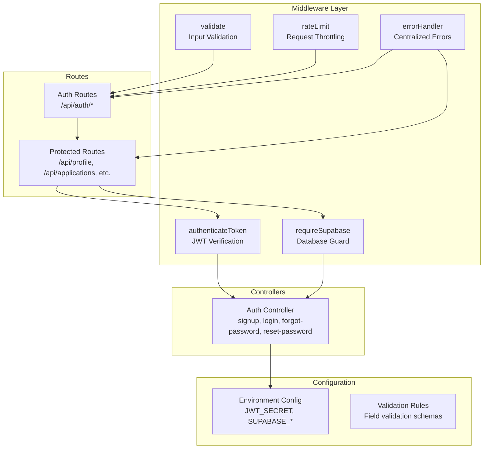
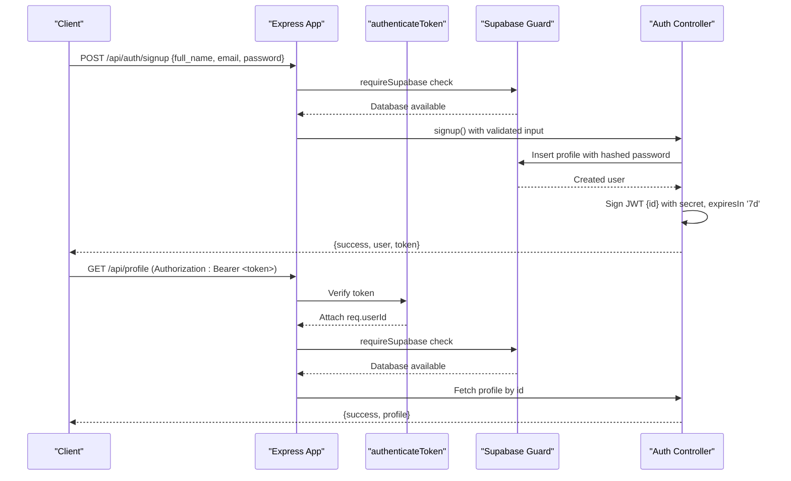
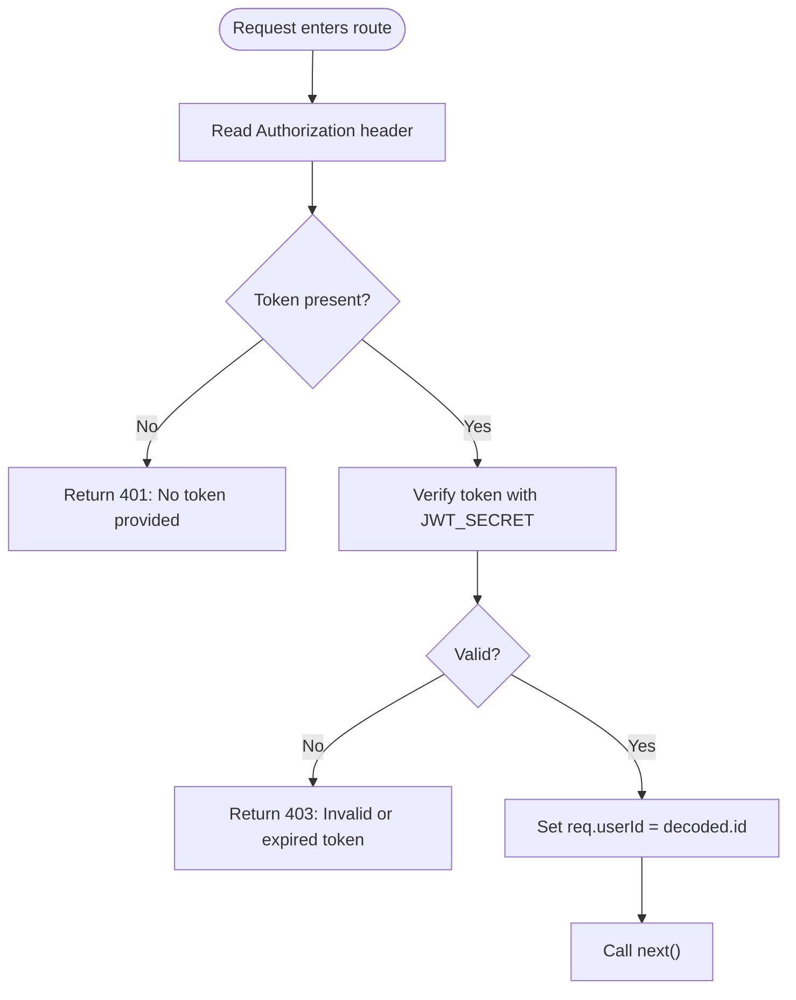
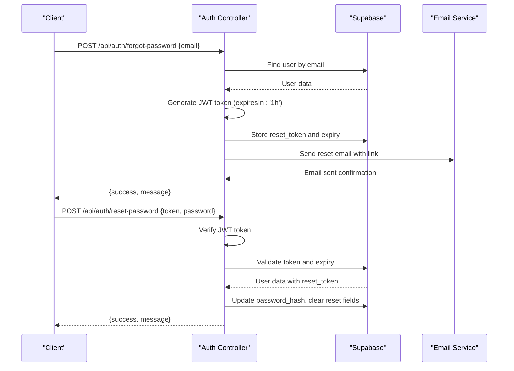
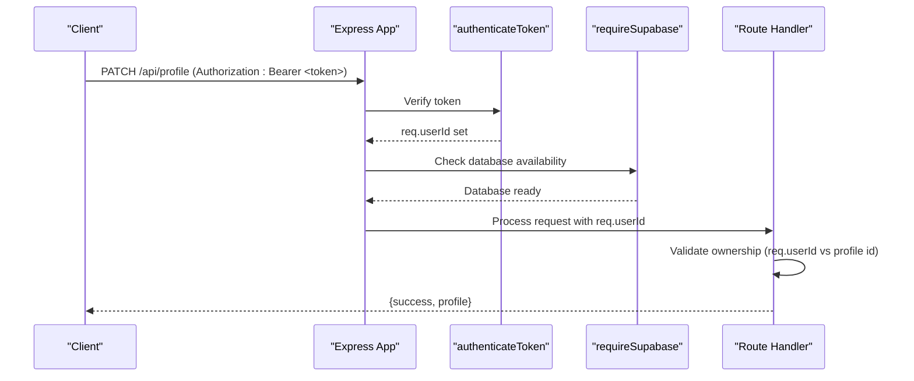
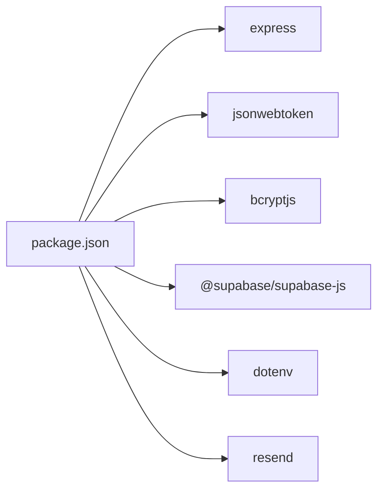

# Authentication System

<cite>
**Referenced Files in This Document**
- [auth.js](file://aischolarpath-backend-main/aischolarpath-backend-main/middleware/auth.js)
- [errorHandler.js](file://aischolarpath-backend-main/aischolarpath-backend-main/middleware/errorHandler.js)
- [supabaseGuard.js](file://aischolarpath-backend-main/aischolarpath-backend-main/middleware/supabaseGuard.js)
- [auth.controller.js](file://aischolarpath-backend-main/aischolarpath-backend-main/controllers/auth.controller.js)
- [auth.routes.js](file://aischolarpath-backend-main/aischolarpath-backend-main/routes/auth.routes.js)
- [index.js](file://aischolarpath-backend-main/aischolarpath-backend-main/index.js)
- [validation.js](file://aischolarpath-backend-main/aischolarpath-backend-main/validation.js)
- [env.js](file://aischolarpath-backend-main/aischolarpath-backend-main/config/env.js)
- [package.json](file://aischolarpath-backend-main/aischolarpath-backend-main/package.json)
</cite>

## Update Summary
**Changes Made**
- Enhanced authentication system with dedicated middleware in `middleware/auth.js` for JWT verification
- Improved error handling with centralized `errorHandler.js` middleware
- Added Supabase guard middleware (`supabaseGuard.js`) for database availability checks
- Password reset flow now supports both modern token-based links and legacy reset links with proper form validation
- Modularized authentication logic into separate middleware and controller files

## Table of Contents
1. [Introduction](#introduction)
2. [Project Structure](#project-structure)
3. [Core Components](#core-components)
4. [Architecture Overview](#architecture-overview)
5. [Detailed Component Analysis](#detailed-component-analysis)
6. [Dependency Analysis](#dependency-analysis)
7. [Performance Considerations](#performance-considerations)
8. [Troubleshooting Guide](#troubleshooting-guide)
9. [Conclusion](#conclusion)

## Introduction
This document explains the enhanced JWT-based authentication system implemented in ScholarPathAI's backend with modular middleware architecture. The system has been refactored to provide better separation of concerns, improved error handling, and robust security features. It covers:
- The complete flow from user registration to token verification on protected routes
- The dedicated `authenticateToken` middleware that extracts and verifies JWTs from Authorization headers and injects user context into requests
- Centralized error handling and Supabase availability guards
- Password hashing using bcrypt with appropriate salt rounds
- User registration (/api/auth/signup) and login (/api/auth/login) endpoints with comprehensive input validation
- Enhanced password reset functionality supporting both modern token-based links and legacy reset links
- Security best practices, token expiration handling, and protected route implementation patterns

## Project Structure
The authentication logic is now organized in a modular architecture with dedicated middleware, controllers, and routes. The backend uses Express with centralized error handling and Supabase integration.

**Diagram sources**
- [auth.js:8-23](file://aischolarpath-backend-main/aischolarpath-backend-main/middleware/auth.js#L8-L23)
- [supabaseGuard.js:7-15](file://aischolarpath-backend-main/aischolarpath-backend-main/middleware/supabaseGuard.js#L7-L15)
- [errorHandler.js:16-19](file://aischolarpath-backend-main/aischolarpath-backend-main/middleware/errorHandler.js#L16-L19)
- [auth.controller.js:49-204](file://aischolarpath-backend-main/aischolarpath-backend-main/controllers/auth.controller.js#L49-L204)
- [auth.routes.js:15-27](file://aischolarpath-backend-main/aischolarpath-backend-main/routes/auth.routes.js#L15-L27)

**Section sources**
- [index.js:1-82](file://aischolarpath-backend-main/aischolarpath-backend-main/index.js#L1-L82)
- [auth.js:1-26](file://aischolarpath-backend-main/aischolarpath-backend-main/middleware/auth.js#L1-L26)
- [errorHandler.js:1-22](file://aischolarpath-backend-main/aischolarpath-backend-main/middleware/errorHandler.js#L1-L22)
- [supabaseGuard.js:1-18](file://aischolarpath-backend-main/aischolarpath-backend-main/middleware/supabaseGuard.js#L1-L18)

## Core Components
- **authenticateToken middleware**: Dedicated JWT verification middleware that extracts the Authorization header, parses the bearer token, verifies it against the configured secret, and attaches the decoded user id to the request object.
- **requireSupabase middleware**: Database availability guard that rejects requests with 503 status when the database client could not be initialized.
- **Centralized error handler**: Global error handling middleware that converts unhandled exceptions into structured JSON responses and provides 404 responses for unknown API routes.
- **Enhanced auth controller**: Modular authentication controller with signup, login, forgot-password, and reset-password functionality including support for both modern token-based and legacy reset links.
- **Comprehensive validation**: Input validation middleware with rate limiting, field validation rules, and XSS sanitization.

Key implementation references:
- JWT middleware: [auth.js:8-23](file://aischolarpath-backend-main/aischolarpath-backend-main/middleware/auth.js#L8-L23)
- Supabase guard: [supabaseGuard.js:7-15](file://aischolarpath-backend-main/aischolarpath-backend-main/middleware/supabaseGuard.js#L7-L15)
- Error handling: [errorHandler.js:10-19](file://aischolarpath-backend-main/aischolarpath-backend-main/middleware/errorHandler.js#L10-L19)
- Auth controller: [auth.controller.js:49-204](file://aischolarpath-backend-main/aischolarpath-backend-main/controllers/auth.controller.js#L49-L204)
- Route protection: [auth.routes.js:15-27](file://aischolarpath-backend-main/aischolarpath-backend-main/routes/auth.routes.js#L15-L27)

**Section sources**
- [auth.js:8-23](file://aischolarpath-backend-main/aischolarpath-backend-main/middleware/auth.js#L8-L23)
- [supabaseGuard.js:7-15](file://aischolarpath-backend-main/aischolarpath-backend-main/middleware/supabaseGuard.js#L7-L15)
- [errorHandler.js:10-19](file://aischolarpath-backend-main/aischolarpath-backend-main/middleware/errorHandler.js#L10-L19)
- [auth.controller.js:49-204](file://aischolarpath-backend-main/aischolarpath-backend-main/controllers/auth.controller.js#L49-L204)

## Architecture Overview
The enhanced authentication architecture follows a modular middleware pattern with clear separation of concerns:
- Clients call signup or login to obtain a signed JWT through validated endpoints
- Subsequent requests to protected routes include the token in the Authorization header as a bearer token
- The server validates the token through dedicated middleware and injects the user identity into the request for authorization checks
- Database operations are guarded by Supabase availability checks
- All errors are handled centrally for consistent response formats

**Diagram sources**
- [auth.controller.js:49-74](file://aischolarpath-backend-main/aischolarpath-backend-main/controllers/auth.controller.js#L49-L74)
- [auth.controller.js:76-107](file://aischolarpath-backend-main/aischolarpath-backend-main/controllers/auth.controller.js#L76-L107)
- [auth.js:8-23](file://aischolarpath-backend-main/aischolarpath-backend-main/middleware/auth.js#L8-L23)
- [supabaseGuard.js:7-15](file://aischolarpath-backend-main/aischolarpath-backend-main/middleware/supabaseGuard.js#L7-L15)

## Detailed Component Analysis

### authenticateToken Middleware
**Updated** The JWT verification logic has been extracted into a dedicated middleware file for better maintainability and reusability.

- **Token extraction**: Reads the Authorization header and splits it to obtain the bearer token.
- **Verification**: Uses jwt.verify with the configured secret from environment configuration; on success, sets req.userId to the decoded id.
- **Error handling**: Returns 401 if no token is present and 403 if the token is invalid or expired with standardized error responses.
- **Usage**: Applied to protected routes across all domains to ensure only authenticated users can access them.

**Diagram sources**
- [auth.js:8-23](file://aischolarpath-backend-main/aischolarpath-backend-main/middleware/auth.js#L8-L23)

**Section sources**
- [auth.js:8-23](file://aischolarpath-backend-main/aischolarpath-backend-main/middleware/auth.js#L8-L23)

### Supabase Availability Guard
**New** Added database availability checking to prevent requests when Supabase is not properly configured.

- **Configuration check**: Verifies that Supabase URL and key are properly set before processing requests.
- **Graceful degradation**: Returns 503 status with descriptive error message when database is unavailable.
- **Integration**: Applied to authentication endpoints to ensure database operations succeed.

**Section sources**
- [supabaseGuard.js:7-15](file://aischolarpath-backend-main/aischolarpath-backend-main/middleware/supabaseGuard.js#L7-L15)

### Centralized Error Handling
**Enhanced** Improved error handling with centralized middleware that catches unhandled exceptions and provides consistent error responses.

- **Global error catching**: Converts any unhandled exception into structured JSON responses with 500 status.
- **API 404 handling**: Provides JSON 404 responses for unknown API routes instead of HTML fallback.
- **Logging**: Includes detailed error logging for debugging while maintaining secure error messages for clients.

**Section sources**
- [errorHandler.js:10-19](file://aischolarpath-backend-main/aischolarpath-backend-main/middleware/errorHandler.js#L10-L19)

### Password Hashing with bcrypt
- **Salt rounds**: The signup and reset-password flows use bcrypt.hash with a fixed salt round value of 10 to generate secure password hashes.
- **Comparison**: The login flow uses bcrypt.compare to validate the provided password against the stored hash.
- **Storage**: Only the hashed values are persisted; plaintext passwords are never stored.

References:
- Signup hashing: [auth.controller.js:57](file://aischolarpath-backend-main/aischolarpath-backend-main/controllers/auth.controller.js#L57)
- Login comparison: [auth.controller.js:94](file://aischolarpath-backend-main/aischolarpath-backend-main/controllers/auth.controller.js#L94)
- Reset password hashing: [auth.controller.js:189](file://aischolarpath-backend-main/aischolarpath-backend-main/controllers/auth.controller.js#L189)

**Section sources**
- [auth.controller.js:57](file://aischolarpath-backend-main/aischolarpath-backend-main/controllers/auth.controller.js#L57)
- [auth.controller.js:94](file://aischolarpath-backend-main/aischolarpath-backend-main/controllers/auth.controller.js#L94)
- [auth.controller.js:189](file://aischolarpath-backend-main/aischolarpath-backend-main/controllers/auth.controller.js#L189)

### User Registration Endpoint (/api/auth/signup)
**Enhanced** Now includes comprehensive validation, rate limiting, and database availability checks.

- **Input validation**: Ensures full_name, email, and password are present with proper format validation (email format, length constraints).
- **Rate limiting**: Limited to 5 requests per minute per IP address to prevent abuse.
- **Processing**: Hashes the password with bcrypt, inserts a new profile, and signs a JWT with the user id and a 7-day expiration.
- **Response format**: On success, returns a JSON object with success flag, user object (id, full_name, email), and token.

References:
- Route definition: [auth.routes.js:15-19](file://aischolarpath-backend-main/aischolarpath-backend-main/routes/auth.routes.js#L15-L19)
- Validation rules: [validation.js:23-74](file://aischolarpath-backend-main/aischolarpath-backend-main/validation.js#L23-L74)
- Processing logic: [auth.controller.js:49-74](file://aischolarpath-backend-main/aischolarpath-backend-main/controllers/auth.controller.js#L49-L74)

**Section sources**
- [auth.routes.js:15-19](file://aischolarpath-backend-main/aischolarpath-backend-main/routes/auth.routes.js#L15-L19)
- [auth.controller.js:49-74](file://aischolarpath-backend-main/aischolarpath-backend-main/controllers/auth.controller.js#L49-L74)

### User Login Endpoint (/api/auth/login)
**Enhanced** Now includes comprehensive validation, rate limiting, and database availability checks.

- **Input validation**: Ensures email and password are present with proper format validation.
- **Rate limiting**: Limited to 10 requests per minute per IP address to prevent brute force attacks.
- **Processing**: Retrieves the user by email, compares the provided password with the stored hash, and signs a JWT with the user id and a 7-day expiration.
- **Response format**: On success, returns a JSON object with success flag, user object (id, full_name, email), and token.

References:
- Route definition: [auth.routes.js:21-24](file://aischolarpath-backend-main/aischolarpath-backend-main/routes/auth.routes.js#L21-L24)
- Processing logic: [auth.controller.js:76-107](file://aischolarpath-backend-main/aischolarpath-backend-main/controllers/auth.controller.js#L76-L107)

**Section sources**
- [auth.routes.js:21-24](file://aischolarpath-backend-main/aischolarpath-backend-main/routes/auth.routes.js#L21-L24)
- [auth.controller.js:76-107](file://aischolarpath-backend-main/aischolarpath-backend-main/controllers/auth.controller.js#L76-L107)

### Enhanced Password Reset Flow
**New** Supports both modern token-based links and legacy reset links with proper form validation.

- **Modern token-based flow**: Generates JWT tokens with 1-hour expiration, stores them in the database with expiry timestamps, and sends reset links via email service.
- **Legacy support**: Maintains backward compatibility with older reset link formats.
- **Security measures**: Validates token existence, checks expiration times, and ensures token matches database records.
- **Email integration**: Uses Resend email service with restricted API keys for sending reset emails.

**Diagram sources**
- [auth.controller.js:109-151](file://aischolarpath-backend-main/aischolarpath-backend-main/controllers/auth.controller.js#L109-L151)
- [auth.controller.js:153-201](file://aischolarpath-backend-main/aischolarpath-backend-main/controllers/auth.controller.js#L153-L201)

**Section sources**
- [auth.controller.js:109-151](file://aischolarpath-backend-main/aischolarpath-backend-main/controllers/auth.controller.js#L109-L151)
- [auth.controller.js:153-201](file://aischolarpath-backend-main/aischolarpath-backend-main/controllers/auth.controller.js#L153-L201)

### Protected Route Implementation Patterns
- **Middleware application**: Protected routes apply authenticateToken and requireSupabase middleware to enforce authentication and database availability.
- **Ownership checks**: Handlers compare req.userId with resource identifiers to prevent unauthorized access.
- **Examples**: Applications CRUD, profile management, notifications, and other domain-specific routes follow this pattern.

**Diagram sources**
- [auth.js:8-23](file://aischolarpath-backend-main/aischolarpath-backend-main/middleware/auth.js#L8-L23)
- [supabaseGuard.js:7-15](file://aischolarpath-backend-main/aischolarpath-backend-main/middleware/supabaseGuard.js#L7-L15)

**Section sources**
- [auth.js:8-23](file://aischolarpath-backend-main/aischolarpath-backend-main/middleware/auth.js#L8-L23)
- [supabaseGuard.js:7-15](file://aischolarpath-backend-main/aischolarpath-backend-main/middleware/supabaseGuard.js#L7-L15)

## Dependency Analysis
The enhanced authentication system depends on the following core packages:
- **express**: HTTP server and routing framework
- **jsonwebtoken**: Signing and verifying JWTs for authentication
- **bcryptjs**: Password hashing and comparison for secure credential storage
- **@supabase/supabase-js**: Database client for user and profile operations
- **dotenv**: Environment variable loading for secrets and configuration
- **cors**: Cross-origin resource sharing for frontend integration
- **resend**: Email service for password reset functionality

**Diagram sources**
- [package.json:8-24](file://aischolarpath-backend-main/aischolarpath-backend-main/package.json#L8-L24)

**Section sources**
- [package.json:8-24](file://aischolarpath-backend-main/aischolarpath-backend-main/package.json#L8-L24)

## Performance Considerations
- **Token verification cost**: Each protected request incurs JWT verification overhead through the dedicated middleware. Keep tokens small and avoid embedding sensitive data in payloads.
- **Password hashing cost**: bcrypt hashing is CPU-intensive with 10 salt rounds. Use appropriate salt rounds to balance security and performance.
- **Database queries**: Ensure indexed lookups on frequently queried fields (e.g., email) to reduce latency during login and profile operations.
- **Rate limiting**: Built-in rate limiting prevents abuse while maintaining acceptable performance for legitimate users.
- **Connection pooling**: The application configures Supabase client with connection limits; ensure these settings align with expected load.
- **Error handling overhead**: Centralized error handling adds minimal overhead while providing consistent error responses.

## Troubleshooting Guide
Common issues and resolutions:
- **Missing environment variables**: The app warns at startup if required variables (SUPABASE_URL, SUPABASE_KEY, JWT_SECRET) are not set. Ensure they are configured in .env file.
- **Database not configured**: Requests return 503 status when Supabase is not properly configured. Set SUPABASE_URL and SUPABASE_KEY environment variables.
- **No token provided**: Requests to protected routes without Authorization header return 401. Add Authorization: Bearer <token>.
- **Invalid or expired token**: Requests with malformed or expired tokens return 403. Refresh or re-authenticate to obtain new token.
- **Invalid credentials**: Login fails with 401 when email/password do not match. Verify user existence and password correctness.
- **Rate limiting exceeded**: Too many requests result in 429 status. Wait for the rate limit window to expire.
- **Input validation errors**: Malformed input returns 400 with specific validation error messages.

References:
- Environment validation: [env.js:8-14](file://aischolarpath-backend-main/aischolarpath-backend-main/config/env.js#L8-L14)
- Database guard: [supabaseGuard.js:7-15](file://aischolarpath-backend-main/aischolarpath-backend-main/middleware/supabaseGuard.js#L7-L15)
- Token verification: [auth.js:12-22](file://aischolarpath-backend-main/aischolarpath-backend-main/middleware/auth.js#L12-L22)
- Rate limiting: [validation.js:76-91](file://aischolarpath-backend-main/aischolarpath-backend-main/validation.js#L76-L91)
- Input validation: [validation.js:23-74](file://aischolarpath-backend-main/aischolarpath-backend-main/validation.js#L23-L74)

**Section sources**
- [env.js:8-14](file://aischolarpath-backend-main/aischolarpath-backend-main/config/env.js#L8-L14)
- [supabaseGuard.js:7-15](file://aischolarpath-backend-main/aischolarpath-backend-main/middleware/supabaseGuard.js#L7-L15)
- [auth.js:12-22](file://aischolarpath-backend-main/aischolarpath-backend-main/middleware/auth.js#L12-L22)
- [validation.js:76-91](file://aischolarpath-backend-main/aischolarpath-backend-main/validation.js#L76-L91)
- [validation.js:23-74](file://aischolarpath-backend-main/aischolarpath-backend-main/validation.js#L23-L74)

## Conclusion
ScholarPathAI implements a robust, modular JWT-based authentication system with enhanced security and maintainability:
- **Modular architecture**: Dedicated middleware files for JWT verification, database guards, and error handling
- **Secure password hashing**: bcrypt with appropriate salt rounds for credential protection
- **Comprehensive validation**: Input validation, rate limiting, and XSS sanitization
- **Enhanced password reset**: Support for both modern token-based and legacy reset links
- **Centralized error handling**: Consistent error responses and graceful degradation
- **Database availability checks**: Prevents requests when Supabase is not configured
- **Clear separation of concerns**: Clean architecture with distinct middleware, controllers, and routes

The enhanced system provides better maintainability, improved error handling, and more robust security compared to the previous single-file implementation. Follow the patterns shown in the authentication routes to implement additional protected endpoints consistently across the application.