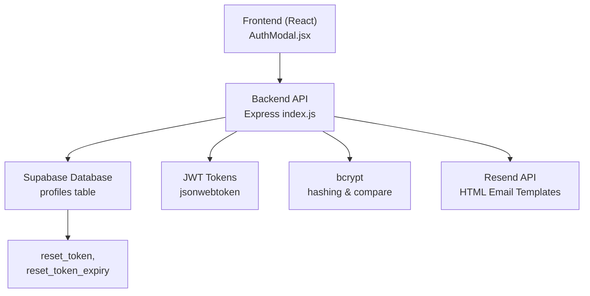
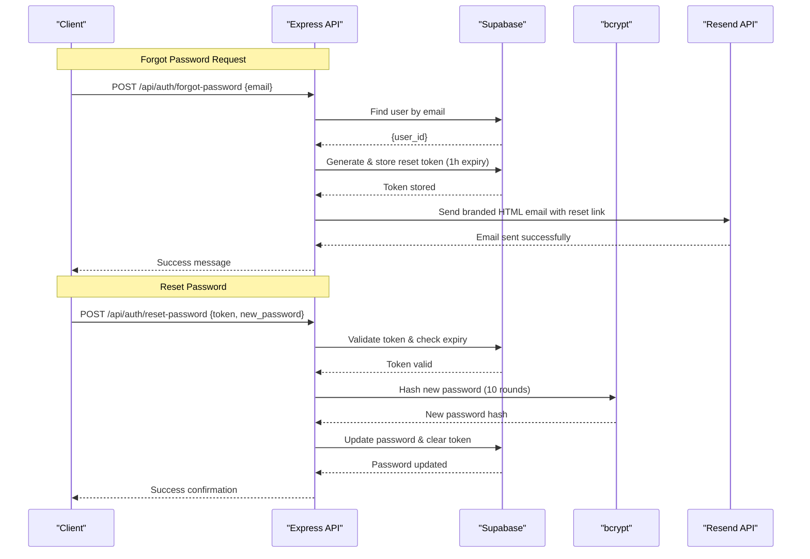
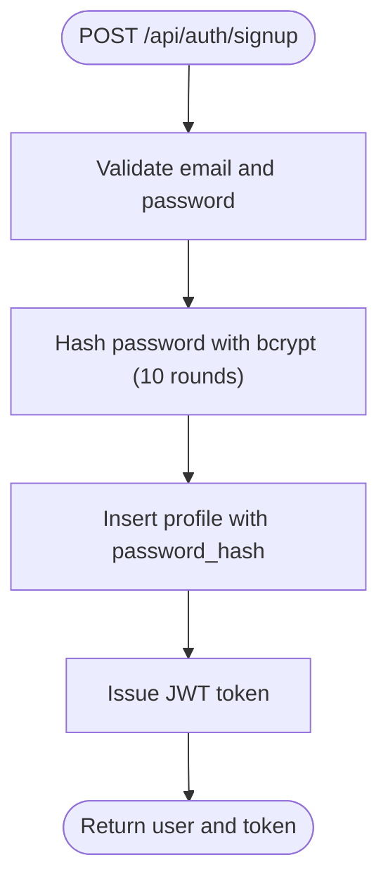
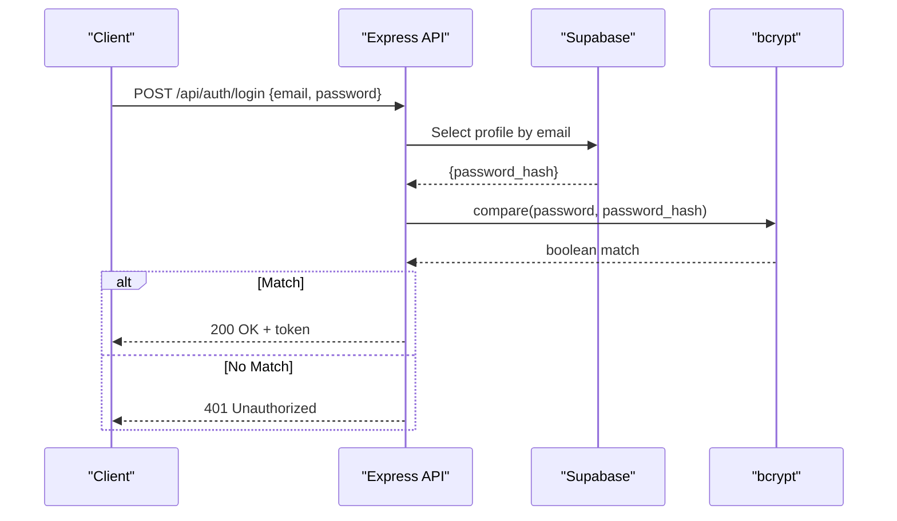
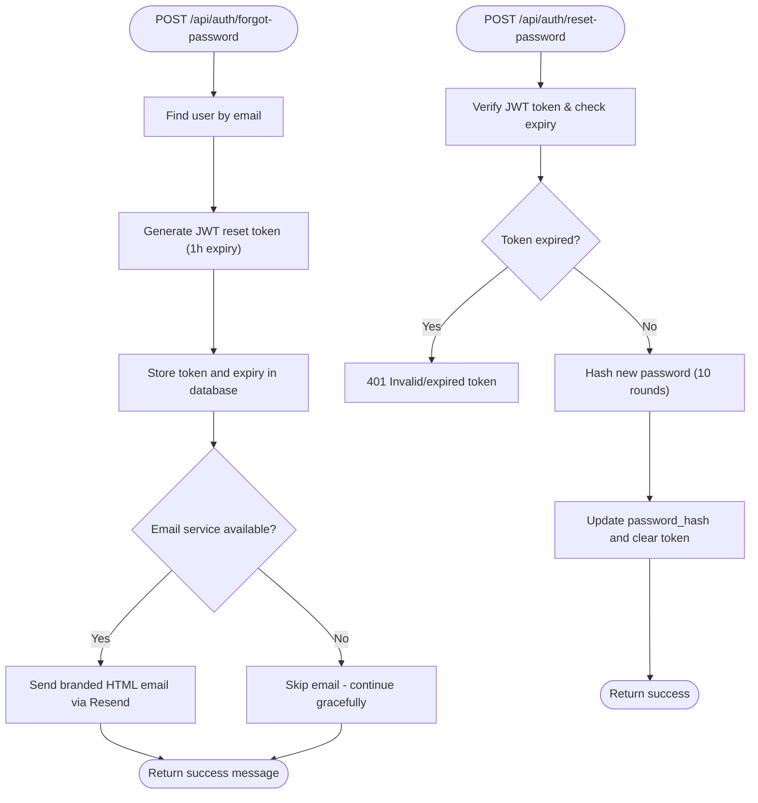
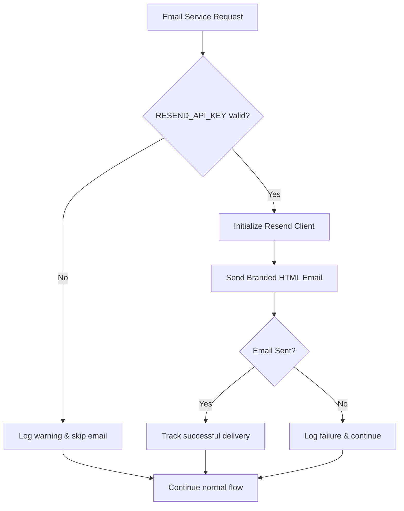
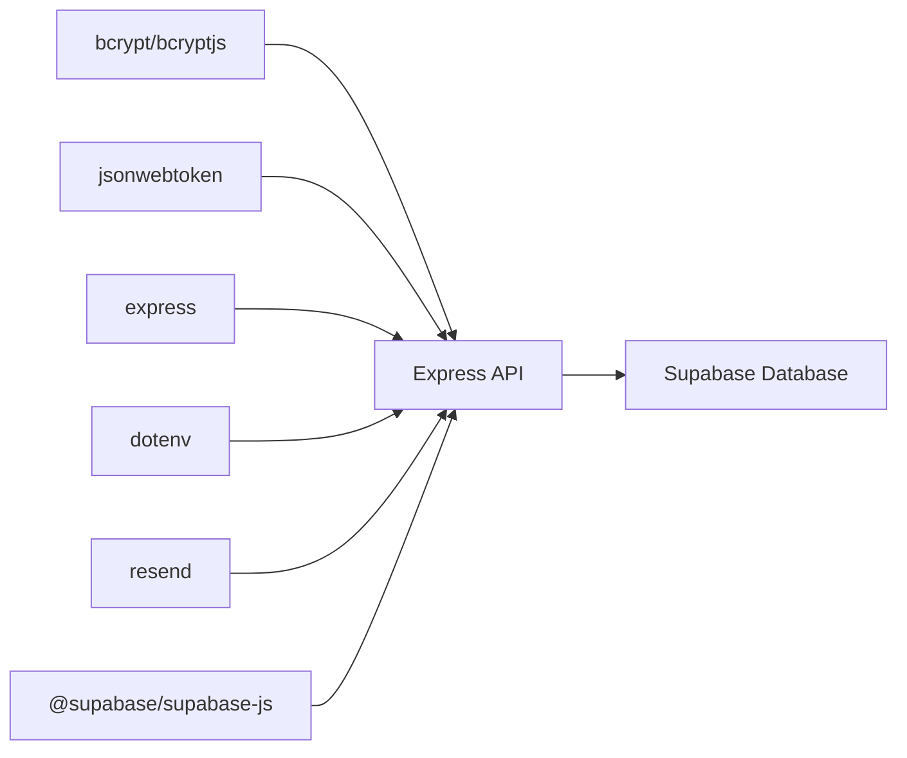

# Password Security

<cite>
**Referenced Files in This Document**
- [index.js](file://aischolarpath-backend-main/aischolarpath-backend-main/index.js)
- [package.json](file://aischolarpath-backend-main/aischolarpath-backend-main/package.json)
- [AuthModal.jsx](file://scholarpath-frontend (2)/scholarpath/src/components/AuthModal.jsx)
- [api.js](file://scholarpath-frontend (2)/scholarpath/src/api.js)
</cite>

## Update Summary
**Changes Made**
- Added comprehensive documentation for Resend API integration with HTML email templates
- Updated password reset flow to include secure token-based authentication links
- Documented fallback handling when email services are unavailable
- Enhanced security considerations for email-based password recovery
- Added frontend integration details for password reset functionality

## Table of Contents
1. [Introduction](#introduction)
2. [Project Structure](#project-structure)
3. [Core Components](#core-components)
4. [Architecture Overview](#architecture-overview)
5. [Detailed Component Analysis](#detailed-component-analysis)
6. [Email Integration and Fallback Handling](#email-integration-and-fallback-handling)
7. [Dependency Analysis](#dependency-analysis)
8. [Performance Considerations](#performance-considerations)
9. [Troubleshooting Guide](#troubleshooting-guide)
10. [Conclusion](#conclusion)

## Introduction
This document explains how ScholarPathAI secures user passwords using bcrypt on the backend, focusing on hashing with 10 salt rounds, secure storage practices, and password comparison during login. It also covers the comprehensive password reset email functionality using Resend API integration with HTML email templates, secure token-based authentication links, and robust fallback handling when email services are unavailable. The document clarifies why plain text passwords are never stored, outlines the cryptographic benefits of bcrypt over simpler hashing algorithms, and provides recommendations for enforcing strong passwords in production.

## Project Structure
The password security implementation is primarily located in the Express backend with integrated email functionality:
- Authentication endpoints for signup, login, forgot-password, and reset-password use bcrypt to hash and compare passwords
- Email functionality integrates with Resend API for sending password reset emails with branded HTML templates
- Frontend includes complete password reset UI with token detection from URL parameters
- Fallback mechanisms ensure system resilience when email services are unavailable

**Diagram sources**
- [index.js:1824-1904](file://aischolarpath-backend-main/aischolarpath-backend-main/index.js#L1824-L1904)
- [AuthModal.jsx:16-37](file://scholarpath-frontend (2)/scholarpath/src/components/AuthModal.jsx#L16-L37)

**Section sources**
- [index.js:1-24](file://aischolarpath-backend-main/aischolarpath-backend-main/index.js#L1-L24)
- [AuthModal.jsx:1-37](file://scholarpath-frontend (2)/scholarpath/src/components/AuthModal.jsx#L1-L37)

## Core Components
- **bcrypt dependency**: The backend includes bcryptjs as a dependency for secure password hashing and comparison
- **Resend API integration**: Comprehensive email functionality with HTML templates and fallback handling
- **Signup flow**: Hashes the incoming password before storing it in the database
- **Login flow**: Retrieves the stored hash and compares it with the provided password using bcrypt.compare
- **Password reset flows**: Generate time-limited tokens, send branded emails, validate tokens, and securely update passwords

Key behaviors:
- Passwords are always hashed before storage; plain text passwords are never persisted
- Salt rounds are set to 10 to balance security and performance
- Login uses constant-time comparison via bcrypt.compare to mitigate timing attacks
- Email service failures don't compromise core authentication functionality
- Reset tokens expire after 1 hour for enhanced security

**Section sources**
- [package.json:11-22](file://aischolarpath-backend-main/aischolarpath-backend-main/package.json#L11-L22)
- [index.js:737-765](file://aischolarpath-backend-main/aischolarpath-backend-main/index.js#L737-L765)
- [index.js:767-800](file://aischolarpath-backend-main/aischolarpath-backend-main/index.js#L767-L800)
- [index.js:1824-1904](file://aischolarpath-backend-main/aischolarpath-backend-main/index.js#L1824-L1904)

## Architecture Overview
The authentication architecture ensures that passwords are never stored in plain text and that comparisons are performed securely, with robust email integration for password recovery.

**Diagram sources**
- [index.js:1824-1904](file://aischolarpath-backend-main/aischolarpath-backend-main/index.js#L1824-L1904)
- [index.js:1906-1947](file://aischolarpath-backend-main/aischolarpath-backend-main/index.js#L1906-L1947)

## Detailed Component Analysis

### Signup Flow: Secure Password Storage
- Input validation ensures required fields are present
- The password is hashed with bcrypt using 10 salt rounds before being inserted into the profiles table
- A JWT token is issued upon successful registration

Security considerations:
- Never store plain text passwords; only store bcrypt hashes
- Use environment variables for secrets such as JWT_SECRET
- Validate inputs server-side to prevent malformed or empty credentials

**Diagram sources**
- [index.js:737-765](file://aischolarpath-backend-main/aischolarpath-backend-main/index.js#L737-L765)

**Section sources**
- [index.js:737-765](file://aischolarpath-backend-main/aischolarpath-backend-main/index.js#L737-L765)

### Login Flow: Secure Password Comparison
- The client sends email and password
- The server retrieves the stored password_hash for the given email
- bcrypt.compare checks the provided password against the stored hash
- On success, a JWT token is issued; otherwise, an error is returned

Security considerations:
- Use bcrypt.compare to avoid timing side channels
- Return generic errors for invalid credentials to avoid leaking user existence

**Diagram sources**
- [index.js:767-800](file://aischolarpath-backend-main/aischolarpath-backend-main/index.js#L767-L800)

**Section sources**
- [index.js:767-800](file://aischolarpath-backend-main/aischolarpath-backend-main/index.js#L767-L800)

### Password Reset Flows: Token Validation and New Password Hashing
- Forgot password generates a time-limited reset token stored alongside expiry
- Reset password validates the token and updates the password by hashing the new value
- Branded HTML email template with secure reset link is sent via Resend API
- Fallback handling ensures system continues to function even if email service fails

Security considerations:
- Enforce short expiration times for reset tokens (1 hour)
- Clear reset tokens after successful password update
- Always hash new passwords before storage
- Validate token integrity and expiry before processing password changes

**Diagram sources**
- [index.js:1824-1904](file://aischolarpath-backend-main/aischolarpath-backend-main/index.js#L1824-L1904)
- [index.js:1906-1947](file://aischolarpath-backend-main/aischolarpath-backend-main/index.js#L1906-L1947)

**Section sources**
- [index.js:1824-1904](file://aischolarpath-backend-main/aischolarpath-backend-main/index.js#L1824-L1904)
- [index.js:1906-1947](file://aischolarpath-backend-main/aischolarpath-backend-main/index.js#L1906-L1947)

### Frontend Integration Notes
- The frontend AuthModal includes complete password reset functionality with two-step process
- Automatic detection of reset tokens from URL parameters (?reset=TOKEN)
- User-friendly interface for requesting password resets and setting new passwords
- Proper error handling and loading states throughout the reset process

**Section sources**
- [AuthModal.jsx:16-37](file://scholarpath-frontend (2)/scholarpath/src/components/AuthModal.jsx#L16-L37)
- [AuthModal.jsx:68-111](file://scholarpath-frontend (2)/scholarpath/src/components/AuthModal.jsx#L68-L111)
- [api.js:83-84](file://scholarpath-frontend (2)/scholarpath/src/api.js#L83-L84)

## Email Integration and Fallback Handling

### Resend API Integration
The system integrates with Resend API to send professional, branded HTML emails for password reset functionality:

- **HTML Email Templates**: Custom branded emails with ScholarPath.AI styling, including company colors, logo placement, and responsive design
- **Secure Reset Links**: Time-limited JWT tokens embedded in URLs with 1-hour expiration
- **Fallback Mechanisms**: Graceful degradation when email services are unavailable without compromising core functionality
- **Error Handling**: Comprehensive logging and error management for email delivery issues

### Email Template Features
- Professional branding with ScholarPath.AI color scheme (#125BC9 blue)
- Responsive design optimized for various email clients
- Clear call-to-action buttons with proper styling
- Security warnings about ignoring unsolicited reset requests
- Mobile-friendly layout with appropriate spacing and typography

### Fallback Strategy
The implementation includes robust fallback handling:
- Environment variable validation for RESEND_API_KEY
- Graceful skipping of email sending when service is unavailable
- Continued functionality of core authentication features
- Logging of email failures for monitoring and debugging
- User-facing messages that don't reveal system internals

**Diagram sources**
- [index.js:1855-1896](file://aischolarpath-backend-main/aischolarpath-backend-main/index.js#L1855-L1896)

**Section sources**
- [index.js:22-23](file://aischolarpath-backend-main/aischolarpath-backend-main/index.js#L22-L23)
- [index.js:1855-1896](file://aischolarpath-backend-main/aischolarpath-backend-main/index.js#L1855-L1896)

## Dependency Analysis
- **bcrypt/bcryptjs**: Used for hashing and comparing passwords
- **jsonwebtoken**: Used to issue and verify JWT tokens for both session management and password reset
- **express**: Provides the API layer
- **dotenv**: Loads environment variables for secrets
- **resend**: Integrated for professional email delivery with HTML templates
- **@supabase/supabase-js**: Database connectivity for user data and reset tokens

**Diagram sources**
- [package.json:8-23](file://aischolarpath-backend-main/aischolarpath-backend-main/package.json#L8-L23)
- [index.js:1-24](file://aischolarpath-backend-main/aischolarpath-backend-main/index.js#L1-L24)

**Section sources**
- [package.json:8-23](file://aischolarpath-backend-main/aischolarpath-backend-main/package.json#L8-L23)
- [index.js:1-24](file://aischolarpath-backend-main/aischolarpath-backend-main/index.js#L1-L24)

## Performance Considerations
- **bcrypt cost factor**: Using 10 salt rounds balances security and performance for typical workloads
- **Email service optimization**: Resend API provides fast, reliable email delivery with minimal overhead
- **Token efficiency**: JWT-based reset tokens eliminate database lookups for token validation
- **Connection pooling**: Backend uses connection settings for external requests; ensure database connections are optimized
- **Rate limiting**: Implemented on authentication endpoints to mitigate brute-force attempts
- **Graceful degradation**: System continues functioning even when email services are unavailable

## Troubleshooting Guide
Common issues and resolutions:
- **Missing environment variables**: Ensure SUPABASE_URL, SUPABASE_KEY, JWT_SECRET, and RESEND_API_KEY are set at startup
- **Invalid or expired tokens**: Verify JWT_SECRET configuration and token expiration policies
- **Database errors**: Check Supabase connectivity and schema for profiles table fields like password_hash, reset_token, and reset_token_expiry
- **Email delivery issues**: Verify RESEND_API_KEY format (should start with 're_') and check Resend service status
- **Generic error messages**: For security, return non-specific messages for invalid credentials to avoid revealing user existence
- **Frontend integration**: Ensure VITE_API_URL is properly configured for development vs production environments

**Section sources**
- [index.js:5-11](file://aischolarpath-backend-main/aischolarpath-backend-main/index.js#L5-L11)
- [index.js:767-800](file://aischolarpath-backend-main/aischolarpath-backend-main/index.js#L767-L800)
- [index.js:1824-1904](file://aischolarpath-backend-main/aischolarpath-backend-main/index.js#L1824-L1904)

## Conclusion
ScholarPathAI implements robust password security using bcrypt with 10 salt rounds for secure hashing and comparison, complemented by comprehensive email-based password recovery through Resend API integration. Passwords are never stored in plain text, login uses bcrypt.compare to safely validate credentials, and the reset flow enforces token expiration with branded HTML email delivery. The system includes sophisticated fallback handling to maintain functionality even when email services are unavailable. For production deployment, integrate frontend authentication with the backend, enforce HTTPS, apply rate limiting, consider additional password strength validation, and monitor email delivery metrics through Resend's analytics dashboard.