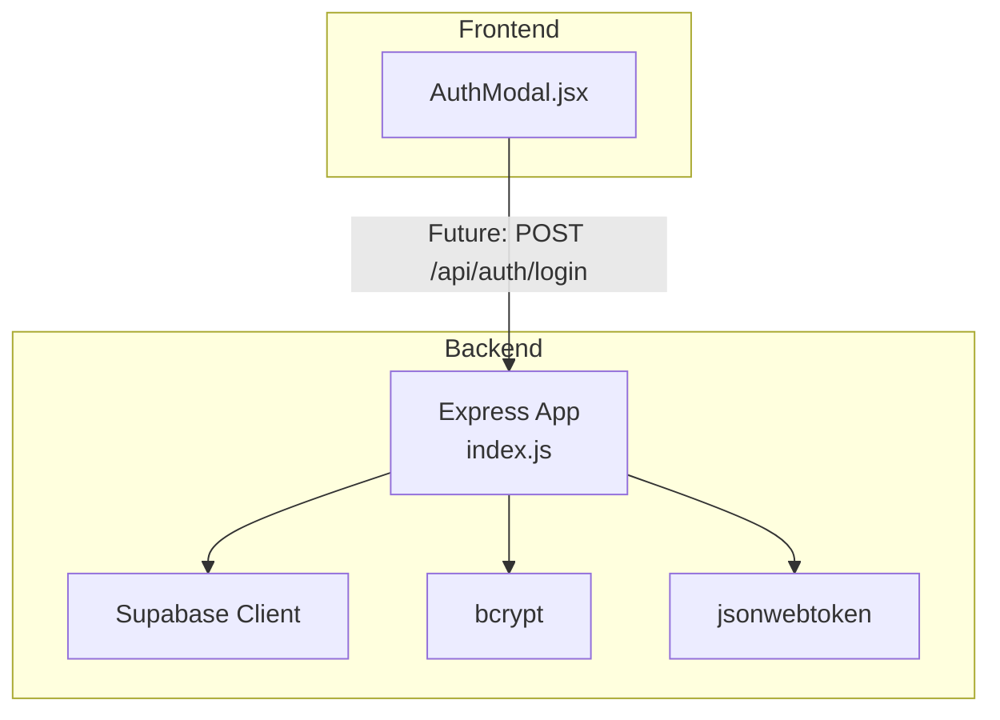
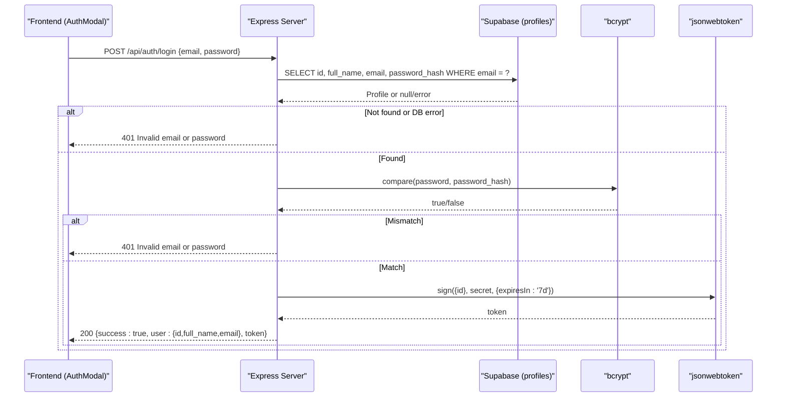
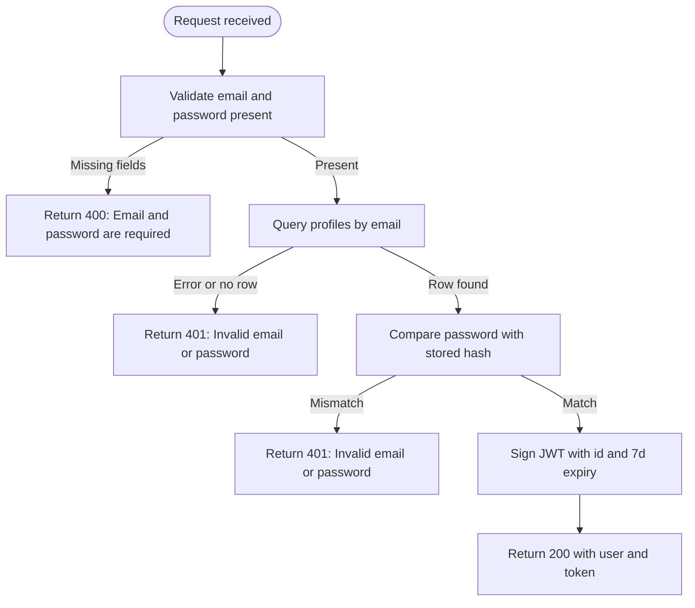
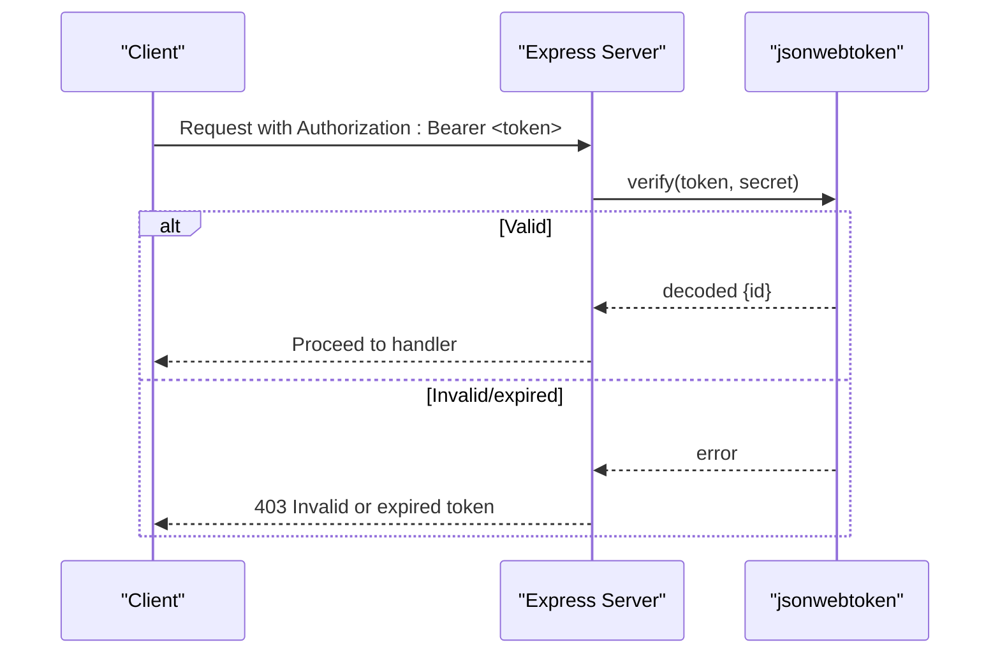
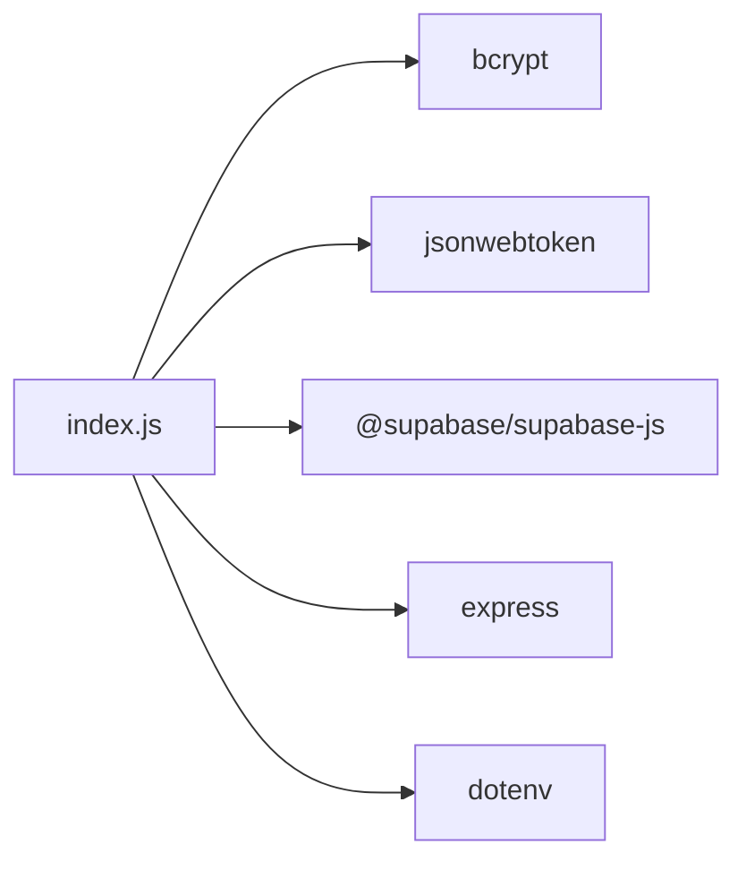

# User Login

<cite>
**Referenced Files in This Document**
- [index.js](file://aischolarpath-backend-main/aischolarpath-backend-main/index.js)
- [AuthModal.jsx](file://scholarpath-frontend (2)/scholarpath/src/components/AuthModal.jsx)
- [package.json](file://aischolarpath-backend-main/aischolarpath-backend-main/package.json)
</cite>

## Table of Contents
1. Introduction
2. Project Structure
3. Core Components
4. Architecture Overview
5. Detailed Component Analysis
6. Dependency Analysis
7. Performance Considerations
8. Troubleshooting Guide
9. Conclusion
10. Appendices

## Introduction
This document explains the user login endpoint (/api/auth/login), including authentication flow, input validation, error handling, token generation and expiration, and guidance for client-side integration. It is designed to be accessible to both technical and non-technical readers while providing code-level references for implementation details.

## Project Structure
The backend is an Express application that:
- Validates environment variables at startup
- Uses Supabase as the database
- Implements JWT-based authentication with bcrypt password hashing
- Exposes REST endpoints for profile management, scholarships, and authentication

The frontend currently includes a login modal UI but does not yet call the backend login API; it navigates directly to the dashboard on submit.

**Diagram sources**
- [index.js:1-54](file://aischolarpath-backend-main/aischolarpath-backend-main/index.js#L1-L54)
- [AuthModal.jsx:1-84](file://scholarpath-frontend (2)/scholarpath/src/components/AuthModal.jsx#L1-L84)

**Section sources**
- [index.js:1-54](file://aischolarpath-backend-main/aischolarpath-backend-main/index.js#L1-L54)
- [AuthModal.jsx:1-84](file://scholarpath-frontend (2)/scholarpath/src/components/AuthModal.jsx#L1-L84)

## Core Components
- Authentication middleware for protected routes
- Signup and login endpoints
- Database access via Supabase
- Password hashing and verification with bcrypt
- JWT issuance with user ID payload and 7-day expiration

Key responsibilities:
- Validate inputs
- Query profiles table by email
- Compare provided password against stored hash
- Issue JWT with id claim and 7d expiry
- Return appropriate errors (400, 401, 500)

**Section sources**
- [index.js:32-47](file://aischolarpath-backend-main/aischolarpath-backend-main/index.js#L32-L47)
- [index.js:518-573](file://aischolarpath-backend-main/aischolarpath-backend-main/index.js#L518-L573)

## Architecture Overview
The login flow connects the frontend form to the backend endpoint, which validates credentials and issues a JWT.

**Diagram sources**
- [index.js:542-573](file://aischolarpath-backend-main/aischolarpath-backend-main/index.js#L542-L573)

## Detailed Component Analysis

### Login Endpoint: /api/auth/login
Behavior:
- Input validation: requires email and password; returns 400 if missing
- Database lookup: queries profiles table by email
- Password comparison: uses bcrypt.compare against stored hash
- Token issuance: creates JWT with user id and 7-day expiration using server secret
- Responses:
  - Success: 200 with user object and token
  - Invalid credentials: 401 with error message
  - Database errors: 500 with error message

**Diagram sources**
- [index.js:542-573](file://aischolarpath-backend-main/aischolarpath-backend-main/index.js#L542-L573)

**Section sources**
- [index.js:542-573](file://aischolarpath-backend-main/aischolarpath-backend-main/index.js#L542-L573)

### Authentication Middleware
Purpose:
- Protects routes by requiring a valid Authorization header with a bearer token
- Verifies token using the server secret
- Attaches decoded user id to request for downstream handlers

**Diagram sources**
- [index.js:32-47](file://aischolarpath-backend-main/aischolarpath-backend-main/index.js#L32-L47)

**Section sources**
- [index.js:32-47](file://aischolarpath-backend-main/aischolarpath-backend-main/index.js#L32-L47)

### Frontend Integration Notes
Current state:
- The login modal collects email and password but does not call the backend; it navigates directly to the dashboard.

Recommended client-side flow:
- On submit, send POST /api/auth/login with JSON body containing email and password
- Handle responses:
  - 200: store token securely and navigate to protected route
  - 400: show validation error
  - 401: show invalid credentials error
  - 5xx: show network/server error
- Store token:
  - Prefer httpOnly cookies set by the server when possible
  - If using localStorage, ensure HTTPS-only and implement CSRF protections where applicable
- Include token in subsequent requests:
  - Set Authorization header: Bearer <token>
- Handle token expiration:
  - On 403 from protected routes, prompt re-login or refresh token flow

**Section sources**
- [AuthModal.jsx:1-84](file://scholarpath-frontend (2)/scholarpath/src/components/AuthModal.jsx#L1-L84)

## Dependency Analysis
External libraries used by the backend relevant to login:
- bcrypt: secure password hashing and comparison
- jsonwebtoken: signing and verifying JWTs
- @supabase/supabase-js: database client for querying profiles
- express: HTTP server and routing
- dotenv: environment variable loading

**Diagram sources**
- [package.json:1-14](file://aischolarpath-backend-main/aischolarpath-backend-main/package.json#L1-L14)
- [index.js:1-15](file://aischolarpath-backend-main/aischolarpath-backend-main/index.js#L1-L15)

**Section sources**
- [package.json:1-14](file://aischolarpath-backend-main/aischolarpath-backend-main/package.json#L1-L14)
- [index.js:1-15](file://aischolarpath-backend-main/aischolarpath-backend-main/index.js#L1-L15)

## Performance Considerations
- Use connection pooling and keep-alive settings for external clients (already configured via undici agent).
- Ensure indexes exist on profiles.email to speed up lookups.
- Avoid logging sensitive data such as passwords or tokens.
- Rate-limit login attempts to mitigate brute-force attacks.

[No sources needed since this section provides general guidance]

## Troubleshooting Guide
Common issues and resolutions:
- Missing environment variables:
  - SUPABASE_URL, SUPABASE_KEY, JWT_SECRET must be set; otherwise the server exits at startup.
- Database connectivity:
  - Use /api/test-db to verify Supabase connection and permissions.
- Invalid credentials:
  - 401 indicates either no matching email or incorrect password.
- Token errors:
  - 403 indicates missing, invalid, or expired token on protected routes.
- Network or server errors:
  - 500 responses include error messages from database operations.

Operational checks:
- Confirm CORS is enabled for your frontend origin.
- Verify that the Authorization header format is correct: Bearer <token>.
- Ensure token storage survives page reloads and is sent with every authenticated request.

**Section sources**
- [index.js:5-10](file://aischolarpath-backend-main/aischolarpath-backend-main/index.js#L5-L10)
- [index.js:61-68](file://aischolarpath-backend-main/aischolarpath-backend-main/index.js#L61-L68)
- [index.js:32-47](file://aischolarpath-backend-main/aischolarpath-backend-main/index.js#L32-L47)

## Conclusion
The /api/auth/login endpoint implements a secure, standard authentication flow: validate inputs, query the profiles table, compare passwords with bcrypt, and issue a JWT with a 7-day expiration. Protected routes enforce token verification. For production readiness, add rate limiting, robust error handling, and secure token storage strategies on the client.

[No sources needed since this section summarizes without analyzing specific files]

## Appendices

### Request and Response Examples
- Request
  - Method: POST
  - Path: /api/auth/login
  - Headers: Content-Type: application/json
  - Body: { "email": "user@example.com", "password": "your_password" }

- Success Response
  - Status: 200
  - Body: { "success": true, "user": { "id": "...", "full_name": "...", "email": "user@example.com" }, "token": "eyJ..." }

- Validation Error
  - Status: 400
  - Body: { "success": false, "error": "Email and password are required" }

- Invalid Credentials
  - Status: 401
  - Body: { "success": false, "error": "Invalid email or password" }

- Server Error
  - Status: 500
  - Body: { "success": false, "error": "<database or internal error message>" }

**Section sources**
- [index.js:542-573](file://aischolarpath-backend-main/aischolarpath-backend-main/index.js#L542-L573)

### Security Best Practices for Password Handling
- Always hash passwords before storing them; never store plaintext.
- Use bcrypt with a sufficient cost factor (the implementation uses a default suitable for most cases).
- Never log or return password hashes or secrets in responses.
- Enforce strong password policies on the client and server.
- Use HTTPS everywhere to protect credentials in transit.
- Implement rate limiting on login to prevent brute-force attacks.
- Rotate JWT secrets regularly and store them securely in environment variables.

**Section sources**
- [index.js:5-10](file://aischolarpath-backend-main/aischolarpath-backend-main/index.js#L5-L10)
- [index.js:518-573](file://aischolarpath-backend-main/aischolarpath-backend-main/index.js#L518-L573)

### Client-Side Implementation Guidance
- Send POST /api/auth/login with email and password in JSON.
- On success:
  - Store the token securely (prefer httpOnly cookies; if using localStorage, ensure HTTPS and consider CSRF mitigations).
  - Navigate to protected routes.
- On failure:
  - Display user-friendly messages based on status codes (400, 401, 500).
- For subsequent requests:
  - Attach Authorization: Bearer <token> header.
- Handle token expiration:
  - On 403 responses from protected routes, prompt re-authentication or implement token refresh.

**Section sources**
- [AuthModal.jsx:1-84](file://scholarpath-frontend (2)/scholarpath/src/components/AuthModal.jsx#L1-L84)
- [index.js:32-47](file://aischolarpath-backend-main/aischolarpath-backend-main/index.js#L32-L47)