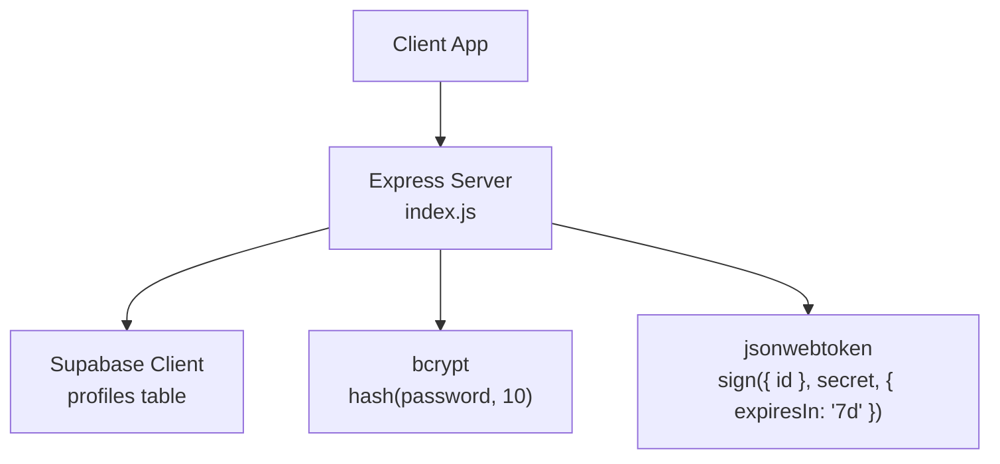
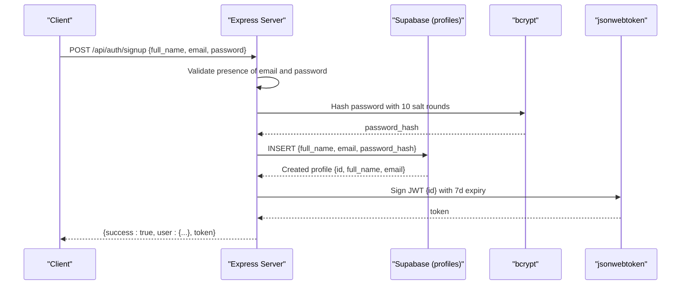
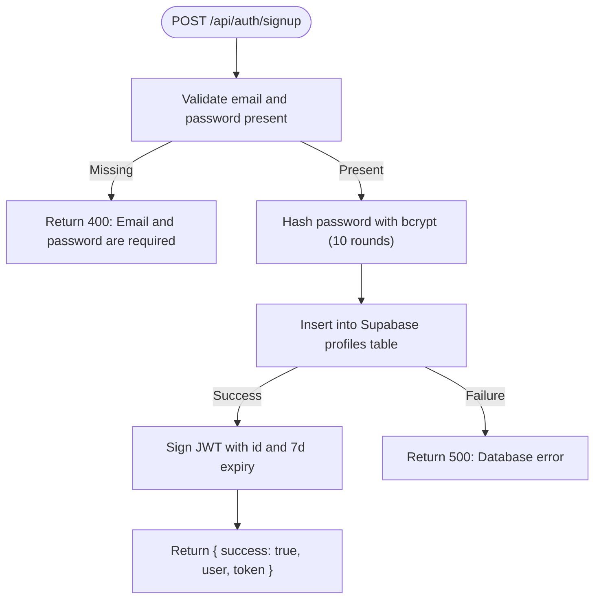
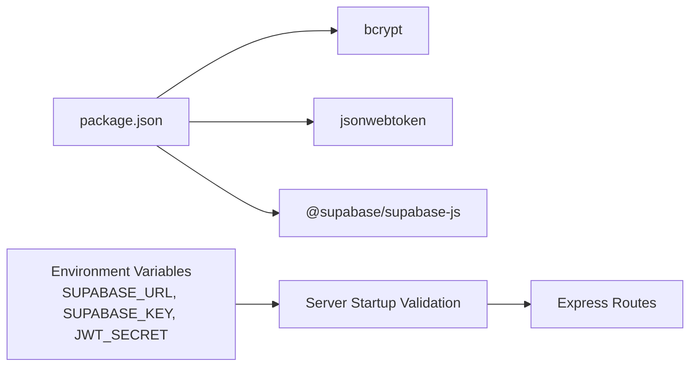

# User Registration

<cite>
**Referenced Files in This Document**
- [index.js](file://aischolarpath-backend-main/aischolarpath-backend-main/index.js)
- [package.json](file://aischolarpath-backend-main/aischolarpath-backend-main/package.json)
</cite>

## Table of Contents
1. [Introduction](#introduction)
2. [Project Structure](#project-structure)
3. [Core Components](#core-components)
4. [Architecture Overview](#architecture-overview)
5. [Detailed Component Analysis](#detailed-component-analysis)
6. [Dependency Analysis](#dependency-analysis)
7. [Performance Considerations](#performance-considerations)
8. [Troubleshooting Guide](#troubleshooting-guide)
9. [Conclusion](#conclusion)
10. [Appendices](#appendices)

## Introduction
This document provides comprehensive documentation for the user registration endpoint (/api/auth/signup). It covers input validation, secure password hashing using bcrypt with 10 salt rounds, insertion into the Supabase profiles table, automatic JWT token generation with a 7-day expiration, response format, and error handling scenarios including duplicate emails and database connection issues. It also includes example requests and responses for successful registration and common errors.

## Project Structure
The backend is an Express application that:
- Validates required environment variables at startup (Supabase URL, Supabase key, JWT secret).
- Uses bcrypt for password hashing and jsonwebtoken for issuing JWTs.
- Connects to Supabase to persist user profiles and issue tokens after signup.
- Exposes multiple API routes, including /api/auth/signup for user registration.

**Diagram sources**
- [index.js:1-15](file://aischolarpath-backend-main/aischolarpath-backend-main/index.js#L1-L15)
- [index.js:27-54](file://aischolarpath-backend-main/aischolarpath-backend-main/index.js#L27-L54)
- [index.js:518-540](file://aischolarpath-backend-main/aischolarpath-backend-main/index.js#L518-L540)

**Section sources**
- [index.js:1-15](file://aischolarpath-backend-main/aischolarpath-backend-main/index.js#L1-L15)
- [index.js:27-54](file://aischolarpath-backend-main/aischolarpath-backend-main/index.js#L27-L54)
- [package.json:1-14](file://aischolarpath-backend-main/aischolarpath-backend-main/package.json#L1-L14)

## Core Components
- Input validation: Ensures email and password are present in the request body.
- Password hashing: Uses bcrypt with 10 salt rounds to securely hash the password before storage.
- Database insertion: Inserts the new profile into the Supabase profiles table with full_name, email, and password_hash.
- Token issuance: Generates a JWT containing the user id with a 7-day expiration using the configured JWT secret.
- Response: Returns success status, user data (id, full_name, email), and the authentication token.

Key implementation references:
- Validation and hashing: [index.js:518-527](file://aischolarpath-backend-main/aischolarpath-backend-main/index.js#L518-L527)
- Supabase insert: [index.js:528-535](file://aischolarpath-backend-main/aischolarpath-backend-main/index.js#L528-L535)
- JWT generation: [index.js:537-539](file://aischolarpath-backend-main/aischolarpath-backend-main/index.js#L537-L539)

**Section sources**
- [index.js:518-540](file://aischolarpath-backend-main/aischolarpath-backend-main/index.js#L518-L540)

## Architecture Overview
The registration flow validates inputs, hashes the password, persists the user, and returns a JWT.

**Diagram sources**
- [index.js:518-540](file://aischolarpath-backend-main/aischolarpath-backend-main/index.js#L518-L540)

## Detailed Component Analysis

### Endpoint Specification
- Method: POST
- Path: /api/auth/signup
- Request body fields:
  - full_name: string (optional but recommended)
  - email: string (required)
  - password: string (required)
- Success response fields:
  - success: boolean
  - user: object with id, full_name, email
  - token: string (JWT valid for 7 days)

Example successful request:
- Body: { "full_name": "Jane Doe", "email": "jane@example.com", "password": "SecureP@ssw0rd!" }

Example successful response:
- { "success": true, "user": { "id": "...", "full_name": "Jane Doe", "email": "jane@example.com" }, "token": "eyJhbGciOiJIUzI1NiIsInR5cCI6IkpXVCJ9..." }

Error scenarios:
- Missing or empty email/password:
  - Status: 400
  - Response: { "success": false, "error": "Email and password are required" }
- Duplicate email:
  - Behavior: The server attempts to insert into the profiles table; if the database enforces uniqueness, it will return a 500 error with the database error message.
  - Status: 500
  - Response: { "success": false, "error": "<database error message>" }
- Database connection or write failure:
  - Status: 500
  - Response: { "success": false, "error": "<database error message>" }

Security notes:
- Passwords are hashed with bcrypt using 10 salt rounds before storage.
- JWTs are signed with the configured secret and expire in 7 days.

Implementation references:
- Validation and hashing: [index.js:518-527](file://aischolarpath-backend-main/aischolarpath-backend-main/index.js#L518-L527)
- Database insertion: [index.js:528-535](file://aischolarpath-backend-main/aischolarpath-backend-main/index.js#L528-L535)
- JWT generation: [index.js:537-539](file://aischolarpath-backend-main/aischolarpath-backend-main/index.js#L537-L539)

**Diagram sources**
- [index.js:518-540](file://aischolarpath-backend-main/aischolarpath-backend-main/index.js#L518-L540)

**Section sources**
- [index.js:518-540](file://aischolarpath-backend-main/aischolarpath-backend-main/index.js#L518-L540)

## Dependency Analysis
External dependencies relevant to registration:
- bcrypt: Used for secure password hashing with configurable salt rounds.
- jsonwebtoken: Used to sign and manage JWTs with expiration.
- @supabase/supabase-js: Used to interact with the Supabase database for profile creation.

Environment requirements:
- SUPABASE_URL, SUPABASE_KEY, JWT_SECRET must be set at startup; otherwise, the server exits.

References:
- Dependencies: [package.json:1-14](file://aischolarpath-backend-main/aischolarpath-backend-main/package.json#L1-L14)
- Environment validation: [index.js:1-10](file://aischolarpath-backend-main/aischolarpath-backend-main/index.js#L1-L10)
- Supabase client setup: [index.js:27-54](file://aischolarpath-backend-main/aischolarpath-backend-main/index.js#L27-L54)

**Diagram sources**
- [package.json:1-14](file://aischolarpath-backend-main/aischolarpath-backend-main/package.json#L1-L14)
- [index.js:1-10](file://aischolarpath-backend-main/aischolarpath-backend-main/index.js#L1-L10)
- [index.js:27-54](file://aischolarpath-backend-main/aischolarpath-backend-main/index.js#L27-L54)

**Section sources**
- [package.json:1-14](file://aischolarpath-backend-main/aischolarpath-backend-main/package.json#L1-L14)
- [index.js:1-10](file://aischolarpath-backend-main/aischolarpath-backend-main/index.js#L1-L10)
- [index.js:27-54](file://aischolarpath-backend-main/aischolarpath-backend-main/index.js#L27-L54)

## Performance Considerations
- bcrypt with 10 salt rounds balances security and performance; consider tuning based on server capacity and threat model.
- JWT signing is lightweight; ensure secrets are managed securely and rotated periodically.
- Database inserts should be optimized by ensuring proper indexing on unique constraints (e.g., email) to reduce duplicate check latency.

[No sources needed since this section provides general guidance]

## Troubleshooting Guide
Common issues and resolutions:
- Missing environment variables:
  - Symptom: Server fails to start.
  - Resolution: Set SUPABASE_URL, SUPABASE_KEY, and JWT_SECRET.
  - Reference: [index.js:1-10](file://aischolarpath-backend-main/aischolarpath-backend-main/index.js#L1-L10)
- Validation failures:
  - Symptom: 400 error indicating missing email or password.
  - Resolution: Ensure both fields are provided in the request body.
  - Reference: [index.js:518-524](file://aischolarpath-backend-main/aischolarpath-backend-main/index.js#L518-L524)
- Duplicate email:
  - Symptom: 500 error from database due to unique constraint violation.
  - Resolution: Use a different email or handle the error on the client side.
  - Reference: [index.js:528-535](file://aischolarpath-backend-main/aischolarpath-backend-main/index.js#L528-L535)
- Database connection issues:
  - Symptom: 500 error with database error message.
  - Resolution: Verify Supabase credentials and network connectivity.
  - Reference: [index.js:528-535](file://aischolarpath-backend-main/aischolarpath-backend-main/index.js#L528-L535)

**Section sources**
- [index.js:1-10](file://aischolarpath-backend-main/aischolarpath-backend-main/index.js#L1-L10)
- [index.js:518-535](file://aischolarpath-backend-main/aischolarpath-backend-main/index.js#L518-L535)

## Conclusion
The /api/auth/signup endpoint implements secure user registration with robust validation, bcrypt hashing at 10 salt rounds, Supabase persistence, and automatic JWT issuance with a 7-day expiration. Proper error handling addresses validation failures and database issues, while environment configuration ensures reliable operation. Clients should validate inputs and handle potential duplicate email errors gracefully.

[No sources needed since this section summarizes without analyzing specific files]

## Appendices

### Example Requests and Responses
- Successful registration:
  - Request: POST /api/auth/signup
    - Body: { "full_name": "Jane Doe", "email": "jane@example.com", "password": "SecureP@ssw0rd!" }
  - Response: { "success": true, "user": { "id": "...", "full_name": "Jane Doe", "email": "jane@example.com" }, "token": "eyJhbGciOiJIUzI1NiIsInR5cCI6IkpXVCJ9..." }
- Validation failure:
  - Response: { "success": false, "error": "Email and password are required" }
- Duplicate email:
  - Response: { "success": false, "error": "<database error message>" }
- Database connection failure:
  - Response: { "success": false, "error": "<database error message>" }

[No sources needed since this section provides examples without analyzing specific files]