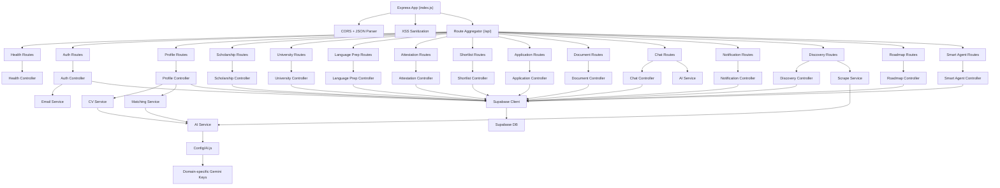
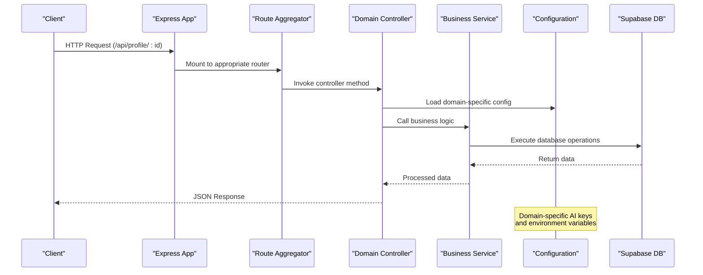
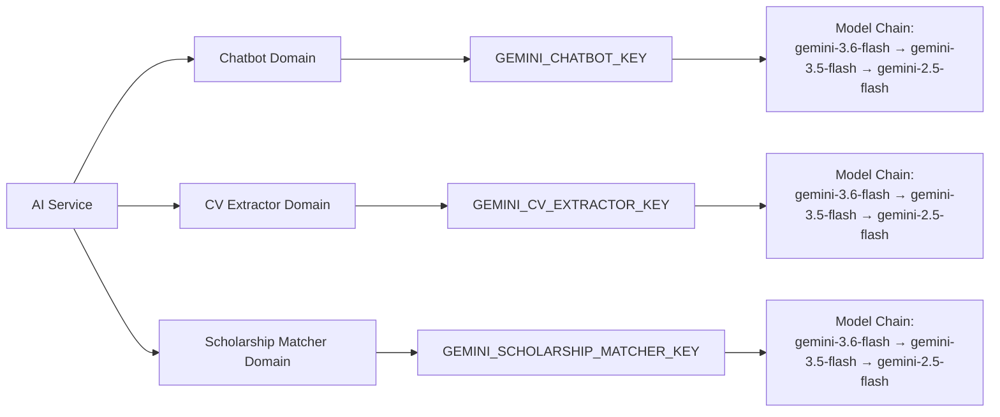
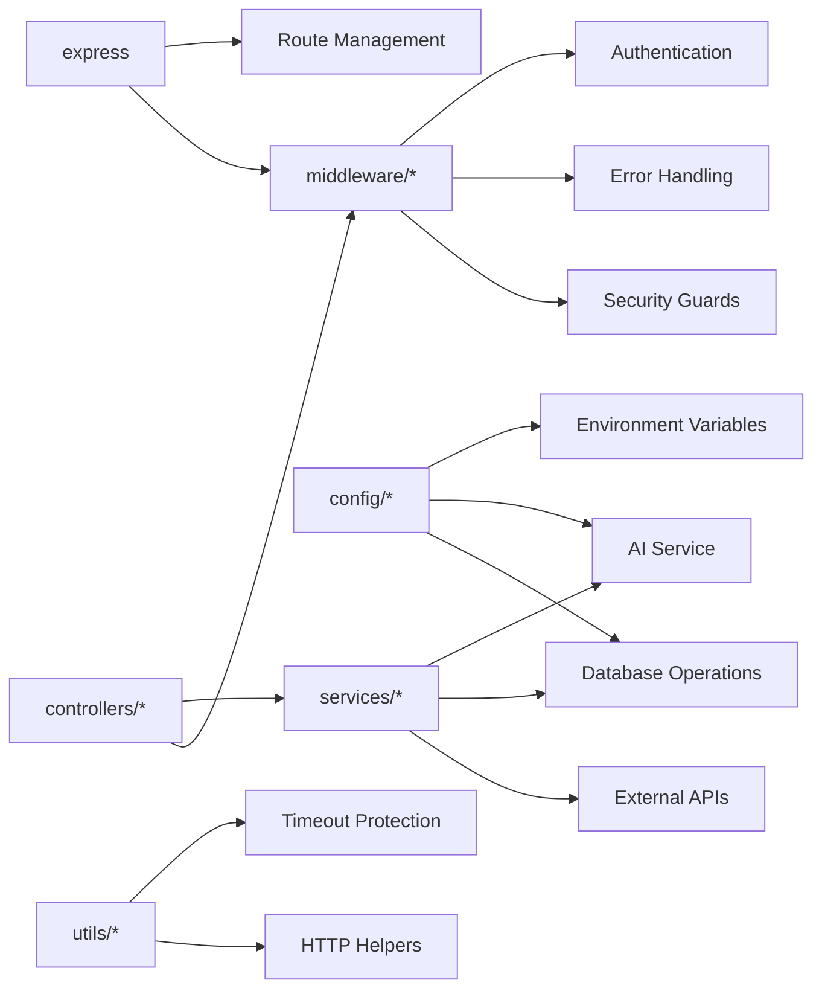

# Backend Architecture

<cite>
**Referenced Files in This Document**
- [index.js](file://aischolarpath-backend-main/aischolarpath-backend-main/index.js)
- [package.json](file://aischolarpath-backend-main/aischolarpath-backend-main/package.json)
- [config/ai.js](file://aischolarpath-backend-main/aischolarpath-backend-main/config/ai.js)
- [config/env.js](file://aischolarpath-backend-main/aischolarpath-backend-main/config/env.js)
- [config/supabase.js](file://aischolarpath-backend-main/aischolarpath-backend-main/config/supabase.js)
- [routes/index.js](file://aischolarpath-backend-main/aischolarpath-backend-main/routes/index.js)
- [middleware/auth.js](file://aischolarpath-backend-main/aischolarpath-backend-main/middleware/auth.js)
- [middleware/errorHandler.js](file://aischolarpath-backend-main/aischolarpath-backend-main/middleware/errorHandler.js)
- [middleware/supabaseGuard.js](file://aischolarpath-backend-main/aischolarpath-backend-main/middleware/supabaseGuard.js)
- [controllers/profile.controller.js](file://aischolarpath-backend-main/aischolarpath-backend-main/controllers/profile.controller.js)
- [services/ai.service.js](file://aischolarpath-backend-main/aischolarpath-backend-main/services/ai.service.js)
- [services/cv.service.js](file://aischolarpath-backend-main/aischolarpath-backend-main/services/cv.service.js)
- [utils/budget.js](file://aischolarpath-backend-main/aischolarpath-backend-main/utils/budget.js)
</cite>

## Update Summary
**Changes Made**
- Complete MVC-S architectural refactor from monolithic index.js to modular structure with config/, controllers/, services/, routes/, middleware/, and utils/ directories
- New domain-specific AI configuration with separate Gemini API keys for chatbot, CV extraction, and scholarship matching
- Separated concerns into dedicated layers: configuration management, request handling, business logic, routing, and utilities
- Enhanced error handling with centralized middleware and Supabase availability guards
- Improved serverless timeout protection with deadline budgeting system

## Table of Contents
1. [Introduction](#introduction)
2. [Project Structure](#project-structure)
3. [Core Components](#core-components)
4. [Architecture Overview](#architecture-overview)
5. [Detailed Component Analysis](#detailed-component-analysis)
6. [Dependency Analysis](#dependency-analysis)
7. [Performance Considerations](#performance-considerations)
8. [Troubleshooting Guide](#troubleshooting-guide)
9. [Conclusion](#conclusion)

## Introduction
This document describes the backend architecture of ScholarPathAI built on Express.js, now organized in a modular MVC-S (Model-View-Controller-Service) pattern. The application has been refactored from a monolithic single-file implementation to a well-structured modular architecture that separates configuration, middleware, routes, controllers, services, and utilities. It covers server setup, middleware configuration, route organization, RESTful API design patterns, service-layer responsibilities, Supabase integration, JWT-based authentication, error handling strategies, logging mechanisms, and API versioning considerations.

## Project Structure
The backend follows a clean MVC-S architecture with clear separation of concerns:

**Diagram sources**
- [index.js:1-82](file://aischolarpath-backend-main/aischolarpath-backend-main/index.js#L1-L82)
- [routes/index.js:1-32](file://aischolarpath-backend-main/aischolarpath-backend-main/routes/index.js#L1-L32)
- [controllers/profile.controller.js:1-272](file://aischolarpath-backend-main/aischolarpath-backend-main/controllers/profile.controller.js#L1-L272)
- [services/ai.service.js:1-221](file://aischolarpath-backend-main/aischolarpath-backend-main/services/ai.service.js#L1-L221)
- [config/ai.js:1-83](file://aischolarpath-backend-main/aischolarpath-backend-main/config/ai.js#L1-L83)

**Section sources**
- [index.js:1-82](file://aischolarpath-backend-main/aischolarpath-backend-main/index.js#L1-L82)
- [package.json:1-32](file://aischolarpath-backend-main/aischolarpath-backend-main/package.json#L1-L32)

## Core Components
The modular architecture consists of several key components:

### Configuration Layer
- **Environment Configuration**: Centralized environment variable loading and validation
- **AI Configuration**: Domain-specific Gemini API key management with fallback chains
- **Supabase Configuration**: Singleton database client initialization

### Middleware Layer
- **Authentication**: JWT token verification and user context attachment
- **Error Handling**: Centralized error processing and 404 handling
- **Supabase Guard**: Database availability checking
- **Upload Handler**: File upload processing

### Route Layer
- **Route Aggregation**: Centralized route mounting under /api
- **Domain-specific Routes**: Separate route files for each feature domain
- **Middleware Chaining**: Consistent middleware application across routes

### Controller Layer
- **Request Handling**: HTTP request processing and response formatting
- **Business Logic Orchestration**: Coordination between services
- **Input Validation**: Request parameter validation and sanitization

### Service Layer
- **Business Logic**: Core application functionality separated from HTTP concerns
- **External Integration**: AI services, email services, scraping services
- **Data Processing**: Complex data transformations and calculations

**Section sources**
- [config/env.js:1-50](file://aischolarpath-backend-main/aischolarpath-backend-main/config/env.js#L1-L50)
- [config/ai.js:1-83](file://aischolarpath-backend-main/aischolarpath-backend-main/config/ai.js#L1-L83)
- [config/supabase.js:1-20](file://aischolarpath-backend-main/aischolarpath-backend-main/config/supabase.js#L1-L20)
- [middleware/auth.js:1-26](file://aischolarpath-backend-main/aischolarpath-backend-main/middleware/auth.js#L1-L26)
- [middleware/errorHandler.js:1-22](file://aischolarpath-backend-main/aischolarpath-backend-main/middleware/errorHandler.js#L1-L22)

## Architecture Overview
The new MVC-S architecture provides clear separation of concerns while maintaining backward compatibility with existing API endpoints:

**Diagram sources**
- [index.js:58-71](file://aischolarpath-backend-main/aischolarpath-backend-main/index.js#L58-L71)
- [routes/index.js:12-31](file://aischolarpath-backend-main/aischolarpath-backend-main/routes/index.js#L12-L31)
- [controllers/profile.controller.js:14-63](file://aischolarpath-backend-main/aischolarpath-backend-main/controllers/profile.controller.js#L14-L63)
- [services/ai.service.js:38-82](file://aischolarpath-backend-main/aischolarpath-backend-main/services/ai.service.js#L38-L82)

## Detailed Component Analysis

### Server Setup and Middleware Configuration
The application bootstrap process has been streamlined with proper middleware ordering:

- **Environment Loading**: Environment variables are loaded before any other modules
- **CORS Configuration**: Flexible CORS settings supporting development and production environments
- **Static File Serving**: Frontend SPA served from public directory
- **Body Parsing**: JSON body parsing with XSS sanitization
- **Route Mounting**: All API routes mounted under /api prefix
- **Error Handling**: Centralized error handler registered last

**Updated** Enhanced security with XSS sanitization and improved CORS configuration

**Section sources**
- [index.js:21-71](file://aischolarpath-backend-main/aischolarpath-backend-main/index.js#L21-L71)

### Domain-Specific AI Configuration
A major architectural improvement is the introduction of domain-specific AI configuration:

- **Separate API Keys**: Each AI domain (chatbot, cvExtractor, scholarshipMatcher) has its own Gemini API key
- **Fallback Chains**: Multiple model fallbacks per domain to handle quota limitations
- **Independent Quotas**: Rate limiting and quotas are isolated per domain
- **Graceful Degradation**: Features degrade gracefully when AI is not configured

**Diagram sources**
- [config/ai.js:24-40](file://aischolarpath-backend-main/aischolarpath-backend-main/config/ai.js#L24-L40)
- [config/ai.js:49-75](file://aischolarpath-backend-main/aischolarpath-backend-main/config/ai.js#L49-L75)

**Section sources**
- [config/ai.js:1-83](file://aischolarpath-backend-main/aischolarpath-backend-main/config/ai.js#L1-L83)
- [config/env.js:28-32](file://aischolarpath-backend-main/aischolarpath-backend-main/config/env.js#L28-L32)

### Modular Route Organization
Routes are now organized by domain with clear separation:

- **Route Aggregator**: Central mounting point for all domain routers
- **Domain-specific Routes**: Each feature has its own route file
- **Consistent Patterns**: All routes follow RESTful conventions
- **Middleware Chaining**: Authentication and authorization applied consistently

**Section sources**
- [routes/index.js:1-32](file://aischolarpath-backend-main/aischolarpath-backend-main/routes/index.js#L1-L32)
- [routes/profile.routes.js:1-27](file://aischolarpath-backend-main/aischolarpath-backend-main/routes/profile.routes.js#L1-L27)

### Controller Layer Implementation
Controllers handle HTTP request/response lifecycle:

- **Request Processing**: Parse inputs, validate parameters, handle errors
- **Service Orchestration**: Coordinate between multiple services
- **Response Formatting**: Consistent JSON response structure
- **Authorization Checks**: User ownership and permission validation

**Section sources**
- [controllers/profile.controller.js:1-272](file://aischolarpath-backend-main/aischolarpath-backend-main/controllers/profile.controller.js#L1-L272)

### Service Layer Architecture
Services encapsulate core business logic:

- **AI Service**: Domain-isolated Gemini API calls with retry logic
- **CV Service**: Complex PDF/DOCX parsing and Europass generation
- **Matching Service**: Scholarship matching algorithms
- **Email Service**: Email notifications and password resets
- **Scraping Service**: Web scraping and data extraction

**Section sources**
- [services/ai.service.js:1-221](file://aischolarpath-backend-main/aischolarpath-backend-main/services/ai.service.js#L1-L221)
- [services/cv.service.js:1-617](file://aischolarpath-backend-main/aischolarpath-backend-main/services/cv.service.js#L1-L617)

### Authentication Middleware
JWT-based authentication remains consistent but is now properly modularized:

- **Token Verification**: Extracts and validates JWT tokens
- **User Context**: Attaches user ID to request object
- **Protected Routes**: Enforces authentication on sensitive endpoints

**Section sources**
- [middleware/auth.js:1-26](file://aischolarpath-backend-main/aischolarpath-backend-main/middleware/auth.js#L1-L26)

### Error Handling Strategy
Centralized error handling ensures consistent error responses:

- **API Not Found**: JSON 404 responses for unknown API routes
- **Global Error Handler**: Converts unhandled exceptions to structured JSON
- **Database Guards**: Prevents requests when database is unavailable

**Section sources**
- [middleware/errorHandler.js:1-22](file://aischolarpath-backend-main/aischolarpath-backend-main/middleware/errorHandler.js#L1-L22)
- [middleware/supabaseGuard.js:1-18](file://aischolarpath-backend-main/aischolarpath-backend-main/middleware/supabaseGuard.js#L1-L18)

### Serverless Timeout Protection
New deadline budgeting system prevents serverless function timeouts:

- **Budget Creation**: Creates time budgets for heavy operations
- **Automatic Cancellation**: Skips non-essential operations when budget expires
- **Guaranteed Responses**: Ensures structured JSON responses within time limits

**Section sources**
- [utils/budget.js:1-35](file://aischolarpath-backend-main/aischolarpath-backend-main/utils/budget.js#L1-L35)

## Dependency Analysis
The modular architecture introduces new dependencies while maintaining core functionality:

**Diagram sources**
- [package.json:8-24](file://aischolarpath-backend-main/aischolarpath-backend-main/package.json#L8-L24)
- [index.js:17-26](file://aischolarpath-backend-main/aischolarpath-backend-main/index.js#L17-L26)

**Section sources**
- [package.json:1-32](file://aischolarpath-backend-main/aischolarpath-backend-main/package.json#L1-L32)

## Performance Considerations
The modular architecture provides several performance benefits:

- **Lazy Loading**: Modules are only loaded when needed
- **Connection Pooling**: Single Supabase client instance shared across services
- **AI Model Fallbacks**: Automatic switching between models when quotas are exhausted
- **Serverless Optimization**: Deadline budgeting prevents function timeouts
- **Modular Imports**: Reduced memory footprint through selective module loading

**Updated** Enhanced performance through domain-specific AI configuration and serverless timeout protection

## Troubleshooting Guide
Common issues and their solutions in the new architecture:

### Configuration Issues
- **Missing Environment Variables**: Check .env file for required variables (SUPABASE_URL, SUPABASE_KEY, JWT_SECRET)
- **AI Key Configuration**: Verify domain-specific Gemini API keys are set correctly
- **Database Connection**: Ensure Supabase credentials are valid and network accessible

### Route Issues
- **404 Errors**: Check route registration order and path matching
- **Authentication Failures**: Verify JWT token format and expiration
- **CORS Errors**: Confirm allowed origins in CORS configuration

### Service Issues
- **AI Service Failures**: Check Gemini API quotas and model availability
- **File Upload Problems**: Verify multer configuration and storage permissions
- **Database Errors**: Inspect Supabase connection and query syntax

**Section sources**
- [config/env.js:8-14](file://aischolarpath-backend-main/aischolarpath-backend-main/config/env.js#L8-L14)
- [config/ai.js:70-73](file://aischolarpath-backend-main/aischolarpath-backend-main/config/ai.js#L70-L73)
- [middleware/supabaseGuard.js:7-15](file://aischolarpath-backend-main/aischolarpath-backend-main/middleware/supabaseGuard.js#L7-L15)

## Conclusion
ScholarPathAI's backend has been successfully refactored from a monolithic single-file implementation to a modular MVC-S architecture. This transformation provides:

- **Maintainability**: Clear separation of concerns makes code easier to understand and modify
- **Scalability**: Modular structure supports independent scaling of different features
- **Testability**: Isolated services and controllers enable comprehensive unit testing
- **Performance**: Optimized resource usage with lazy loading and efficient caching
- **Reliability**: Robust error handling and timeout protection ensure consistent operation

The new architecture maintains full backward compatibility with existing API endpoints while providing a solid foundation for future enhancements. Domain-specific AI configuration, centralized error handling, and serverless optimization make the application more resilient and maintainable. The modular structure enables teams to work on different features independently while maintaining consistent patterns and standards across the codebase.

For future development, consider implementing additional monitoring and logging capabilities, expanding test coverage, and exploring microservice decomposition for high-traffic domains like AI processing and web scraping.