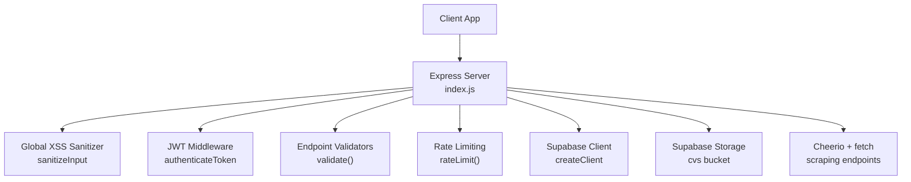
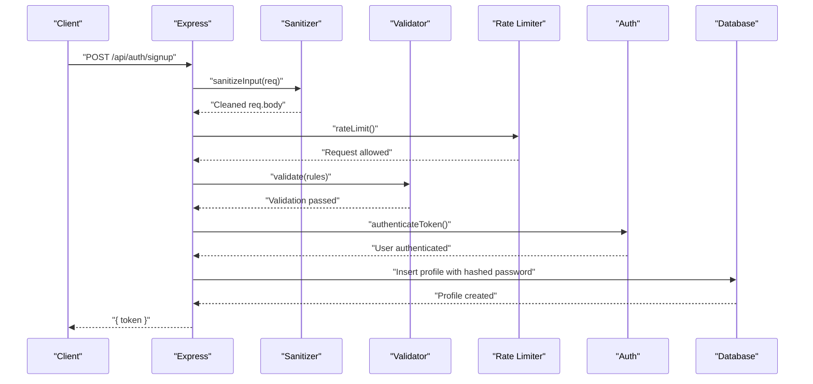
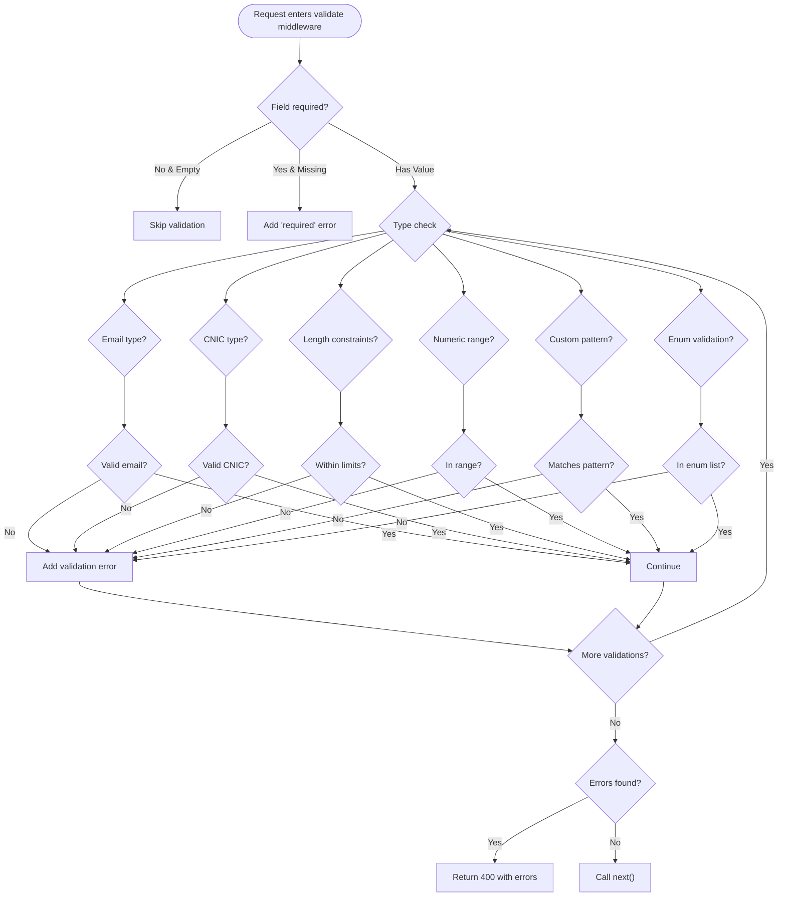
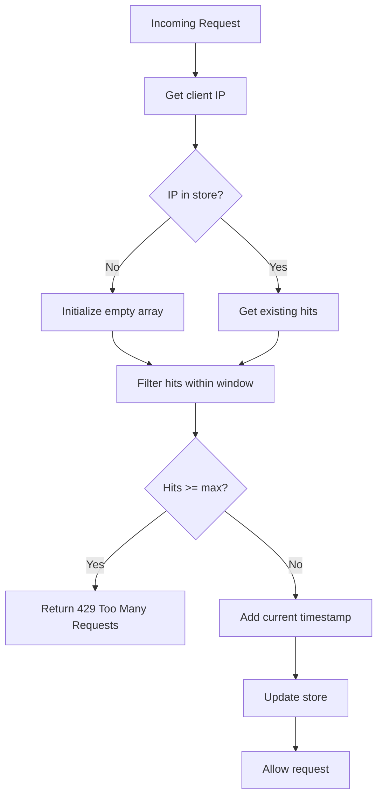
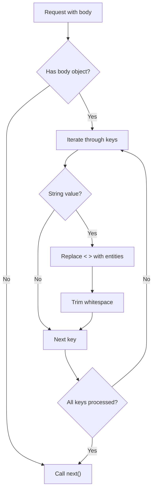
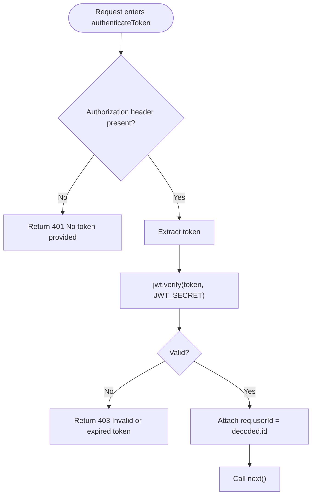
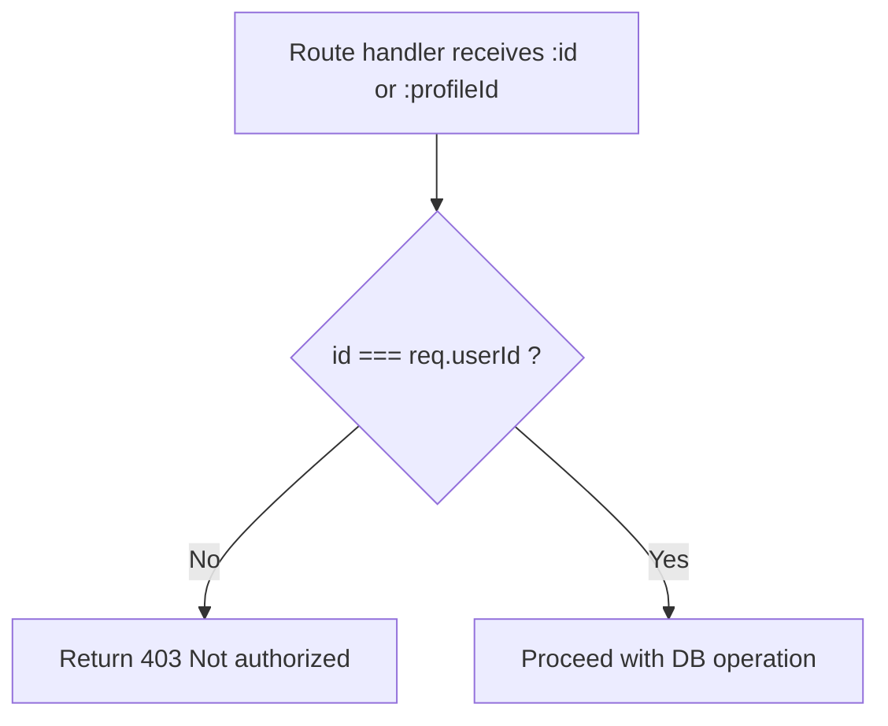
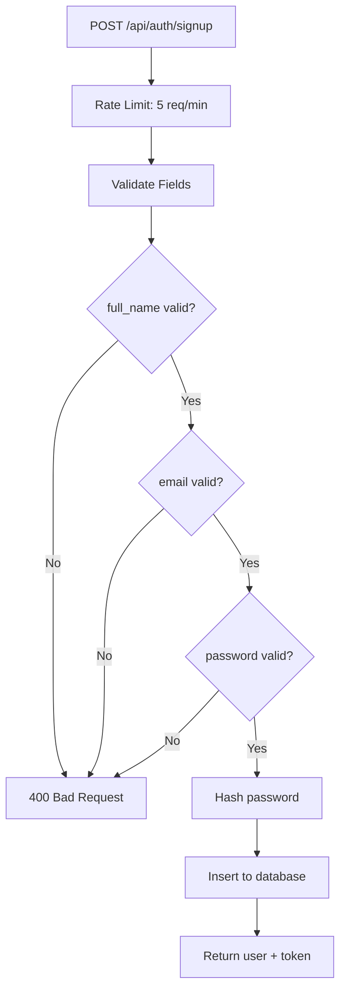
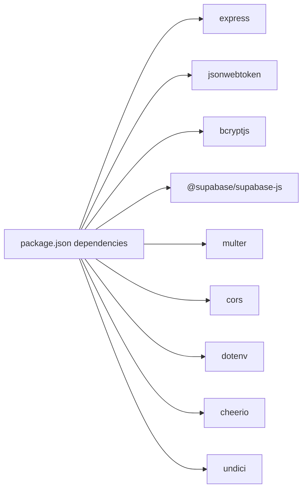

# Data Validation and Security

<cite>
**Referenced Files in This Document**
- [index.js](file://aischolarpath-backend-main/aischolarpath-backend-main/index.js)
- [validation.js](file://aischolarpath-backend-main/aischolarpath-backend-main/validation.js)
- [package.json](file://aischolarpath-backend-main/aischolarpath-backend-main/package.json)
- [AuthModal.jsx](file://scholarpath-frontend (2)/scholarpath/src/components/AuthModal.jsx)
- [validation.test.js](file://aischolarpath-backend-main/aischolarpath-backend-main/__tests__/validation.test.js)
</cite>

## Update Summary
**Changes Made**
- Added comprehensive validation system documentation with email validation, CNIC format checking, rate limiting, and XSS sanitization
- Updated input validation rules section to include the new middleware-based approach
- Enhanced security measures section with XSS prevention and rate limiting
- Added new validation middleware architecture overview
- Updated authentication endpoints to show validation integration

## Table of Contents
1. [Introduction](#introduction)
2. [Project Structure](#project-structure)
3. [Core Components](#core-components)
4. [Architecture Overview](#architecture-overview)
5. [Detailed Component Analysis](#detailed-component-analysis)
6. [Dependency Analysis](#dependency-analysis)
7. [Performance Considerations](#performance-considerations)
8. [Troubleshooting Guide](#troubleshooting-guide)
9. [Conclusion](#conclusion)

## Introduction
This document explains how ScholarPathAI secures its database layer through a comprehensive input validation system, SQL injection prevention, authorization checks, and data sanitization patterns. The system now includes a dedicated validation middleware that provides email validation, CNIC format checking, rate limiting, and XSS sanitization for enhanced input security. It covers JWT-based authentication middleware, row-level security enforcement at the application layer, secure query construction using parameterized queries via Supabase, error handling for unauthorized access, and privacy measures such as password hashing and token expiration.

## Project Structure
The backend is a single Express application that:
- Validates environment variables at startup
- Configures CORS and JSON parsing
- Implements global XSS sanitization middleware
- Provides reusable validation middleware for specific endpoints
- Implements JWT authentication middleware
- Connects to Supabase for all database operations
- Exposes REST endpoints with per-route authorization and input validation
- Uses file upload handling for CV storage
- Provides scraping utilities with rate limiting and logging



**Diagram sources**
- [index.js:1-54](file://aischolarpath-backend-main/aischolarpath-backend-main/index.js#L1-L54)
- [index.js:94-115](file://aischolarpath-backend-main/aischolarpath-backend-main/index.js#L94-L115)
- [validation.js:1-109](file://aischolarpath-backend-main/aischolarpath-backend-main/validation.js#L1-L109)

**Section sources**
- [index.js:1-54](file://aischolarpath-backend-main/aischolarpath-backend-main/index.js#L1-L54)
- [package.json:1-14](file://aischolarpath-backend-main/aischolarpath-backend-main/package.json#L1-L14)

## Core Components
- **Comprehensive Validation System**
  - Email validation with regex pattern matching
  - CNIC format validation for Pakistani identity numbers
  - Length constraints (minLength, maxLength)
  - Numeric range validation (min, max)
  - Enum validation for predefined values
  - Custom pattern validation support
- Authentication and Authorization
  - JWT-based middleware validates tokens and attaches user identity to requests.
  - Per-route checks ensure users can only access their own resources.
- Database Access
  - All queries use Supabase client methods with explicit filters (e.g., .eq('id', userId)), preventing SQL injection by design.
- File Upload Handling
  - Multer handles uploads in memory; files are stored under user-scoped paths in Supabase Storage.
- Error Handling
  - Centralized error handler returns safe messages; route handlers return consistent JSON responses with appropriate status codes.

**Section sources**
- [validation.js:23-74](file://aischolarpath-backend-main/aischolarpath-backend-main/validation.js#L23-L74)
- [index.js:32-47](file://aischolarpath-backend-main/aischolarpath-backend-main/index.js#L32-L47)
- [index.js:719-783](file://aischolarpath-backend-main/aischolarpath-backend-main/index.js#L719-L783)
- [index.js:518-573](file://aischolarpath-backend-main/aischolarpath-backend-main/index.js#L518-L573)

## Architecture Overview
The system enforces security at multiple layers with enhanced validation:
- Transport: HTTPS recommended (server listens on configurable port).
- Application: Global XSS sanitization, endpoint-specific validation, JWT middleware authenticates requests; route handlers enforce ownership checks.
- Database: Parameterized queries via Supabase prevent SQL injection; row-level filtering ensures users only access their data.
- Storage: User-scoped file paths reduce cross-user leakage risk.
- Rate Limiting: In-memory request throttling prevents abuse.



**Diagram sources**
- [index.js:719-747](file://aischolarpath-backend-main/aischolarpath-backend-main/index.js#L719-L747)
- [validation.js:94-106](file://aischolarpath-backend-main/aischolarpath-backend-main/validation.js#L94-L106)
- [validation.js:78-91](file://aischolarpath-backend-main/aischolarpath-backend-main/validation.js#L78-L91)

## Detailed Component Analysis

### Comprehensive Validation System
The new validation system provides a flexible, middleware-based approach to input validation:

#### Email Validation
- Regex-based email format validation
- Supports standard email formats including subdomains and special characters
- Returns descriptive error messages for invalid emails

#### CNIC Format Validation
- Validates Pakistani Computerized National Identity Card format
- Accepts both formatted (12345-1234567-1) and unformatted (1234512345671) versions
- Ensures proper digit count and structure

#### Length and Range Validation
- String length constraints (minLength, maxLength)
- Numeric range validation (min, max)
- Prevents buffer overflow and excessive data submission

#### Pattern and Enum Validation
- Custom regex pattern support for specialized formats
- Enum validation for predefined value sets
- Extensible rule system for future validation needs



**Diagram sources**
- [validation.js:23-74](file://aischolarpath-backend-main/aischolarpath-backend-main/validation.js#L23-L74)

**Section sources**
- [validation.js:8-20](file://aischolarpath-backend-main/aischolarpath-backend-main/validation.js#L8-L20)
- [validation.js:23-74](file://aischolarpath-backend-main/aischolarpath-backend-main/validation.js#L23-L74)
- [validation.test.js:6-37](file://aischolarpath-backend-main/aischolarpath-backend-main/__tests__/validation.test.js#L6-L37)

### Rate Limiting Implementation
- In-memory request tracking using Map data structure
- Configurable time windows and request limits
- IP-based request counting to prevent abuse
- Returns 429 status when limits exceeded



**Diagram sources**
- [validation.js:77-91](file://aischolarpath-backend-main/aischolarpath-backend-main/validation.js#L77-L91)

**Section sources**
- [validation.js:77-91](file://aischolarpath-backend-main/aischolarpath-backend-main/validation.js#L77-L91)
- [validation.test.js:152-174](file://aischolarpath-backend-main/aischolarpath-backend-main/__tests__/validation.test.js#L152-L174)

### XSS Sanitization Middleware
- Global middleware that processes all incoming requests
- Strips HTML tags from string values in request body
- Trims whitespace from string fields
- Converts dangerous characters to HTML entities
- Preserves non-string data types unchanged



**Diagram sources**
- [validation.js:94-106](file://aischolarpath-backend-main/aischolarpath-backend-main/validation.js#L94-L106)

**Section sources**
- [validation.js:94-106](file://aischolarpath-backend-main/aischolarpath-backend-main/validation.js#L94-L106)
- [validation.test.js:125-147](file://aischolarpath-backend-main/aischolarpath-backend-main/__tests__/validation.test.js#L125-L147)

### JWT-Based Authentication Middleware
- Token extraction from Authorization header
- Verification against secret from environment
- Attaches decoded user ID to request context
- Returns 401 if missing token, 403 if invalid/expired



**Diagram sources**
- [index.js:99-114](file://aischolarpath-backend-main/aischolarpath-backend-main/index.js#L99-L114)

**Section sources**
- [index.js:99-114](file://aischolarpath-backend-main/aischolarpath-backend-main/index.js#L99-L114)

### Row-Level Security and Access Control Patterns
- Ownership checks compare URL parameters with authenticated user ID
- Consistent 403 responses for unauthorized attempts
- Applies across profiles, matches, applications, notifications, attestation steps, and shortlists

Examples:
- Profile read/update: ensure id equals req.userId
- Applications CRUD: verify profile_id ownership before update/delete
- Notifications: restrict reads/writes to owner's profile



**Diagram sources**
- [index.js:207-223](file://aischolarpath-backend-main/aischolarpath-backend-main/index.js#L207-L223)
- [index.js:847-884](file://aischolarpath-backend-main/aischolarpath-backend-main/index.js#L847-L884)
- [index.js:1002-1020](file://aischolarpath-backend-main/aischolarpath-backend-main/index.js#L1002-L1020)

**Section sources**
- [index.js:207-223](file://aischolarpath-backend-main/aischolarpath-backend-main/index.js#L207-L223)
- [index.js:847-884](file://aischolarpath-backend-main/aischolarpath-backend-main/index.js#L847-L884)
- [index.js:1002-1020](file://aischolarpath-backend-main/aischolarpath-backend-main/index.js#L1002-L1020)

### Secure Query Construction and SQL Injection Prevention
- All database interactions use Supabase client methods with explicit equality filters (e.g., .eq('id', value))
- No string concatenation for SQL; queries are built via typed SDK calls
- Public endpoints (e.g., scholarships/universities listing) filter by query parameters safely

Key patterns:
- Filtering by exact IDs for owned resources
- Using .select('*') only after narrowing scope with .eq()
- Avoiding raw SQL; relying on SDK parameterization

**Section sources**
- [index.js:190-206](file://aischolarpath-backend-main/aischolarpath-backend-main/index.js#L190-L206)
- [index.js:224-271](file://aischolarpath-backend-main/aischolarpath-backend-main/index.js#L224-L271)
- [index.js:591-604](file://aischolarpath-backend-main/aischolarpath-backend-main/index.js#L591-L604)

### Enhanced Input Validation Rules
The new validation system provides comprehensive input validation:

#### Authentication Endpoints
- Signup: Validates full_name (2-100 chars), email (valid format, max 255), password (6-128 chars)
- Login: Validates email format and password presence
- Rate limited to prevent brute force attacks

#### Field Validation Types
- **Required fields**: Mandatory field validation
- **Email validation**: Regex-based email format checking
- **CNIC validation**: Pakistani identity number format validation
- **Length constraints**: Minimum and maximum string lengths
- **Numeric ranges**: Min/max value validation for numbers
- **Enum validation**: Predefined value set validation
- **Custom patterns**: Regex pattern matching



**Diagram sources**
- [index.js:719-747](file://aischolarpath-backend-main/aischolarpath-backend-main/index.js#L719-L747)
- [validation.js:23-74](file://aischolarpath-backend-main/aischolarpath-backend-main/validation.js#L23-L74)

**Section sources**
- [index.js:719-783](file://aischolarpath-backend-main/aischolarpath-backend-main/index.js#L719-L783)
- [validation.js:23-74](file://aischolarpath-backend-main/aischolarpath-backend-main/validation.js#L23-L74)
- [validation.test.js:42-120](file://aischolarpath-backend-main/aischolarpath-backend-main/__tests__/validation.test.js#L42-L120)

### Data Sanitization and Privacy Measures
- Passwords are hashed before storage and verified securely during login
- Reset tokens are time-bound and cleared after successful reset
- Sensitive fields (e.g., password_hash) are not returned in responses
- File uploads stored under user-scoped paths to limit exposure
- Global XSS sanitization prevents script injection attacks

```mermaid
flowflow TD
U["User submits password"] --> H["bcrypt.hash(password)"]
H --> Store["Store hash in profiles"]
Login["Login attempt"] --> Find["Find user by email"]
Find --> Compare["bcrypt.compare(input, stored_hash)"]
Compare --> Match{"Match?"}
Match --> |Yes| Issue["Issue JWT token"]
Match --> |No| Deny["Return 401"]
XSS["XSS payload"] --> Sanitize["HTML entity encoding"]
Sanitize --> Safe["Safe output"]
```

**Diagram sources**
- [index.js:730-747](file://aischolarpath-backend-main/aischolarpath-backend-main/index.js#L730-L747)
- [validation.js:94-106](file://aischolarpath-backend-main/aischolarpath-backend-main/validation.js#L94-L106)

**Section sources**
- [index.js:730-747](file://aischolarpath-backend-main/aischolarpath-backend-main/index.js#L730-L747)
- [index.js:560-573](file://aischolarpath-backend-main/aischolarpath-backend-main/index.js#L560-L573)
- [index.js:1140-1181](file://aischolarpath-backend-main/aischolarpath-backend-main/index.js#L1140-L1181)
- [validation.js:94-106](file://aischolarpath-backend-main/aischolarpath-backend-main/validation.js#L94-L106)

### Error Handling for Unauthorized Access
- Missing or invalid tokens result in 401/403 responses
- Ownership mismatches return 403 with clear messages
- Validation errors return 400 with detailed error arrays
- Rate limiting returns 429 when request limits exceeded
- Central error handler catches unhandled exceptions and returns safe generic errors

Patterns:
- Early return with status code and JSON payload
- Consistent { success, error } response shape
- Validation errors include both first error and full error array
- Avoid leaking internal details to clients

**Section sources**
- [index.js:99-114](file://aischolarpath-backend-main/aischolarpath-backend-main/index.js#L99-L114)
- [index.js:207-223](file://aischolarpath-backend-main/aischolarpath-backend-main/index.js#L207-L223)
- [validation.js:69-73](file://aischolarpath-backend-main/aischolarpath-backend-main/validation.js#L69-L73)
- [validation.js:84-86](file://aischolarpath-backend-main/aischolarpath-backend-main/validation.js#L84-L86)
- [index.js:1527-1531](file://aischolarpath-backend-main/aischolarpath-backend-main/index.js#L1527-L1531)

### File Upload Security
- Multer configured for memory storage
- Files uploaded to Supabase Storage under user-specific directory path
- Updates profile record with file path reference
- Content type preservation for proper handling

Security considerations:
- Path includes user ID to isolate files
- Errors handled and reported without stack traces
- File size and type validation

**Section sources**
- [index.js:112-145](file://aischolarpath-backend-main/aischolarpath-backend-main/index.js#L112-L145)

### Scraping Endpoints Safety
- Rate limiting via delays between requests to avoid abuse
- Input validation for URLs and selectors
- Logging outcomes to discovery_log table for auditability
- Errors captured and recorded without exposing internals

**Section sources**
- [index.js:1183-1243](file://aischolarpath-backend-main/aischolarpath-backend-main/index.js#L1183-L1243)
- [index.js:1259-1309](file://aischolarpath-backend-main/aischolarpath-backend-main/index.js#L1259-L1309)
- [index.js:1311-1390](file://aischolarpath-backend-main/aischolarpath-backend-main/index.js#L1311-L1390)

## Dependency Analysis
The backend relies on key libraries for security and functionality:
- express: HTTP server and routing
- jsonwebtoken: JWT issuance and verification
- bcryptjs: Password hashing and comparison
- @supabase/supabase-js: Parameterized database and storage access
- multer: File upload handling
- cors: Cross-origin resource sharing
- dotenv: Environment variable loading
- cheerio + undici: Web scraping utilities



**Diagram sources**
- [package.json:1-14](file://aischolarpath-backend-main/aischolarpath-backend-main/package.json#L1-L14)

**Section sources**
- [package.json:1-14](file://aischolarpath-backend-main/aischolarpath-backend-main/package.json#L1-L14)

## Performance Considerations
- Connection pooling via undici agent improves throughput for external requests
- Delays between scraping requests reduce server load and respect target sites
- Limiting results (e.g., slicing university lists) reduces payload size
- Selecting only needed fields minimizes data transfer
- In-memory rate limiting avoids database overhead
- Global XSS sanitization runs once per request for efficiency

## Troubleshooting Guide
Common issues and resolutions:
- Missing environment variables: The server exits at startup if SUPABASE_URL, SUPABASE_KEY, or JWT_SECRET are not set. Ensure they are defined in your environment.
- Authentication failures:
  - 401 indicates missing token; include Authorization: Bearer <token>
  - 403 indicates invalid/expired token; re-authenticate to obtain a new token
- Authorization errors:
  - 403 when accessing another user's resources; verify id matches req.userId
- Validation errors:
  - 400 with detailed error array; check field requirements and formats
  - Email validation requires proper format
  - CNIC validation expects Pakistani identity number format
- Rate limiting:
  - 429 indicates too many requests; wait and retry
  - Limits vary by endpoint (signup: 5/min, login: 10/min)
- Database errors:
  - 500 responses indicate server-side issues; check logs and Supabase connectivity
- File upload errors:
  - 400 if no file provided; ensure multipart/form-data with correct field name

**Section sources**
- [index.js:5-10](file://aischolarpath-backend-main/aischolarpath-backend-main/index.js#L5-L10)
- [index.js:99-114](file://aischolarpath-backend-main/aischolarpath-backend-main/index.js#L99-L114)
- [validation.js:69-73](file://aischolarpath-backend-main/aischolarpath-backend-main/validation.js#L69-L73)
- [validation.js:84-86](file://aischolarpath-backend-main/aischolarpath-backend-main/validation.js#L84-L86)
- [index.js:1527-1531](file://aischolarpath-backend-main/aischolarpath-backend-main/index.js#L1527-L1531)

## Conclusion
ScholarPathAI's backend implements robust security practices with a comprehensive validation system:
- **Enhanced Input Validation**: Email validation, CNIC format checking, length/range constraints, and custom pattern support
- **Rate Limiting**: In-memory request throttling prevents brute force attacks and abuse
- **XSS Protection**: Global sanitization middleware strips HTML tags and encodes dangerous characters
- JWT-based authentication with strict middleware
- Row-level access control enforced per route
- Parameterized queries via Supabase to prevent SQL injection
- Strong password hashing and secure token lifecycle management
- Consistent error handling that avoids information leakage
- Safe file upload handling with user-scoped storage paths

These measures collectively protect sensitive data, prevent common web vulnerabilities, and ensure users can only interact with their own resources while maintaining high performance and reliability.