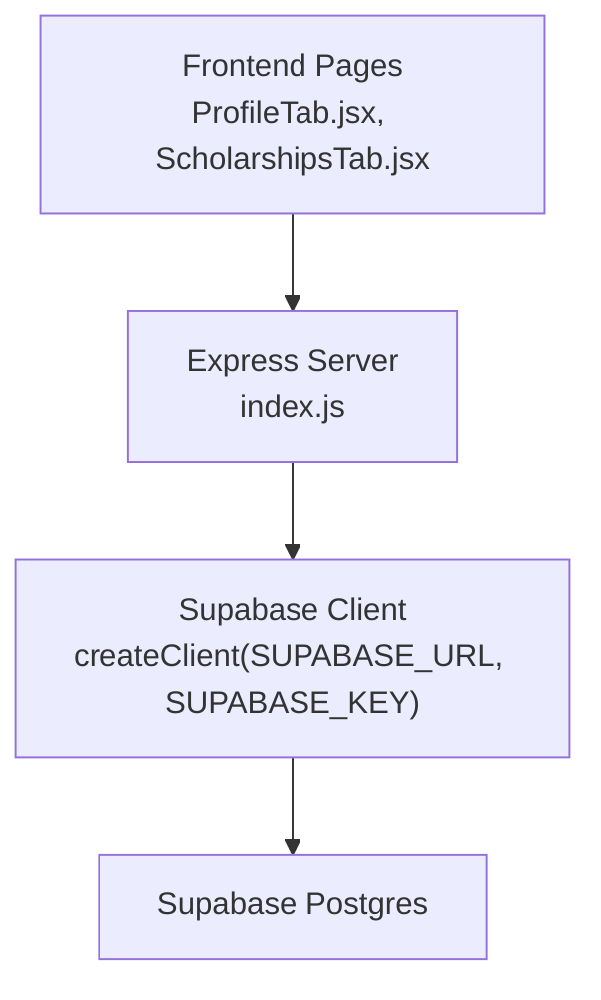
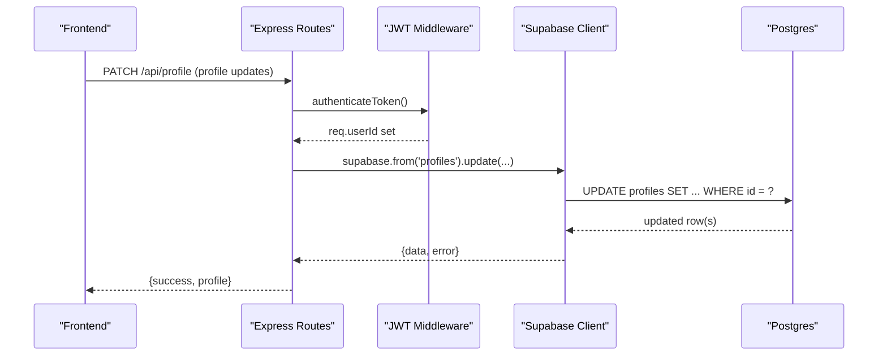
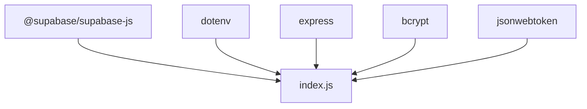

# Database Integration

<cite>
**Referenced Files in This Document**
- [index.js](file://aischolarpath-backend-main/aischolarpath-backend-main/index.js)
- [package.json](file://aischolarpath-backend-main/aischolarpath-backend-main/package.json)
- [ProfileTab.jsx](file://scholarpath-frontend (2)/scholarpath/src/pages/ProfileTab.jsx)
- [ScholarshipsTab.jsx](file://scholarpath-frontend (2)/scholarpath/src/pages/ScholarshipsTab.jsx)
</cite>

## Table of Contents
1. [Introduction](#introduction)
2. [Project Structure](#project-structure)
3. [Core Components](#core-components)
4. [Architecture Overview](#architecture-overview)
5. [Detailed Component Analysis](#detailed-component-analysis)
6. [Dependency Analysis](#dependency-analysis)
7. [Performance Considerations](#performance-considerations)
8. [Troubleshooting Guide](#troubleshooting-guide)
9. [Conclusion](#conclusion)
10. [Appendices](#appendices)

## Introduction
This document explains how ScholarPathAI integrates with Supabase to manage user profiles, scholarships, universities, matches, shortlists, and attestation steps. It covers client configuration, connection management, query patterns, schema design, optimization techniques, error handling, and transactional considerations. The backend is a Node/Express service that uses the Supabase JavaScript client to perform CRUD operations and complex joins across related entities.

## Project Structure
The application consists of:
- Backend API server using Express that configures and uses the Supabase client for all database operations.
- Frontend pages that interact with the backend APIs to display and update profile data, scholarships, and other features.

**Diagram sources**
- [index.js:50-54](file://aischolarpath-backend-main/aischolarpath-backend-main/index.js#L50-L54)
- [ProfileTab.jsx:1-232](file://scholarpath-frontend (2)/scholarpath/src/pages/ProfileTab.jsx#L1-L232)
- [ScholarshipsTab.jsx:1-139](file://scholarpath-frontend (2)/scholarpath/src/pages/ScholarshipsTab.jsx#L1-L139)

**Section sources**
- [index.js:1-68](file://aischolarpath-backend-main/aischolarpath-backend-main/index.js#L1-L68)
- [package.json:1-13](file://aischolarpath-backend-main/aischolarpath-backend-main/package.json#L1-L13)

## Core Components
- Supabase client initialization and environment validation ensure secure and reliable connections.
- Authentication middleware validates JWT tokens and attaches the current user ID to requests.
- RESTful endpoints expose operations for profiles, scholarships, universities, matches, shortlist, applications, notifications, and attestation steps.
- Query builders use Supabase’s fluent API to select, filter, order, and join related tables.

Key responsibilities:
- Profile management: create, read, update, CV upload and analysis.
- Scholarship discovery and listing with filters and joins to universities.
- Match calculation engine comparing profile attributes against scholarship eligibility criteria.
- Shortlist and application tracking.
- Attestation step lifecycle per authority.
- Notifications and deadline reminders.

**Section sources**
- [index.js:31-54](file://aischolarpath-backend-main/aischolarpath-backend-main/index.js#L31-L54)
- [index.js:69-188](file://aischolarpath-backend-main/aischolarpath-backend-main/index.js#L69-L188)
- [index.js:189-288](file://aischolarpath-backend-main/aischolarpath-backend-main/index.js#L189-L288)
- [index.js:574-749](file://aischolarpath-backend-main/aischolarpath-backend-main/index.js#L574-L749)
- [index.js:750-820](file://aischolarpath-backend-main/aischolarpath-backend-main/index.js#L750-L820)
- [index.js:821-932](file://aischolarpath-backend-main/aischolarpath-backend-main/index.js#L821-L932)
- [index.js:982-1100](file://aischolarpath-backend-main/aischolarpath-backend-main/index.js#L982-L1100)
- [index.js:1101-1181](file://aischolarpath-backend-main/aischolarpath-backend-main/index.js#L1101-L1181)
- [index.js:1545-1595](file://aischolarpath-backend-main/aischolarpath-backend-main/index.js#L1545-L1595)

## Architecture Overview
The system follows a layered architecture:
- Presentation layer: React frontend pages render UI and call backend APIs.
- API layer: Express routes handle authentication, input validation, orchestration, and error responses.
- Data layer: Supabase client executes queries against Postgres, including relational joins and filtering.

**Diagram sources**
- [index.js:31-47](file://aischolarpath-backend-main/aischolarpath-backend-main/index.js#L31-L47)
- [index.js:69-91](file://aischolarpath-backend-main/aischolarpath-backend-main/index.js#L69-L91)

## Detailed Component Analysis

### Supabase Client Configuration and Connection Management
- Environment variables are validated at startup; missing required variables abort the process.
- A single Supabase client instance is created once using environment-provided URL and key.
- An HTTP agent is configured globally for outbound requests, improving connection reuse and timeouts.

Operational notes:
- All routes rely on this shared client instance for consistent connection behavior.
- Health and test endpoints verify connectivity to Supabase.

**Section sources**
- [index.js:1-10](file://aischolarpath-backend-main/aischolarpath-backend-main/index.js#L1-L10)
- [index.js:18-25](file://aischolarpath-backend-main/aischolarpath-backend-main/index.js#L18-L25)
- [index.js:50-68](file://aischolarpath-backend-main/aischolarpath-backend-main/index.js#L50-L68)
- [package.json:1-13](file://aischolarpath-backend-main/aischolarpath-backend-main/package.json#L1-L13)

### Authentication and Authorization
- JWT-based authentication middleware extracts and verifies tokens, attaching the decoded user ID to requests.
- Most write and read operations enforce ownership by comparing request parameters with the authenticated user ID.

Security implications:
- Unauthorized access attempts return 401 or 403 responses.
- Sensitive operations validate resource ownership before executing database mutations.

**Section sources**
- [index.js:31-47](file://aischolarpath-backend-main/aischolarpath-backend-main/index.js#L31-L47)
- [index.js:94-110](file://aischolarpath-backend-main/aischolarpath-backend-main/index.js#L94-L110)
- [index.js:574-580](file://aischolarpath-backend-main/aischolarpath-backend-main/index.js#L574-L580)
- [index.js:675-681](file://aischolarpath-backend-main/aischolarpath-backend-main/index.js#L675-L681)
- [index.js:693-699](file://aischolarpath-backend-main/aischolarpath-backend-main/index.js#L693-L699)
- [index.js:886-893](file://aischolarpath-backend-main/aischolarpath-backend-main/index.js#L886-L893)
- [index.js:907-924](file://aischolarpath-backend-main/aischolarpath-backend-main/index.js#L907-L924)
- [index.js:1001-1008](file://aischolarpath-backend-main/aischolarpath-backend-main/index.js#L1001-L1008)
- [index.js:1022-1039](file://aischolarpath-backend-main/aischolarpath-backend-main/index.js#L1022-L1039)
- [index.js:1053-1058](file://aischolarpath-backend-main/aischolarpath-backend-main/index.js#L1053-L1058)
- [index.js:1545-1550](file://aischolarpath-backend-main/aischolarpath-backend-main/index.js#L1545-L1550)

### Profile Management
Operations:
- Update profile fields (name, CGPA, IELTS score, target country/degree/department).
- Retrieve profile by ID with authorization checks.
- Upload CV to storage and link file path back to profile.
- Analyze CV (placeholder) and persist extracted data into a dedicated table while updating profile fields.

Query patterns:
- Select single row with .single().
- Conditional updates based on provided fields.
- Storage integration via Supabase storage bucket.

Error handling:
- Validation errors return 400.
- Not found returns 404.
- Authorization failures return 403.
- Database errors return 500 with message.

**Section sources**
- [index.js:69-188](file://aischolarpath-backend-main/aischolarpath-backend-main/index.js#L69-L188)

### Scholarship Data Retrieval and Filtering
Operations:
- List scholarships with optional filters (country, type, department, degree level).
- Fetch single scholarship by ID.
- Enrich results with university details via relational select.

Query patterns:
- Dynamic query building with chained .eq() filters.
- Relational selects to include related university fields.

Optimization:
- Use specific field selections where possible to reduce payload size.
- Filter early in the query chain to minimize result sets.

**Section sources**
- [index.js:189-222](file://aischolarpath-backend-main/aischolarpath-backend-main/index.js#L189-L222)

### University Information Access
Operations:
- List universities with filters (country, degree program, search).
- Include universities that have direct scholarships or country-wide scholarships.
- Fetch single university by ID.

Query patterns:
- Combine base filters with array containment for degree programs.
- Separate queries to identify universities with active scholarships and countries covered by country-wide scholarships.
- In-memory filtering to merge results from multiple queries.

Optimization:
- Limit results to a fixed number to control response size.
- Use Set structures for efficient membership checks.

**Section sources**
- [index.js:223-288](file://aischolarpath-backend-main/aischolarpath-backend-main/index.js#L223-L288)

### Match Calculations
Process:
- Load profile and active scholarships (optionally filtered by target country).
- For each scholarship, evaluate eligibility criteria (CGPA, IELTS, required degree).
- Compute match score as percentage of passed criteria.
- Determine status: Eligible, Missing Requirements, Not Eligible.
- Clear previous matches for the profile and insert fresh results.

Complexity:
- Time complexity O(N) over scholarships per run.
- Space complexity proportional to number of scholarships evaluated.

Optimization opportunities:
- Pre-filter scholarships by country to reduce evaluation scope.
- Batch delete and insert operations to minimize round trips.

Error handling:
- Handle missing profile gracefully.
- Return detailed evidence per criterion for transparency.

**Section sources**
- [index.js:574-673](file://aischolarpath-backend-main/aischolarpath-backend-main/index.js#L574-L673)

### Matches Retrieval and Dashboard Overview
Operations:
- Retrieve stored matches for a profile with joined scholarship and university details.
- Generate dashboard overview including profile completeness, summary counts, and top recommendations.

Query patterns:
- Relational selects to fetch nested scholarship and university data.
- Ordering by match score descending.

Aggregation:
- Count eligible, missing requirements, and not eligible matches.
- Identify unique universities covered.

**Section sources**
- [index.js:675-749](file://aischolarpath-backend-main/aischolarpath-backend-main/index.js#L675-L749)

### Shortlist Management
Operations:
- Add item (scholarship or university) to shortlist.
- Remove item from shortlist.
- Retrieve full shortlist with associated details.

Query patterns:
- Insert with selected return.
- Delete by ID.
- Select with IN clause to fetch related items efficiently.

Authorization:
- Validate ownership of shortlist entries.

**Section sources**
- [index.js:750-820](file://aischolarpath-backend-main/aischolarpath-backend-main/index.js#L750-L820)

### Application Tracking
Operations:
- Create or start tracking an application.
- Update application status, notes, next action, and next action date.
- Retrieve all applications for a profile with scholarship details.
- Delete an application.

Query patterns:
- Insert with default status if none provided.
- Partial updates based on provided fields.
- Relational select to include scholarship metadata.

Authorization:
- Verify ownership before updates or deletions.

**Section sources**
- [index.js:821-932](file://aischolarpath-backend-main/aischolarpath-backend-main/index.js#L821-L932)

### Notifications and Deadline Reminders
Operations:
- Create notifications.
- Retrieve notifications for a profile ordered by creation time.
- Mark notification as read.
- Check upcoming deadlines within a threshold and generate reminders.

Query patterns:
- Insert with selected return.
- Select with ordering and equality filters.
- Join applications with scholarships to compute deadlines.

Business logic:
- Threshold-based reminder generation (e.g., within 14 days).
- Avoid creating duplicates by checking existing conditions.

**Section sources**
- [index.js:982-1100](file://aischolarpath-backend-main/aischolarpath-backend-main/index.js#L982-L1100)

### Attestation Steps
Operations:
- Initialize tracked steps for a profile per authority.
- Retrieve steps for a profile ordered by authority and step order.
- Mark a step as done.

Query patterns:
- Bulk insert with structured step definitions.
- Select with multi-order clauses.
- Update single step with status change.

Authorization:
- Ensure users can only modify their own steps.

**Section sources**
- [index.js:437-517](file://aischolarpath-backend-main/aischolarpath-backend-main/index.js#L437-L517)

### Password Reset Flow
Operations:
- Generate reset token for a given email.
- Reset password using a valid and non-expired token.

Query patterns:
- Lookup by email with single row selection.
- Update profile with hashed password and clear reset token fields.

Security:
- Token expiration enforced.
- Generic messages to avoid revealing user existence.

**Section sources**
- [index.js:1101-1181](file://aischolarpath-backend-main/aischolarpath-backend-main/index.js#L1101-L1181)

### Roadmap Generation
Operations:
- Build personalized roadmap based on nearest scholarship deadline among matches.
- Apply static template milestones adjusted relative to deadline.

Query patterns:
- Select matches with joined scholarship titles and deadlines.
- Filter by status and order by match score.

Business logic:
- Sort matches by deadline to find nearest target.
- Map template tasks to target dates and mark overdue items.

**Section sources**
- [index.js:1545-1595](file://aischolarpath-backend-main/aischolarpath-backend-main/index.js#L1545-L1595)

### Complex Queries and Joins
Examples:
- Matching endpoint joins scholarships with universities to enrich eligibility evaluation.
- Overview endpoint joins matches with scholarships and universities to produce dashboard metrics.
- Applications endpoint joins applications with scholarships to present contextual information.
- Shortlist retrieval uses IN clause to batch-fetch related entities.

Patterns:
- Use relational selects to fetch nested data in a single query.
- Combine equality filters with ordering to optimize result sets.

**Section sources**
- [index.js:591-600](file://aischolarpath-backend-main/aischolarpath-backend-main/index.js#L591-L600)
- [index.js:682-686](file://aischolarpath-backend-main/aischolarpath-backend-main/index.js#L682-L686)
- [index.js:711-714](file://aischolarpath-backend-main/aischolarpath-backend-main/index.js#L711-L714)
- [index.js:809-817](file://aischolarpath-backend-main/aischolarpath-backend-main/index.js#L809-L817)
- [index.js:895-899](file://aischolarpath-backend-main/aischolarpath-backend-main/index.js#L895-L899)

## Dependency Analysis
External dependencies relevant to database integration:
- @supabase/supabase-js provides the client used throughout the backend.
- dotenv loads environment variables for configuration.
- express handles routing and middleware.
- bcrypt and jsonwebtoken support authentication flows.

**Diagram sources**
- [package.json:1-13](file://aischolarpath-backend-main/aischolarpath-backend-main/package.json#L1-L13)
- [index.js:1-27](file://aischolarpath-backend-main/aischolarpath-backend-main/index.js#L1-L27)

**Section sources**
- [package.json:1-13](file://aischolarpath-backend-main/aischolarpath-backend-main/package.json#L1-L13)
- [index.js:1-27](file://aischolarpath-backend-main/aischolarpath-backend-main/index.js#L1-L27)

## Performance Considerations
- Connection pooling: Global HTTP agent configured with connection limits and timeouts improves throughput.
- Query efficiency:
  - Use selective field projections to reduce payload sizes.
  - Apply filters early in query chains.
  - Leverage relational selects to minimize round trips.
- Result limiting:
  - Limit lists to reasonable sizes (e.g., top N universities).
- Batch operations:
  - Bulk inserts for attestation steps and notifications.
  - Delete-before-insert pattern for matches to maintain consistency.
- Caching opportunities:
  - Consider caching static guides and reference data at the API layer.
- Rate limiting:
  - Scraper endpoints include delays to respect external site policies.

[No sources needed since this section provides general guidance]

## Troubleshooting Guide
Common issues and strategies:
- Missing environment variables: Startup validation exits with an error listing missing variables.
- Authentication failures: Middleware returns 401/403 when tokens are invalid or expired.
- Not found scenarios: Single-row selects return 404 when resources do not exist.
- Database errors: Errors from Supabase are propagated with messages; centralized handler logs unhandled exceptions.
- Authorization violations: Ownership checks prevent unauthorized updates or reads.

Recommendations:
- Always check error objects returned by Supabase calls.
- Use health and test endpoints to verify connectivity.
- Log detailed context around failed operations for debugging.

**Section sources**
- [index.js:1-10](file://aischolarpath-backend-main/aischolarpath-backend-main/index.js#L1-L10)
- [index.js:31-47](file://aischolarpath-backend-main/aischolarpath-backend-main/index.js#L31-L47)
- [index.js:100-110](file://aischolarpath-backend-main/aischolarpath-backend-main/index.js#L100-L110)
- [index.js:1527-1531](file://aischolarpath-backend-main/aischolarpath-backend-main/index.js#L1527-L1531)

## Conclusion
ScholarPathAI’s database integration leverages a robust Express backend with a centralized Supabase client to manage profiles, scholarships, universities, matches, shortlists, applications, notifications, and attestation steps. The codebase demonstrates consistent query patterns, strong authorization controls, and thoughtful error handling. Optimization techniques such as selective projections, early filtering, and batch operations improve performance. Future enhancements could include more sophisticated caching, advanced indexing strategies, and transactional boundaries for multi-step operations.

[No sources needed since this section summarizes without analyzing specific files]

## Appendices

### Schema Design Overview
Based on observed usage in the backend, the following logical tables are involved:
- profiles: User identity and academic/target preferences; supports CV file path and password hashing.
- scholarships: Program details, eligibility criteria, deadlines, links, and status; optionally linked to universities.
- universities: Institution details including name and official portal URLs; may be referenced by scholarships.
- matches: Computed alignment between profiles and scholarships with scores and evidence.
- shortlist: User-curated list of scholarships or universities.
- applications: Tracking of user applications with status and notes.
- notifications: Alerts and reminders for users.
- attestation_steps: Step-by-step progress for document attestation per authority.
- extracted_profile_data: Stores AI-extracted profile data during CV analysis.
- discovery_log: Logs for scraping activities and outcomes.

Notes:
- Relationships are expressed through foreign keys and relational selects in queries.
- Status fields drive workflow states (e.g., active, under_review, pending, done).

[No sources needed since this section describes conceptual schema derived from usage]

### Example Query Patterns
- Filtering scholarships by country and joining universities:
  - Build query with .from('scholarships').select('*, universities(name)').eq('country', ...)
- Retrieving matches with enriched details:
  - .from('matches').select('*, scholarships(title, country, deadline), universities(name)').eq('profile_id', ...)
- Bulk fetching related items:
  - .from('scholarships').select('*').in('id', [...])
- Ordering and limiting:
  - .order('match_score', { ascending: false }).limit(10)

**Section sources**
- [index.js:189-206](file://aischolarpath-backend-main/aischolarpath-backend-main/index.js#L189-L206)
- [index.js:682-686](file://aischolarpath-backend-main/aischolarpath-backend-main/index.js#L682-L686)
- [index.js:809-817](file://aischolarpath-backend-main/aischolarpath-backend-main/index.js#L809-L817)