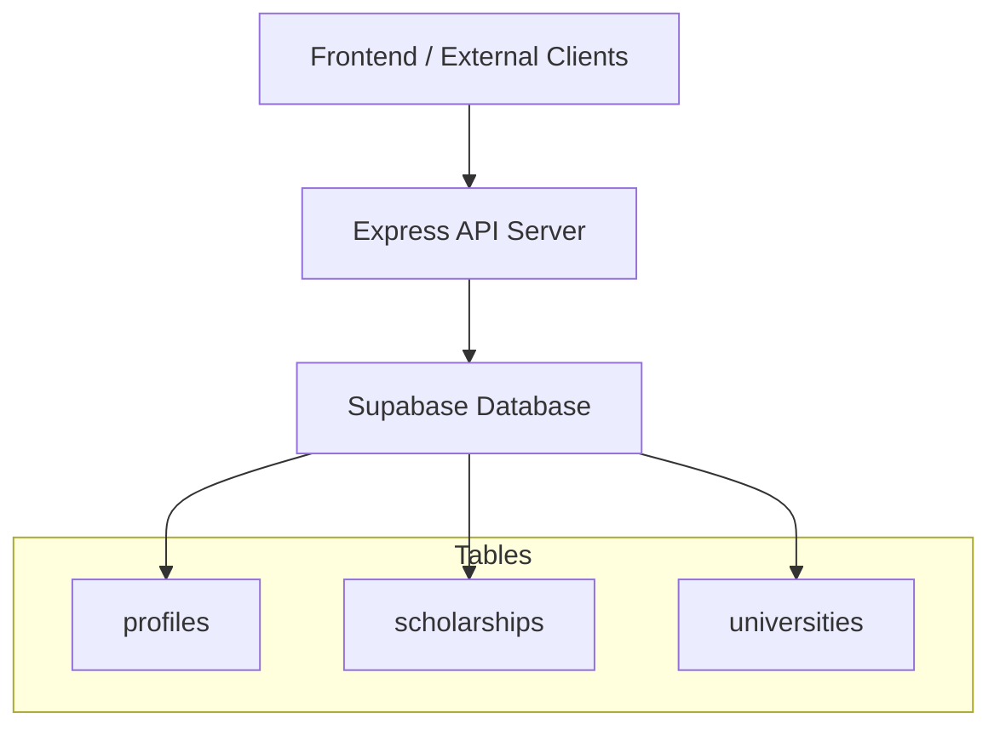
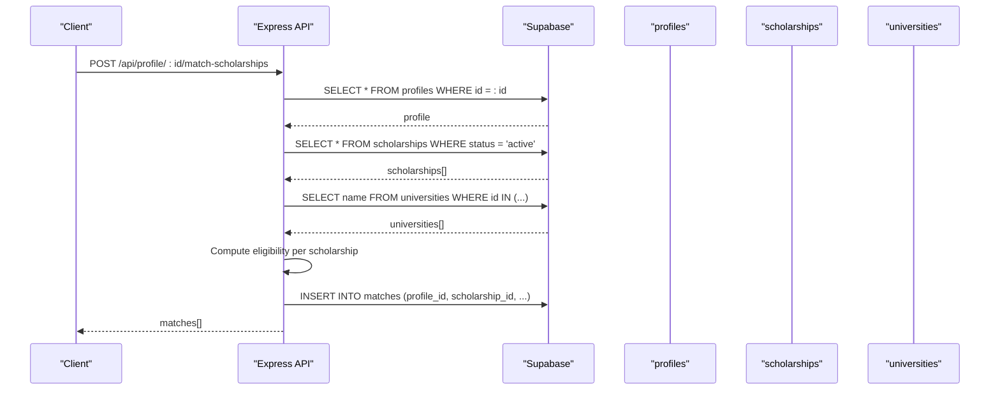
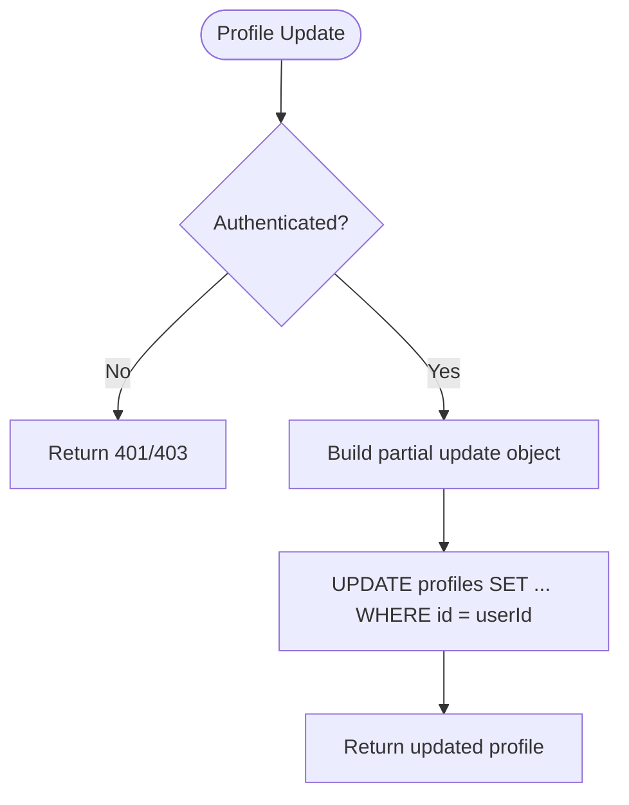
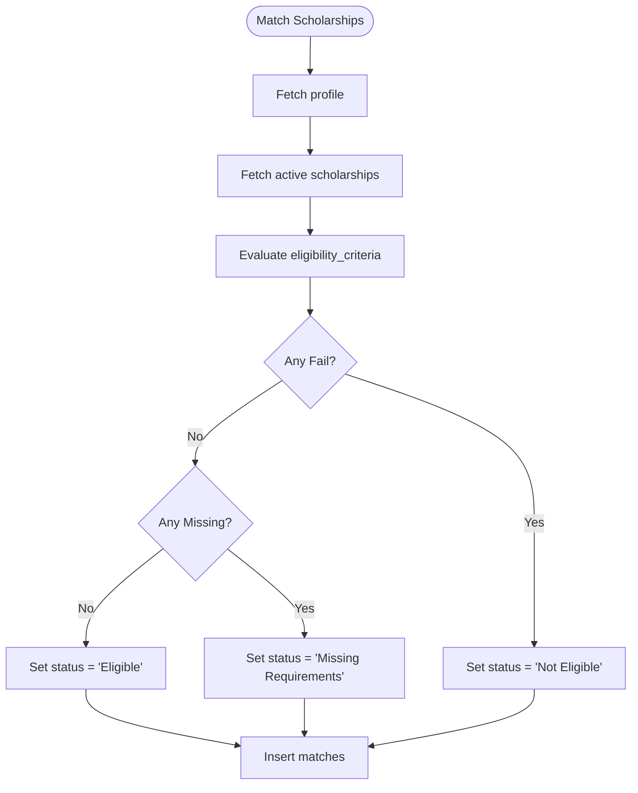
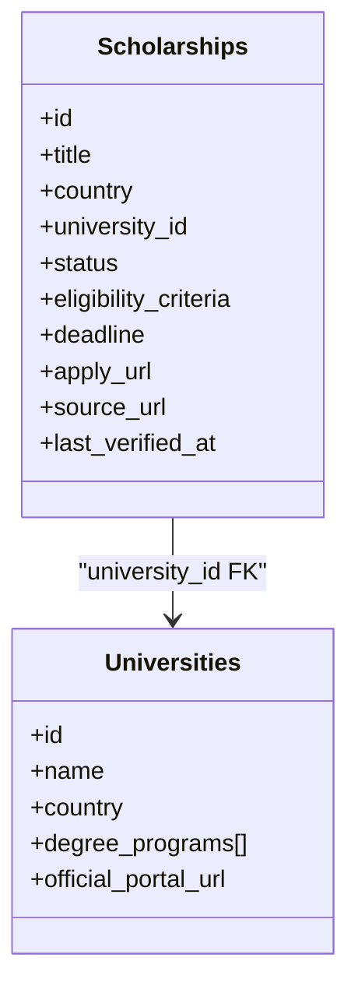
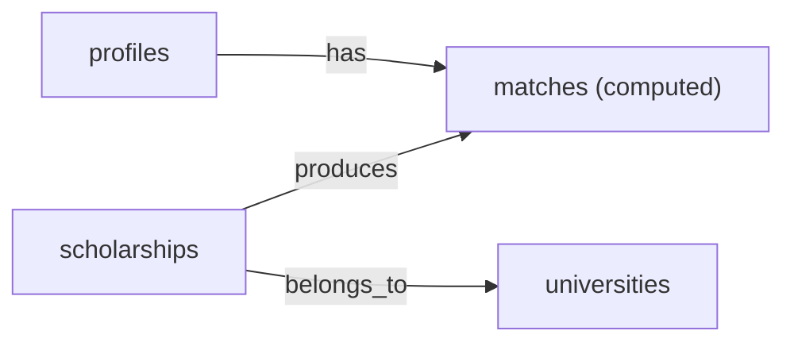

# Core Tables

<cite>
**Referenced Files in This Document**
- [index.js](file://aischolarpath-backend-main/aischolarpath-backend-main/index.js)
- [mockData.js](file://scholarpath-frontend (2)/scholarpath/src/data/mockData.js)
</cite>

## Table of Contents
1. [Introduction](#introduction)
2. [Project Structure](#project-structure)
3. [Core Components](#core-components)
4. [Architecture Overview](#architecture-overview)
5. [Detailed Component Analysis](#detailed-component-analysis)
6. [Dependency Analysis](#dependency-analysis)
7. [Performance Considerations](#performance-considerations)
8. [Troubleshooting Guide](#troubleshooting-guide)
9. [Conclusion](#conclusion)

## Introduction
This document describes the core database tables used by ScholarPathAI: profiles, scholarships, and universities. It consolidates field definitions, data types, constraints, and business rules inferred from the backend API usage and frontend mock data. The system uses Supabase as the database layer and exposes REST endpoints that read and write to these tables.

## Project Structure
The backend is a Node/Express application that interacts with Supabase tables via the Supabase JS client. The frontend includes mock data for demonstration but the authoritative schema behavior is defined by how the backend queries and updates the database.

**Section sources**
- [index.js:1-55](file://aischolarpath-backend-main/aischolarpath-backend-main/index.js#L1-L55)

## Core Components
This section documents the three core tables: profiles, scholarships, and universities. For each table, we list fields, inferred data types, constraints, and business rules based on backend operations and frontend references.

### profiles
Purpose: Stores user authentication and academic profile data, plus CV file reference.

Fields and inferred types:
- id: integer or uuid (primary key; used as user identity in JWT claims and route authorization)
- full_name: string
- email: string (unique; used for login lookup)
- password_hash: string (hashed with bcrypt)
- cgpa: numeric (optional; used in eligibility checks)
- ielts_score: numeric (optional; used in eligibility checks)
- target_country: string (optional; filters matching scholarships)
- target_degree: string (optional; matched against scholarship required_degree)
- target_department: string (optional; stored for profile completeness)
- cv_file_path: string (relative path in storage bucket “cvs”; updated after upload)
- reset_token: string (nullable; temporary token for password reset flow)
- reset_token_expiry: timestamp (nullable; expiry for reset token)

Constraints and business rules:
- Authentication:
  - Login verifies email exists and compares provided password against password_hash using bcrypt.
  - Password reset flow stores reset_token and reset_token_expiry, then clears them after successful reset.
- Profile updates:
  - Users can update full_name, cgpa, ielts_score, target_country, target_degree, target_department via a protected endpoint.
- CV management:
  - CV files are uploaded to Supabase Storage under bucket “cvs” with a path like {id}/{timestamp}_{filename}.
  - After upload, cv_file_path is updated on the profile row.
- Authorization:
  - Many endpoints enforce that the authenticated user’s id matches the requested profile id.

Relevant behaviors observed in code:
- Signup inserts full_name, email, password_hash into profiles.
- Login selects id, full_name, email, password_hash and verifies password.
- Profile update endpoint accepts partial updates for academic fields.
- CV upload endpoint writes to storage and updates cv_file_path.
- Password reset endpoints set/clear reset_token and reset_token_expiry.

**Section sources**
- [index.js:69-91](file://aischolarpath-backend-main/aischolarpath-backend-main/index.js#L69-L91)
- [index.js:112-145](file://aischolarpath-backend-main/aischolarpath-backend-main/index.js#L112-L145)
- [index.js:519-540](file://aischolarpath-backend-main/aischolarpath-backend-main/index.js#L519-L540)
- [index.js:543-573](file://aischolarpath-backend-main/aischolarpath-backend-main/index.js#L543-L573)
- [index.js:1102-1181](file://aischolarpath-backend-main/aischolarpath-backend-main/index.js#L1102-L1181)

### scholarships
Purpose: Catalogs scholarship opportunities with eligibility criteria, deadlines, and links to universities or country-wide programs.

Fields and inferred types:
- id: integer or uuid (primary key)
- title: string (used as part of conflict resolution during upsert)
- country: string (used for filtering and country-wide scholarships)
- university_id: integer or uuid (nullable; when null, indicates country-wide scholarship)
- status: enum-like string (values include 'active', 'under_review'; default may be 'under_review' for scraped entries)
- eligibility_criteria: JSON object containing:
  - min_cgpa: numeric (optional)
  - min_ielts: numeric (optional)
  - required_degree: string (optional)
- deadline: string or date (ISO-like or human-readable date; used for roadmap and deadline reminders)
- apply_url: string (official application link)
- source_url: string (original source page URL)
- last_verified_at: timestamp (updated when approved or verified)

Constraints and business rules:
- Status lifecycle:
  - Scraped entries are inserted with status 'under_review'.
  - Admin approval sets status to 'active' and updates last_verified_at.
- Eligibility matching:
  - Matching engine reads eligibility_criteria and compares against profile fields (cgpa, ielts_score, target_degree).
  - If any criterion fails, the match status becomes 'Not Eligible'; if missing, 'Missing Requirements'; otherwise 'Eligible'.
- University vs country-wide:
  - If university_id is not null, the scholarship is tied to a specific university.
  - If university_id is null, the scholarship applies to the entire country (country-wide).
- Filtering:
  - Endpoints filter by country, department, degree_level, and status.
  - Matching endpoint filters active scholarships and optionally by profile.target_country.

Relevant behaviors observed in code:
- Listing and single retrieval join with universities to return name and official_portal_url.
- Matching computes evidence per criterion and persists results in a separate matches table.
- Approval endpoint updates status to 'active' and last_verified_at.
- Scrape endpoints upsert scholarships with title,country conflict resolution.

**Section sources**
- [index.js:189-206](file://aischolarpath-backend-main/aischolarpath-backend-main/index.js#L189-L206)
- [index.js:208-222](file://aischolarpath-backend-main/aischolarpath-backend-main/index.js#L208-L222)
- [index.js:574-673](file://aischolarpath-backend-main/aischolarpath-backend-main/index.js#L574-L673)
- [index.js:1494-1526](file://aischolarpath-backend-main/aischolarpath-backend-main/index.js#L1494-L1526)
- [index.js:1311-1390](file://aischolarpath-backend-main/aischolarpath-backend-main/index.js#L1311-L1390)
- [index.js:1391-1439](file://aischolarpath-backend-main/aischolarpath-backend-main/index.js#L1391-L1439)
- [index.js:1440-1493](file://aischolarpath-backend-main/aischolarpath-backend-main/index.js#L1440-L1493)

### universities
Purpose: Stores institution information, including country, offered degree programs, and official portal URLs.

Fields and inferred types:
- id: integer or uuid (primary key)
- name: string
- country: string
- degree_programs: array of strings (e.g., ['Bachelor’s', 'Master’s', 'PhD'])
- official_portal_url: string (official website URL)

Constraints and business rules:
- Degree program filtering:
  - Queries use contains semantics to filter universities offering a specific degree_program.
- Search:
  - Name supports case-insensitive search via ilike.
- Relationship to scholarships:
  - scholarships.university_id references universities.id for university-specific scholarships.
  - Country-wide scholarships have scholarships.university_id null and rely on scholarships.country.

Relevant behaviors observed in code:
- Listing endpoint filters by country, degree_program, and name search.
- Single retrieval returns full university record.
- Scholarship listing joins universities to return name and official_portal_url.

**Section sources**
- [index.js:223-271](file://aischolarpath-backend-main/aischolarpath-backend-main/index.js#L223-L271)
- [index.js:274-288](file://aischolarpath-backend-main/aischolarpath-backend-main/index.js#L274-L288)
- [index.js:193-206](file://aischolarpath-backend-main/aischolarpath-backend-main/index.js#L193-L206)

## Architecture Overview
The following diagram shows how the three core tables interact through the API and matching logic.

**Diagram sources**
- [index.js:574-673](file://aischolarpath-backend-main/aischolarpath-backend-main/index.js#L574-L673)
- [index.js:189-206](file://aischolarpath-backend-main/aischolarpath-backend-main/index.js#L189-L206)
- [index.js:223-271](file://aischolarpath-backend-main/aischolarpath-backend-main/index.js#L223-L271)

## Detailed Component Analysis

### profiles table analysis
- Authentication fields:
  - id, full_name, email, password_hash are central to signup/login flows.
  - Password hashing uses bcrypt; reset tokens are managed via reset_token and reset_token_expiry.
- Academic profile data:
  - cgpa, ielts_score, target_country, target_degree, target_department are used for matching and dashboard completeness.
- Document management:
  - cv_file_path stores the relative path to the uploaded CV in Supabase Storage bucket “cvs”.

**Diagram sources**
- [index.js:69-91](file://aischolarpath-backend-main/aischolarpath-backend-main/index.js#L69-L91)

**Section sources**
- [index.js:69-91](file://aischolarpath-backend-main/aischolarpath-backend-main/index.js#L69-L91)
- [index.js:112-145](file://aischolarpath-backend-main/aischolarpath-backend-main/index.js#L112-L145)
- [index.js:519-573](file://aischolarpath-backend-main/aischolarpath-backend-main/index.js#L519-L573)
- [index.js:1102-1181](file://aischolarpath-backend-main/aischolarpath-backend-main/index.js#L1102-L1181)

### scholarships table analysis
- Eligibility criteria:
  - Stored as JSON with min_cgpa, min_ielts, required_degree.
  - Matching algorithm evaluates each criterion against profile fields to determine pass/fail/missing.
- University relationships:
  - university_id links to universities for institution-specific scholarships.
  - When university_id is null, the scholarship applies to the entire country (country-wide).
- Status tracking:
  - 'under_review' for newly scraped entries; 'active' after manual approval.
  - last_verified_at updated upon approval.

**Diagram sources**
- [index.js:574-673](file://aischolarpath-backend-main/aischolarpath-backend-main/index.js#L574-L673)

**Section sources**
- [index.js:574-673](file://aischolarpath-backend-main/aischolarpath-backend-main/index.js#L574-L673)
- [index.js:1494-1526](file://aischolarpath-backend-main/aischolarpath-backend-main/index.js#L1494-L1526)
- [index.js:1311-1390](file://aischolarpath-backend-main/aischolarpath-backend-main/index.js#L1311-L1390)

### universities table analysis
- Institution information:
  - name, country, official_portal_url provide basic metadata.
- Degree programs:
  - degree_programs is an array; filtering uses contains semantics.
- Official portal URLs:
  - Returned alongside scholarships to enable direct navigation to university sites.

**Diagram sources**
- [index.js:223-271](file://aischolarpath-backend-main/aischolarpath-backend-main/index.js#L223-L271)
- [index.js:189-206](file://aischolarpath-backend-main/aischolarpath-backend-main/index.js#L189-L206)

**Section sources**
- [index.js:223-271](file://aischolarpath-backend-main/aischolarpath-backend-main/index.js#L223-L271)
- [index.js:274-288](file://aischolarpath-backend-main/aischolarpath-backend-main/index.js#L274-L288)
- [index.js:189-206](file://aischolarpath-backend-main/aischolarpath-backend-main/index.js#L189-L206)

## Dependency Analysis
- profiles depend on:
  - Supabase Storage for CV files (cv_file_path points to storage bucket “cvs”).
  - JWT-based authentication middleware for authorization.
- scholarships depend on:
  - universities via university_id for institution-specific scholarships.
  - matches table for computed eligibility results (not part of this document’s scope).
- universities depend on:
  - scholarships via one-to-many relationship (one university can have many scholarships).

**Diagram sources**
- [index.js:574-673](file://aischolarpath-backend-main/aischolarpath-backend-main/index.js#L574-L673)
- [index.js:223-271](file://aischolarpath-backend-main/aischolarpath-backend-main/index.js#L223-L271)

**Section sources**
- [index.js:574-673](file://aischolarpath-backend-main/aischolarpath-backend-main/index.js#L574-L673)
- [index.js:223-271](file://aischolarpath-backend-main/aischolarpath-backend-main/index.js#L223-L271)

## Performance Considerations
- Query efficiency:
  - Filtering scholarships by status='active' reduces dataset size before matching.
  - Using contains for degree_programs avoids full scans where possible.
- Storage:
  - CV uploads store files in Supabase Storage; only paths are persisted in profiles to keep DB lightweight.
- Matching computation:
  - Matching runs in-memory after fetching active scholarships; consider indexing scholarships.status and scholarships.country for large datasets.

[No sources needed since this section provides general guidance]

## Troubleshooting Guide
Common issues and resolutions:
- Authentication failures:
  - Ensure email exists and password matches password_hash; verify JWT secret configuration.
- CV upload errors:
  - Confirm Supabase Storage bucket “cvs” exists and permissions allow uploads; check cv_file_path update success.
- Scholarship matching discrepancies:
  - Verify eligibility_criteria values and profile fields (cgpa, ielts_score, target_degree); ensure scholarships.status is 'active'.
- University filtering:
  - Confirm degree_programs array contains expected values; use case-insensitive search for names.

**Section sources**
- [index.js:519-573](file://aischolarpath-backend-main/aischolarpath-backend-main/index.js#L519-L573)
- [index.js:112-145](file://aischolarpath-backend-main/aischolarpath-backend-main/index.js#L112-L145)
- [index.js:574-673](file://aischolarpath-backend-main/aischolarpath-backend-main/index.js#L574-L673)
- [index.js:223-271](file://aischolarpath-backend-main/aischolarpath-backend-main/index.js#L223-L271)

## Conclusion
The core tables—profiles, scholarships, and universities—form the backbone of ScholarPathAI’s matching and discovery features. Profiles capture user identity and academic goals; scholarships encode eligibility and deadlines; universities provide institutional context and official links. The backend enforces clear business rules around authentication, eligibility matching, and status lifecycle, enabling a robust student journey from profile creation to targeted scholarship recommendations.

[No sources needed since this section summarizes without analyzing specific files]