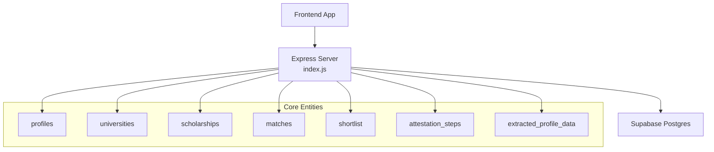
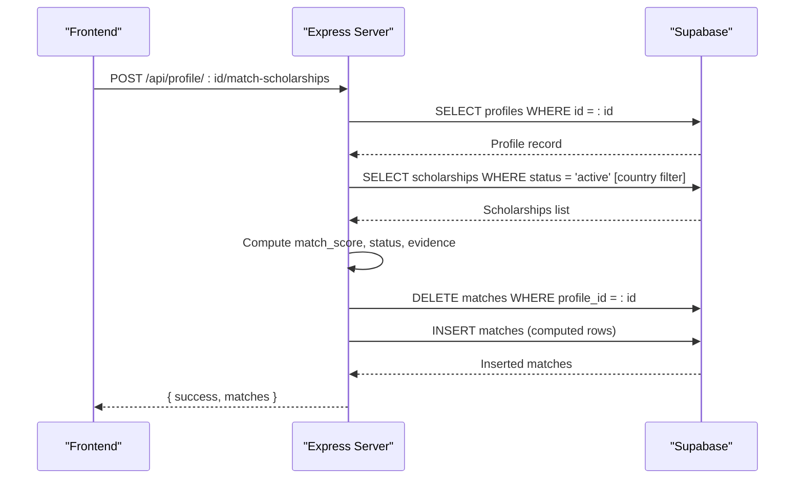
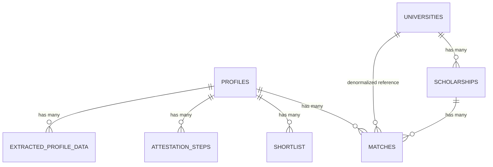

# Database Schema Design

<cite>
**Referenced Files in This Document**
- [index.js](file://aischolarpath-backend-main/aischolarpath-backend-main/index.js)
- [supabase-schema.sql](file://aischolarpath-backend-main/aischolarpath-backend-main/supabase-schema.sql)
- [matching-engine.js](file://aischolarpath-backend-main/aischolarpath-backend-main/matching-engine.js)
</cite>

## Update Summary
**Changes Made**
- Enhanced scholarships table documentation with university_id foreign key relationship
- Updated matches table to include denormalized university_id field
- Added detailed university relationship joins in API endpoints
- Documented dual scholarship categorization (university-specific vs country-wide)
- Updated entity relationship diagrams to reflect new university connections

## Table of Contents
1. [Introduction](#introduction)
2. [Project Structure](#project-structure)
3. [Core Components](#core-components)
4. [Architecture Overview](#architecture-overview)
5. [Detailed Component Analysis](#detailed-component-analysis)
6. [Dependency Analysis](#dependency-analysis)
7. [Performance Considerations](#performance-considerations)
8. [Troubleshooting Guide](#troubleshooting-guide)
9. [Conclusion](#conclusion)

## Introduction
This document describes the database schema design used by ScholarPathAI, inferred from the backend API implementation. It focuses on the core tables: profiles, scholarships, universities, matches, shortlist, attestation_steps, and extracted_profile_data. For each table, it outlines fields, data types (as used by the application), constraints implied by usage, primary and foreign key relationships, and indexes that are beneficial for performance. It also explains entity relationships, data validation rules enforced by the server, and business logic constraints derived from the matching and workflow features.

**Updated** Enhanced scholarship data model now includes proper university relationship information through university_id fields and related university name joins, enabling better data relationships and more accurate categorization.

## Project Structure
The backend is a single-file Express server that interacts with a Supabase Postgres database via the Supabase client. All table names and field usages are referenced through Supabase queries in this file. The frontend consumes REST endpoints to read/write these entities.

**Diagram sources**
- [index.js:1-100](file://aischolarpath-backend-main/aischolarpath-backend-main/index.js#L1-L100)
- [index.js:189-288](file://aischolarpath-backend-main/aischolarpath-backend-main/index.js#L189-L288)
- [index.js:574-673](file://aischolarpath-backend-main/aischolarpath-backend-main/index.js#L574-L673)
- [index.js:750-820](file://aischolarpath-backend-main/aischolarpath-backend-main/index.js#L750-L820)
- [index.js:437-517](file://aischolarpath-backend-main/aischolarpath-backend-main/index.js#L437-L517)
- [index.js:147-188](file://aischolarpath-backend-main/aischolarpath-backend-main/index.js#L147-L188)

**Section sources**
- [index.js:1-100](file://aischolarpath-backend-main/aischolarpath-backend-main/index.js#L1-L100)

## Core Components
This section summarizes the core tables and their roles as observed in the backend code.

- profiles: Stores user identity and academic profile attributes used for matching and personalization.
- universities: Catalog of universities; scholarships may be linked to a specific university or be country-wide.
- scholarships: Scholarship programs with eligibility criteria, deadlines, and links; can be tied to a university or country-wide.
- matches: Computed results linking a profile to scholarships with scores and evidence.
- shortlist: User-curated list of items (scholarships or universities).
- attestation_steps: Step-by-step tracking for document attestation workflows per authority.
- extracted_profile_data: Records of AI-extracted profile information from uploaded CVs.

**Section sources**
- [index.js:69-188](file://aischolarpath-backend-main/aischolarpath-backend-main/index.js#L69-L188)
- [index.js:189-288](file://aischolarpath-backend-main/aischolarpath-backend-main/index.js#L189-L288)
- [index.js:574-673](file://aischolarpath-backend-main/aischolarpath-backend-main/index.js#L574-L673)
- [index.js:750-820](file://aischolarpath-backend-main/aischolarpath-backend-main/index.js#L750-L820)
- [index.js:437-517](file://aischolarpath-backend-main/aischolarpath-backend-main/index.js#L437-L517)

## Architecture Overview
The system uses an API-first architecture where the Express server orchestrates data access to Supabase. Matching logic runs server-side, reading profiles and scholarships, computing match scores and statuses, and persisting results in matches. Shortlist and attestation steps support user workflows. Extracted profile data supports CV analysis.

**Diagram sources**
- [index.js:574-673](file://aischolarpath-backend-main/aischolarpath-backend-main/index.js#L574-L673)

## Detailed Component Analysis

### Table: profiles
Purpose: Represents a student/user account and their academic profile used for matching and dashboard summaries.

Key fields (inferred from usage):
- id: Primary key (user identifier; JWT payload references this)
- full_name: Text
- email: Text (unique, used for login)
- password_hash: Text (hashed password)
- cgpa: Numeric (nullable)
- ielts_score: Numeric (nullable)
- target_country: Text (nullable)
- target_degree: Text (nullable)
- target_department: Text (nullable)
- cv_file_path: Text (nullable; path in storage)
- reset_token: Text (nullable; temporary token)
- reset_token_expiry: Timestamp (nullable; temporary token expiry)

Constraints and validation:
- Authentication middleware enforces ownership checks using req.userId derived from JWT.
- Login/signup routes validate presence of email/password and hash passwords before insert/update.
- Password reset flow validates token existence and expiry before updating password.

Indexes (recommended):
- Unique index on email for fast lookups during authentication.
- Indexes on target_country, target_degree, target_department for filtering and matching.
- Index on reset_token for password reset flows.

Relationships:
- One-to-many with matches (profile_id FK).
- One-to-many with shortlist (profile_id FK).
- One-to-many with applications (profile_id FK).
- One-to-many with notifications (profile_id FK).
- One-to-one with extracted_profile_data (profile_id FK).

Business logic:
- Profile completeness metrics are computed from presence of cgpa, ielts_score, cv_file_path, target_degree.
- Matching uses cgpa and ielts_score against scholarship eligibility_criteria.

**Section sources**
- [index.js:32-47](file://aischolarpath-backend-main/aischolarpath-backend-main/index.js#L32-L47)
- [index.js:69-110](file://aischolarpath-backend-main/aischolarpath-backend-main/index.js#L69-L110)
- [index.js:518-573](file://aischolarpath-backend-main/aischolarpath-backend-main/index.js#L518-L573)
- [index.js:1101-1181](file://aischolarpath-backend-main/aischolarpath-backend-main/index.js#L1101-L1181)
- [index.js:693-749](file://aischolarpath-backend-main/aischolarpath-backend-main/index.js#L693-L749)

### Table: universities
Purpose: Catalog of universities offering scholarships; supports both direct scholarships and country-wide scholarships.

Key fields (inferred from usage):
- id: Primary key
- name: Text
- official_portal_url: Text (nullable)
- country: Text
- degree_programs: Array/text (used with contains filter)

Constraints and validation:
- Filtering supports country, degree_program (array containment), and search by name.
- Used to join with scholarships to show university details.

Indexes (recommended):
- Index on country for filtering.
- Index on name for ILIKE searches.
- Index on degree_programs for array containment queries.

Relationships:
- One-to-many with scholarships (university_id FK; nullable for country-wide scholarships).

**Section sources**
- [index.js:189-288](file://aischolarpath-backend-main/aischolarpath-backend-main/index.js#L189-L288)

### Table: scholarships
Purpose: Scholarship programs with eligibility criteria, deadlines, and application links; can be university-specific or country-wide.

Key fields (inferred from usage):
- id: Primary key
- title: Text
- country: Text
- department: Text (nullable)
- degree_level: Text (nullable)
- scholarship_type: Text (nullable)
- eligibility_criteria: JSON (contains min_cgpa, min_ielts, required_degree)
- deadline: Text/Timestamp (nullable; used for sorting and roadmap)
- apply_url: Text (nullable)
- source_url: Text (nullable; scraper origin)
- status: Enum-like text ('active', 'under_review')
- last_verified_at: Timestamp (nullable)
- university_id: Foreign key to universities (nullable for country-wide)

**Updated** The scholarships table now includes a proper foreign key relationship to universities through the university_id field, enabling precise categorization of university-specific versus country-wide scholarships.

Constraints and validation:
- Matching filters on status = 'active'.
- Scraper upserts use conflict resolution on title,country.
- Approval route updates status to 'active' and sets last_verified_at.

Indexes (recommended):
- Index on status for active filtering.
- Index on country for filtering.
- Index on university_id for joins.
- Index on deadline for roadmap sorting.
- GIN index on eligibility_criteria for JSON queries.

Relationships:
- Many-to-one with universities (university_id FK).
- One-to-many with matches (scholarship_id FK).
- One-to-many with applications (scholarship_id FK).

Business logic:
- Eligibility evaluation compares profile.cgpa/ielt_s against eligibility_criteria.min_cgpa/min_ielts and required_degree.
- Status computation: 'Eligible', 'Missing Requirements', 'Not Eligible'.
- University categorization: scholarships with non-null university_id are university-specific, while those with null university_id are country-wide.

**Section sources**
- [index.js:189-222](file://aischolarpath-backend-main/aischolarpath-backend-main/index.js#L189-L222)
- [index.js:574-673](file://aischolarpath-backend-main/aischolarpath-backend-main/index.js#L574-L673)
- [index.js:1494-1526](file://aischolarpath-backend-main/aischolarpath-backend-main/index.js#L1494-L1526)
- [index.js:1310-1439](file://aischolarpath-backend-main/aischolarpath-backend-main/index.js#L1310-L1439)

### Table: matches
Purpose: Stores computed matching results between profiles and scholarships, including score, status, and evidence.

Key fields (inferred from usage):
- id: Primary key
- profile_id: Foreign key to profiles
- scholarship_id: Foreign key to scholarships
- university_id: Integer (denormalized from scholarships.university_id)
- match_score: Numeric (percentage; stored as string formatted to two decimals)
- status: Enum-like text ('Eligible', 'Missing Requirements', 'Not Eligible')
- evidence: JSON (array of criterion evaluations)

**Updated** The matches table now includes a denormalized university_id field that mirrors the university_id from the associated scholarship, improving query performance by avoiding repeated joins when displaying match results.

Constraints and validation:
- Created by clearing old matches for a profile and inserting fresh results.
- Read operations order by match_score descending.

Indexes (recommended):
- Index on profile_id for profile-scoped queries.
- Index on scholarship_id for joins.
- Index on status for filtering dashboard counts.
- Index on match_score for ranking.
- Index on university_id for university-scoped queries.

Relationships:
- Many-to-one with profiles (profile_id FK).
- Many-to-one with scholarships (scholarship_id FK).
- Denormalized reference to universities via university_id.

Business logic:
- Evidence includes CGPA, IELTS, Degree checks; status determined by presence of Fail or Missing.
- Match score computed as pass_count / total_criteria * 100.
- University context preserved from matched scholarship for display purposes.

**Section sources**
- [index.js:574-673](file://aischolarpath-backend-main/aischolarpath-backend-main/index.js#L574-L673)
- [index.js:675-749](file://aischolarpath-backend-main/aischolarpath-backend-main/index.js#L675-L749)

### Table: shortlist
Purpose: User-curated list of items (scholarships or universities) for quick access.

Key fields (inferred from usage):
- id: Primary key
- profile_id: Foreign key to profiles
- item_type: Enum-like text ('scholarship', 'university')
- item_id: Identifier referencing the item based on item_type

Constraints and validation:
- item_type validated to be one of 'scholarship' or 'university'.
- Reads fetch related scholarships/universities by IDs.

Indexes (recommended):
- Index on profile_id for user-scoped retrieval.
- Composite index on (profile_id, item_type) for efficient filtering.

Relationships:
- Many-to-one with profiles (profile_id FK).
- Logical references to scholarships (item_type='scholarship', item_id=scholarship.id).
- Logical references to universities (item_type='university', item_id=university.id).

**Section sources**
- [index.js:750-820](file://aischolarpath-backend-main/aischolarpath-backend-main/index.js#L750-L820)

### Table: attestation_steps
Purpose: Tracks step-by-step progress for document attestation workflows per authority (HEC, IBCC, MOFA).

Key fields (inferred from usage):
- id: Primary key
- profile_id: Foreign key to profiles
- authority: Text ('HEC', 'IBCC', 'MOFA')
- step_order: Integer (order within authority)
- step_description: Text
- status: Enum-like text ('pending', 'done')

Constraints and validation:
- Initialization creates ordered steps per authority for a profile.
- Completion updates status to 'done' with ownership checks.

Indexes (recommended):
- Index on profile_id for profile-scoped queries.
- Composite index on (authority, step_order) for ordering.
- Index on status for progress queries.

Relationships:
- Many-to-one with profiles (profile_id FK).

Business logic:
- Steps are generated from static guides and tracked independently per authority.

**Section sources**
- [index.js:403-517](file://aischolarpath-backend-main/aischolarpath-backend-main/index.js#L403-L517)

### Table: extracted_profile_data
Purpose: Stores raw extraction results from CV analysis, including skills and other fields.

Key fields (inferred from usage):
- id: Primary key
- profile_id: Foreign key to profiles
- raw_extraction: JSON (arbitrary extraction payload)
- skills: Array/text (extracted skills)

Constraints and validation:
- Inserted alongside profile updates when analyzing CVs.

Indexes (recommended):
- Index on profile_id for retrieval.
- GIN index on skills if querying by skill membership.

Relationships:
- Many-to-one with profiles (profile_id FK).

Business logic:
- Used to augment profile fields (e.g., cgpa, ielts_score) after extraction.

**Section sources**
- [index.js:147-188](file://aischolarpath-backend-main/aischolarpath-backend-main/index.js#L147-L188)

### Additional Tables Observed in Backend Usage
While not part of the core objective, the following tables are used by the backend and influence overall data flow:

- applications: Tracks user applications to scholarships with status, notes, next actions.
- notifications: Stores reminders and alerts for users.
- discovery_log: Logs scraping activities and results.

These tables interact with scholarships and profiles and support automation and user guidance.

**Section sources**
- [index.js:821-932](file://aischolarpath-backend-main/aischolarpath-backend-main/index.js#L821-L932)
- [index.js:982-1100](file://aischolarpath-backend-main/aischolarpath-backend-main/index.js#L982-L1100)
- [index.js:1182-1257](file://aischolarpath-backend-main/aischolarpath-backend-main/index.js#L1182-L1257)

## Dependency Analysis
Entity relationships and dependencies are central to matching and workflow features.

**Updated** Enhanced entity relationships now include proper university connections through scholarships and denormalized university references in matches for improved performance.

**Diagram sources**
- [index.js:574-673](file://aischolarpath-backend-main/aischolarpath-backend-main/index.js#L574-L673)
- [index.js:189-288](file://aischolarpath-backend-main/aischolarpath-backend-main/index.js#L189-L288)
- [index.js:750-820](file://aischolarpath-backend-main/aischolarpath-backend-main/index.js#L750-L820)
- [index.js:437-517](file://aischolarpath-backend-main/aischolarpath-backend-main/index.js#L437-L517)
- [index.js:147-188](file://aischolarpath-backend-main/aischolarpath-backend-main/index.js#L147-L188)

**Section sources**
- [index.js:574-673](file://aischolarpath-backend-main/aischolarpath-backend-main/index.js#L574-L673)
- [index.js:189-288](file://aischolarpath-backend-main/aischolarpath-backend-main/index.js#L189-L288)
- [index.js:750-820](file://aischolarpath-backend-main/aischolarpath-backend-main/index.js#L750-L820)
- [index.js:437-517](file://aischolarpath-backend-main/aischolarpath-backend-main/index.js#L437-L517)
- [index.js:147-188](file://aischolarpath-backend-main/aischolarpath-backend-main/index.js#L147-L188)

## Performance Considerations
- Matching queries:
  - Filter scholarships by status and optional country; ensure indexes on status and country.
  - Use denormalized university_id in matches to avoid repeated joins.
  - Order matches by match_score; index on match_score improves ranking.
- Shortlist queries:
  - Filter by profile_id and item_type; composite index improves performance.
- Attestation steps:
  - Order by authority and step_order; composite index ensures efficient listing.
- Extraction and updates:
  - Avoid frequent large JSON writes; batch updates where possible.
- Scraper endpoints:
  - Rate limiting and delays are implemented to avoid overloading external sites; consider caching responses.

**Updated** Performance optimizations now include denormalized university_id in matches table to eliminate expensive joins when retrieving match results with university information.

[No sources needed since this section provides general guidance]

## Troubleshooting Guide
Common issues and how they are handled:

- Authentication failures:
  - Missing or invalid JWT tokens result in 401/403 responses; verify token presence and validity.
- Authorization errors:
  - Routes check ownership (req.userId vs requested id); ensure correct token claims.
- Data not found:
  - 404 responses for missing profiles/scholarships/steps; verify IDs and existence.
- Database errors:
  - Errors from Supabase propagate to clients; inspect error messages for constraint violations or connection issues.
- Scrape failures:
  - Network or parsing errors logged in discovery_log; adjust selectors or retry with backoff.

**Section sources**
- [index.js:32-47](file://aischolarpath-backend-main/aischolarpath-backend-main/index.js#L32-L47)
- [index.js:94-110](file://aischolarpath-backend-main/aischolarpath-backend-main/index.js#L94-L110)
- [index.js:488-517](file://aischolarpath-backend-main/aischolarpath-backend-main/index.js#L488-L517)
- [index.js:1182-1257](file://aischolarpath-backend-main/aischolarpath-backend-main/index.js#L1182-L1257)

## Conclusion
The ScholarPathAI database schema centers around profiles, scholarships, universities, matches, shortlist, attestation_steps, and extracted_profile_data. Relationships are designed to support profile-driven matching, user curation, and workflow tracking. Validation and business logic are enforced at the API layer, ensuring consistent state transitions and secure access control. Recommended indexes and careful query design will maintain performance as data grows.

**Updated** The enhanced scholarship data model with proper university relationships enables more accurate categorization of scholarships as either university-specific or country-wide, while maintaining optimal query performance through strategic denormalization of university_id in the matches table.

[No sources needed since this section summarizes without analyzing specific files]