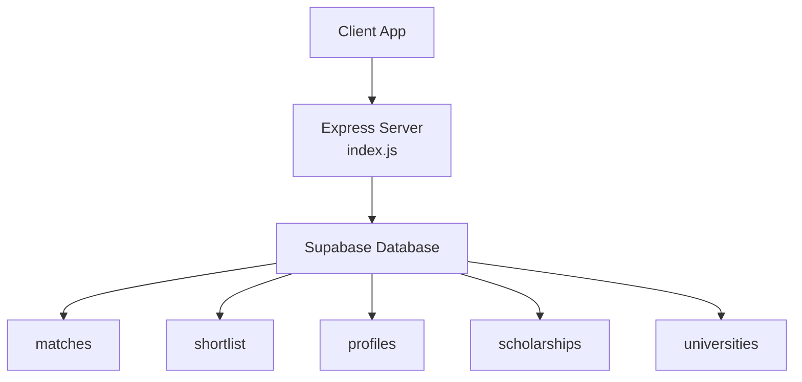
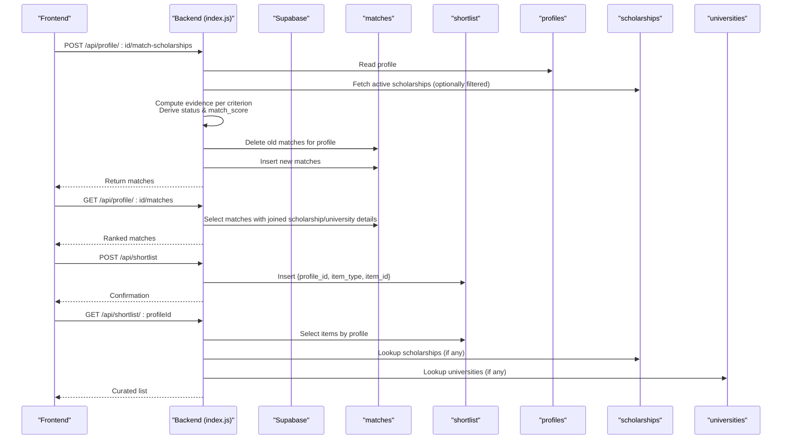
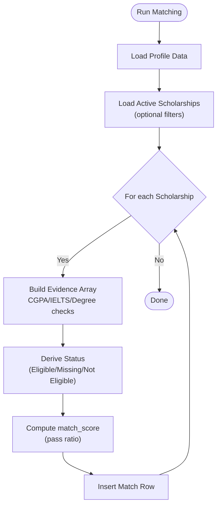
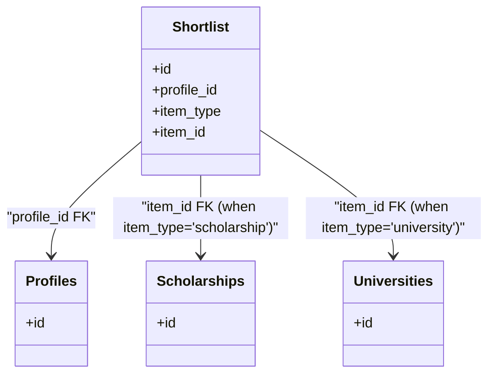
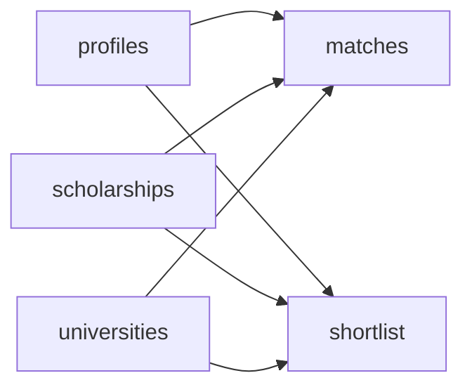

# Relationship Tables

<cite>
**Referenced Files in This Document**
- [index.js](file://aischolarpath-backend-main/aischolarpath-backend-main/index.js)
</cite>

## Table of Contents
1. [Introduction](#introduction)
2. [Project Structure](#project-structure)
3. [Core Components](#core-components)
4. [Architecture Overview](#architecture-overview)
5. [Detailed Component Analysis](#detailed-component-analysis)
6. [Dependency Analysis](#dependency-analysis)
7. [Performance Considerations](#performance-considerations)
8. [Troubleshooting Guide](#troubleshooting-guide)
9. [Conclusion](#conclusion)

## Introduction
This document explains the relationship and junction tables used by ScholarPathAI to support many-to-many relationships between profiles, scholarships, and universities. It focuses on:
- The matches table that records how well a profile aligns with each scholarship, including match scores, eligibility status, and criterion-by-criterion evidence arrays.
- The shortlist table that allows users to curate preferred scholarships and universities using an item_type discriminator.
- How these tables enable matching algorithm functionality and related queries across the application.

## Project Structure
The backend is implemented as a single Express application that interacts with Supabase. All database interactions for the relationship tables are defined within the main server file.

**Diagram sources**
- [index.js:50-68](file://aischolarpath-backend-main/aischolarpath-backend-main/index.js#L50-L68)
- [index.js:574-672](file://aischolarpath-backend-main/aischolarpath-backend-main/index.js#L574-L672)
- [index.js:675-692](file://aischolarpath-backend-main/aischolarpath-backend-main/index.js#L675-L692)
- [index.js:750-820](file://aischolarpath-backend-main/aischolarpath-backend-main/index.js#L750-L820)

**Section sources**
- [index.js:50-68](file://aischolarpath-backend-main/aischolarpath-backend-main/index.js#L50-L68)

## Core Components
- matches: A junction table linking profiles to scholarships with computed match_score, eligibility status, and detailed evidence per criterion.
- shortlist: A user-curated list of items (scholarships or universities) identified by item_type and item_id.

Key behaviors observed in the codebase:
- Matching computation populates matches with per-criterion evidence and derives overall status and score.
- Shortlist supports adding/removing items and retrieving them grouped by type.

**Section sources**
- [index.js:574-672](file://aischolarpath-backend-main/aischolarpath-backend-main/index.js#L574-L672)
- [index.js:675-692](file://aischolarpath-backend-main/aischolarpath-backend-main/index.js#L675-L692)
- [index.js:750-820](file://aischolarpath-backend-main/aischolarpath-backend-main/index.js#L750-L820)

## Architecture Overview
The matching workflow uses the matches table to persist evaluation results for each profile-scholarship pair. The shortlist table enables curation of preferred items. Both tables integrate with core entities (profiles, scholarships, universities) via foreign keys.

**Diagram sources**
- [index.js:574-672](file://aischolarpath-backend-main/aischolarpath-backend-main/index.js#L574-L672)
- [index.js:675-692](file://aischolarpath-backend-main/aischolarpath-backend-main/index.js#L675-L692)
- [index.js:750-820](file://aischolarpath-backend-main/aischolarpath-backend-main/index.js#L750-L820)

## Detailed Component Analysis

### Matches Table
Purpose:
- Records the outcome of running the matching algorithm for a given profile against one or more scholarships.
- Stores a numeric match_score, an eligibility status, and an evidence array detailing criterion-by-criterion evaluation.

Observed fields and behavior:
- Foreign keys:
  - profile_id references profiles.id
  - scholarship_id references scholarships.id
  - university_id references universities.id (inherited from the matched scholarship)
- Derived fields:
  - match_score: percentage based on pass ratio across evaluated criteria
  - status: derived from evidence (e.g., Eligible, Missing Requirements, Not Eligible)
  - evidence: array of objects describing each criterion checked (e.g., CGPA, IELTS, Degree), including required threshold, actual value, and result (Pass/Fail/Missing)

Matching algorithm highlights:
- Evaluates criteria such as minimum CGPA, minimum IELTS, and required degree when present in scholarship eligibility_criteria.
- Computes per-criterion evidence and aggregates into an overall status and score.
- Clears previous matches for the profile before inserting fresh results to ensure consistency.

Common query patterns:
- Retrieve all matches for a profile, ordered by match_score descending, with joins to scholarships and universities for display.
- Aggregate overview metrics (counts by status, top recommendations, unique universities).

**Diagram sources**
- [index.js:574-672](file://aischolarpath-backend-main/aischolarpath-backend-main/index.js#L574-L672)

**Section sources**
- [index.js:574-672](file://aischolarpath-backend-main/aischolarpath-backend-main/index.js#L574-L672)
- [index.js:675-692](file://aischolarpath-backend-main/aischolarpath-backend-main/index.js#L675-L692)
- [index.js:694-749](file://aischolarpath-backend-main/aischolarpath-backend-main/index.js#L694-L749)

### Shortlist Table
Purpose:
- Allows users to curate preferred scholarships and universities.
- Uses item_type to differentiate between scholarship and university entries, enabling a flexible many-to-one relationship from shortlist to either entity.

Observed fields and behavior:
- Foreign keys:
  - profile_id references profiles.id
  - item_id references the primary key of the target entity (scholarships.id or universities.id)
- Discriminator:
  - item_type: restricted to 'scholarship' or 'university' at the API layer

Operations:
- Add item: validates presence of profile_id, item_type, item_id; enforces allowed item_type values; inserts row.
- Remove item: deletes by shortlist id.
- Get items: retrieves all shortlisted items for a profile; fetches full details for scholarships and universities separately based on item_type.

**Diagram sources**
- [index.js:750-820](file://aischolarpath-backend-main/aischolarpath-backend-main/index.js#L750-L820)

**Section sources**
- [index.js:750-820](file://aischolarpath-backend-main/aischolarpath-backend-main/index.js#L750-L820)

### Many-to-Many Relationships Enabled
- Profiles to Scholarships:
  - Implemented via matches, which connects multiple profiles to multiple scholarships while capturing evaluation metadata (score, status, evidence).
- Profiles to Universities:
  - Achieved indirectly through matches (via university_id from the matched scholarship) and directly via shortlist (when item_type='university').

These designs allow:
- Storing rich evaluation outcomes per profile-scholarship pair without duplicating logic.
- Supporting user curation across both scholarships and universities with a unified interface.

**Section sources**
- [index.js:574-672](file://aischolarpath-backend-main/aischolarpath-backend-main/index.js#L574-L672)
- [index.js:675-692](file://aischolarpath-backend-main/aischolarpath-backend-main/index.js#L675-L692)
- [index.js:750-820](file://aischolarpath-backend-main/aischolarpath-backend-main/index.js#L750-L820)

## Dependency Analysis
Relationships and dependencies among tables:
- matches depends on:
  - profiles (profile_id)
  - scholarships (scholarship_id)
  - universities (university_id)
- shortlist depends on:
  - profiles (profile_id)
  - scholarships or universities (item_id), discriminated by item_type

Query patterns used throughout the application:
- Filtering matches by profile_id and ordering by match_score.
- Joining matches with scholarships and universities to render UI.
- Aggregating match statuses for dashboard summaries.
- Grouping shortlist items by item_type and fetching corresponding details.

**Diagram sources**
- [index.js:574-672](file://aischolarpath-backend-main/aischolarpath-backend-main/index.js#L574-L672)
- [index.js:675-692](file://aischolarpath-backend-main/aischolarpath-backend-main/index.js#L675-L692)
- [index.js:750-820](file://aischolarpath-backend-main/aischolarpath-backend-main/index.js#L750-L820)

**Section sources**
- [index.js:574-672](file://aischolarpath-backend-main/aischolarpath-backend-main/index.js#L574-L672)
- [index.js:675-692](file://aischolarpath-backend-main/aischolarpath-backend-main/index.js#L675-L692)
- [index.js:750-820](file://aischolarpath-backend-main/aischolarpath-backend-main/index.js#L750-L820)

## Performance Considerations
- Clearing and re-inserting matches per run ensures consistent state but may be costly if executed frequently; consider batching or incremental updates where appropriate.
- Ordering matches by match_score and joining related entities can be optimized with indexes on profile_id, match_score, and foreign keys.
- Shortlist retrieval performs separate lookups for scholarships and universities; consider preloading or batched queries for large lists.

[No sources needed since this section provides general guidance]

## Troubleshooting Guide
Common issues and resolutions:
- Authorization errors:
  - Ensure the authenticated user’s ID matches the requested profile_id for protected endpoints.
- Validation errors:
  - Shortlist insertion requires valid item_type ('scholarship' or 'university') and non-null item_id.
- Data integrity:
  - If matches appear inconsistent, verify that the matching endpoint clears prior matches before inserting new ones.

Operational notes:
- Error responses include success flags and error messages; inspect server logs for detailed stack traces when unhandled exceptions occur.

**Section sources**
- [index.js:750-820](file://aischolarpath-backend-main/aischolarpath-backend-main/index.js#L750-L820)
- [index.js:574-672](file://aischolarpath-backend-main/aischolarpath-backend-main/index.js#L574-L672)

## Conclusion
The matches and shortlist tables form the backbone of ScholarPathAI’s relationship modeling:
- matches captures detailed, criterion-level evaluations between profiles and scholarships, enabling transparent scoring and eligibility determination.
- shortlist provides a flexible curation mechanism for both scholarships and universities via item_type discrimination.
Together, they support robust many-to-many relationships and power the matching algorithm workflows exposed through the API.

[No sources needed since this section summarizes without analyzing specific files]