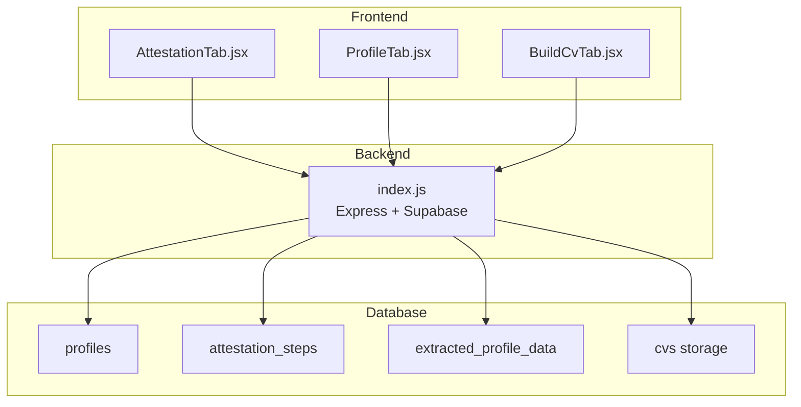
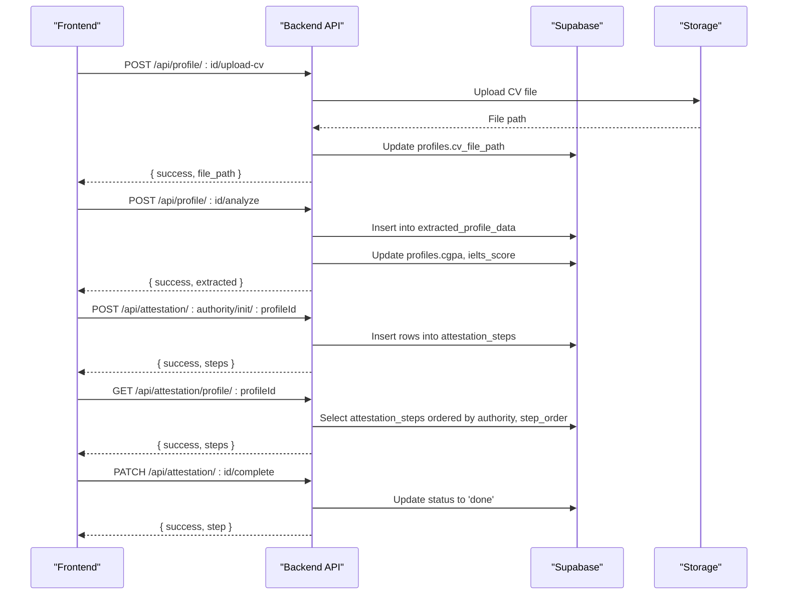
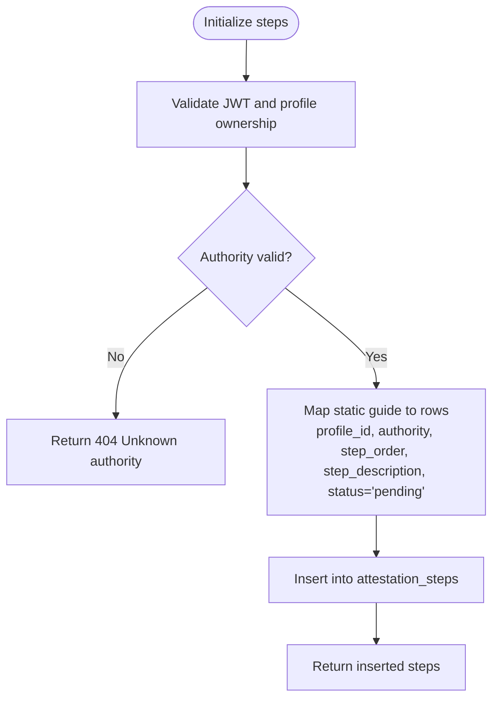
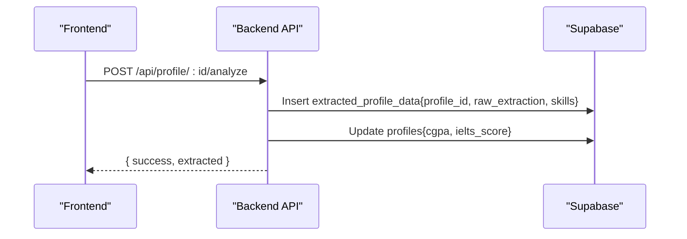
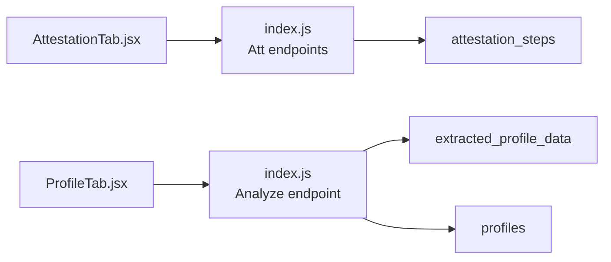

# Workflow Tables

<cite>
**Referenced Files in This Document**
- [index.js](file://aischolarpath-backend-main/aischolarpath-backend-main/index.js)
- [AttestationTab.jsx](file://scholarpath-frontend (2)/scholarpath/src/pages/AttestationTab.jsx)
- [ProfileTab.jsx](file://scholarpath-frontend (2)/scholarpath/src/pages/ProfileTab.jsx)
- [BuildCvTab.jsx](file://scholarpath-frontend (2)/scholarpath/src/pages/BuildCvTab.jsx)
- [mockData.js](file://scholarpath-frontend (2)/scholarpath/src/data/mockData.js)
</cite>

## Table of Contents
1. [Introduction](#introduction)
2. [Project Structure](#project-structure)
3. [Core Components](#core-components)
4. [Architecture Overview](#architecture-overview)
5. [Detailed Component Analysis](#detailed-component-analysis)
6. [Dependency Analysis](#dependency-analysis)
7. [Performance Considerations](#performance-considerations)
8. [Troubleshooting Guide](#troubleshooting-guide)
9. [Conclusion](#conclusion)

## Introduction
This document explains how ScholarPathAI tracks workflow and process state using two key database tables:
- attestation_steps: Tracks a user’s progress through official document verification steps for HEC, IBCC, and MOFA authorities.
- extracted_profile_data: Stores AI-extracted information from CV uploads, including raw extraction data and structured skills arrays.

These tables underpin the application’s workflow features by persisting step-level progress and enabling profile enrichment via CV analysis. The backend exposes REST endpoints to initialize, query, and update attestation steps, and to analyze uploaded CVs and store extracted data.

## Project Structure
The relevant implementation spans the backend API and frontend pages:
- Backend: Express server with Supabase integration handles authentication, file upload, CV analysis, and attestation workflow operations.
- Frontend: React pages provide UI for selecting attestation authorities, viewing steps, uploading documents, and triggering analysis.

**Diagram sources**
- [index.js:112-188](file://aischolarpath-backend-main/aischolarpath-backend-main/index.js#L112-L188)
- [index.js:426-517](file://aischolarpath-backend-main/aischolarpath-backend-main/index.js#L426-L517)
- [AttestationTab.jsx:1-73](file://scholarpath-frontend (2)/scholarpath/src/pages/AttestationTab.jsx#L1-L73)
- [ProfileTab.jsx:88-143](file://scholarpath-frontend (2)/scholarpath/src/pages/ProfileTab.jsx#L88-L143)
- [BuildCvTab.jsx:54-193](file://scholarpath-frontend (2)/scholarpath/src/pages/BuildCvTab.jsx#L54-L193)

**Section sources**
- [index.js:112-188](file://aischolarpath-backend-main/aischolarpath-backend-main/index.js#L112-L188)
- [index.js:426-517](file://aischolarpath-backend-main/aischolarpath-backend-main/index.js#L426-L517)
- [AttestationTab.jsx:1-73](file://scholarpath-frontend (2)/scholarpath/src/pages/AttestationTab.jsx#L1-L73)
- [ProfileTab.jsx:88-143](file://scholarpath-frontend (2)/scholarpath/src/pages/ProfileTab.jsx#L88-L143)
- [BuildCvTab.jsx:54-193](file://scholarpath-frontend (2)/scholarpath/src/pages/BuildCvTab.jsx#L54-L193)

## Core Components
- Attestation workflow:
  - Authority selection and guidance are provided in the frontend; backend initializes tracked steps per authority and supports querying and completion updates.
  - Steps include ordering and descriptions derived from static guides for HEC, IBCC, and MOFA.
- CV analysis and profile enrichment:
  - Users can upload a CV; the backend stores the file and inserts extracted data into extracted_profile_data, then updates profile fields such as CGPA and IELTS score.

Key responsibilities:
- Attestation steps table: Persist step_order, step_description, status transitions, and authority context per profile.
- Extracted profile data table: Store raw_extraction JSON and skills array for later use in matching or display.

**Section sources**
- [index.js:404-424](file://aischolarpath-backend-main/aischolarpath-backend-main/index.js#L404-L424)
- [index.js:437-517](file://aischolarpath-backend-main/aischolarpath-backend-main/index.js#L437-L517)
- [index.js:112-188](file://aischolarpath-backend-main/aischolarpath-backend-main/index.js#L112-L188)
- [mockData.js:256-309](file://scholarpath-frontend (2)/scholarpath/src/data/mockData.js#L256-L309)

## Architecture Overview
The workflow integrates frontend interactions with backend APIs that manage database state for both attestation tracking and CV extraction.

**Diagram sources**
- [index.js:112-188](file://aischolarpath-backend-main/aischolarpath-backend-main/index.js#L112-L188)
- [index.js:437-517](file://aischolarpath-backend-main/aischolarpath-backend-main/index.js#L437-L517)

## Detailed Component Analysis

### attestation_steps table
Purpose:
- Track per-profile, per-authority document verification progress with explicit step ordering and human-readable descriptions.
- Maintain a simple status field to reflect completion.

Schema characteristics inferred from usage:
- profile_id: Associates steps with a specific user profile.
- authority: Enumerated values HEC, IBCC, MOFA.
- step_order: Integer indicating sequence within an authority’s guide.
- step_description: Text describing the action required at this step.
- status: String with allowed values pending and done.

Initialization flow:
- The backend maps static authority guides to rows and inserts them into attestation_steps with initial status pending.

Query and update flows:
- Retrieve all steps for a profile, ordered by authority and step_order.
- Mark individual steps as done after validation of ownership.

Validation and security:
- Authorization middleware ensures only the owning profile can initialize, query, or complete steps.
- Authority is validated against known guides before initialization.

Status transitions:
- Initial state: pending.
- Transition: pending → done via completion endpoint. No other transitions are implemented.

Integration points:
- Frontend AttestationTab displays authority options and steps; backend provides dynamic step lists and completion updates.
- Guides are defined statically in the backend and mirrored conceptually in frontend mock data for UI guidance.

**Diagram sources**
- [index.js:437-464](file://aischolarpath-backend-main/aischolarpath-backend-main/index.js#L437-L464)
- [index.js:404-424](file://aischolarpath-backend-main/aischolarpath-backend-main/index.js#L404-L424)

**Section sources**
- [index.js:404-424](file://aischolarpath-backend-main/aischolarpath-backend-main/index.js#L404-L424)
- [index.js:437-517](file://aischolarpath-backend-main/aischolarpath-backend-main/index.js#L437-L517)
- [AttestationTab.jsx:1-73](file://scholarpath-frontend (2)/scholarpath/src/pages/AttestationTab.jsx#L1-L73)
- [mockData.js:256-309](file://scholarpath-frontend (2)/scholarpath/src/data/mockData.js#L256-L309)

### extracted_profile_data table
Purpose:
- Store AI-extracted information from CV uploads, preserving both raw extraction payloads and structured skills arrays for downstream features like matching or display.

Schema characteristics inferred from usage:
- profile_id: Associates extracted data with a specific user profile.
- raw_extraction: JSON object containing parsed fields from the CV (e.g., cgpa, ielts_score, degree_level, department).
- skills: Array of strings representing extracted skills.

Processing flow:
- After CV upload, the analyze endpoint inserts a record into extracted_profile_data with the raw extraction and skills.
- It also updates the profile’s cgpa and ielts_score fields based on extracted values.

Validation and security:
- Authorization middleware ensures only the owning profile can trigger analysis.
- Current implementation uses mock extraction data; future integration should validate and sanitize extracted fields before insertion.

Integration points:
- ProfileTab allows users to upload a CV and trigger analysis; the backend persists results and updates profile fields.
- BuildCvTab provides CV creation tools and conversion utilities but does not directly interact with extracted_profile_data.

**Diagram sources**
- [index.js:147-188](file://aischolarpath-backend-main/aischolarpath-backend-main/index.js#L147-L188)

**Section sources**
- [index.js:112-188](file://aischolarpath-backend-main/aischolarpath-backend-main/index.js#L112-L188)
- [ProfileTab.jsx:88-143](file://scholarpath-frontend (2)/scholarpath/src/pages/ProfileTab.jsx#L88-L143)
- [BuildCvTab.jsx:54-193](file://scholarpath-frontend (2)/scholarpath/src/pages/BuildCvTab.jsx#L54-L193)

## Dependency Analysis
Component coupling and relationships:
- Frontend pages depend on backend endpoints for attestation workflows and CV analysis.
- Backend depends on Supabase for persistent state across profiles, attestation steps, and extracted data.
- Static authority guides in the backend drive step initialization; frontend mock data mirrors these for UI presentation.

External dependencies:
- Supabase client for database and storage operations.
- JWT-based authentication middleware protects endpoints.

Potential circular dependencies:
- None observed; frontend calls backend, backend reads/writes to database without calling back to frontend.

**Diagram sources**
- [index.js:112-188](file://aischolarpath-backend-main/aischolarpath-backend-main/index.js#L112-L188)
- [index.js:437-517](file://aischolarpath-backend-main/aischolarpath-backend-main/index.js#L437-L517)
- [AttestationTab.jsx:1-73](file://scholarpath-frontend (2)/scholarpath/src/pages/AttestationTab.jsx#L1-L73)
- [ProfileTab.jsx:88-143](file://scholarpath-frontend (2)/scholarpath/src/pages/ProfileTab.jsx#L88-L143)

**Section sources**
- [index.js:112-188](file://aischolarpath-backend-main/aischolarpath-backend-main/index.js#L112-L188)
- [index.js:437-517](file://aischolarpath-backend-main/aischolarpath-backend-main/index.js#L437-L517)
- [AttestationTab.jsx:1-73](file://scholarpath-frontend (2)/scholarpath/src/pages/AttestationTab.jsx#L1-L73)
- [ProfileTab.jsx:88-143](file://scholarpath-frontend (2)/scholarpath/src/pages/ProfileTab.jsx#L88-L143)

## Performance Considerations
- Batch insertions: Attestation initialization inserts multiple rows per authority; ensure efficient batch operations and appropriate indexing on profile_id and authority for fast queries.
- Ordering: Queries order by authority and step_order; consider composite indexes to optimize retrieval performance.
- Storage: CV uploads are stored in Supabase storage; ensure size limits and content type validation to prevent large or malicious files.
- Extraction: Current mock extraction avoids heavy processing; when integrating real AI extraction, implement asynchronous processing and caching to reduce latency.

[No sources needed since this section provides general guidance]

## Troubleshooting Guide
Common issues and resolutions:
- Authentication failures:
  - Ensure JWT token is present and valid; unauthorized requests return 401 or 403.
- Unknown authority:
  - Initialization requires a supported authority (HEC, IBCC, MOFA); invalid values return 404.
- Step not found:
  - Completion endpoint returns 404 if the step ID does not exist.
- Database errors:
  - Any Supabase operation error is propagated; inspect error messages returned by the backend.

Operational checks:
- Health endpoint confirms server status.
- Test DB endpoint verifies Supabase connectivity.

**Section sources**
- [index.js:32-47](file://aischolarpath-backend-main/aischolarpath-backend-main/index.js#L32-L47)
- [index.js:57-68](file://aischolarpath-backend-main/aischolarpath-backend-main/index.js#L57-L68)
- [index.js:426-517](file://aischolarpath-backend-main/aischolarpath-backend-main/index.js#L426-L517)

## Conclusion
The attestation_steps and extracted_profile_data tables form the backbone of ScholarPathAI’s workflow management:
- attestation_steps enables precise tracking of document verification progress across HEC, IBCC, and MOFA authorities, supporting clear state transitions and user guidance.
- extracted_profile_data captures AI-derived insights from CVs, enriching user profiles and enabling downstream matching and recommendations.

Together, these tables integrate frontend interactions with backend logic and persistent storage to deliver a cohesive, trackable application experience. Future enhancements may include richer validation, asynchronous extraction pipelines, and expanded status modeling to support more complex workflows.