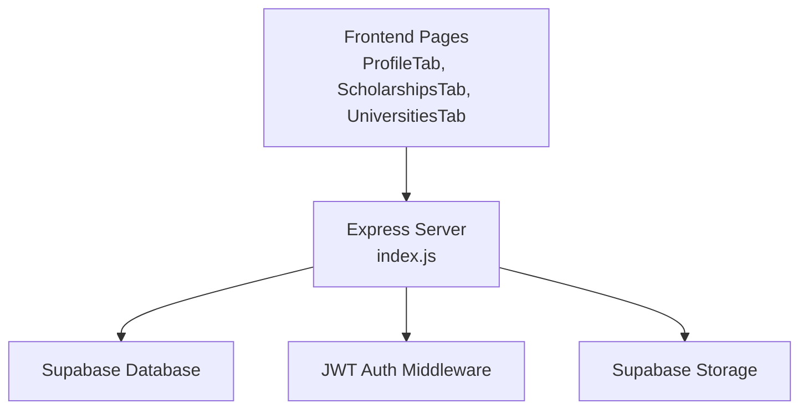
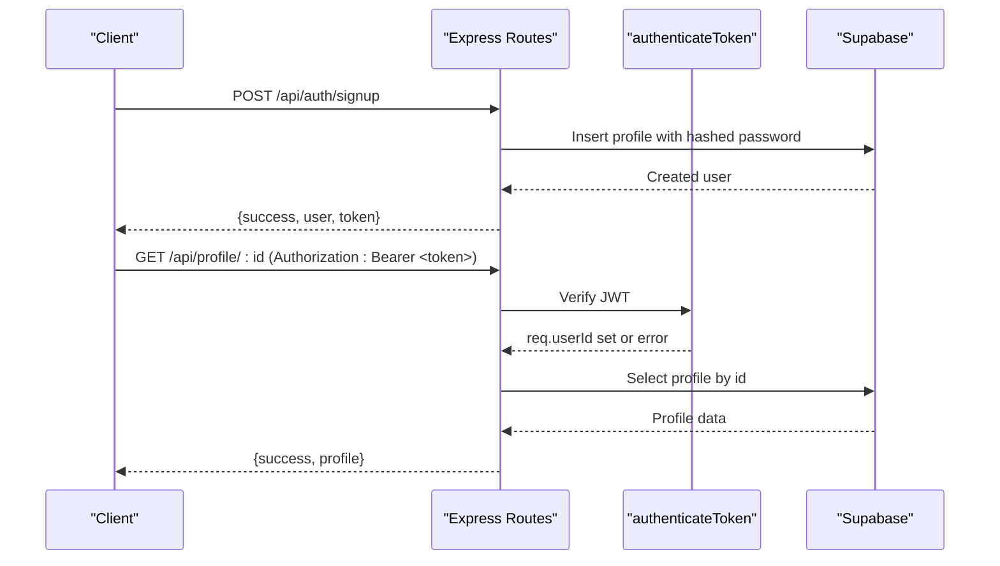
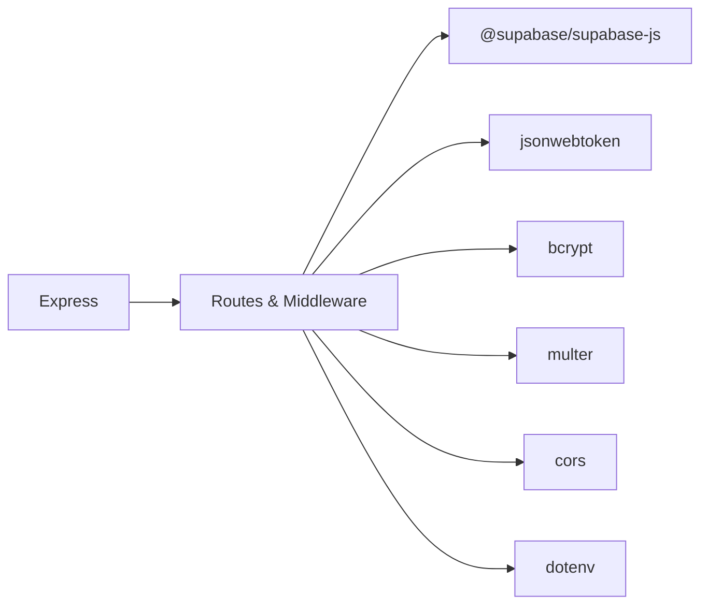

# CRUD Operations

<cite>
**Referenced Files in This Document**
- [index.js](file://aischolarpath-backend-main/aischolarpath-backend-main/index.js)
- [package.json](file://aischolarpath-backend-main/aischolarpath-backend-main/package.json)
- [AuthModal.jsx](file://scholarpath-frontend (2)/scholarpath/src/components/AuthModal.jsx)
- [ProfileTab.jsx](file://scholarpath-frontend (2)/scholarpath/src/pages/ProfileTab.jsx)
- [ScholarshipsTab.jsx](file://scholarpath-frontend (2)/scholarpath/src/pages/ScholarshipsTab.jsx)
- [UniversitiesTab.jsx](file://scholarpath-frontend (2)/scholarpath/src/pages/UniversitiesTab.jsx)
</cite>

## Table of Contents
1. Introduction
2. Project Structure
3. Core Components
4. Architecture Overview
5. Detailed Component Analysis
6. Dependency Analysis
7. Performance Considerations
8. Troubleshooting Guide
9. Conclusion

## Introduction
This document explains the CRUD operations implemented in ScholarPathAI, focusing on:
- Profile management: user registration, login, profile updates, and data retrieval
- Scholarship and university CRUD with filtering capabilities
- Authentication middleware integration using JWT
- Error handling patterns and response formatting
- Security considerations for each endpoint
- Request/response examples for each operation type

The backend is an Express server that persists data to Supabase and secures sensitive endpoints with a JWT-based authentication middleware. The frontend currently uses mock data for UI flows but integrates with the backend through defined API routes.

## Project Structure
- Backend: Single-file Express application defining all routes, middleware, and database interactions.
- Frontend: React components and pages for authentication modal, profile editing, scholarships, and universities tabs.

**Diagram sources**
- [index.js:29-54](file://aischolarpath-backend-main/aischolarpath-backend-main/index.js#L29-L54)
- [index.js:32-47](file://aischolarpath-backend-main/aischolarpath-backend-main/index.js#L32-L47)

**Section sources**
- [index.js:1-54](file://aischolarpath-backend-main/aischolarpath-backend-main/index.js#L1-L54)
- [package.json:1-14](file://aischolarpath-backend-main/aischolarpath-backend-main/package.json#L1-L14)

## Core Components
- Authentication middleware: Validates JWT from Authorization header and attaches userId to request.
- Profile endpoints: Update profile, get profile by id, upload CV, analyze CV, run matching, get matches, overview.
- Scholarship endpoints: List with filters, get single scholarship.
- University endpoints: List with filters, get single university.
- Application endpoints: Create, update, list, delete applications.
- Notifications endpoints: Create, list, mark read, deadline checks.
- Discovery/scraping endpoints: Scrape and structure scholarship/university data.
- Password recovery: Forgot password and reset password.

**Section sources**
- [index.js:32-47](file://aischolarpath-backend-main/aischolarpath-backend-main/index.js#L32-L47)
- [index.js:70-110](file://aischolarpath-backend-main/aischolarpath-backend-main/index.js#L70-L110)
- [index.js:112-188](file://aischolarpath-backend-main/aischolarpath-backend-main/index.js#L112-L188)
- [index.js:190-222](file://aischolarpath-backend-main/aischolarpath-backend-main/index.js#L190-L222)
- [index.js:224-288](file://aischolarpath-backend-main/aischolarpath-backend-main/index.js#L224-L288)
- [index.js:822-932](file://aischolarpath-backend-main/aischolarpath-backend-main/index.js#L822-L932)
- [index.js:983-1051](file://aischolarpath-backend-main/aischolarpath-backend-main/index.js#L983-L1051)
- [index.js:1183-1493](file://aischolarpath-backend-main/aischolarpath-backend-main/index.js#L1183-L1493)
- [index.js:1102-1181](file://aischolarpath-backend-main/aischolarpath-backend-main/index.js#L1102-L1181)

## Architecture Overview
The system follows a typical client-server architecture:
- Frontend pages render forms and lists, calling backend APIs.
- Backend validates requests, enforces authorization via JWT middleware, and interacts with Supabase for data persistence and storage.
- Responses are consistently formatted with success flags and error messages.

**Diagram sources**
- [index.js:519-540](file://aischolarpath-backend-main/aischolarpath-backend-main/index.js#L519-L540)
- [index.js:543-573](file://aischolarpath-backend-main/aischolarpath-backend-main/index.js#L543-L573)
- [index.js:32-47](file://aischolarpath-backend-main/aischolarpath-backend-main/index.js#L32-L47)
- [index.js:94-110](file://aischolarpath-backend-main/aischolarpath-backend-main/index.js#L94-L110)

## Detailed Component Analysis

### Authentication Endpoints
- Signup: Creates a new profile with a hashed password and returns a JWT token.
- Login: Verifies credentials, issues a JWT token.
- Forgot password: Generates a time-bound reset token stored in profiles.
- Reset password: Validates reset token and updates password.

Security considerations:
- Passwords are hashed before storage.
- Tokens have expiration; reset tokens are short-lived.
- Sensitive fields (password_hash) are not returned in responses.

Example requests/responses:
- POST /api/auth/signup
  - Request body: full_name, email, password
  - Response: { success: true, user: { id, full_name, email }, token }
- POST /api/auth/login
  - Request body: email, password
  - Response: { success: true, user: { id, full_name, email }, token }
- POST /api/auth/forgot-password
  - Request body: email
  - Response: { success: true, message: "...", reset_token: "..." }
- POST /api/auth/reset-password
  - Request body: reset_token, new_password
  - Response: { success: true, message: "Password has been reset successfully" }

**Section sources**
- [index.js:519-540](file://aischolarpath-backend-main/aischolarpath-backend-main/index.js#L519-L540)
- [index.js:543-573](file://aischolarpath-backend-main/aischolarpath-backend-main/index.js#L543-L573)
- [index.js:1102-1181](file://aischolarpath-backend-main/aischolarpath-backend-main/index.js#L1102-L1181)

### Profile Management CRUD
- Update profile: PATCH /api/profile
  - Requires JWT; updates only provided fields for the authenticated user.
  - Response: { success: true, profile: {...} }
- Get profile: GET /api/profile/:id
  - Requires JWT; ensures requester owns the profile.
  - Response: { success: true, profile: {...} }
- Upload CV: POST /api/profile/:id/upload-cv
  - Requires JWT; uploads file to storage and updates cv_file_path.
  - Response: { success: true, file_path: "..." }
- Analyze CV: POST /api/profile/:id/analyze
  - Requires JWT; stores extracted data and updates profile fields.
  - Response: { success: true, extracted: {...} }

Security considerations:
- All profile endpoints enforce ownership via JWT-decoded userId.
- File uploads use memory storage; ensure size limits and content-type validation are enforced at deployment.

Example requests/responses:
- PATCH /api/profile
  - Headers: Authorization: Bearer <token>
  - Request body: { full_name?, cgpa?, ielts_score?, target_country?, target_degree?, target_department? }
  - Response: { success: true, profile: {...} }
- GET /api/profile/:id
  - Headers: Authorization: Bearer <token>
  - Response: { success: true, profile: {...} }
- POST /api/profile/:id/upload-cv
  - Headers: Authorization: Bearer <token>, Content-Type: multipart/form-data
  - Form field: cv (file)
  - Response: { success: true, file_path: "..." }
- POST /api/profile/:id/analyze
  - Headers: Authorization: Bearer <token>
  - Response: { success: true, extracted: {...} }

**Section sources**
- [index.js:70-110](file://aischolarpath-backend-main/aischolarpath-backend-main/index.js#L70-L110)
- [index.js:112-188](file://aischolarpath-backend-main/aischolarpath-backend-main/index.js#L112-L188)

### Scholarship CRUD with Filtering
- List scholarships: GET /api/scholarships
  - Query params: country, scholarship_type, department, degree_level
  - Response: { success: true, scholarships: [...] }
- Get scholarship: GET /api/scholarships/:id
  - Response: { success: true, scholarship: {...} }

Filtering behavior:
- Each query param applies an equality filter if present.
- Joins include university name and portal URL.

Example requests/responses:
- GET /api/scholarships?country=Canada&degree_level=Master’s
  - Response: { success: true, scholarships: [{ id, title, country, eligibility_criteria, ... }] }
- GET /api/scholarships/:id
  - Response: { success: true, scholarship: {...} }

**Section sources**
- [index.js:190-222](file://aischolarpath-backend-main/aischolarpath-backend-main/index.js#L190-L222)

### University CRUD with Filtering
- List universities: GET /api/universities
  - Query params: country, degree_program, search
  - Returns up to 10 results filtered by direct scholarships or country-wide scholarships.
  - Response: { success: true, universities: [...] }
- Get university: GET /api/universities/:id
  - Response: { success: true, university: {...} }

Filtering behavior:
- Country equality, array contains for degree programs, case-insensitive name search.
- Combines direct university scholarships and country-wide scholarships to determine visibility.

Example requests/responses:
- GET /api/universities?country=Germany&degree_program=Computer Science&search=Technical
  - Response: { success: true, universities: [{ id, name, country, degree_programs, ... }] }
- GET /api/universities/:id
  - Response: { success: true, university: {...} }

**Section sources**
- [index.js:224-288](file://aischolarpath-backend-main/aischolarpath-backend-main/index.js#L224-L288)

### Applications CRUD
- Create application: POST /api/applications
  - Requires JWT; creates tracker entry for a scholarship.
  - Response: { success: true, application: {...} }
- Update application: PATCH /api/applications/:id
  - Requires JWT; verifies ownership before updating status/notes.
  - Response: { success: true, application: {...} }
- List applications: GET /api/applications/:profileId
  - Requires JWT; ensures requester owns profile.
  - Response: { success: true, applications: [...] }
- Delete application: DELETE /api/applications/:id
  - Requires JWT; verifies ownership before deletion.
  - Response: { success: true, message: "Application removed from tracker" }

Security considerations:
- Ownership checks prevent cross-user modifications.
- Status transitions are controlled via explicit updates.

Example requests/responses:
- POST /api/applications
  - Headers: Authorization: Bearer <token>
  - Request body: { profile_id, scholarship_id, status?, notes?, next_action?, next_action_date? }
  - Response: { success: true, application: {...} }
- PATCH /api/applications/:id
  - Headers: Authorization: Bearer <token>
  - Request body: { status?, notes?, next_action?, next_action_date? }
  - Response: { success: true, application: {...} }
- GET /api/applications/:profileId
  - Headers: Authorization: Bearer <token>
  - Response: { success: true, applications: [...] }
- DELETE /api/applications/:id
  - Headers: Authorization: Bearer <token>
  - Response: { success: true, message: "Application removed from tracker" }

**Section sources**
- [index.js:822-932](file://aischolarpath-backend-main/aischolarpath-backend-main/index.js#L822-L932)

### Notifications CRUD
- Create notification: POST /api/notifications
  - Requires JWT; inserts notification for a profile.
  - Response: { success: true, notification: {...} }
- List notifications: GET /api/notifications/:profileId
  - Requires JWT; ensures requester owns profile.
  - Response: { success: true, notifications: [...] }
- Mark read: PATCH /api/notifications/:id/read
  - Requires JWT; verifies ownership before marking read.
  - Response: { success: true, notification: {...} }

Security considerations:
- Ownership checks protect per-profile notifications.

Example requests/responses:
- POST /api/notifications
  - Headers: Authorization: Bearer <token>
  - Request body: { profile_id, type, title, message? }
  - Response: { success: true, notification: {...} }
- GET /api/notifications/:profileId
  - Headers: Authorization: Bearer <token>
  - Response: { success: true, notifications: [...] }
- PATCH /api/notifications/:id/read
  - Headers: Authorization: Bearer <token>
  - Response: { success: true, notification: {...} }

**Section sources**
- [index.js:983-1051](file://aischolarpath-backend-main/aischolarpath-backend-main/index.js#L983-L1051)

### Matching and Overview
- Run matching: POST /api/profile/:id/match-scholarships
  - Requires JWT; computes match scores based on profile vs scholarship criteria.
  - Response: { success: true, matches: [...] }
- Get matches: GET /api/profile/:id/matches
  - Requires JWT; returns sorted matches with scholarship details.
  - Response: { success: true, matches: [...] }
- Overview: GET /api/profile/:id/overview
  - Requires JWT; aggregates counts and top recommendations.
  - Response: { success: true, overview: {...} }

Security considerations:
- All endpoints enforce ownership via JWT.

Example requests/responses:
- POST /api/profile/:id/match-scholarships
  - Headers: Authorization: Bearer <token>
  - Response: { success: true, matches: [{ scholarship_id, match_score, status, evidence }] }
- GET /api/profile/:id/matches
  - Headers: Authorization: Bearer <token>
  - Response: { success: true, matches: [...] }
- GET /api/profile/:id/overview
  - Headers: Authorization: Bearer <token>
  - Response: { success: true, overview: { profile_completeness, summary, top_recommendations } }

**Section sources**
- [index.js:575-692](file://aischolarpath-backend-main/aischolarpath-backend-main/index.js#L575-L692)
- [index.js:694-749](file://aischolarpath-backend-main/aischolarpath-backend-main/index.js#L694-L749)

### Error Handling Patterns
- Consistent response shape: { success: boolean, ...data or error }
- HTTP status codes:
  - 400: Missing required fields
  - 401: Invalid or missing credentials/tokens
  - 403: Not authorized (ownership mismatch)
  - 404: Resource not found
  - 500: Server/database errors
- Centralized unhandled error handler returns a generic 500 JSON response.

Example error responses:
- { success: false, error: "No token provided" }
- { success: false, error: "Invalid or expired token" }
- { success: false, error: "Not authorized to view this profile" }
- { success: false, error: "Profile not found" }
- { success: false, error: "Database error message" }

**Section sources**
- [index.js:32-47](file://aischolarpath-backend-main/aischolarpath-backend-main/index.js#L32-L47)
- [index.js:1528-1531](file://aischolarpath-backend-main/aischolarpath-backend-main/index.js#L1528-L1531)

### Security Considerations
- JWT-based authentication protects sensitive endpoints.
- Password hashing prevents plaintext storage.
- Ownership checks ensure users can only access/update their own data.
- Environment variables validate required secrets at startup.
- CORS enabled; consider restricting origins in production.
- File uploads use memory storage; add size/type validation and secure storage policies.

**Section sources**
- [index.js:5-10](file://aischolarpath-backend-main/aischolarpath-backend-main/index.js#L5-L10)
- [index.js:32-47](file://aischolarpath-backend-main/aischolarpath-backend-main/index.js#L32-L47)
- [index.js:519-540](file://aischolarpath-backend-main/aischolarpath-backend-main/index.js#L519-L540)
- [index.js:94-110](file://aischolarpath-backend-main/aischolarpath-backend-main/index.js#L94-L110)

## Dependency Analysis
Key dependencies used for CRUD operations:
- Express: HTTP server and routing
- @supabase/supabase-js: Database and storage client
- bcrypt: Password hashing
- jsonwebtoken: Token issuance and verification
- multer: File upload handling
- cors: Cross-origin requests
- dotenv: Environment variable loading

**Diagram sources**
- [package.json:1-14](file://aischolarpath-backend-main/aischolarpath-backend-main/package.json#L1-L14)
- [index.js:1-27](file://aischolarpath-backend-main/aischolarpath-backend-main/index.js#L1-L27)

**Section sources**
- [package.json:1-14](file://aischolarpath-backend-main/aischolarpath-backend-main/package.json#L1-L14)
- [index.js:1-27](file://aischolarpath-backend-main/aischolarpath-backend-main/index.js#L1-L27)

## Performance Considerations
- Connection pooling: Custom undici agent configured for connection limits and timeouts.
- Query optimization: Use selective selects and filters to reduce payload sizes.
- Pagination: Implement pagination for large lists (e.g., universities, scholarships).
- Rate limiting: Add rate limiting middleware to prevent abuse.
- Caching: Cache static guides and frequent reads where appropriate.
- File uploads: Enforce size limits and virus scanning; store files securely.

[No sources needed since this section provides general guidance]

## Troubleshooting Guide
Common issues and resolutions:
- Missing environment variables: Ensure SUPABASE_URL, SUPABASE_KEY, JWT_SECRET are set.
- Authentication failures: Check Authorization header format and token validity.
- Database errors: Inspect Supabase client errors and adjust queries.
- File upload failures: Validate file presence and MIME types; check storage permissions.
- Unauthorized access: Verify ownership checks and JWT decoding.

**Section sources**
- [index.js:5-10](file://aischolarpath-backend-main/aischolarpath-backend-main/index.js#L5-L10)
- [index.js:32-47](file://aischolarpath-backend-main/aischolarpath-backend-main/index.js#L32-L47)
- [index.js:1528-1531](file://aischolarpath-backend-main/aischolarpath-backend-main/index.js#L1528-L1531)

## Conclusion
ScholarPathAI implements comprehensive CRUD operations for profiles, scholarships, universities, applications, and notifications, secured by JWT authentication and consistent error handling. The backend leverages Supabase for data persistence and storage, while the frontend provides interactive UIs. For production readiness, enhance security with origin restrictions, input validation, rate limiting, and robust file handling.

[No sources needed since this section summarizes without analyzing specific files]