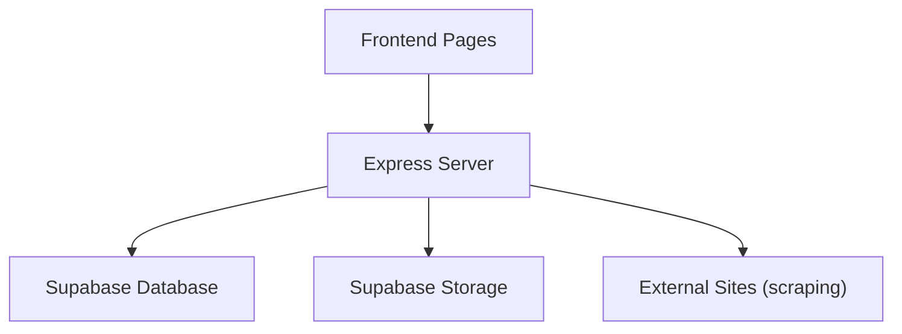
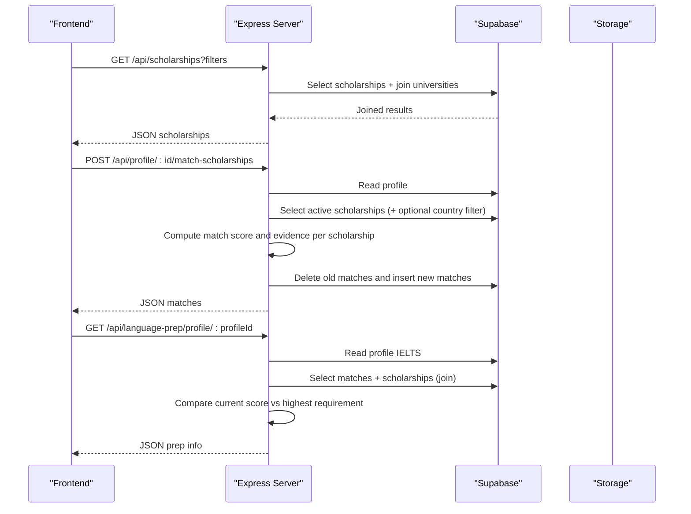
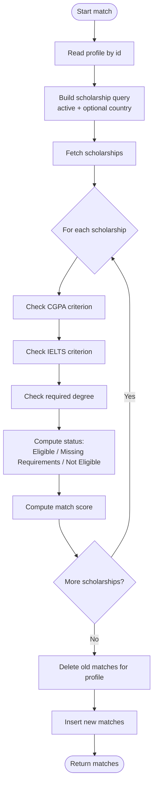
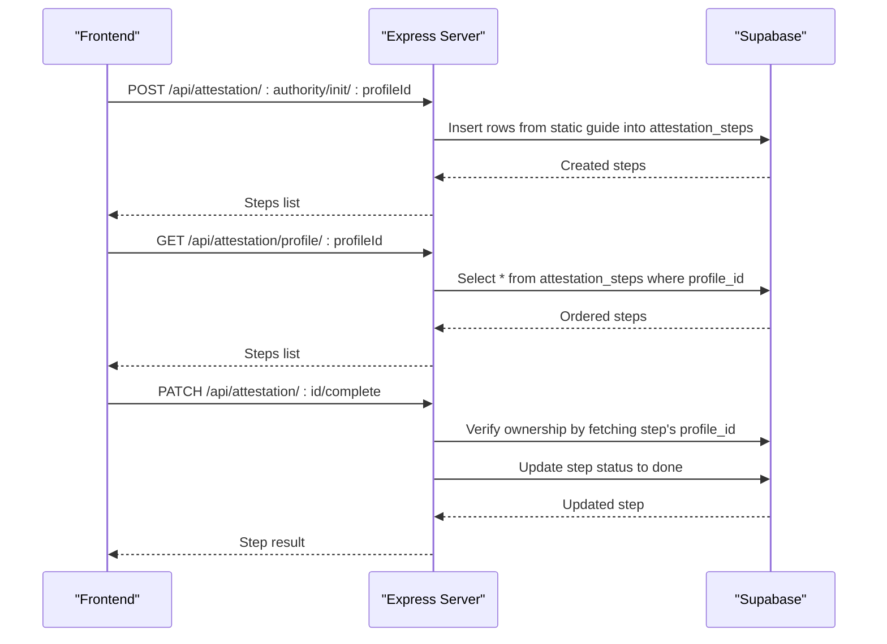
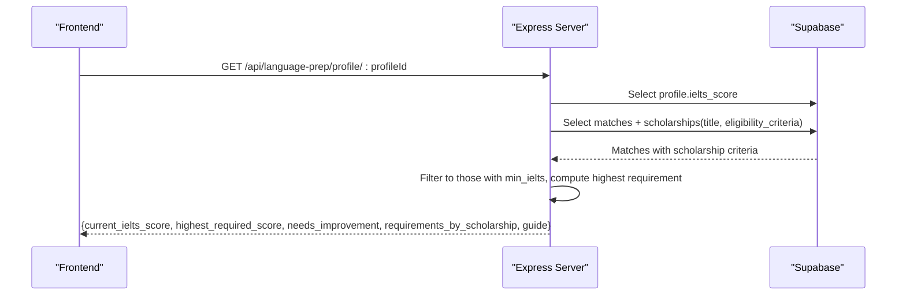
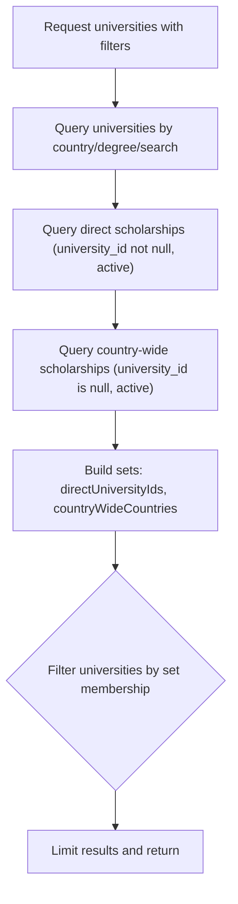
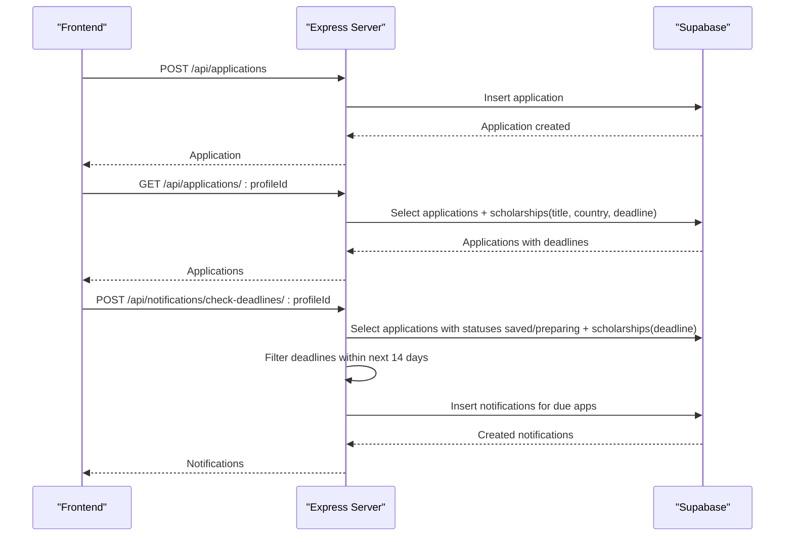
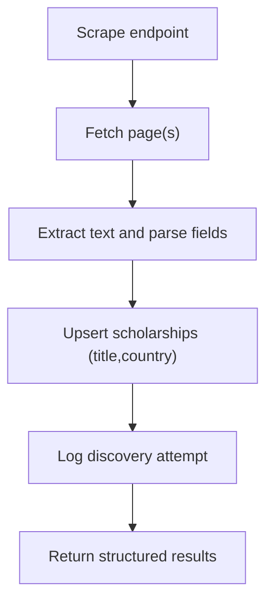
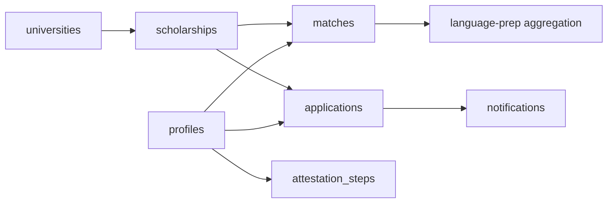

# Complex Queries and Joins

<cite>
**Referenced Files in This Document**
- [index.js](file://aischolarpath-backend-main/aischolarpath-backend-main/index.js)
- [ScholarshipsTab.jsx](file://scholarpath-frontend (2)/scholarpath/src/pages/ScholarshipsTab.jsx)
- [AttestationTab.jsx](file://scholarpath-frontend (2)/scholarpath/src/pages/AttestationTab.jsx)
- [mockData.js](file://scholarpath-frontend (2)/scholarpath/src/data/mockData.js)
</cite>

## Table of Contents
1. Introduction
2. Project Structure
3. Core Components
4. Architecture Overview
5. Detailed Component Analysis
6. Dependency Analysis
7. Performance Considerations
8. Troubleshooting Guide
9. Conclusion

## Introduction
This document explains the complex database queries and joins used by ScholarPathAI to:
- Match student profiles with scholarships and universities
- Track attestation step progress across authorities
- Prepare language test readiness by comparing student scores with scholarship requirements

It focuses on how the backend uses Supabase queries, how data is joined or aggregated, and how errors are handled. It also provides optimization guidance for performance at scale.

## Project Structure
The backend is a single Express server that exposes REST endpoints and performs all database operations via Supabase. The frontend contains pages that demonstrate UI flows; the actual live behavior depends on calling the backend APIs.

**Diagram sources**
- [index.js:1-55](file://aischolarpath-backend-main/aischolarpath-backend-main/index.js#L1-L55)
- [index.js:1182-1493](file://aischolarpath-backend-main/aischolarpath-backend-main/index.js#L1182-L1493)

**Section sources**
- [index.js:1-55](file://aischolarpath-backend-main/aischolarpath-backend-main/index.js#L1-L55)

## Core Components
Key backend components involved in complex queries and joins:
- Profile management and matching
- Scholarship listing and retrieval with university joins
- University listing with combined logic for direct and country-wide scholarships
- Language preparation scoring against matched scholarships
- Attestation workflow tracking per authority
- Applications and notifications with deadline checks
- Discovery/scraping pipelines that upsert scholarships

**Section sources**
- [index.js:50-110](file://aischolarpath-backend-main/aischolarpath-backend-main/index.js#L50-L110)
- [index.js:189-222](file://aischolarpath-backend-main/aischolarpath-backend-main/index.js#L189-L222)
- [index.js:223-288](file://aischolarpath-backend-main/aischolarpath-backend-main/index.js#L223-L288)
- [index.js:355-402](file://aischolarpath-backend-main/aischolarpath-backend-main/index.js#L355-L402)
- [index.js:437-517](file://aischolarpath-backend-main/aischolarpath-backend-main/index.js#L437-L517)
- [index.js:574-692](file://aischolarpath-backend-main/aischolarpath-backend-main/index.js#L574-L692)
- [index.js:821-905](file://aischolarpath-backend-main/aischolarpath-backend-main/index.js#L821-L905)
- [index.js:1053-1100](file://aischolarpath-backend-main/aischolarpath-backend-main/index.js#L1053-L1100)
- [index.js:1310-1493](file://aischolarpath-backend-main/aischolarpath-backend-main/index.js#L1310-L1493)

## Architecture Overview
The system follows a request-driven architecture:
- Frontend calls REST endpoints
- Backend validates authentication and parameters
- Backend executes Supabase queries, sometimes combining multiple queries or performing client-side joins/aggregation
- Results are returned as JSON responses

**Diagram sources**
- [index.js:189-222](file://aischolarpath-backend-main/aischolarpath-backend-main/index.js#L189-L222)
- [index.js:574-692](file://aischolarpath-backend-main/aischolarpath-backend-main/index.js#L574-L692)
- [index.js:355-402](file://aischolarpath-backend-main/aischolarpath-backend-main/index.js#L355-L402)

## Detailed Component Analysis

### Scholarship Matching Algorithm
Purpose:
- Compare a student’s profile against active scholarships
- Evaluate eligibility criteria such as CGPA, IELTS, and required degree
- Store computed matches with status and evidence for later display

Key query patterns:
- Read profile by id
- Query scholarships with optional country filter
- Join universities in select projections where needed
- Compute match score and status per scholarship
- Clear previous matches and insert fresh results

**Diagram sources**
- [index.js:574-692](file://aischolarpath-backend-main/aischolarpath-backend-main/index.js#L574-L692)

**Section sources**
- [index.js:574-692](file://aischolarpath-backend-main/aischolarpath-backend-main/index.js#L574-L692)

### Attestation Workflow Tracking
Purpose:
- Initialize tracked steps for an authority (HEC, IBCC, MOFA)
- Retrieve all steps for a profile ordered by authority and step order
- Mark individual steps as done

Key query patterns:
- Bulk insert steps based on static guide
- Select steps filtered by profile_id, ordered by authority and step_order
- Update a single step’s status after ownership verification

**Diagram sources**
- [index.js:437-517](file://aischolarpath-backend-main/aischolarpath-backend-main/index.js#L437-L517)

**Section sources**
- [index.js:437-517](file://aischolarpath-backend-main/aischolarpath-backend-main/index.js#L437-L517)

### Language Preparation Scoring
Purpose:
- Compare the student’s current IELTS score with the highest requirement among their matched scholarships
- Provide guidance and a needs-improvement indicator

Key query patterns:
- Read profile IELTS
- Select matches joined with scholarships to extract min_ielts
- Aggregate to find the highest requirement and compute gap

**Diagram sources**
- [index.js:355-402](file://aischolarpath-backend-main/aischolarpath-backend-main/index.js#L355-L402)

**Section sources**
- [index.js:355-402](file://aischolarpath-backend-main/aischolarpath-backend-main/index.js#L355-L402)

### Scholarship Listing and University Filtering
Purpose:
- List scholarships with filters and include related university details
- List universities that either have direct scholarships or country-wide scholarships

Key query patterns:
- Select scholarships with nested university fields
- Combine two queries to determine eligible universities:
  - Direct scholarships linked to a university
  - Country-wide scholarships where university_id is null

**Diagram sources**
- [index.js:223-288](file://aischolarpath-backend-main/aischolarpath-backend-main/index.js#L223-L288)

**Section sources**
- [index.js:189-222](file://aischolarpath-backend-main/aischolarpath-backend-main/index.js#L189-L222)
- [index.js:223-288](file://aischolarpath-backend-main/aischolarpath-backend-main/index.js#L223-L288)

### Applications and Deadline Notifications
Purpose:
- Track applications with status and notes
- Generate reminders when deadlines are approaching within a threshold

Key query patterns:
- Insert/update/delete applications
- Select applications joined with scholarships to evaluate deadlines
- Create notifications for upcoming deadlines

**Diagram sources**
- [index.js:821-905](file://aischolarpath-backend-main/aischolarpath-backend-main/index.js#L821-L905)
- [index.js:1053-1100](file://aischolarpath-backend-main/aischolarpath-backend-main/index.js#L1053-L1100)

**Section sources**
- [index.js:821-905](file://aischolarpath-backend-main/aischolarpath-backend-main/index.js#L821-L905)
- [index.js:1053-1100](file://aischolarpath-backend-main/aischolarpath-backend-main/index.js#L1053-L1100)

### Discovery and Upserting Scholarships
Purpose:
- Scrape external pages and structure scholarship data
- Upsert scholarships with conflict handling on title+country

Key query patterns:
- Upsert scholarships with eligibility_criteria and deadline extraction
- Log scraping attempts and outcomes

**Diagram sources**
- [index.js:1310-1493](file://aischolarpath-backend-main/aischolarpath-backend-main/index.js#L1310-L1493)

**Section sources**
- [index.js:1310-1493](file://aischolarpath-backend-main/aischolarpath-backend-main/index.js#L1310-L1493)

## Dependency Analysis
Component relationships and coupling:
- Authentication middleware protects sensitive routes and ensures user ownership checks before updates
- Matching depends on profiles, scholarships, and universities tables
- Language prep depends on matches and scholarships
- Attestation depends on attestation_steps table
- Applications depend on applications and scholarships tables
- Notifications depend on applications and scholarships tables
- Discovery depends on external sites and scholarships table

**Diagram sources**
- [index.js:574-692](file://aischolarpath-backend-main/aischolarpath-backend-main/index.js#L574-L692)
- [index.js:355-402](file://aischolarpath-backend-main/aischolarpath-backend-main/index.js#L355-L402)
- [index.js:821-905](file://aischolarpath-backend-main/aischolarpath-backend-main/index.js#L821-L905)
- [index.js:1053-1100](file://aischolarpath-backend-main/aischolarpath-backend-main/index.js#L1053-L1100)

**Section sources**
- [index.js:574-692](file://aischolarpath-backend-main/aischolarpath-backend-main/index.js#L574-L692)
- [index.js:355-402](file://aischolarpath-backend-main/aischolarpath-backend-main/index.js#L355-L402)
- [index.js:821-905](file://aischolarpath-backend-main/aischolarpath-backend-main/index.js#L821-L905)
- [index.js:1053-1100](file://aischolarpath-backend-main/aischolarpath-backend-main/index.js#L1053-L1100)

## Performance Considerations
Recommendations grounded in observed query patterns:
- Indexes
  - Add indexes on frequently filtered columns:
    - profiles.id (primary key already indexed)
    - scholarships.status, scholarships.country
    - matches.profile_id
    - applications.profile_id, applications.status
    - attestation_steps.profile_id, attestation_steps.authority, attestation_steps.step_order
    - universities.id
  - Composite indexes for common filter combinations:
    - scholarships(status, country)
    - applications(profile_id, status)
- Query Optimization
  - Prefer server-side filtering and ordering using Supabase clauses rather than client-side sorting when possible
  - Use selective selects to reduce payload size (e.g., only necessary fields)
  - Batch inserts where feasible (already used for attestation steps initialization)
- Caching
  - Cache static guides (language prep, attestation steps) in memory or CDN to avoid repeated lookups
  - Cache frequent read-only lists like universities and scholarships with short TTLs
- Concurrency
  - Use transactions for multi-step writes (e.g., delete old matches then insert new ones) to ensure consistency
  - Avoid long-running loops over large datasets; paginate if necessary
- External Requests
  - Rate-limit scraping endpoints and add retries with backoff
  - Use connection pooling and timeouts (already configured via undici agent)

[No sources needed since this section provides general guidance]

## Troubleshooting Guide
Common error scenarios and handling strategies:
- Authentication failures
  - Missing or invalid JWT tokens return 401/403; ensure Authorization header is present and token is valid
- Data not found
  - Profile or step not found returns 404; verify IDs and ownership checks
- Database errors
  - Any Supabase error returns 500 with message; log and surface actionable messages
- Scraping failures
  - Network or parsing errors are caught and logged; discovery_log records status and raw snapshot for review

Operational tips:
- Validate environment variables at startup (SUPABASE_URL, SUPABASE_KEY, JWT_SECRET)
- Centralized error handler catches unhandled exceptions and returns consistent error shape
- For critical paths, wrap multi-step operations in transactions to maintain integrity

**Section sources**
- [index.js:1-10](file://aischolarpath-backend-main/aischolarpath-backend-main/index.js#L1-L10)
- [index.js:32-47](file://aischolarpath-backend-main/aischolarpath-backend-main/index.js#L32-L47)
- [index.js:1527-1531](file://aischolarpath-backend-main/aischolarpath-backend-main/index.js#L1527-L1531)
- [index.js:1182-1493](file://aischolarpath-backend-main/aischolarpath-backend-main/index.js#L1182-L1493)

## Conclusion
ScholarPathAI’s backend implements robust, scalable patterns for complex queries and joins:
- Matching algorithm evaluates multiple criteria and persists detailed evidence
- Attestation workflow tracks step progress across authorities with clear state transitions
- Language preparation compares student scores against scholarship requirements efficiently
- Applications and notifications integrate deadline awareness to keep users informed

Adopting the recommended indexing, caching, and transactional practices will further improve performance and reliability as data volume grows.

[No sources needed since this section summarizes without analyzing specific files]