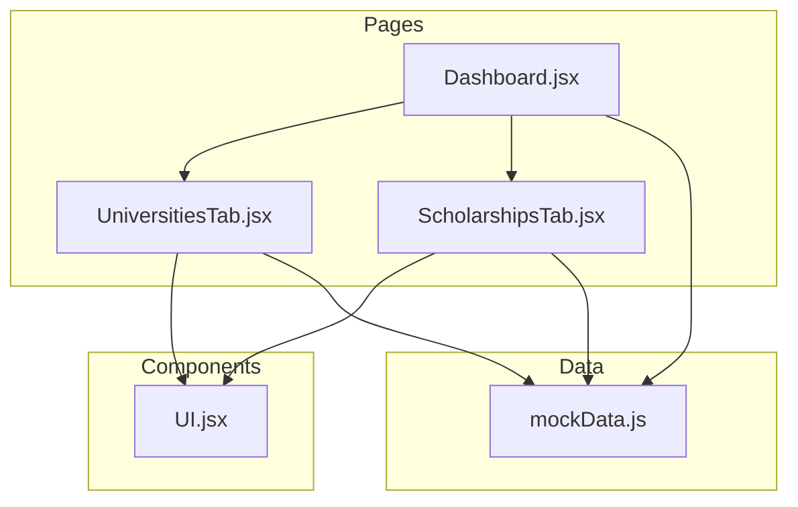
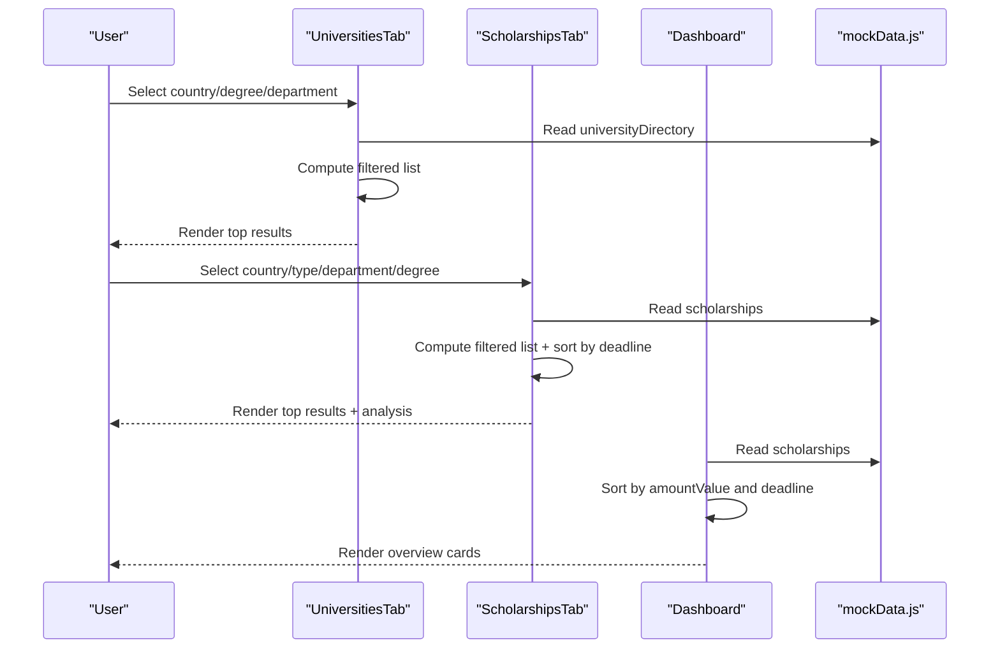
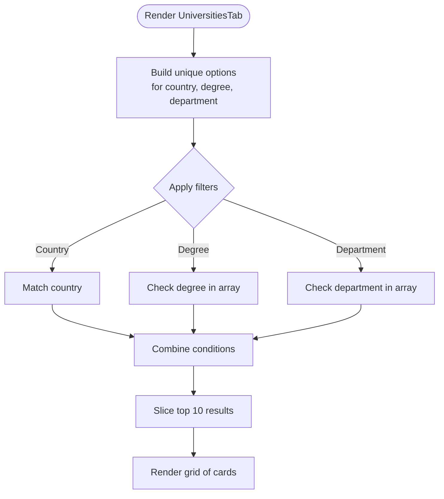
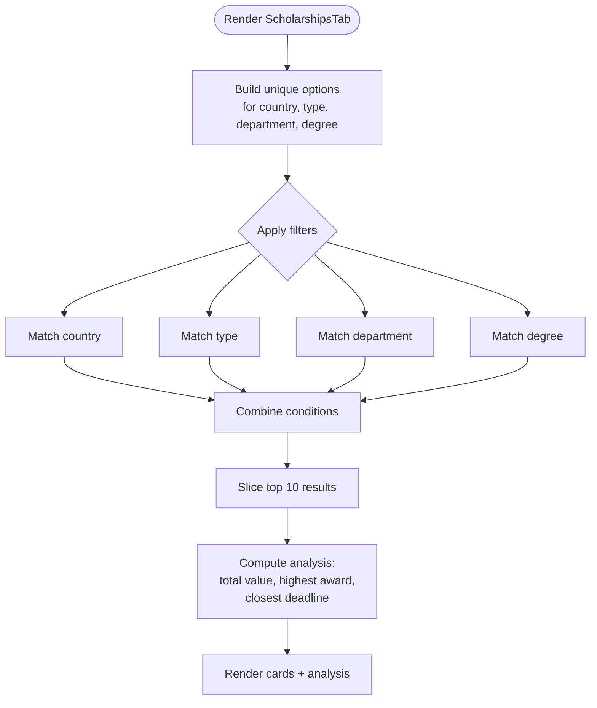
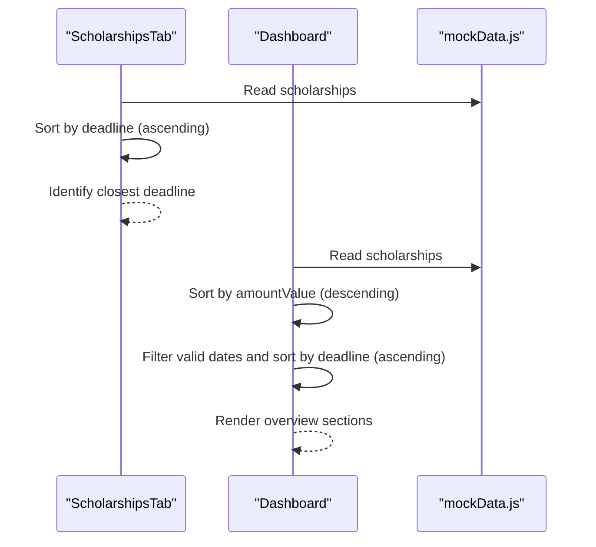
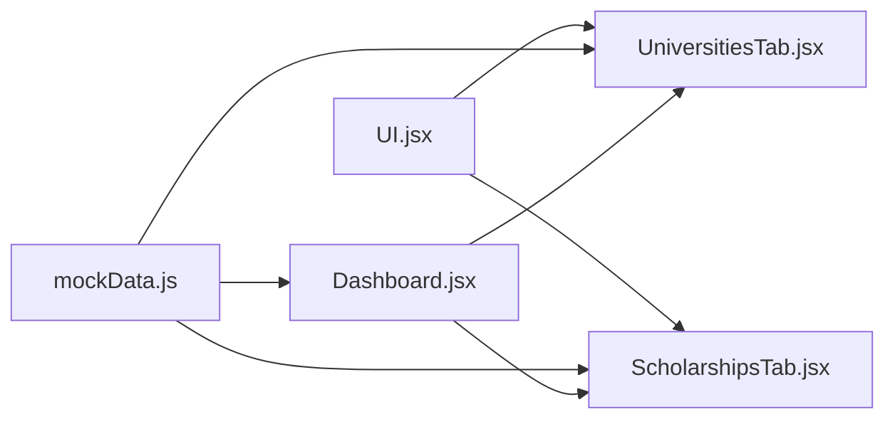

# Filtering and Sorting Patterns

<cite>
**Referenced Files in This Document**
- [UniversitiesTab.jsx](file://scholarpath-frontend (2)/scholarpath/src/pages/UniversitiesTab.jsx)
- [ScholarshipsTab.jsx](file://scholarpath-frontend (2)/scholarpath/src/pages/ScholarshipsTab.jsx)
- [Dashboard.jsx](file://scholarpath-frontend (2)/scholarpath/src/pages/Dashboard.jsx)
- [mockData.js](file://scholarpath-frontend (2)/scholarpath/src/data/mockData.js)
- [UI.jsx](file://scholarpath-frontend (2)/scholarpath/src/components/UI.jsx)
</cite>

## Table of Contents
1. [Introduction](#introduction)
2. [Project Structure](#project-structure)
3. [Core Components](#core-components)
4. [Architecture Overview](#architecture-overview)
5. [Detailed Component Analysis](#detailed-component-analysis)
6. [Dependency Analysis](#dependency-analysis)
7. [Performance Considerations](#performance-considerations)
8. [Troubleshooting Guide](#troubleshooting-guide)
9. [Conclusion](#conclusion)

## Introduction
This document explains the filtering and sorting patterns used across ScholarPathAI for discovering universities and scholarships. It covers:
- University search by country, degree program, and department with a top-results slice
- Scholarship filtering by country, type, department, and degree level
- Sorting mechanisms for match results by score and deadline
- Pagination patterns and considerations for large result sets
- Search optimization techniques used in the frontend

The goal is to help developers understand how data is filtered and sorted, and how to extend these patterns safely when integrating with a backend.

## Project Structure
Filtering and sorting logic lives primarily in two pages:
- UniversitiesTab: filters the university directory and displays top results
- ScholarshipsTab: filters scholarships and provides analysis including deadline-based sorting

Shared UI primitives are provided by a small component library, and all data currently comes from a single mock data module.

**Diagram sources**
- [UniversitiesTab.jsx:1-163](file://scholarpath-frontend (2)/scholarpath/src/pages/UniversitiesTab.jsx#L1-L163)
- [ScholarshipsTab.jsx:1-139](file://scholarpath-frontend (2)/scholarpath/src/pages/ScholarshipsTab.jsx#L1-L139)
- [Dashboard.jsx:1-187](file://scholarpath-frontend (2)/scholarpath/src/pages/Dashboard.jsx#L1-L187)
- [UI.jsx:1-47](file://scholarpath-frontend (2)/scholarpath/src/components/UI.jsx#L1-L47)
- [mockData.js:1-349](file://scholarpath-frontend (2)/scholarpath/src/data/mockData.js#L1-L349)

**Section sources**
- [UniversitiesTab.jsx:1-163](file://scholarpath-frontend (2)/scholarpath/src/pages/UniversitiesTab.jsx#L1-L163)
- [ScholarshipsTab.jsx:1-139](file://scholarpath-frontend (2)/scholarpath/src/pages/ScholarshipsTab.jsx#L1-L139)
- [Dashboard.jsx:1-187](file://scholarpath-frontend (2)/scholarpath/src/pages/Dashboard.jsx#L1-L187)
- [mockData.js:1-349](file://scholarpath-frontend (2)/scholarpath/src/data/mockData.js#L1-L349)
- [UI.jsx:1-47](file://scholarpath-frontend (2)/scholarpath/src/components/UI.jsx#L1-L47)

## Core Components
- UniversitiesTab
  - Filters the university directory by country, degree, and department using simple equality checks
  - Displays only the first N results as “top results”
  - Uses memoized lists for filter options to avoid recomputation
- ScholarshipsTab
  - Filters scholarships by country, type, department, and degree
  - Provides an analysis panel that sorts by deadline and computes aggregate metrics
  - Displays only the first N results as “top results”
- Dashboard
  - Sorts scholarship matches by amount value and by deadline for overview sections
  - Shows top university matches and upcoming deadlines

Key implementation patterns:
- Filter functions return early when a condition fails
- Options for dropdowns are derived from the dataset using Set to ensure uniqueness
- Slicing is used to limit displayed results (de facto pagination)

**Section sources**
- [UniversitiesTab.jsx:73-131](file://scholarpath-frontend (2)/scholarpath/src/pages/UniversitiesTab.jsx#L73-L131)
- [ScholarshipsTab.jsx:59-135](file://scholarpath-frontend (2)/scholarpath/src/pages/ScholarshipsTab.jsx#L59-L135)
- [Dashboard.jsx:72-126](file://scholarpath-frontend (2)/scholarpath/src/pages/Dashboard.jsx#L72-L126)

## Architecture Overview
At runtime, user interactions update local state (selected filters). On each render, components compute filtered lists from the static dataset and then slice them for display. Sorting occurs either inline or within helper components.

**Diagram sources**
- [UniversitiesTab.jsx:73-131](file://scholarpath-frontend (2)/scholarpath/src/pages/UniversitiesTab.jsx#L73-L131)
- [ScholarshipsTab.jsx:59-135](file://scholarpath-frontend (2)/scholarpath/src/pages/ScholarshipsTab.jsx#L59-L135)
- [Dashboard.jsx:72-126](file://scholarpath-frontend (2)/scholarpath/src/pages/Dashboard.jsx#L72-L126)
- [mockData.js:121-254](file://scholarpath-frontend (2)/scholarpath/src/data/mockData.js#L121-L254)

## Detailed Component Analysis

### University Filtering and Display
- Filters:
  - Country: exact match against selected value
  - Degree: membership check in array of offered degrees
  - Department: membership check in array of departments
- Options:
  - Countries, degrees, and departments are computed once via useMemo to minimize re-renders
- Results:
  - Only the first 10 entries are shown; this acts as a simple “top results” view
- User experience:
  - Clear filters button resets all selections
  - Empty state message when no matches exist

**Diagram sources**
- [UniversitiesTab.jsx:73-131](file://scholarpath-frontend (2)/scholarpath/src/pages/UniversitiesTab.jsx#L73-L131)

**Section sources**
- [UniversitiesTab.jsx:73-131](file://scholarpath-frontend (2)/scholarpath/src/pages/UniversitiesTab.jsx#L73-L131)
- [mockData.js:121-133](file://scholarpath-frontend (2)/scholarpath/src/data/mockData.js#L121-L133)

### Scholarship Filtering and Sorting
- Filters:
  - Country, type, department, degree: exact match against selected values
- Options:
  - Unique lists derived from the dataset using Set
- Results:
  - Top 10 results are displayed
- Sorting:
  - Deadline sorting is performed in the analysis section to find the closest deadline
  - Dashboard sorts scholarships by amount value and by deadline for overview sections

**Diagram sources**
- [ScholarshipsTab.jsx:59-135](file://scholarpath-frontend (2)/scholarpath/src/pages/ScholarshipsTab.jsx#L59-L135)

**Section sources**
- [ScholarshipsTab.jsx:59-135](file://scholarpath-frontend (2)/scholarpath/src/pages/ScholarshipsTab.jsx#L59-L135)
- [Dashboard.jsx:72-126](file://scholarpath-frontend (2)/scholarpath/src/pages/Dashboard.jsx#L72-L126)
- [mockData.js:136-254](file://scholarpath-frontend (2)/scholarpath/src/data/mockData.js#L136-L254)

### Sorting Mechanisms
- By score (university matches):
  - The dashboard shows current university matches already ranked by fit percentage; no additional sorting is applied in the tab
- By deadline (scholarships):
  - ScholarshipsTab sorts by deadline to identify the closest deadline for analysis
  - Dashboard sorts by deadline to show upcoming deadlines and by amount value to highlight top awards

**Diagram sources**
- [ScholarshipsTab.jsx:25-57](file://scholarpath-frontend (2)/scholarpath/src/pages/ScholarshipsTab.jsx#L25-L57)
- [Dashboard.jsx:72-126](file://scholarpath-frontend (2)/scholarpath/src/pages/Dashboard.jsx#L72-L126)
- [mockData.js:136-254](file://scholarpath-frontend (2)/scholarpath/src/data/mockData.js#L136-L254)

**Section sources**
- [ScholarshipsTab.jsx:25-57](file://scholarpath-frontend (2)/scholarpath/src/pages/ScholarshipsTab.jsx#L25-L57)
- [Dashboard.jsx:72-126](file://scholarpath-frontend (2)/scholarpath/src/pages/Dashboard.jsx#L72-L126)

### Pagination Patterns
- Current pattern:
  - Both tabs use slicing to show only the first 10 items (“top results”)
  - No explicit pagination controls are implemented
- Implications:
  - For small datasets, slicing is sufficient
  - For larger datasets, consider implementing true pagination (page size, page number) or infinite scrolling
- Recommended approach:
  - Replace slicing with a paginated query or client-side pagination state
  - Add UI controls for next/previous or load more
  - Ensure stable ordering before pagination to maintain consistent pages

[No sources needed since this section provides general guidance]

### Search Optimization Techniques
- Memoization:
  - Dropdown options are computed once per dataset change using useMemo to avoid redundant Set operations
- Early exits in filters:
  - Filter functions return false immediately when a condition fails, reducing unnecessary checks
- Minimal DOM updates:
  - Using keys based on stable IDs ensures efficient list rendering
- Data locality:
  - All data resides in a single module, simplifying future migration to API-backed data

**Section sources**
- [UniversitiesTab.jsx:73-88](file://scholarpath-frontend (2)/scholarpath/src/pages/UniversitiesTab.jsx#L73-L88)
- [ScholarshipsTab.jsx:59-77](file://scholarpath-frontend (2)/scholarpath/src/pages/ScholarshipsTab.jsx#L59-L77)
- [mockData.js:1-13](file://scholarpath-frontend (2)/scholarpath/src/data/mockData.js#L1-L13)

## Dependency Analysis
- Pages depend on:
  - UI components for consistent card/button/badge rendering
  - Mock data for all entities (universities, scholarships, student profile)
- Dashboard composes multiple tabs and performs additional sorting for overview sections
- No circular dependencies observed between pages and data

**Diagram sources**
- [UI.jsx:1-47](file://scholarpath-frontend (2)/scholarpath/src/components/UI.jsx#L1-L47)
- [UniversitiesTab.jsx:1-163](file://scholarpath-frontend (2)/scholarpath/src/pages/UniversitiesTab.jsx#L1-L163)
- [ScholarshipsTab.jsx:1-139](file://scholarpath-frontend (2)/scholarpath/src/pages/ScholarshipsTab.jsx#L1-L139)
- [Dashboard.jsx:1-187](file://scholarpath-frontend (2)/scholarpath/src/pages/Dashboard.jsx#L1-L187)
- [mockData.js:1-349](file://scholarpath-frontend (2)/scholarpath/src/data/mockData.js#L1-L349)

**Section sources**
- [UI.jsx:1-47](file://scholarpath-frontend (2)/scholarpath/src/components/UI.jsx#L1-L47)
- [UniversitiesTab.jsx:1-163](file://scholarpath-frontend (2)/scholarpath/src/pages/UniversitiesTab.jsx#L1-L163)
- [ScholarshipsTab.jsx:1-139](file://scholarpath-frontend (2)/scholarpath/src/pages/ScholarshipsTab.jsx#L1-L139)
- [Dashboard.jsx:1-187](file://scholarpath-frontend (2)/scholarpath/src/pages/Dashboard.jsx#L1-L187)
- [mockData.js:1-349](file://scholarpath-frontend (2)/scholarpath/src/data/mockData.js#L1-L349)

## Performance Considerations
- Keep filter functions simple and short-circuiting to reduce computation time
- Use memoization for derived lists (countries, degrees, departments) to prevent repeated Set operations
- Avoid heavy computations inside render loops; precompute where possible
- When migrating to a backend:
  - Move filtering and sorting to server-side queries for scalability
  - Implement server-side pagination to handle large result sets efficiently
  - Cache frequently accessed option lists (e.g., countries, types)

[No sources needed since this section provides general guidance]

## Troubleshooting Guide
- No results after applying filters:
  - Verify that filter values match the dataset fields exactly (case-sensitive)
  - Ensure arrays for multi-value fields (degrees, departments) contain expected values
- Incorrect sorting:
  - Confirm date strings are parseable; invalid dates may be skipped during sorting
  - For numeric sorting (amount), ensure values are numbers and not strings
- UI not updating:
  - Check that state setters are invoked correctly and that keys for list items are stable
- Performance issues with large datasets:
  - Consider moving filtering/sorting to the backend
  - Implement pagination or virtualized lists for better performance

**Section sources**
- [UniversitiesTab.jsx:73-131](file://scholarpath-frontend (2)/scholarpath/src/pages/UniversitiesTab.jsx#L73-L131)
- [ScholarshipsTab.jsx:59-135](file://scholarpath-frontend (2)/scholarpath/src/pages/ScholarshipsTab.jsx#L59-L135)
- [Dashboard.jsx:72-126](file://scholarpath-frontend (2)/scholarpath/src/pages/Dashboard.jsx#L72-L126)

## Conclusion
ScholarPathAI implements straightforward, effective filtering and sorting patterns for universities and scholarships:
- Equality-based filters with early exits for performance
- Memoized option lists to optimize dropdowns
- Slicing for “top results” as a simple pagination substitute
- Deadline-based sorting for scholarship analysis and overview
These patterns provide a solid foundation for scaling to larger datasets and integrating with a backend while maintaining a responsive user experience.

[No sources needed since this section summarizes without analyzing specific files]