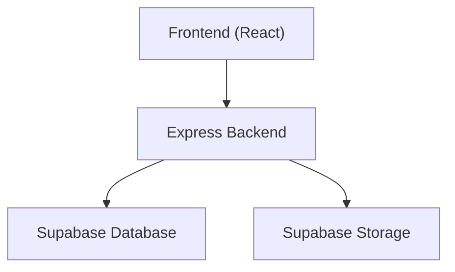
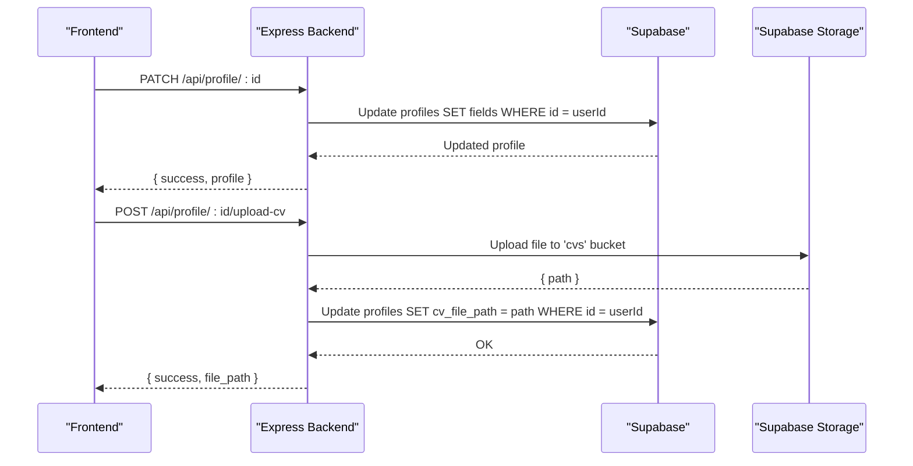
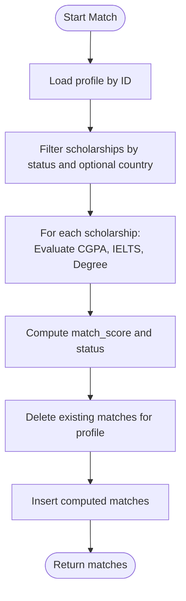
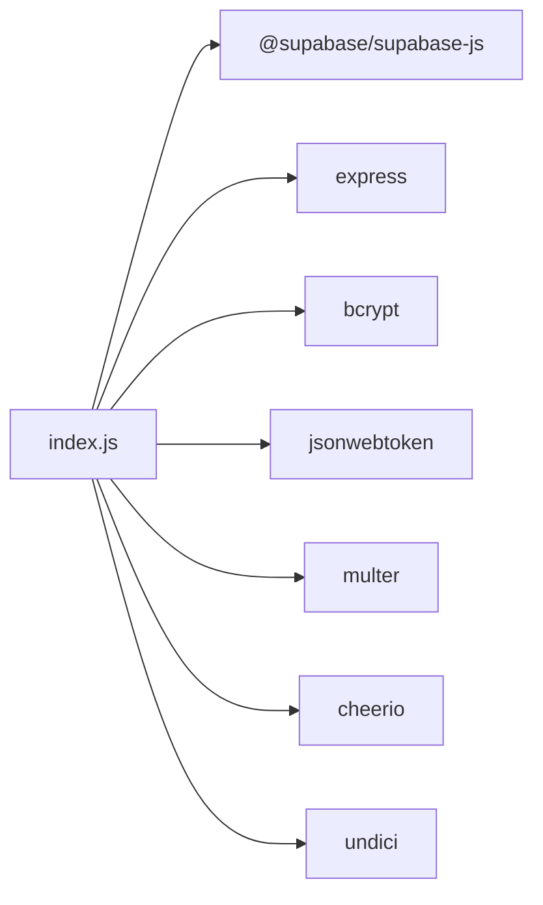

# Query Patterns and Operations

<cite>
**Referenced Files in This Document**
- [index.js](file://aischolarpath-backend-main/aischolarpath-backend-main/index.js)
- [package.json](file://aischolarpath-backend-main/aischolarpath-backend-main/package.json)
- [ProfileTab.jsx](file://scholarpath-frontend (2)/scholarpath/src/pages/ProfileTab.jsx)
- [ScholarshipsTab.jsx](file://scholarpath-frontend (2)/scholarpath/src/pages/ScholarshipsTab.jsx)
- [AttestationTab.jsx](file://scholarpath-frontend (2)/scholarpath/src/pages/AttestationTab.jsx)
- [mockData.js](file://scholarpath-frontend (2)/scholarpath/src/data/mockData.js)
</cite>

## Table of Contents
1. Introduction
2. Project Structure
3. Core Components
4. Architecture Overview
5. Detailed Component Analysis
6. Dependency Analysis
7. Performance Considerations
8. Troubleshooting Guide
9. Conclusion

## Introduction
This document explains the Supabase query patterns and database operations used throughout ScholarPathAI. It covers CRUD operations for each entity, complex queries involving joins between related tables, filtering and sorting patterns, and transaction-like workflows. It also documents query optimization techniques, error handling strategies, and performance considerations with concrete examples from profile management, scholarship matching calculations, and attestation workflow operations.

## Project Structure
The system consists of:
- A Node.js Express backend that exposes REST endpoints and interacts with Supabase for data persistence and storage.
- A React frontend that provides user interfaces for profile management, scholarships browsing, and attestation guidance. The frontend currently uses static mock data but is designed to integrate with the backend API.

**Diagram sources**
- [index.js:27-54](file://aischolarpath-backend-main/aischolarpath-backend-main/index.js#L27-L54)
- [index.js:112-145](file://aischolarpath-backend-main/aischolarpath-backend-main/index.js#L112-L145)

**Section sources**
- [index.js:1-59](file://aischolarpath-backend-main/aischolarpath-backend-main/index.js#L1-L59)
- [package.json:1-14](file://aischolarpath-backend-main/aischolarpath-backend-main/package.json#L1-L14)

## Core Components
- Authentication and authorization middleware using JWT to protect routes and enforce ownership checks.
- Profile management endpoints for updating profiles, retrieving profiles, uploading CVs, and analyzing CVs.
- Scholarship discovery and listing endpoints with filters and joins to universities.
- Matching engine that evaluates eligibility criteria against a profile and persists match results.
- Attestation workflow endpoints to initialize, retrieve, and complete steps per authority.
- Applications, shortlist, notifications, and roadmap endpoints supporting end-to-end application tracking.
- Discovery/scraping utilities that fetch external pages, parse content, and upsert structured records into Supabase.

**Section sources**
- [index.js:32-47](file://aischolarpath-backend-main/aischolarpath-backend-main/index.js#L32-L47)
- [index.js:70-188](file://aischolarpath-backend-main/aischolarpath-backend-main/index.js#L70-L188)
- [index.js:190-288](file://aischolarpath-backend-main/aischolarpath-backend-main/index.js#L190-L288)
- [index.js:575-692](file://aischolarpath-backend-main/aischolarpath-backend-main/index.js#L575-L692)
- [index.js:438-517](file://aischolarpath-backend-main/aischolarpath-backend-main/index.js#L438-L517)
- [index.js:822-932](file://aischolarpath-backend-main/aischolarpath-backend-main/index.js#L822-L932)
- [index.js:983-1100](file://aischolarpath-backend-main/aischolarpath-backend-main/index.js#L983-L1100)
- [index.js:1183-1505](file://aischolarpath-backend-main/aischolarpath-backend-main/index.js#L1183-L1505)

## Architecture Overview
The backend centralizes all database interactions through a single Supabase client instance. Routes implement:
- Filtering and selection with chained query builders.
- Joins via nested selects to include related entities (e.g., scholarships with universities).
- Ownership validation by comparing authenticated user IDs to resource owners.
- Transaction-like sequences where multiple writes are performed sequentially within a single request lifecycle.

**Diagram sources**
- [index.js:70-110](file://aischolarpath-backend-main/aischolarpath-backend-main/index.js#L70-L110)
- [index.js:112-145](file://aischolarpath-backend-main/aischolarpath-backend-main/index.js#L112-L145)

## Detailed Component Analysis

### Profile Management Queries
CRUD operations:
- Create: Signup inserts a new profile row and returns minimal user info.
- Read: Retrieve profile by ID with ownership check; test route reads a sample row to verify connectivity.
- Update: Patch endpoint updates only provided fields and returns the updated profile.
- Delete: Not exposed directly for profiles; related deletions occur for child resources like applications or shortlist items.

Complex queries:
- Language prep profile endpoint retrieves the current IELTS score and joins matches with scholarships to compute requirement gaps.

Filtering and sorting:
- Sorting by match_score descending when retrieving stored matches.

Transaction-like flow:
- CV upload sequence performs storage write followed by profile update; errors are handled per step.

Error handling:
- Consistent pattern: if error exists, return status 4xx/5xx with message; otherwise return success payload.

Performance considerations:
- Select only needed columns.
- Use .single() for one-row lookups.
- Avoid unnecessary joins until required.

Examples:
- Profile update: [index.js:70-91](file://aischolarpath-backend-main/aischolarpath-backend-main/index.js#L70-L91)
- Get profile by ID: [index.js:94-110](file://aischolarpath-backend-main/aischolarpath-backend-main/index.js#L94-L110)
- Upload CV and link: [index.js:112-145](file://aischolarpath-backend-main/aischolarpath-backend-main/index.js#L112-L145)
- Analyze CV and persist extracted data: [index.js:147-188](file://aischolarpath-backend-main/aischolarpath-backend-main/index.js#L147-L188)
- Personalized language prep: [index.js:356-402](file://aischolarpath-backend-main/aischolarpath-backend-main/index.js#L356-L402)

**Section sources**
- [index.js:519-573](file://aischolarpath-backend-main/aischolarpath-backend-main/index.js#L519-L573)
- [index.js:62-68](file://aischolarpath-backend-main/aischolarpath-backend-main/index.js#L62-L68)
- [index.js:70-188](file://aischolarpath-backend-main/aischolarpath-backend-main/index.js#L70-L188)
- [index.js:356-402](file://aischolarpath-backend-main/aischolarpath-backend-main/index.js#L356-L402)

### Scholarship Listing and Filtering
CRUD operations:
- List scholarships with optional filters: country, type, department, degree.
- Get single scholarship by ID.

Complex queries:
- Nested select includes university details (name, official portal URL).

Filtering and sorting:
- Filters applied conditionally based on query parameters.
- No explicit sort in list; ordering can be added if needed.

Performance considerations:
- Conditional chaining avoids over-fetching.
- Limit results at the UI layer for initial load.

Examples:
- List scholarships: [index.js:190-206](file://aischolarpath-backend-main/aischolarpath-backend-main/index.js#L190-L206)
- Get single scholarship: [index.js:209-222](file://aischolarpath-backend-main/aischolarpath-backend-main/index.js#L209-L222)

**Section sources**
- [index.js:190-222](file://aischolarpath-backend-main/aischolarpath-backend-main/index.js#L190-L222)

### University Listing with Joined Data
CRUD operations:
- List universities with filters: country, degree_program, search (case-insensitive name match).
- Get single university by ID.

Complex queries:
- Combines direct university scholarships and country-wide scholarships to determine which universities qualify.
- Uses two separate queries to gather IDs and countries, then filters in memory.

Filtering and sorting:
- Case-insensitive search via ilike.
- In-memory filtering after fetching base set.

Performance considerations:
- Limits result set to top entries to reduce payload size.
- Separate queries avoid expensive joins across large datasets.

Examples:
- Universities list: [index.js:224-271](file://aischolarpath-backend-main/aischolarpath-backend-main/index.js#L224-L271)
- Single university: [index.js:275-288](file://aischolarpath-backend-main/aischolarpath-backend-main/index.js#L275-L288)

**Section sources**
- [index.js:224-288](file://aischolarpath-backend-main/aischolarpath-backend-main/index.js#L224-L288)

### Scholarship Matching Engine
CRUD operations:
- Compute matches for a profile against active scholarships.
- Clear old matches and insert fresh results.
- Retrieve stored matches sorted by match_score.

Complex logic:
- Evaluates eligibility criteria (CGPA, IELTS, required degree) and computes pass/fail/missing evidence per criterion.
- Calculates match_score as percentage of passed criteria.

Filtering and sorting:
- Filters scholarships by target_country if present.
- Sorts retrieved matches by match_score descending.

Transaction-like flow:
- Deletes previous matches for the profile before inserting new ones to ensure consistency.

Performance considerations:
- Pre-filter scholarships by country to reduce computation.
- Batch insert results to minimize round trips.

Examples:
- Run matching: [index.js:575-673](file://aischolarpath-backend-main/aischolarpath-backend-main/index.js#L575-L673)
- Get stored matches: [index.js:676-692](file://aischolarpath-backend-main/aischolarpath-backend-main/index.js#L676-L692)

**Diagram sources**
- [index.js:575-673](file://aischolarpath-backend-main/aischolarpath-backend-main/index.js#L575-L673)

**Section sources**
- [index.js:575-692](file://aischolarpath-backend-main/aischolarpath-backend-main/index.js#L575-L692)

### Attestation Workflow Operations
CRUD operations:
- Initialize tracked steps for a profile based on authority-specific guides.
- Retrieve steps for a profile ordered by authority and step_order.
- Mark a step as done with ownership verification.

Complex queries:
- Order results by multiple columns (authority, step_order).

Filtering and sorting:
- Ordered retrieval ensures consistent display order.

Transaction-like flow:
- Initialization creates multiple rows in a single insert call.

Performance considerations:
- Minimal payload; only necessary fields selected.

Examples:
- Initialize steps: [index.js:438-464](file://aischolarpath-backend-main/aischolarpath-backend-main/index.js#L438-L464)
- Get steps: [index.js:467-486](file://aischolarpath-backend-main/aischolarpath-backend-main/index.js#L467-L486)
- Complete step: [index.js:489-517](file://aischolarpath-backend-main/aischolarpath-backend-main/index.js#L489-L517)

**Section sources**
- [index.js:438-517](file://aischolarpath-backend-main/aischolarpath-backend-main/index.js#L438-L517)

### Applications, Shortlist, Notifications, and Roadmap
CRUD operations:
- Create/update/delete applications with ownership checks.
- Add/remove shortlisted items and retrieve enriched details.
- Create/read/mark notifications as read with ownership checks.
- Generate personalized roadmap based on nearest deadline among eligible matches.

Complex queries:
- Join applications with scholarships to access deadlines and titles.
- Join shortlist items with scholarships/universities to enrich responses.

Filtering and sorting:
- Order applications by updated_at descending.
- Filter notifications by profile_id and order by created_at.

Transaction-like flow:
- Deadline checker aggregates due applications and creates notifications in batch.

Performance considerations:
- Select only needed fields in joins.
- Limit results where appropriate.

Examples:
- Applications CRUD: [index.js:822-932](file://aischolarpath-backend-main/aischolarpath-backend-main/index.js#L822-L932)
- Shortlist CRUD: [index.js:751-820](file://aischolarpath-backend-main/aischolarpath-backend-main/index.js#L751-L820)
- Notifications CRUD and deadline check: [index.js:983-1100](file://aischolarpath-backend-main/aischolarpath-backend-main/index.js#L983-L1100)
- Roadmap generation: [index.js:1546-1595](file://aischolarpath-backend-main/aischolarpath-backend-main/index.js#L1546-L1595)

**Section sources**
- [index.js:751-932](file://aischolarpath-backend-main/aischolarpath-backend-main/index.js#L751-L932)
- [index.js:983-1100](file://aischolarpath-backend-main/aischolarpath-backend-main/index.js#L983-L1100)
- [index.js:1546-1595](file://aischolarpath-backend-main/aischolarpath-backend-main/index.js#L1546-L1595)

### Discovery and Scraping Utilities
CRUD operations:
- Log scraping attempts and results into discovery_log.
- Upsert scholarships with conflict resolution on title+country.

Complex logic:
- Fetch external pages, parse HTML with Cheerio, extract fields via regex patterns, and persist structured data.
- Bulk operations with delays to respect rate limits.

Filtering and sorting:
- Retrieve logs ordered by fetched_at descending with limit.

Performance considerations:
- Introduce delays between requests to avoid overwhelming targets.
- Use upsert to prevent duplicates and simplify idempotency.

Examples:
- Single scrape: [index.js:1183-1243](file://aischolarpath-backend-main/aischolarpath-backend-main/index.js#L1183-L1243)
- Logs view: [index.js:1246-1257](file://aischolarpath-backend-main/aischolarpath-backend-main/index.js#L1246-L1257)
- Bulk scrape: [index.js:1259-1309](file://aischolarpath-backend-main/aischolarpath-backend-main/index.js#L1259-L1309)
- Scrape and structure: [index.js:1311-1390](file://aischolarpath-backend-main/aischolarpath-backend-main/index.js#L1311-L1390)
- Official page scrape: [index.js:1392-1439](file://aischolarpath-backend-main/aischolarpath-backend-main/index.js#L1392-L1439)
- Bulk official scrape: [index.js:1441-1493](file://aischolarpath-backend-main/aischolarpath-backend-main/index.js#L1441-L1493)
- Pending review list: [index.js:1495-1505](file://aischolarpath-backend-main/aischolarpath-backend-main/index.js#L1495-L1505)

**Section sources**
- [index.js:1183-1505](file://aischolarpath-backend-main/aischolarpath-backend-main/index.js#L1183-L1505)

## Dependency Analysis
Key dependencies:
- @supabase/supabase-js for database and storage operations.
- express, cors, dotenv for server setup and environment configuration.
- bcrypt for password hashing.
- jsonwebtoken for token-based authentication.
- multer for file uploads.
- cheerio for HTML parsing during scraping.
- undici for HTTP client configuration.

**Diagram sources**
- [package.json:1-14](file://aischolarpath-backend-main/aischolarpath-backend-main/package.json#L1-L14)
- [index.js:1-27](file://aischolarpath-backend-main/aischolarpath-backend-main/index.js#L1-L27)

**Section sources**
- [package.json:1-14](file://aischolarpath-backend-main/aischolarpath-backend-main/package.json#L1-L14)
- [index.js:1-27](file://aischolarpath-backend-main/aischolarpath-backend-main/index.js#L1-L27)

## Performance Considerations
- Prefer selective column projection in selects to reduce payload sizes.
- Use .single() for unique lookups to avoid array overhead.
- Apply filters early in query chains to minimize dataset size.
- For large lists, consider pagination or limiting results at the API layer.
- Use upsert for idempotent writes to avoid duplicate records and reduce conflict handling complexity.
- Introduce delays in bulk scraping to respect rate limits and avoid blocking.
- Cache static reference data in-memory (e.g., language prep guides, attestation guides) to avoid repeated computations.
- Validate inputs at the API boundary to fail fast and reduce unnecessary DB calls.

[No sources needed since this section provides general guidance]

## Troubleshooting Guide
Common issues and strategies:
- Missing environment variables: Startup validates required env vars and exits if missing.
- Authentication failures: Middleware verifies JWT and sets userId; unauthorized access returns 401/403.
- Database errors: Each route checks error objects and returns descriptive messages with appropriate status codes.
- File upload errors: Multer handles file presence; storage errors are caught and reported.
- Scraping failures: Try/catch blocks log errors and persist failure states in discovery_log.

Operational tips:
- Use health and test-db endpoints to verify server and database connectivity.
- Inspect discovery logs to diagnose scraping issues.
- Review error responses for precise messages indicating invalid tokens, missing resources, or server-side failures.

**Section sources**
- [index.js:5-10](file://aischolarpath-backend-main/aischolarpath-backend-main/index.js#L5-L10)
- [index.js:32-47](file://aischolarpath-backend-main/aischolarpath-backend-main/index.js#L32-L47)
- [index.js:57-68](file://aischolarpath-backend-main/aischolarpath-backend-main/index.js#L57-L68)
- [index.js:1183-1243](file://aischolarpath-backend-main/aischolarpath-backend-main/index.js#L1183-L1243)
- [index.js:1528-1531](file://aischolarpath-backend-main/aischolarpath-backend-main/index.js#L1528-L1531)

## Conclusion
ScholarPathAI’s backend implements robust Supabase query patterns across profile management, scholarship discovery, matching, attestation workflows, and discovery tools. It emphasizes secure access control, efficient querying with selective projections and conditional filters, and resilient error handling. The matching engine and attestation workflows demonstrate transaction-like sequences ensuring data consistency. Frontend components provide intuitive interfaces and are structured to integrate seamlessly with these APIs once connected.

[No sources needed since this section summarizes without analyzing specific files]