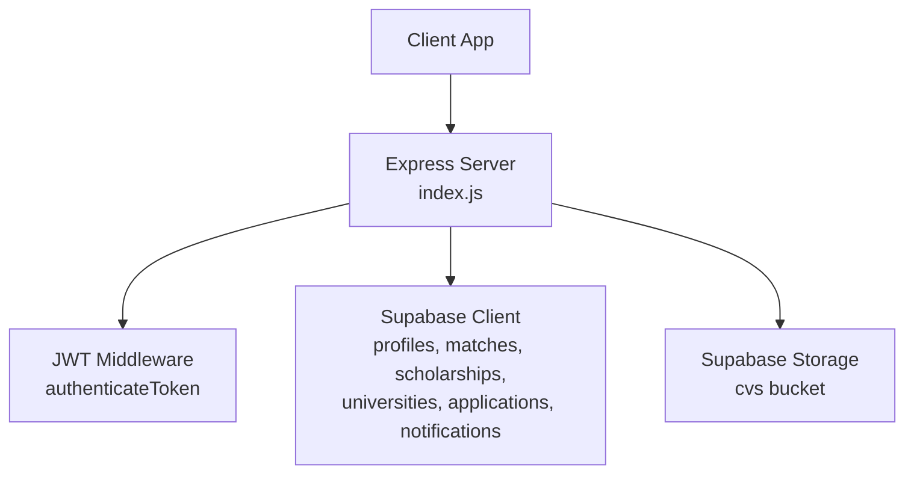
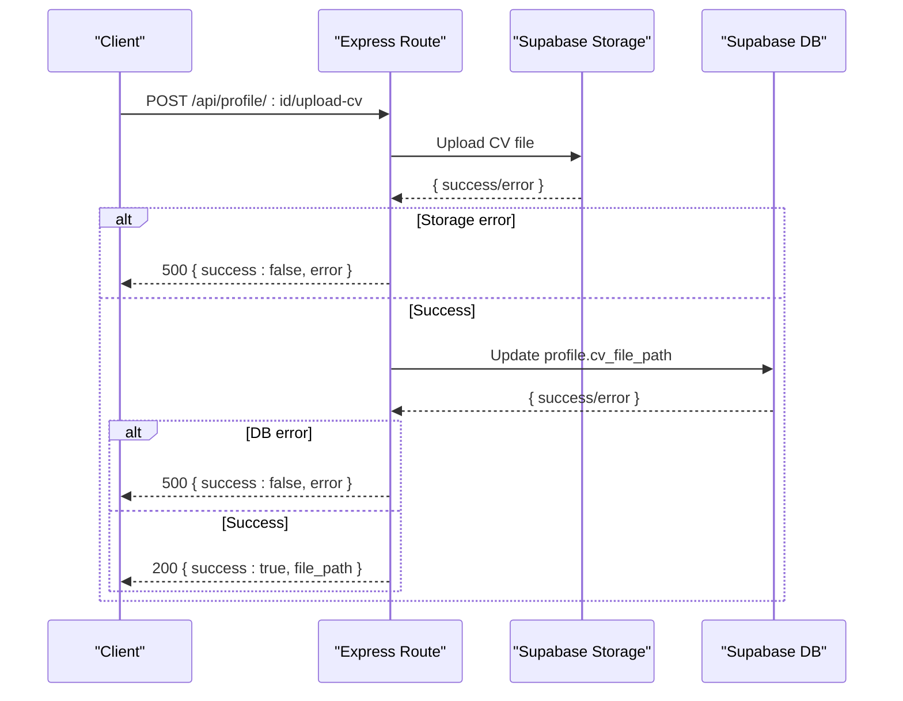
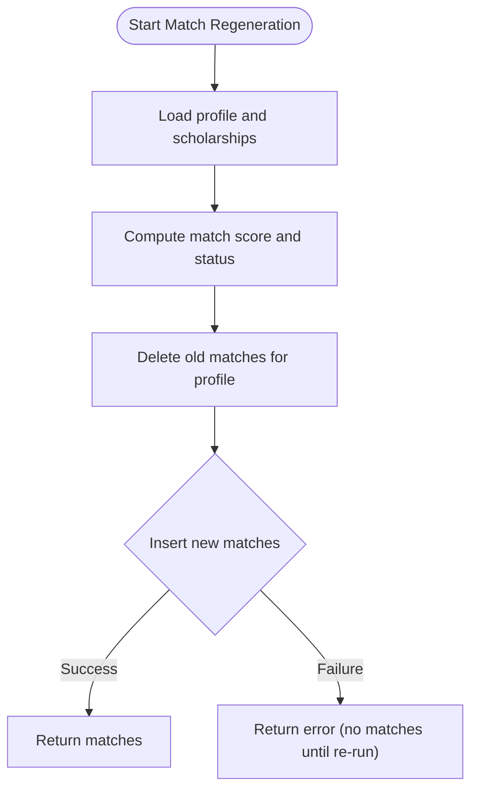
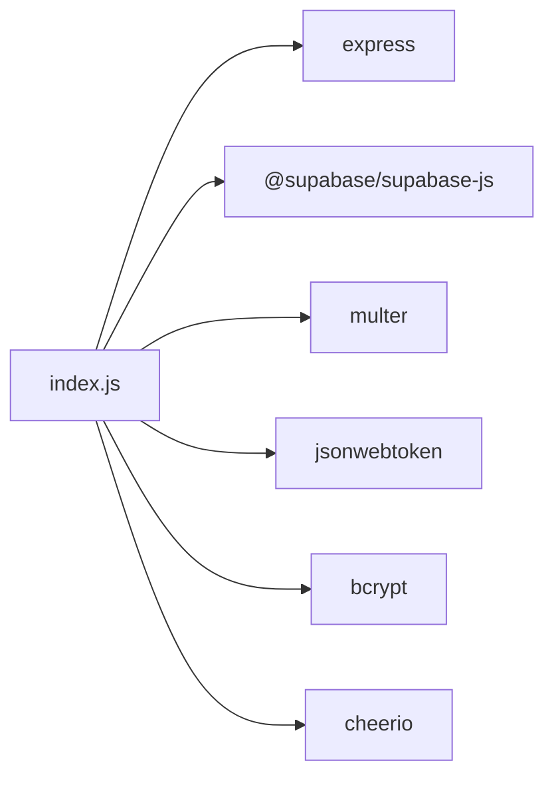

# Transaction Management and Data Integrity

<cite>
**Referenced Files in This Document**
- [index.js](file://aischolarpath-backend-main/aischolarpath-backend-main/index.js)
- [package.json](file://aischolarpath-backend-main/aischolarpath-backend-main/package.json)
</cite>

## Table of Contents
1. [Introduction](#introduction)
2. [Project Structure](#project-structure)
3. [Core Components](#core-components)
4. [Architecture Overview](#architecture-overview)
5. [Detailed Component Analysis](#detailed-component-analysis)
6. [Dependency Analysis](#dependency-analysis)
7. [Performance Considerations](#performance-considerations)
8. [Troubleshooting Guide](#troubleshooting-guide)
9. [Conclusion](#conclusion)

## Introduction
This document explains how ScholarPathAI coordinates multiple database operations to maintain data integrity, focusing on:
- Coordinating CV upload with profile updates
- Error handling and rollback strategies when operations fail partway through
- The matching algorithm’s delete-and-insert pattern for consistent match results
- Best practices for ensuring consistency across related operations and handling concurrent requests

The backend is an Express application using Supabase as the database and storage provider. It performs multi-step workflows by chaining asynchronous operations and returning errors early when any step fails.

## Project Structure
The backend lives in a single Express entry point that defines routes for authentication, profiles, scholarships, universities, applications, notifications, discovery/scraping, and more. All database interactions use the Supabase client configured at startup.

**Diagram sources**
- [index.js:1-54](file://aischolarpath-backend-main/aischolarpath-backend-main/index.js#L1-L54)
- [index.js:31-47](file://aischolarpath-backend-main/aischolarpath-backend-main/index.js#L31-L47)

**Section sources**
- [index.js:1-54](file://aischolarpath-backend-main/aischolarpath-backend-main/index.js#L1-L54)
- [package.json:1-14](file://aischolarpath-backend-main/aischolarpath-backend-main/package.json#L1-L14)

## Core Components
- Authentication middleware validates JWT tokens and attaches user identity to requests.
- Profile endpoints update user data and manage CV file references.
- Matching endpoint computes eligibility and persists results.
- Application and notification endpoints track progress and reminders.
- Discovery endpoints scrape and upsert scholarship records.

Key transaction-like patterns observed:
- Multi-step workflows (e.g., upload + profile update; analyze + profile update) are implemented as sequential async calls with immediate error checks.
- A delete-then-insert sequence ensures idempotent match regeneration.
- Bulk or iterative operations log outcomes per item without rolling back earlier successes.

**Section sources**
- [index.js:31-47](file://aischolarpath-backend-main/aischolarpath-backend-main/index.js#L31-L47)
- [index.js:69-145](file://aischolarpath-backend-main/aischolarpath-backend-main/index.js#L69-L145)
- [index.js:147-188](file://aischolarpath-backend-main/aischolarpath-backend-main/index.js#L147-L188)
- [index.js:575-673](file://aischolarpath-backend-main/aischolarpath-backend-main/index.js#L575-L673)
- [index.js:822-905](file://aischolarpath-backend-main/aischolarpath-backend-main/index.js#L822-L905)
- [index.js:982-1100](file://aischolarpath-backend-main/aischolarpath-backend-main/index.js#L982-L1100)
- [index.js:1182-1505](file://aischolarpath-backend-main/aischolarpath-backend-main/index.js#L1182-L1505)

## Architecture Overview
The server exposes REST endpoints that orchestrate business logic and call Supabase for persistence. Some endpoints also interact with external services (e.g., scraping). Each route handles authorization, validates inputs, executes one or more database operations, and returns structured responses.

**Diagram sources**
- [index.js:112-145](file://aischolarpath-backend-main/aischolarpath-backend-main/index.js#L112-L145)

**Section sources**
- [index.js:112-145](file://aischolarpath-backend-main/aischolarpath-backend-main/index.js#L112-L145)

## Detailed Component Analysis

### CV Upload Followed by Profile Update
Workflow:
- Validate ownership via JWT middleware.
- Upload file to Supabase storage.
- On success, update the profile row to record the file path.
- If either step fails, return an error response.

Data integrity considerations:
- There is no explicit database transaction wrapping both steps. If storage succeeds but the profile update fails, the file exists without a link in the profile.
- To improve integrity, consider moving the profile update into a Supabase RPC or using a database-level trigger to persist the reference atomically, or implement compensating logic to remove the orphaned file if the update fails.

Error handling:
- Immediate error propagation after each await prevents partial state from being exposed.
- Errors are returned as JSON with a success flag and message.

Best practices:
- Wrap multi-step writes in a database transaction where possible.
- Use idempotency keys for uploads to avoid duplicates.
- Implement cleanup on failure (delete uploaded file if profile update fails).

**Section sources**
- [index.js:112-145](file://aischolarpath-backend-main/aischolarpath-backend-main/index.js#L112-L145)

### CV Analysis and Profile Update
Workflow:
- Insert extracted data into a dedicated table.
- Update profile fields (e.g., CGPA, IELTS) based on extraction.
- Errors in either step are handled immediately.

Data integrity considerations:
- Two separate writes are not wrapped in a transaction. If insertion succeeds but profile update fails, extracted data remains without corresponding profile changes.
- Consider grouping these writes in a single transaction or using a background job with retry and compensation.

Error handling:
- Each operation checks its error result and returns a 500 response with details.

Best practices:
- Use database transactions to ensure both inserts and updates succeed together.
- Add validation to prevent inconsistent states (e.g., ensure extracted data exists before updating profile).

**Section sources**
- [index.js:147-188](file://aischolarpath-backend-main/aischolarpath-backend-main/index.js#L147-L188)

### Matching Algorithm: Delete-and-Insert Pattern
Workflow:
- Load profile and eligible scholarships.
- Compute match scores and statuses per scholarship.
- Delete all existing matches for the profile.
- Insert fresh match rows.
- Return the new set of matches.

Data integrity considerations:
- The delete-then-insert pattern ensures a clean slate for regenerated matches, avoiding stale or duplicate entries.
- However, the delete and insert are two separate operations. If the insert fails after deletion, the profile will have no matches until re-run.
- For stronger guarantees, wrap the delete and insert in a database transaction so they succeed or fail together.

Concurrency considerations:
- Concurrent re-runs could interleave deletes and inserts. Using a transaction serializes access to the matches table for a given profile_id, preventing partial states during regeneration.

Error handling:
- Errors after delete are caught and returned; there is no automatic rollback of the delete.

Best practices:
- Use a database transaction around delete+insert for atomicity.
- Add unique constraints on (profile_id, scholarship_id) to prevent duplicates even under concurrency.
- Consider idempotent re-runs by checking for existence before inserting.

**Diagram sources**
- [index.js:575-673](file://aischolarpath-backend-main/aischolarpath-backend-main/index.js#L575-L673)

**Section sources**
- [index.js:575-673](file://aischolarpath-backend-main/aischolarpath-backend-main/index.js#L575-L673)

### Applications and Notifications: Multi-Write Workflows
Applications:
- Create or update application records with optional notes and next actions.
- Authorization checks ensure users can only modify their own records.

Notifications:
- Generate deadline reminders by scanning applications and creating notifications.
- Batch creation of notifications is performed in a single insert.

Data integrity considerations:
- These endpoints perform single-table writes or batch inserts. They do not span multiple tables within a transaction in the current implementation.
- For cross-entity updates (e.g., marking applications and creating notifications), consider grouping them in a transaction to keep state consistent.

Error handling:
- Each operation checks for errors and returns appropriate responses.

Best practices:
- Group related writes (application update + notification creation) in a transaction.
- Use idempotent operations where possible to handle retries safely.

**Section sources**
- [index.js:822-905](file://aischolarpath-backend-main/aischolarpath-backend-main/index.js#L822-L905)
- [index.js:982-1100](file://aischolarpath-backend-main/aischolarpath-backend-main/index.js#L982-L1100)

### Scraping and Upsert Patterns
Discovery endpoints:
- Scrape web pages, extract fields, and upsert scholarship records.
- Use upsert semantics to avoid duplicates while preserving latest information.

Data integrity considerations:
- Upserts provide consistency against duplicates but are still individual operations.
- For bulk scraping, failures are recorded per item without affecting others.

Error handling:
- Per-item try/catch logs failures and continues processing other items.

Best practices:
- Use database-level constraints (e.g., unique on title+country) to enforce uniqueness.
- Consider batching upserts in a single transaction for better performance and consistency.

**Section sources**
- [index.js:1182-1505](file://aischolarpath-backend-main/aischolarpath-backend-main/index.js#L1182-L1505)

## Dependency Analysis
The backend depends on:
- Express for routing and middleware
- Supabase client for database and storage
- Multer for file uploads
- JWT and bcrypt for authentication and password hashing
- Cheerio for HTML parsing in discovery endpoints

**Diagram sources**
- [package.json:1-14](file://aischolarpath-backend-main/aischolarpath-backend-main/package.json#L1-L14)
- [index.js:1-27](file://aischolarpath-backend-main/aischolarpath-backend-main/index.js#L1-L27)

**Section sources**
- [package.json:1-14](file://aischolarpath-backend-main/aischolarpath-backend-main/package.json#L1-L14)
- [index.js:1-27](file://aischolarpath-backend-main/aischolarpath-backend-main/index.js#L1-L27)

## Performance Considerations
- Connection pooling: The undici agent configures connection limits and timeouts, which helps manage concurrent HTTP requests to external services.
- Batch operations: Where possible, use batch inserts (e.g., notifications) to reduce round trips.
- Selective queries: Queries filter by relevant fields to minimize payload size.
- Rate limiting: Discovery endpoints include delays between requests to be polite to target sites.

Recommendations:
- Use database transactions for multi-step writes to reduce latency and contention.
- Cache frequently accessed reference data (e.g., language prep guides) in memory or cache layers.
- Monitor query performance and add indexes on frequently filtered columns (e.g., profile_id, scholarship_id).

[No sources needed since this section provides general guidance]

## Troubleshooting Guide
Common issues and mitigation strategies:
- Partial state after failures:
  - Symptom: File uploaded but profile not updated; or matches deleted but insert failed.
  - Mitigation: Wrap related writes in a database transaction; implement compensating actions (e.g., delete uploaded file on failure).
- Concurrency conflicts:
  - Symptom: Duplicate or inconsistent matches due to overlapping re-runs.
  - Mitigation: Use database transactions and unique constraints on key pairs (e.g., profile_id, scholarship_id).
- External service errors:
  - Symptom: Scraping failures or network timeouts.
  - Mitigation: Retry with exponential backoff; log detailed errors; continue processing other items in bulk operations.
- Authentication and authorization:
  - Symptom: Unauthorized access attempts.
  - Mitigation: Ensure authenticateToken middleware runs on protected routes; validate ownership before mutations.

Operational tips:
- Centralized error handler catches unhandled exceptions and returns a generic error response.
- Log errors with context (e.g., user ID, operation) to aid debugging.

**Section sources**
- [index.js:1527-1531](file://aischolarpath-backend-main/aischolarpath-backend-main/index.js#L1527-L1531)

## Conclusion
ScholarPathAI implements multi-step workflows by chaining asynchronous database operations with immediate error checks. While effective for simple cases, several areas benefit from stronger transactional guarantees:
- Wrap CV upload and profile update in a transaction or use compensating logic to avoid orphaned files.
- Encapsulate CV analysis and profile updates in a transaction to ensure consistency.
- Use transactions around the matching algorithm’s delete-and-insert sequence to prevent partial states during concurrent re-runs.
- Group related writes (e.g., application updates and notifications) in transactions for atomicity.
- Enforce unique constraints and leverage Supabase features (e.g., upserts) to maintain data integrity.

Adopting these practices will improve robustness, simplify recovery from failures, and ensure consistent state under concurrent access.