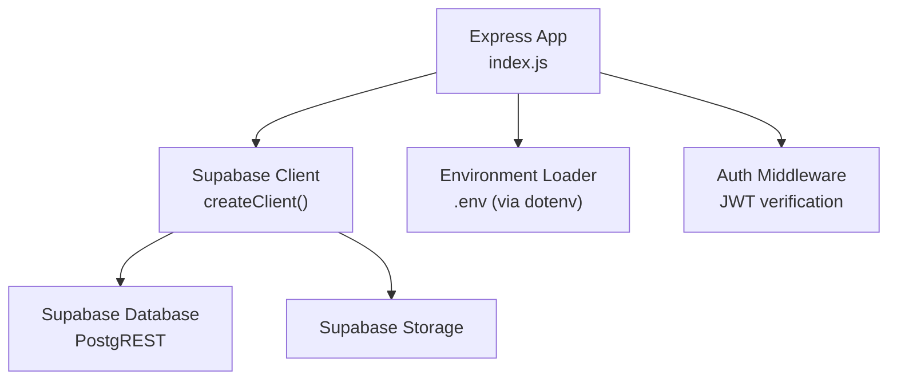
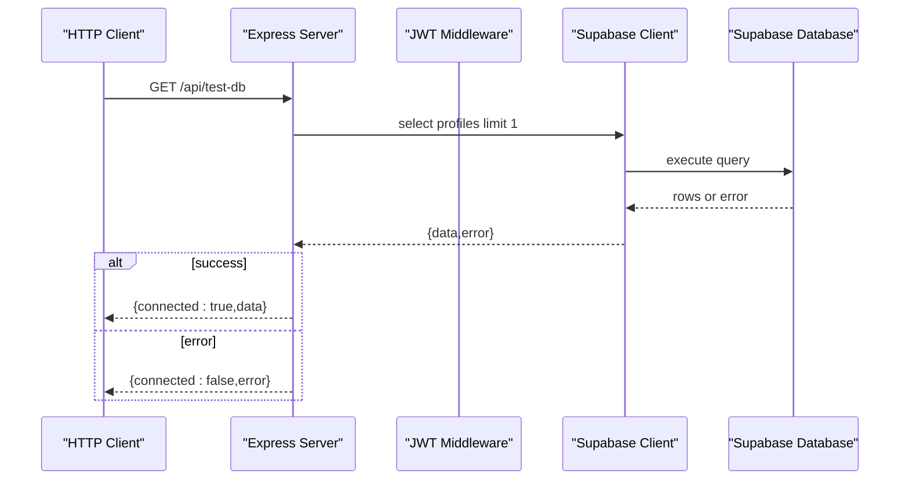
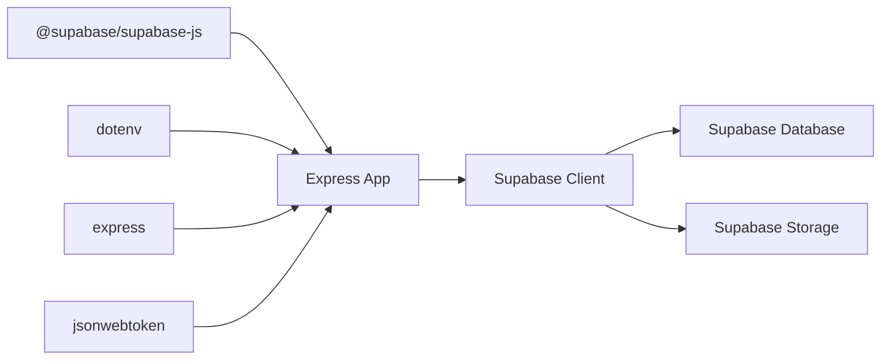

# Supabase Client Setup

<cite>
**Referenced Files in This Document**
- [index.js](file://aischolarpath-backend-main/aischolarpath-backend-main/index.js)
- [package.json](file://aischolarpath-backend-main/aischolarpath-backend-main/package.json)
- [.gitignore](file://aischolarpath-backend-main/aischolarpath-backend-main/.gitignore)
</cite>

## Update Summary
**Changes Made**
- Updated error handling strategies section to reflect critical Supabase client compatibility fix
- Enhanced connection management patterns with improved try/catch implementation
- Added detailed examples of proper error handling for scholarship upserts, match deletions, and insertions
- Updated troubleshooting guide with new error handling patterns

## Table of Contents
1. [Introduction](#introduction)
2. [Project Structure](#project-structure)
3. [Core Components](#core-components)
4. [Architecture Overview](#architecture-overview)
5. [Detailed Component Analysis](#detailed-component-analysis)
6. [Dependency Analysis](#dependency-analysis)
7. [Performance Considerations](#performance-considerations)
8. [Troubleshooting Guide](#troubleshooting-guide)
9. [Conclusion](#conclusion)

## Introduction
This document explains how ScholarPathAI configures and initializes the Supabase client on the backend, including environment variable setup for SUPABASE_URL and SUPABASE_KEY, client instantiation with createClient(), connection management patterns, error handling strategies for connection failures, authentication token management, and security considerations for database credentials. It also provides examples of proper client configuration, a connection testing endpoint, and troubleshooting steps for common issues.

**Updated** Enhanced error handling with critical Supabase client compatibility fixes - replaced unsupported .catch() method calls with proper try/catch blocks throughout database operations for improved stability.

## Project Structure
The Supabase integration is implemented in the Express backend:
- Environment variables are loaded at startup and validated before the server starts.
- A single Supabase client instance is created once and reused across all routes.
- Routes use this shared client to read/write data via PostgREST and storage operations.
- Connection health can be verified through a dedicated test endpoint.

**Diagram sources**
- [index.js:1-54](file://aischolarpath-backend-main/aischolarpath-backend-main/index.js#L1-L54)
- [index.js:50-68](file://aischolarpath-backend-main/aischolarpath-backend-main/index.js#L50-L68)

**Section sources**
- [index.js:1-54](file://aischolarpath-backend-main/aischolarpath-backend-main/index.js#L1-L54)
- [package.json:1-13](file://aischolarpath-backend-main/aischolarpath-backend-main/package.json#L1-L13)

## Core Components
- Environment validation: The app enforces required environment variables at startup, including SUPABASE_URL and SUPABASE_KEY. If any are missing, the process exits early to prevent running without database connectivity.
- Supabase client creation: A single client instance is created using createClient(SUPABASE_URL, SUPABASE_KEY) and reused throughout the application.
- Connection testing: A GET /api/test-db route performs a minimal query to validate connectivity and permissions.
- Authentication middleware: A JWT-based middleware validates tokens for protected routes and attaches the user ID to requests.
- Error handling: Each Supabase call checks for errors and returns consistent JSON responses with appropriate HTTP status codes. A global error handler catches unhandled exceptions.

**Updated** Critical compatibility fix applied: All database operations now use proper try/catch blocks instead of unsupported .catch() methods, ensuring stable error handling for scholarship upserts, match deletions, and insertions.

**Section sources**
- [index.js:1-10](file://aischolarpath-backend-main/aischolarpath-backend-main/index.js#L1-L10)
- [index.js:32-47](file://aischolarpath-backend-main/aischolarpath-backend-main/index.js#L32-L47)
- [index.js:50-68](file://aischolarpath-backend-main/aischolarpath-backend-main/index.js#L50-L68)
- [index.js:1527-1531](file://aischolarpath-backend-main/aischolarpath-backend-main/index.js#L1527-L1531)

## Architecture Overview
The backend uses a centralized Supabase client pattern:
- Startup loads environment variables and validates them.
- A single Supabase client is instantiated once and exported implicitly by module scope.
- All API routes reuse this client for database and storage operations.
- Protected routes enforce JWT authentication before accessing Supabase resources.

**Diagram sources**
- [index.js:50-68](file://aischolarpath-backend-main/aischolarpath-backend-main/index.js#L50-L68)

## Detailed Component Analysis

### Environment Variables and Validation
- Required variables: SUPABASE_URL, SUPABASE_KEY, JWT_SECRET.
- Validation occurs at startup; if any are missing, the server logs an error and exits.
- .env file is ignored by version control to prevent credential leaks.

Best practices:
- Store SUPABASE_URL and SUPABASE_KEY in your deployment environment (e.g., platform secrets).
- Use separate values for development and production.
- Never commit .env files.

**Section sources**
- [index.js:1-10](file://aischolarpath-backend-main/aischolarpath-backend-main/index.js#L1-L10)
- [.gitignore:1-2](file://aischolarpath-backend-main/aischolarpath-backend-main/.gitignore#L1-L2)

### Supabase Client Instantiation
- The client is created once using createClient(SUPABASE_URL, SUPABASE_KEY).
- This instance is reused across all routes, ensuring efficient connection pooling and consistent configuration.

Usage patterns:
- Database queries: supabase.from('table').select(...), .insert(...), .update(...), .delete(...)
- Storage operations: supabase.storage.from('bucket').upload(...)

Security note:
- The client uses the service role key provided via SUPABASE_KEY. Ensure that Row Level Security (RLS) policies are configured in Supabase to restrict access appropriately.

**Section sources**
- [index.js:27-54](file://aischolarpath-backend-main/aischolarpath-backend-main/index.js#L27-L54)

### Connection Management Patterns
- Global HTTP agent configuration sets connection limits and timeouts for outbound requests, which can affect Supabase connectivity under load.
- The single client instance promotes connection reuse.
- Health check endpoints:
  - GET /api/health: basic server liveness probe.
  - GET /api/test-db: verifies Supabase connectivity and permissions.

Operational tips:
- Monitor /api/test-db during deployments to confirm database connectivity.
- Adjust agent settings based on expected concurrency and network conditions.

**Section sources**
- [index.js:15-25](file://aischolarpath-backend-main/aischolarpath-backend-main/index.js#L15-L25)
- [index.js:56-68](file://aischolarpath-backend-main/aischolarpath-backend-main/index.js#L56-L68)

### Authentication Token Management
- JWT middleware extracts the Authorization header, verifies the token using JWT_SECRET, and attaches the decoded user ID to req.userId.
- Protected routes enforce ownership checks (e.g., profile updates only for the authenticated user).
- Password reset flows generate short-lived reset tokens stored in the database and validated before password changes.

Security recommendations:
- Rotate JWT_SECRET regularly and store it securely.
- Enforce RLS policies so that even with valid tokens, users can only access their own data.
- Avoid logging sensitive tokens or user IDs in plain text.

**Section sources**
- [index.js:32-47](file://aischolarpath-backend-main/aischolarpath-backend-main/index.js#L32-L47)
- [index.js:518-573](file://aischolarpath-backend-main/aischolarpath-backend-main/index.js#L518-L573)
- [index.js:1101-1181](file://aischolarpath-backend-main/aischolarpath-backend-main/index.js#L1101-L1181)

### Error Handling Strategies
**Updated** Critical compatibility improvements have been implemented to enhance error handling stability:

- **Per-route error handling**: Each Supabase call now uses proper try/catch blocks instead of unsupported .catch() methods, providing more reliable error handling across all database operations.
- **Global error handler**: Catches unhandled exceptions and returns a generic error response while logging details.
- **Consistent response shape**: Most endpoints return { success, ... } with error messages when applicable.

**Key improvements in database operations:**

1. **Scholarship Upserts**: Enhanced with try/catch blocks for robust error handling during bulk data insertion and updates.

2. **Match Deletions**: Improved error handling for clearing old matches before inserting fresh data, preventing partial state corruption.

3. **Insert Operations**: Better error handling for match insertions with fallback mechanisms when certain columns don't exist.

Common patterns:
- Validate inputs before making Supabase calls.
- Return 400 for bad requests, 401/403 for auth issues, 404 for not found, 500 for server/database errors.
- Implement graceful degradation when optional features fail.

**Section sources**
- [index.js:61-68](file://aischolarpath-backend-main/aischolarpath-backend-main/index.js#L61-L68)
- [index.js:1527-1531](file://aischolarpath-backend-main/aischolarpath-backend-main/index.js#L1527-L1531)

### Security Considerations for Database Credentials
- SUPABASE_KEY should be treated as a secret; never expose it in client-side code or public repositories.
- Use RLS policies to enforce row-level access control even when using service keys on the backend.
- Limit permissions to only what is necessary (least privilege).
- Use HTTPS and secure headers in production.

**Section sources**
- [index.js:1-10](file://aischolarpath-backend-main/aischolarpath-backend-main/index.js#L1-L10)
- [.gitignore:1-2](file://aischolarpath-backend-main/aischolarpath-backend-main/.gitignore#L1-L2)

## Dependency Analysis
- The backend depends on @supabase/supabase-js for database and storage access.
- dotenv loads environment variables from .env.
- express handles HTTP routing and middleware.
- jsonwebtoken manages JWT-based authentication.

**Diagram sources**
- [package.json:1-13](file://aischolarpath-backend-main/aischolarpath-backend-main/package.json#L1-L13)
- [index.js:1-27](file://aischolarpath-backend-main/aischolarpath-backend-main/index.js#L1-L27)

**Section sources**
- [package.json:1-13](file://aischolarpath-backend-main/aischolarpath-backend-main/package.json#L1-L13)
- [index.js:1-27](file://aischolarpath-backend-main/aischolarpath-backend-main/index.js#L1-L27)

## Performance Considerations
- Single client instance: Reusing one Supabase client avoids repeated initialization overhead.
- Connection pooling: The global HTTP agent configures connection limits and timeouts, which can improve throughput under load.
- Query efficiency: Use selective field projections and filters to reduce payload sizes.
- Rate limiting: Be mindful of external scraping endpoints; delays are used to avoid rate limiting.

[No sources needed since this section provides general guidance]

## Troubleshooting Guide
**Updated** Enhanced troubleshooting guide with new error handling patterns:

Common issues and resolutions:
- Missing environment variables:
  - Symptom: Server exits immediately with an error about missing variables.
  - Action: Ensure SUPABASE_URL, SUPABASE_KEY, and JWT_SECRET are set in your environment.
- Invalid Supabase URL or key:
  - Symptom: /api/test-db returns connected:false with an error message.
  - Action: Verify the Supabase project URL and key; ensure correct region and project selection.
- Network or TLS issues:
  - Symptom: Timeouts or connection errors.
  - Action: Check firewall/proxy settings; adjust agent timeouts if needed.
- Permission errors:
  - Symptom: Queries succeed but return no data or authorization errors.
  - Action: Review Supabase RLS policies and table permissions; ensure the service key has sufficient rights.
- Authentication failures:
  - Symptom: 401/403 responses on protected routes.
  - Action: Verify JWT token validity and expiration; ensure JWT_SECRET matches between issuer and verifier.
- **New**: Database operation errors:
  - Symptom: Errors in scholarship upserts, match deletions, or insertions.
  - Action: Check try/catch blocks in database operations; verify column existence and data types.

Endpoints for diagnosis:
- GET /api/health: Confirms the server is running.
- GET /api/test-db: Validates Supabase connectivity and permissions.

**Section sources**
- [index.js:1-10](file://aischolarpath-backend-main/aischolarpath-backend-main/index.js#L1-L10)
- [index.js:56-68](file://aischolarpath-backend-main/aischolarpath-backend-main/index.js#L56-L68)

## Conclusion
ScholarPathAI's backend implements a robust Supabase integration with clear environment validation, a single reusable client instance, and comprehensive error handling. The recent critical compatibility fix ensures all database operations use proper try/catch blocks instead of unsupported .catch() methods, significantly improving stability for scholarship upserts, match deletions, and insertions. Authentication is enforced via JWT middleware, and security is reinforced through careful credential management and recommended RLS policies. Use the provided health and test endpoints to verify connectivity and troubleshoot issues effectively.

**Updated** The enhanced error handling system now provides better reliability and maintainability for all database operations, ensuring consistent behavior across different environments and reducing the risk of runtime errors.