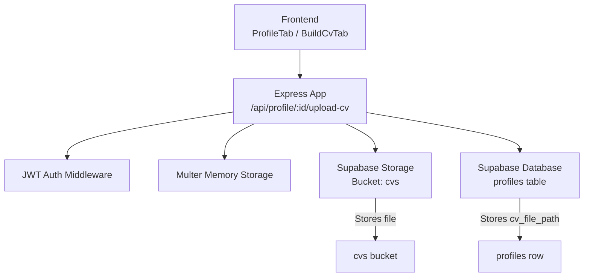
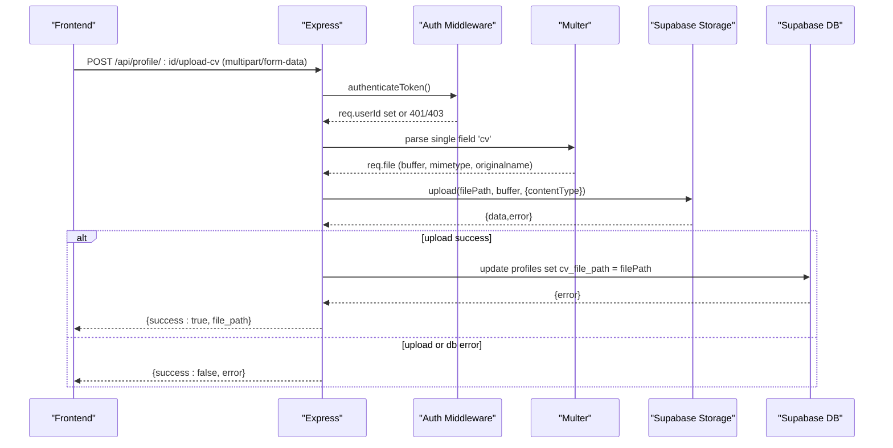
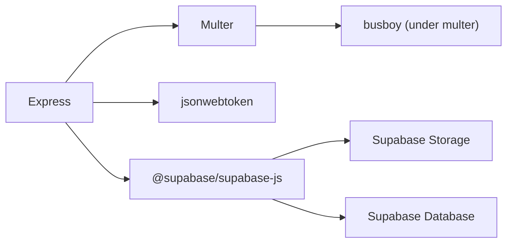

# File Upload System

<cite>
**Referenced Files in This Document**
- [index.js](file://aischolarpath-backend-main/aischolarpath-backend-main/index.js)
- [package.json](file://aischolarpath-backend-main/aischolarpath-backend-main/package.json)
- [ProfileTab.jsx](file://scholarpath-frontend (2)/scholarpath/src/pages/ProfileTab.jsx)
- [BuildCvTab.jsx](file://scholarpath-frontend (2)/scholarpath/src/pages/BuildCvTab.jsx)
</cite>

## Table of Contents
1. [Introduction](#introduction)
2. [Project Structure](#project-structure)
3. [Core Components](#core-components)
4. [Architecture Overview](#architecture-overview)
5. [Detailed Component Analysis](#detailed-component-analysis)
6. [Dependency Analysis](#dependency-analysis)
7. [Performance Considerations](#performance-considerations)
8. [Troubleshooting Guide](#troubleshooting-guide)
9. [Conclusion](#conclusion)

## Introduction
This document explains the file upload system used by ScholarPathAI for CV uploads. It covers how Multer is configured to store files in memory, how the CV upload endpoint works, and how uploaded files are stored in Supabase Storage and linked to user profiles. It also documents current security considerations, error handling paths, and recommendations for improving validation and safety.

## Project Structure
The file upload functionality spans both backend and frontend:
- Backend (Express + Multer + Supabase):
  - Multer is initialized with memory storage.
  - A protected route handles CV uploads and persists them to Supabase Storage under a dedicated bucket.
  - The profile record is updated to store the file path reference.
- Frontend (React):
  - UI components allow users to select and submit CV files.
  - Client-side accept attributes restrict file types; size limits are enforced on the client side via UI hints but not enforced server-side yet.

**Diagram sources**
- [index.js:11-27](file://aischolarpath-backend-main/aischolarpath-backend-main/index.js#L11-L27)
- [index.js:112-145](file://aischolarpath-backend-main/aischolarpath-backend-main/index.js#L112-L145)

**Section sources**
- [index.js:11-27](file://aischolarpath-backend-main/aischolarpath-backend-main/index.js#L11-L27)
- [index.js:112-145](file://aischolarpath-backend-main/aischolarpath-backend-main/index.js#L112-L145)
- [ProfileTab.jsx:98-106](file://scholarpath-frontend (2)/scholarpath/src/pages/ProfileTab.jsx#L98-L106)
- [BuildCvTab.jsx:102-110](file://scholarpath-frontend (2)/scholarpath/src/pages/BuildCvTab.jsx#L102-L110)

## Core Components
- Multer configuration:
  - Uses memory storage to buffer the entire request payload into RAM before processing.
  - Single-file field name is “cv”.
- CV upload endpoint:
  - Protected by JWT authentication middleware.
  - Validates that a file was provided.
  - Generates a unique file path combining the user’s profile ID and a timestamped original filename.
  - Uploads the file buffer to Supabase Storage bucket “cvs” with the detected MIME type.
  - Updates the user’s profile record to persist the file path in the cv_file_path column.
- Frontend integration:
  - Profile tab provides a document upload interface and triggers analysis workflows.
  - Build CV tab includes an upload control with client-side accept filters for PDF/DOC formats and a size hint.

**Section sources**
- [index.js:11-27](file://aischolarpath-backend-main/aischolarpath-backend-main/index.js#L11-L27)
- [index.js:112-145](file://aischolarpath-backend-main/aischolarpath-backend-main/index.js#L112-L145)
- [ProfileTab.jsx:98-106](file://scholarpath-frontend (2)/scholarpath/src/pages/ProfileTab.jsx#L98-L106)
- [BuildCvTab.jsx:102-110](file://scholarpath-frontend (2)/scholarpath/src/pages/BuildCvTab.jsx#L102-L110)

## Architecture Overview
The upload flow proceeds as follows:
1. The frontend collects a file from the user and sends it to the protected endpoint.
2. The JWT middleware validates the token and attaches the user ID to the request.
3. Multer parses the multipart form and stores the file in memory.
4. The route handler checks authorization and presence of the file.
5. The handler constructs a safe path using the authenticated user’s ID and a timestamp plus original name.
6. The file is uploaded to Supabase Storage with its MIME type.
7. On success, the profile record is updated to store the file path.
8. The response returns the stored file path to the client.

**Diagram sources**
- [index.js:32-47](file://aischolarpath-backend-main/aischolarpath-backend-main/index.js#L32-L47)
- [index.js:112-145](file://aischolarpath-backend-main/aischolarpath-backend-main/index.js#L112-L145)

## Detailed Component Analysis

### Multer Configuration and Memory Storage
- Storage strategy:
  - Memory storage buffers the entire file in RAM during parsing. This avoids disk I/O but increases memory usage proportional to file size.
- Field handling:
  - The upload middleware expects a single file field named “cv”.
- Implications:
  - Without explicit size limits, large files can consume significant memory and may cause out-of-memory errors.
  - No built-in file type filtering occurs at this layer; MIME type is read from the incoming request.

Recommendations:
- Add a size limit to prevent memory exhaustion.
- Validate file extensions and MIME types explicitly before storage.
- Consider streaming storage to avoid buffering entire files in memory.

**Section sources**
- [index.js:11-27](file://aischolarpath-backend-main/aischolarpath-backend-main/index.js#L11-L27)

### CV Upload Endpoint (/api/profile/:id/upload-cv)
- Authentication and authorization:
  - Requires a valid JWT; ensures the requested profile ID matches the authenticated user.
- File validation:
  - Checks that a file was uploaded; otherwise returns a client error.
- Path generation:
  - Creates a path using the user’s profile ID and a timestamped version of the original filename.
- Storage integration:
  - Uploads the file buffer to the “cvs” bucket in Supabase Storage with the detected content type.
- Metadata handling:
  - Stores the generated file path in the profile’s cv_file_path column for later retrieval.
- Response:
  - Returns the stored file path on success; returns detailed error messages on failure.

Security notes:
- The path uses the authenticated user’s ID as a directory prefix, which helps isolate files per user.
- The original filename is included in the path; sanitization should be considered to prevent path traversal or special characters.
- There is no explicit whitelist of allowed MIME types or file extensions at the endpoint.

Error handling:
- Missing file: returns a 400-level error.
- Authorization mismatch: returns a 403-level error.
- Storage or database failures: returns a 500-level error with the underlying message.

**Section sources**
- [index.js:32-47](file://aischolarpath-backend-main/aischolarpath-backend-main/index.js#L32-L47)
- [index.js:112-145](file://aischolarpath-backend-main/aischolarpath-backend-main/index.js#L112-L145)

### File Naming Strategy and Directory Organization
- Directory organization:
  - Files are organized under a user-specific directory derived from the profile ID.
- Naming strategy:
  - Each file name combines a timestamp and the original filename to ensure uniqueness and preserve context.
- Metadata linkage:
  - The resulting path is stored in the profile record, enabling retrieval and access control based on ownership.

Potential improvements:
- Sanitize original filenames to remove unsafe characters and prevent path traversal.
- Consider storing additional metadata (original name, MIME type, size, upload time) in a separate table for auditing and display.

**Section sources**
- [index.js:112-145](file://aischolarpath-backend-main/aischolarpath-backend-main/index.js#L112-L145)

### Supabase Storage Integration
- Bucket:
  - Files are uploaded to the “cvs” bucket.
- Upload options:
  - Content type is passed from the parsed file’s MIME type.
- Error propagation:
  - Any storage errors are returned to the client with details.

Operational considerations:
- Ensure proper CORS and storage policies in Supabase to restrict access to authorized users only.
- Use signed URLs or server-side proxies to serve private files securely.

**Section sources**
- [index.js:112-145](file://aischolarpath-backend-main/aischolarpath-backend-main/index.js#L112-L145)

### Frontend Integration
- Profile tab:
  - Provides a document upload interface and tracks submission status.
  - Supports re-analyzing a submitted CV.
- Build CV tab:
  - Includes an upload control with accept filters for common document formats and a size hint.
- Note:
  - The frontend currently demonstrates local interactions; actual upload calls to the backend are expected to use the same “cv” field name and include a valid JWT.

**Section sources**
- [ProfileTab.jsx:98-106](file://scholarpath-frontend (2)/scholarpath/src/pages/ProfileTab.jsx#L98-L106)
- [BuildCvTab.jsx:102-110](file://scholarpath-frontend (2)/scholarpath/src/pages/BuildCvTab.jsx#L102-L110)

## Dependency Analysis
Key dependencies involved in file uploads:
- Express: HTTP server and routing.
- Multer: Parses multipart/form-data and buffers files in memory.
- Supabase JS client: Interacts with Storage and Database.
- JSON Web Tokens: Protects endpoints and identifies the user.

**Diagram sources**
- [package.json:1-14](file://aischolarpath-backend-main/aischolarpath-backend-main/package.json#L1-L14)
- [index.js:1-27](file://aischolarpath-backend-main/aischolarpath-backend-main/index.js#L1-L27)

**Section sources**
- [package.json:1-14](file://aischolarpath-backend-main/aischolarpath-backend-main/package.json#L1-L14)
- [index.js:1-27](file://aischolarpath-backend-main/aischolarpath-backend-main/index.js#L1-L27)

## Performance Considerations
- Memory usage:
  - Memory storage buffers entire files in RAM; large uploads increase memory consumption and risk OOM conditions.
- Network overhead:
  - Uploading directly to Supabase Storage avoids extra network hops through the app server after parsing.
- Scalability:
  - For high concurrency or large files, consider streaming uploads to reduce memory pressure.
- Caching and retries:
  - Implement retry logic for transient storage failures and consider idempotency keys for robustness.

[No sources needed since this section provides general guidance]

## Troubleshooting Guide
Common issues and resolutions:
- No file uploaded:
  - Cause: Missing or incorrectly named file field.
  - Resolution: Ensure the request contains a multipart field named “cv”.
- Unauthorized access:
  - Cause: Missing or invalid JWT, or requesting another user’s profile.
  - Resolution: Include a valid token and ensure the profile ID matches the authenticated user.
- Unsupported file type:
  - Current behavior: No explicit type validation; any MIME type may be accepted.
  - Resolution: Add a whitelist of allowed MIME types and file extensions before upload.
- File too large:
  - Current behavior: No size limit; may cause memory exhaustion.
  - Resolution: Configure a maximum file size and reject oversized requests early.
- Storage failure:
  - Cause: Network issues, insufficient permissions, or quota exceeded.
  - Resolution: Inspect the error message returned by Supabase Storage and adjust permissions or quotas accordingly.
- Database update failure:
  - Cause: Constraint violations or connection issues when updating cv_file_path.
  - Resolution: Check database schema and permissions; handle errors gracefully.

**Section sources**
- [index.js:112-145](file://aischolarpath-backend-main/aischolarpath-backend-main/index.js#L112-L145)

## Conclusion
The current implementation provides a functional CV upload pipeline using Multer memory storage and Supabase Storage, with JWT-based protection and profile linkage. To improve security and reliability, add explicit file type whitelisting, enforce file size limits, sanitize filenames to prevent path traversal, and consider streaming uploads for better performance. Properly securing the “cvs” bucket and managing access via signed URLs will further protect stored files.

[No sources needed since this section summarizes without analyzing specific files]