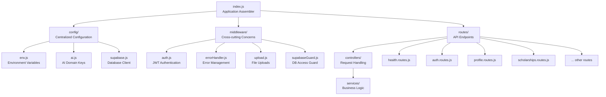
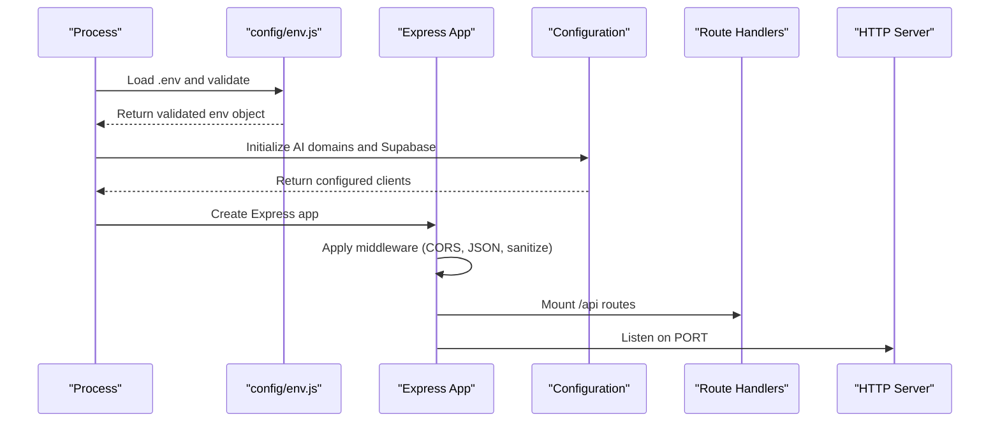
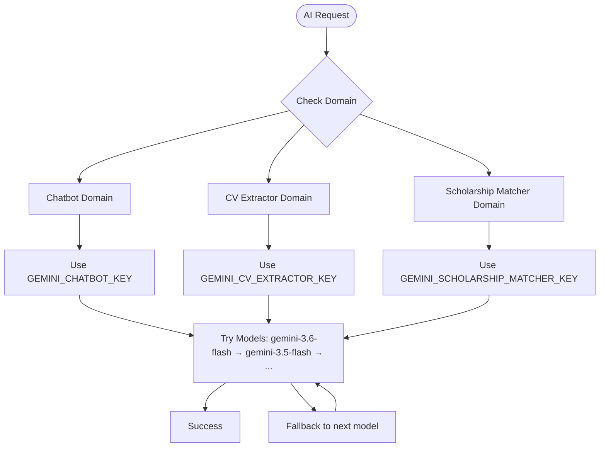
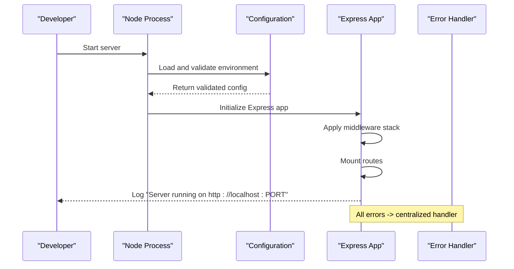
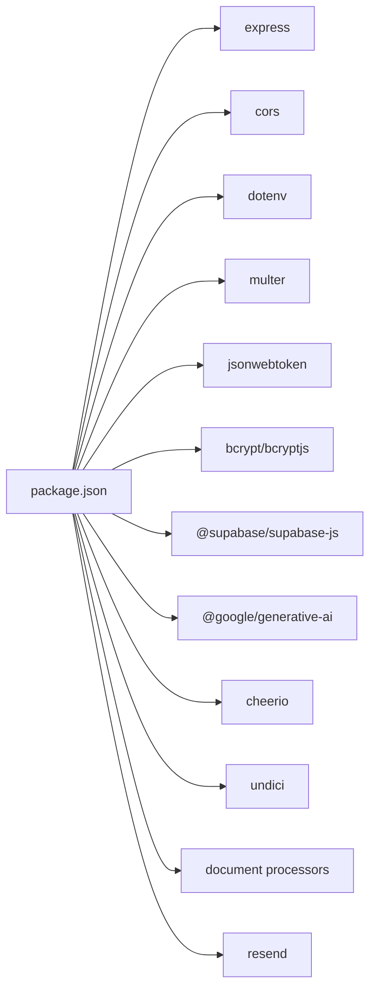

# Server Setup and Configuration

<cite>
**Referenced Files in This Document**
- [index.js](file://aischolarpath-backend-main/aischolarpath-backend-main/index.js)
- [env.js](file://aischolarpath-backend-main/aischolarpath-backend-main/config/env.js)
- [ai.js](file://aischolarpath-backend-main/aischolarpath-backend-main/config/ai.js)
- [supabase.js](file://aischolarpath-backend-main/aischolarpath-backend-main/config/supabase.js)
- [errorHandler.js](file://aischolarpath-backend-main/aischolarpath-backend-main/middleware/errorHandler.js)
- [auth.js](file://aischolarpath-backend-main/aischolarpath-backend-main/middleware/auth.js)
- [upload.js](file://aischolarpath-backend-main/aischolarpath-backend-main/middleware/upload.js)
- [validation.js](file://aischolarpath-backend-main/aischolarpath-backend-main/validation.js)
- [routes/index.js](file://aischolarpath-backend-main/aischolarpath-backend-main/routes/index.js)
- [health.routes.js](file://aischolarpath-backend-main/aischolarpath-backend-main/routes/health.routes.js)
- [auth.routes.js](file://aischolarpath-backend-main/aischolarpath-backend-main/routes/auth.routes.js)
- [package.json](file://aischolarpath-backend-main/aischolarpath-backend-main/package.json)
</cite>

## Update Summary
**Changes Made**
- Updated architecture description to reflect new modular MVC-S pattern
- Added comprehensive coverage of centralized configuration in config/ directory
- Documented domain-specific Gemini API keys (GEMINI_CHATBOT_KEY, GEMINI_CV_EXTRACTOR_KEY, GEMINI_SCHOLARSHIP_MATCHER_KEY)
- Updated environment variable validation to reflect new structure
- Added detailed middleware organization and route separation
- Enhanced security considerations for multi-domain AI key management

## Table of Contents
1. [Introduction](#introduction)
2. [Project Structure](#project-structure)
3. [Core Components](#core-components)
4. [Architecture Overview](#architecture-overview)
5. [Detailed Component Analysis](#detailed-component-analysis)
6. [Dependency Analysis](#dependency-analysis)
7. [Performance Considerations](#performance-considerations)
8. [Troubleshooting Guide](#troubleshooting-guide)
9. [Conclusion](#conclusion)
10. [Appendices](#appendices)

## Introduction
This document explains how the ScholarPathAI Express.js server is initialized using a modern modular MVC-S (Model-View-Controller-Service) architecture with centralized configuration. The server has been refactored from a single-file application to a well-organized structure with dedicated configuration files, middleware, routes, controllers, and services. It covers environment variable validation with domain-specific API keys, middleware setup (CORS, JSON parsing, file uploads with Multer), Supabase client configuration, global HTTP agent tuning via undici, security considerations for environment variables and TLS, connection pooling implications, and examples of proper startup procedures and error handling during initialization.

## Project Structure
The backend follows a clean MVC-S pattern with centralized configuration:

**Diagram sources**
- [index.js:1-82](file://aischolarpath-backend-main/aischolarpath-backend-main/index.js#L1-L82)
- [routes/index.js:1-32](file://aischolarpath-backend-main/aischolarpath-backend-main/routes/index.js#L1-L32)

**Section sources**
- [index.js:1-16](file://aischolarpath-backend-main/aischolarpath-backend-main/index.js#L1-L16)
- [routes/index.js:1-32](file://aischolarpath-backend-main/aischolarpath-backend-main/routes/index.js#L1-L32)
- [package.json:1-32](file://aischolarpath-backend-main/aischolarpath-backend-main/package.json#L1-L32)

## Core Components
- **Centralized Configuration**: Environment variables loaded once in `config/env.js` with domain-specific AI keys
- **Modular Middleware**: JWT authentication, error handling, file uploads, and Supabase guards
- **Domain-based Routes**: Separate route files for each feature area mounted under `/api`
- **Service Layer**: Business logic separated into dedicated service modules
- **Validation & Sanitization**: Input validation and XSS protection middleware
- **Supabase Integration**: Singleton client instance for database and storage operations
- **Global HTTP Agent**: Optimized network connections using undici

**Section sources**
- [config/env.js:1-50](file://aischolarpath-backend-main/aischolarpath-backend-main/config/env.js#L1-L50)
- [config/ai.js:1-83](file://aischolarpath-backend-main/aischolarpath-backend-main/config/ai.js#L1-L83)
- [config/supabase.js:1-20](file://aischolarpath-backend-main/aischolarpath-backend-main/config/supabase.js#L1-L20)
- [middleware/auth.js:1-26](file://aischolarpath-backend-main/aischolarpath-backend-main/middleware/auth.js#L1-L26)
- [middleware/errorHandler.js:1-22](file://aischolarpath-backend-main/aischolarpath-backend-main/middleware/errorHandler.js#L1-L22)
- [middleware/upload.js:1-10](file://aischolarpath-backend-main/aischolarpath-backend-main/middleware/upload.js#L1-L10)

## Architecture Overview
The server follows a clean separation of concerns with the following initialization flow:

**Diagram sources**
- [index.js:21-79](file://aischolarpath-backend-main/aischolarpath-backend-main/index.js#L21-L79)
- [config/env.js:6-49](file://aischolarpath-backend-main/aischolarpath-backend-main/config/env.js#L6-L49)
- [routes/index.js:12-31](file://aischolarpath-backend-main/aischolarpath-backend-main/routes/index.js#L12-L31)

## Detailed Component Analysis

### Application Assembly and Entry Point
The main `index.js` serves as a slim application assembler that wires together all components in the correct order:
- Loads and validates environment configuration
- Sets up CORS with specific allowed origins
- Configures static file serving for the frontend SPA
- Applies JSON body parsing and XSS sanitization
- Mounts all API routes under `/api`
- Handles unknown routes with JSON 404 responses
- Provides SPA fallback for non-API routes
- Implements centralized error handling

**Updated** The entry point is now significantly reduced (~80 lines) compared to the previous monolithic implementation, focusing solely on assembly and configuration.

**Section sources**
- [index.js:1-82](file://aischolarpath-backend-main/aischolarpath-backend-main/index.js#L1-L82)

### Centralized Environment Configuration
Environment variables are now managed through a centralized configuration system:

**Domain-Specific AI Keys**:
- `GEMINI_CHATBOT_KEY`: For chatbot and letter generation features
- `GEMINI_CV_EXTRACTOR_KEY`: For CV analysis and document processing  
- `GEMINI_SCHOLARSHIP_MATCHER_KEY`: For scholarship matching and smart agent analysis
- Legacy `GEMINI_API_KEY` fallback maintained for backward compatibility

**Other Configuration**:
- Database credentials (`SUPABASE_URL`, `SUPABASE_KEY`)
- Authentication secret (`JWT_SECRET`)
- Email service key (`RESEND_EMAIL_KEY`)
- Frontend URL for email links
- Serverless timeout budgets for Vercel deployment

**Section sources**
- [config/env.js:1-50](file://aischolarpath-backend-main/aischolarpath-backend-main/config/env.js#L1-L50)

### AI Configuration with Domain Isolation
The AI configuration provides isolated API keys per domain with automatic model fallback chains:

**Diagram sources**
- [config/ai.js:24-75](file://aischolarpath-backend-main/aischolarpath-backend-main/config/ai.js#L24-L75)

**Section sources**
- [config/ai.js:1-83](file://aischolarpath-backend-main/aischolarpath-backend-main/config/ai.js#L1-L83)

### Modular Middleware Stack
Middleware is organized into focused, reusable components:

**Authentication Middleware**:
- JWT token verification with configurable secret
- Attaches decoded user ID to request objects
- Returns appropriate 401/403 responses for invalid tokens

**Error Handling Middleware**:
- Centralized error catching for all routes
- JSON 404 responses for unknown API paths
- Consistent error response format

**File Upload Middleware**:
- In-memory storage for efficient streaming to Supabase
- No disk writes for security and performance

**Input Validation**:
- Lightweight validation utilities without external dependencies
- XSS sanitization middleware
- Rate limiting capabilities

**Section sources**
- [middleware/auth.js:1-26](file://aischolarpath-backend-main/aischolarpath-backend-main/middleware/auth.js#L1-L26)
- [middleware/errorHandler.js:1-22](file://aischolarpath-backend-main/aischolarpath-backend-main/middleware/errorHandler.js#L1-L22)
- [middleware/upload.js:1-10](file://aischolarpath-backend-main/aischolarpath-backend-main/middleware/upload.js#L1-L10)
- [validation.js:1-109](file://aischolarpath-backend-main/aischolarpath-backend-main/validation.js#L1-L109)

### Route Organization and Separation
Routes are organized by domain with clear separation of concerns:

**Health Routes**: Liveness checks and database connectivity tests
**Auth Routes**: User registration, login, and password management with rate limiting
**Profile Routes**: User profile management and CV upload functionality
**Scholarship Routes**: Scholarship discovery and matching
**University Routes**: University information and search
**Language Preparation Routes**: Language learning resources
**Attestation Routes**: Document attestation workflows
**Shortlist Routes**: Application shortlisting and management
**Application Routes**: Full application lifecycle management
**Document Routes**: File upload and processing
**Chat Routes**: AI-powered chatbot functionality
**Notification Routes**: User notification system
**Discovery Routes**: External data scraping and processing
**Roadmap Routes**: Career path planning
**Smart Agent Routes**: AI-driven recommendation engine

**Section sources**
- [routes/index.js:12-31](file://aischolarpath-backend-main/aischolarpath-backend-main/routes/index.js#L12-L31)
- [routes/health.routes.js:1-14](file://aischolarpath-backend-main/aischolarpath-backend-main/routes/health.routes.js#L1-L14)
- [routes/auth.routes.js:1-30](file://aischolarpath-backend-main/aischolarpath-backend-main/routes/auth.routes.js#L1-L30)

### Supabase Client Configuration
The Supabase client is configured as a singleton with graceful error handling:
- Creates client instance with environment variables
- Provides fallback values for development
- Exposes configuration status checking
- Logs initialization status for debugging

**Section sources**
- [config/supabase.js:1-20](file://aischolarpath-backend-main/aischolarpath-backend-main/config/supabase.js#L1-L20)

### Security Considerations
**Environment Variables**:
- Domain-specific AI keys prevent cross-domain quota exhaustion
- Graceful fallback to legacy keys maintains backward compatibility
- Required variables validated at startup with warning messages

**Authentication**:
- JWT-based authentication protects sensitive routes
- Token verification with configurable secrets
- Proper error handling for missing or invalid tokens

**Input Validation**:
- XSS sanitization applied to all JSON payloads
- Field-level validation with type checking
- Rate limiting for authentication endpoints

**File Uploads**:
- In-memory storage prevents disk access vulnerabilities
- Streaming directly to Supabase Storage
- No temporary file creation

**TLS Settings**:
- Process-level TLS certificate validation disabled for development
- Production deployments should enable strict TLS validation

**Section sources**
- [config/env.js:8-14](file://aischolarpath-backend-main/aischolarpath-backend-main/config/env.js#L8-L14)
- [config/ai.js:42-73](file://aischolarpath-backend-main/aischolarpath-backend-main/config/ai.js#L42-L73)
- [middleware/auth.js:8-23](file://aischolarpath-backend-main/aischolarpath-backend-main/middleware/auth.js#L8-L23)
- [validation.js:94-106](file://aischolarpath-backend-main/aischolarpath-backend-main/validation.js#L94-L106)

### Performance Characteristics
**Connection Pooling**:
- Global HTTP agent configuration for optimized network connections
- Connection limits and keep-alive settings for better throughput
- Timeout configurations for serverless environments

**Memory Management**:
- In-memory file uploads reduce disk I/O overhead
- Efficient streaming to cloud storage
- Memory usage monitoring and limits

**Database Access**:
- Singleton Supabase client reduces connection overhead
- Reusable client instances across requests
- Efficient query patterns and batch operations

**Section sources**
- [config/env.js:41-46](file://aischolarpath-backend-main/aischolarpath-backend-main/config/env.js#L41-L46)
- [middleware/upload.js:1-10](file://aischolarpath-backend-main/aischolarpath-backend-main/middleware/upload.js#L1-L10)
- [config/supabase.js:7-17](file://aischolarpath-backend-main/aischolarpath-backend-main/config/supabase.js#L7-L17)

### Examples of Startup Procedures and Error Handling
**Startup Procedure**:
1. Environment variables loaded and validated
2. AI domains initialized with their respective API keys
3. Supabase client created with error handling
4. Express app configured with middleware stack
5. Routes mounted under `/api` endpoint
6. Server starts listening on configured port

**Error Handling**:
- Missing environment variables trigger warnings but allow startup
- AI domain initialization failures logged but don't crash the server
- Unhandled errors caught by centralized error handler
- JSON 404 responses for unknown API routes

**Diagram sources**
- [index.js:21-79](file://aischolarpath-backend-main/aischolarpath-backend-main/index.js#L21-L79)
- [config/env.js:6-14](file://aischolarpath-backend-main/aischolarpath-backend-main/config/env.js#L6-L14)
- [middleware/errorHandler.js:14-19](file://aischolarpath-backend-main/aischolarpath-backend-main/middleware/errorHandler.js#L14-L19)

**Section sources**
- [index.js:21-79](file://aischolarpath-backend-main/aischolarpath-backend-main/index.js#L21-L79)
- [config/env.js:6-14](file://aischolarpath-backend-main/aischolarpath-backend-main/config/env.js#L6-L14)
- [middleware/errorHandler.js:14-19](file://aischolarpath-backend-main/aischolarpath-backend-main/middleware/errorHandler.js#L14-L19)

## Dependency Analysis
Key runtime dependencies used by the modular server:

**Core Framework**:
- `express`: Web framework for routing and middleware
- `cors`: Cross-origin request handling
- `dotenv`: Environment variable loading

**Authentication & Security**:
- `jsonwebtoken`: JWT token creation and verification
- `bcrypt`/`bcryptjs`: Password hashing utilities

**Database & Storage**:
- `@supabase/supabase-js`: Database and storage client
- `multer`: File upload handling with memory storage

**AI Services**:
- `@google/generative-ai`: Google Gemini API integration
- Domain-specific API key management

**Utilities**:
- `cheerio`: HTML parsing for web scraping
- `undici`: HTTP client and agent configuration
- `mammoth`/`pdf-parse`: Document processing
- `jspdf`: PDF generation
- `resend`: Email service integration

**Development**:
- `jest`: Testing framework

**Diagram sources**
- [package.json:8-24](file://aischolarpath-backend-main/aischolarpath-backend-main/package.json#L8-L24)

**Section sources**
- [package.json:1-32](file://aischolarpath-backend-main/aischolarpath-backend-main/package.json#L1-L32)

## Performance Considerations
**Configuration Optimization**:
- Domain-specific AI keys prevent quota exhaustion across features
- Model fallback chains automatically handle rate limiting
- Serverless budget configurations optimize for function execution limits

**Memory Management**:
- In-memory file uploads reduce disk I/O overhead
- Efficient streaming to cloud storage minimizes memory footprint
- Singleton client instances reduce resource allocation

**Network Optimization**:
- Global HTTP agent configuration improves connection reuse
- Timeout configurations prevent hanging requests
- Connection pooling for database and external APIs

**Scalability**:
- Stateless design supports horizontal scaling
- Centralized configuration enables easy deployment
- Modular architecture allows independent scaling of components

## Troubleshooting Guide
**Environment Configuration Issues**:
- Missing environment variables trigger warnings but allow startup
- Domain-specific AI keys fall back to legacy keys when not configured
- Supabase client initialization failures logged with helpful messages

**AI Service Problems**:
- Check domain-specific API keys are properly configured
- Model fallback chains automatically handle quota exhaustion
- Verify network connectivity to AI service endpoints

**Authentication Issues**:
- Ensure JWT_SECRET is properly configured
- Verify token expiration and signature validity
- Check CORS configuration for cross-origin requests

**File Upload Failures**:
- Confirm multipart/form-data content type
- Verify field names match expected values
- Check Supabase Storage bucket permissions

**Route Not Found Errors**:
- Unknown API routes return JSON 404 responses
- Verify route mounting order in routes/index.js
- Check for typos in route paths

**Section sources**
- [config/env.js:8-14](file://aischolarpath-backend-main/aischolarpath-backend-main/config/env.js#L8-L14)
- [config/ai.js:62-73](file://aischolarpath-backend-main/aischolarpath-backend-main/config/ai.js#L62-L73)
- [config/supabase.js:14-17](file://aischolarpath-backend-main/aischolarpath-backend-main/config/supabase.js#L14-L17)
- [middleware/errorHandler.js:10-19](file://aischolarpath-backend-main/aischolarpath-backend-main/middleware/errorHandler.js#L10-L19)

## Conclusion
The ScholarPathAI server has been successfully refactored to follow a modern MVC-S architecture with centralized configuration. The new structure provides better maintainability, scalability, and security while preserving all existing functionality. Key improvements include domain-specific AI key management, modular middleware organization, clean route separation, and robust error handling. The server maintains backward compatibility while providing a solid foundation for future enhancements and scaling requirements.

For production deployments, ensure proper environment variable configuration, enable strict TLS validation, implement comprehensive logging and monitoring, and consider adding additional security measures like input sanitization and rate limiting for public endpoints.

## Appendices

### Environment Variables Reference
**Required Variables**:
- `SUPABASE_URL`: Supabase project URL
- `SUPABASE_KEY`: Supabase service or anon key  
- `JWT_SECRET`: Secret used to sign and verify JWTs

**Optional Variables**:
- `PORT`: Server listening port (defaults to 3000)
- `NODE_ENV`: Environment mode (development/production)
- `VERCEL`: Platform detection flag for Vercel deployments

**AI Service Variables** (Domain-Specific):
- `GEMINI_CHATBOT_KEY`: API key for chatbot and letter generation
- `GEMINI_CV_EXTRACTOR_KEY`: API key for CV analysis and document processing
- `GEMINI_SCHOLARSHIP_MATCHER_KEY`: API key for scholarship matching and smart agent analysis
- `GEMINI_API_KEY`: Legacy fallback key (maintained for backward compatibility)

**Email Service Variables**:
- `RESEND_EMAIL_KEY`: Primary email service key
- `RESEND_API_KEY`: Legacy email service key (fallback)

**Frontend Configuration**:
- `FRONTEND_URL`: Base URL for email links and redirects

**Serverless Configuration**:
- `SERVERLESS_BUDGET_MS`: Total request timeout budget (default: 50000ms)
- `AI_REQUEST_TIMEOUT_MS`: Individual AI request timeout (default: 25000ms)
- `SCRAPE_TIMEOUT_MS`: Web scraping request timeout (default: 12000ms)

**Section sources**
- [config/env.js:16-46](file://aischolarpath-backend-main/aischolarpath-backend-main/config/env.js#L16-L46)
- [index.js:74-78](file://aischolarpath-backend-main/aischolarpath-backend-main/index.js#L74-L78)

### Configuration File Structure
**config/env.js**: Environment variable loading and validation
**config/ai.js**: AI service configuration with domain isolation
**config/supabase.js**: Database client initialization

**Section sources**
- [config/env.js:1-50](file://aischolarpath-backend-main/aischolarpath-backend-main/config/env.js#L1-L50)
- [config/ai.js:1-83](file://aischolarpath-backend-main/aischolarpath-backend-main/config/ai.js#L1-L83)
- [config/supabase.js:1-20](file://aischolarpath-backend-main/aischolarpath-backend-main/config/supabase.js#L1-L20)