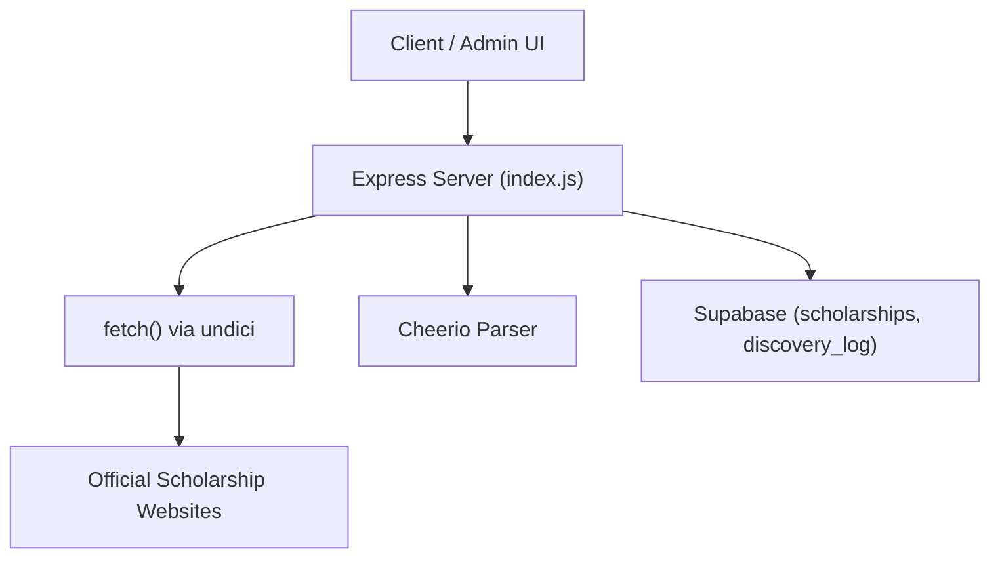
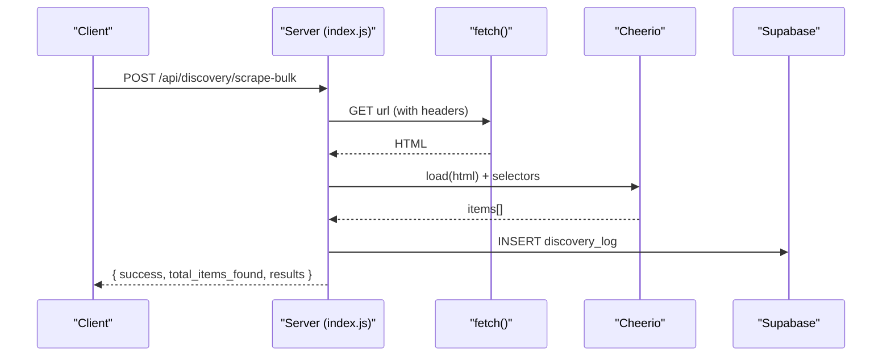
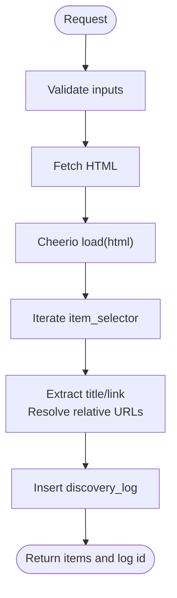
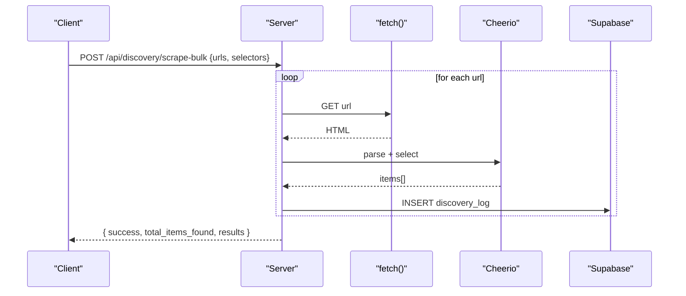
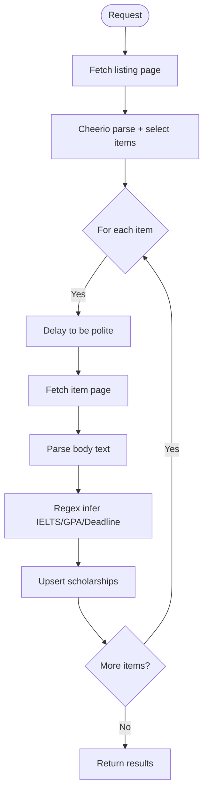
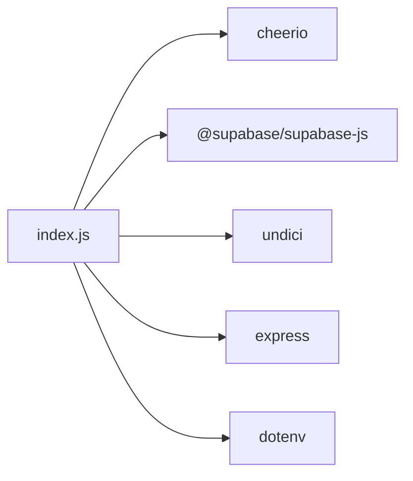

# Web Scraping System

<cite>
**Referenced Files in This Document**
- [index.js](file://aischolarpath-backend-main/aischolarpath-backend-main/index.js)
- [package.json](file://aischolarpath-backend-main/aischolarpath-backend-main/package.json)
</cite>

## Table of Contents
1. [Introduction](#introduction)
2. [Project Structure](#project-structure)
3. [Core Components](#core-components)
4. [Architecture Overview](#architecture-overview)
5. [Detailed Component Analysis](#detailed-component-analysis)
6. [Dependency Analysis](#dependency-analysis)
7. [Performance Considerations](#performance-considerations)
8. [Troubleshooting Guide](#troubleshooting-guide)
9. [Conclusion](#conclusion)
10. [Appendices](#appendices)

## Introduction
This document explains the web scraping system used by ScholarPathAI to extract scholarship data from official websites. It covers the scraping architecture, selector strategies, HTML parsing with Cheerio, bulk scraping capabilities, error handling, rate limiting, ethical scraping practices, dynamic content considerations, data normalization for database storage, retry mechanisms, and logging for debugging.

## Project Structure
The scraping functionality is implemented within a single Express server file that exposes multiple discovery endpoints. The backend uses:
- Node’s fetch API for HTTP requests
- Cheerio for HTML parsing and CSS selector-based extraction
- Supabase client for storing scraped results and logs
- Undici Agent for connection pooling and timeouts

**Diagram sources**
- [index.js:1183-1243](file://aischolarpath-backend-main/aischolarpath-backend-main/index.js#L1183-L1243)
- [index.js:1259-1309](file://aischolarpath-backend-main/aischolarpath-backend-main/index.js#L1259-L1309)
- [index.js:1311-1390](file://aischolarpath-backend-main/aischolarpath-backend-main/index.js#L1311-L1390)
- [index.js:1392-1439](file://aischolarpath-backend-main/aischolarpath-backend-main/index.js#L1392-L1439)
- [index.js:1441-1493](file://aischolarpath-backend-main/aischolarpath-backend-main/index.js#L1441-L1493)

**Section sources**
- [index.js:1-30](file://aischolarpath-backend-main/aischolarpath-backend-main/index.js#L1-L30)
- [package.json:1-14](file://aischolarpath-backend-main/aischolarpath-backend-main/package.json#L1-L14)

## Core Components
- Discovery Endpoints:
  - Generic scraper for listing pages using CSS selectors
  - Bulk scraper for multiple URLs with shared selectors
  - Scrape-and-structure endpoint that extracts eligibility criteria via pattern matching
  - Official page scraper for direct scholarship pages
  - Bulk official page scraper
- Data Persistence:
  - discovery_log table records each scrape attempt, status, and raw snapshots
  - scholarships table stores normalized entries with eligibility criteria, deadlines, and source URLs
- Rate Limiting and Politeness:
  - Fixed delays between requests to avoid overwhelming target sites
- Error Handling and Logging:
  - Per-request try/catch blocks write failures to discovery_log
  - Centralized Express error handler for unhandled errors

**Section sources**
- [index.js:1183-1243](file://aischolarpath-backend-main/aischolarpath-backend-main/index.js#L1183-L1243)
- [index.js:1259-1309](file://aischolarpath-backend-main/aischolarpath-backend-main/index.js#L1259-L1309)
- [index.js:1311-1390](file://aischolarpath-backend-main/aischolarpath-backend-main/index.js#L1311-L1390)
- [index.js:1392-1439](file://aischolarpath-backend-main/aischolarpath-backend-main/index.js#L1392-L1439)
- [index.js:1441-1493](file://aischolarpath-backend-main/aischolarpath-backend-main/index.js#L1441-L1493)
- [index.js:1527-1531](file://aischolarpath-backend-main/aischolarpath-backend-main/index.js#L1527-L1531)

## Architecture Overview
The scraping flow follows these steps:
1. Receive request with URL(s) and optional selectors
2. Fetch HTML via fetch with a realistic User-Agent header
3. Parse HTML with Cheerio using provided CSS selectors
4. Extract items (titles and links), resolve relative URLs
5. Optionally parse text content to infer eligibility criteria and deadlines
6. Persist results to scholarships and/or discovery_log
7. Return structured results or errors

**Diagram sources**
- [index.js:1259-1309](file://aischolarpath-backend-main/aischolarpath-backend-main/index.js#L1259-L1309)

## Detailed Component Analysis

### Generic Scraper: /api/discovery/scrape
- Purpose: Fetch a listing page and extract items using CSS selectors
- Inputs: url, item_selector, optional title_selector, link_selector
- Behavior:
  - Requests page with browser-like headers
  - Parses with Cheerio and iterates over item_selector matches
  - Extracts title and link; resolves relative links to absolute
  - Logs result to discovery_log with status and snapshot
- Output: items found and log entry

**Diagram sources**
- [index.js:1183-1243](file://aischolarpath-backend-main/aischolarpath-backend-main/index.js#L1183-L1243)

**Section sources**
- [index.js:1183-1243](file://aischolarpath-backend-main/aischolarpath-backend-main/index.js#L1183-L1243)

### Bulk Scraper: /api/discovery/scrape-bulk
- Purpose: Scrape multiple URLs with the same selectors in one call
- Inputs: urls[], item_selector, optional title_selector, link_selector
- Behavior:
  - Iterates over URLs with a fixed delay between requests
  - For each URL: fetch, parse, extract items, log outcome
  - Aggregates total items found across all URLs
- Output: per-URL results including items_found and log_id or error

**Diagram sources**
- [index.js:1259-1309](file://aischolarpath-backend-main/aischolarpath-backend-main/index.js#L1259-L1309)

**Section sources**
- [index.js:1259-1309](file://aischolarpath-backend-main/aischolarpath-backend-main/index.js#L1259-L1309)

### Scrape-and-Structure: /api/discovery/scrape-and-structure
- Purpose: Scrape a listing page and auto-structure extracted items into scholarship records
- Inputs: listing_url, item_selector, country, optional max_items
- Behavior:
  - Fetches listing page and extracts items (title, link)
  - Visits each item page with a polite delay
  - Parses body text to infer IELTS, GPA/CGPA, and deadline using regex patterns
  - Upserts scholarships with eligibility_criteria, deadline, apply_url, source_url, status 'under_review'
  - Returns per-item results indicating saved status, extracted fields, and any errors

**Diagram sources**
- [index.js:1311-1390](file://aischolarpath-backend-main/aischolarpath-backend-main/index.js#L1311-L1390)

**Section sources**
- [index.js:1311-1390](file://aischolarpath-backend-main/aischolarpath-backend-main/index.js#L1311-L1390)

### Official Page Scraper: /api/discovery/scrape-official
- Purpose: Scrape a single official scholarship page directly
- Inputs: title, url, country
- Behavior:
  - Fetches page, parses with Cheerio, reads body text
  - Infers IELTS, GPA/CGPA, and deadline via regex
  - Upserts scholarship record with status 'under_review'
  - Returns saved record and extracted fields

**Section sources**
- [index.js:1392-1439](file://aischolarpath-backend-main/aischolarpath-backend-main/index.js#L1392-L1439)

### Bulk Official Scraper: /api/discovery/scrape-official-bulk
- Purpose: Scrape multiple official scholarship pages in one request
- Inputs: array of {title, url, country}
- Behavior:
  - Iterates with a fixed delay between requests
  - For each: fetch, parse, infer fields, upsert scholarship
  - Returns per-item results with saved status and errors

**Section sources**
- [index.js:1441-1493](file://aischolarpath-backend-main/aischolarpath-backend-main/index.js#L1441-L1493)

### Pending Review Endpoint: /api/scholarships/pending/review
- Purpose: Retrieve scholarships marked 'under_review' for manual verification
- Behavior: Queries Supabase for pending records

**Section sources**
- [index.js:1495-1505](file://aischolarpath-backend-main/aischolarpath-backend-main/index.js#L1495-L1505)

### Approve Endpoint: /api/scholarships/:id/approve
- Purpose: Mark a scholarship active after manual review
- Behavior: Updates status to 'active', last_verified_at, and optionally eligibility_criteria/deadline

**Section sources**
- [index.js:1508-1525](file://aischolarpath-backend-main/aischolarpath-backend-main/index.js#L1508-L1525)

## Dependency Analysis
Key runtime dependencies enabling scraping:
- express: HTTP server and routing
- cheerio: HTML parsing and CSS selectors
- @supabase/supabase-js: Database persistence
- undici: HTTP client with global agent configuration for connection limits and timeouts
- dotenv: Environment variable loading

**Diagram sources**
- [package.json:1-14](file://aischolarpath-backend-main/aischolarpath-backend-main/package.json#L1-L14)
- [index.js:1-30](file://aischolarpath-backend-main/aischolarpath-backend-main/index.js#L1-L30)

**Section sources**
- [package.json:1-14](file://aischolarpath-backend-main/aischolarpath-backend-main/package.json#L1-L14)
- [index.js:1-30](file://aischolarpath-backend-main/aischolarpath-backend-main/index.js#L1-L30)

## Performance Considerations
- Connection Pooling and Timeouts:
  - Global undici Agent configured with connection limits and keep-alive settings to manage concurrent outbound requests efficiently
- Request Delays:
  - Fixed delays between requests in bulk flows to reduce server load and respect target site capacity
- Selector Efficiency:
  - Use specific CSS selectors to minimize DOM traversal overhead
- Pagination Limits:
  - scrape-and-structure supports a max_items parameter to cap processing time and resource usage

[No sources needed since this section provides general guidance]

## Troubleshooting Guide
Common issues and how to diagnose them:
- Network Errors:
  - Non-OK responses are thrown as errors; check discovery_log for status 'failed' and raw_snapshot containing error messages
- Selector Mismatches:
  - If no items are found, verify item_selector, title_selector, and link_selector against the target site structure
- Parsing Failures:
  - Regex-based inference may miss fields if site copy changes; inspect raw_snapshot and adjust patterns accordingly
- Rate Limiting:
  - Increase delays between requests or reduce batch sizes when encountering throttling
- Authentication:
  - Many discovery endpoints require authentication; ensure valid token is passed

Logging and visibility:
- Each scrape writes to discovery_log with source_url, status, and raw_snapshot
- View recent logs via /api/discovery/logs
- Centralized error handler logs unhandled exceptions

**Section sources**
- [index.js:1245-1257](file://aischolarpath-backend-main/aischolarpath-backend-main/index.js#L1245-L1257)
- [index.js:1527-1531](file://aischolarpath-backend-main/aischolarpath-backend-main/index.js#L1527-L1531)

## Conclusion
ScholarPathAI’s scraping system provides flexible, selector-driven extraction from official scholarship websites, with robust logging and safe batching. It normalizes scraped content into structured scholarship records and maintains an audit trail through discovery logs. While current parsing relies on regex heuristics, the modular design allows easy updates to selectors and patterns as target sites evolve. Ethical scraping practices—such as polite delays and respecting site terms—are embedded into the workflow.

[No sources needed since this section summarizes without analyzing specific files]

## Appendices

### Selector Strategies and Examples
- Listing pages typically use repeated containers for items; use item_selector to match each container
- Title extraction:
  - If title lives inside the item container, use title_selector to find it; otherwise fall back to container text
- Link extraction:
  - Use link_selector to find anchor href; resolve relative URLs to absolute using base URL
- Example patterns:
  - item_selector: ".scholarship-item"
  - title_selector: "h3.title"
  - link_selector: "a.apply-link"

[No sources needed since this section provides conceptual guidance]

### Data Normalization and Storage
- Eligibility Criteria:
  - Inferred fields include min_ielts and min_cgpa; required_degree is reserved for future expansion
- Deadline Extraction:
  - Dates are captured as strings when detected; stored in deadline field
- Source Tracking:
  - apply_url and source_url preserve original links for traceability
- Status Workflow:
  - Newly scraped entries are marked 'under_review'; approved entries become 'active'

**Section sources**
- [index.js:1311-1390](file://aischolarpath-backend-main/aischolarpath-backend-main/index.js#L1311-L1390)
- [index.js:1392-1439](file://aischolarpath-backend-main/aischolarpath-backend-main/index.js#L1392-L1439)
- [index.js:1441-1493](file://aischolarpath-backend-main/aischolarpath-backend-main/index.js#L1441-L1493)
- [index.js:1495-1525](file://aischolarpath-backend-main/aischolarpath-backend-main/index.js#L1495-L1525)

### Retry Mechanisms and Logging
- Current behavior:
  - No automatic retries; failed requests are logged with error details in discovery_log
- Recommendations:
  - Implement exponential backoff and retry logic for transient network errors
  - Add circuit breaker patterns to avoid cascading failures during outages
  - Enhance logs with correlation IDs for request tracing

**Section sources**
- [index.js:1259-1309](file://aischolarpath-backend-main/aischolarpath-backend-main/index.js#L1259-L1309)
- [index.js:1311-1390](file://aischolarpath-backend-main/aischolarpath-backend-main/index.js#L1311-L1390)
- [index.js:1392-1439](file://aischolarpath-backend-main/aischolarpath-backend-main/index.js#L1392-L1439)
- [index.js:1441-1493](file://aischolarpath-backend-main/aischolarpath-backend-main/index.js#L1441-L1493)

### Ethical Scraping Practices
- Identify yourself:
  - Include a descriptive User-Agent header
- Respect robots.txt and terms of service:
  - Ensure scraping aligns with site policies
- Be polite:
  - Use delays and limit concurrency
- Minimize impact:
  - Cache where possible and avoid unnecessary re-scraping

[No sources needed since this section provides general guidance]

### Handling Dynamic Content
- Current approach:
  - Static HTML parsing with Cheerio; suitable for server-rendered pages
- For JavaScript-heavy sites:
  - Consider headless browsers (e.g., Puppeteer) or services that render JS before parsing
  - Alternatively, prefer official APIs when available

[No sources needed since this section provides general guidance]