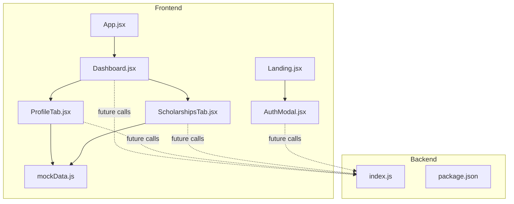
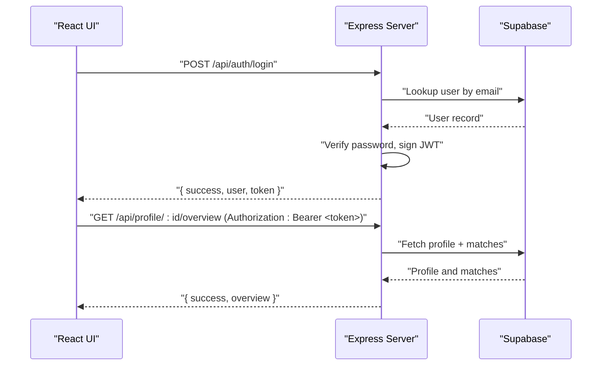
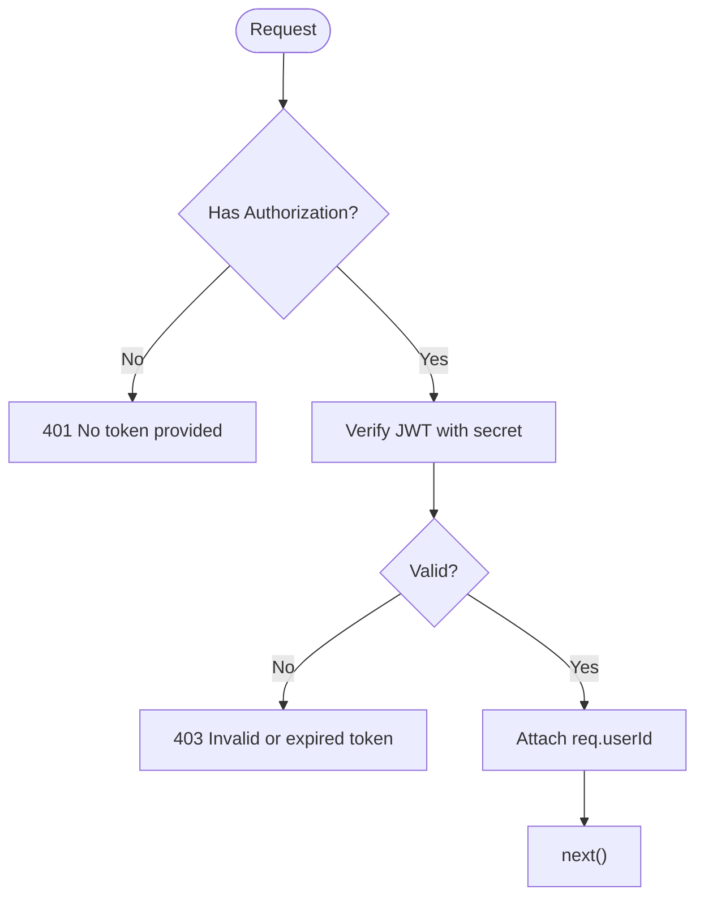
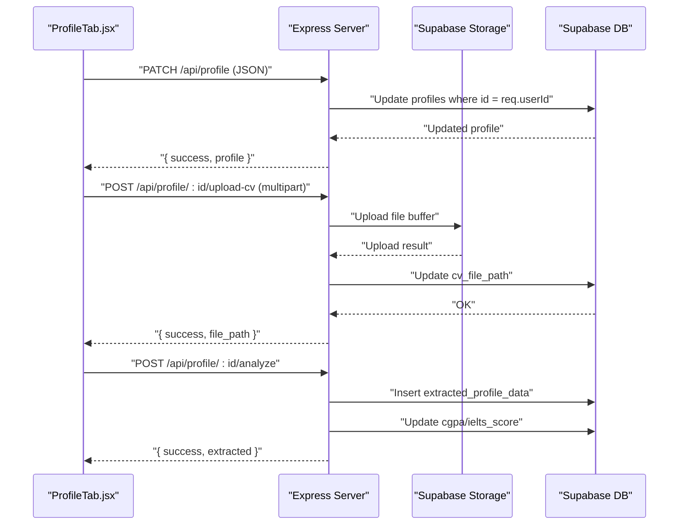
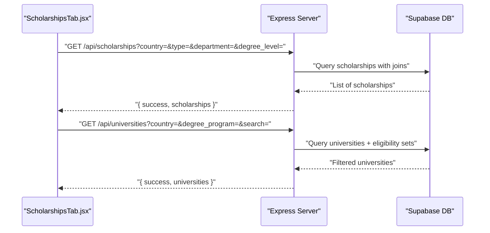
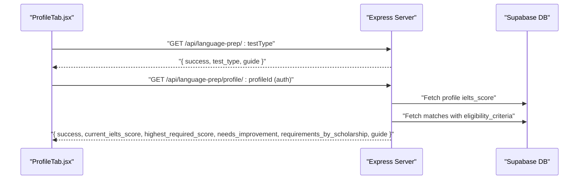
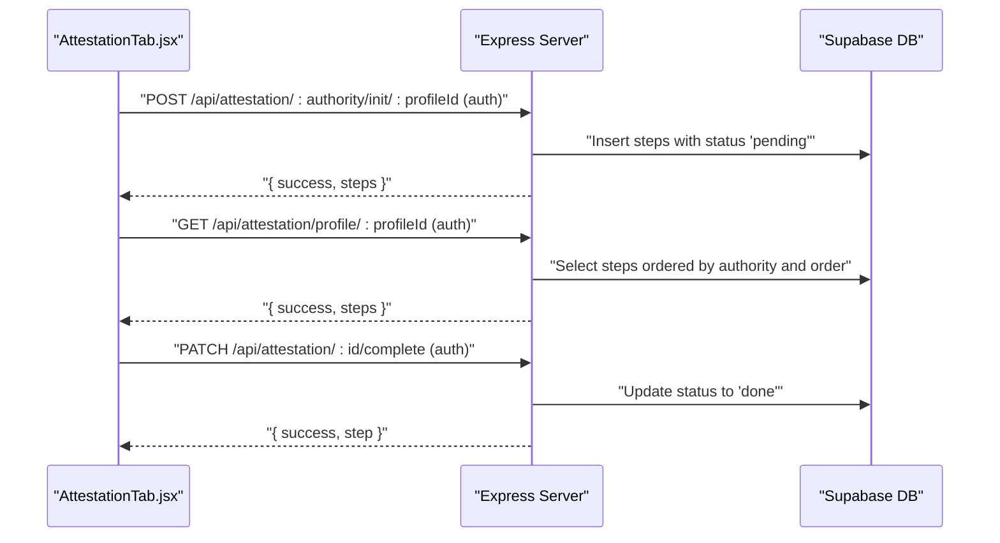
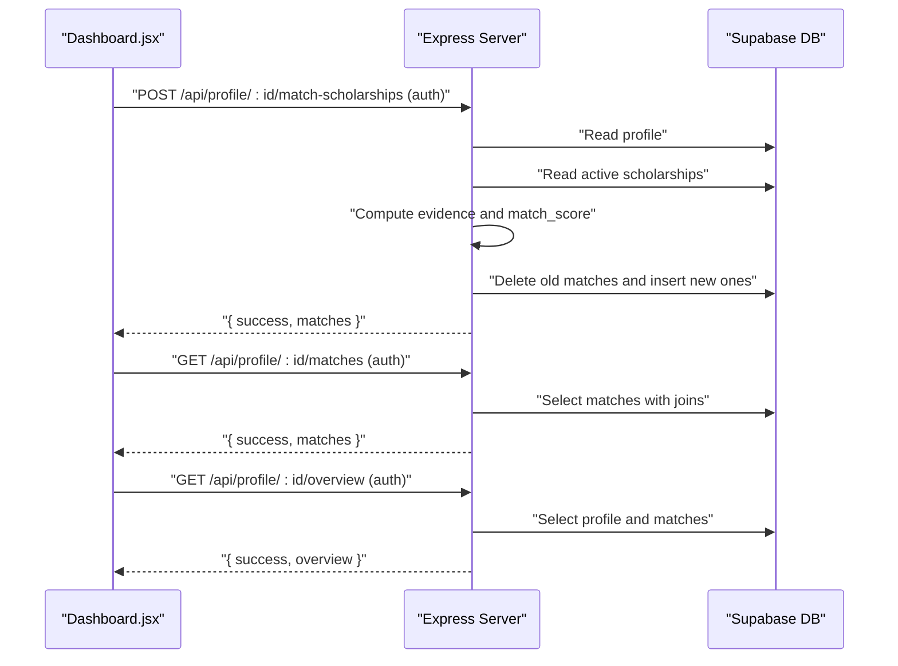
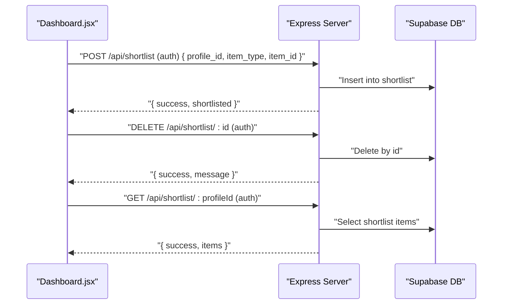
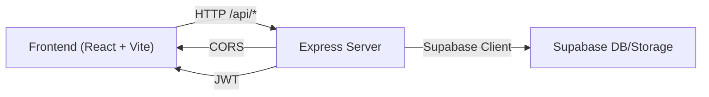

# API Communication Patterns

<cite>
**Referenced Files in This Document**
- [index.js](file://aischolarpath-backend-main/aischolarpath-backend-main/index.js)
- [package.json (backend)](file://aischolarpath-backend-main/aischolarpath-backend-main/package.json)
- [App.jsx](file://scholarpath-frontend (2)/scholarpath/src/App.jsx)
- [Dashboard.jsx](file://scholarpath-frontend (2)/scholarpath/src/pages/Dashboard.jsx)
- [ProfileTab.jsx](file://scholarpath-frontend (2)/scholarpath/src/pages/ProfileTab.jsx)
- [ScholarshipsTab.jsx](file://scholarpath-frontend (2)/scholarpath/src/pages/ScholarshipsTab.jsx)
- [AuthModal.jsx](file://scholarpath-frontend (2)/scholarpath/src/components/AuthModal.jsx)
- [Landing.jsx](file://scholarpath-frontend (2)/scholarpath/src/pages/Landing.jsx)
- [mockData.js](file://scholarpath-frontend (2)/scholarpath/src/data/mockData.js)
</cite>

## Table of Contents
1. Introduction
2. Project Structure
3. Core Components
4. Architecture Overview
5. Detailed Component Analysis
6. Dependency Analysis
7. Performance Considerations
8. Troubleshooting Guide
9. Conclusion

## Introduction
This document explains the API communication patterns between the React frontend and the Express backend for ScholarPath AI. It covers how the Dashboard and related components are designed to make HTTP requests, handle responses, manage loading states, and transform data between frontend models and backend schemas. It also documents authentication middleware, request validation, error handling strategies, caching and performance techniques, and provides examples for profile updates, scholarship matching, and file uploads.

## Project Structure
The project consists of:
- A React frontend that currently renders pages using local mock data and is structured to be wired to a backend later.
- An Express backend that exposes REST endpoints for authentication, profile management, scholarships, universities, language preparation, attestation tracking, shortlisting, and dashboard overview.

**Diagram sources**
- [App.jsx:1-15](file://scholarpath-frontend (2)/scholarpath/src/App.jsx#L1-L15)
- [Dashboard.jsx:1-187](file://scholarpath-frontend (2)/scholarpath/src/pages/Dashboard.jsx#L1-L187)
- [ProfileTab.jsx:1-232](file://scholarpath-frontend (2)/scholarpath/src/pages/ProfileTab.jsx#L1-L232)
- [ScholarshipsTab.jsx:1-139](file://scholarpath-frontend (2)/scholarpath/src/pages/ScholarshipsTab.jsx#L1-L139)
- [AuthModal.jsx:1-84](file://scholarpath-frontend (2)/scholarpath/src/components/AuthModal.jsx#L1-L84)
- [Landing.jsx:1-211](file://scholarpath-frontend (2)/scholarpath/src/pages/Landing.jsx#L1-L211)
- [mockData.js:1-349](file://scholarpath-frontend (2)/scholarpath/src/data/mockData.js#L1-L349)
- [index.js:1-800](file://aischolarpath-backend-main/aischolarpath-backend-main/index.js#L1-L800)
- [package.json (backend):1-14](file://aischolarpath-backend-main/aischolarpath-backend-main/package.json#L1-L14)

**Section sources**
- [App.jsx:1-15](file://scholarpath-frontend (2)/scholarpath/src/App.jsx#L1-L15)
- [Dashboard.jsx:1-187](file://scholarpath-frontend (2)/scholarpath/src/pages/Dashboard.jsx#L1-L187)
- [index.js:1-800](file://aischolarpath-backend-main/aischolarpath-backend-main/index.js#L1-L800)
- [package.json (backend):1-14](file://aischolarpath-backend-main/aischolarpath-backend-main/package.json#L1-L14)

## Core Components
- Backend server entrypoint defines routes, middleware, and Supabase integration.
- Frontend pages are organized by feature tabs and currently use mock data; they are ready to integrate with backend endpoints.

Key responsibilities:
- Authentication and authorization via JWT middleware on protected routes.
- Profile CRUD and CV upload/analysis.
- Scholarship and university listing with filters.
- Language prep guidance and personalized recommendations.
- Attestation step tracking per authority.
- Shortlist management.
- Dashboard overview aggregation.

**Section sources**
- [index.js:31-48](file://aischolarpath-backend-main/aischolarpath-backend-main/index.js#L31-L48)
- [index.js:69-188](file://aischolarpath-backend-main/aischolarpath-backend-main/index.js#L69-L188)
- [index.js:189-288](file://aischolarpath-backend-main/aischolarpath-backend-main/index.js#L189-L288)
- [index.js:289-435](file://aischolarpath-backend-main/aischolarpath-backend-main/index.js#L289-L435)
- [index.js:437-517](file://aischolarpath-backend-main/aischolarpath-backend-main/index.js#L437-L517)
- [index.js:518-573](file://aischolarpath-backend-main/aischolarpath-backend-main/index.js#L518-L573)
- [index.js:574-749](file://aischolarpath-backend-main/aischolarpath-backend-main/index.js#L574-L749)
- [index.js:750-800](file://aischolarpath-backend-main/aischolarpath-backend-main/index.js#L750-L800)

## Architecture Overview
The system follows a standard client-server pattern:
- The React app will call REST endpoints under /api.
- The Express server validates requests, enforces authentication, queries Supabase, and returns JSON responses.
- Protected routes require a valid JWT in the Authorization header.

**Diagram sources**
- [index.js:518-573](file://aischolarpath-backend-main/aischolarpath-backend-main/index.js#L518-L573)
- [index.js:693-749](file://aischolarpath-backend-main/aischolarpath-backend-main/index.js#L693-L749)

## Detailed Component Analysis

### Authentication Middleware and Auth Endpoints
- The server uses an authenticateToken middleware to validate JWTs from the Authorization header and attach the decoded user id to the request.
- Auth endpoints provide signup and login flows, hashing passwords and issuing JWTs.

**Diagram sources**
- [index.js:31-47](file://aischolarpath-backend-main/aischolarpath-backend-main/index.js#L31-L47)

**Section sources**
- [index.js:31-47](file://aischolarpath-backend-main/aischolarpath-backend-main/index.js#L31-L47)
- [index.js:518-573](file://aischolarpath-backend-main/aischolarpath-backend-main/index.js#L518-L573)

### Profile Management and CV Upload/Analysis
- Update profile fields for the authenticated user.
- Retrieve profile by id with authorization checks.
- Upload a CV to storage and persist the file path to the profile.
- Analyze CV endpoint stores extracted data and updates profile fields.

**Diagram sources**
- [index.js:69-188](file://aischolarpath-backend-main/aischolarpath-backend-main/index.js#L69-L188)

**Section sources**
- [index.js:69-188](file://aischolarpath-backend-main/aischolarpath-backend-main/index.js#L69-L188)

### Scholarships and Universities
- List scholarships with optional filters (country, type, department, degree level).
- Get a single scholarship by id.
- List universities with filters and include those eligible via country-wide scholarships.
- Get a single university by id.

**Diagram sources**
- [index.js:189-288](file://aischolarpath-backend-main/aischolarpath-backend-main/index.js#L189-L288)

**Section sources**
- [index.js:189-288](file://aischolarpath-backend-main/aischolarpath-backend-main/index.js#L189-L288)

### Language Preparation and Personalized Guidance
- Static guides for IELTS, TOEFL, PTE.
- Personalized guide comparing current score against matched scholarship requirements.

**Diagram sources**
- [index.js:289-402](file://aischolarpath-backend-main/aischolarpath-backend-main/index.js#L289-L402)

**Section sources**
- [index.js:289-402](file://aischolarpath-backend-main/aischolarpath-backend-main/index.js#L289-L402)

### Attestation Tracking
- Initialize tracked steps per authority based on static guides.
- Fetch steps for a profile.
- Mark a step as done.

**Diagram sources**
- [index.js:437-517](file://aischolarpath-backend-main/aischolarpath-backend-main/index.js#L437-L517)

**Section sources**
- [index.js:437-517](file://aischolarpath-backend-main/aischolarpath-backend-main/index.js#L437-L517)

### Matching Engine and Dashboard Overview
- Run matching for a profile against active scholarships, compute evidence and match scores, store results.
- Retrieve stored matches sorted by score.
- Compute dashboard overview including profile completeness and summary metrics.

**Diagram sources**
- [index.js:574-749](file://aischolarpath-backend-main/aischolarpath-backend-main/index.js#L574-L749)

**Section sources**
- [index.js:574-749](file://aischolarpath-backend-main/aischolarpath-backend-main/index.js#L574-L749)

### Shortlist Management
- Add/remove items from shortlist and retrieve full shortlist with details.

**Diagram sources**
- [index.js:750-800](file://aischolarpath-backend-main/aischolarpath-backend-main/index.js#L750-L800)

**Section sources**
- [index.js:750-800](file://aischolarpath-backend-main/aischolarpath-backend-main/index.js#L750-L800)

### Frontend Data Layer and Integration Points
- Current state: All pages read from mockData.js and render locally.
- Integration plan: Replace local filtering and display logic with calls to backend endpoints, map response shapes to component props, and manage loading/error states.

Example mapping points:
- ScholarshipsTab: Map backend scholarships list to card components.
- ProfileTab: Map profile fields and checklist to form inputs and document statuses.
- Dashboard: Use overview and matches endpoints to populate summary cards.

**Section sources**
- [Dashboard.jsx:1-187](file://scholarpath-frontend (2)/scholarpath/src/pages/Dashboard.jsx#L1-L187)
- [ProfileTab.jsx:1-232](file://scholarpath-frontend (2)/scholarpath/src/pages/ProfileTab.jsx#L1-L232)
- [ScholarshipsTab.jsx:1-139](file://scholarpath-frontend (2)/scholarpath/src/pages/ScholarshipsTab.jsx#L1-L139)
- [mockData.js:1-349](file://scholarpath-frontend (2)/scholarpath/src/data/mockData.js#L1-L349)

## Dependency Analysis
- Backend dependencies include Express, CORS, dotenv, bcrypt, jsonwebtoken, multer, undici, cheerio, and Supabase client.
- Frontend dependencies include React, React Router DOM, Vite tooling, Tailwind CSS, and PostCSS.

**Diagram sources**
- [package.json (backend):1-14](file://aischolarpath-backend-main/aischolarpath-backend-main/package.json#L1-L14)

**Section sources**
- [package.json (backend):1-14](file://aischolarpath-backend-main/aischolarpath-backend-main/package.json#L1-L14)

## Performance Considerations
- Connection pooling and timeouts: The backend configures a global dispatcher with connection limits and keep-alive settings to optimize outbound requests.
- Request payload parsing: JSON body parsing is enabled for all routes.
- File uploads: Multer memory storage is used for uploads; consider streaming for large files.
- Query optimization: Backend queries select only needed fields and filter early; ensure indexes exist on frequently filtered columns (e.g., country, status).
- Caching strategy:
  - Frontend: Implement in-memory caches or localStorage for static guides and lists (e.g., scholarships, universities) with TTL-based invalidation.
  - Backend: Consider Redis or in-process cache for expensive computations like matching runs.
- Debouncing:
  - Frontend: Debounce search/filter inputs (e.g., universities search) before triggering network requests.
- Pagination and limiting:
  - Backend: Limit results (e.g., universities limited to top N) to reduce payload size.
- Error resilience:
  - Frontend: Retry failed requests with exponential backoff for transient errors.
  - Backend: Return consistent error envelopes with actionable messages.

[No sources needed since this section provides general guidance]

## Troubleshooting Guide
Common issues and resolutions:
- Missing environment variables at startup: The server exits if required env vars are not set. Ensure SUPABASE_URL, SUPABASE_KEY, and JWT_SECRET are configured.
- Authentication failures:
  - 401 when no token is provided.
  - 403 when token is invalid/expired.
  - Ensure Authorization header includes "Bearer <token>".
- Authorization mismatches:
  - Routes compare req.userId with requested ids; ensure the correct user context is used.
- Database errors:
  - Supabase errors return 500 with error messages; log and surface user-friendly messages.
- File upload issues:
  - Validate presence of multipart file; handle storage errors and update failures.
- Validation errors:
  - Input validation returns 400 with descriptive messages; enforce required fields on both frontend and backend.

**Section sources**
- [index.js:4-10](file://aischolarpath-backend-main/aischolarpath-backend-main/index.js#L4-L10)
- [index.js:31-47](file://aischolarpath-backend-main/aischolarpath-backend-main/index.js#L31-L47)
- [index.js:69-188](file://aischolarpath-backend-main/aischolarpath-backend-main/index.js#L69-L188)
- [index.js:518-573](file://aischolarpath-backend-main/aischolarpath-backend-main/index.js#L518-L573)

## Conclusion
The backend provides a robust set of REST endpoints for authentication, profile management, scholarships, universities, language preparation, attestation tracking, shortlisting, and dashboard overview. The frontend is structured around feature tabs and currently uses mock data; it can be integrated by calling these endpoints, mapping responses to component state, and managing loading and error states. Adopting caching, debouncing, and retry strategies will improve responsiveness and resilience. Consistent error envelopes and strict authentication middleware ensure secure and predictable API behavior.