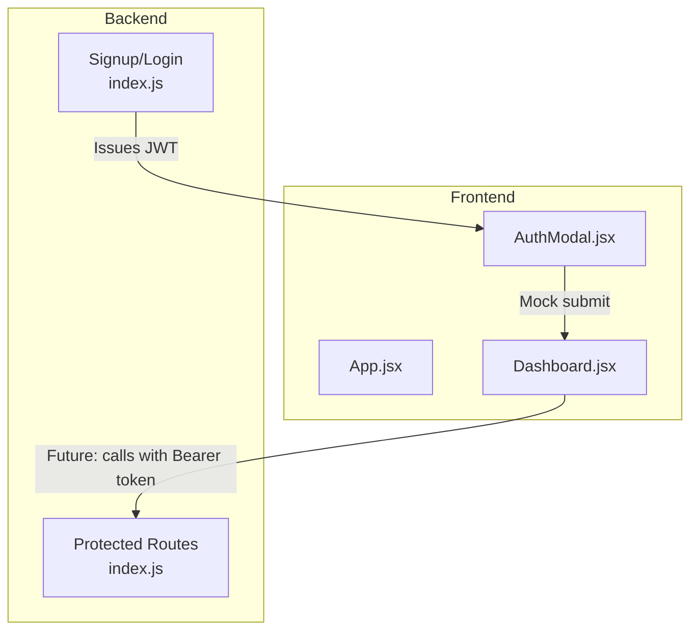
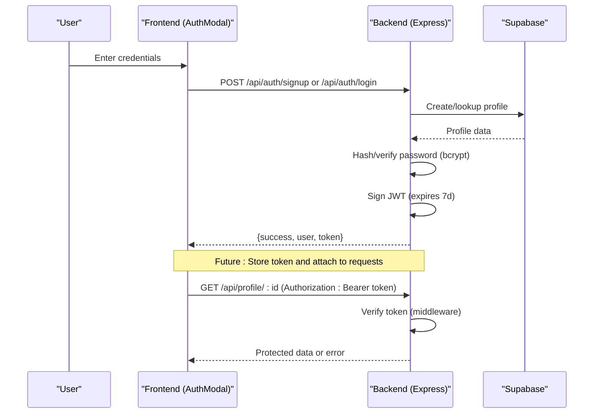
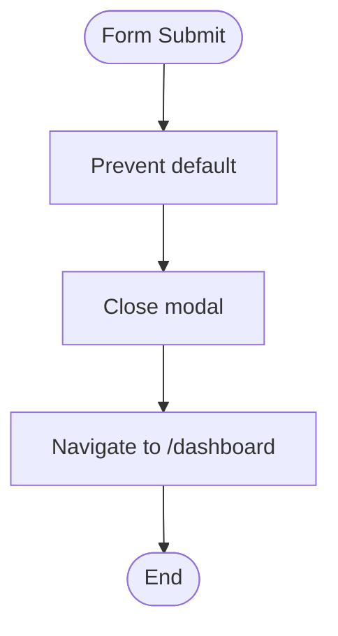
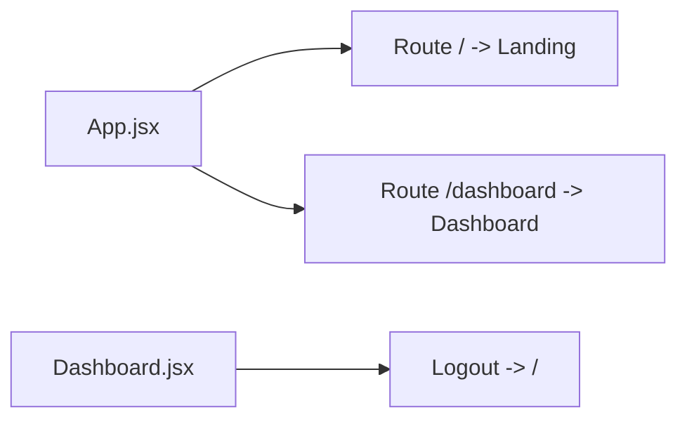
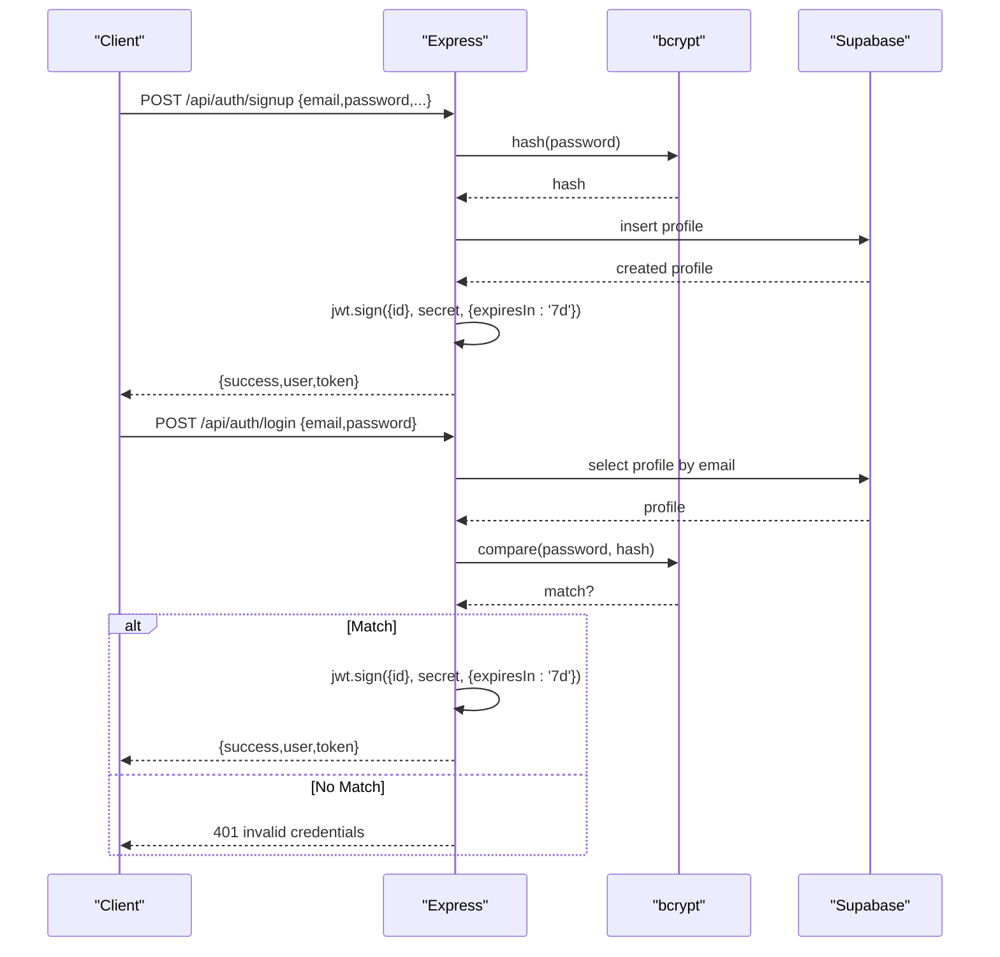
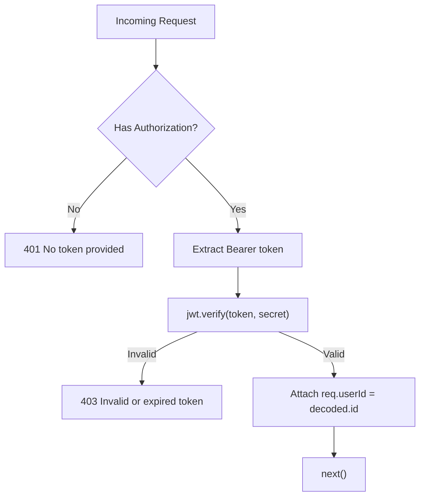
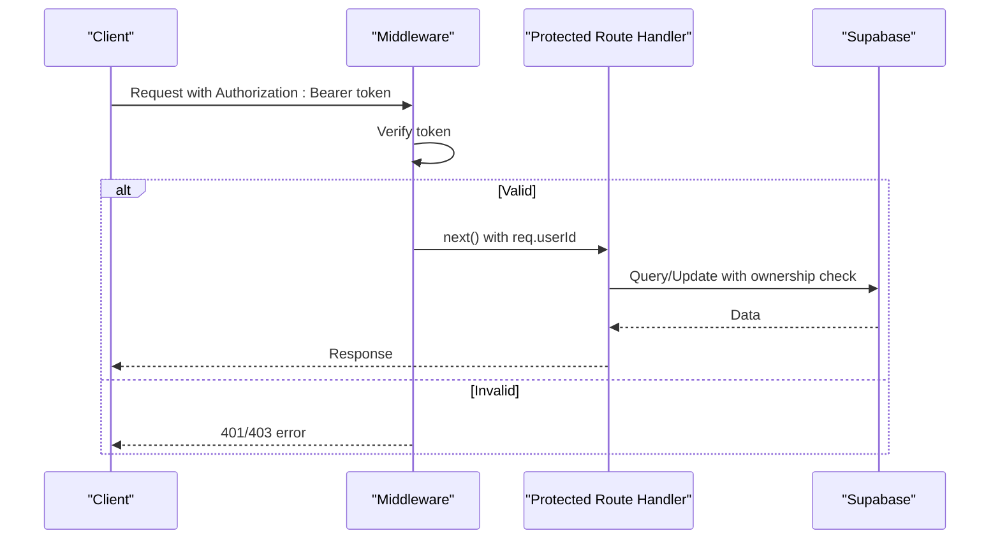
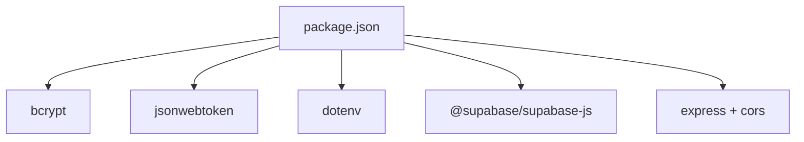

# Authentication Flow

<cite>
**Referenced Files in This Document**
- [AuthModal.jsx](file://scholarpath-frontend (2)/scholarpath/src/components/AuthModal.jsx)
- [App.jsx](file://scholarpath-frontend (2)/scholarpath/src/App.jsx)
- [Dashboard.jsx](file://scholarpath-frontend (2)/scholarpath/src/pages/Dashboard.jsx)
- [index.js](file://aischolarpath-backend-main/aischolarpath-backend-main/index.js)
- [package.json](file://aischolarpath-backend-main/aischolarpath-backend-main/package.json)
</cite>

## Table of Contents
1. Introduction
2. Project Structure
3. Core Components
4. Architecture Overview
5. Detailed Component Analysis
6. Dependency Analysis
7. Performance Considerations
8. Troubleshooting Guide
9. Conclusion

## Introduction
This document explains the complete JWT-based authentication flow for ScholarPathAI, covering user registration and login, token generation and validation, protected routes, error handling, and security considerations. It maps the frontend UI interactions to backend endpoints and describes how tokens are issued, validated, and used to protect API resources.

## Project Structure
The project consists of:
- Frontend (React): A modal-driven auth UI and a dashboard with tabs. Currently, the AuthModal performs a mock login that navigates directly to the dashboard without calling backend endpoints or persisting tokens.
- Backend (Express): Implements secure signup/login using bcrypt for password hashing and JSON Web Tokens (JWT) for session management. Protected routes validate tokens via middleware.

**Diagram sources**
- [AuthModal.jsx:11-16](file://scholarpath-frontend (2)/scholarpath/src/components/AuthModal.jsx#L11-L16)
- [App.jsx:5-13](file://scholarpath-frontend (2)/scholarpath/src/App.jsx#L5-L13)
- [Dashboard.jsx:128-186](file://scholarpath-frontend (2)/scholarpath/src/pages/Dashboard.jsx#L128-L186)
- [index.js:518-573](file://aischolarpath-backend-main/aischolarpath-backend-main/index.js#L518-L573)
- [index.js:32-47](file://aischolarpath-backend-main/aischolarpath-backend-main/index.js#L32-L47)

**Section sources**
- [AuthModal.jsx:1-84](file://scholarpath-frontend (2)/scholarpath/src/components/AuthModal.jsx#L1-L84)
- [App.jsx:1-15](file://scholarpath-frontend (2)/scholarpath/src/App.jsx#L1-L15)
- [Dashboard.jsx:1-187](file://scholarpath-frontend (2)/scholarpath/src/pages/Dashboard.jsx#L1-L187)
- [index.js:1-1599](file://aischolarpath-backend-main/aischolarpath-backend-main/index.js#L1-L1599)

## Core Components
- Frontend Auth Modal: Collects email/password (and name on signup), but currently does not call backend APIs; it simulates success by navigating to the dashboard.
- Backend Auth Endpoints:
  - Signup: Hashes password with bcrypt, stores profile, issues a JWT valid for 7 days.
  - Login: Verifies credentials against stored hash, issues a JWT valid for 7 days.
- Token Validation Middleware: Extracts Authorization header, verifies JWT, attaches user ID to request context for protected routes.
- Protected Routes: Require valid JWT; enforce ownership checks where applicable.

**Section sources**
- [AuthModal.jsx:11-16](file://scholarpath-frontend (2)/scholarpath/src/components/AuthModal.jsx#L11-L16)
- [index.js:518-573](file://aischolarpath-backend-main/aischolarpath-backend-main/index.js#L518-L573)
- [index.js:32-47](file://aischolarpath-backend-main/aischolarpath-backend-main/index.js#L32-L47)

## Architecture Overview
The authentication architecture follows a standard client-server pattern:
- Client sends credentials to /api/auth/signup or /api/auth/login.
- Server validates input, hashes passwords (signup), compares passwords (login), and returns a signed JWT.
- Client should store the token securely and include it in subsequent requests via Authorization: Bearer <token>.
- Server middleware verifies tokens and enforces access control on protected routes.

**Diagram sources**
- [index.js:518-573](file://aischolarpath-backend-main/aischolarpath-backend-main/index.js#L518-L573)
- [index.js:32-47](file://aischolarpath-backend-main/aischolarpath-backend-main/index.js#L32-L47)
- [index.js:94-110](file://aischolarpath-backend-main/aischolarpath-backend-main/index.js#L94-L110)

## Detailed Component Analysis

### Frontend: AuthModal
- Purpose: Provides login/signup forms and handles submission.
- Current behavior: On submit, prevents default form behavior, closes the modal, and navigates to /dashboard without making network requests or storing tokens.
- Integration points: Uses React Router’s navigate to move to the dashboard after “successful” submission.

**Diagram sources**
- [AuthModal.jsx:11-16](file://scholarpath-frontend (2)/scholarpath/src/components/AuthModal.jsx#L11-L16)

**Section sources**
- [AuthModal.jsx:1-84](file://scholarpath-frontend (2)/scholarpath/src/components/AuthModal.jsx#L1-L84)

### Frontend: App and Dashboard
- Routing: Defines public routes (/ and /dashboard). No route-level guards are implemented yet.
- Dashboard: Displays tabs and includes a logout button that navigates back to /. There is no token-based state or protected-route logic in place.

**Diagram sources**
- [App.jsx:5-13](file://scholarpath-frontend (2)/scholarpath/src/App.jsx#L5-L13)
- [Dashboard.jsx:154-169](file://scholarpath-frontend (2)/scholarpath/src/pages/Dashboard.jsx#L154-L169)

**Section sources**
- [App.jsx:1-15](file://scholarpath-frontend (2)/scholarpath/src/App.jsx#L1-L15)
- [Dashboard.jsx:1-187](file://scholarpath-frontend (2)/scholarpath/src/pages/Dashboard.jsx#L1-L187)

### Backend: Authentication Endpoints
- Signup (/api/auth/signup):
  - Validates required fields.
  - Hashes password with bcrypt.
  - Inserts profile into Supabase.
  - Issues a JWT containing user id with 7-day expiration.
  - Returns user info and token.
- Login (/api/auth/login):
  - Validates required fields.
  - Retrieves profile by email.
  - Compares provided password with stored hash using bcrypt.
  - Issues a JWT containing user id with 7-day expiration.
  - Returns user info and token.

**Diagram sources**
- [index.js:518-573](file://aischolarpath-backend-main/aischolarpath-backend-main/index.js#L518-L573)

**Section sources**
- [index.js:518-573](file://aischolarpath-backend-main/aischolarpath-backend-main/index.js#L518-L573)

### Backend: Token Validation Middleware
- Extracts Authorization header and parses Bearer token.
- Verifies token using the configured secret.
- Attaches decoded user id to req.userId for downstream handlers.
- Returns appropriate errors for missing or invalid/expired tokens.

**Diagram sources**
- [index.js:32-47](file://aischolarpath-backend-main/aischolarpath-backend-main/index.js#L32-L47)

**Section sources**
- [index.js:32-47](file://aischolarpath-backend-main/aischolarpath-backend-main/index.js#L32-L47)

### Backend: Protected Routes
- Many routes require authentication via the middleware. Examples include profile updates, fetching profiles, CV upload, analysis, shortlist operations, applications, notifications, roadmap, and more.
- Ownership checks ensure users can only access their own data by comparing route parameters with req.userId.

**Diagram sources**
- [index.js:32-47](file://aischolarpath-backend-main/aischolarpath-backend-main/index.js#L32-L47)
- [index.js:70-110](file://aischolarpath-backend-main/aischolarpath-backend-main/index.js#L70-L110)

**Section sources**
- [index.js:70-110](file://aischolarpath-backend-main/aischolarpath-backend-main/index.js#L70-L110)

## Dependency Analysis
- Backend dependencies relevant to authentication:
  - bcrypt: Password hashing and comparison.
  - jsonwebtoken: Signing and verifying JWTs.
  - dotenv: Loading environment variables (e.g., JWT_SECRET).
  - @supabase/supabase-js: Database operations for user profiles and related data.
  - express/cors: HTTP server and cross-origin configuration.

**Diagram sources**
- [package.json:1-14](file://aischolarpath-backend-main/aischolarpath-backend-main/package.json#L1-L14)

**Section sources**
- [package.json:1-14](file://aischolarpath-backend-main/aischolarpath-backend-main/package.json#L1-L14)

## Performance Considerations
- Password hashing cost: The bcrypt salt rounds are set to 10, which balances security and performance. Ensure this aligns with your latency targets and hardware capacity.
- JWT size: Tokens contain minimal claims (user id), keeping them small and efficient to transmit.
- Middleware overhead: Token verification occurs per request; consider caching strategies at the edge if needed, though JWTs are typically fast to verify.

[No sources needed since this section provides general guidance]

## Troubleshooting Guide
Common authentication issues and resolutions:
- Missing Authorization header:
  - Symptom: 401 “No token provided”.
  - Resolution: Ensure clients send Authorization: Bearer <token> on protected requests.
- Invalid or expired token:
  - Symptom: 403 “Invalid or expired token”.
  - Resolution: Re-authenticate to obtain a new token; ensure token storage persists across sessions.
- Incorrect credentials:
  - Symptom: 401 “Invalid email or password”.
  - Resolution: Validate inputs and guide users to reset password if necessary.
- Environment misconfiguration:
  - Symptom: Startup failure due to missing required env vars.
  - Resolution: Provide SUPABASE_URL, SUPABASE_KEY, and JWT_SECRET before starting the server.

**Section sources**
- [index.js:5-10](file://aischolarpath-backend-main/aischolarpath-backend-main/index.js#L5-L10)
- [index.js:32-47](file://aischolarpath-backend-main/aischolarpath-backend-main/index.js#L32-L47)
- [index.js:518-573](file://aischolarpath-backend-main/aischolarpath-backend-main/index.js#L518-L573)

## Conclusion
ScholarPathAI’s backend implements a robust JWT-based authentication system with secure password hashing and middleware-protected routes. The current frontend uses a mock authentication flow that bypasses backend calls and token management. To fully realize the intended experience, integrate the frontend with the backend endpoints, persist tokens securely, and implement protected routing based on token presence and validity.

[No sources needed since this section summarizes without analyzing specific files]