# Data Flow and Communication

<cite>
**Referenced Files in This Document**
- [index.js](file://aischolarpath-backend-main/aischolarpath-backend-main/index.js)
- [package.json (backend)](file://aischolarpath-backend-main/aischolarpath-backend-main/package.json)
- [App.jsx](file://scholarpath-frontend (2)/scholarpath/src/App.jsx)
- [main.jsx](file://scholarpath-frontend (2)/scholarpath/src/main.jsx)
- [Dashboard.jsx](file://scholarpath-frontend (2)/scholarpath/src/pages/Dashboard.jsx)
- [Landing.jsx](file://scholarpath-frontend (2)/scholarpath/src/pages/Landing.jsx)
- [AuthModal.jsx](file://scholarpath-frontend (2)/scholarpath/src/components/AuthModal.jsx)
- [ChatWidget.jsx](file://scholarpath-frontend (2)/scholarpath/src/components/ChatWidget.jsx)
- [mockData.js](file://scholarpath-frontend (2)/scholarpath/src/data/mockData.js)
</cite>

## Table of Contents
1. [Introduction](#introduction)
2. [Project Structure](#project-structure)
3. [Core Components](#core-components)
4. [Architecture Overview](#architecture-overview)
5. [Detailed Component Analysis](#detailed-component-analysis)
6. [Dependency Analysis](#dependency-analysis)
7. [Performance Considerations](#performance-considerations)
8. [Troubleshooting Guide](#troubleshooting-guide)
9. [Conclusion](#conclusion)

## Introduction
This document explains how data flows and communicates across ScholarPathAI, from user interactions in the React frontend to Express routes and database operations on the backend. It covers:
- Request-response cycles for authentication, profile management, scholarships, universities, matching, applications, notifications, discovery/scraping, and roadmap generation.
- Authentication flow with JWT token generation, validation middleware, and where tokens are expected to be stored and used.
- Real-time synchronization patterns and asynchronous handling in the frontend.
- Error propagation from backend services to UI components.
- Data transformation layers, caching strategies, and performance optimizations implemented or available in the codebase.

## Project Structure
The application consists of two main parts:
- Backend: An Express server that exposes REST APIs, handles authentication, interacts with Supabase (database and storage), and provides scraping utilities.
- Frontend: A React app built with Vite, routing via react-router-dom, and currently using local state and mock data for most features.

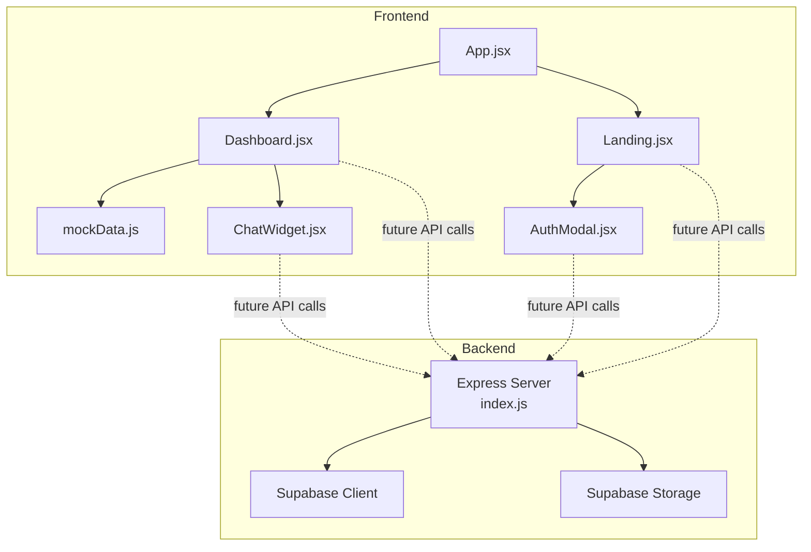

**Diagram sources**
- [App.jsx:1-15](file://scholarpath-frontend (2)/scholarpath/src/App.jsx#L1-L15)
- [Dashboard.jsx:1-187](file://scholarpath-frontend (2)/scholarpath/src/pages/Dashboard.jsx#L1-L187)
- [Landing.jsx:1-211](file://scholarpath-frontend (2)/scholarpath/src/pages/Landing.jsx#L1-L211)
- [AuthModal.jsx:1-84](file://scholarpath-frontend (2)/scholarpath/src/components/AuthModal.jsx#L1-L84)
- [ChatWidget.jsx:1-104](file://scholarpath-frontend (2)/scholarpath/src/components/ChatWidget.jsx#L1-L104)
- [mockData.js:1-349](file://scholarpath-frontend (2)/scholarpath/src/data/mockData.js#L1-L349)
- [index.js:1-1599](file://aischolarpath-backend-main/aischolarpath-backend-main/index.js#L1-L1599)

**Section sources**
- [App.jsx:1-15](file://scholarpath-frontend (2)/scholarpath/src/App.jsx#L1-L15)
- [main.jsx:1-11](file://scholarpath-frontend (2)/scholarpath/src/main.jsx#L1-L11)
- [package.json (backend):1-14](file://aischolarpath-backend-main/aischolarpath-backend-main/package.json#L1-L14)

## Core Components
- Backend server (Express):
  - Middleware: CORS, JSON parsing, custom JWT authentication middleware.
  - Routes: Auth, profiles, scholarships, universities, matching, shortlist, applications, notifications, discovery/scraping, roadmap, language prep, attestation guides.
  - Database: Supabase client for relational data; Supabase Storage for CV uploads.
  - Utilities: Multer for file uploads, Cheerio for HTML scraping, undici agent for HTTP connections.
- Frontend:
  - Routing: App.jsx defines routes for Landing and Dashboard.
  - State: Dashboard uses local state for tabs and forms; ChatWidget manages message history locally.
  - Data source: Currently relies on mockData.js for display content; placeholders exist for future API integration.

Key responsibilities:
- Backend enforces authorization via JWT, validates inputs, performs business logic (matching, roadmap generation), and persists data to Supabase.
- Frontend composes UI, manages local state, and is structured to call backend APIs when integrated.

**Section sources**
- [index.js:31-48](file://aischolarpath-backend-main/aischolarpath-backend-main/index.js#L31-L48)
- [index.js:51-68](file://aischolarpath-backend-main/aischolarpath-backend-main/index.js#L51-L68)
- [Dashboard.jsx:128-187](file://scholarpath-frontend (2)/scholarpath/src/pages/Dashboard.jsx#L128-L187)
- [ChatWidget.jsx:11-39](file://scholarpath-frontend (2)/scholarpath/src/components/ChatWidget.jsx#L11-L39)
- [mockData.js:1-349](file://scholarpath-frontend (2)/scholarpath/src/data/mockData.js#L1-L349)

## Architecture Overview
The system follows a typical client-server architecture:
- The React frontend renders pages and collects user input.
- The Express backend exposes REST endpoints for all domain operations.
- Supabase acts as both database and object storage.
- Scraping tools fetch external web content and persist results.

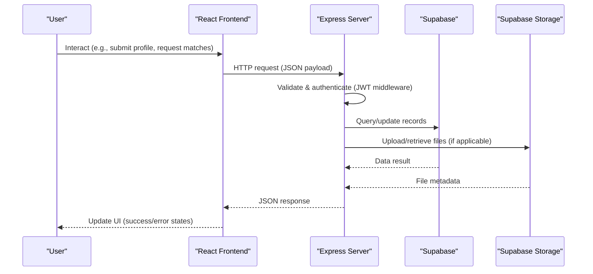

**Diagram sources**
- [index.js:32-47](file://aischolarpath-backend-main/aischolarpath-backend-main/index.js#L32-L47)
- [index.js:51-68](file://aischolarpath-backend-main/aischolarpath-backend-main/index.js#L51-L68)
- [index.js:112-145](file://aischolarpath-backend-main/aischolarpath-backend-main/index.js#L112-L145)

## Detailed Component Analysis

### Authentication Flow (Signup/Login/JWT)
- Signup:
  - Validates email/password, hashes password, inserts into profiles, signs JWT, returns user and token.
- Login:
  - Retrieves user by email, verifies password hash, signs JWT, returns user and token.
- Authorization:
  - Middleware extracts token from Authorization header, verifies it, attaches userId to request.
- Token usage:
  - Protected routes require valid token; responses include success flags and error messages.

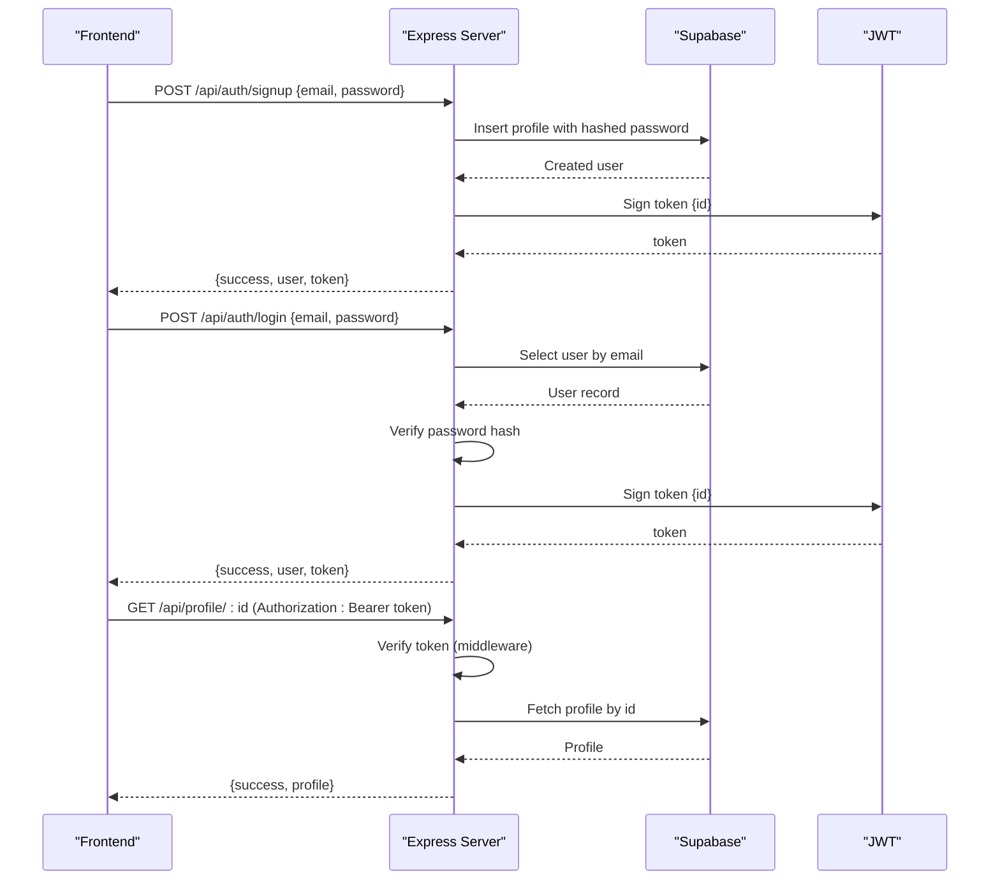

**Diagram sources**
- [index.js:519-573](file://aischolarpath-backend-main/aischolarpath-backend-main/index.js#L519-L573)
- [index.js:32-47](file://aischolarpath-backend-main/aischolarpath-backend-main/index.js#L32-L47)
- [index.js:94-110](file://aischolarpath-backend-main/aischolarpath-backend-main/index.js#L94-L110)

**Section sources**
- [index.js:519-573](file://aischolarpath-backend-main/aischolarpath-backend-main/index.js#L519-L573)
- [index.js:32-47](file://aischolarpath-backend-main/aischolarpath-backend-main/index.js#L32-L47)

### Profile Management and CV Upload
- Update profile:
  - Accepts partial updates, filters undefined fields, updates row by userId, returns updated profile.
- Get profile:
  - Authorizes access by comparing requested id with userId, returns single profile.
- Upload CV:
  - Validates ownership, uploads file buffer to Supabase Storage under id-based path, updates profile cv_file_path, returns file path.

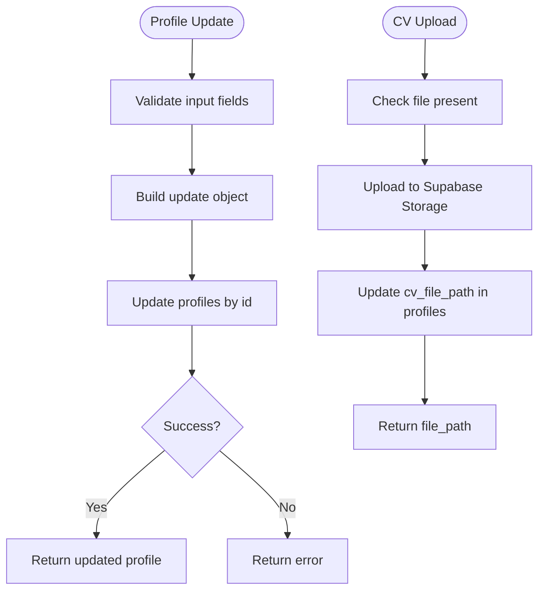

**Diagram sources**
- [index.js:70-91](file://aischolarpath-backend-main/aischolarpath-backend-main/index.js#L70-L91)
- [index.js:112-145](file://aischolarpath-backend-main/aischolarpath-backend-main/index.js#L112-L145)

**Section sources**
- [index.js:70-91](file://aischolarpath-backend-main/aischolarpath-backend-main/index.js#L70-L91)
- [index.js:112-145](file://aischolarpath-backend-main/aischolarpath-backend-main/index.js#L112-L145)

### Scholarships and Universities Queries
- List scholarships:
  - Supports filtering by country, type, department, degree level; joins university details; returns list.
- Single scholarship:
  - Returns detailed info by id with university link.
- List universities:
  - Filters by country, degree program, search term; includes universities with direct scholarships or country-wide scholarships; limits results.
- Single university:
  - Returns full details by id.

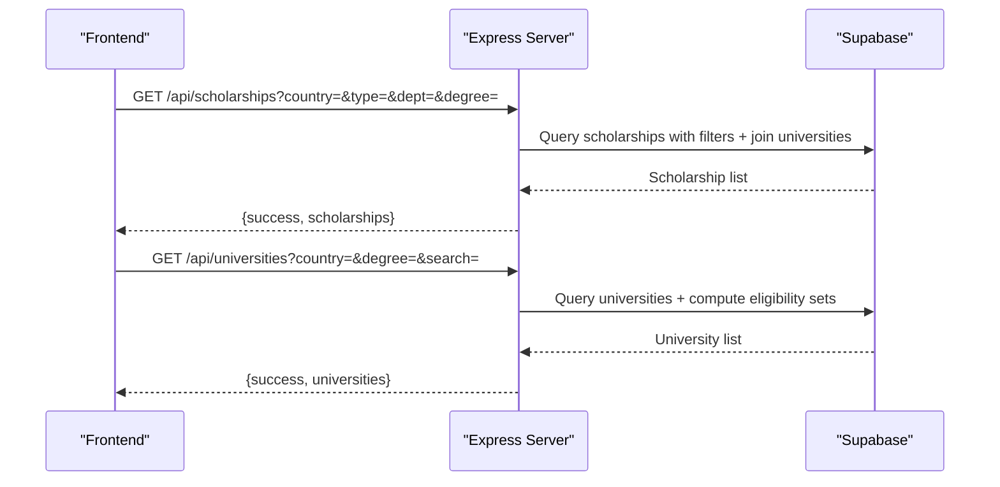

**Diagram sources**
- [index.js:190-222](file://aischolarpath-backend-main/aischolarpath-backend-main/index.js#L190-L222)
- [index.js:224-288](file://aischolarpath-backend-main/aischolarpath-backend-main/index.js#L224-L288)

**Section sources**
- [index.js:190-222](file://aischolarpath-backend-main/aischolarpath-backend-main/index.js#L190-L222)
- [index.js:224-288](file://aischolarpath-backend-main/aischolarpath-backend-main/index.js#L224-L288)

### Matching Engine
- Run matching:
  - Fetches profile, queries active scholarships (optionally filtered by target country), evaluates criteria (CGPA, IELTS, required degree), computes match score and status, clears old matches, inserts new matches.
- Get matches:
  - Returns sorted matches with scholarship and university details.

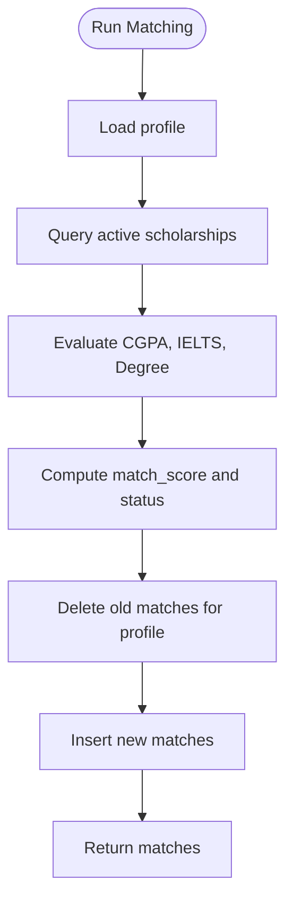

**Diagram sources**
- [index.js:575-673](file://aischolarpath-backend-main/aischolarpath-backend-main/index.js#L575-L673)

**Section sources**
- [index.js:575-673](file://aischolarpath-backend-main/aischolarpath-backend-main/index.js#L575-L673)

### Applications, Shortlist, Notifications
- Applications:
  - Create, update, list, delete applications per profile; includes authorization checks.
- Shortlist:
  - Add/remove items (scholarship/university); retrieve enriched shortlist with details.
- Notifications:
  - Create, list, mark read; deadline checker creates reminders for upcoming deadlines within 14 days.

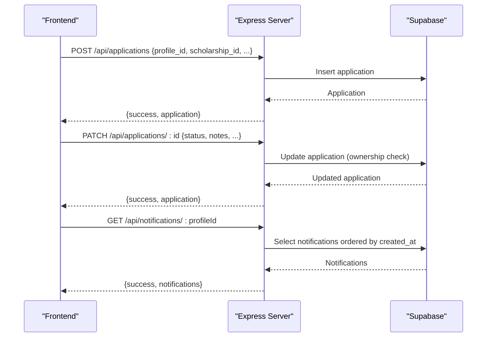

**Diagram sources**
- [index.js:822-905](file://aischolarpath-backend-main/aischolarpath-backend-main/index.js#L822-L905)
- [index.js:751-820](file://aischolarpath-backend-main/aischolarpath-backend-main/index.js#L751-L820)
- [index.js:983-1020](file://aischolarpath-backend-main/aischolarpath-backend-main/index.js#L983-L1020)

**Section sources**
- [index.js:822-905](file://aischolarpath-backend-main/aischolarpath-backend-main/index.js#L822-L905)
- [index.js:751-820](file://aischolarpath-backend-main/aischolarpath-backend-main/index.js#L751-L820)
- [index.js:983-1020](file://aischolarpath-backend-main/aischolarpath-backend-main/index.js#L983-L1020)

### Discovery and Scraping
- Single scrape:
  - Fetches page, parses with Cheerio, extracts items based on selectors, logs results.
- Bulk scrape:
  - Iterates multiple URLs with delays, scrapes each, logs outcomes.
- Scrape-and-structure:
  - Scrapes listing page, visits each item page, extracts eligibility criteria and deadlines via regex, upserts scholarships.
- Official page scrape:
  - Scrapes official scholarship page, extracts fields, upserts scholarship record.

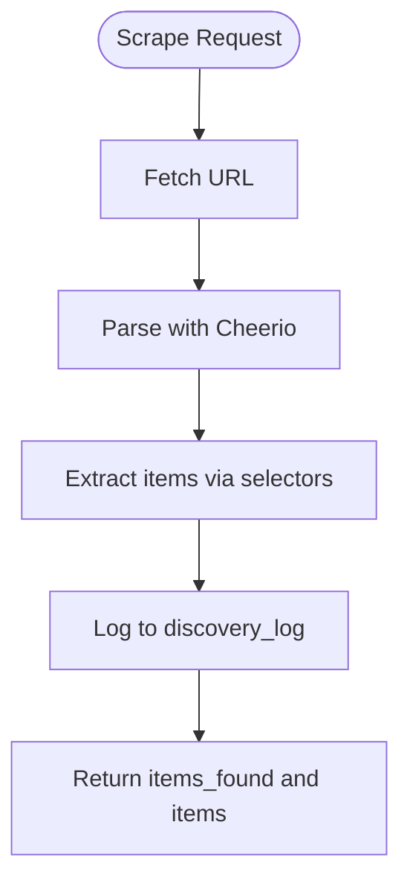

**Diagram sources**
- [index.js:1183-1243](file://aischolarpath-backend-main/aischolarpath-backend-main/index.js#L1183-L1243)
- [index.js:1259-1309](file://aischolarpath-backend-main/aischolarpath-backend-main/index.js#L1259-L1309)
- [index.js:1311-1390](file://aischolarpath-backend-main/aischolarpath-backend-main/index.js#L1311-L1390)
- [index.js:1392-1439](file://aischolarpath-backend-main/aischolarpath-backend-main/index.js#L1392-L1439)

**Section sources**
- [index.js:1183-1243](file://aischolarpath-backend-main/aischolarpath-backend-main/index.js#L1183-L1243)
- [index.js:1259-1309](file://aischolarpath-backend-main/aischolarpath-backend-main/index.js#L1259-L1309)
- [index.js:1311-1390](file://aischolarpath-backend-main/aischolarpath-backend-main/index.js#L1311-L1390)
- [index.js:1392-1439](file://aischolarpath-backend-main/aischolarpath-backend-main/index.js#L1392-L1439)

### Roadmap Generation
- Personalized roadmap:
  - Retrieves eligible/missing requirements matches, sorts by deadline, selects nearest deadline, applies template milestones to generate tasks with target dates and overdue flags.

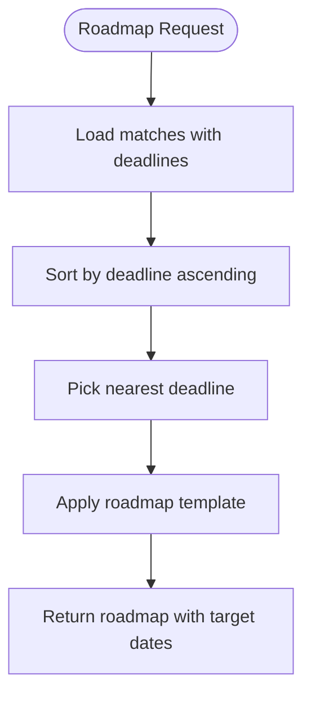

**Diagram sources**
- [index.js:1546-1595](file://aischolarpath-backend-main/aischolarpath-backend-main/index.js#L1546-L1595)

**Section sources**
- [index.js:1546-1595](file://aischolarpath-backend-main/aischolarpath-backend-main/index.js#L1546-L1595)

### Language Prep and Attestation Guides
- Language prep:
  - Static guides for IELTS/TOEFL/PTE; personalized guidance compares current score against scholarship requirements.
- Attestation:
  - Static steps for HEC/IBCC/MOFA; initialize tracked steps per authority/profile; mark steps done; retrieve steps.

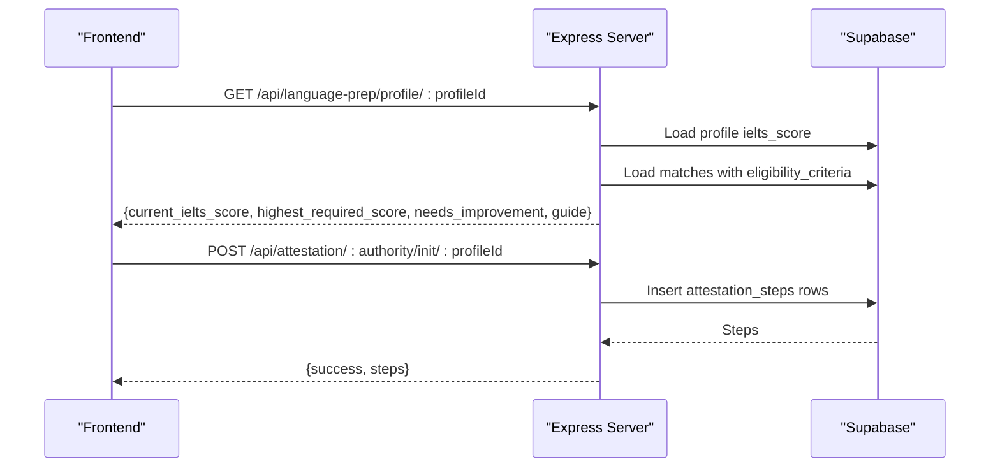

**Diagram sources**
- [index.js:345-402](file://aischolarpath-backend-main/aischolarpath-backend-main/index.js#L345-L402)
- [index.js:427-486](file://aischolarpath-backend-main/aischolarpath-backend-main/index.js#L427-L486)

**Section sources**
- [index.js:345-402](file://aischolarpath-backend-main/aischolarpath-backend-main/index.js#L345-L402)
- [index.js:427-486](file://aischolarpath-backend-main/aischolarpath-backend-main/index.js#L427-L486)

### Frontend Asynchronous Handling and Real-Time Patterns
- Current state:
  - ChatWidget simulates real-time chat with local state and timeouts; no network calls yet.
  - Dashboard and Landing use local state and mockData for rendering; no live data fetching implemented.
- Planned integration:
  - When integrating with backend, components should manage loading states, handle errors, and update UI accordingly.
  - For real-time updates (e.g., notifications), consider polling or WebSocket if added later.

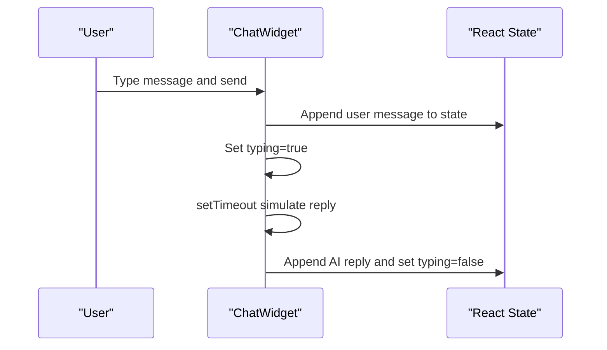

**Diagram sources**
- [ChatWidget.jsx:24-39](file://scholarpath-frontend (2)/scholarpath/src/components/ChatWidget.jsx#L24-L39)

**Section sources**
- [ChatWidget.jsx:11-39](file://scholarpath-frontend (2)/scholarpath/src/components/ChatWidget.jsx#L11-L39)
- [Dashboard.jsx:128-187](file://scholarpath-frontend (2)/scholarpath/src/pages/Dashboard.jsx#L128-L187)
- [mockData.js:1-349](file://scholarpath-frontend (2)/scholarpath/src/data/mockData.js#L1-L349)

## Dependency Analysis
- Backend dependencies:
  - Express, cors, dotenv, multer, bcrypt, jsonwebtoken, cheerio, @supabase/supabase-js, undici.
- Frontend dependencies:
  - React, react-dom, react-router-dom; build tooling via Vite; styling via Tailwind.

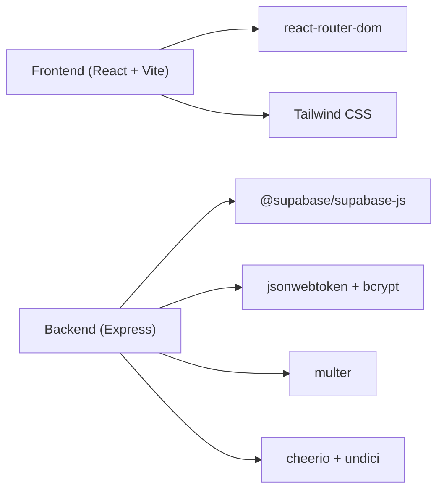

**Diagram sources**
- [package.json (backend):1-14](file://aischolarpath-backend-main/aischolarpath-backend-main/package.json#L1-L14)
- [package.json (frontend):1-28](file://scholarpath-frontend (2)/scholarpath/package.json#L1-L28)

**Section sources**
- [package.json (backend):1-14](file://aischolarpath-backend-main/aischolarpath-backend-main/package.json#L1-L14)
- [package.json (frontend):1-28](file://scholarpath-frontend (2)/scholarpath/package.json#L1-L28)

## Performance Considerations
- Connection pooling:
  - Backend configures an undici Agent with connection limits and timeouts to optimize outbound requests during scraping.
- Rate limiting and politeness:
  - Scraping endpoints introduce delays between requests to avoid overwhelming external sites.
- Query optimization:
  - Filtering at the database layer reduces payload size; joins are used selectively.
- Caching strategy:
  - No explicit caching is implemented in the backend; consider adding Redis or in-memory caches for static guides and frequent reads.
- Frontend async patterns:
  - Use optimistic updates for better UX; implement retry logic and backoff for failed requests; debounce search inputs.

[No sources needed since this section provides general guidance]

## Troubleshooting Guide
- Authentication issues:
  - Ensure Authorization header includes valid Bearer token; verify JWT_SECRET environment variable; check token expiration.
- Database errors:
  - Inspect error messages returned by Supabase; ensure environment variables SUPABASE_URL and SUPABASE_KEY are correct.
- File upload failures:
  - Confirm file presence and MIME type; verify storage bucket permissions; check cv_file_path update success.
- Scraping errors:
  - Validate selectors and URLs; handle non-OK responses; review discovery logs for failure reasons.
- Centralized error handling:
  - Unhandled errors return a generic 500 response; log stack traces for debugging.

**Section sources**
- [index.js:32-47](file://aischolarpath-backend-main/aischolarpath-backend-main/index.js#L32-L47)
- [index.js:1528-1531](file://aischolarpath-backend-main/aischolarpath-backend-main/index.js#L1528-L1531)
- [index.js:1183-1243](file://aischolarpath-backend-main/aischolarpath-backend-main/index.js#L1183-L1243)

## Conclusion
ScholarPathAI’s backend provides a comprehensive set of REST APIs covering authentication, profile management, scholarships, universities, matching, applications, notifications, discovery/scraping, and roadmap generation. The frontend is structured for easy integration, currently relying on local state and mock data. To complete the request-response cycle:
- Integrate frontend components with backend endpoints, passing JWT tokens in headers for protected routes.
- Implement robust error handling and loading states in the UI.
- Consider adding caching and real-time updates (polling/WebSockets) for improved responsiveness.
- Continue refining scraping logic and data extraction accuracy.

[No sources needed since this section summarizes without analyzing specific files]