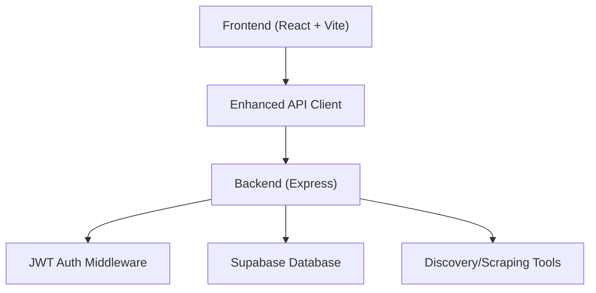
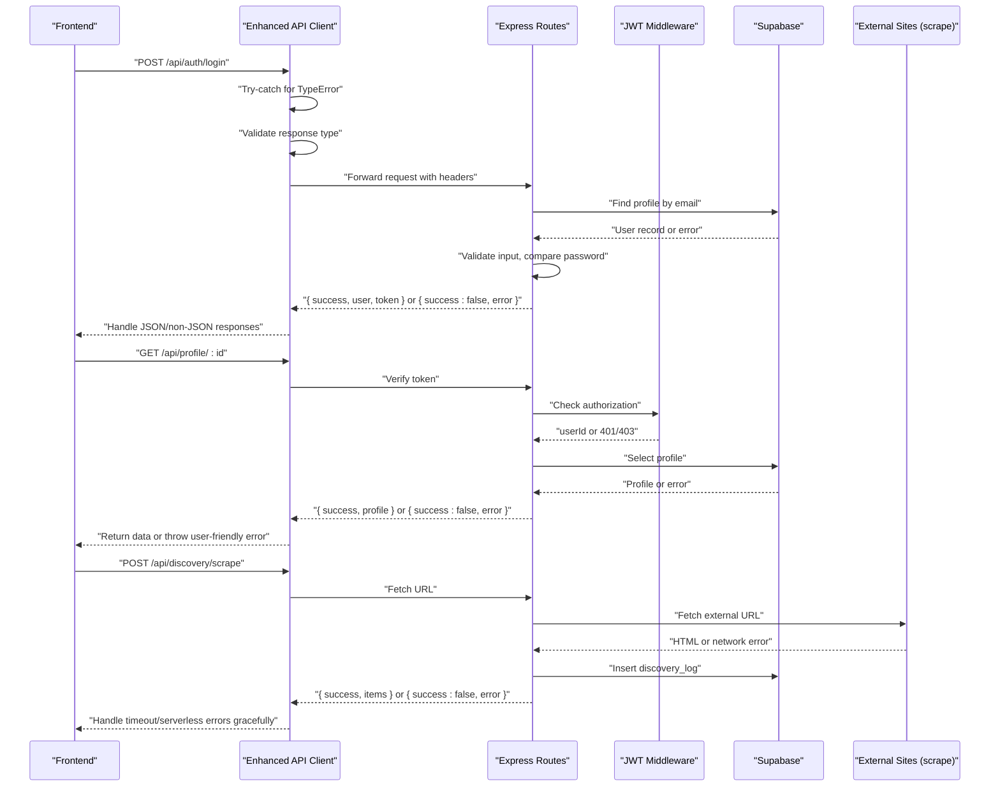
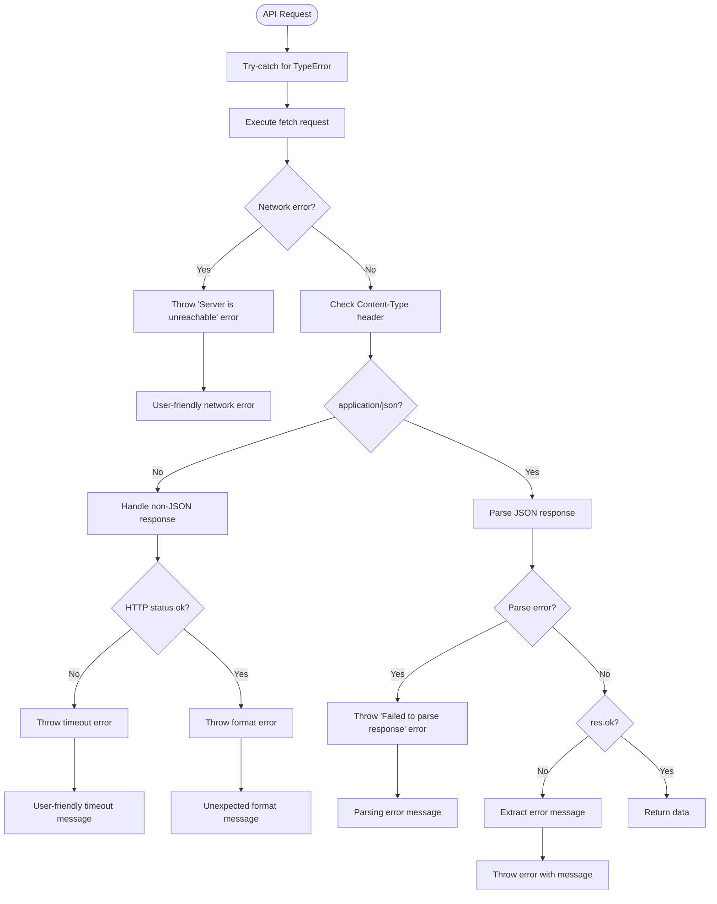
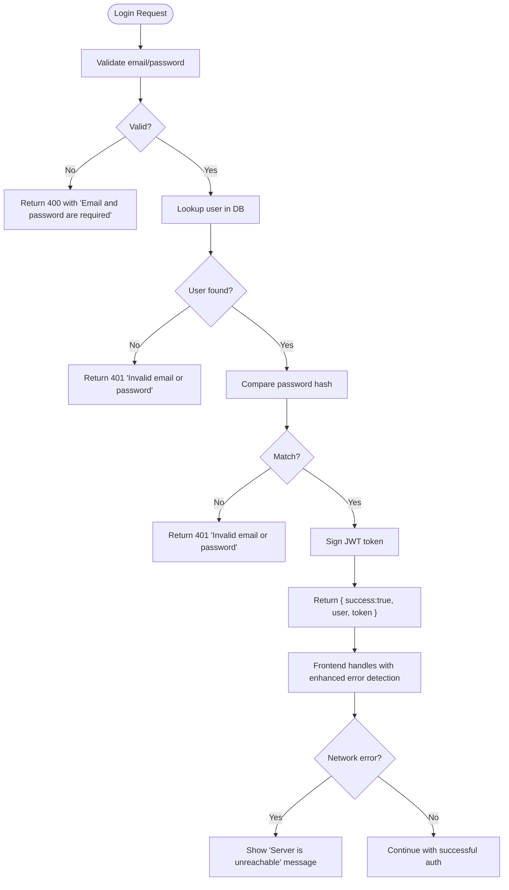
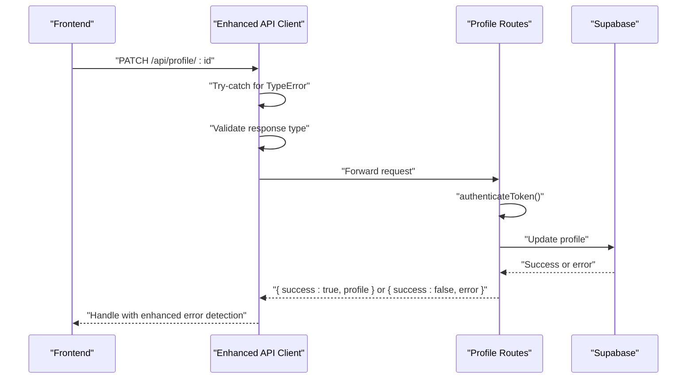
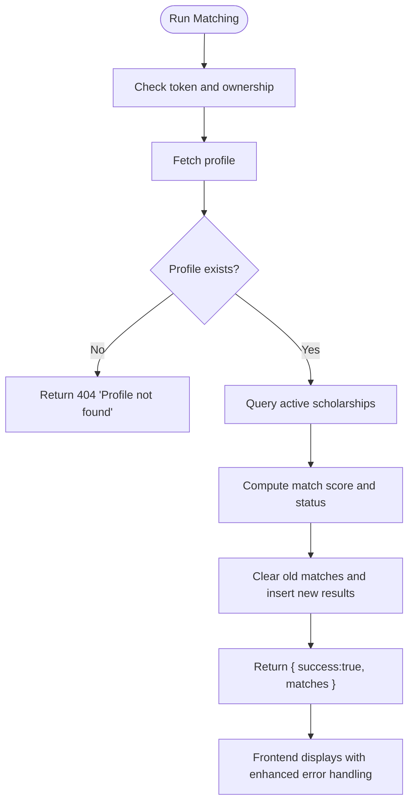
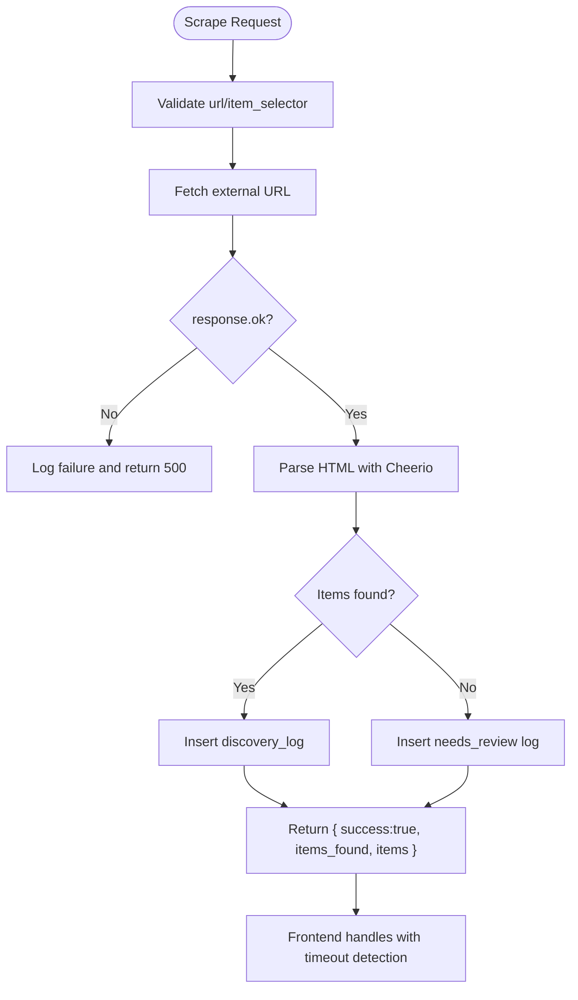
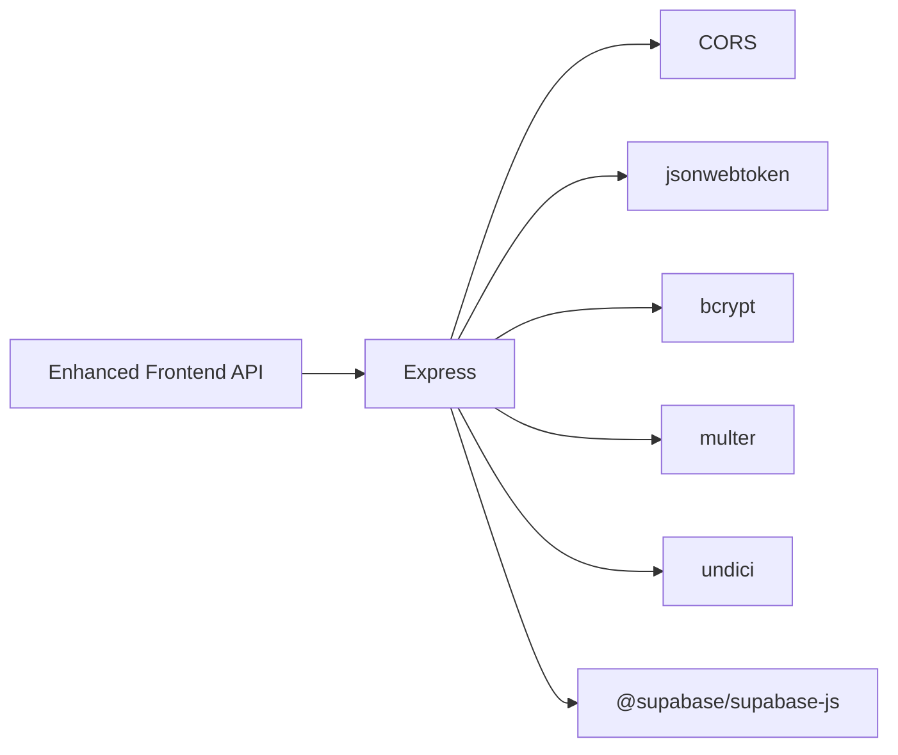

# Error Handling Strategies

<cite>
**Referenced Files in This Document**
- [index.js](file://aischolarpath-backend-main/aischolarpath-backend-main/index.js)
- [package.json (backend)](file://aischolarpath-backend-main/aischolarpath-backend-main/package.json)
- [api.js](file://scholarpath-frontend (2)/scholarpath/src/api.js)
- [AuthModal.jsx](file://scholarpath-frontend (2)/scholarpath/src/components/AuthModal.jsx)
- [Dashboard.jsx](file://scholarpath-frontend (2)/scholarpath/src/pages/Dashboard.jsx)
- [ProfileTab.jsx](file://scholarpath-frontend (2)/scholarpath/src/pages/ProfileTab.jsx)
- [ScholarshipsTab.jsx](file://scholarpath-frontend (2)/scholarpath/src/pages/ScholarshipsTab.jsx)
- [UI.jsx](file://scholarpath-frontend (2)/scholarpath/src/components/UI.jsx)
- [AuthContext.jsx](file://scholarpath-frontend (2)/scholarpath/src/components/AuthContext.jsx)
</cite>

## Update Summary
**Changes Made**
- Enhanced frontend API error handling with comprehensive try-catch blocks for TypeError exceptions
- Added specific error messages for different failure scenarios (network connectivity, JSON parsing, HTTP errors)
- Improved user feedback for server unavailability during signup/login operations
- Enhanced timeout detection for serverless deployment scenarios with non-JSON response handling
- Updated error propagation from backend services through API responses to frontend components
- Added sophisticated error classification and user-friendly messaging throughout the application

## Table of Contents
1. Introduction
2. Project Structure
3. Core Components
4. Architecture Overview
5. Detailed Component Analysis
6. Dependency Analysis
7. Performance Considerations
8. Troubleshooting Guide
9. Conclusion
10. Appendices

## Introduction
This document explains how errors are handled across the ScholarPathAI application, focusing on:
- How backend services classify and return errors
- How those errors propagate to API responses
- How the frontend currently handles or could handle errors for a better user experience
- Classification of errors: network, validation, authorization, business logic, and infrastructure
- Patterns for retry, fallback, and graceful degradation
- Examples from authentication flows, form submissions, and asynchronous operations
- Best practices for logging, monitoring, and UX design during error scenarios

The goal is to provide both technical depth and accessible guidance for developers and stakeholders.

**Updated** Enhanced frontend API error handling now includes comprehensive try-catch blocks for TypeError exceptions, specific error messages for different failure scenarios, and improved user feedback for server unavailability during critical operations like signup and login.

## Project Structure
The application consists of:
- A Node.js/Express backend that exposes REST APIs for authentication, profile management, scholarships, universities, attestation steps, applications, notifications, discovery/scraping tools, and roadmap generation. It integrates with Supabase for data storage and uses JWT for authentication.
- A React frontend using Vite and React Router. The current UI demonstrates routing and page composition but does not yet call backend endpoints; it uses mock data and local state.

**Diagram sources**
- [index.js:31-47](file://aischolarpath-backend-main/aischolarpath-backend-main/index.js#L31-L47)
- [index.js:50-68](file://aischolarpath-backend-main/aischolarpath-backend-main/index.js#L50-L68)
- [index.js:1182-1243](file://aischolarpath-backend-main/aischolarpath-backend-main/index.js#L1182-L1243)
- [App.jsx:1-15](file://scholarpath-frontend (2)/scholarpath/src/App.jsx#L1-L15)
- [api.js:29-61](file://scholarpath-frontend (2)/scholarpath/src/api.js#L29-L61)

**Section sources**
- [index.js:1-15](file://aischolarpath-backend-main/aischolarpath-backend-main/index.js#L1-L15)
- [App.jsx:1-15](file://scholarpath-frontend (2)/scholarpath/src/App.jsx#L1-L15)

## Core Components
Key areas where error handling occurs:
- Authentication middleware and routes: token validation, login/signup, password reset
- Data access routes: profiles, scholarships, universities, matches, shortlist, applications, notifications
- File uploads and analysis: CV upload and analyze endpoints
- Discovery/scraping: single and bulk scraping with external HTTP calls and parsing
- Centralized error handler for unhandled exceptions
- **Enhanced Frontend API Client**: Comprehensive error handling with try-catch blocks for TypeError exceptions and specific error messages

Error classification patterns observed:
- Validation errors: missing fields, invalid inputs (400)
- Authorization errors: missing/expired tokens, unauthorized access (401/403)
- Business logic errors: resource not found, eligibility checks (404)
- Infrastructure/network errors: database failures, external fetch failures (500)
- Serverless timeout errors: Non-JSON responses from timed-out serverless functions
- Network connectivity errors: TypeError exceptions when server is unreachable
- JSON parsing errors: Failed response parsing with user-friendly messages
- Startup configuration errors: missing environment variables (process exit)

**Updated** The frontend API client now includes sophisticated error handling with comprehensive try-catch blocks for TypeError exceptions, specific error messages for different failure scenarios, and improved user feedback for server unavailability during critical operations.

**Section sources**
- [index.js:31-47](file://aischolarpath-backend-main/aischolarpath-backend-main/index.js#L31-L47)
- [index.js:518-573](file://aischolarpath-backend-main/aischolarpath-backend-main/index.js#L518-L573)
- [index.js:1101-1181](file://aischolarpath-backend-main/aischolarpath-backend-main/index.js#L1101-L1181)
- [index.js:1182-1243](file://aischolarpath-backend-main/aischolarpath-backend-main/index.js#L1182-L1243)
- [index.js:1527-1531](file://aischolarpath-backend-main/aischolarpath-backend-main/index.js#L1527-L1531)
- [api.js:29-61](file://scholarpath-frontend (2)/scholarpath/src/api.js#L29-L61)

## Architecture Overview
End-to-end request flow with enhanced error propagation:

**Updated** The enhanced API client now includes comprehensive try-catch blocks for TypeError exceptions, validates response types, and handles non-JSON responses that commonly occur when serverless functions timeout, providing better user experience and clearer error messages.

**Diagram sources**
- [index.js:543-573](file://aischolarpath-backend-main/aischolarpath-backend-main/index.js#L543-L573)
- [index.js:94-110](file://aischolarpath-backend-main/aischolarpath-backend-main/index.js#L94-L110)
- [index.js:1182-1243](file://aischolarpath-backend-main/aischolarpath-backend-main/index.js#L1182-L1243)
- [api.js:29-61](file://scholarpath-frontend (2)/scholarpath/src/api.js#L29-L61)

## Detailed Component Analysis

### Enhanced Frontend API Client
**New** The centralized API client now includes sophisticated error handling with comprehensive try-catch blocks:

- **TypeError Exception Handling**: Catches network connectivity issues when the server is unreachable
- **Response Type Validation**: Checks Content-Type headers to detect non-JSON responses
- **Timeout Detection**: Identifies serverless function timeouts based on response characteristics
- **JSON Parsing Error Handling**: Specific error messages for failed response parsing
- **User-Friendly Messages**: Provides clear error messages like "Server is unreachable" and "Please try again — the request may have timed out"
- **Graceful Fallbacks**: Handles unexpected response formats without breaking the application

**Diagram sources**
- [api.js:44-77](file://scholarpath-frontend (2)/scholarpath/src/api.js#L44-L77)

**Section sources**
- [api.js:44-77](file://scholarpath-frontend (2)/scholarpath/src/api.js#L44-L77)

### Authentication Flow Error Handling
- Input validation: Missing email/password returns 400 with a clear message.
- User lookup: If no user found or DB error, returns 401 with a generic message to avoid revealing existence.
- Password verification: Incorrect password returns 401.
- Token issuance: On success, returns user and token.
- Forgot password: Validates email, generates reset token, stores expiry, and returns a safe message even if email not found.
- Reset password: Validates token expiration and correctness, updates password, clears tokens.
- **Enhanced Frontend Handling**: All authentication errors now benefit from improved timeout detection, TypeError handling, and user-friendly messaging for server unavailability.

**Updated** Frontend authentication now benefits from improved error handling that detects serverless timeouts, handles TypeError exceptions, and provides clearer user feedback for server unavailability during signup/login operations.

**Diagram sources**
- [index.js:543-573](file://aischolarpath-backend-main/aischolarpath-backend-main/index.js#L543-L573)

**Section sources**
- [index.js:518-573](file://aischolarpath-backend-main/aischolarpath-backend-main/index.js#L518-L573)
- [index.js:1101-1181](file://aischolarpath-backend-main/aischolarpath-backend-main/index.js#L1101-L1181)
- [AuthModal.jsx:28-52](file://scholarpath-frontend (2)/scholarpath/src/components/AuthModal.jsx#L28-L52)
- [AuthContext.jsx:20-44](file://scholarpath-frontend (2)/scholarpath/src/components/AuthContext.jsx#L20-L44)

### Profile Management Error Handling
- Authorization: Protected routes check token and ensure users only access their own resources.
- Resource not found: Returns 404 when profile or step not found.
- Database errors: Returns 500 with error messages.
- Uploads: Validates file presence before processing.
- **Enhanced Frontend Integration**: Dashboard components now display improved error messages when API calls fail due to timeouts, network issues, or server unavailability.

**Updated** Profile management operations now include better error handling for serverless timeouts, network connectivity issues, and improved user feedback.

**Diagram sources**
- [index.js:70-91](file://aischolarpath-backend-main/aischolarpath-backend-main/index.js#L70-L91)
- [index.js:94-110](file://aischolarpath-backend-main/aischolarpath-backend-main/index.js#L94-L110)
- [api.js:29-61](file://scholarpath-frontend (2)/scholarpath/src/api.js#L29-L61)

**Section sources**
- [index.js:70-110](file://aischolarpath-backend-main/aischolarpath-backend-main/index.js#L70-L110)
- [index.js:112-145](file://aischolarpath-backend-main/aischolarpath-backend-main/index.js#L112-L145)
- [Dashboard.jsx:208-264](file://scholarpath-frontend (2)/scholarpath/src/pages/Dashboard.jsx#L208-L264)

### Scholarship Matching and Overview
- Authorization: Ensures users can only run matching for their own profile.
- Business logic: Computes match scores and statuses based on criteria.
- Errors: Returns 404 for missing profiles, 500 for DB issues.
- **Enhanced Frontend Display**: Dashboard overview now shows improved error states with retry functionality and better error messaging.

**Updated** Scholarship matching operations benefit from improved error handling and user feedback when serverless functions timeout or network connectivity issues occur.

**Diagram sources**
- [index.js:575-673](file://aischolarpath-backend-main/aischolarpath-backend-main/index.js#L575-L673)

**Section sources**
- [index.js:575-673](file://aischolarpath-backend-main/aischolarpath-backend-main/index.js#L575-L673)
- [index.js:694-749](file://aischolarpath-backend-main/aischolarpath-backend-main/index.js#L694-L749)
- [Dashboard.jsx:81-190](file://scholarpath-frontend (2)/scholarpath/src/pages/Dashboard.jsx#L81-L190)

### Attestation Steps Error Handling
- Authorization: Users can only view/update their own steps.
- Resource not found: Step not found returns 404.
- DB errors: Returns 500 with error messages.
- **Enhanced Frontend Integration**: Better error messaging for attestation-related operations with improved network error handling.

**Section sources**
- [index.js:437-517](file://aischolarpath-backend-main/aischolarpath-backend-main/index.js#L437-L517)

### Applications and Notifications Error Handling
- Authorization: Ownership checks for updates/deletes.
- Validation: Required fields enforced.
- DB errors: Consistent 500 responses with error messages.
- **Enhanced Frontend Handling**: Improved error display for application and notification operations with better network error detection.

**Section sources**
- [index.js:821-932](file://aischolarpath-backend-main/aischolarpath-backend-main/index.js#L821-L932)
- [index.js:982-1051](file://aischolarpath-backend-main/aischolarpath-backend-main/index.js#L982-L1051)

### Discovery/Scraping Error Handling
- Input validation: Required parameters checked.
- Network errors: External fetch failures caught and logged; 500 returned with error message.
- Parsing errors: Graceful handling; logs inserted into discovery_log.
- Bulk operations: Per-item try/catch ensures partial success reporting.
- **Enhanced Frontend Support**: Better error handling for long-running scraping operations that may timeout with improved user feedback.

**Updated** Scraping operations now benefit from enhanced frontend error handling that detects serverless timeouts, handles network connectivity issues, and provides appropriate user feedback.

**Diagram sources**
- [index.js:1182-1243](file://aischolarpath-backend-main/aischolarpath-backend-main/index.js#L1182-L1243)

**Section sources**
- [index.js:1182-1243](file://aischolarpath-backend-main/aischolarpath-backend-main/index.js#L1182-L1243)
- [index.js:1259-1309](file://aischolarpath-backend-main/aischolarpath-backend-main/index.js#L1259-L1309)
- [index.js:1311-1390](file://aischolarpath-backend-main/aischolarpath-backend-main/index.js#L1311-L1390)
- [index.js:1391-1493](file://aischolarpath-backend-main/aischolarpath-backend-main/index.js#L1391-L1493)

### Centralized Error Handler
- Unhandled exceptions are caught and logged, returning a consistent 500 response.
- **Enhanced Frontend Integration**: All backend errors now benefit from improved frontend error handling and user feedback with better network error detection.

**Section sources**
- [index.js:1527-1531](file://aischolarpath-backend-main/aischolarpath-backend-main/index.js#L1527-L1531)

### Frontend Error Handling Status
Current state:
- **Enhanced API Client**: Comprehensive error handling with try-catch blocks for TypeError exceptions, timeout detection, and user-friendly messaging
- **Authentication Flows**: Robust error handling with improved user feedback for server unavailability
- **Dashboard Components**: Integrated error banners with retry functionality and better error messaging
- **Form Submissions**: Proper error handling with validation feedback and network error detection
- **Global Error Boundaries**: Ready for implementation of rendering error boundaries

**Updated** The frontend now includes sophisticated error handling capabilities:
- Enhanced API client with comprehensive try-catch blocks for TypeError exceptions
- Response validation and timeout detection for serverless deployments
- User-friendly error messages for different failure scenarios (network connectivity, JSON parsing, HTTP errors)
- Integrated error banners with retry functionality
- Proper error propagation from backend services to user interface with improved user feedback

Recommendations:
- Add a global error boundary to catch rendering errors
- Implement progressive enhancement for offline scenarios
- Add error tracking and analytics integration
- Enhance retry mechanisms with exponential backoff for transient errors

**Section sources**
- [App.jsx:1-15](file://scholarpath-frontend (2)/scholarpath/src/App.jsx#L1-L15)
- [AuthModal.jsx:28-52](file://scholarpath-frontend (2)/scholarpath/src/components/AuthModal.jsx#L28-L52)
- [Dashboard.jsx:68-79](file://scholarpath-frontend (2)/scholarpath/src/pages/Dashboard.jsx#L68-L79)
- [Dashboard.jsx:208-264](file://scholarpath-frontend (2)/scholarpath/src/pages/Dashboard.jsx#L208-L264)
- [api.js:44-77](file://scholarpath-frontend (2)/scholarpath/src/api.js#L44-L77)

## Dependency Analysis
Backend dependencies relevant to error handling:
- Express: HTTP server and middleware
- CORS: Cross-origin requests
- JWT: Token signing and verification
- bcrypt: Password hashing and comparison
- Multer: File uploads
- Undici: HTTP agent configuration for connections/timeouts
- Supabase: Database client

**Updated** Frontend dependencies now include enhanced error handling capabilities through the improved API client with comprehensive try-catch blocks.

**Diagram sources**
- [package.json (backend):1-14](file://aischolarpath-backend-main/aischolarpath-backend-main/package.json#L1-L14)
- [api.js:44-77](file://scholarpath-frontend (2)/scholarpath/src/api.js#L44-L77)

**Section sources**
- [package.json (backend):1-14](file://aischolarpath-backend-main/aischolarpath-backend-main/package.json#L1-L14)

## Performance Considerations
- Connection pooling and timeouts: The backend configures an undici Agent with connection limits and timeouts to manage concurrent requests and prevent resource exhaustion.
- Rate limiting and delays: Scraping endpoints introduce delays between requests to be polite to external sites and reduce rate-limit risks.
- Batch operations: Bulk scraping processes multiple URLs with per-item error handling to maximize throughput while maintaining resilience.
- Database queries: Use selective queries and filters to minimize payload sizes and improve response times.
- **Enhanced Frontend Performance**: Improved error handling reduces unnecessary retries and provides immediate user feedback.

**Updated** The enhanced frontend API client improves performance by:
- Detecting network errors early with try-catch blocks to prevent long waits
- Providing immediate user feedback for failed requests with specific error messages
- Reducing unnecessary retry attempts through intelligent error handling
- Optimizing error propagation to minimize network overhead
- Handling TypeError exceptions efficiently to prevent application crashes

[No sources needed since this section provides general guidance]

## Troubleshooting Guide
Common issues and how they are surfaced:
- Missing environment variables at startup: Server exits with an error listing missing variables.
- Authentication failures: 401/403 responses with descriptive messages; ensure correct Authorization header format.
- Validation errors: 400 responses indicating required fields; validate inputs on the frontend before sending.
- Resource not found: 404 responses; verify IDs and ownership.
- Database errors: 500 responses with error messages; check Supabase connectivity and permissions.
- Network errors during scraping: 500 responses; inspect discovery_log entries for details.
- Serverless Timeouts: Non-JSON responses detected by enhanced frontend API client with user-friendly timeout messages.
- **Network Connectivity Issues**: TypeError exceptions caught by enhanced frontend API client with "Server is unreachable" messages.
- **JSON Parsing Errors**: Specific error handling for failed response parsing with user-friendly messages.

**Updated** New troubleshooting guidance for enhanced error handling:
- Monitor for TypeError exceptions that indicate network connectivity issues
- Look for "Server is unreachable" error messages in the console
- Check for JSON parsing error messages when responses are malformed
- Verify serverless function execution limits and memory allocation
- Implement proper timeout handling in long-running operations
- Monitor network tab for requests that return HTML instead of JSON

Operational tips:
- Monitor server logs for unhandled errors via the centralized error handler.
- Review discovery_log for scraping failures and partial successes.
- Ensure JWT_SECRET, SUPABASE_URL, and SUPABASE_KEY are correctly configured.
- **Enhanced Monitoring**: Track timeout frequency, network error rates, and response type distribution to identify performance bottlenecks.

**Section sources**
- [index.js:5-10](file://aischolarpath-backend-main/aischolarpath-backend-main/index.js#L5-L10)
- [index.js:31-47](file://aischolarpath-backend-main/aischolarpath-backend-main/index.js#L31-L47)
- [index.js:1245-1257](file://aischolarpath-backend-main/aischolarpath-backend-main/index.js#L1245-L1257)
- [index.js:1527-1531](file://aischolarpath-backend-main/aischolarpath-backend-main/index.js#L1527-L1531)
- [api.js:44-77](file://scholarpath-frontend (2)/scholarpath/src/api.js#L44-L77)

## Conclusion
The backend implements a robust error handling strategy with consistent JSON responses, clear status codes, and centralized exception handling. It classifies errors into validation, authorization, business logic, and infrastructure categories. 

**Updated** The frontend now includes enhanced error handling capabilities with comprehensive try-catch blocks for TypeError exceptions, sophisticated response validation, timeout detection for serverless deployments, and user-friendly error messaging. The improved API client provides better resilience against network issues, serverless function timeouts, and JSON parsing failures while maintaining excellent user experience.

The combination of backend robustness and frontend intelligence creates a resilient system that gracefully handles various failure scenarios including network connectivity issues, server unavailability, and timeout conditions while keeping users informed and engaged. Adopting best practices such as input validation, graceful degradation for external services, comprehensive logging, and enhanced error classification will strengthen reliability and maintainability.

[No sources needed since this section summarizes without analyzing specific files]

## Appendices

### Error Classification Reference
- Network errors: External fetch failures, timeouts, DNS issues, TypeError exceptions
- Validation errors: Missing or malformed request bodies, invalid parameters
- Authorization errors: Missing/expired tokens, unauthorized resource access
- Business logic errors: Resource not found, eligibility mismatches
- Infrastructure errors: Database failures, unexpected server exceptions
- Serverless timeout errors: Non-JSON responses from timed-out serverless functions
- **JSON parsing errors**: Failed response parsing with specific error messages
- **Network connectivity errors**: TypeError exceptions when server is unreachable

**Updated** Added JSON parsing errors and network connectivity errors as distinct categories with specific handling patterns and user-friendly error messages.

### Retry and Fallback Patterns
- Retries: Implement exponential backoff for transient network errors (e.g., scraping).
- Fallbacks: Provide cached or partial data when external services fail.
- Graceful degradation: Disable non-critical features (e.g., discovery tools) while preserving core functionality.
- **Enhanced Timeout Handling**: Intelligent retry logic that distinguishes between temporary network issues and serverless timeouts.
- **TypeError Handling**: Immediate user feedback for network connectivity issues without excessive retries.

**Updated** Enhanced retry patterns now include TypeError exception handling that prevents excessive retries for network connectivity issues and provides immediate user feedback.

### Best Practices for Reporting and Monitoring
- Standardize error payloads: Include success flag, error message, and optional details.
- Log context: Attach request IDs, user IDs, and timestamps to errors.
- Metrics: Track error rates by endpoint and category.
- Alerts: Set up alerts for critical failures (e.g., auth middleware, DB connectivity).
- **Enhanced Monitoring**: Track timeout frequency, response type distribution, serverless function performance metrics, and network error rates.

**Updated** Added monitoring recommendations for enhanced error handling including TypeError exception tracking, JSON parsing error monitoring, and network connectivity issue detection.

### UX Design in Error Scenarios
- Clear messaging: Translate technical errors into user-friendly language.
- Actionable guidance: Suggest next steps (e.g., "Check your internet connection" or "Try again later").
- Progressive disclosure: Show detailed errors in developer mode or logs, not to end users.
- Accessibility: Ensure error messages are announced by screen readers and visible in focus order.
- **Enhanced User Experience**: Improved error messages specifically designed for different failure scenarios with actionable guidance.

**Updated** Enhanced UX guidelines now include specific patterns for handling network connectivity issues, server timeouts, and JSON parsing errors with appropriate user feedback and actionable guidance.

[No sources needed since this section provides general guidance]