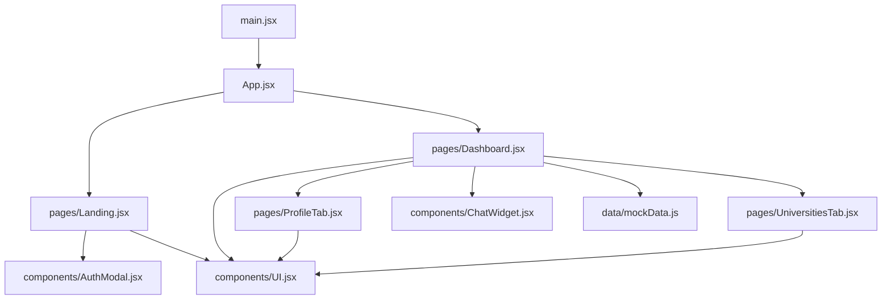
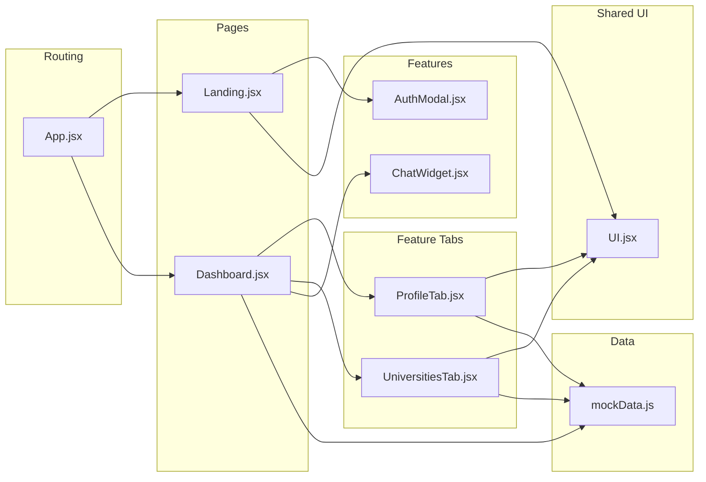
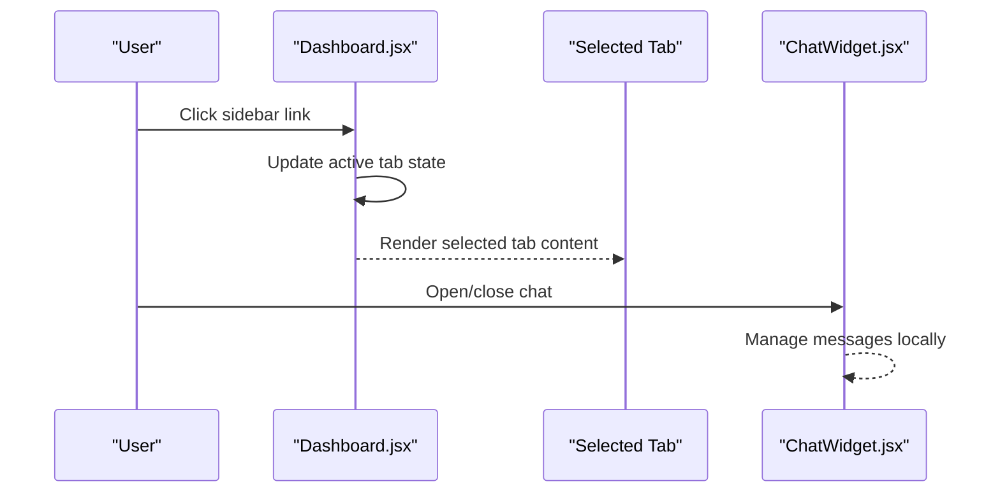
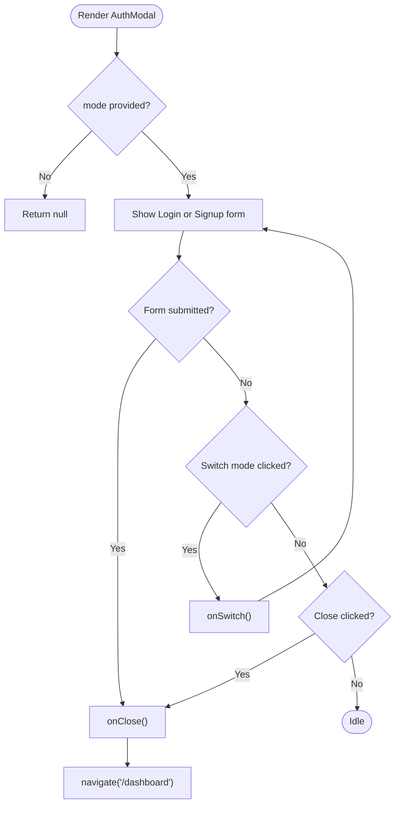
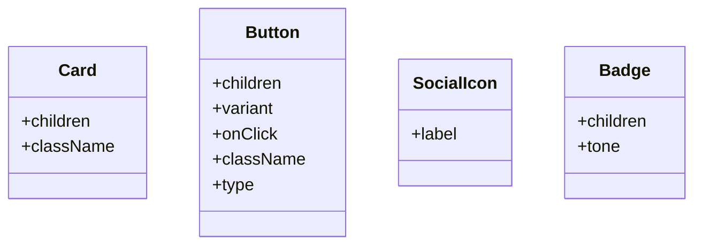
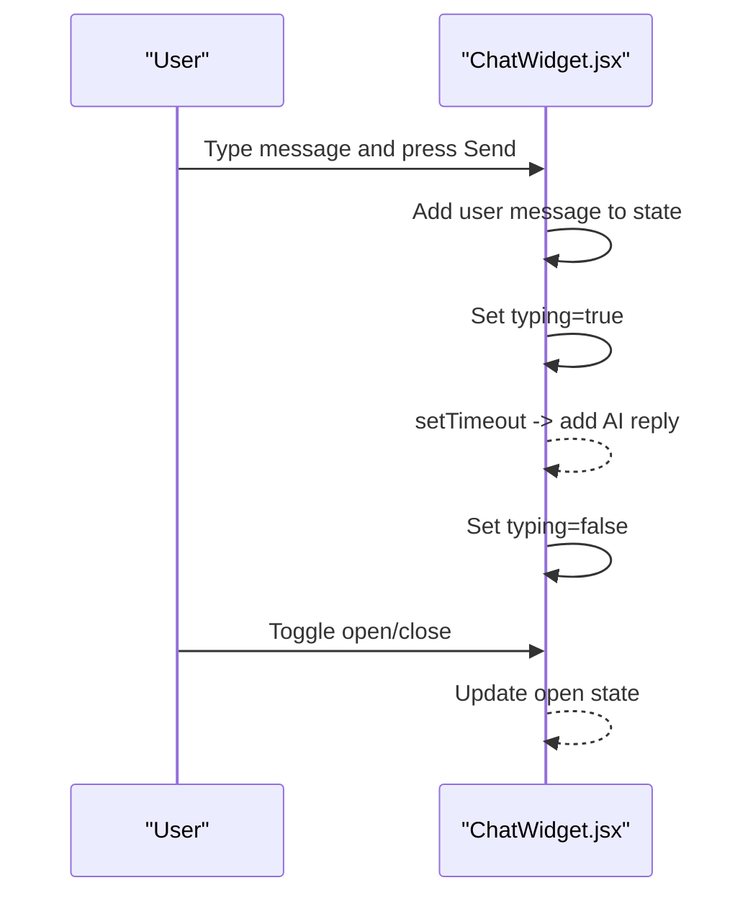
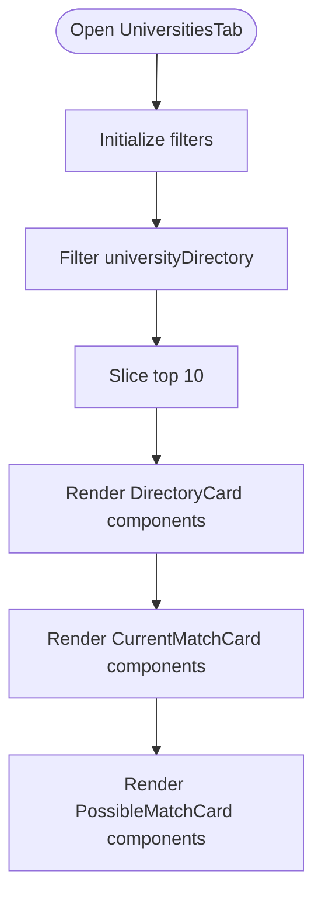
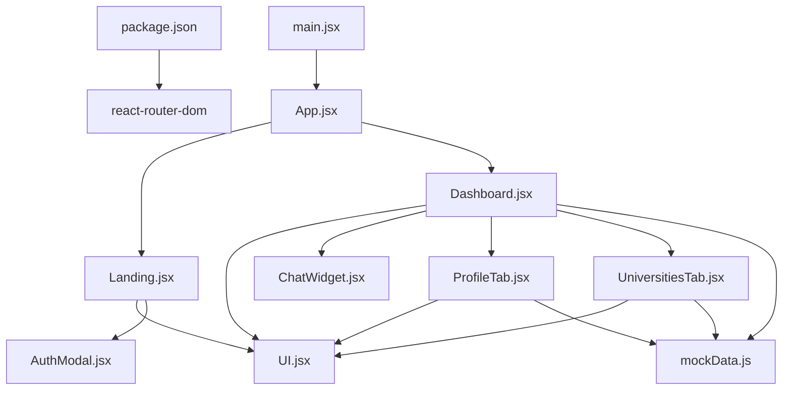

# Component Structure

<cite>
**Referenced Files in This Document**
- [main.jsx](file://scholarpath-frontend (2)/scholarpath/src/main.jsx)
- [App.jsx](file://scholarpath-frontend (2)/scholarpath/src/App.jsx)
- [Landing.jsx](file://scholarpath-frontend (2)/scholarpath/src/pages/Landing.jsx)
- [Dashboard.jsx](file://scholarpath-frontend (2)/scholarpath/src/pages/Dashboard.jsx)
- [ProfileTab.jsx](file://scholarpath-frontend (2)/scholarpath/src/pages/ProfileTab.jsx)
- [UniversitiesTab.jsx](file://scholarpath-frontend (2)/scholarpath/src/pages/UniversitiesTab.jsx)
- [AuthModal.jsx](file://scholarpath-frontend (2)/scholarpath/src/components/AuthModal.jsx)
- [ChatWidget.jsx](file://scholarpath-frontend (2)/scholarpath/src/components/ChatWidget.jsx)
- [UI.jsx](file://scholarpath-frontend (2)/scholarpath/src/components/UI.jsx)
- [mockData.js](file://scholarpath-frontend (2)/scholarpath/src/data/mockData.js)
- [package.json](file://scholarpath-frontend (2)/scholarpath/package.json)
</cite>

## Table of Contents
1. [Introduction](#introduction)
2. [Project Structure](#project-structure)
3. [Core Components](#core-components)
4. [Architecture Overview](#architecture-overview)
5. [Detailed Component Analysis](#detailed-component-analysis)
6. [Dependency Analysis](#dependency-analysis)
7. [Performance Considerations](#performance-considerations)
8. [Troubleshooting Guide](#troubleshooting-guide)
9. [Conclusion](#conclusion)

## Introduction
This document explains the React component structure for ScholarPathAI’s frontend. It focuses on how components are organized into reusable UI elements and page-specific modules, starting from the root App component. It documents the authentication modal, shared UI library, chat assistant widget, composition patterns, prop interfaces, state management, lifecycle usage, event handling, and the separation between presentational and container-like components.

## Project Structure
The application is a Vite + React project using React Router for navigation. The entry point renders the root App, which defines routes to Landing and Dashboard pages. Pages compose reusable UI components and feature-specific tabs. A small UI library provides consistent primitives like Card, Button, Badge, and SocialIcon.

**Diagram sources**
- [main.jsx:1-11](file://scholarpath-frontend (2)/scholarpath/src/main.jsx#L1-L11)
- [App.jsx:1-15](file://scholarpath-frontend (2)/scholarpath/src/App.jsx#L1-L15)
- [Landing.jsx:1-211](file://scholarpath-frontend (2)/scholarpath/src/pages/Landing.jsx#L1-L211)
- [Dashboard.jsx:1-187](file://scholarpath-frontend (2)/scholarpath/src/pages/Dashboard.jsx#L1-L187)
- [AuthModal.jsx:1-84](file://scholarpath-frontend (2)/scholarpath/src/components/AuthModal.jsx#L1-L84)
- [ChatWidget.jsx:1-104](file://scholarpath-frontend (2)/scholarpath/src/components/ChatWidget.jsx#L1-L104)
- [UI.jsx:1-47](file://scholarpath-frontend (2)/scholarpath/src/components/UI.jsx#L1-L47)
- [mockData.js:1-349](file://scholarpath-frontend (2)/scholarpath/src/data/mockData.js#L1-L349)

**Section sources**
- [main.jsx:1-11](file://scholarpath-frontend (2)/scholarpath/src/main.jsx#L1-L11)
- [App.jsx:1-15](file://scholarpath-frontend (2)/scholarpath/src/App.jsx#L1-L15)
- [package.json:1-28](file://scholarpath-frontend (2)/scholarpath/package.json#L1-L28)

## Core Components
- Root routing: App sets up BrowserRouter and two routes: home and dashboard.
- Landing page: Presents marketing content and triggers AuthModal via local state.
- Dashboard page: Hosts tabbed navigation and composes multiple feature tabs; integrates ChatWidget globally.
- AuthModal: Modal for login/signup flows with form fields and navigation after submission.
- ChatWidget: Floating assistant that manages message history and simulated AI replies.
- UI library: Shared presentational components (Card, Button, Badge, SocialIcon).

Key responsibilities:
- App: Routing only.
- Landing: Presentation and auth trigger.
- Dashboard: Container for tabs and global state (documents, profile form), plus integration of ChatWidget.
- AuthModal: Controlled by parent state; handles form submission and navigation.
- ChatWidget: Self-contained chat UI with internal state.
- UI: Pure presentational components with props-driven styling.

**Section sources**
- [App.jsx:1-15](file://scholarpath-frontend (2)/scholarpath/src/App.jsx#L1-L15)
- [Landing.jsx:1-211](file://scholarpath-frontend (2)/scholarpath/src/pages/Landing.jsx#L1-L211)
- [Dashboard.jsx:1-187](file://scholarpath-frontend (2)/scholarpath/src/pages/Dashboard.jsx#L1-L187)
- [AuthModal.jsx:1-84](file://scholarpath-frontend (2)/scholarpath/src/components/AuthModal.jsx#L1-L84)
- [ChatWidget.jsx:1-104](file://scholarpath-frontend (2)/scholarpath/src/components/ChatWidget.jsx#L1-L104)
- [UI.jsx:1-47](file://scholarpath-frontend (2)/scholarpath/src/components/UI.jsx#L1-L47)

## Architecture Overview
The architecture follows a clear separation:
- Routing layer (App) decides which page to render.
- Page layers (Landing, Dashboard) manage page-level state and compose feature tabs.
- Feature tabs (e.g., ProfileTab, UniversitiesTab) handle domain logic and presentation for their sections.
- Shared UI components provide consistent visual building blocks.
- Data is centralized in mockData for now, enabling easy swap to API later.

**Diagram sources**
- [App.jsx:1-15](file://scholarpath-frontend (2)/scholarpath/src/App.jsx#L1-L15)
- [Landing.jsx:1-211](file://scholarpath-frontend (2)/scholarpath/src/pages/Landing.jsx#L1-L211)
- [Dashboard.jsx:1-187](file://scholarpath-frontend (2)/scholarpath/src/pages/Dashboard.jsx#L1-L187)
- [ProfileTab.jsx:1-232](file://scholarpath-frontend (2)/scholarpath/src/pages/ProfileTab.jsx#L1-L232)
- [UniversitiesTab.jsx:1-163](file://scholarpath-frontend (2)/scholarpath/src/pages/UniversitiesTab.jsx#L1-L163)
- [AuthModal.jsx:1-84](file://scholarpath-frontend (2)/scholarpath/src/components/AuthModal.jsx#L1-L84)
- [ChatWidget.jsx:1-104](file://scholarpath-frontend (2)/scholarpath/src/components/ChatWidget.jsx#L1-L104)
- [UI.jsx:1-47](file://scholarpath-frontend (2)/scholarpath/src/components/UI.jsx#L1-L47)
- [mockData.js:1-349](file://scholarpath-frontend (2)/scholarpath/src/data/mockData.js#L1-L349)

## Detailed Component Analysis

### Root and Routing: App.jsx
- Purpose: Configure client-side routing and mount pages.
- Composition: Wraps Routes with BrowserRouter and declares two routes.
- Lifecycle: No lifecycle methods; purely declarative routing.
- Integration: Imports Landing and Dashboard pages.

**Section sources**
- [App.jsx:1-15](file://scholarpath-frontend (2)/scholarpath/src/App.jsx#L1-L15)

### Landing Page: Landing.jsx
- State: Local state controls AuthModal visibility and mode (login/signup).
- Events: Buttons set authMode to open the modal; modal callbacks close or switch modes.
- Composition: Uses UI components (Card, Button, Badge, SocialIcon) and AuthModal.
- Presentational vs Container: Mostly presentational; holds minimal UI state for modal control.

**Section sources**
- [Landing.jsx:1-211](file://scholarpath-frontend (2)/scholarpath/src/pages/Landing.jsx#L1-L211)

### Dashboard Page: Dashboard.jsx
- Role: Container component managing tab state and shared data (documents, profile form).
- State: Active tab, documents array, profile form object.
- Composition: Renders sidebar links and tab content mapping; includes ChatWidget at the bottom.
- Event Handling: Tab selection updates active tab; logout navigates back to home.
- Data Source: Reads from mockData for overview metrics and lists.

**Diagram sources**
- [Dashboard.jsx:1-187](file://scholarpath-frontend (2)/scholarpath/src/pages/Dashboard.jsx#L1-L187)
- [ChatWidget.jsx:1-104](file://scholarpath-frontend (2)/scholarpath/src/components/ChatWidget.jsx#L1-L104)

**Section sources**
- [Dashboard.jsx:1-187](file://scholarpath-frontend (2)/scholarpath/src/pages/Dashboard.jsx#L1-L187)
- [mockData.js:1-349](file://scholarpath-frontend (2)/scholarpath/src/data/mockData.js#L1-L349)

### Authentication Flow: AuthModal.jsx
- Props:
  - mode: 'login' | 'signup' | null — controls displayed form and text.
  - onClose: function — called to dismiss modal.
  - onSwitch: function — toggles between login and signup modes.
- Internal State:
  - showPassword: boolean — toggles password visibility.
- Events:
  - Form submit prevents default, closes modal, and navigates to /dashboard.
  - Close button calls onClose.
  - Switch link calls onSwitch.
- Lifecycle:
  - Conditional rendering based on mode; returns null when no mode is set.
- Composition:
  - Uses UI Card and Button.

**Diagram sources**
- [AuthModal.jsx:1-84](file://scholarpath-frontend (2)/scholarpath/src/components/AuthModal.jsx#L1-L84)

**Section sources**
- [AuthModal.jsx:1-84](file://scholarpath-frontend (2)/scholarpath/src/components/AuthModal.jsx#L1-L84)

### Shared UI Library: UI.jsx
- Components:
  - Card: Wrapper with consistent background, border, radius, and shadow. Accepts children and className.
  - Button: Styled button supporting variants (primary, secondary, ghost), onClick, type, and className.
  - SocialIcon: Simple icon placeholder with hover styles.
  - Badge: Small label with tone-based color schemes.
- Pattern: Pure presentational components driven by props; no side effects.

**Diagram sources**
- [UI.jsx:1-47](file://scholarpath-frontend (2)/scholarpath/src/components/UI.jsx#L1-L47)

**Section sources**
- [UI.jsx:1-47](file://scholarpath-frontend (2)/scholarpath/src/components/UI.jsx#L1-L47)

### Chat Assistant: ChatWidget.jsx
- Internal State:
  - open: boolean — controls visibility of the chat panel.
  - messages: array — stores user and AI messages with id, from, text.
  - input: string — current input value.
  - typing: boolean — shows typing indicator while simulating response.
- Effects:
  - Auto-scrolls to bottom when messages or typing state changes.
- Events:
  - Send handler validates input, adds user message, simulates AI reply after delay, clears typing.
  - Toggle open state via floating button.
- Composition:
  - Uses UI Button; renders styled message bubbles and header.

**Diagram sources**
- [ChatWidget.jsx:1-104](file://scholarpath-frontend (2)/scholarpath/src/components/ChatWidget.jsx#L1-L104)

**Section sources**
- [ChatWidget.jsx:1-104](file://scholarpath-frontend (2)/scholarpath/src/components/ChatWidget.jsx#L1-L104)

### Feature Tabs: ProfileTab.jsx and UniversitiesTab.jsx
- ProfileTab.jsx:
  - Receives form and documents from Dashboard via props (container pattern).
  - Computes checklist status based on form and document states.
  - Handles file uploads and simulated CV analysis to auto-fill form.
  - Uses UI components for layout and feedback.
- UniversitiesTab.jsx:
  - Manages filter state (country, degree, department).
  - Filters university directory and displays top results.
  - Shows current matches and possible matches with guidance.
  - Uses UI components for cards and badges.

**Diagram sources**
- [UniversitiesTab.jsx:1-163](file://scholarpath-frontend (2)/scholarpath/src/pages/UniversitiesTab.jsx#L1-L163)

**Section sources**
- [ProfileTab.jsx:1-232](file://scholarpath-frontend (2)/scholarpath/src/pages/ProfileTab.jsx#L1-L232)
- [UniversitiesTab.jsx:1-163](file://scholarpath-frontend (2)/scholarpath/src/pages/UniversitiesTab.jsx#L1-L163)

### Data Layer: mockData.js
- Centralized static data for student profile, required documents, university matches, possible matches, directory, scholarships, attestation options, and FAQs.
- Enables decoupling of UI from data source; future backend integration can replace this file without changing components.

**Section sources**
- [mockData.js:1-349](file://scholarpath-frontend (2)/scholarpath/src/data/mockData.js#L1-L349)

## Dependency Analysis
- Entry and Routing:
  - main.jsx mounts App.
  - App.jsx depends on react-router-dom and imports Landing and Dashboard.
- Pages:
  - Landing depends on UI components and AuthModal.
  - Dashboard depends on UI components, ChatWidget, and multiple feature tabs; reads from mockData.
- Feature Tabs:
  - ProfileTab and UniversitiesTab depend on UI components and mockData.
- Shared UI:
  - UI components have no internal dependencies beyond React.
- External Dependencies:
  - React, React DOM, React Router DOM.

**Diagram sources**
- [package.json:1-28](file://scholarpath-frontend (2)/scholarpath/package.json#L1-L28)
- [main.jsx:1-11](file://scholarpath-frontend (2)/scholarpath/src/main.jsx#L1-L11)
- [App.jsx:1-15](file://scholarpath-frontend (2)/scholarpath/src/App.jsx#L1-L15)
- [Landing.jsx:1-211](file://scholarpath-frontend (2)/scholarpath/src/pages/Landing.jsx#L1-L211)
- [Dashboard.jsx:1-187](file://scholarpath-frontend (2)/scholarpath/src/pages/Dashboard.jsx#L1-L187)
- [ProfileTab.jsx:1-232](file://scholarpath-frontend (2)/scholarpath/src/pages/ProfileTab.jsx#L1-L232)
- [UniversitiesTab.jsx:1-163](file://scholarpath-frontend (2)/scholarpath/src/pages/UniversitiesTab.jsx#L1-L163)
- [AuthModal.jsx:1-84](file://scholarpath-frontend (2)/scholarpath/src/components/AuthModal.jsx#L1-L84)
- [ChatWidget.jsx:1-104](file://scholarpath-frontend (2)/scholarpath/src/components/ChatWidget.jsx#L1-L104)
- [UI.jsx:1-47](file://scholarpath-frontend (2)/scholarpath/src/components/UI.jsx#L1-L47)
- [mockData.js:1-349](file://scholarpath-frontend (2)/scholarpath/src/data/mockData.js#L1-L349)

**Section sources**
- [package.json:1-28](file://scholarpath-frontend (2)/scholarpath/package.json#L1-L28)
- [main.jsx:1-11](file://scholarpath-frontend (2)/scholarpath/src/main.jsx#L1-L11)
- [App.jsx:1-15](file://scholarpath-frontend (2)/scholarpath/src/App.jsx#L1-L15)

## Performance Considerations
- Rendering Efficiency:
  - Use memoization where appropriate (e.g., computed lists in UniversitiesTab) to avoid unnecessary recalculations.
- State Scope:
  - Keep localized state within components (e.g., ChatWidget) to minimize re-renders in parent trees.
- Navigation:
  - Client-side routing via react-router-dom avoids full page reloads.
- Data Access:
  - Centralized mockData reduces repeated fetches; consider caching strategies when migrating to APIs.

[No sources needed since this section provides general guidance]

## Troubleshooting Guide
- AuthModal not appearing:
  - Ensure parent passes a valid mode ('login' or 'signup'); otherwise, the component returns null.
- Navigation after login:
  - Confirm useNavigate is available (requires react-router-dom setup) and that the route '/dashboard' exists.
- Chat messages not scrolling:
  - Verify useEffect dependency on messages and typing; ensure bottomRef is attached to the scroll container.
- Form updates not reflected:
  - In ProfileTab, ensure setForm is used immutably and keys match expected fields.
- Filtering yields no results:
  - In UniversitiesTab, check filter values and ensure they exist in the dataset.

**Section sources**
- [AuthModal.jsx:1-84](file://scholarpath-frontend (2)/scholarpath/src/components/AuthModal.jsx#L1-L84)
- [ChatWidget.jsx:1-104](file://scholarpath-frontend (2)/scholarpath/src/components/ChatWidget.jsx#L1-L104)
- [ProfileTab.jsx:1-232](file://scholarpath-frontend (2)/scholarpath/src/pages/ProfileTab.jsx#L1-L232)
- [UniversitiesTab.jsx:1-163](file://scholarpath-frontend (2)/scholarpath/src/pages/UniversitiesTab.jsx#L1-L163)

## Conclusion
ScholarPathAI’s frontend uses a clean, layered component architecture:
- App configures routing.
- Pages manage page-level state and compose features.
- Feature tabs encapsulate domain logic and presentation.
- A small UI library ensures consistency.
- AuthModal and ChatWidget demonstrate controlled modals and self-contained interactive widgets.
- State is kept close to where it’s used, with shared state lifted to Dashboard when necessary.
This structure supports maintainability, testability, and future scaling to real data sources.

[No sources needed since this section summarizes without analyzing specific files]