# Frontend Architecture

<cite>
**Referenced Files in This Document**
- [main.jsx](file://scholarpath-frontend (2)/scholarpath/src/main.jsx)
- [App.jsx](file://scholarpath-frontend (2)/scholarpath/src/App.jsx)
- [package.json](file://scholarpath-frontend (2)/scholarpath/package.json)
- [vite.config.js](file://scholarpath-frontend (2)/scholarpath/vite.config.js)
- [postcss.config.js](file://scholarpath-frontend (2)/scholarpath/postcss.config.js)
- [tailwind.config.js](file://scholarpath-frontend (2)/scholarpath/tailwind.config.js)
- [index.css](file://scholarpath-frontend (2)/scholarpath/src/index.css)
- [Landing.jsx](file://scholarpath-frontend (2)/scholarpath/src/pages/Landing.jsx)
- [Dashboard.jsx](file://scholarpath-frontend (2)/scholarpath/src/pages/Dashboard.jsx)
- [AuthModal.jsx](file://scholarpath-frontend (2)/scholarpath/src/components/AuthModal.jsx)
- [UI.jsx](file://scholarpath-frontend (2)/scholarpath/src/components/UI.jsx)
- [ChatWidget.jsx](file://scholarpath-frontend (2)/scholarpath/src/components/ChatWidget.jsx)
- [ProfileTab.jsx](file://scholarpath-frontend (2)/scholarpath/src/pages/ProfileTab.jsx)
- [mockData.js](file://scholarpath-frontend (2)/scholarpath/src/data/mockData.js)
- [vercel.json](file://scholarpath-frontend (2)/scholarpath/vercel.json)
- [.env.development](file://scholarpath-frontend (2)/scholarpath/.env.development)
- [.env.production](file://scholarpath-frontend (2)/scholarpath/.env.production)
- [.gitignore](file://scholarpath-frontend (2)/scholarpath/.gitignore)
- [api.js](file://scholarpath-frontend (2)/scholarpath/src/api.js)
</cite>

## Update Summary
**Changes Made**
- Added comprehensive documentation for single deployment architecture with Vercel configuration
- Updated API integration section to reflect environment-based proxy configuration
- Added deployment configuration details including rewrite rules and environment variables
- Enhanced troubleshooting guide with deployment-specific issues
- Updated project structure to include deployment configuration files

## Table of Contents
1. Introduction
2. Project Structure
3. Core Components
4. Architecture Overview
5. Deployment Configuration
6. Detailed Component Analysis
7. Dependency Analysis
8. Performance Considerations
9. Troubleshooting Guide
10. Conclusion

## Introduction
This document explains the frontend architecture of ScholarPathAI. It is a React application built with Vite, styled with Tailwind CSS, and uses react-router-dom for routing between the landing page and dashboard. The app follows a component-based structure with reusable UI primitives, local state via React hooks, and a centralized mock data layer that can be swapped for real backend APIs later. **Updated**: The application now supports a single deployment architecture using Vercel with automatic API proxying to the deployed backend.

## Project Structure
The project is organized by feature areas:
- Entry points: main.jsx renders the root React tree; App.jsx configures routes.
- Pages: Landing and Dashboard are top-level views.
- Components: Shared UI primitives (Card, Button, Badge, SocialIcon), AuthModal, and ChatWidget.
- Data: A single mock data file centralizes static content used across pages.
- Styling: Tailwind CSS with custom theme tokens and global styles.
- **Deployment**: Vercel configuration with rewrite rules for API proxying and environment-specific settings.

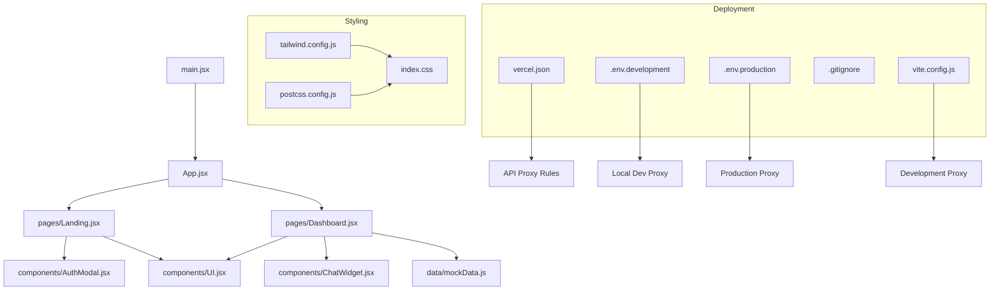

**Diagram sources**
- [main.jsx:1-11](file://scholarpath-frontend (2)/scholarpath/src/main.jsx#L1-L11)
- [App.jsx:1-15](file://scholarpath-frontend (2)/scholarpath/src/App.jsx#L1-L15)
- [Landing.jsx:1-211](file://scholarpath-frontend (2)/scholarpath/src/pages/Landing.jsx#L1-L211)
- [Dashboard.jsx:1-187](file://scholarpath-frontend (2)/scholarpath/src/pages/Dashboard.jsx#L1-L187)
- [AuthModal.jsx:1-84](file://scholarpath-frontend (2)/scholarpath/src/components/AuthModal.jsx#L1-L84)
- [UI.jsx:1-47](file://scholarpath-frontend (2)/scholarpath/src/components/UI.jsx#L1-L47)
- [ChatWidget.jsx:1-104](file://scholarpath-frontend (2)/scholarpath/src/components/ChatWidget.jsx#L1-L104)
- [mockData.js:1-349](file://scholarpath-frontend (2)/scholarpath/src/data/mockData.js#L1-L349)
- [tailwind.config.js:1-31](file://scholarpath-frontend (2)/scholarpath/tailwind.config.js#L1-L31)
- [postcss.config.js:1-7](file://scholarpath-frontend (2)/scholarpath/postcss.config.js#L1-L7)
- [index.css:1-35](file://scholarpath-frontend (2)/scholarpath/src/index.css#L1-L35)
- [vercel.json:1-7](file://scholarpath-frontend (2)/scholarpath/vercel.json#L1-L7)
- [.env.development:1-2](file://scholarpath-frontend (2)/scholarpath/.env.development#L1-L2)
- [.env.production:1-2](file://scholarpath-frontend (2)/scholarpath/.env.production#L1-L2)
- [vite.config.js:1-16](file://scholarpath-frontend (2)/scholarpath/vite.config.js#L1-L16)

**Section sources**
- [main.jsx:1-11](file://scholarpath-frontend (2)/scholarpath/src/main.jsx#L1-L11)
- [App.jsx:1-15](file://scholarpath-frontend (2)/scholarpath/src/App.jsx#L1-L15)
- [package.json:1-28](file://scholarpath-frontend (2)/scholarpath/package.json#L1-L28)
- [vite.config.js:1-16](file://scholarpath-frontend (2)/scholarpath/vite.config.js#L1-L16)
- [tailwind.config.js:1-31](file://scholarpath-frontend (2)/scholarpath/tailwind.config.js#L1-L31)
- [postcss.config.js:1-7](file://scholarpath-frontend (2)/scholarpath/postcss.config.js#L1-L7)
- [index.css:1-35](file://scholarpath-frontend (2)/scholarpath/src/index.css#L1-L35)

## Core Components
- App: Root component that sets up client-side routing with two routes: home (landing) and dashboard.
- Landing: Marketing page with hero, features, steps, stats, and calls to action. Integrates an authentication modal and uses shared UI components.
- Dashboard: Main application shell with a sidebar tab system and multiple feature tabs (overview, profile, documents attestation, universities, scholarships, build CV, FAQ). Uses local state to manage active tab and shared form/document state.
- AuthModal: Accessible modal for login/signup flows; currently mocks authentication and navigates to the dashboard.
- UI: Reusable primitives (Card, Button, Badge, SocialIcon) encapsulate consistent styling and behavior.
- ChatWidget: Floating assistant widget with message history, typing indicator, and canned replies.
- ProfileTab: Complex form with checklist computation, document upload simulation, and optional "Analyze" flow to auto-fill fields from a mock CV extraction.

**Section sources**
- [App.jsx:1-15](file://scholarpath-frontend (2)/scholarpath/src/App.jsx#L1-L15)
- [Landing.jsx:1-211](file://scholarpath-frontend (2)/scholarpath/src/pages/Landing.jsx#L1-L211)
- [Dashboard.jsx:1-187](file://scholarpath-frontend (2)/scholarpath/src/pages/Dashboard.jsx#L1-L187)
- [AuthModal.jsx:1-84](file://scholarpath-frontend (2)/scholarpath/src/components/AuthModal.jsx#L1-L84)
- [UI.jsx:1-47](file://scholarpath-frontend (2)/scholarpath/src/components/UI.jsx#L1-L47)
- [ChatWidget.jsx:1-104](file://scholarpath-frontend (2)/scholarpath/src/components/ChatWidget.jsx#L1-L104)
- [ProfileTab.jsx:1-232](file://scholarpath-frontend (2)/scholarpath/src/pages/ProfileTab.jsx#L1-L232)

## Architecture Overview
The application uses a simple, scalable architecture:
- Routing: react-router-dom defines two top-level routes. Navigation between them is handled via programmatic navigation.
- State: Local state via useState manages UI interactions (active tab, auth modal visibility, chat messages, forms). No global context or external state library is used at this stage.
- Data: A centralized mock data module provides all static content. It is designed to be replaced by API calls without changing components.
- Styling: Tailwind CSS with a custom theme (colors, fonts, shadows) ensures brand consistency and responsive layouts. Global CSS adds animations and base resets.
- **Deployment**: Single deployment architecture with Vercel handling both frontend and API proxying through rewrite rules.

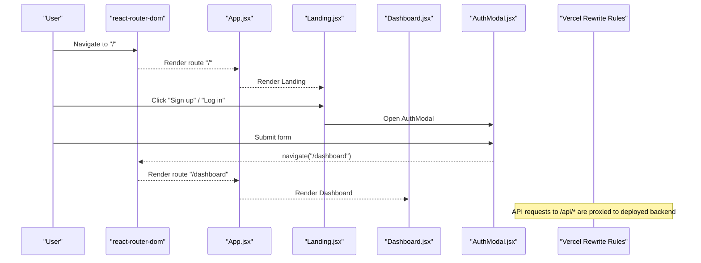

**Diagram sources**
- [App.jsx:1-15](file://scholarpath-frontend (2)/scholarpath/src/App.jsx#L1-L15)
- [Landing.jsx:1-211](file://scholarpath-frontend (2)/scholarpath/src/pages/Landing.jsx#L1-L211)
- [AuthModal.jsx:1-84](file://scholarpath-frontend (2)/scholarpath/src/components/AuthModal.jsx#L1-L84)
- [Dashboard.jsx:1-187](file://scholarpath-frontend (2)/scholarpath/src/pages/Dashboard.jsx#L1-L187)
- [vercel.json:1-7](file://scholarpath-frontend (2)/scholarpath/vercel.json#L1-L7)

## Deployment Configuration
**New Section** - The application now supports a single deployment architecture using Vercel with automatic API proxying.

### Vercel Configuration
The `vercel.json` file defines rewrite rules that handle API routing:
- `/api/:path*` requests are proxied to the deployed backend URL (`https://aischolarpath-backend-main.vercel.app/api/:path*`)
- All other routes fall back to the SPA entry point (`/`)

### Environment Configuration
Environment-specific configuration is managed through `.env` files:
- `.env.development`: Sets `VITE_API_URL=/api` for local development
- `.env.production`: Sets `VITE_API_URL=/api` for production builds

### Development vs Production Proxying
- **Development**: Vite dev server proxies `/api` requests to `http://localhost:3000` (local backend)
- **Production**: Vercel rewrites proxy `/api` requests to the deployed backend URL

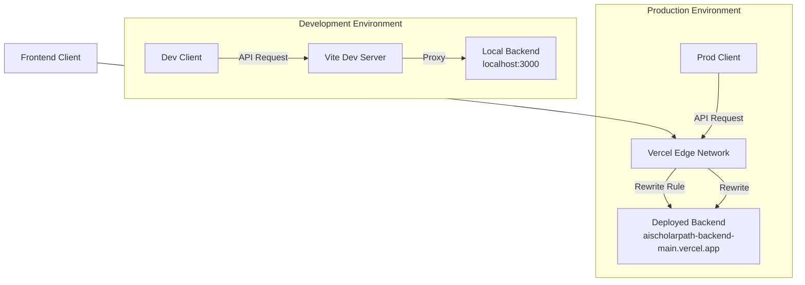

**Diagram sources**
- [vercel.json:1-7](file://scholarpath-frontend (2)/scholarpath/vercel.json#L1-L7)
- [.env.development:1-2](file://scholarpath-frontend (2)/scholarpath/.env.development#L1-L2)
- [.env.production:1-2](file://scholarpath-frontend (2)/scholarpath/.env.production#L1-L2)
- [vite.config.js:7-15](file://scholarpath-frontend (2)/scholarpath/vite.config.js#L7-L15)

**Section sources**
- [vercel.json:1-7](file://scholarpath-frontend (2)/scholarpath/vercel.json#L1-L7)
- [.env.development:1-2](file://scholarpath-frontend (2)/scholarpath/.env.development#L1-L2)
- [.env.production:1-2](file://scholarpath-frontend (2)/scholarpath/.env.production#L1-L2)
- [vite.config.js:7-15](file://scholarpath-frontend (2)/scholarpath/vite.config.js#L7-L15)

## Detailed Component Analysis

### Routing and Navigation
- Routes: Two routes are defined — root path for the landing page and /dashboard for the authenticated area.
- Navigation: Programmatic navigation is used within components (e.g., after authentication) to move between pages.

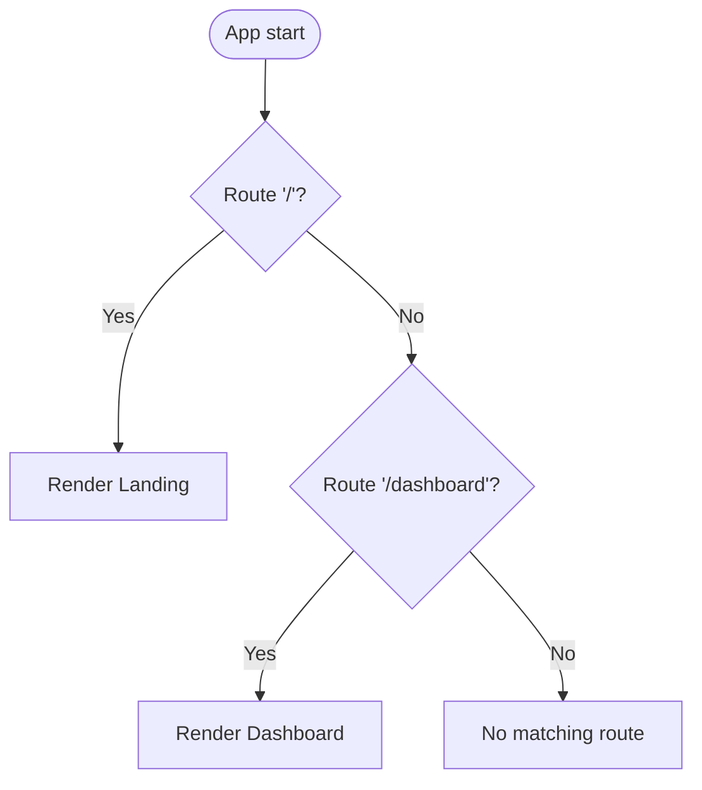

**Diagram sources**
- [App.jsx:1-15](file://scholarpath-frontend (2)/scholarpath/src/App.jsx#L1-L15)

**Section sources**
- [App.jsx:1-15](file://scholarpath-frontend (2)/scholarpath/src/App.jsx#L1-L15)

### Landing Page
- Purpose: Introduce the product, showcase features, and drive sign-ups/logins.
- Composition: Uses shared UI components (Card, Button, Badge, SocialIcon) and integrates AuthModal for authentication.
- Responsiveness: Tailwind utility classes handle layout shifts across screen sizes.

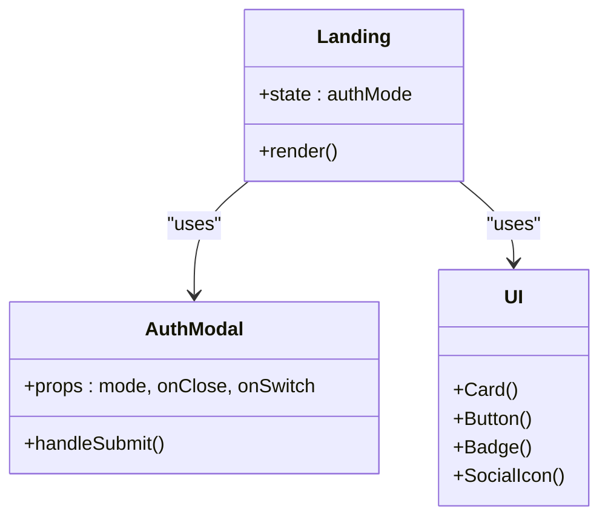

**Diagram sources**
- [Landing.jsx:1-211](file://scholarpath-frontend (2)/scholarpath/src/pages/Landing.jsx#L1-L211)
- [AuthModal.jsx:1-84](file://scholarpath-frontend (2)/scholarpath/src/components/AuthModal.jsx#L1-L84)
- [UI.jsx:1-47](file://scholarpath-frontend (2)/scholarpath/src/components/UI.jsx#L1-L47)

**Section sources**
- [Landing.jsx:1-211](file://scholarpath-frontend (2)/scholarpath/src/pages/Landing.jsx#L1-L211)

### Dashboard and Tabs
- Shell: Sticky header with branding and logout; responsive grid with sticky sidebar and scrollable content.
- Tab system: Internal state controls which tab content to render. Each tab is a separate page component.
- Shared state: Form and documents state are lifted to Dashboard so child tabs can read/write consistently.

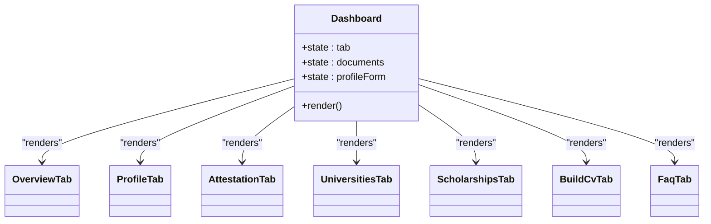

**Diagram sources**
- [Dashboard.jsx:1-187](file://scholarpath-frontend (2)/scholarpath/src/pages/Dashboard.jsx#L1-L187)

**Section sources**
- [Dashboard.jsx:1-187](file://scholarpath-frontend (2)/scholarpath/src/pages/Dashboard.jsx#L1-L187)

### Authentication Modal
- Behavior: Toggles between login and signup modes, handles form submission, and navigates to the dashboard.
- Accessibility: Includes aria-labels and keyboard-friendly controls.

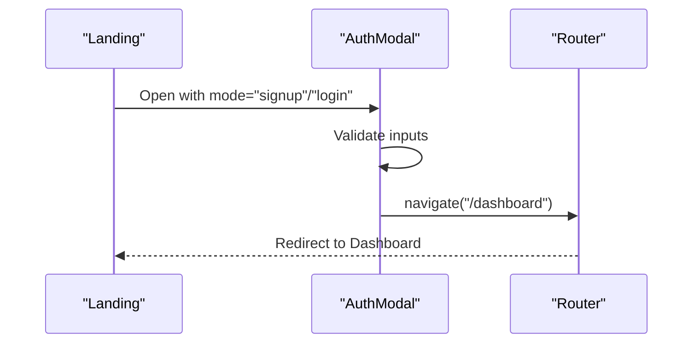

**Diagram sources**
- [Landing.jsx:1-211](file://scholarpath-frontend (2)/scholarpath/src/pages/Landing.jsx#L1-L211)
- [AuthModal.jsx:1-84](file://scholarpath-frontend (2)/scholarpath/src/components/AuthModal.jsx#L1-L84)
- [App.jsx:1-15](file://scholarpath-frontend (2)/scholarpath/src/App.jsx#L1-L15)

**Section sources**
- [AuthModal.jsx:1-84](file://scholarpath-frontend (2)/scholarpath/src/components/AuthModal.jsx#L1-L84)

### Chat Widget
- Functionality: Toggleable floating chat with message list, input, typing indicator, and canned AI responses.
- UX: Auto-scrolls to latest message; accessible close button and label.

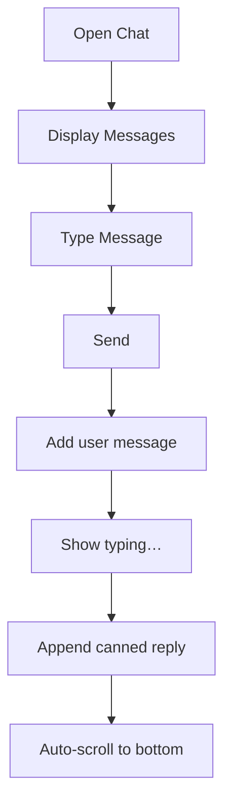

**Diagram sources**
- [ChatWidget.jsx:1-104](file://scholarpath-frontend (2)/scholarpath/src/components/ChatWidget.jsx#L1-L104)

**Section sources**
- [ChatWidget.jsx:1-104](file://scholarpath-frontend (2)/scholarpath/src/components/ChatWidget.jsx#L1-L104)

### Profile Tab and Checklist Logic
- Checklist computation: Dynamically marks items complete based on form values and document statuses.
- Document handling: Upload updates status; optional "Analyze" simulates extracting data to prefill the form.

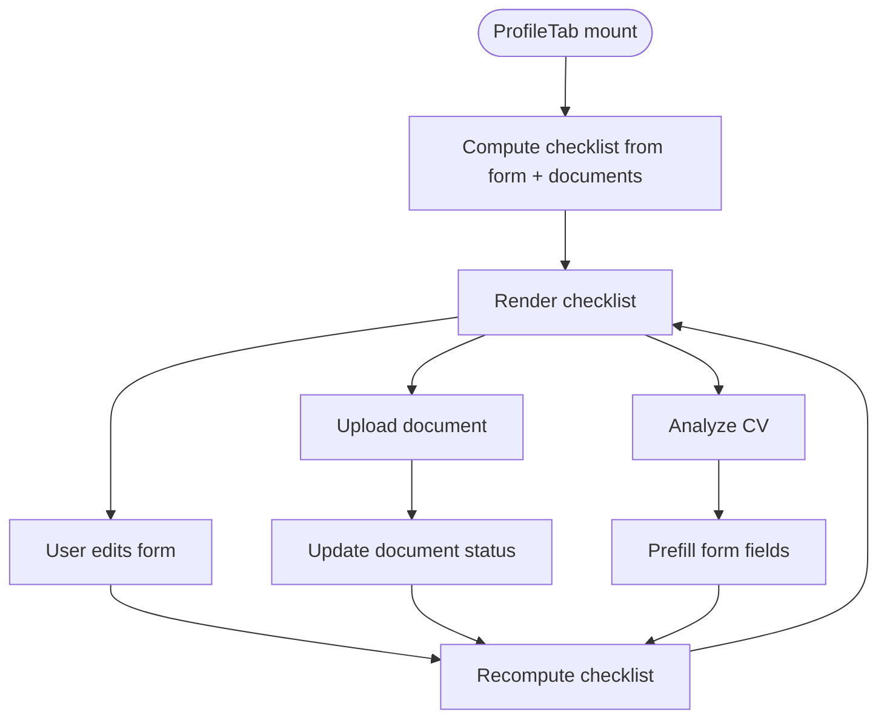

**Diagram sources**
- [ProfileTab.jsx:1-232](file://scholarpath-frontend (2)/scholarpath/src/pages/ProfileTab.jsx#L1-L232)

**Section sources**
- [ProfileTab.jsx:1-232](file://scholarpath-frontend (2)/scholarpath/src/pages/ProfileTab.jsx#L1-L232)

### API Integration and Error Handling
**Updated** - The API integration now supports environment-based configuration for seamless deployment.

- **Base URL Configuration**: The `api.js` module uses `import.meta.env.VITE_API_URL` to determine the API base URL, defaulting to `/api` if not specified.
- **Error Handling**: Comprehensive error handling includes network errors, non-JSON responses, and HTTP status codes.
- **Authentication**: Token management through localStorage with automatic inclusion in request headers.
- **Environment Support**: Works seamlessly in both development (local backend) and production (deployed backend) environments.

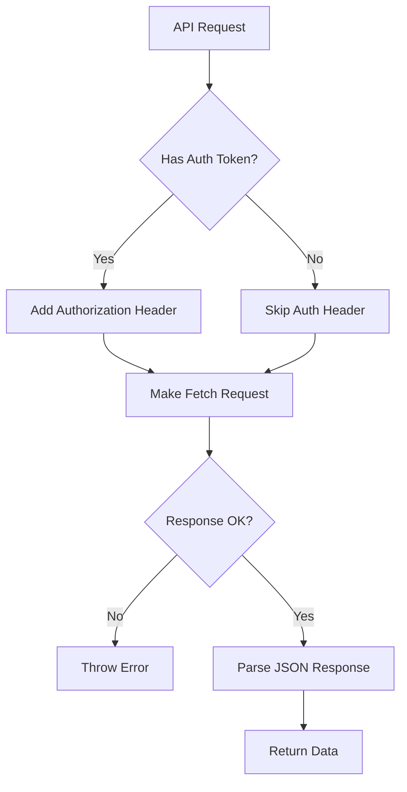

**Diagram sources**
- [api.js:1-179](file://scholarpath-frontend (2)/scholarpath/src/api.js#L1-L179)

**Section sources**
- [api.js:1-179](file://scholarpath-frontend (2)/scholarpath/src/api.js#L1-L179)

### Styling Architecture
- Tailwind configuration: Custom color palette, font family, and shadow utilities define the visual identity.
- PostCSS: Enables Tailwind directives and autoprefixing.
- Global CSS: Imports Inter font, applies Tailwind layers, resets box-sizing, and defines fade-up animation with reduced motion support.

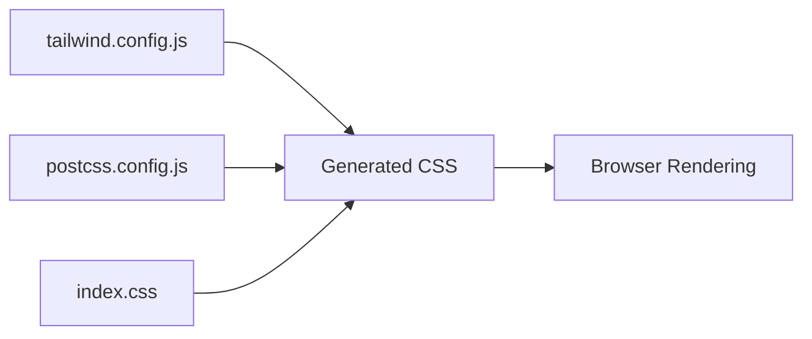

**Diagram sources**
- [tailwind.config.js:1-31](file://scholarpath-frontend (2)/scholarpath/tailwind.config.js#L1-L31)
- [postcss.config.js:1-7](file://scholarpath-frontend (2)/scholarpath/postcss.config.js#L1-L7)
- [index.css:1-35](file://scholarpath-frontend (2)/scholarpath/src/index.css#L1-L35)

**Section sources**
- [tailwind.config.js:1-31](file://scholarpath-frontend (2)/scholarpath/tailwind.config.js#L1-L31)
- [postcss.config.js:1-7](file://scholarpath-frontend (2)/scholarpath/postcss.config.js#L1-L7)
- [index.css:1-35](file://scholarpath-frontend (2)/scholarpath/src/index.css#L1-L35)

## Dependency Analysis
- Build tooling: Vite with React plugin; scripts for dev, build, lint, preview.
- Runtime dependencies: React, ReactDOM, react-router-dom.
- Dev dependencies: Tailwind CSS, Autoprefixer, PostCSS, Oxlint, Vite, React types.

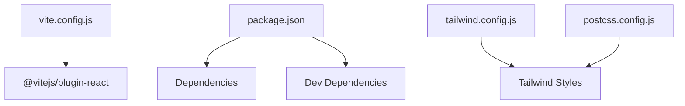

**Diagram sources**
- [vite.config.js:1-16](file://scholarpath-frontend (2)/scholarpath/vite.config.js#L1-L16)
- [package.json:1-28](file://scholarpath-frontend (2)/scholarpath/package.json#L1-L28)
- [tailwind.config.js:1-31](file://scholarpath-frontend (2)/scholarpath/tailwind.config.js#L1-L31)
- [postcss.config.js:1-7](file://scholarpath-frontend (2)/scholarpath/postcss.config.js#L1-L7)

**Section sources**
- [package.json:1-28](file://scholarpath-frontend (2)/scholarpath/package.json#L1-L28)
- [vite.config.js:1-16](file://scholarpath-frontend (2)/scholarpath/vite.config.js#L1-L16)

## Performance Considerations
- Lightweight routing: Only two top-level routes keep the initial bundle small and navigation fast.
- Local state: Using useState avoids unnecessary re-renders and keeps logic co-located with components.
- Static data: Centralized mock data reduces duplication and makes future API integration straightforward.
- Styling: Tailwind's utility-first approach minimizes custom CSS and leverages efficient class composition.
- Animations: Fade-up animation respects reduced motion preferences for accessibility and performance.
- **Deployment Optimization**: Vercel's edge network provides fast global delivery with automatic caching and CDN optimization.

## Troubleshooting Guide
- Routing issues: Ensure routes are correctly defined in App.jsx and that navigation functions are called from within routed components.
- Modal not closing: Verify that onClose handlers are passed down and invoked on submit or close buttons.
- Tab switching: Confirm that tab state is updated and that tabContent mapping includes the correct keys.
- Form updates: Check that field onChange handlers update the correct keys in the form object.
- Document status: Ensure uploads update the corresponding document entry and that computed checklist reflects new states.
- Styling problems: Confirm Tailwind directives are present in index.css and that PostCSS/Tailwind configs include the correct source paths.
- **API Connection Issues**: 
  - Development: Verify local backend is running on port 3000 and Vite proxy is configured correctly
  - Production: Check Vercel rewrite rules in vercel.json and ensure backend URL is accessible
  - Environment variables: Confirm VITE_API_URL is set correctly in .env files
- **Deployment Issues**:
  - Vercel configuration: Ensure vercel.json has correct rewrite rules and backend URL
  - Git tracking: .vercel directory should be ignored to prevent deployment configuration conflicts
  - Build process: Verify that environment variables are properly set during build time

**Section sources**
- [App.jsx:1-15](file://scholarpath-frontend (2)/scholarpath/src/App.jsx#L1-L15)
- [AuthModal.jsx:1-84](file://scholarpath-frontend (2)/scholarpath/src/components/AuthModal.jsx#L1-L84)
- [Dashboard.jsx:1-187](file://scholarpath-frontend (2)/scholarpath/src/pages/Dashboard.jsx#L1-L187)
- [ProfileTab.jsx:1-232](file://scholarpath-frontend (2)/scholarpath/src/pages/ProfileTab.jsx#L1-L232)
- [index.css:1-35](file://scholarpath-frontend (2)/scholarpath/src/index.css#L1-L35)
- [vercel.json:1-7](file://scholarpath-frontend (2)/scholarpath/vercel.json#L1-L7)
- [.env.development:1-2](file://scholarpath-frontend (2)/scholarpath/.env.development#L1-L2)
- [.env.production:1-2](file://scholarpath-frontend (2)/scholarpath/.env.production#L1-L2)
- [vite.config.js:7-15](file://scholarpath-frontend (2)/scholarpath/vite.config.js#L7-L15)

## Conclusion
ScholarPathAI's frontend is a clean, component-driven React application powered by Vite and Tailwind CSS. **Updated**: The application now supports a single deployment architecture using Vercel with automatic API proxying, making it easy to deploy both frontend and backend together. Routing separates marketing and application experiences, while local state and a centralized data layer keep the codebase maintainable. The design emphasizes reusable UI components, responsive layouts, clear separation of concerns, and seamless deployment configuration, making it straightforward to integrate real backend APIs and expand functionality.