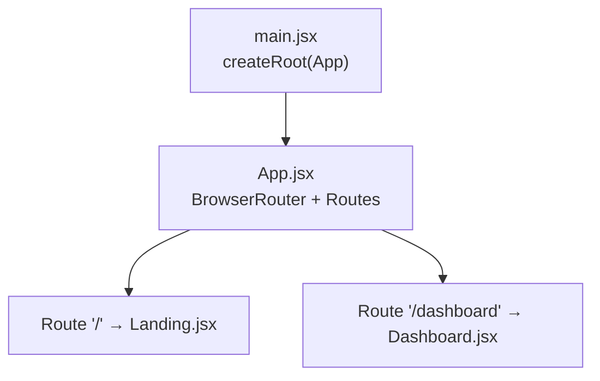
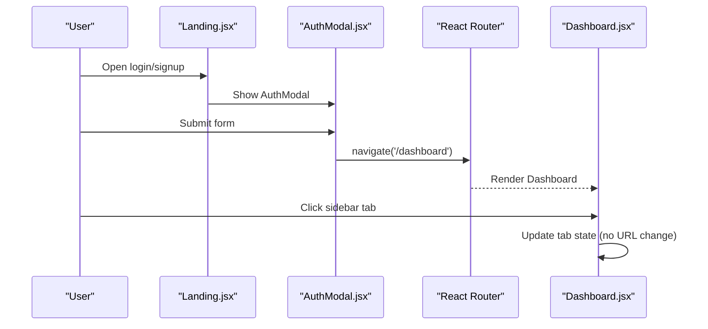
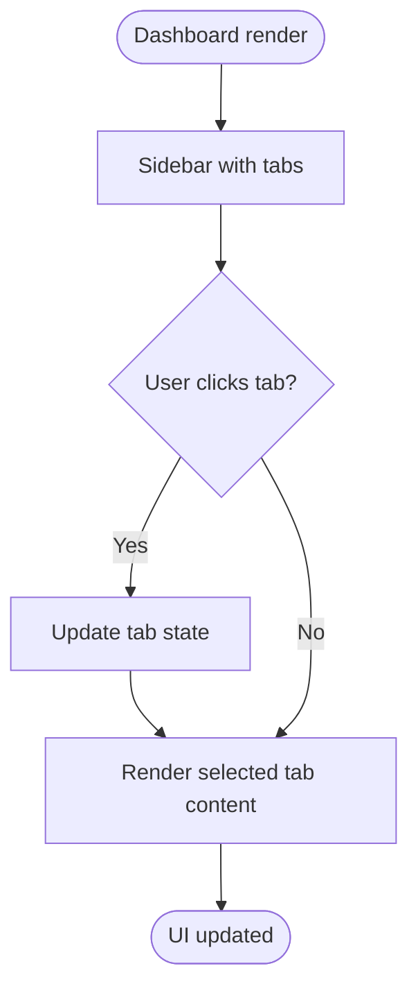
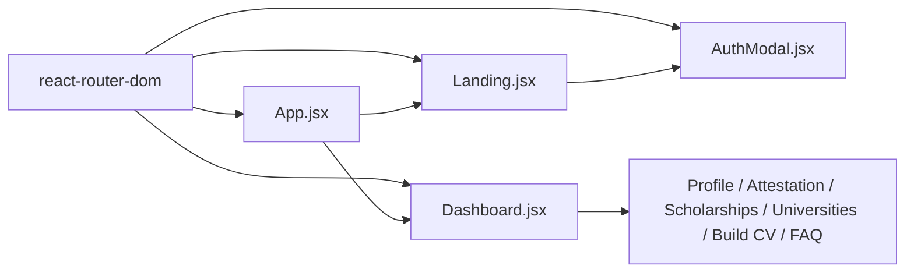

# Routing and Navigation

<cite>
**Referenced Files in This Document**
- [App.jsx](file://scholarpath-frontend (2)/scholarpath/src/App.jsx)
- [main.jsx](file://scholarpath-frontend (2)/scholarpath/src/main.jsx)
- [Dashboard.jsx](file://scholarpath-frontend (2)/scholarpath/src/pages/Dashboard.jsx)
- [Landing.jsx](file://scholarpath-frontend (2)/scholarpath/src/pages/Landing.jsx)
- [AuthModal.jsx](file://scholarpath-frontend (2)/scholarpath/src/components/AuthModal.jsx)
- [ProfileTab.jsx](file://scholarpath-frontend (2)/scholarpath/src/pages/ProfileTab.jsx)
- [ScholarshipsTab.jsx](file://scholarpath-frontend (2)/scholarpath/src/pages/ScholarshipsTab.jsx)
- [UniversitiesTab.jsx](file://scholarpath-frontend (2)/scholarpath/src/pages/UniversitiesTab.jsx)
- [AttestationTab.jsx](file://scholarpath-frontend (2)/scholarpath/src/pages/AttestationTab.jsx)
- [FaqTab.jsx](file://scholarpath-frontend (2)/scholarpath/src/pages/FaqTab.jsx)
- [BuildCvTab.jsx](file://scholarpath-frontend (2)/scholarpath/src/pages/BuildCvTab.jsx)
</cite>

## Table of Contents
1. [Introduction](#introduction)
2. [Project Structure](#project-structure)
3. [Core Components](#core-components)
4. [Architecture Overview](#architecture-overview)
5. [Detailed Component Analysis](#detailed-component-analysis)
6. [Dependency Analysis](#dependency-analysis)
7. [Performance Considerations](#performance-considerations)
8. [Troubleshooting Guide](#troubleshooting-guide)
9. [Conclusion](#conclusion)

## Introduction
This document explains ScholarPathAI’s routing and navigation system built with React Router. It covers:
- Route configuration for the landing page and dashboard
- Programmatic navigation between public and authenticated areas
- The tab-based interface inside the dashboard that switches between Profile, Attestation, Scholarships, Universities, Build CV, and FAQ sections
- Current limitations around protected routes and authentication guards
- Guidance for adding route parameters and query string handling

## Project Structure
The application uses a minimal client-side router to switch between two top-level pages:
- Root path displays the marketing landing page
- A dashboard path renders the authenticated workspace

**Diagram sources**
- [App.jsx:1-14](file://scholarpath-frontend (2)/scholarpath/src/App.jsx#L1-L14)
- [main.jsx:1-11](file://scholarpath-frontend (2)/scholarpath/src/main.jsx#L1-L11)

**Section sources**
- [App.jsx:1-14](file://scholarpath-frontend (2)/scholarpath/src/App.jsx#L1-L14)
- [main.jsx:1-11](file://scholarpath-frontend (2)/scholarpath/src/main.jsx#L1-L11)

## Core Components
- App: Defines the router and maps URL paths to page components.
- Landing: Public marketing page; opens an authentication modal that navigates to the dashboard after submission.
- Dashboard: Authenticated workspace with a sidebar that switches tabs via local state.
- Tab pages: Profile, Attestation, Scholarships, Universities, Build CV, FAQ — rendered conditionally within Dashboard.

Key behaviors:
- Programmatic navigation is used to move from the landing flow into the dashboard.
- Within the dashboard, tab switching is handled by component state rather than separate routes.

**Section sources**
- [App.jsx:1-14](file://scholarpath-frontend (2)/scholarpath/src/App.jsx#L1-L14)
- [Landing.jsx:32-63](file://scholarpath-frontend (2)/scholarpath/src/pages/Landing.jsx#L32-L63)
- [Dashboard.jsx:128-186](file://scholarpath-frontend (2)/scholarpath/src/pages/Dashboard.jsx#L128-L186)
- [AuthModal.jsx:1-16](file://scholarpath-frontend (2)/scholarpath/src/components/AuthModal.jsx#L1-L16)

## Architecture Overview
High-level navigation flow:
- Users start at the landing page.
- They open the auth modal and submit credentials (mocked).
- On success, they are programmatically navigated to the dashboard.
- Inside the dashboard, users switch tabs using the sidebar without changing the URL.

**Diagram sources**
- [Landing.jsx:32-63](file://scholarpath-frontend (2)/scholarpath/src/pages/Landing.jsx#L32-L63)
- [AuthModal.jsx:1-16](file://scholarpath-frontend (2)/scholarpath/src/components/AuthModal.jsx#L1-L16)
- [Dashboard.jsx:128-186](file://scholarpath-frontend (2)/scholarpath/src/pages/Dashboard.jsx#L128-L186)

## Detailed Component Analysis

### Top-Level Routing (App)
- Uses BrowserRouter to enable client-side routing.
- Declares two routes:
  - "/" renders the landing page.
  - "/dashboard" renders the dashboard.

Implementation notes:
- No nested routes or dynamic segments are defined at this level.
- No route guards or authentication checks are implemented here.

**Section sources**
- [App.jsx:1-14](file://scholarpath-frontend (2)/scholarpath/src/App.jsx#L1-L14)

### Landing Page and Auth Flow
- Provides UI to log in or sign up via a modal.
- On form submission, the modal performs programmatic navigation to the dashboard.

Notes:
- Authentication is currently mocked; no server validation or session management is present.
- There is no redirect back to the landing page on logout except via direct navigation.

**Section sources**
- [Landing.jsx:32-63](file://scholarpath-frontend (2)/scholarpath/src/pages/Landing.jsx#L32-L63)
- [AuthModal.jsx:1-16](file://scholarpath-frontend (2)/scholarpath/src/components/AuthModal.jsx#L1-L16)

### Dashboard and Tab-Based Interface
- Renders a header with a logout button that navigates back to the root.
- Displays a sidebar with tabs: Overview, Profile, Document Attestations, Universities, Scholarships, Build CV, FAQ.
- Tab switching updates local state and renders the corresponding tab component.

Important:
- Tabs are not separate routes; the URL remains "/dashboard" while switching tabs.
- This design keeps navigation simple but does not support deep-linking to specific tabs via URL.

**Diagram sources**
- [Dashboard.jsx:128-186](file://scholarpath-frontend (2)/scholarpath/src/pages/Dashboard.jsx#L128-L186)

**Section sources**
- [Dashboard.jsx:128-186](file://scholarpath-frontend (2)/scholarpath/src/pages/Dashboard.jsx#L128-L186)

### Tab Pages
Each tab is a self-contained component focused on one feature area:
- ProfileTab: Personal information form, document upload, and checklist logic.
- AttestationTab: Choose attestation authority and view step-by-step instructions.
- ScholarshipsTab: Filter and display scholarships with analysis summary.
- UniversitiesTab: Directory with filters and match cards.
- BuildCvTab: Upload, analyze, convert to Europass format, and generate recommendation letters.
- FaqTab: Expandable FAQ items.

These tabs do not implement their own routing; they rely on the parent Dashboard to mount them.

**Section sources**
- [ProfileTab.jsx:1-232](file://scholarpath-frontend (2)/scholarpath/src/pages/ProfileTab.jsx#L1-L232)
- [AttestationTab.jsx:1-73](file://scholarpath-frontend (2)/scholarpath/src/pages/AttestationTab.jsx#L1-L73)
- [ScholarshipsTab.jsx:1-139](file://scholarpath-frontend (2)/scholarpath/src/pages/ScholarshipsTab.jsx#L1-L139)
- [UniversitiesTab.jsx:1-163](file://scholarpath-frontend (2)/scholarpath/src/pages/UniversitiesTab.jsx#L1-L163)
- [BuildCvTab.jsx:1-284](file://scholarpath-frontend (2)/scholarpath/src/pages/BuildCvTab.jsx#L1-L284)
- [FaqTab.jsx:1-46](file://scholarpath-frontend (2)/scholarpath/src/pages/FaqTab.jsx#L1-L46)

## Dependency Analysis
Routing and navigation dependencies:
- React Router provides routing primitives and navigation hooks.
- App composes the router and mounts page components.
- Landing and Dashboard use programmatic navigation via useNavigate.
- AuthModal triggers navigation to the dashboard upon form submission.

**Diagram sources**
- [App.jsx:1-14](file://scholarpath-frontend (2)/scholarpath/src/App.jsx#L1-L14)
- [Landing.jsx:32-63](file://scholarpath-frontend (2)/scholarpath/src/pages/Landing.jsx#L32-L63)
- [Dashboard.jsx:128-186](file://scholarpath-frontend (2)/scholarpath/src/pages/Dashboard.jsx#L128-L186)
- [AuthModal.jsx:1-16](file://scholarpath-frontend (2)/scholarpath/src/components/AuthModal.jsx#L1-L16)

**Section sources**
- [App.jsx:1-14](file://scholarpath-frontend (2)/scholarpath/src/App.jsx#L1-L14)
- [Landing.jsx:32-63](file://scholarpath-frontend (2)/scholarpath/src/pages/Landing.jsx#L32-L63)
- [Dashboard.jsx:128-186](file://scholarpath-frontend (2)/scholarpath/src/pages/Dashboard.jsx#L128-L186)
- [AuthModal.jsx:1-16](file://scholarpath-frontend (2)/scholarpath/src/components/AuthModal.jsx#L1-L16)

## Performance Considerations
- Client-side routing avoids full-page reloads, improving perceived performance.
- Tab switching within Dashboard uses local state, which is efficient for small datasets.
- For large lists (e.g., universities, scholarships), consider memoization and pagination to keep rendering fast.

[No sources needed since this section provides general guidance]

## Troubleshooting Guide
Common issues and resolutions:
- Directly accessing "/dashboard" without authentication:
  - Current behavior: Any user can access the dashboard because there are no route guards.
  - Resolution: Implement a protected route wrapper that checks authentication state before rendering Dashboard. Redirect unauthenticated users to the landing page.
- Deep-linking to a specific tab:
  - Current behavior: Tabs are controlled by local state; the URL does not reflect the active tab.
  - Resolution: Add nested routes under "/dashboard" (for example, "/dashboard/profile") or sync the active tab to URL search params so links can target specific tabs.
- Logout behavior:
  - Current behavior: Logging out navigates to the root ("/").
  - Resolution: If implementing protected routes, ensure logout clears any stored session and redirects to the landing page.

[No sources needed since this section provides general guidance]

## Conclusion
ScholarPathAI currently implements a simple two-route setup with programmatic navigation from the landing page to the dashboard. The dashboard uses a tabbed interface managed by local state rather than multiple routes. To enhance security and usability:
- Add protected routes to guard authenticated features.
- Introduce nested routes or query parameters to support deep-linking to specific tabs.
- Centralize authentication state and enforce it across routes.

[No sources needed since this section summarizes without analyzing specific files]