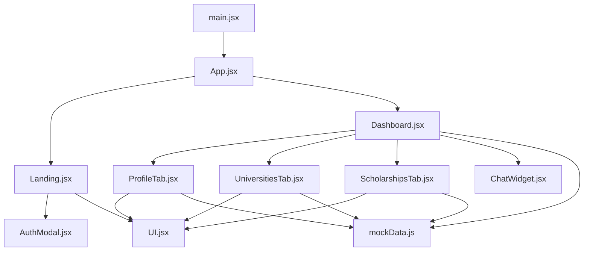
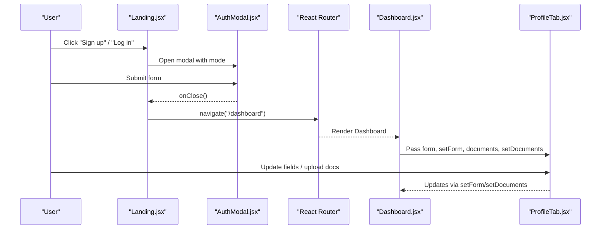
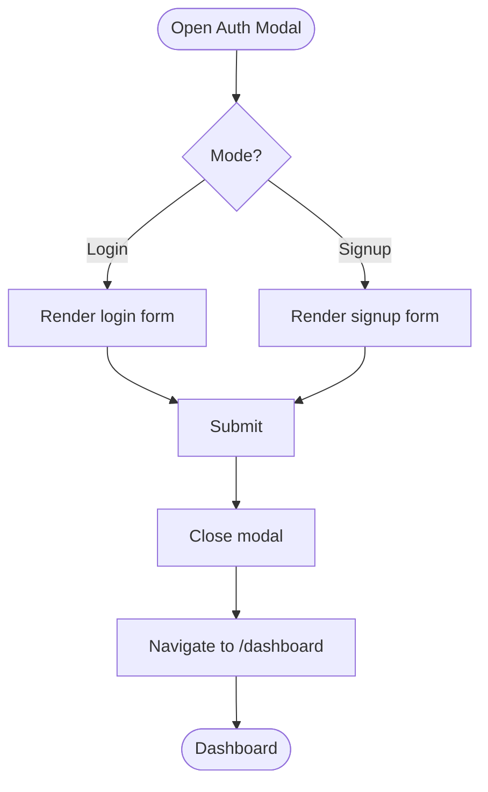
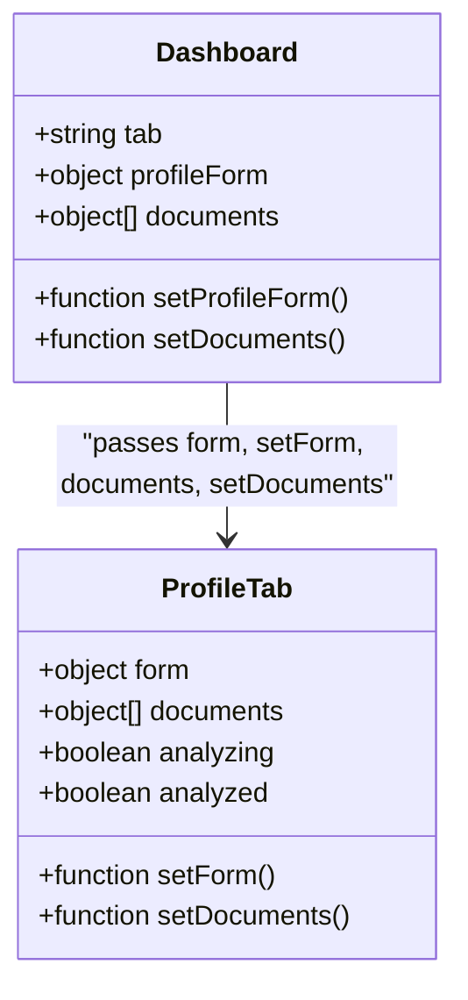
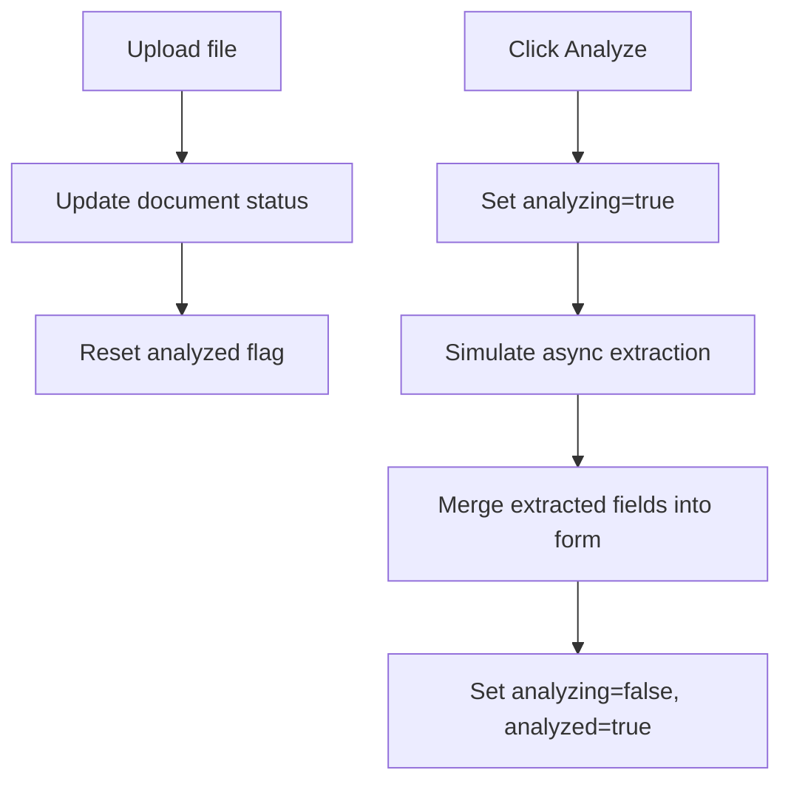
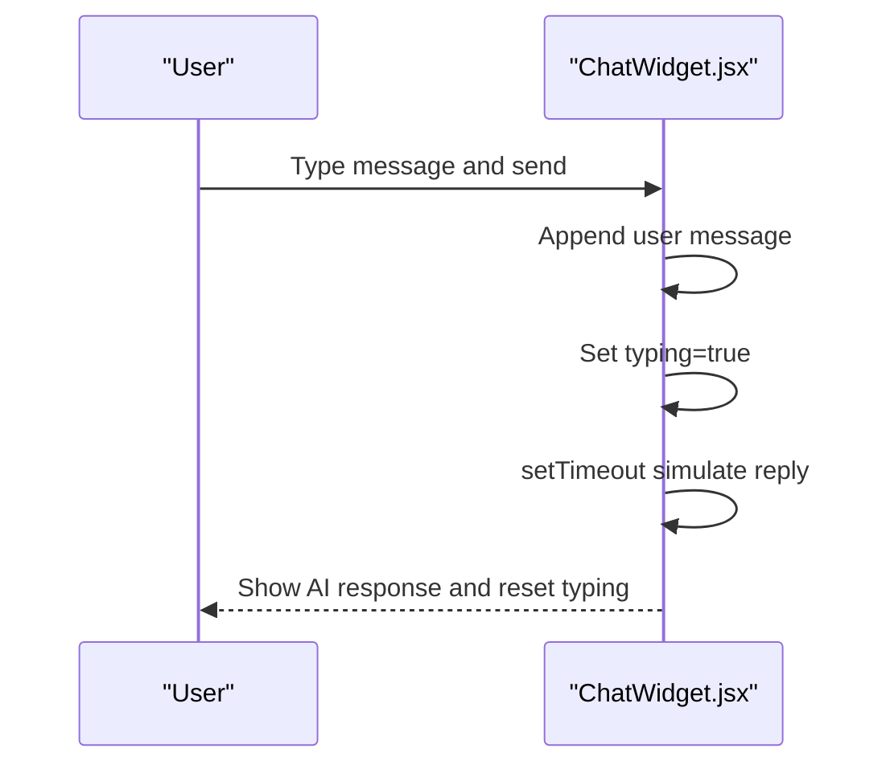
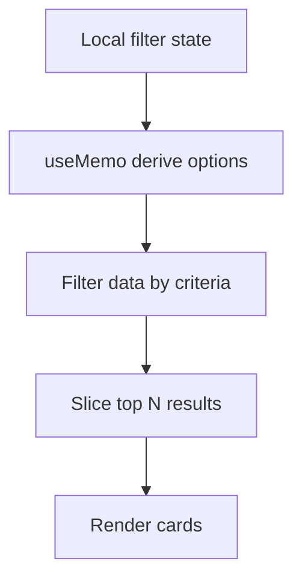
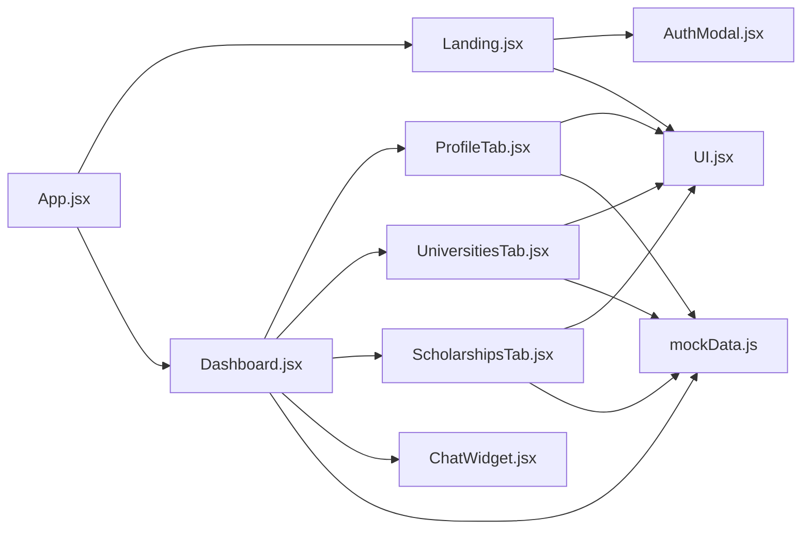

# State Management

<cite>
**Referenced Files in This Document**
- [App.jsx](file://scholarpath-frontend (2)\scholarpath\src\App.jsx)
- [main.jsx](file://scholarpath-frontend (2)\scholarpath\src\main.jsx)
- [Landing.jsx](file://scholarpath-frontend (2)\scholarpath\src\pages\Landing.jsx)
- [AuthModal.jsx](file://scholarpath-frontend (2)\scholarpath\src\components\AuthModal.jsx)
- [Dashboard.jsx](file://scholarpath-frontend (2)\scholarpath\src\pages\Dashboard.jsx)
- [ProfileTab.jsx](file://scholarpath-frontend (2)\scholarpath\src\pages\ProfileTab.jsx)
- [UniversitiesTab.jsx](file://scholarpath-frontend (2)\scholarpath\src\pages\UniversitiesTab.jsx)
- [ScholarshipsTab.jsx](file://scholarpath-frontend (2)\scholarpath\src\pages\ScholarshipsTab.jsx)
- [ChatWidget.jsx](file://scholarpath-frontend (2)\scholarpath\src\components\ChatWidget.jsx)
- [UI.jsx](file://scholarpath-frontend (2)\scholarpath\src\components\UI.jsx)
- [mockData.js](file://scholarpath-frontend (2)\scholarpath\src\data\mockData.js)
</cite>

## Table of Contents
1. [Introduction](#introduction)
2. [Project Structure](#project-structure)
3. [Core Components](#core-components)
4. [Architecture Overview](#architecture-overview)
5. [Detailed Component Analysis](#detailed-component-analysis)
6. [Dependency Analysis](#dependency-analysis)
7. [Performance Considerations](#performance-considerations)
8. [Troubleshooting Guide](#troubleshooting-guide)
9. [Conclusion](#conclusion)

## Introduction
This document explains ScholarPathAI’s state management approach using React hooks and component composition patterns. It covers:
- Local state within components via useState and useEffect
- Data flow through props and state lifting between parent and child components
- Asynchronous state updates, loading states, and error handling strategies
- Integration points for backend APIs and synchronization with server data
- Performance best practices to avoid unnecessary re-renders

The current codebase uses a static data layer and local state to demonstrate end-to-end flows. The guidance below shows how to evolve this into a scalable global state solution when integrating with a backend.

## Project Structure
At a high level:
- App entry renders routing and pages
- Landing page manages authentication modal state and navigates to the dashboard
- Dashboard owns shared tab state and lifted profile/document state passed down to sub-tabs
- Tabs manage their own local filters and derived data
- Chat widget maintains its own conversation state
- UI components are presentational and receive props from parents
- mockData provides read-only data sources used across pages

**Diagram sources**
- [main.jsx:1-11](file://scholarpath-frontend (2)\scholarpath\src\main.jsx#L1-L11)
- [App.jsx:1-15](file://scholarpath-frontend (2)\scholarpath\src\App.jsx#L1-L15)
- [Landing.jsx:1-211](file://scholarpath-frontend (2)\scholarpath\src\pages\Landing.jsx#L1-L211)
- [Dashboard.jsx:1-187](file://scholarpath-frontend (2)\scholarpath\src\pages\Dashboard.jsx#L1-L187)
- [ProfileTab.jsx:1-232](file://scholarpath-frontend (2)\scholarpath\src\pages\ProfileTab.jsx#L1-L232)
- [UniversitiesTab.jsx:1-163](file://scholarpath-frontend (2)\scholarpath\src\pages\UniversitiesTab.jsx#L1-L163)
- [ScholarshipsTab.jsx:1-139](file://scholarpath-frontend (2)\scholarpath\src\pages\ScholarshipsTab.jsx#L1-L139)
- [ChatWidget.jsx:1-104](file://scholarpath-frontend (2)\scholarpath\src\components\ChatWidget.jsx#L1-L104)
- [UI.jsx:1-47](file://scholarpath-frontend (2)\scholarpath\src\components\UI.jsx#L1-L47)
- [mockData.js:1-349](file://scholarpath-frontend (2)\scholarpath\src\data\mockData.js#L1-L349)

**Section sources**
- [main.jsx:1-11](file://scholarpath-frontend (2)\scholarpath\src\main.jsx#L1-L11)
- [App.jsx:1-15](file://scholarpath-frontend (2)\scholarpath\src\App.jsx#L1-L15)

## Core Components
- App: Root router that mounts Landing and Dashboard routes
- Landing: Manages authentication modal visibility and switches between login/signup modes; navigates to dashboard on submit
- AuthModal: Local form state for credentials and toggling password visibility; simulates authentication and navigation
- Dashboard: Owns active tab state and lifts profile form and documents state to share with ProfileTab
- ProfileTab: Manages per-field updates, document upload status, and simulated analysis; computes checklist based on form and documents
- UniversitiesTab: Local filter state and derived filtered results using useMemo
- ScholarshipsTab: Local filter state and derived filtered results using useMemo; includes an analysis summary
- ChatWidget: Local chat conversation state, typing indicator, and auto-scroll behavior

Key state patterns observed:
- Local state via useState for UI interactions and data ownership at the appropriate scope
- State lifting to Dashboard for cross-tab concerns (profile and documents)
- Derived state computed in components using filtering and memoization
- Side effects via useEffect for DOM operations like scrolling

**Section sources**
- [Landing.jsx:32-41](file://scholarpath-frontend (2)\scholarpath\src\pages\Landing.jsx#L32-L41)
- [AuthModal.jsx:5-16](file://scholarpath-frontend (2)\scholarpath\src\components\AuthModal.jsx#L5-L16)
- [Dashboard.jsx:128-152](file://scholarpath-frontend (2)\scholarpath\src\pages\Dashboard.jsx#L128-L152)
- [ProfileTab.jsx:88-115](file://scholarpath-frontend (2)\scholarpath\src\pages\ProfileTab.jsx#L88-L115)
- [UniversitiesTab.jsx:73-88](file://scholarpath-frontend (2)\scholarpath\src\pages\UniversitiesTab.jsx#L73-L88)
- [ScholarshipsTab.jsx:59-77](file://scholarpath-frontend (2)\scholarpath\src\pages\ScholarshipsTab.jsx#L59-L77)
- [ChatWidget.jsx:11-39](file://scholarpath-frontend (2)\scholarpath\src\components\ChatWidget.jsx#L11-L39)

## Architecture Overview
The application follows a unidirectional data flow:
- User actions update local state or lifted state
- Parent components pass data and handlers down as props
- Child components render based on props and maintain minimal local state
- Derived data is computed where needed using filtering and memoization

**Diagram sources**
- [Landing.jsx:32-41](file://scholarpath-frontend (2)\scholarpath\src\pages\Landing.jsx#L32-L41)
- [AuthModal.jsx:11-16](file://scholarpath-frontend (2)\scholarpath\src\components\AuthModal.jsx#L11-L16)
- [Dashboard.jsx:128-152](file://scholarpath-frontend (2)\scholarpath\src\pages\Dashboard.jsx#L128-L152)
- [ProfileTab.jsx:88-115](file://scholarpath-frontend (2)\scholarpath\src\pages\ProfileTab.jsx#L88-L115)

## Detailed Component Analysis

### Authentication Flow (Landing + AuthModal)
- Landing holds modal mode state and passes callbacks to AuthModal
- AuthModal handles form submission, closes the modal, and navigates to the dashboard
- No global context is used yet; authentication state is implicit after navigation

**Diagram sources**
- [Landing.jsx:32-41](file://scholarpath-frontend (2)\scholarpath\src\pages\Landing.jsx#L32-L41)
- [AuthModal.jsx:5-16](file://scholarpath-frontend (2)\scholarpath\src\components\AuthModal.jsx#L5-L16)

**Section sources**
- [Landing.jsx:32-41](file://scholarpath-frontend (2)\scholarpath\src\pages\Landing.jsx#L32-L41)
- [AuthModal.jsx:5-16](file://scholarpath-frontend (2)\scholarpath\src\components\AuthModal.jsx#L5-L16)

### Dashboard State Lifting
- Dashboard owns tab selection and lifts profile form and documents state
- These are passed down to ProfileTab to enable cross-tab synchronization
- Other tabs receive read-only data from mockData

**Diagram sources**
- [Dashboard.jsx:128-152](file://scholarpath-frontend (2)\scholarpath\src\pages\Dashboard.jsx#L128-L152)
- [ProfileTab.jsx:88-115](file://scholarpath-frontend (2)\scholarpath\src\pages\ProfileTab.jsx#L88-L115)

**Section sources**
- [Dashboard.jsx:128-152](file://scholarpath-frontend (2)\scholarpath\src\pages\Dashboard.jsx#L128-L152)
- [ProfileTab.jsx:88-115](file://scholarpath-frontend (2)\scholarpath\src\pages\ProfileTab.jsx#L88-L115)

### Profile Tab: Form and Documents
- Maintains local analyzing and analyzed flags for CV analysis simulation
- Upload handler updates document status and resets analyzed flag
- Analyze handler simulates async extraction and updates form fields
- Checklist computed from form and documents drives UI feedback

**Diagram sources**
- [ProfileTab.jsx:98-115](file://scholarpath-frontend (2)\scholarpath\src\pages\ProfileTab.jsx#L98-L115)

**Section sources**
- [ProfileTab.jsx:88-115](file://scholarpath-frontend (2)\scholarpath\src\pages\ProfileTab.jsx#L88-L115)

### Chat Widget: Local Conversation State
- Uses useState for messages, input, open/close, and typing indicator
- useEffect scrolls to bottom when messages change
- Simulated AI reply demonstrates asynchronous interaction pattern

**Diagram sources**
- [ChatWidget.jsx:11-39](file://scholarpath-frontend (2)\scholarpath\src\components\ChatWidget.jsx#L11-L39)

**Section sources**
- [ChatWidget.jsx:11-39](file://scholarpath-frontend (2)\scholarpath\src\components\ChatWidget.jsx#L11-L39)

### Filtering and Derived State (Universities and Scholarships)
- Both tabs use local filter state and compute filtered lists
- useMemo derives unique options for dropdowns to avoid recomputation
- Filtering logic applies multiple criteria and slices top results

**Diagram sources**
- [UniversitiesTab.jsx:73-88](file://scholarpath-frontend (2)\scholarpath\src\pages\UniversitiesTab.jsx#L73-L88)
- [ScholarshipsTab.jsx:59-77](file://scholarpath-frontend (2)\scholarpath\src\pages\ScholarshipsTab.jsx#L59-L77)

**Section sources**
- [UniversitiesTab.jsx:73-88](file://scholarpath-frontend (2)\scholarpath\src\pages\UniversitiesTab.jsx#L73-L88)
- [ScholarshipsTab.jsx:59-77](file://scholarpath-frontend (2)\scholarpath\src\pages\ScholarshipsTab.jsx#L59-L77)

## Dependency Analysis
- Routing dependency: App depends on react-router-dom to mount Landing and Dashboard
- Page dependencies:
  - Landing depends on AuthModal and UI components
  - Dashboard depends on multiple tabs and UI components
  - Tabs depend on UI components and mockData
- ChatWidget depends on UI components
- All pages read from mockData for static content

**Diagram sources**
- [App.jsx:1-15](file://scholarpath-frontend (2)\scholarpath\src\App.jsx#L1-L15)
- [Landing.jsx:1-211](file://scholarpath-frontend (2)\scholarpath\src\pages\Landing.jsx#L1-L211)
- [Dashboard.jsx:1-187](file://scholarpath-frontend (2)\scholarpath\src\pages\Dashboard.jsx#L1-L187)
- [ProfileTab.jsx:1-232](file://scholarpath-frontend (2)\scholarpath\src\pages\ProfileTab.jsx#L1-L232)
- [UniversitiesTab.jsx:1-163](file://scholarpath-frontend (2)\scholarpath\src\pages\UniversitiesTab.jsx#L1-L163)
- [ScholarshipsTab.jsx:1-139](file://scholarpath-frontend (2)\scholarpath\src\pages\ScholarshipsTab.jsx#L1-L139)
- [ChatWidget.jsx:1-104](file://scholarpath-frontend (2)\scholarpath\src\components\ChatWidget.jsx#L1-L104)
- [UI.jsx:1-47](file://scholarpath-frontend (2)\scholarpath\src\components\UI.jsx#L1-L47)
- [mockData.js:1-349](file://scholarpath-frontend (2)\scholarpath\src\data\mockData.js#L1-L349)

**Section sources**
- [App.jsx:1-15](file://scholarpath-frontend (2)\scholarpath\src\App.jsx#L1-L15)
- [mockData.js:1-349](file://scholarpath-frontend (2)\scholarpath\src\data\mockData.js#L1-L349)

## Performance Considerations
- Use functional state updates to avoid stale closures and reduce re-renders
- Memoize expensive computations with useMemo (e.g., deriving filter options and filtered lists)
- Avoid passing large objects as props without memoization; consider splitting state or using selectors
- Keep UI components pure and presentational to minimize re-render impact
- Prefer local state for isolated concerns (chat, modals, filters) and lift only what is necessary
- Debounce or throttle frequent updates if needed (e.g., search inputs)
- Use keys correctly in lists to optimize reconciliation
- Minimize side effects; keep them focused and scoped to specific events or lifecycle needs

[No sources needed since this section provides general guidance]

## Troubleshooting Guide
Common issues and resolutions:
- Stale state in event handlers: Use functional setState to ensure you operate on the latest state
- Excessive re-renders: Wrap heavy computations with useMemo and ensure stable references for callbacks
- Incorrect list rendering: Ensure unique and stable keys for mapped items
- Async timing problems: Separate loading, success, and error states; guard UI accordingly
- Navigation not updating: Confirm route paths and that navigation calls occur after closing overlays or modals

Integration tips for backend synchronization:
- Replace mockData reads with API calls inside useEffect or event handlers
- Manage loading and error states explicitly during fetches
- Normalize data shapes to match component expectations
- Persist critical state (e.g., auth token) securely and synchronize with server on changes
- Implement optimistic updates where appropriate and roll back on errors

[No sources needed since this section provides general guidance]

## Conclusion
ScholarPathAI currently employs a pragmatic, component-scoped state strategy:
- Local state for UI and feature-specific concerns
- State lifting to coordinate shared data across tabs
- Derived state via filtering and memoization
- Simulated asynchronous flows demonstrating real-world patterns

To scale further:
- Introduce a global state mechanism (e.g., React Context or a dedicated store) for authentication, user profile, and application-wide settings
- Centralize API integration and data synchronization to keep components focused on presentation and user interactions
- Maintain clear boundaries between local, lifted, and global state to preserve performance and clarity

[No sources needed since this section summarizes without analyzing specific files]