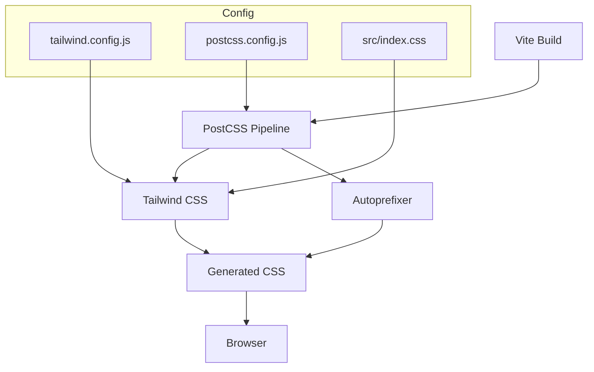
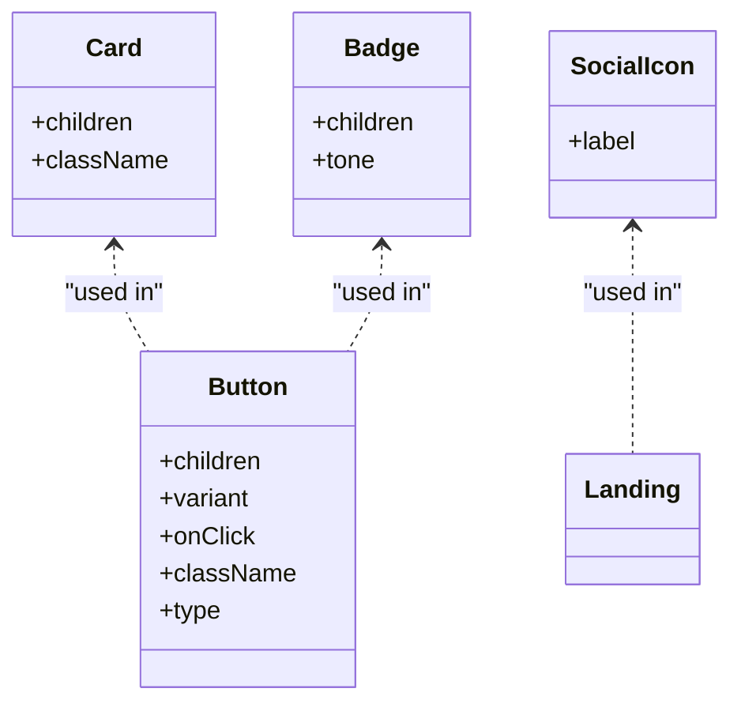
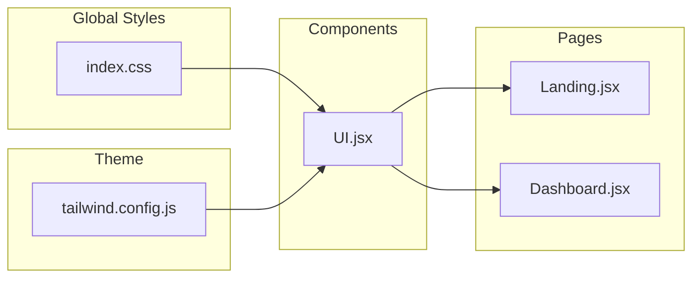
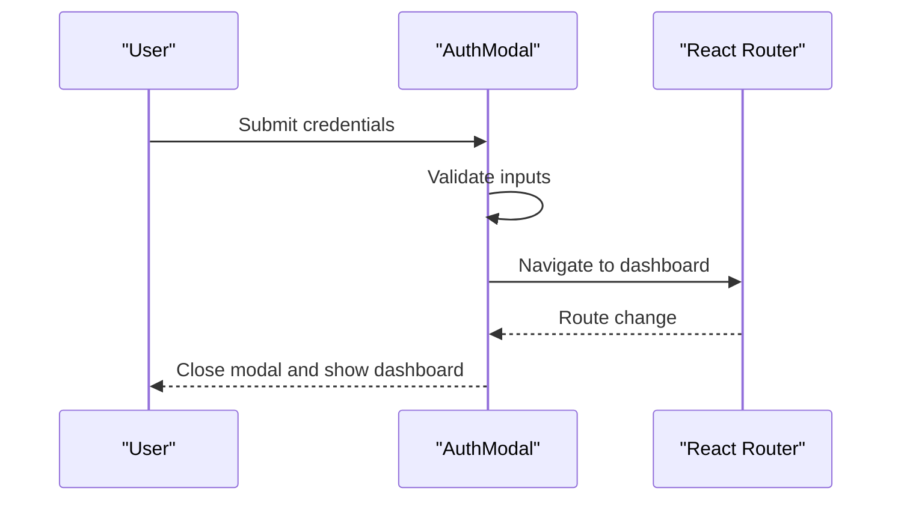
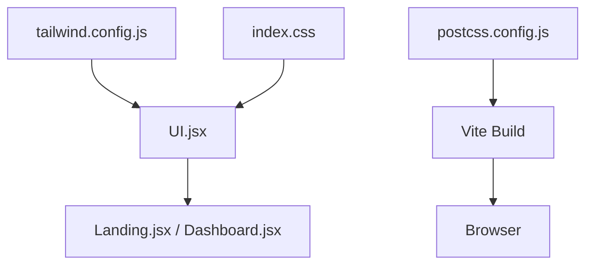

# Styling and Theming

<cite>
**Referenced Files in This Document**
- [tailwind.config.js](file://scholarpath-frontend (2)/scholarpath/tailwind.config.js)
- [postcss.config.js](file://scholarpath-frontend (2)/scholarpath/postcss.config.js)
- [index.css](file://scholarpath-frontend (2)/scholarpath/src/index.css)
- [package.json](file://scholarpath-frontend (2)/scholarpath/package.json)
- [vite.config.js](file://scholarpath-frontend (2)/scholarpath/vite.config.js)
- [UI.jsx](file://scholarpath-frontend (2)/scholarpath/src/components/UI.jsx)
- [Landing.jsx](file://scholarpath-frontend (2)/scholarpath/src/pages/Landing.jsx)
- [Dashboard.jsx](file://scholarpath-frontend (2)/scholarpath/src/pages/Dashboard.jsx)
- [AuthModal.jsx](file://scholarpath-frontend (2)/scholarpath/src/components/AuthModal.jsx)
- [ProfileTab.jsx](file://scholarpath-frontend (2)/scholarpath/src/pages/ProfileTab.jsx)
</cite>

## Update Summary
**Changes Made**
- Updated color system documentation to reflect reverted blue theme (sp-blue: #125BC9, sp-blue-dark: #0C447C, sp-blue-light: #E6F1FB)
- Removed references to teal design system components and glassmorphic effects
- Updated component styling examples to use blue theme tokens
- Revised responsive design patterns to match current implementation
- Updated cross-browser compatibility notes for current styling approach

## Table of Contents
1. Introduction
2. Project Structure
3. Core Components
4. Architecture Overview
5. Detailed Component Analysis
6. Dependency Analysis
7. Performance Considerations
8. Troubleshooting Guide
9. Conclusion

## Introduction
This document explains the styling architecture for ScholarPathAI's frontend, which uses Tailwind CSS with a utility-first approach to build a consistent, responsive design system. The application employs a professional blue-themed design system centered around brand colors (sp-blue, sp-blue-dark, sp-blue-light) with complementary navy, slate, and accent colors. It covers:
- How Tailwind is configured with custom themes, color palettes, typography, and design tokens
- How PostCSS processes styles and optimizes output
- Responsive design patterns across components using Tailwind's breakpoint utilities
- Integration between Tailwind classes and React components, including conditional styling based on props and state
- Best practices for maintaining a consistent design language and avoiding style conflicts

## Project Structure
The styling setup centers around Tailwind CSS integrated into a Vite + React project:
- Tailwind configuration defines custom colors, fonts, and shadows using the blue theme
- PostCSS pipeline runs Tailwind and Autoprefixer
- A global stylesheet initializes base styles, imports Tailwind layers, and adds application-wide animations and accessibility considerations
- React components compose UI by applying Tailwind utility classes directly in JSX

**Diagram sources**
- [postcss.config.js:1-7](file://scholarpath-frontend (2)/scholarpath/postcss.config.js#L1-L7)
- [tailwind.config.js:1-31](file://scholarpath-frontend (2)/scholarpath/tailwind.config.js#L1-L31)
- [index.css:1-35](file://scholarpath-frontend (2)/scholarpath/src/index.css#L1-L35)

**Section sources**
- [postcss.config.js:1-7](file://scholarpath-frontend (2)/scholarpath/postcss.config.js#L1-L7)
- [tailwind.config.js:1-31](file://scholarpath-frontend (2)/scholarpath/tailwind.config.js#L1-L31)
- [index.css:1-35](file://scholarpath-frontend (2)/scholarpath/src/index.css#L1-L35)
- [package.json:17-26](file://scholarpath-frontend (2)/scholarpath/package.json#L17-L26)
- [vite.config.js:1-16](file://scholarpath-frontend (2)/scholarpath/vite.config.js#L1-L16)

## Core Components
Reusable UI primitives are implemented as small React components that encapsulate Tailwind classes and design tokens:
- Card: Provides consistent background, border, radius, and shadow using custom tokens
- Button: Supports multiple variants (primary, secondary, ghost) via prop-driven class composition with blue theme colors
- Badge: Offers tone-based semantic coloring (blue, green, amber, gray, red)
- SocialIcon: Encapsulates icon container styling with hover states

These components centralize design decisions and ensure consistency across pages using the blue-themed design system.

**Diagram sources**
- [UI.jsx:1-48](file://scholarpath-frontend (2)/scholarpath/src/components/UI.jsx#L1-L48)
- [Landing.jsx:1-211](file://scholarpath-frontend (2)/scholarpath/src/pages/Landing.jsx#L1-L211)

**Section sources**
- [UI.jsx:1-48](file://scholarpath-frontend (2)/scholarpath/src/components/UI.jsx#L1-L48)

## Architecture Overview
The styling architecture follows a layered approach:
- Global layer: Base styles, font import, Tailwind layers, body defaults, selection color, and keyframe animations
- Theme layer: Custom colors, fonts, and shadows defined in Tailwind config using blue theme tokens
- Component layer: Reusable primitives composed from theme tokens and utilities
- Page layer: Layouts and responsive structures built with Tailwind grid/flex utilities and breakpoints

**Diagram sources**
- [index.css:1-35](file://scholarpath-frontend (2)/scholarpath/src/index.css#L1-L35)
- [tailwind.config.js:1-31](file://scholarpath-frontend (2)/scholarpath/tailwind.config.js#L1-L31)
- [UI.jsx:1-48](file://scholarpath-frontend (2)/scholarpath/src/components/UI.jsx#L1-L48)
- [Landing.jsx:1-211](file://scholarpath-frontend (2)/scholarpath/src/pages/Landing.jsx#L1-L211)
- [Dashboard.jsx:1-338](file://scholarpath-frontend (2)/scholarpath/src/pages/Dashboard.jsx#L1-L338)

## Detailed Component Analysis

### Tailwind Configuration and Design Tokens
**Updated** The design system now uses a professional blue theme instead of the previous teal design system:
- Colors: A cohesive palette under the sp- prefix ensures brand consistency with primary blue (#125BC9), navy (#0F172A), slate (#475569), borders (#E2E8F0), backgrounds (#F8FAFC), and accent greens and ambers
- Typography: Sans-serif stack centered on Inter with system fallbacks
- Shadows: Named card shadows for consistent elevation
- Content scanning: Tailwind scans HTML and JSX files to generate only used utilities

Best practices demonstrated:
- Use semantic token names (sp-*) instead of raw hex values in components
- Keep layout and spacing utilities close to markup for clarity
- Centralize visual tokens in one place for easy updates

**Section sources**
- [tailwind.config.js:1-31](file://scholarpath-frontend (2)/scholarpath/tailwind.config.js#L1-L31)

### PostCSS Setup and Optimization
- Plugins: Tailwind CSS and Autoprefixer are configured to process styles during builds
- Benefits: Automatic vendor prefixes and optimized CSS output via Tailwind's purge strategy

Operational notes:
- Ensure all source files containing class names are included in Tailwind's content paths
- Rely on Tailwind's JIT engine to minimize unused CSS

**Section sources**
- [postcss.config.js:1-7](file://scholarpath-frontend (2)/scholarpath/postcss.config.js#L1-L7)
- [package.json:17-26](file://scholarpath-frontend (2)/scholarpath/package.json#L17-L26)

### Global Styles and Animations
- Font loading: Imports Inter from Google Fonts
- Tailwind layers: Applies base, components, and utilities
- Body defaults: Background color (#F8FAFC), font family, and antialiasing
- Selection color: Uses brand blue (#125BC9) for text selection
- Animation: Defines a fade-up animation with reduced motion support for accessibility

Accessibility highlights:
- Respects prefers-reduced-motion to disable animations for users who prefer reduced motion

**Section sources**
- [index.css:1-35](file://scholarpath-frontend (2)/scholarpath/src/index.css#L1-L35)

### Utility-First Patterns in Components
- Conditional styling via props:
  - Button variant maps to different color schemes and hover states using blue theme colors
  - Badge tone selects semantic color combinations
- Composition:
  - Components combine theme tokens (colors, shadows) with layout utilities (padding, radius, flexbox)
- Consistency:
  - Shared input focus styles and border colors across forms using sp-blue focus rings

Examples of patterns:
- Variant-driven button styles with blue theme (primary: bg-sp-blue, secondary: white with blue borders, ghost: slate with blue hover)
- Tone-driven badge colors (blue, green, amber, gray, red)
- Reusable card shell with consistent elevation using shadow-card token

**Section sources**
- [UI.jsx:1-48](file://scholarpath-frontend (2)/scholarpath/src/components/UI.jsx#L1-L48)
- [AuthModal.jsx:1-284](file://scholarpath-frontend (2)/scholarpath/src/components/AuthModal.jsx#L1-L284)
- [ProfileTab.jsx:1-510](file://scholarpath-frontend (2)/scholarpath/src/pages/ProfileTab.jsx#L1-L510)

### Responsive Design Patterns
Breakpoints and layouts are applied using Tailwind's responsive utilities:
- Navigation visibility toggles at md breakpoint (hidden md:flex)
- Grid layouts adapt from single column to multi-column at sm/md breakpoints
- Sidebar becomes sticky on larger screens (md:sticky)
- Text sizes scale up on larger viewports (text-4xl sm:text-5xl)

Common patterns observed:
- hidden md:flex for responsive navigation
- grid-cols-1 to grid-cols-2/3 transitions
- max-w containers with horizontal padding
- Responsive typography scaling

**Section sources**
- [Landing.jsx:1-211](file://scholarpath-frontend (2)/scholarpath/src/pages/Landing.jsx#L1-L211)
- [Dashboard.jsx:1-338](file://scholarpath-frontend (2)/scholarpath/src/pages/Dashboard.jsx#L1-L338)

### Cross-Browser Compatibility
- Autoprefixer handles vendor prefixes automatically
- Focus ring and outline styles use standard properties supported across modern browsers
- Font smoothing applied for consistent rendering on macOS (-webkit-font-smoothing: antialiased)

Considerations:
- Prefer standard CSS properties over experimental ones
- Test focus-visible behavior if adding custom focus rings
- Current implementation uses consistent focus styles with sp-blue ring utilities

**Section sources**
- [postcss.config.js:1-7](file://scholarpath-frontend (2)/scholarpath/postcss.config.js#L1-L7)
- [index.css:10-15](file://scholarpath-frontend (2)/scholarpath/src/index.css#L10-L15)

### React Integration and Conditional Styling
- Props drive class composition:
  - Button variant selects color scheme and hover behavior using blue theme tokens
  - Badge tone selects semantic color mapping
- State-driven visuals:
  - Profile checklist items toggle completion indicators based on form/document state
  - Auth modal shows/hides based on mode state
- Accessibility:
  - aria-label on close buttons
  - Reduced motion respected via media query

**Diagram sources**
- [AuthModal.jsx:28-52](file://scholarpath-frontend (2)/scholarpath/src/components/AuthModal.jsx#L28-L52)
- [App.jsx:1-15](file://scholarpath-frontend (2)/scholarpath/src/App.jsx#L1-L15)

**Section sources**
- [AuthModal.jsx:1-284](file://scholarpath-frontend (2)/scholarpath/src/components/AuthModal.jsx#L1-L284)
- [ProfileTab.jsx:27-45](file://scholarpath-frontend (2)/scholarpath/src/pages/ProfileTab.jsx#L27-L45)
- [UI.jsx:9-24](file://scholarpath-frontend (2)/scholarpath/src/components/UI.jsx#L9-L24)

## Dependency Analysis
Styling dependencies flow from configuration to runtime:
- Tailwind config provides blue theme tokens consumed by components
- PostCSS processes styles and injects Tailwind layers
- Components consume tokens and utilities to render consistent UI
- Pages assemble components and apply responsive layouts

**Diagram sources**
- [tailwind.config.js:1-31](file://scholarpath-frontend (2)/scholarpath/tailwind.config.js#L1-L31)
- [index.css:1-35](file://scholarpath-frontend (2)/scholarpath/src/index.css#L1-L35)
- [UI.jsx:1-48](file://scholarpath-frontend (2)/scholarpath/src/components/UI.jsx#L1-L48)
- [Landing.jsx:1-211](file://scholarpath-frontend (2)/scholarpath/src/pages/Landing.jsx#L1-L211)
- [Dashboard.jsx:1-338](file://scholarpath-frontend (2)/scholarpath/src/pages/Dashboard.jsx#L1-L338)
- [postcss.config.js:1-7](file://scholarpath-frontend (2)/scholarpath/postcss.config.js#L1-L7)

**Section sources**
- [tailwind.config.js:1-31](file://scholarpath-frontend (2)/scholarpath/tailwind.config.js#L1-L31)
- [postcss.config.js:1-7](file://scholarpath-frontend (2)/scholarpath/postcss.config.js#L1-L7)
- [UI.jsx:1-48](file://scholarpath-frontend (2)/scholarpath/src/components/UI.jsx#L1-L48)
- [Landing.jsx:1-211](file://scholarpath-frontend (2)/scholarpath/src/pages/Landing.jsx#L1-L211)
- [Dashboard.jsx:1-338](file://scholarpath-frontend (2)/scholarpath/src/pages/Dashboard.jsx#L1-L338)

## Performance Considerations
- Tailwind's JIT engine generates only used utilities, keeping CSS small
- Autoprefixer minimizes cross-browser overhead by adding necessary prefixes
- Avoid excessive inline styles; prefer Tailwind utilities for better caching and tree-shaking
- Keep component-level class lists concise; extract repeated patterns into reusable components
- Blue theme tokens provide consistent performance across all components

## Troubleshooting Guide
Common issues and resolutions:
- Missing styles after adding new classes:
  - Ensure file paths are included in Tailwind's content configuration
- Unexpected overrides or specificity conflicts:
  - Prefer utility classes over custom CSS; move custom rules to Tailwind components layer when necessary
- Animations not respecting user preferences:
  - Verify presence of reduced motion media query handling
- Inconsistent focus states:
  - Standardize focus styles using consistent ring/border utilities with sp-blue theme
- Color inconsistencies:
  - Use sp-* tokens consistently instead of hardcoded colors to maintain brand consistency

**Section sources**
- [index.css:22-34](file://scholarpath-frontend (2)/scholarpath/src/index.css#L22-L34)
- [tailwind.config.js:1-31](file://scholarpath-frontend (2)/scholarpath/tailwind.config.js#L1-L31)

## Conclusion
ScholarPathAI's styling architecture leverages Tailwind CSS with a professional blue-themed design system to deliver a consistent, accessible, and responsive interface. By centralizing design tokens in the Tailwind configuration and composing UI through reusable components, the codebase maintains a clear separation of concerns while enabling rapid iteration. The PostCSS pipeline ensures optimal output and cross-browser compatibility. Following the patterns and best practices outlined here will help maintain a cohesive design language and avoid style conflicts as the application grows. The blue theme provides a trustworthy, professional appearance suitable for an educational platform focused on scholarship matching.