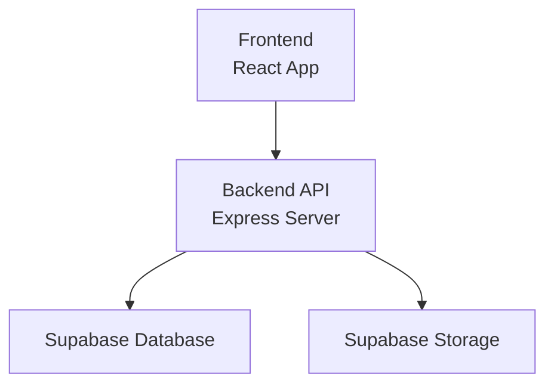
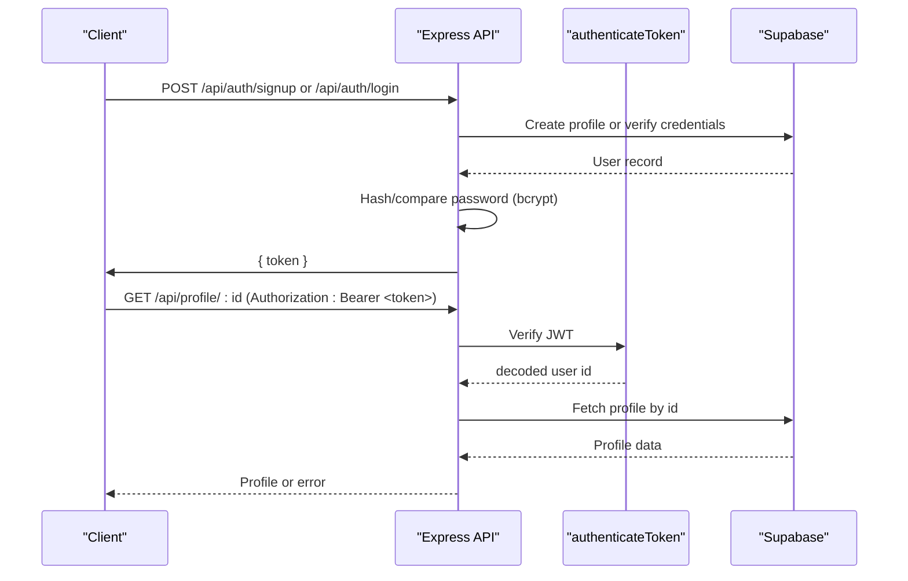
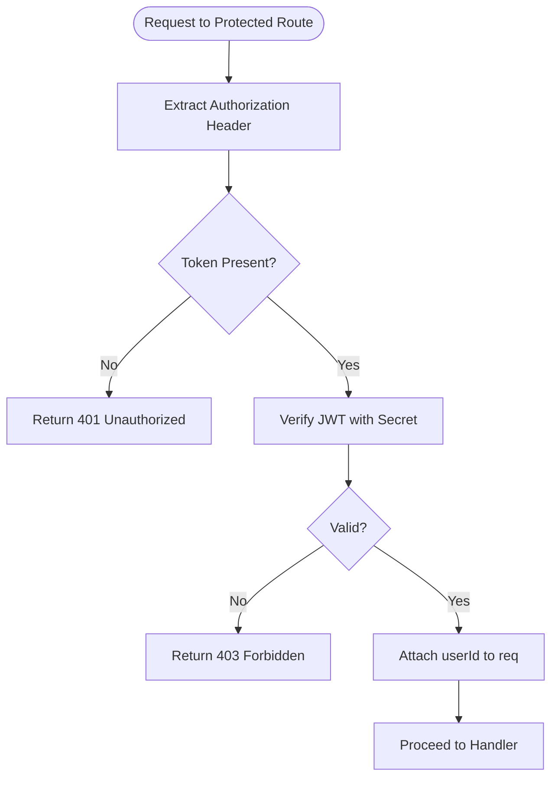
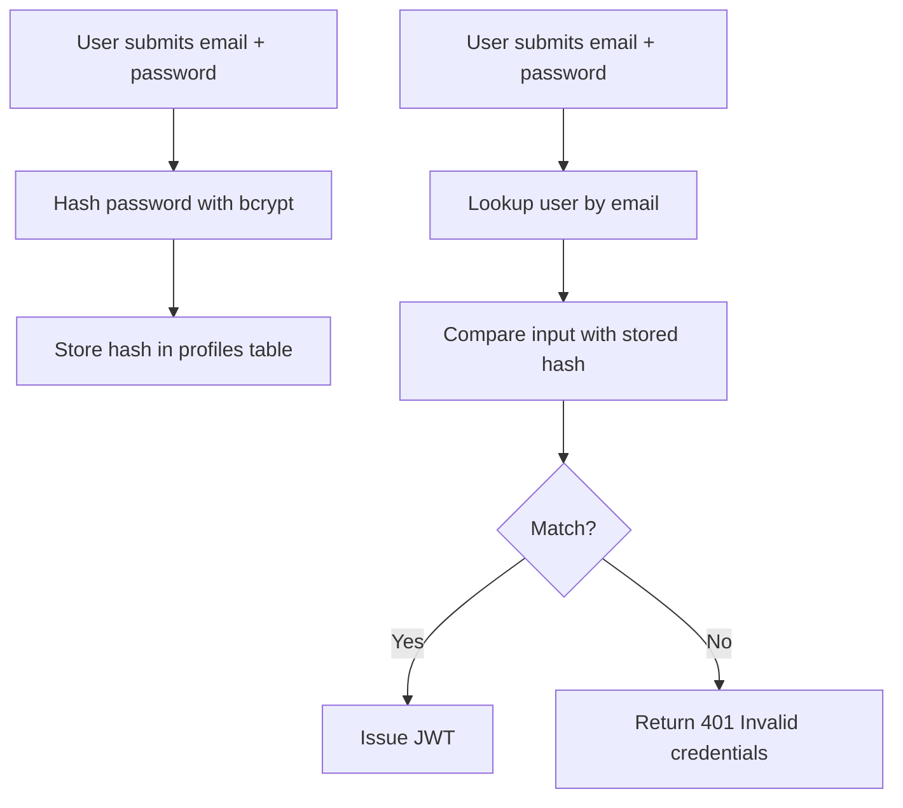
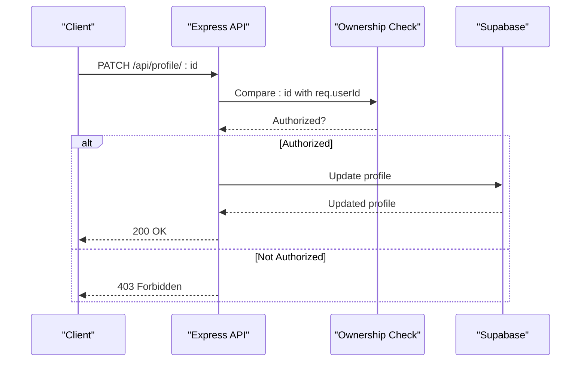
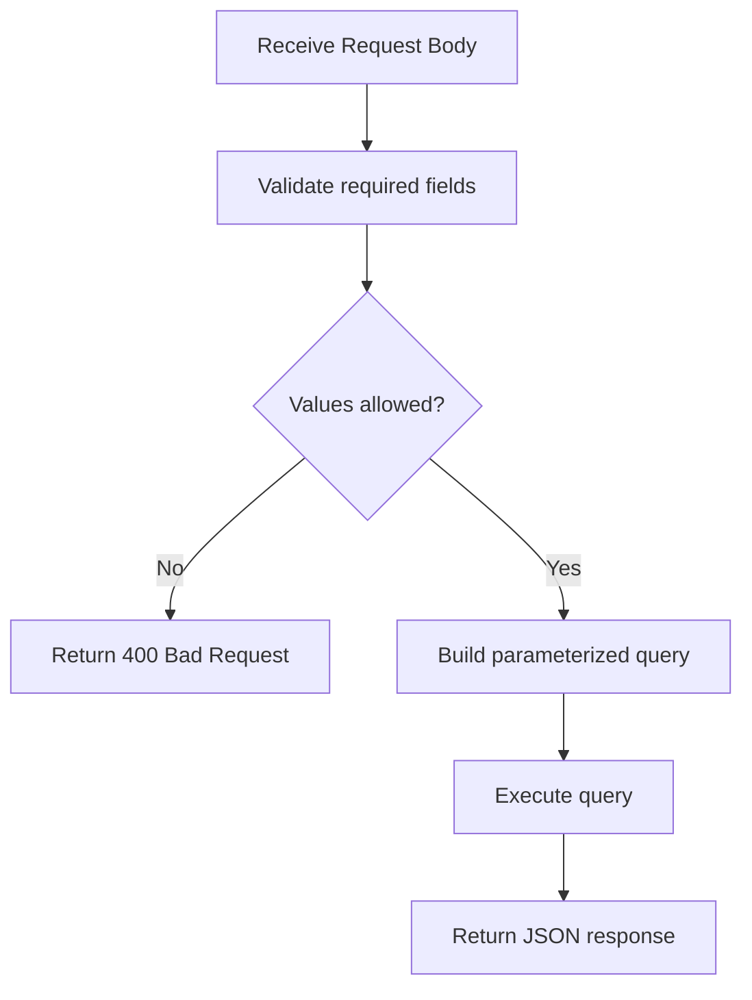
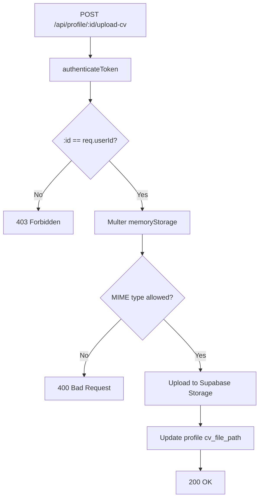
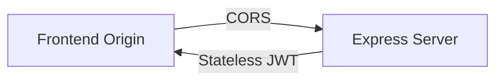
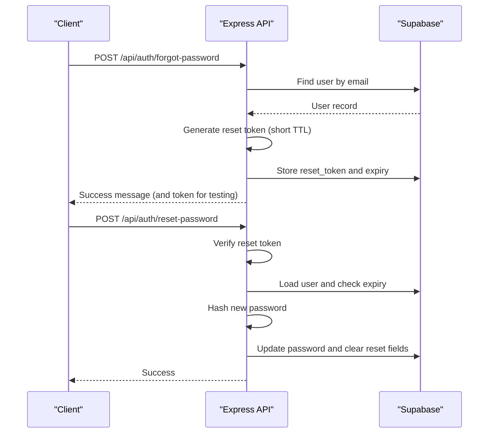
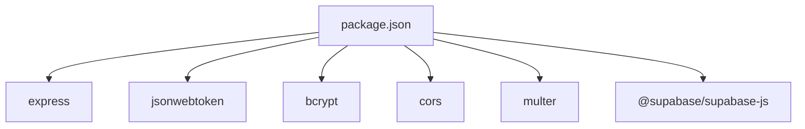

# Security Model

<cite>
**Referenced Files in This Document**
- [index.js](file://aischolarpath-backend-main/aischolarpath-backend-main/index.js)
- [package.json](file://aischolarpath-backend-main/aischolarpath-backend-main/package.json)
- [AuthModal.jsx](file://scholarpath-frontend (2)/scholarpath/src/components/AuthModal.jsx)
</cite>

## Table of Contents
1. [Introduction](#introduction)
2. [Project Structure](#project-structure)
3. [Core Components](#core-components)
4. [Architecture Overview](#architecture-overview)
5. [Detailed Component Analysis](#detailed-component-analysis)
6. [Dependency Analysis](#dependency-analysis)
7. [Performance Considerations](#performance-considerations)
8. [Troubleshooting Guide](#troubleshooting-guide)
9. [Conclusion](#conclusion)

## Introduction
This document explains ScholarPathAI’s security model and implementation as implemented in the backend Express server and the frontend authentication UI. It covers:
- JWT-based authentication (token generation, validation, and refresh considerations)
- Password hashing with bcrypt and secure storage practices
- Authorization model for protecting routes and enforcing resource ownership
- Input validation and sanitization strategies to mitigate common vulnerabilities
- File upload security measures
- Session management, CSRF protection, and CORS configuration

The goal is to provide both a high-level understanding and code-level references for developers and reviewers.

## Project Structure
The security logic is primarily implemented in the backend Express application. The frontend currently includes an authentication modal that simulates login/signup flows without calling the backend.

**Diagram sources**
- [index.js:1-31](file://aischolarpath-backend-main/aischolarpath-backend-main/index.js#L1-L31)

**Section sources**
- [index.js:1-31](file://aischolarpath-backend-main/aischolarpath-backend-main/index.js#L1-L31)
- [AuthModal.jsx:1-84](file://scholarpath-frontend (2)/scholarpath/src/components/AuthModal.jsx#L1-L84)

## Core Components
- Authentication middleware: A reusable middleware validates JWTs from the Authorization header and attaches the user ID to requests.
- Password hashing: Uses bcrypt for secure password storage during signup and verification during login.
- Token issuance: JWTs are issued on successful signup/login with a fixed expiration.
- Authorization checks: Route handlers enforce resource ownership by comparing request parameters with the authenticated user ID.
- File uploads: Multer handles file uploads; files are stored in memory and uploaded to Supabase Storage.
- CORS: Enabled globally for cross-origin requests.
- Environment validation: Required environment variables are validated at startup.

**Section sources**
- [index.js:32-47](file://aischolarpath-backend-main/aischolarpath-backend-main/index.js#L32-L47)
- [index.js:519-573](file://aischolarpath-backend-main/aischolarpath-backend-main/index.js#L519-L573)
- [index.js:112-145](file://aischolarpath-backend-main/aischolarpath-backend-main/index.js#L112-L145)
- [index.js:1-10](file://aischolarpath-backend-main/aischolarpath-backend-main/index.js#L1-L10)

## Architecture Overview
The authentication flow uses stateless JWTs. Clients send tokens via the Authorization header for protected endpoints. The server verifies tokens using a shared secret and enforces authorization by checking resource ownership.

**Diagram sources**
- [index.js:32-47](file://aischolarpath-backend-main/aischolarpath-backend-main/index.js#L32-L47)
- [index.js:519-573](file://aischolarpath-backend-main/aischolarpath-backend-main/index.js#L519-L573)
- [index.js:94-110](file://aischolarpath-backend-main/aischolarpath-backend-main/index.js#L94-L110)

## Detailed Component Analysis

### JWT-Based Authentication
- Token generation:
  - On signup and login, a JWT is signed with a user ID payload and a secret from environment variables, with a fixed expiration time.
- Token validation:
  - The authenticateToken middleware extracts the token from the Authorization header, verifies it against the secret, and attaches the decoded user ID to the request object.
- Refresh mechanism:
  - No explicit refresh endpoint exists. Tokens have a fixed lifetime. Implementing a refresh strategy would require adding a dedicated endpoint and storing refresh metadata securely.

**Diagram sources**
- [index.js:32-47](file://aischolarpath-backend-main/aischolarpath-backend-main/index.js#L32-L47)

**Section sources**
- [index.js:32-47](file://aischolarpath-backend-main/aischolarpath-backend-main/index.js#L32-L47)
- [index.js:519-573](file://aischolarpath-backend-main/aischolarpath-backend-main/index.js#L519-L573)

### Password Hashing and Secure Storage
- Hashing:
  - Passwords are hashed using bcrypt with a cost factor before being stored in the database.
- Verification:
  - During login, the provided password is compared against the stored hash using bcrypt.
- Storage:
  - Only the hashed password is persisted; plaintext passwords are never stored.

**Diagram sources**
- [index.js:519-573](file://aischolarpath-backend-main/aischolarpath-backend-main/index.js#L519-L573)

**Section sources**
- [index.js:519-573](file://aischolarpath-backend-main/aischolarpath-backend-main/index.js#L519-L573)

### Authorization Model and Resource Ownership
- Middleware enforcement:
  - Protected routes use the authenticateToken middleware to ensure requests carry a valid JWT.
- Ownership checks:
  - Handlers compare the requested resource ID with the authenticated user ID to prevent unauthorized access.
- Examples:
  - Profile read/update, CV upload, attestation steps, applications, notifications, and roadmap endpoints all enforce ownership.

**Diagram sources**
- [index.js:70-91](file://aischolarpath-backend-main/aischolarpath-backend-main/index.js#L70-L91)
- [index.js:94-110](file://aischolarpath-backend-main/aischolarpath-backend-main/index.js#L94-L110)

**Section sources**
- [index.js:70-110](file://aischolarpath-backend-main/aischolarpath-backend-main/index.js#L70-L110)
- [index.js:438-517](file://aischolarpath-backend-main/aischolarpath-backend-main/index.js#L438-L517)
- [index.js:822-932](file://aischolarpath-backend-main/aischolarpath-backend-main/index.js#L822-L932)
- [index.js:983-1051](file://aischolarpath-backend-main/aischolarpath-backend-main/index.js#L983-L1051)
- [index.js:1546-1595](file://aischolarpath-backend-main/aischolarpath-backend-main/index.js#L1546-L1595)

### Input Validation and Sanitization
- Basic validation:
  - Many endpoints validate required fields and return appropriate errors when missing.
  - Some endpoints restrict allowed values (e.g., item_type enumeration).
- SQL injection mitigation:
  - All database queries use parameterized conditions through the client library rather than string concatenation.
- XSS prevention:
  - Responses generally return structured JSON; no direct HTML rendering from user inputs is observed.
- External scraping endpoints:
  - Scraping endpoints accept selectors and URLs from clients. While they parse HTML safely with a library, allowing arbitrary selectors can be risky. Consider whitelisting selectors or validating them strictly.

**Diagram sources**
- [index.js:519-573](file://aischolarpath-backend-main/aischolarpath-backend-main/index.js#L519-L573)
- [index.js:751-771](file://aischolarpath-backend-main/aischolarpath-backend-main/index.js#L751-L771)
- [index.js:1183-1243](file://aischolarpath-backend-main/aischolarpath-backend-main/index.js#L1183-L1243)

**Section sources**
- [index.js:519-573](file://aischolarpath-backend-main/aischolarpath-backend-main/index.js#L519-L573)
- [index.js:751-771](file://aischolarpath-backend-main/aischolarpath-backend-main/index.js#L751-L771)
- [index.js:1183-1243](file://aischolarpath-backend-main/aischolarpath-backend-main/index.js#L1183-L1243)

### File Upload Security
- Configuration:
  - Multer is configured to store files in memory before uploading to Supabase Storage.
- Authorization:
  - CV upload requires authentication and enforces ownership of the target profile.
- Type and size restrictions:
  - No explicit MIME type allowlist or size limit is enforced in the upload handler.
- Recommendations:
  - Add strict allowlists for accepted MIME types (e.g., PDF, DOCX).
  - Enforce maximum file size limits to prevent abuse.
  - Validate filenames and sanitize paths to avoid directory traversal.

**Diagram sources**
- [index.js:112-145](file://aischolarpath-backend-main/aischolarpath-backend-main/index.js#L112-L145)

**Section sources**
- [index.js:112-145](file://aischolarpath-backend-main/aischolarpath-backend-main/index.js#L112-L145)

### Session Management, CSRF Protection, and CORS
- Session management:
  - The application is stateless; sessions are not used. Authentication relies on JWTs sent per request.
- CSRF protection:
  - Since there are no server-rendered forms or cookies involved in authentication, CSRF risk is minimal. If cookies were used for auth, CSRF protections would be necessary.
- CORS configuration:
  - CORS is enabled globally, which allows cross-origin requests from any origin. For production, restrict allowed origins to known frontends.

**Diagram sources**
- [index.js:1-31](file://aischolarpath-backend-main/aischolarpath-backend-main/index.js#L1-L31)

**Section sources**
- [index.js:1-31](file://aischolarpath-backend-main/aischolarpath-backend-main/index.js#L1-L31)

### Password Reset Flow
- Forgot password:
  - Generates a short-lived reset token tied to the user and stores its expiry in the database.
- Reset password:
  - Validates the reset token and expiry, then updates the password with a new bcrypt hash and clears reset metadata.

**Diagram sources**
- [index.js:1102-1181](file://aischolarpath-backend-main/aischolarpath-backend-main/index.js#L1102-L1181)

**Section sources**
- [index.js:1102-1181](file://aischolarpath-backend-main/aischolarpath-backend-main/index.js#L1102-L1181)

## Dependency Analysis
Key security-related dependencies:
- express: Web framework for routing and middleware.
- jsonwebtoken: JWT signing and verification.
- bcrypt: Password hashing and comparison.
- cors: Cross-Origin Resource Sharing configuration.
- multer: File upload handling.
- @supabase/supabase-js: Parameterized database and storage operations.

**Diagram sources**
- [package.json:1-14](file://aischolarpath-backend-main/aischolarpath-backend-main/package.json#L1-L14)

**Section sources**
- [package.json:1-14](file://aischolarpath-backend-main/aischolarpath-backend-main/package.json#L1-L14)

## Performance Considerations
- JWT verification is lightweight and stateless, suitable for high-throughput APIs.
- Bcrypt hashing adds CPU overhead; ensure appropriate cost factors and consider rate limiting on auth endpoints.
- File uploads stored in memory can increase memory usage; configure size limits and consider streaming to disk or directly to storage for large files.
- Scraping endpoints perform multiple HTTP requests; implement throttling and caching where appropriate.

[No sources needed since this section provides general guidance]

## Troubleshooting Guide
Common issues and mitigations:
- Missing environment variables:
  - The server validates required variables at startup and exits if missing. Ensure SUPABASE_URL, SUPABASE_KEY, and JWT_SECRET are set.
- Invalid or expired tokens:
  - Requests without a token receive 401; invalid/expired tokens receive 403. Verify client-side token handling and expiration policies.
- Unauthorized access:
  - Ownership checks return 403 when users attempt to access resources belonging to others. Confirm correct token issuance and resource IDs.
- File upload failures:
  - Ensure proper Authorization headers and that the target profile belongs to the requester. Validate MIME types and sizes on the client side.
- CORS errors:
  - Global CORS may allow all origins; restrict to trusted domains in production to reduce risk.

**Section sources**
- [index.js:1-10](file://aischolarpath-backend-main/aischolarpath-backend-main/index.js#L1-L10)
- [index.js:32-47](file://aischolarpath-backend-main/aischolarpath-backend-main/index.js#L32-L47)
- [index.js:112-145](file://aischolarpath-backend-main/aischolarpath-backend-main/index.js#L112-L145)

## Conclusion
ScholarPathAI implements a robust, stateless JWT-based authentication system with strong password hashing and consistent authorization checks across sensitive endpoints. While the current setup provides solid foundations, several improvements are recommended:
- Add explicit file type and size validation for uploads.
- Restrict CORS to trusted origins in production.
- Implement token refresh mechanisms for better UX and security.
- Harden external scraping endpoints by validating selectors and limiting outbound requests.
- Add rate limiting and comprehensive input validation libraries for defense-in-depth.

These enhancements will further strengthen the security posture while maintaining usability and performance.