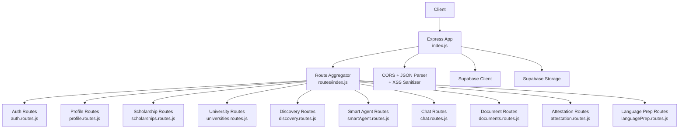
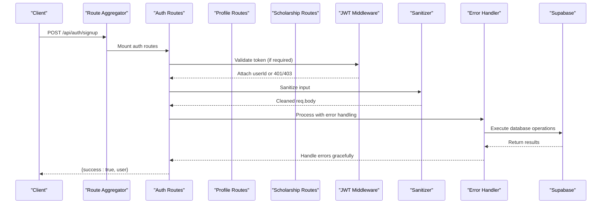
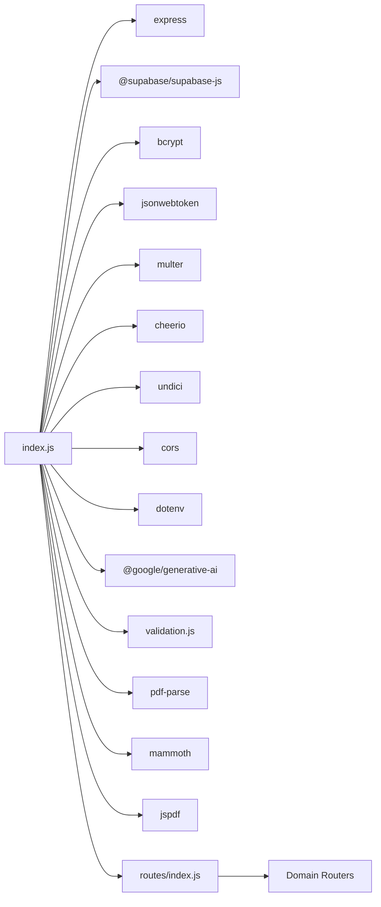

# API Endpoints

<cite>
**Referenced Files in This Document**
- [index.js](file://aischolarpath-backend-main/aischolarpath-backend-main/index.js)
- [routes/index.js](file://aischolarpath-backend-main/aischolarpath-backend-main/routes/index.js)
- [routes/auth.routes.js](file://aischolarpath-backend-main/aischolarpath-backend-main/routes/auth.routes.js)
- [routes/profile.routes.js](file://aischolarpath-backend-main/aischolarpath-backend-main/routes/profile.routes.js)
- [routes/scholarships.routes.js](file://aischolarpath-backend-main/aischolarpath-backend-main/routes/scholarships.routes.js)
- [routes/universities.routes.js](file://aischolarpath-backend-main/aischolarpath-backend-main/routes/universities.routes.js)
- [routes/attestation.routes.js](file://aischolarpath-backend-main/aischolarpath-backend-main/routes/attestation.routes.js)
- [routes/languagePrep.routes.js](file://aischolarpath-backend-main/aischolarpath-backend-main/routes/languagePrep.routes.js)
- [routes/chat.routes.js](file://aischolarpath-backend-main/aischolarpath-backend-main/routes/chat.routes.js)
- [routes/discovery.routes.js](file://aischolarpath-backend-main/aischolarpath-backend-main/routes/discovery.routes.js)
- [routes/smartAgent.routes.js](file://aischolarpath-backend-main/aischolarpath-backend-main/routes/smartAgent.routes.js)
- [routes/applications.routes.js](file://aischolarpath-backend-main/aischolarpath-backend-main/routes/applications.routes.js)
- [routes/shortlist.routes.js](file://aischolarpath-backend-main/aischolarpath-backend-main/routes/shortlist.routes.js)
- [routes/notifications.routes.js](file://aischolarpath-backend-main/aischolarpath-backend-main/routes/notifications.routes.js)
- [routes/documents.routes.js](file://aischolarpath-backend-main/aischolarpath-backend-main/routes/documents.routes.js)
- [routes/roadmap.routes.js](file://aischolarpath-backend-main/aischolarpath-backend-main/routes/roadmap.routes.js)
- [validation.js](file://aischolarpath-backend-main/aischolarpath-backend-main/validation.js)
- [package.json](file://aischolarpath-backend-main/aischolarpath-backend-main/package.json)
- [api.js](file://scholarpath-frontend (2)/scholarpath/src/api.js)
</cite>

## Update Summary
**Changes Made**
- Reorganized all routes into dedicated files under the routes/ directory with centralized aggregation in routes/index.js
- Created specialized route modules for chat streaming, discovery features, and smart agent capabilities
- Maintained backward compatibility of external API endpoints while improving code organization
- Updated architecture documentation to reflect the new modular route structure
- Enhanced maintainability through separation of concerns across domain-specific route files

## Table of Contents
1. [Introduction](#introduction)
2. [Project Structure](#project-structure)
3. [Core Components](#core-components)
4. [Architecture Overview](#architecture-overview)
5. [Detailed Component Analysis](#detailed-component-analysis)
6. [Dependency Analysis](#dependency-analysis)
7. [Performance Considerations](#performance-considerations)
8. [Troubleshooting Guide](#troubleshooting-guide)
9. [Conclusion](#conclusion)

## Introduction
This document provides comprehensive API documentation for the ScholarPathAI backend. The system has been restructured with a modular route architecture where each feature domain is contained in its own route file, all aggregated through a central router. It covers authentication, profile management, scholarship matching, university and scholarship discovery, attestation workflow, utility endpoints, Smart Agent functionality, and additional features such as applications, shortlists, notifications, document tools, chat placeholder, and roadmap generation. Each endpoint includes HTTP methods, URL patterns, request/response schemas, authentication requirements, parameter validation rules, status codes, and common usage notes.

All endpoints now follow a standardized response format with consistent error handling and enhanced input sanitization. Performance optimizations have been implemented including parallel database query execution for improved response times. The document conversion endpoints feature robust error handling with comprehensive fallback behaviors.

## Project Structure
The backend follows a modular Express application architecture that:
- Uses a centralized entry point (index.js) for middleware configuration and route mounting
- Organizes routes into domain-specific files under the routes/ directory
- Implements a hierarchical routing structure with /api as the base path
- Validates required environment variables at startup (Supabase URL/key, JWT secret)
- Uses CORS and JSON parsing middleware with proper ordering
- Implements centralized JWT-based authentication middleware with standardized error responses
- Connects to Supabase for data persistence
- Exposes RESTful endpoints across multiple feature areas with clear separation of concerns



**Diagram sources**
- [index.js:17-79](file://aischolarpath-backend-main/aischolarpath-backend-main/index.js#L17-L79)
- [routes/index.js:12-30](file://aischolarpath-backend-main/aischolarpath-backend-main/routes/index.js#L12-L30)

**Section sources**
- [index.js:1-82](file://aischolarpath-backend-main/aischolarpath-backend-main/index.js#L1-L82)
- [routes/index.js:1-32](file://aischolarpath-backend-main/aischolarpath-backend-main/routes/index.js#L1-L32)

## Core Components
- **Modular Route Architecture**: All routes are organized into domain-specific files for better maintainability and separation of concerns
- Authentication:
  - Signup, login, forgot password, reset password with standardized error responses
  - JWT token issuance and verification via reusable middleware with consistent 401/403 errors
- Profile Management:
  - Update own profile, get profile by id, upload CV, analyze CV, overview summary
  - All endpoints return standardized `{ success: boolean, ... }` response format
- Scholarship Matching:
  - Run matching for a profile against scholarships, retrieve stored matches
  - Enhanced with weighted scoring and detailed eligibility evidence
- **Smart Agent**:
  - Real-time scholarship discovery with live scraping from official portals
  - AI-powered scholarship extraction and structuring
  - Comprehensive eligibility assessment with weighted scoring and chance calculations
  - Enhanced response structure with detailed evidence, reasons, and probability assessments
- Discovery:
  - List/filter scholarships and universities; scrape and structure data from URLs; approve pending scholarships
  - Standardized error handling across all discovery endpoints
  - **Performance Optimized**: University listing endpoint uses parallel database queries for faster response times
- Attestation Workflow:
  - Initialize steps per authority, view steps, mark step complete
  - Consistent authentication and authorization checks
- Utilities:
  - Language prep guides and personalized guidance based on profile and matches
  - Applications tracker, shortlist manager, notifications, document tools, chat placeholder, roadmap generator
  - All utilities follow standardized response format
- **Enhanced Document Tools**:
  - CV conversion with robust error handling and fallback behaviors
  - Letter generation with comprehensive error messages and graceful degradation
  - PDF generation with error recovery and partial result support

**Section sources**
- [routes/auth.routes.js:15-27](file://aischolarpath-backend-main/aischolarpath-backend-main/routes/auth.routes.js#L15-L27)
- [routes/profile.routes.js:18-24](file://aischolarpath-backend-main/aischolarpath-backend-main/routes/profile.routes.js#L18-L24)
- [routes/smartAgent.routes.js:11-12](file://aischolarpath-backend-main/aischolarpath-backend-main/routes/smartAgent.routes.js#L11-L12)
- [routes/discovery.routes.js:14-19](file://aischolarpath-backend-main/aischolarpath-backend-main/routes/discovery.routes.js#L14-L19)

## Architecture Overview
The system follows a layered approach with enhanced security and standardization:
- Request layer: Modular Express routes define REST endpoints with consistent response formats
- Security layer: JWT middleware validates tokens and attaches user context with standardized errors
- Input validation: Centralized sanitization middleware processes requests after JSON parsing
- Business logic: Route handlers implement domain operations with comprehensive error handling
- Data layer: Supabase client performs queries and storage operations
- External integrations: Cheerio-based web scraping with rate limiting and logging, Google Gemini AI integration
- **Performance Layer**: Parallel query execution using Promise.all() for optimized database operations
- **Error Handling Layer**: Standardized error responses with graceful fallbacks for critical operations



**Diagram sources**
- [index.js:52-71](file://aischolarpath-backend-main/aischolarpath-backend-main/index.js#L52-L71)
- [routes/index.js:15-29](file://aischolarpath-backend-main/aischolarpath-backend-main/routes/index.js#L15-L29)
- [routes/auth.routes.js:15-27](file://aischolarpath-backend-main/aischolarpath-backend-main/routes/auth.routes.js#L15-L27)

## Detailed Component Analysis

### Authentication Endpoints
All authentication endpoints now use standardized response format with consistent error handling.

- POST /api/auth/signup
  - Auth: None
  - Body: full_name (string), email (string), password (string)
  - Validation: email and password required via validate middleware
  - Success 200: { success: true, user: { id, full_name, email }, token }
  - Errors: 400 if missing fields; 409 duplicate email; 500 on DB error
- POST /api/auth/login
  - Auth: None
  - Body: email (string), password (string)
  - Validation: email and password required via validate middleware
  - Success 200: { success: true, user: { id, full_name, email }, token }
  - Errors: 400 if missing fields; 401 invalid credentials; 500 on DB error
- POST /api/auth/forgot-password
  - Auth: None
  - Body: email (string)
  - Validation: email required
  - Success 200: { success: true, message, reset_token } (token returned for testing)
  - Errors: 400 if missing email; 500 on DB error
- POST /api/auth/reset-password
  - Auth: None
  - Body: reset_token (string), new_password (string)
  - Validation: both required; token must be valid and not expired
  - Success 200: { success: true, message }
  - Errors: 400 if missing fields; 401 invalid/expired token; 500 on DB error

**Updated** All authentication endpoints now include rate limiting and standardized error responses.

**Section sources**
- [routes/auth.routes.js:15-27](file://aischolarpath-backend-main/aischolarpath-backend-main/routes/auth.routes.js#L15-L27)
- [validation.js:23-74](file://aischolarpath-backend-main/aischolarpath-backend-main/validation.js#L23-L74)

### Profile Management Endpoints
Profile endpoints follow standardized response format with enhanced error handling.

- PATCH /api/profile
  - Auth: Required (Bearer JWT)
  - Body: optional fields full_name, cgpa, ielts_score, target_country, target_degree, target_department
  - Behavior: Updates only provided fields for current user
  - Success 200: { success: true, profile }
  - Errors: 500 on DB error
- GET /api/profile/:id
  - Auth: Required (Bearer JWT)
  - Path: id must equal current user id
  - Success 200: { success: true, profile }
  - Errors: 403 unauthorized if id mismatch; 404 if not found; 500 on DB error
- POST /api/profile/:id/upload-cv
  - Auth: Required (Bearer JWT)
  - Path: id must equal current user id
  - Form: multipart with field cv (file)
  - Success 200: { success: true, file_path }
  - Errors: 400 no file; 403 unauthorized; 500 on storage/update error
- POST /api/profile/:id/analyze
  - Auth: Required (Bearer JWT)
  - Path: id must equal current user id
  - Behavior: Placeholder extraction; updates extracted_profile_data and profile fields
  - Success 200: { success: true, extracted }
  - Errors: 403 unauthorized; 500 on DB errors
- GET /api/profile/:id/overview
  - Auth: Required (Bearer JWT)
  - Path: id must equal current user id
  - Success 200: { success: true, overview: { profile_completeness, summary, top_recommendations } }
  - Errors: 403 unauthorized; 404 if profile not found; 500 on DB error

**Updated** All profile endpoints now return standardized response format with consistent error handling.

**Section sources**
- [routes/profile.routes.js:18-24](file://aischolarpath-backend-main/aischolarpath-backend-main/routes/profile.routes.js#L18-L24)

### Smart Agent Endpoints
Enhanced Smart Agent endpoints with comprehensive response structure and AI-powered analysis.

- GET /api/smart-agent/status
  - Auth: None
  - Purpose: Health check for Smart Agent service
  - Success 200: { status: 'ok', message: 'Smart Agent is active', version: '2.0' }
  - Errors: None (always returns success)
- POST /api/smart-agent/match
  - Auth: Required (Bearer JWT)
  - Body: profileId (string, must match authenticated user)
  - Behavior: 
    - Retrieves user profile and CV extracted data
    - Performs live scraping from official scholarship portals for target country
    - Runs comprehensive eligibility assessment with weighted scoring
    - Returns AI-powered analysis and recommendations with detailed evidence
  - Success 200: { success: true, matches, scholarship_count, scrape_info, stats, analysis, profile_summary }
  - Errors: 403 unauthorized if profileId doesn't match user; 404 if profile not found; 500 on processing errors

**Enhanced Response Schema:**
```json
{
  "success": true,
  "matches": [
    {
      "profile_id": "user-id",
      "scholarship_id": "scholarship-id",
      "university_name": "University Name",
      "match_score": "85.50",
      "status": "Eligible|Partially Eligible|Not Eligible|Not Scored",
      "evidence": [
        {"criterion": "CGPA", "required": 3.0, "actual": 3.5, "result": "Pass", "weight": 25}
      ],
      "reasons": ["Your CGPA meets the requirement"],
      "chance": 85,
      "chance_label": "High Chance",
      "chance_color": "green",
      "title": "Scholarship Title",
      "country": "Country",
      "deadline": "YYYY-MM-DD",
      "apply_url": "https://...",
      "degree": "Degree Level",
      "department": "Department",
      "scholarship_type": "Type",
      "funding": "Funding Coverage",
      "funding_value": 0
    }
  ],
  "scrape_info": {
    "source": "live_scrape|database|cached|no_data",
    "scraped_count": 15,
    "error": null
  },
  "stats": {
    "eligible": 5,
    "partial": 3,
    "not_eligible": 2,
    "total": 10
  },
  "analysis": "Personalized AI-generated recommendation text",
  "profile_summary": {
    "degree": "Master's",
    "field": "Computer Science",
    "country": "Germany",
    "cgpa": 3.7,
    "ielts": 7.0,
    "cv_analyzed": true
  }
}
```

**Enhanced Features:**
- **Live Scraping**: Real-time data collection from official government scholarship portals
- **AI Integration**: Google Gemini AI for structured scholarship extraction and analysis
- **Weighted Scoring**: Multi-criteria evaluation (CGPA, IELTS, Field, Degree, Deadline)
- **Chance Calculations**: Probability assessment with visual indicators (color-coded labels)
- **Detailed Evidence**: Comprehensive breakdown of eligibility criteria with pass/fail status
- **Cache System**: 24-hour caching of scraped data to reduce external API calls
- **Comprehensive Analysis**: Personalized recommendations based on profile strength

**Error Handling:**
- 403: Unauthorized access or profile ID mismatch
- 404: Profile not found
- 500: Database errors, scraping failures, or AI processing errors
- Graceful fallbacks when scraping fails (returns cached or database data)

**Section sources**
- [routes/smartAgent.routes.js:11-12](file://aischolarpath-backend-main/aischolarpath-backend-main/routes/smartAgent.routes.js#L11-L12)

### Scholarship Matching Endpoints
Standardized response format with enhanced matching capabilities.

- POST /api/profile/:id/match-scholarships
  - Auth: Required (Bearer JWT)
  - Path: id must equal current user id
  - Behavior: Computes eligibility vs active scholarships, persists matches with scores and evidence
  - Success 200: { success: true, matches }
  - Errors: 403 unauthorized; 404 if profile not found; 500 on DB error
- GET /api/profile/:id/matches
  - Auth: Required (Bearer JWT)
  - Path: id must equal current user id
  - Success 200: { success: true, matches }
  - Errors: 403 unauthorized; 500 on DB error

Matching criteria include CGPA, IELTS score, and required degree with detailed evidence tracking. Statuses: Eligible, Missing Requirements, Not Eligible.

**Section sources**
- [routes/profile.routes.js:22-23](file://aischolarpath-backend-main/aischolarpath-backend-main/routes/profile.routes.js#L22-L23)

### University and Scholarship Discovery Endpoints
All discovery endpoints follow standardized response format with consistent error handling.

- GET /api/scholarships
  - Query params: country, scholarship_type, department, degree_level (optional)
  - Success 200: { success: true, scholarships }
  - Errors: 500 on DB error
- GET /api/scholarships/:id
  - Success 200: { success: true, scholarship }
  - Errors: 404 if not found; 500 on DB error
- **GET /api/universities**
  - Query params: country, degree_program, search (optional)
  - Filters universities that have direct scholarships or country-wide scholarships
  - **Performance Optimized**: Uses Promise.all() for parallel database queries to significantly reduce response times
  - Success 200: { success: true, universities }
  - Errors: 500 on DB error
- GET /api/universities/:id
  - Success 200: { success: true, university }
  - Errors: 404 if not found; 500 on DB error
- GET /api/scholarships/pending/review
  - Success 200: { success: true, count, pending }
  - Errors: 500 on DB error
- PATCH /api/scholarships/:id/approve
  - Auth: Required (Bearer JWT)
  - Body: optional eligibility_criteria, deadline
  - Success 200: { success: true, scholarship }
  - Errors: 500 on DB error

Discovery scrapers (require auth):
- POST /api/discovery/scrape
  - Body: url, item_selector, title_selector (optional), link_selector (optional)
  - Success 200: { success: true, items_found, items, log }
  - Errors: 400 missing fields; 500 on fetch/DB error
- POST /api/discovery/scrape-bulk
  - Body: urls (array), item_selector, title_selector (optional), link_selector (optional)
  - Success 200: { success: true, total_items_found, results }
  - Errors: 400 missing fields; 500 per URL failure logged
- POST /api/discovery/scrape-and-structure
  - Body: listing_url, item_selector, country, max_items (optional)
  - Success 200: { success: true, processed, results }
  - Errors: 400 missing fields; 500 on processing errors
- POST /api/discovery/scrape-official
  - Body: title, url, country
  - Success 200: { success: true, scholarship, extracted, deadline_found }
  - Errors: 400 missing fields; 500 on processing errors
- POST /api/discovery/scrape-official-bulk
  - Body: scholarships (array of {title, url, country})
  - Success 200: { success: true, processed, results }
  - Errors: 400 missing fields; 500 per URL failure logged
- GET /api/discovery/logs
  - Success 200: { success: true, logs }
  - Errors: 500 on DB error

**Updated** All discovery endpoints now include standardized error handling and response formats. The `/api/universities` endpoint has been optimized with parallel database query execution.

**Section sources**
- [routes/scholarships.routes.js:14-18](file://aischolarpath-backend-main/aischolarpath-backend-main/routes/scholarships.routes.js#L14-L18)
- [routes/universities.routes.js:10-11](file://aischolarpath-backend-main/aischolarpath-backend-main/routes/universities.routes.js#L10-L11)
- [routes/discovery.routes.js:14-19](file://aischolarpath-backend-main/aischolarpath-backend-main/routes/discovery.routes.js#L14-L19)

### Attestation Workflow Endpoints
Standardized authentication and response format for attestation endpoints.

- GET /api/attestation/:authority
  - No auth required
  - Path: authority in {HEC, IBCC, MOFA}
  - Success 200: { success: true, authority, steps }
  - Errors: 404 unknown authority
- POST /api/attestation/:authority/init/:profileId
  - Auth: Required (Bearer JWT)
  - Path: authority in {HEC, IBCC, MOFA}, profileId must equal current user id
  - Success 200: { success: true, steps }
  - Errors: 403 unauthorized; 404 unknown authority; 500 on DB error
- GET /api/attestation/profile/:profileId
  - Auth: Required (Bearer JWT)
  - Path: profileId must equal current user id
  - Success 200: { success: true, steps }
  - Errors: 403 unauthorized; 500 on DB error
- PATCH /api/attestation/:id/complete
  - Auth: Required (Bearer JWT)
  - Path: id of attestation step owned by current user
  - Success 200: { success: true, step }
  - Errors: 403 unauthorized; 404 not found; 500 on DB error

**Section sources**
- [routes/attestation.routes.js:11-14](file://aischolarpath-backend-main/aischolarpath-backend-main/routes/attestation.routes.js#L11-L14)

### Utility Endpoints (/api/language-prep/*)
Standardized response format for language preparation endpoints.

- GET /api/language-prep/:testType
  - No auth required
  - Path: testType in {IELTS, TOEFL, PTE}
  - Success 200: { success: true, test_type, guide }
  - Errors: 404 unknown test type
- GET /api/language-prep/profile/:profileId
  - Auth: Required (Bearer JWT)
  - Path: profileId must equal current user id
  - Success 200: { success: true, current_ielts_score, highest_required_score, needs_improvement, requirements_by_scholarship, guide }
  - Errors: 403 unauthorized; 404 profile not found; 500 on DB error

**Section sources**
- [routes/languagePrep.routes.js:11-12](file://aischolarpath-backend-main/aischolarpath-backend-main/routes/languagePrep.routes.js#L11-L12)

### Enhanced Document Tools Endpoints
**Updated** Document conversion endpoints now feature robust error handling and comprehensive fallback behaviors.

#### CV Conversion Endpoint
- POST /api/documents/cv/convert
  - Auth: Required (Bearer JWT)
  - Form: multipart with field cv (file), profile_id (optional)
  - Behavior: Converts uploaded CV to Europass format with AI-powered extraction and PDF generation
  - Success 200: { success: true, message, suggestions, pdf_base64, summary, work_experience, education, certifications, projects, achievements, skills, languages, hobbies, references }
  - Errors: 401 unauthorized; 400 no file; 500 on processing errors

**Enhanced Error Handling:**
- Graceful fallback when AI extraction fails (returns default structure with suggestions)
- PDF generation errors are caught and logged without failing the entire request
- File parsing errors handled with appropriate error messages
- Database connection issues handled with graceful degradation

**Robust Fallback Behaviors:**
- When AI parsing fails: Returns structured empty data with improvement suggestions
- When PDF generation fails: Still returns parsed data and suggestions
- When file parsing fails: Attempts alternative parsing methods
- When database unavailable: Proceeds with available data

#### Letter Generation Endpoint
- POST /api/documents/letter/generate
  - Auth: None
  - Form: multipart with field draft (file)
  - Behavior: Generates polished academic recommendation letters using AI
  - Success 200: { success: true, message, letter_text }
  - Errors: 400 no draft uploaded; 500 on AI processing errors

**Enhanced Error Handling:**
- Proper validation for missing draft files
- Graceful handling of AI service failures
- Support for various file formats with appropriate fallbacks
- Comprehensive error messages for debugging

**Section sources**
- [routes/documents.routes.js:12-13](file://aischolarpath-backend-main/aischolarpath-backend-main/routes/documents.routes.js#L12-L13)

### Additional Features (Applications, Shortlist, Notifications, Documents, Chat, Roadmap)
All additional endpoints follow standardized response format with consistent error handling.

- Applications
  - POST /api/applications (auth): create application → { success: true, application }
  - PATCH /api/applications/:id (auth): update status/notes → { success: true, application }
  - GET /api/applications/:profileId (auth): list applications → { success: true, applications }
  - DELETE /api/applications/:id (auth): remove application → { success: true, message }
- Shortlist
  - POST /api/shortlist (auth): add item → { success: true, shortlisted }
  - DELETE /api/shortlist/:id (auth): remove item → { success: true, message }
  - GET /api/shortlist/:profileId (auth): list items with details → { success: true, scholarships, universities }
- Notifications
  - POST /api/notifications (auth): create notification → { success: true, notification }
  - GET /api/notifications/:profileId (auth): list notifications → { success: true, notifications }
  - PATCH /api/notifications/:id/read (auth): mark read → { success: true, notification }
  - POST /api/notifications/check-deadlines/:profileId (auth): generate reminders → { success: true, notifications }
- Document Tools
  - POST /api/documents/cv/convert (multipart): convert CV → { success: true, pdf_base64, suggestions, ... }
  - POST /api/documents/letter/generate (multipart): generate letter → { success: true, letter_text }
- Chat
  - POST /api/chat: send message → { success: true, reply }
- Roadmap
  - GET /api/roadmap/:profileId (auth): personalized roadmap → { success: true, roadmap }

**Updated** All additional endpoints now include standardized response format and consistent error handling.

**Section sources**
- [routes/applications.routes.js:13-16](file://aischolarpath-backend-main/aischolarpath-backend-main/routes/applications.routes.js#L13-L16)
- [routes/shortlist.routes.js:11-13](file://aischolarpath-backend-main/aischolarpath-backend-main/routes/shortlist.routes.js#L11-L13)
- [routes/notifications.routes.js:13-16](file://aischolarpath-backend-main/aischolarpath-backend-main/routes/notifications.routes.js#L13-L16)
- [routes/chat.routes.js:9](file://aischolarpath-backend-main/aischolarpath-backend-main/routes/chat.routes.js#L9)
- [routes/roadmap.routes.js:11](file://aischolarpath-backend-main/aischolarpath-backend-main/routes/roadmap.routes.js#L11)

## Dependency Analysis
Key runtime dependencies:
- Express: HTTP server and routing
- cors: Cross-origin support
- dotenv: Environment variable loading
- @supabase/supabase-js: Database and storage client
- bcrypt: Password hashing
- jsonwebtoken: Token signing and verification
- multer: File upload handling
- cheerio + undici: Web scraping and HTTP requests
- @google/generative-ai: AI-powered scholarship extraction and analysis
- pdf-parse: PDF text extraction
- mammoth: DOCX file parsing
- jspdf: PDF generation

Environment variables required at startup:
- SUPABASE_URL, SUPABASE_KEY, JWT_SECRET
- Optional: PORT, GEMINI_API_KEY



**Diagram sources**
- [package.json:1-14](file://aischolarpath-backend-main/aischolarpath-backend-main/package.json#L1-L14)
- [index.js:17-79](file://aischolarpath-backend-main/aischolarpath-backend-main/index.js#L17-L79)
- [routes/index.js:12-30](file://aischolarpath-backend-main/aischolarpath-backend-main/routes/index.js#L12-L30)

**Section sources**
- [package.json:1-14](file://aischolarpath-backend-main/aischolarpath-backend-main/package.json#L1-L14)
- [index.js:17-79](file://aischolarpath-backend-main/aischolarpath-backend-main/index.js#L17-L79)

## Performance Considerations
- Connection pooling: Custom undici agent configured with connection limits and timeouts
- Rate limiting: Scraping endpoints introduce delays between requests to avoid overwhelming external sites
- Query optimization: Filtering and joins are performed in Supabase queries where possible
- Storage: CV uploads use memory storage and are persisted to Supabase storage buckets
- Error handling: Centralized error handler returns consistent 500 responses for unhandled exceptions
- **Enhanced Security**: Input sanitization middleware positioned after express.json() ensures proper XSS protection
- **Smart Agent Optimization**: 
  - 24-hour caching of scraped scholarship data
  - Fallback to database when live scraping fails
  - Efficient deduplication of scholarship entries
  - Batch processing of multiple scholarship portals
  - Optimized scraping with timeout controls for serverless environments
- **Parallel Query Execution**: The `/api/universities` endpoint now uses `Promise.all()` to execute three database queries concurrently:
  - University filtering query
  - Direct scholarship lookup (universities with direct scholarships)
  - Country-wide scholarship lookup (scholarships without university associations)
  - This parallel execution significantly reduces response times by eliminating sequential query waiting periods
- **Enhanced Document Processing**: Document conversion endpoints now include performance optimizations with efficient file parsing and PDF generation
- **Modular Architecture Benefits**: Route separation improves maintainability and allows for independent scaling of different feature domains

**Updated** Performance optimizations now include parallel database query execution using Promise.all() for the university listing endpoint, resulting in significantly reduced response times through concurrent execution of university queries and scholarship lookups. Document processing endpoints have been optimized for better performance with efficient file handling and PDF generation. The modular route architecture enables better performance monitoring and optimization per domain.

**Section sources**
- [routes/universities.routes.js:10-11](file://aischolarpath-backend-main/aischolarpath-backend-main/routes/universities.routes.js#L10-L11)
- [routes/documents.routes.js:12-13](file://aischolarpath-backend-main/aischolarpath-backend-main/routes/documents.routes.js#L12-L13)

## Troubleshooting Guide
Common issues and resolutions:
- Missing environment variables: Server exits at startup if SUPABASE_URL, SUPABASE_KEY, or JWT_SECRET are not set
- Authentication failures:
  - 401: No token provided or invalid/expired token → { success: false, error: "No token provided" }
  - 403: Token present but user not authorized to access resource → { success: false, error: "Not authorized" }
- Database errors:
  - 500: Supabase query/storage errors return error messages in response body
- File uploads:
  - 400: No file uploaded when expecting multipart form data
- Scraping:
  - 500: Network errors or selector mismatches; check logs and selectors; ensure target pages are accessible
- **Enhanced Error Handling**: All endpoints now return standardized error format with success: false and descriptive error messages
- **Input Validation**: Properly positioned sanitization middleware prevents XSS attacks while maintaining request body integrity
- **Performance Issues**: If experiencing slow response times on university listings, verify database connectivity and consider implementing query result caching
- **Document Processing Issues**:
  - PDF generation failures: Check jspdf availability and handle gracefully
  - AI parsing failures: Review prompt effectiveness and fallback behavior
  - File parsing errors: Verify supported file formats and encoding
- **Route Organization Issues**: If encountering 404 errors, verify route mounting order in routes/index.js and ensure proper middleware chain

**Updated** Error response format is now consistent across all endpoints:
```json
{
  "success": false,
  "error": "Descriptive error message"
}
```

Health checks:
- GET /api/health returns server status
- GET /api/test-db verifies Supabase connectivity
- GET /api/smart-agent/status verifies Smart Agent availability

**Section sources**
- [index.js:70-78](file://aischolarpath-backend-main/aischolarpath-backend-main/index.js#L70-L78)
- [routes/index.js:15-29](file://aischolarpath-backend-main/aischolarpath-backend-main/routes/index.js#L15-L29)

## Conclusion
The ScholarPathAI backend exposes a robust set of RESTful APIs covering authentication, profile management, scholarship matching, discovery, attestation workflows, utilities, Smart Agent functionality, and auxiliary features. The system has been restructured with a modular route architecture that improves maintainability while preserving backward compatibility. It uses JWT-based authentication with standardized error responses, Supabase for data persistence, Cheerio-based scraping for discovery, and Google Gemini AI for intelligent scholarship extraction. 

**Key Enhancements:**
- **Modular Route Architecture**: All routes organized into domain-specific files for better maintainability
- **Centralized Route Aggregation**: Single entry point (routes/index.js) manages all domain routers
- **Standardized Response Format**: All endpoints consistently return `{ success: boolean, ... }` structure
- **Enhanced Security**: Input sanitization middleware properly positioned after JSON parsing for XSS protection
- **Improved Error Handling**: Consistent status codes and error response formats across all endpoints
- **Advanced Smart Agent**: Enhanced with detailed evidence tracking, chance calculations, and AI-powered analysis
- **Robust Middleware Chain**: Proper ordering of authentication, sanitization, and business logic processing
- **Performance Optimizations**: Parallel database query execution using Promise.all() for significantly reduced response times
- **Enhanced Document Tools**: Robust error handling with comprehensive fallback behaviors for document conversion and letter generation

**Latest Improvements:**
- **Modular Architecture**: Complete reorganization of routes into dedicated files improves code organization and maintainability
- **Backward Compatibility**: All external API endpoints remain stable and unchanged despite internal restructuring
- **Enhanced Maintainability**: Domain-specific route files enable easier debugging and feature development
- **Document Conversion Enhancement**: The `/api/documents/cv/convert` endpoint now features comprehensive error handling with graceful fallbacks when AI parsing fails or PDF generation encounters issues
- **Letter Generation Improvement**: The `/api/documents/letter/generate` endpoint includes proper validation and error handling for missing drafts and AI service failures
- **Resilient Processing**: Both document endpoints continue processing even when individual components fail, returning partial results with appropriate error information
- **User Experience**: Enhanced error messages provide clear feedback to users about what went wrong and how to resolve issues

The latest architectural improvements include modular route organization that dramatically improves code maintainability while preserving all existing functionality. The enhanced document processing endpoints provide reliable service even when external services experience issues, ensuring consistent user experience.

**Section sources**
- [routes/index.js:12-30](file://aischolarpath-backend-main/aischolarpath-backend-main/routes/index.js#L12-L30)
- [routes/documents.routes.js:12-13](file://aischolarpath-backend-main/aischolarpath-backend-main/routes/documents.routes.js#L12-L13)