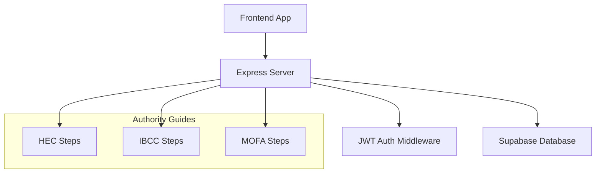
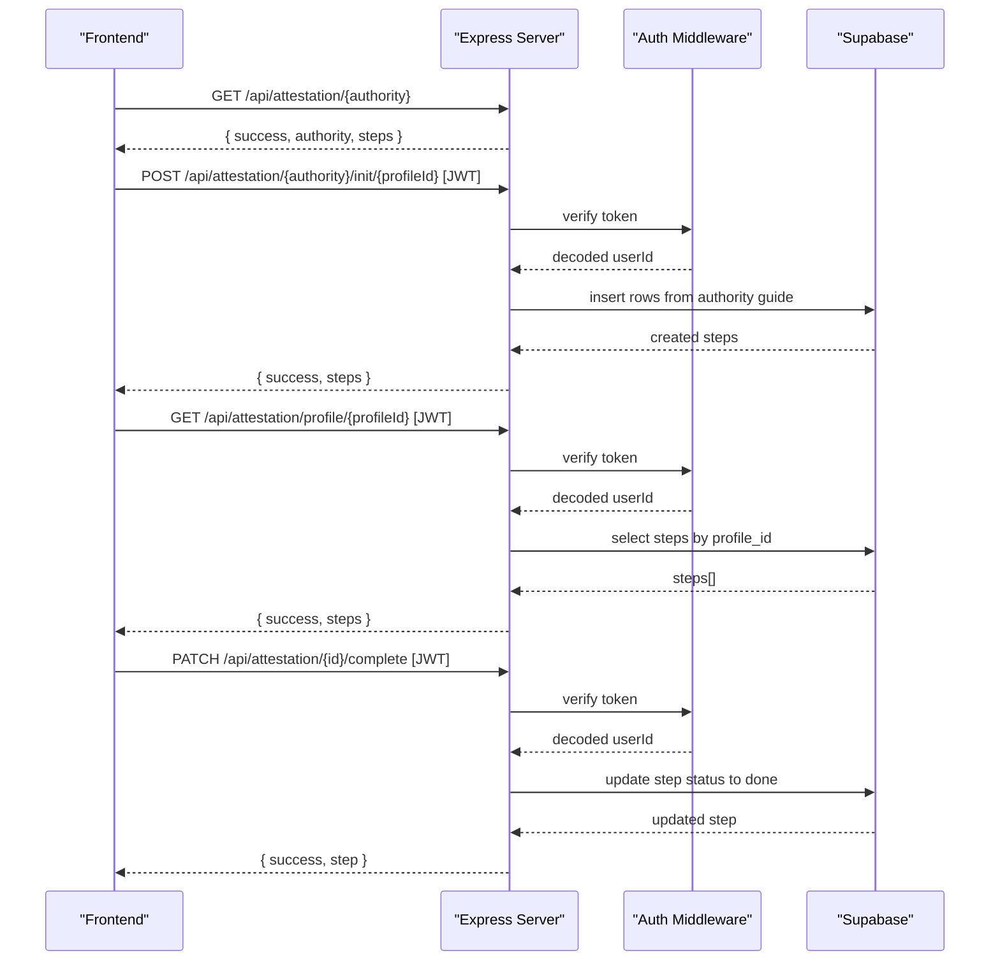
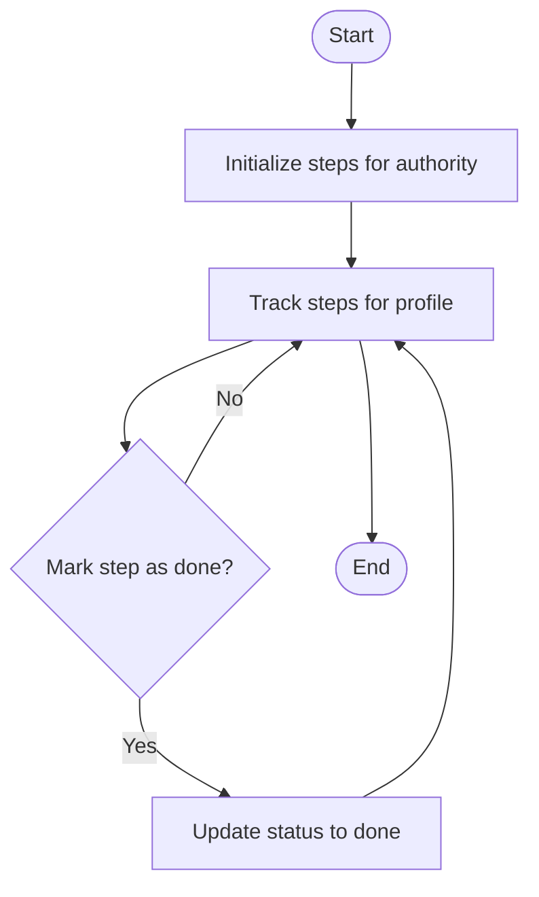
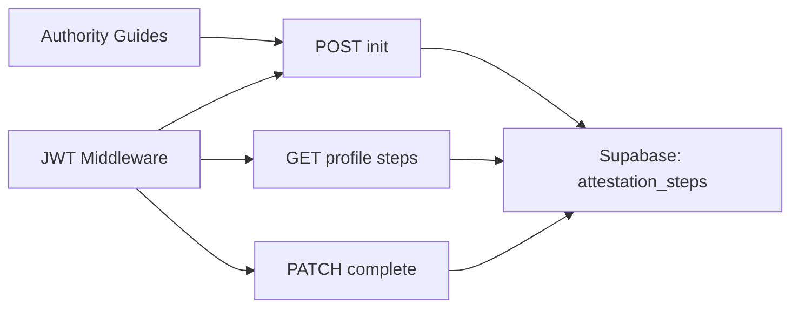

# Attestation Workflow Endpoints

<cite>
**Referenced Files in This Document**
- [index.js](file://aischolarpath-backend-main/aischolarpath-backend-main/index.js)
- [AttestationTab.jsx](file://scholarpath-frontend (2)/scholarpath/src/pages/AttestationTab.jsx)
- [mockData.js](file://scholarpath-frontend (2)/scholarpath/src/data/mockData.js)
</cite>

## Table of Contents
1. [Introduction](#introduction)
2. [Project Structure](#project-structure)
3. [Core Components](#core-components)
4. [Architecture Overview](#architecture-overview)
5. [Detailed Component Analysis](#detailed-component-analysis)
6. [Dependency Analysis](#dependency-analysis)
7. [Performance Considerations](#performance-considerations)
8. [Troubleshooting Guide](#troubleshooting-guide)
9. [Conclusion](#conclusion)

## Introduction
This document provides comprehensive API documentation for the ScholarPathAI attestation workflow endpoints that support Pakistani students preparing documents for study abroad. It covers authority-specific guidance retrieval, step initialization based on authority guidelines, progress tracking per profile, and step completion with status management. The supported authorities are HEC (Higher Education Commission), IBCC (Inter Board Committee of Chairmen), and MOFA (Ministry of Foreign Affairs).

## Project Structure
The attestation workflow is implemented in the backend Express server and complemented by frontend components that present authority-specific guidance to users.

- Backend:
  - Authority guides and all attestation endpoints are defined in a single server file.
  - Authentication middleware protects write and read operations tied to user profiles.
  - Data persistence uses Supabase via a client configured at startup.

- Frontend:
  - A tabbed UI presents HEC, IBCC, and MOFA options with official links and step-by-step instructions.
  - Static mock data defines detailed steps for each authority for display purposes.

**Diagram sources**
- [index.js:404-435](file://aischolarpath-backend-main/aischolarpath-backend-main/index.js#L404-L435)
- [index.js:437-517](file://aischolarpath-backend-main/aischolarpath-backend-main/index.js#L437-L517)

**Section sources**
- [index.js:1-55](file://aischolarpath-backend-main/aischolarpath-backend-main/index.js#L1-L55)
- [AttestationTab.jsx:1-72](file://scholarpath-frontend (2)/scholarpath/src/pages/AttestationTab.jsx#L1-L72)
- [mockData.js:256-309](file://scholarpath-frontend (2)/scholarpath/src/data/mockData.js#L256-L309)

## Core Components
- Authority guide definitions: static arrays describing ordered steps for HEC, IBCC, and MOFA.
- Endpoint handlers:
  - GET /api/attestation/:authority — returns authority-specific steps.
  - POST /api/attestation/:authority/init/:profileId — initializes tracked steps for a profile based on the selected authority’s guide.
  - GET /api/attestation/profile/:profileId — retrieves all tracked steps for a profile, ordered by authority and step order.
  - PATCH /api/attestation/:id/complete — marks a specific step as done.

- Authentication:
  - All stateful endpoints require a valid JWT token.
  - Authorization checks ensure users can only access or modify their own profile data.

- Data model (attestation_steps):
  - Fields include profile_id, authority, step_order, step_description, and status.
  - Status transitions from pending to done upon completion.

**Section sources**
- [index.js:404-435](file://aischolarpath-backend-main/aischolarpath-backend-main/index.js#L404-L435)
- [index.js:437-517](file://aischolarpath-backend-main/aischolarpath-backend-main/index.js#L437-L517)

## Architecture Overview
The attestation workflow follows a simple lifecycle:
1. Retrieve authority-specific guidance.
2. Initialize tracked steps for a profile using the chosen authority’s guide.
3. Monitor progress by fetching all steps for the profile.
4. Mark individual steps as complete to advance the workflow.

**Diagram sources**
- [index.js:427-435](file://aischolarpath-backend-main/aischolarpath-backend-main/index.js#L427-L435)
- [index.js:437-464](file://aischolarpath-backend-main/aischolarpath-backend-main/index.js#L437-L464)
- [index.js:467-486](file://aischolarpath-backend-main/aischolarpath-backend-main/index.js#L467-L486)
- [index.js:489-517](file://aischolarpath-backend-main/aischolarpath-backend-main/index.js#L489-L517)

## Detailed Component Analysis

### Authority-Specific Guide Retrieval
- Endpoint: GET /api/attestation/:authority
- Purpose: Return the predefined step list for a given authority (HEC, IBCC, MOFA).
- Behavior:
  - Validates authority against known values.
  - Returns normalized authority name and ordered steps.
  - Returns 404 if authority is unknown.

- Request:
  - Path parameter: authority (string; one of HEC, IBCC, MOFA)

- Response:
  - success: boolean
  - authority: string (normalized uppercase)
  - steps: array of step objects with step_order and description

- Error handling:
  - 404 when authority is not recognized.

**Section sources**
- [index.js:404-435](file://aischolarpath-backend-main/aischolarpath-backend-main/index.js#L404-L435)

### Step Initialization
- Endpoint: POST /api/attestation/:authority/init/:profileId
- Purpose: Create tracked steps for a profile based on the selected authority’s guide.
- Behavior:
  - Requires authentication.
  - Ensures the requesting user owns the profile.
  - Maps authority guide entries into database rows with initial status pending.
  - Inserts multiple rows in a single operation and returns them.

- Request:
  - Path parameters: authority (HEC|IBCC|MOFA), profileId (must match authenticated user id)
  - Headers: Authorization: Bearer <JWT>

- Response:
  - success: boolean
  - steps: array of created step records

- Error handling:
  - 403 if profileId does not match authenticated user.
  - 404 if authority is unknown.
  - 500 on database errors.

**Section sources**
- [index.js:437-464](file://aischolarpath-backend-main/aischolarpath-backend-main/index.js#L437-L464)

### Step Tracking
- Endpoint: GET /api/attestation/profile/:profileId
- Purpose: Retrieve all tracked attestation steps for a profile, ordered by authority and step order.
- Behavior:
  - Requires authentication.
  - Enforces ownership of the profile.
  - Returns full step details including status.

- Request:
  - Path parameter: profileId (must match authenticated user id)
  - Headers: Authorization: Bearer <JWT>

- Response:
  - success: boolean
  - steps: array of step records sorted by authority then step_order

- Error handling:
  - 403 if profileId does not match authenticated user.
  - 500 on database errors.

**Section sources**
- [index.js:467-486](file://aischolarpath-backend-main/aischolarpath-backend-main/index.js#L467-L486)

### Step Completion
- Endpoint: PATCH /api/attestation/:id/complete
- Purpose: Mark a specific step as completed.
- Behavior:
  - Requires authentication.
  - Verifies step existence and ownership.
  - Updates status to done and returns the updated record.

- Request:
  - Path parameter: id (step id)
  - Headers: Authorization: Bearer <JWT>

- Response:
  - success: boolean
  - step: updated step record

- Error handling:
  - 404 if step not found.
  - 403 if step belongs to another user.
  - 500 on database errors.

**Section sources**
- [index.js:489-517](file://aischolarpath-backend-main/aischolarpath-backend-main/index.js#L489-L517)

### Workflow States and Progress Tracking
- State model:
  - Each step has a status field with two states:
    - pending: step not yet completed
    - done: step completed
- Progress calculation:
  - Clients can compute progress by counting total steps and completed steps per authority or across all authorities.
  - Ordering ensures consistent UI presentation by authority and step order.

- Authority-specific procedures:
  - HEC: degree and transcript attestation process.
  - IBCC: Matric/Intermediate certificate equivalence and attestation.
  - MOFA: final apostille after HEC/IBCC.

**Diagram sources**
- [index.js:437-464](file://aischolarpath-backend-main/aischolarpath-backend-main/index.js#L437-L464)
- [index.js:467-486](file://aischolarpath-backend-main/aischolarpath-backend-main/index.js#L467-L486)
- [index.js:489-517](file://aischolarpath-backend-main/aischolarpath-backend-main/index.js#L489-L517)

### Frontend Integration Notes
- The frontend displays authority options and detailed steps for HEC, IBCC, and MOFA using static data.
- Official portal links are provided for each authority to guide users through external processes.

**Section sources**
- [AttestationTab.jsx:1-72](file://scholarpath-frontend (2)/scholarpath/src/pages/AttestationTab.jsx#L1-L72)
- [mockData.js:256-309](file://scholarpath-frontend (2)/scholarpath/src/data/mockData.js#L256-L309)

## Dependency Analysis
- Authentication dependency:
  - All stateful endpoints use a shared JWT verification middleware to extract the user id and enforce authorization.

- Database dependency:
  - Supabase client is used to read/write the attestation_steps table.
  - Queries filter by profile_id to isolate user data.

- Authority guide dependency:
  - Step initialization depends on the static authority guide mapping to generate step rows.

**Diagram sources**
- [index.js:32-47](file://aischolarpath-backend-main/aischolarpath-backend-main/index.js#L32-L47)
- [index.js:437-517](file://aischolarpath-backend-main/aischolarpath-backend-main/index.js#L437-L517)

**Section sources**
- [index.js:32-47](file://aischolarpath-backend-main/aischolarpath-backend-main/index.js#L32-L47)
- [index.js:437-517](file://aischolarpath-backend-main/aischolarpath-backend-main/index.js#L437-L517)

## Performance Considerations
- Batch creation:
  - Step initialization inserts all steps for an authority in a single database call, reducing round trips.
- Ordered retrieval:
  - Step tracking queries order results by authority and step_order to minimize client-side sorting.
- Authorization checks:
  - Early validation prevents unnecessary database calls for unauthorized requests.

[No sources needed since this section provides general guidance]

## Troubleshooting Guide
Common issues and resolutions:
- Unknown authority:
  - Ensure the authority parameter is one of HEC, IBCC, or MOFA.
  - The endpoint returns a 404 with a descriptive error.

- Unauthorized access:
  - Verify that the JWT token is valid and included in the Authorization header.
  - Ensure the profileId matches the authenticated user id for protected endpoints.

- Step not found:
  - Confirm that the step id exists and belongs to the authenticated user before marking it complete.

- Database errors:
  - Check environment variables for Supabase URL and key.
  - Inspect server logs for detailed error messages returned by the database layer.

**Section sources**
- [index.js:427-435](file://aischolarpath-backend-main/aischolarpath-backend-main/index.js#L427-L435)
- [index.js:437-464](file://aischolarpath-backend-main/aischolarpath-backend-main/index.js#L437-L464)
- [index.js:467-486](file://aischolarpath-backend-main/aischolarpath-backend-main/index.js#L467-L486)
- [index.js:489-517](file://aischolarpath-backend-main/aischolarpath-backend-main/index.js#L489-L517)

## Conclusion
The ScholarPathAI attestation workflow provides a clear, secure, and extensible system for managing document attestation tasks across HEC, IBCC, and MOFA. Clients can retrieve authority-specific guidance, initialize tracked steps, monitor progress, and mark steps complete. The design emphasizes user isolation via JWT-based authorization and efficient database interactions. Future enhancements may include richer step metadata, reminders, and integration with external authority portals for automated status updates.

[No sources needed since this section summarizes without analyzing specific files]