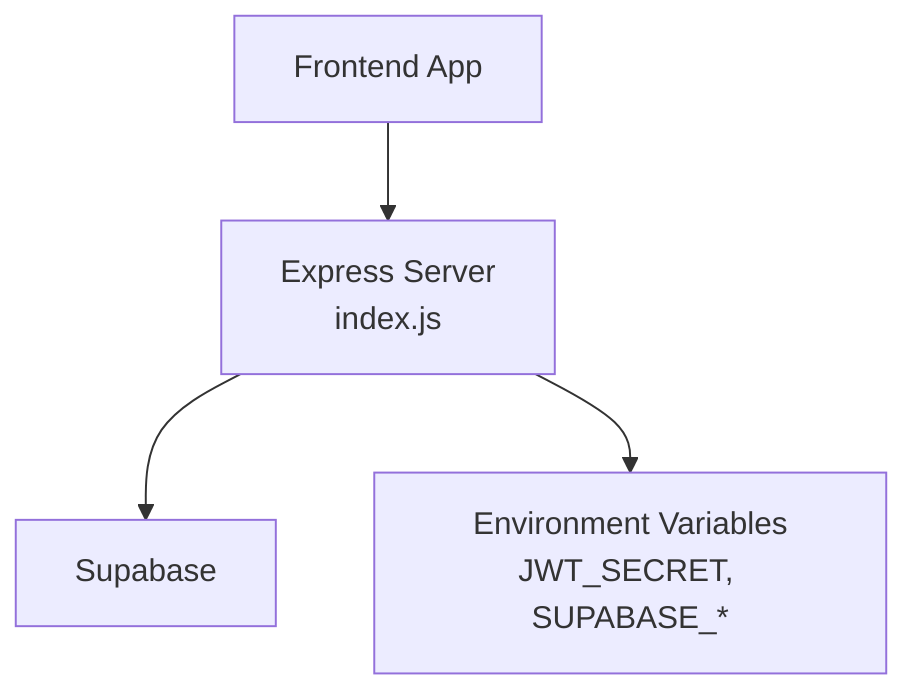
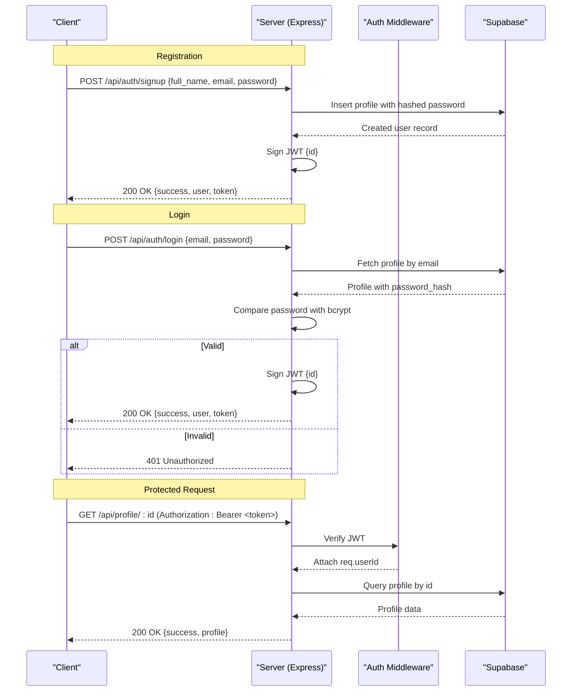
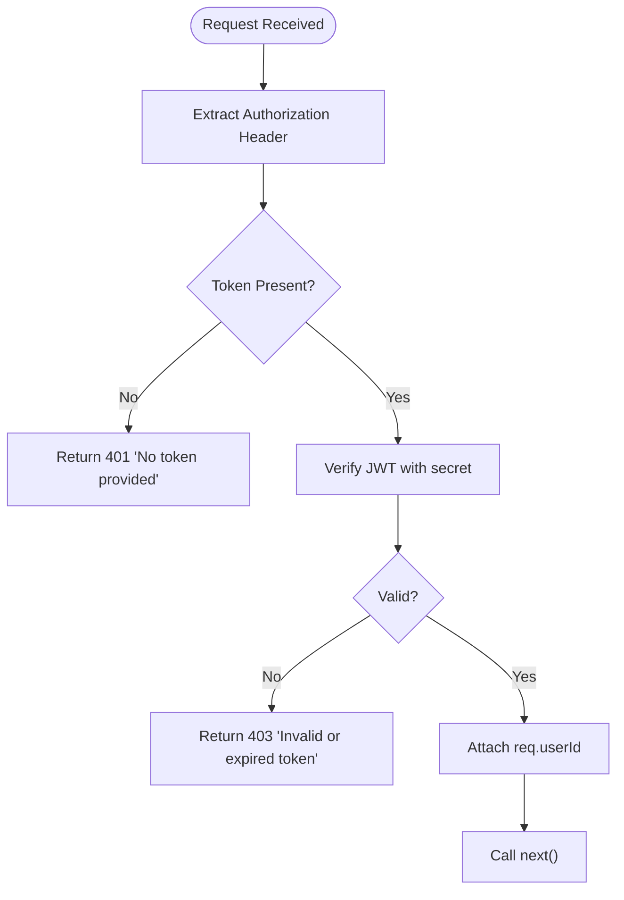
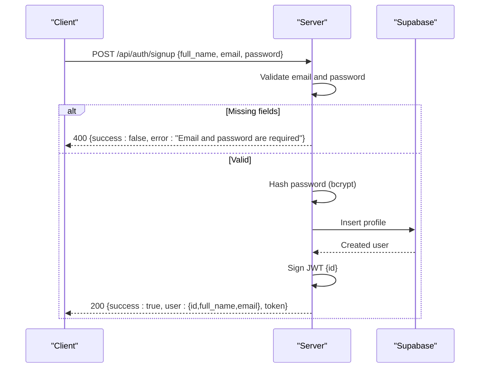
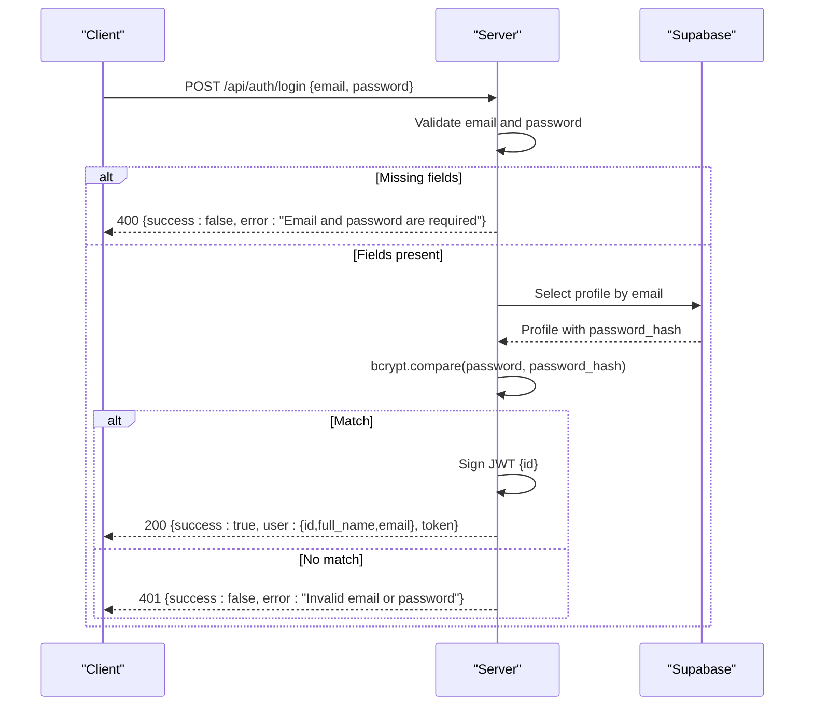
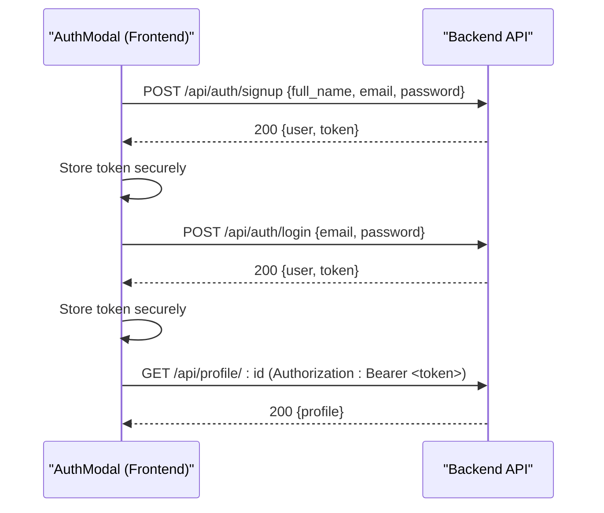
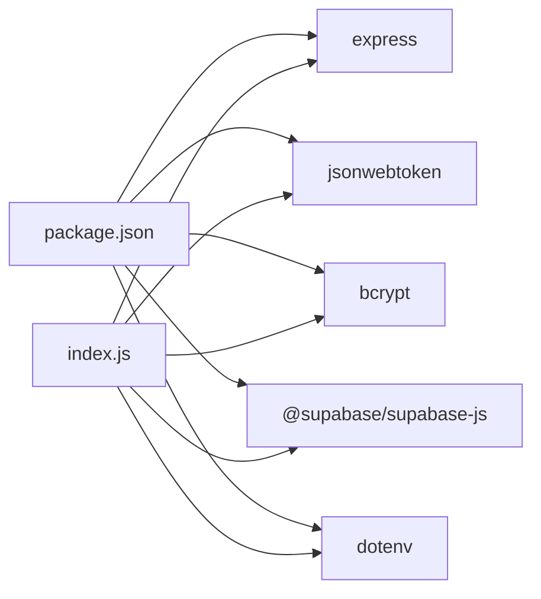

# Authentication Endpoints

<cite>
**Referenced Files in This Document**
- [index.js](file://aischolarpath-backend-main/aischolarpath-backend-main/index.js)
- [AuthModal.jsx](file://scholarpath-frontend (2)/scholarpath/src/components/AuthModal.jsx)
- [package.json](file://aischolarpath-backend-main/aischolarpath-backend-main/package.json)
</cite>

## Table of Contents
1. Introduction
2. Project Structure
3. Core Components
4. Architecture Overview
5. Detailed Component Analysis
6. Dependency Analysis
7. Performance Considerations
8. Troubleshooting Guide
9. Conclusion
10. Appendices

## Introduction
This document provides comprehensive API documentation for ScholarPathAI authentication endpoints, focusing on user registration and login flows. It covers request/response schemas, status codes, error handling, JWT token issuance, bcrypt password verification, and the authentication middleware used to protect subsequent routes. It also includes integration patterns for frontend applications.

## Project Structure
The backend is an Express application that implements:
- User signup and login endpoints under /api/auth
- A reusable JWT-based authentication middleware
- Database interactions via Supabase
- Environment-driven configuration for secrets and database credentials

**Diagram sources**
- [index.js:1-59](file://aischolarpath-backend-main/aischolarpath-backend-main/index.js#L1-L59)

**Section sources**
- [index.js:1-59](file://aischolarpath-backend-main/aischolarpath-backend-main/index.js#L1-L59)
- [package.json:1-14](file://aischolarpath-backend-main/aischolarpath-backend-main/package.json#L1-L14)

## Core Components
- Authentication middleware: Validates Authorization header, verifies JWT, attaches user ID to requests.
- Signup endpoint: Creates a new profile with hashed password and returns a JWT.
- Login endpoint: Authenticates email/password using bcrypt and returns a JWT.
- Password recovery endpoints: Generate reset tokens and reset passwords securely.

Key implementation references:
- Middleware definition and usage
- Signup route logic
- Login route logic
- Password reset flow

**Section sources**
- [index.js:32-47](file://aischolarpath-backend-main/aischolarpath-backend-main/index.js#L32-L47)
- [index.js:518-573](file://aischolarpath-backend-main/aischolarpath-backend-main/index.js#L518-L573)
- [index.js:1101-1181](file://aischolarpath-backend-main/aischolarpath-backend-main/index.js#L1101-L1181)

## Architecture Overview
The authentication architecture follows a standard pattern:
- Client sends credentials to signup/login endpoints
- Server validates input, hashes or compares passwords, and issues JWTs
- Protected routes require a valid JWT in the Authorization header

**Diagram sources**
- [index.js:32-47](file://aischolarpath-backend-main/aischolarpath-backend-main/index.js#L32-L47)
- [index.js:518-573](file://aischolarpath-backend-main/aischolarpath-backend-main/index.js#L518-L573)
- [index.js:94-110](file://aischolarpath-backend-main/aischolarpath-backend-main/index.js#L94-L110)

## Detailed Component Analysis

### Authentication Middleware
- Purpose: Enforce authentication on protected routes by validating JWT from the Authorization header.
- Behavior:
  - Extracts token from Authorization header
  - Verifies token against JWT_SECRET
  - Attaches decoded user ID to req.userId
  - Returns 401 if no token provided; returns 403 if token is invalid/expired

**Diagram sources**
- [index.js:32-47](file://aischolarpath-backend-main/aischolarpath-backend-main/index.js#L32-L47)

**Section sources**
- [index.js:32-47](file://aischolarpath-backend-main/aischolarpath-backend-main/index.js#L32-L47)

### Signup Endpoint
- Route: POST /api/auth/signup
- Request body schema:
  - full_name: string (optional in validation but recommended)
  - email: string (required)
  - password: string (required)
- Processing:
  - Validates presence of email and password
  - Hashes password using bcrypt
  - Inserts profile into Supabase
  - Generates JWT with user id and 7-day expiration
- Response:
  - 200 OK: { success: true, user: { id, full_name, email }, token }
  - 400 Bad Request: { success: false, error: "Email and password are required" }
  - 500 Internal Server Error: { success: false, error: "<database error message>" }

**Diagram sources**
- [index.js:518-540](file://aischolarpath-backend-main/aischolarpath-backend-main/index.js#L518-L540)

**Section sources**
- [index.js:518-540](file://aischolarpath-backend-main/aischolarpath-backend-main/index.js#L518-L540)

### Login Endpoint
- Route: POST /api/auth/login
- Request body schema:
  - email: string (required)
  - password: string (required)
- Processing:
  - Validates presence of email and password
  - Retrieves profile by email
  - Compares provided password with stored hash using bcrypt
  - Issues JWT with user id and 7-day expiration
- Response:
  - 200 OK: { success: true, user: { id, full_name, email }, token }
  - 400 Bad Request: { success: false, error: "Email and password are required" }
  - 401 Unauthorized: { success: false, error: "Invalid email or password" }
  - 500 Internal Server Error: { success: false, error: "<database error message>" }

**Diagram sources**
- [index.js:543-573](file://aischolarpath-backend-main/aischolarpath-backend-main/index.js#L543-L573)

**Section sources**
- [index.js:543-573](file://aischolarpath-backend-main/aischolarpath-backend-main/index.js#L543-L573)

### Password Recovery Endpoints
- Forgot Password:
  - Route: POST /api/auth/forgot-password
  - Request: { email }
  - Behavior: If email exists, generates a short-lived reset token and stores it with expiry; returns generic success to avoid enumeration
  - Response: 200 OK with message; may include reset_token for testing
- Reset Password:
  - Route: POST /api/auth/reset-password
  - Request: { reset_token, new_password }
  - Behavior: Validates token, checks expiry, hashes new password, updates profile, clears reset token fields
  - Response: 200 OK on success; 401 for invalid/expired token; 500 on errors

**Section sources**
- [index.js:1101-1181](file://aischolarpath-backend-main/aischolarpath-backend-main/index.js#L1101-L1181)

### Frontend Integration Patterns
- The current frontend AuthModal component contains placeholder logic for submission and navigation without calling the backend. To integrate:
  - On signup: Send POST /api/auth/signup with form fields; store returned token in secure storage; navigate to dashboard
  - On login: Send POST /api/auth/login; store token; attach to subsequent requests via Authorization header
  - For protected routes: Include Authorization: Bearer <token> header
  - Handle errors: Display messages based on response status codes (400, 401, 500)

**Diagram sources**
- [AuthModal.jsx:1-84](file://scholarpath-frontend (2)/scholarpath/src/components/AuthModal.jsx#L1-L84)
- [index.js:32-47](file://aischolarpath-backend-main/aischolarpath-backend-main/index.js#L32-L47)
- [index.js:518-573](file://aischolarpath-backend-main/aischolarpath-backend-main/index.js#L518-L573)

**Section sources**
- [AuthModal.jsx:1-84](file://scholarpath-frontend (2)/scholarpath/src/components/AuthModal.jsx#L1-L84)

## Dependency Analysis
- Backend dependencies relevant to authentication:
  - express: HTTP server framework
  - jsonwebtoken: JWT signing and verification
  - bcrypt: Password hashing and comparison
  - @supabase/supabase-js: Database client for profiles and related tables
  - dotenv: Environment variable loading
- Security considerations:
  - JWT_SECRET must be set and kept confidential
  - SUPABASE_URL and SUPABASE_KEY must be configured
  - Passwords are hashed before storage
  - Token expiration is set to 7 days for access tokens

**Diagram sources**
- [package.json:1-14](file://aischolarpath-backend-main/aischolarpath-backend-main/package.json#L1-L14)
- [index.js:1-15](file://aischolarpath-backend-main/aischolarpath-backend-main/index.js#L1-L15)

**Section sources**
- [package.json:1-14](file://aischolarpath-backend-main/aischolarpath-backend-main/package.json#L1-L14)
- [index.js:1-15](file://aischolarpath-backend-main/aischolarpath-backend-main/index.js#L1-L15)

## Performance Considerations
- Use HTTPS in production to protect credentials and tokens in transit
- Set appropriate bcrypt cost factor for balance between security and performance
- Cache JWT verification results at the edge or gateway when possible
- Avoid logging sensitive data such as tokens or passwords
- Rate-limit authentication endpoints to mitigate brute-force attempts

[No sources needed since this section provides general guidance]

## Troubleshooting Guide
Common issues and resolutions:
- Missing environment variables: Ensure JWT_SECRET, SUPABASE_URL, and SUPABASE_KEY are set; the server exits startup if missing
- Validation failures: Ensure email and password are provided for signup/login; expect 400 responses otherwise
- Authentication failures:
  - 401 Unauthorized: Invalid email/password or missing credentials
  - 403 Forbidden: Invalid or expired JWT token
- Database errors: Inspect 500 responses for detailed error messages from Supabase operations

**Section sources**
- [index.js:5-10](file://aischolarpath-backend-main/aischolarpath-backend-main/index.js#L5-L10)
- [index.js:32-47](file://aischolarpath-backend-main/aischolarpath-backend-main/index.js#L32-L47)
- [index.js:518-573](file://aischolarpath-backend-main/aischolarpath-backend-main/index.js#L518-L573)

## Conclusion
ScholarPathAI’s authentication system provides secure user registration and login with robust error handling and JWT-based authorization. The middleware ensures protected routes are secured by verifying tokens and attaching user context. Integrating the frontend involves storing tokens securely and including them in requests to protected endpoints. Follow the documented schemas, status codes, and best practices to implement a reliable authentication flow.

[No sources needed since this section summarizes without analyzing specific files]

## Appendices

### API Reference Summary

- POST /api/auth/signup
  - Request body: { full_name?, email, password }
  - Success: 200 OK { success: true, user: { id, full_name, email }, token }
  - Errors: 400 Bad Request, 500 Internal Server Error

- POST /api/auth/login
  - Request body: { email, password }
  - Success: 200 OK { success: true, user: { id, full_name, email }, token }
  - Errors: 400 Bad Request, 401 Unauthorized, 500 Internal Server Error

- POST /api/auth/forgot-password
  - Request body: { email }
  - Success: 200 OK with message (and optional reset_token for testing)

- POST /api/auth/reset-password
  - Request body: { reset_token, new_password }
  - Success: 200 OK
  - Errors: 401 Unauthorized (invalid/expired token), 500 Internal Server Error

- Authentication Middleware
  - Required header: Authorization: Bearer <token>
  - Behavior: Verifies JWT, attaches req.userId, returns 401/403 on failure

**Section sources**
- [index.js:32-47](file://aischolarpath-backend-main/aischolarpath-backend-main/index.js#L32-L47)
- [index.js:518-573](file://aischolarpath-backend-main/aischolarpath-backend-main/index.js#L518-L573)
- [index.js:1101-1181](file://aischolarpath-backend-main/aischolarpath-backend-main/index.js#L1101-L1181)