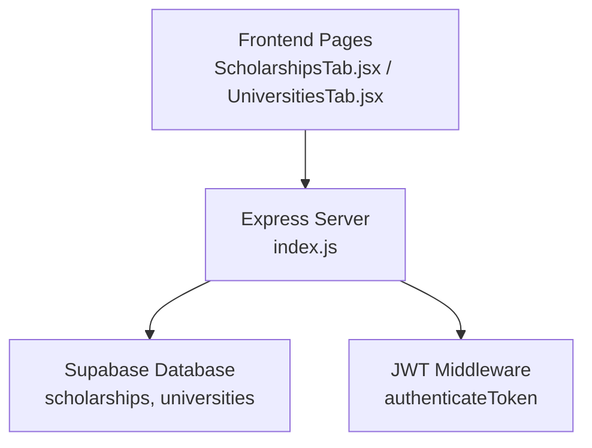
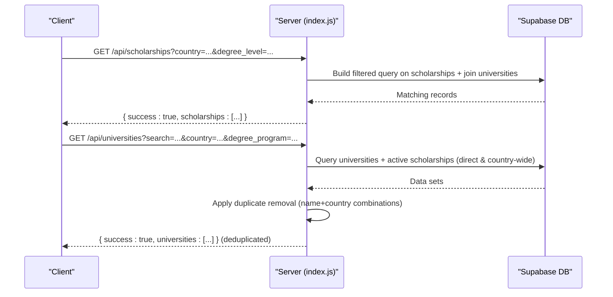
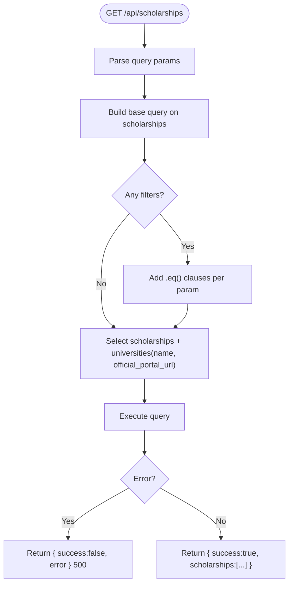
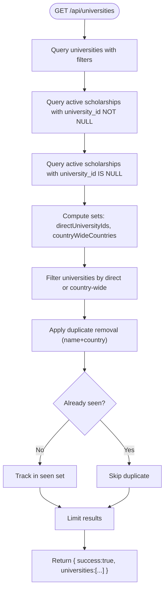
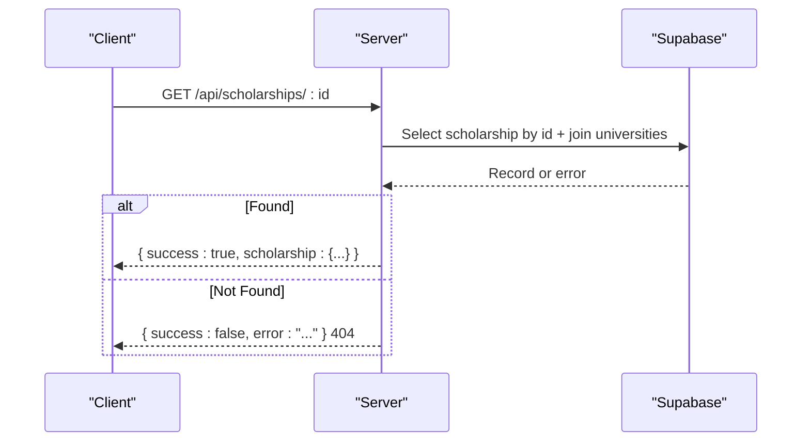
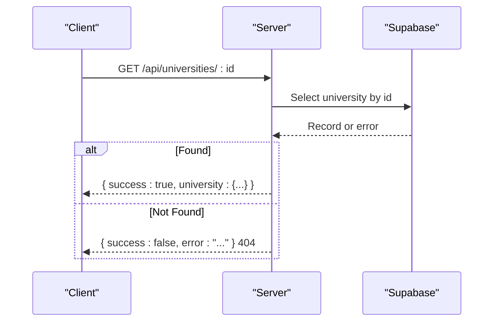
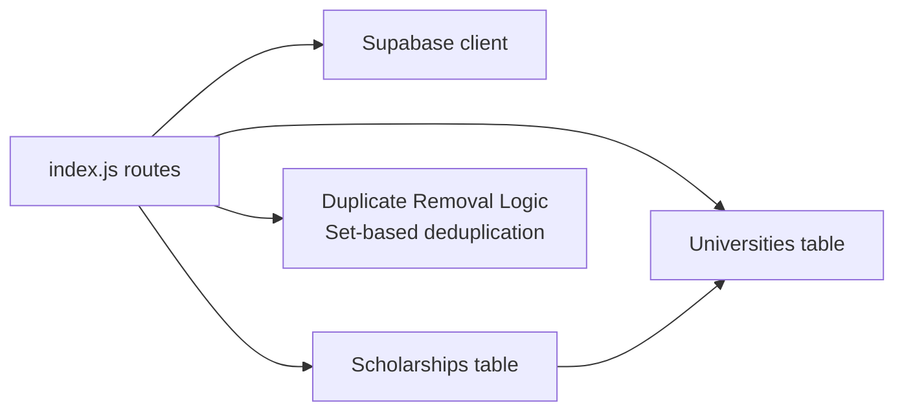

# Discovery Endpoints

<cite>
**Referenced Files in This Document**
- [index.js](file://aischolarpath-backend-main/aischolarpath-backend-main/index.js)
- [mockData.js](file://scholarpath-frontend (2)/scholarpath/src/data/mockData.js)
</cite>

## Update Summary
**Changes Made**
- Updated University Discovery section to document new built-in duplicate removal logic
- Enhanced behavior description to include data integrity improvements
- Added technical details about the deduplication implementation using Sets and composite keys

## Table of Contents
1. [Introduction](#introduction)
2. [Project Structure](#project-structure)
3. [Core Components](#core-components)
4. [Architecture Overview](#architecture-overview)
5. [Detailed Component Analysis](#detailed-component-analysis)
6. [Dependency Analysis](#dependency-analysis)
7. [Performance Considerations](#performance-considerations)
8. [Troubleshooting Guide](#troubleshooting-guide)
9. [Conclusion](#conclusion)

## Introduction
This document provides detailed API documentation for the discovery endpoints that power scholarship and university discovery in ScholarPathAI. It covers:
- Scholarship discovery with filtering by country, scholarship_type, department, and degree_level
- University discovery with search, country filtering, and degree program matching, including built-in duplicate removal for data integrity
- Individual resource retrieval for scholarships and universities by ID
It also includes query parameter specifications, response schemas, pagination considerations, and search optimization techniques based on the backend implementation.

## Project Structure
The backend is implemented as a single Express application that defines all routes in one file. The frontend currently uses static mock data for demonstration but is structured to integrate with these APIs.

**Diagram sources**
- [index.js:392-481](file://aischolarpath-backend-main/aischolarpath-backend-main/index.js#L392-L481)

**Section sources**
- [index.js:1-60](file://aischolarpath-backend-main/aischolarpath-backend-main/index.js#L1-L60)
- [mockData.js:119-133](file://scholarpath-frontend (2)/scholarpath/src/data/mockData.js#L119-L133)

## Core Components
- Scholarship listing endpoint with filters
- University listing endpoint with search, filters, and built-in duplicate removal
- Single resource endpoints for scholarships and universities
- Consistent success/error response envelope across endpoints

Key behaviors:
- Query parameters are optional and combined with AND logic where applicable
- University listing applies built-in duplicate removal to prevent same university from appearing multiple times based on name+country combinations
- Individual resource endpoints return a single record or a 404 if not found

**Section sources**
- [index.js:392-408](file://aischolarpath-backend-main/aischolarpath-backend-main/index.js#L392-L408)
- [index.js:425-481](file://aischolarpath-backend-main/aischolarpath-backend-main/index.js#L425-L481)

## Architecture Overview
The discovery endpoints follow a simple request/response flow:
- Client sends GET requests with optional query parameters
- Server builds database queries using Supabase client
- Results are returned wrapped in a consistent JSON envelope with built-in data integrity checks

**Diagram sources**
- [index.js:392-408](file://aischolarpath-backend-main/aischolarpath-backend-main/index.js#L392-L408)
- [index.js:425-464](file://aischolarpath-backend-main/aischolarpath-backend-main/index.js#L425-L464)

## Detailed Component Analysis

### Scholarship Discovery
- Endpoint: GET /api/scholarships
- Purpose: List scholarships with optional filters
- Query Parameters:
  - country: string — exact match filter
  - scholarship_type: string — exact match filter
  - department: string — exact match filter
  - degree_level: string — exact match filter
- Behavior:
  - Filters are applied only when provided
  - Joins related university fields (name, official_portal_url)
  - Returns all matching results (no server-side pagination)
- Response Schema:
  - success: boolean
  - scholarships: array of scholarship objects including joined university fields
- Error Handling:
  - On database error: returns { success: false, error: message } with 500 status
- Pagination:
  - Not implemented; consider adding offset/limit or cursor-based pagination for large datasets

**Diagram sources**
- [index.js:392-408](file://aischolarpath-backend-main/aischolarpath-backend-main/index.js#L392-L408)

**Section sources**
- [index.js:392-408](file://aischolarpath-backend-main/aischolarpath-backend-main/index.js#L392-L408)

### University Discovery
- Endpoint: GET /api/universities
- Purpose: List universities with search, country filter, and degree program matching; includes universities with direct scholarships or country-wide scholarships; includes built-in duplicate removal
- Query Parameters:
  - search: string — case-insensitive substring match on university name
  - country: string — exact match filter
  - degree_program: string — matches against a list field in university records
- Behavior:
  - Applies filters to universities table
  - Retrieves active scholarships linked directly to universities
  - Retrieves countries covered by country-wide scholarships (university_id is null)
  - Filters universities to those with either direct scholarships or country-wide coverage
  - **Updated**: Applies built-in duplicate removal using name+country combinations to prevent same university from appearing multiple times
  - Uses efficient Set-based deduplication algorithm
- Response Schema:
  - success: boolean
  - universities: array of university objects (deduplicated)
- Error Handling:
  - On any database error: returns { success: false, error: message } with 500 status
- Data Integrity:
  - **New**: Built-in duplicate prevention ensures data integrity by eliminating redundant university entries based on name+country combinations
  - Uses JavaScript Set for O(1) lookup performance during deduplication

**Diagram sources**
- [index.js:425-464](file://aischolarpath-backend-main/aischolarpath-backend-main/index.js#L425-L464)

**Section sources**
- [index.js:425-464](file://aischolarpath-backend-main/aischolarpath-backend-main/index.js#L425-L464)

### Individual Resource Retrieval

#### Get Scholarship by ID
- Endpoint: GET /api/scholarships/:id
- Purpose: Retrieve a single scholarship by its ID, including related university details
- Path Parameter:
  - id: string — unique identifier of the scholarship
- Response Schema:
  - success: boolean
  - scholarship: object — scholarship record with joined university fields
- Error Handling:
  - If not found: returns { success: false, error: message } with 404 status

**Diagram sources**
- [index.js:410-424](file://aischolarpath-backend-main/aischolarpath-backend-main/index.js#L410-L424)

**Section sources**
- [index.js:410-424](file://aischolarpath-backend-main/aischolarpath-backend-main/index.js#L410-L424)

#### Get University by ID
- Endpoint: GET /api/universities/:id
- Purpose: Retrieve a single university by its ID
- Path Parameter:
  - id: string — unique identifier of the university
- Response Schema:
  - success: boolean
  - university: object — university record
- Error Handling:
  - If not found: returns { success: false, error: message } with 404 status

**Diagram sources**
- [index.js:467-481](file://aischolarpath-backend-main/aischolarpath-backend-main/index.js#L467-L481)

**Section sources**
- [index.js:467-481](file://aischolarpath-backend-main/aischolarpath-backend-main/index.js#L467-L481)

## Dependency Analysis
- External dependencies:
  - Express for HTTP routing
  - Supabase client for database access
  - JWT middleware for authenticated endpoints (not used in discovery endpoints)
- Internal relationships:
  - All discovery endpoints reside in a single route file
  - University discovery composes multiple queries to determine eligibility via direct or country-wide scholarships
  - **Updated**: University discovery now includes built-in data integrity checks with duplicate removal

**Diagram sources**
- [index.js:392-481](file://aischolarpath-backend-main/aischolarpath-backend-main/index.js#L392-L481)

**Section sources**
- [index.js:392-481](file://aischolarpath-backend-main/aischolarpath-backend-main/index.js#L392-L481)

## Performance Considerations
- Filtering efficiency:
  - Use exact-match filters for country, scholarship_type, department, and degree_level to leverage indexed columns where possible
  - For university search, prefer specific terms to minimize ilike scans
- Result limiting:
  - University listing already limits to 10 items; consider adding explicit pagination parameters (e.g., page, limit) for both endpoints
- N+1 query risk:
  - University discovery performs multiple queries; ensure indexes exist on frequently filtered fields (e.g., universities.country, scholarships.status, scholarships.university_id)
- Payload size:
  - Avoid selecting unnecessary fields; current implementations select only needed columns
- **Updated**: Duplicate removal performance:
  - Built-in duplicate removal uses JavaScript Set for O(1) lookup performance
  - Composite key generation (name+country) ensures accurate deduplication without additional database overhead
  - Memory usage is minimal due to Set-based approach
- Caching:
  - Consider caching frequent discovery responses at the edge or application layer for read-heavy workloads

[No sources needed since this section provides general guidance]

## Troubleshooting Guide
Common issues and resolutions:
- 404 Not Found on individual resource endpoints:
  - Verify the ID exists in the database
  - Check for typos in path parameters
- 500 Internal Server Error:
  - Indicates a database error; inspect the error message in the response
  - Ensure environment variables for Supabase are correctly set
- Empty results:
  - Confirm query parameters match stored values exactly (case-sensitive for exact matches)
  - For university discovery, ensure there are active scholarships associated with the university or country
- **Updated**: Duplicate-related issues:
  - If universities appear duplicated in responses, check for inconsistent naming or country data in the database
  - The built-in duplicate removal should prevent duplicates based on name+country combinations
  - Verify that the database doesn't contain intentionally different entries for the same university

**Section sources**
- [index.js:410-424](file://aischolarpath-backend-main/aischolarpath-backend-main/index.js#L410-L424)
- [index.js:467-481](file://aischolarpath-backend-main/aischolarpath-backend-main/index.js#L467-L481)

## Conclusion
The discovery endpoints provide robust filtering and search capabilities for scholarships and universities with enhanced data integrity through built-in duplicate removal. They use a consistent response envelope and handle errors predictably. The new duplicate removal logic addresses critical data integrity issues by preventing the same university from appearing multiple times based on name+country combinations. To scale effectively, implement pagination, optimize database indexes, and consider caching strategies for high-traffic scenarios.

[No sources needed since this section summarizes without analyzing specific files]