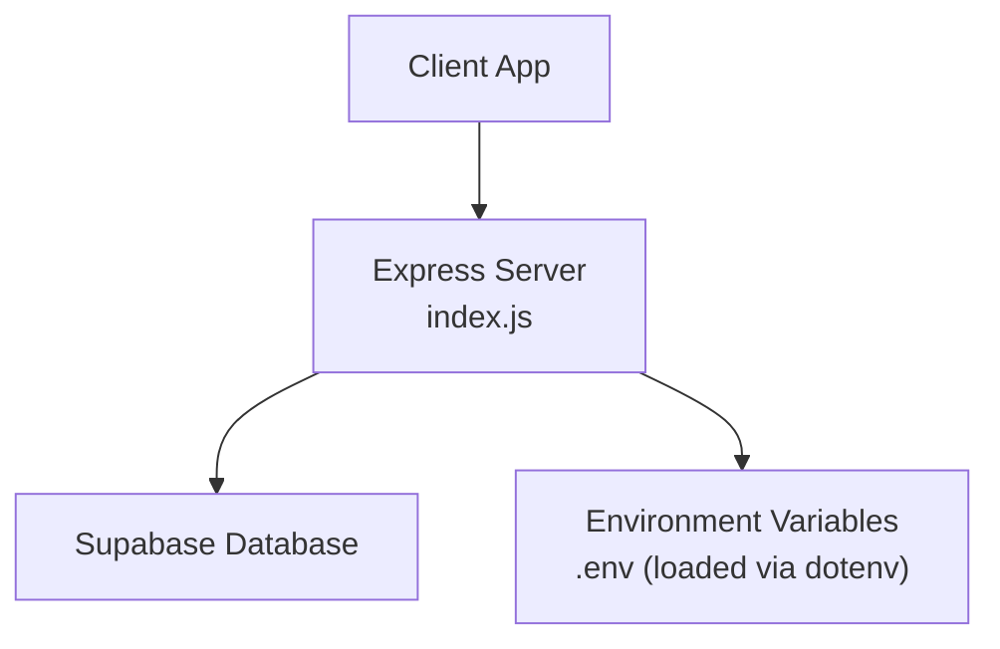
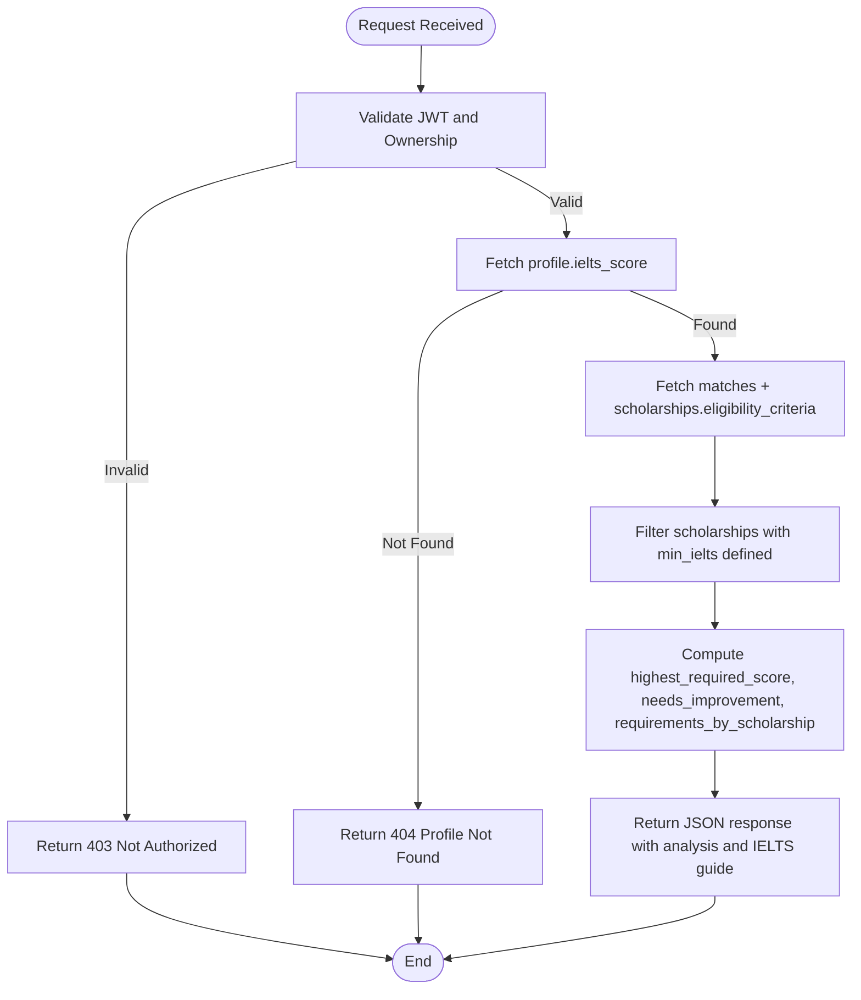
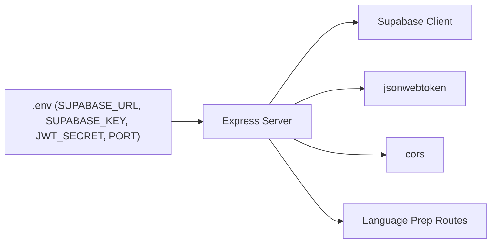

# Language Preparation Endpoints

<cite>
**Referenced Files in This Document**
- [index.js](file://aischolarpath-backend-main/aischolarpath-backend-main/index.js)
- [package.json](file://aischolarpath-backend-main/aischolarpath-backend-main/package.json)
</cite>

## Table of Contents
1. [Introduction](#introduction)
2. [Project Structure](#project-structure)
3. [Core Components](#core-components)
4. [Architecture Overview](#architecture-overview)
5. [Detailed Component Analysis](#detailed-component-analysis)
6. [Dependency Analysis](#dependency-analysis)
7. [Performance Considerations](#performance-considerations)
8. [Troubleshooting Guide](#troubleshooting-guide)
9. [Conclusion](#conclusion)

## Introduction
This document provides detailed API documentation for ScholarPathAI language preparation endpoints. It covers:
- Static guide retrieval for IELTS, TOEFL, and PTE test preparation materials
- Personalized language prep analysis for a user profile, including score gap analysis, requirement comparison, and improvement recommendations
- Test type specifications, study plan structures, free resource listings, and personalized scoring algorithms
- Response formats with guidance sections, score ranges, and typical requirements for each test type

## Project Structure
The backend is an Express application that exposes REST endpoints. The language preparation features are implemented within the main server file and rely on environment-driven configuration and a Supabase client for data access.



**Diagram sources**
- [index.js:1-59](file://aischolarpath-backend-main/aischolarpath-backend-main/index.js#L1-L59)

**Section sources**
- [index.js:1-59](file://aischolarpath-backend-main/aischolarpath-backend-main/index.js#L1-L59)
- [package.json:1-14](file://aischolarpath-backend-main/aischolarpath-backend-main/package.json#L1-L14)

## Core Components
- Static language preparation guides for IELTS, TOEFL, and PTE
- GET /api/language-prep/:testType to retrieve static guides
- GET /api/language-prep/profile/:profileId to compute personalized analysis based on current score and scholarship requirements
- Authentication middleware for protected routes
- Data integration with Supabase for profiles and matches

Key implementation highlights:
- Static guides include full names, sections, score ranges, typical requirements, free resources, and study plans
- Personalized analysis compares the user’s current IELTS score against required scores from matched scholarships and returns gaps and needs-improvement flags
- Protected endpoint enforces ownership checks using JWT authentication

**Section sources**
- [index.js:289-353](file://aischolarpath-backend-main/aischolarpath-backend-main/index.js#L289-L353)
- [index.js:355-402](file://aischolarpath-backend-main/aischolarpath-backend-main/index.js#L355-L402)
- [index.js:31-47](file://aischolarpath-backend-main/aischolarpath-backend-main/index.js#L31-L47)

## Architecture Overview
The language preparation feature combines static reference data with dynamic, profile-based analysis.

```mermaid
sequenceDiagram
participant C as "Client"
participant S as "Express Server"
participant M as "Auth Middleware"
participant D as "Supabase"
Note over C,S : Static Guide Retrieval
C->>S : GET /api/language-prep/ : testType
S-->>C : { success, test_type, guide }
Note over C,S,M,D : Personalized Profile Analysis
C->>S : GET /api/language-prep/profile/ : profileId
S->>M : authenticateToken(req,res,next)
M-->>S : decoded userId
S->>D : SELECT ielts_score FROM profiles WHERE id = : profileId
D-->>S : profile.ielts_score
S->>D : SELECT matches + scholarships(eligibility_criteria) WHERE profile_id = : profileId
D-->>S : matches[]
S->>S : Compute highest_required_score, needs_improvement, requirements_by_scholarship
S-->>C : { success, current_ielts_score, highest_required_score, needs_improvement, requirements_by_scholarship, guide }
```

**Diagram sources**
- [index.js:344-353](file://aischolarpath-backend-main/aischolarpath-backend-main/index.js#L344-L353)
- [index.js:355-402](file://aischolarpath-backend-main/aischolarpath-backend-main/index.js#L355-L402)
- [index.js:31-47](file://aischolarpath-backend-main/aischolarpath-backend-main/index.js#L31-L47)

## Detailed Component Analysis

### Endpoint: GET /api/language-prep/:testType
Retrieves static preparation materials for a supported test type.

- Method: GET
- Path: /api/language-prep/:testType
- Path Parameters:
  - testType: One of "IELTS", "TOEFL", "PTE" (case-insensitive; normalized to uppercase)
- Authentication: Not required
- Success Response:
  - success: boolean
  - test_type: string ("IELTS", "TOEFL", or "PTE")
  - guide: object containing:
    - full_name: string
    - sections: array of strings
    - score_range: string
    - typical_requirement: string
    - free_resources: array of strings
    - study_plan: array of strings
- Error Responses:
  - 404: Unknown test type. Use IELTS, TOEFL, or PTE.

Notes:
- Supported test types are strictly validated; unsupported values return a 404 error.
- The guide includes structured sections, score ranges, and typical requirements per test type.

**Section sources**
- [index.js:289-353](file://aischolarpath-backend-main/aischolarpath-backend-main/index.js#L289-L353)

### Endpoint: GET /api/language-prep/profile/:profileId
Returns personalized language preparation analysis for a specific profile, comparing the current score to scholarship requirements and providing improvement insights.

- Method: GET
- Path: /api/language-prep/profile/:profileId
- Path Parameters:
  - profileId: string (must match the authenticated user’s ID)
- Authentication: Required (JWT). The route validates that profileId equals the authenticated user’s ID.
- Success Response:
  - success: boolean
  - current_ielts_score: number or null
  - highest_required_score: number or null
  - needs_improvement: boolean or null
  - requirements_by_scholarship: array of objects:
    - scholarship: string
    - required: number
    - gap: number or null (computed as required - current_ielts_score)
  - guide: object (IELTS guide included by default)
- Error Responses:
  - 403: Not authorized (profileId does not match authenticated user)
  - 404: Profile not found
  - 500: Database or server error

Algorithm details:
- Retrieves the user’s current IELTS score from the profiles table
- Fetches all matches for the profile along with associated scholarships’ eligibility criteria
- Filters scholarships that specify a minimum IELTS requirement
- Computes:
  - highest_required_score: maximum of required IELTS scores across filtered scholarships
  - needs_improvement: true if current_ielts_score is present and less than highest_required_score
  - requirements_by_scholarship: list of each scholarship’s required score and the gap relative to the current score
- Returns the IELTS guide alongside the analysis



**Diagram sources**
- [index.js:355-402](file://aischolarpath-backend-main/aischolarpath-backend-main/index.js#L355-L402)
- [index.js:31-47](file://aischolarpath-backend-main/aischolarpath-backend-main/index.js#L31-L47)

**Section sources**
- [index.js:355-402](file://aischolarpath-backend-main/aischolarpath-backend-main/index.js#L355-L402)

### Test Type Specifications and Study Plans
- IELTS
  - Sections: Listening, Reading, Writing, Speaking
  - Score Range: 0–9 bands
  - Typical Requirement: 6.0–7.5 depending on program
  - Free Resources: British Council IELTS free practice materials; IELTS Liz lessons; Cambridge IELTS past papers
  - Study Plan: Diagnostic test and weak section identification; focused practice; timed mock tests; final review
- TOEFL
  - Sections: Reading, Listening, Speaking, Writing
  - Score Range: 0–120 points
  - Typical Requirement: 80–100 depending on program
  - Free Resources: ETS official free practice test; TOEFL Go app; Notefull YouTube lessons
  - Study Plan: Same phased approach as IELTS
- PTE
  - Sections: Speaking & Writing, Reading, Listening
  - Score Range: 10–90 points
  - Typical Requirement: 58–76 depending on program
  - Free Resources: Pearson official free practice questions; PTE Tutorials; APEUni free question bank
  - Study Plan: Same phased approach as IELTS

These specifications are returned as part of the guide object when requesting a specific test type.

**Section sources**
- [index.js:289-342](file://aischolarpath-backend-main/aischolarpath-backend-main/index.js#L289-L342)

### Personalized Scoring Algorithm
- Inputs:
  - current_ielts_score from the user’s profile
  - scholarship requirements (min_ielts) from matched scholarships
- Processing:
  - Filter scholarships with defined min_ielts
  - Determine highest_required_score across those scholarships
  - Calculate needs_improvement flag based on comparison between current_ielts_score and highest_required_score
  - For each scholarship, compute gap = required - current_ielts_score
- Outputs:
  - Highest required score
  - Boolean indicating whether improvement is needed
  - Array detailing each scholarship’s requirement and gap

This algorithm ensures users receive actionable insights tailored to their matched opportunities.

**Section sources**
- [index.js:372-402](file://aischolarpath-backend-main/aischolarpath-backend-main/index.js#L372-L402)

## Dependency Analysis
- Environment variables:
  - SUPABASE_URL, SUPABASE_KEY: Used to initialize the Supabase client
  - JWT_SECRET: Used to sign and verify tokens for authentication
  - PORT: Optional server port override
- Dependencies:
  - express: HTTP server framework
  - cors: Cross-origin request handling
  - dotenv: Environment variable loading
  - jsonwebtoken: Token signing and verification
  - @supabase/supabase-js: Database client for profiles and matches
- Route-level dependencies:
  - Static guides are in-memory constants
  - Personalized analysis depends on Supabase tables: profiles, matches, scholarships



**Diagram sources**
- [index.js:1-59](file://aischolarpath-backend-main/aischolarpath-backend-main/index.js#L1-L59)
- [package.json:1-14](file://aischolarpath-backend-main/aischolarpath-backend-main/package.json#L1-L14)

**Section sources**
- [index.js:1-59](file://aischolarpath-backend-main/aischolarpath-backend-main/index.js#L1-L59)
- [package.json:1-14](file://aischolarpath-backend-main/aischolarpath-backend-main/package.json#L1-L14)

## Performance Considerations
- Static guide retrieval is O(1) and memory-backed; negligible latency.
- Personalized analysis performs two database queries (profiles and matches), then computes aggregates in memory; complexity scales with the number of matches.
- Ensure proper indexing on profiles.id and matches.profile_id for efficient lookups.
- Consider caching frequently accessed guides or computed results if traffic increases.

[No sources needed since this section provides general guidance]

## Troubleshooting Guide
Common issues and resolutions:
- 404 Unknown test type:
  - Ensure testType is one of "IELTS", "TOEFL", or "PTE" (case-insensitive)
- 403 Not authorized:
  - Verify JWT is valid and attached in Authorization header
  - Confirm profileId matches the authenticated user’s ID
- 404 Profile not found:
  - Check that the profile exists in the database and the ID is correct
- 500 Database errors:
  - Validate Supabase credentials and network connectivity
  - Inspect error messages returned by Supabase

Authentication flow:
- Requests to /api/language-prep/profile/:profileId must include a valid JWT token
- The middleware verifies the token and attaches the decoded user ID to req.userId
- The route enforces ownership by comparing profileId with req.userId

**Section sources**
- [index.js:31-47](file://aischolarpath-backend-main/aischolarpath-backend-main/index.js#L31-L47)
- [index.js:344-353](file://aischolarpath-backend-main/aischolarpath-backend-main/index.js#L344-L353)
- [index.js:355-402](file://aischolarpath-backend-main/aischolarpath-backend-main/index.js#L355-L402)

## Conclusion
ScholarPathAI’s language preparation endpoints provide both static guidance and personalized analysis to help users prepare effectively for IELTS, TOEFL, and PTE exams. The static guide endpoint delivers comprehensive information about test structure, scoring, and recommended resources. The personalized profile endpoint integrates user-specific data with scholarship requirements to highlight gaps and suggest improvements. Together, these endpoints enable targeted, data-driven preparation strategies aligned with individual goals and target programs.

[No sources needed since this section summarizes without analyzing specific files]