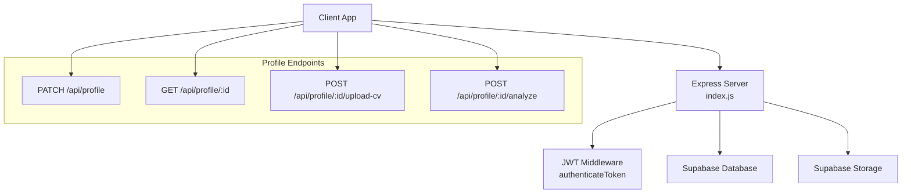
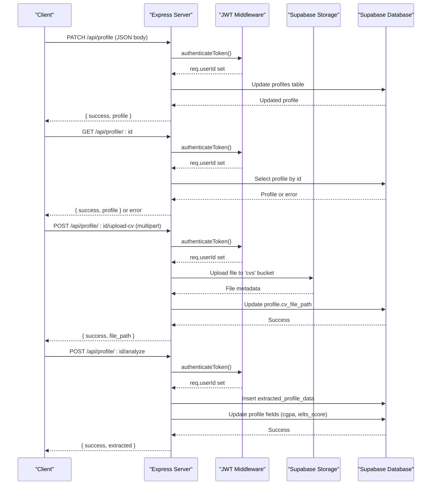
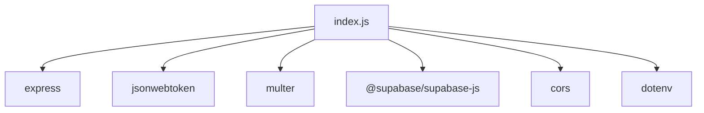

# Profile Management Endpoints

<cite>
**Referenced Files in This Document**
- [index.js](file://aischolarpath-backend-main/aischolarpath-backend-main/index.js)
- [package.json](file://aischolarpath-backend-main/aischolarpath-backend-main/package.json)
- [ProfileTab.jsx](file://scholarpath-frontend (2)/scholarpath/src/pages/ProfileTab.jsx)
</cite>

## Table of Contents
1. [Introduction](#introduction)
2. [Project Structure](#project-structure)
3. [Core Components](#core-components)
4. [Architecture Overview](#architecture-overview)
5. [Detailed Component Analysis](#detailed-component-analysis)
6. [Dependency Analysis](#dependency-analysis)
7. [Performance Considerations](#performance-considerations)
8. [Troubleshooting Guide](#troubleshooting-guide)
9. [Conclusion](#conclusion)

## Introduction
This document provides detailed API documentation for ScholarPathAI profile management endpoints, focusing on:
- Updating a user’s profile with field validation for cgpa, ielts_score, target_country, target_degree, and target_department
- Retrieving a profile by id with authorization checks
- Uploading a CV to Supabase storage with file handling
- Analyzing a CV using AI extraction capabilities (currently a placeholder)

It also covers authentication requirements, request/response schemas, error handling, and best practices for file uploads.

## Project Structure
The backend is an Express application that exposes RESTful endpoints for profile management, authentication, scholarships, universities, and more. It integrates with Supabase for data persistence and storage, uses JWT for authentication, and Multer for file uploads. The frontend includes a Profile tab UI that demonstrates how users interact with profile fields and documents.

**Diagram sources**
- [index.js:32-47](file://aischolarpath-backend-main/aischolarpath-backend-main/index.js#L32-L47)
- [index.js:70-110](file://aischolarpath-backend-main/aischolarpath-backend-main/index.js#L70-L110)
- [index.js:112-145](file://aischolarpath-backend-main/aischolarpath-backend-main/index.js#L112-L145)
- [index.js:147-188](file://aischolarpath-backend-main/aischolarpath-backend-main/index.js#L147-L188)

**Section sources**
- [index.js:1-59](file://aischolarpath-backend-main/aischolarpath-backend-main/index.js#L1-L59)
- [package.json:1-14](file://aischolarpath-backend-main/aischolarpath-backend-main/package.json#L1-L14)

## Core Components
- Authentication middleware: Validates JWT tokens and attaches the user id to requests.
- Profile update endpoint: Accepts partial updates for specific fields and persists them to Supabase.
- Profile retrieval endpoint: Returns a profile if the requester owns it.
- CV upload endpoint: Handles multipart file uploads, stores files in Supabase storage, and records the file path in the profile.
- CV analysis endpoint: Placeholder for AI extraction; currently inserts mock extracted data and updates profile fields.

**Section sources**
- [index.js:32-47](file://aischolarpath-backend-main/aischolarpath-backend-main/index.js#L32-L47)
- [index.js:70-110](file://aischolarpath-backend-main/aischolarpath-backend-main/index.js#L70-L110)
- [index.js:112-145](file://aischolarpath-backend-main/aischolarpath-backend-main/index.js#L112-L145)
- [index.js:147-188](file://aischolarpath-backend-main/aischolarpath-backend-main/index.js#L147-L188)

## Architecture Overview
The profile management flow involves authenticated requests to the Express server, which validates tokens, performs business logic, and interacts with Supabase for both database operations and file storage.

**Diagram sources**
- [index.js:32-47](file://aischolarpath-backend-main/aischolarpath-backend-main/index.js#L32-L47)
- [index.js:70-110](file://aischolarpath-backend-main/aischolarpath-backend-main/index.js#L70-L110)
- [index.js:112-145](file://aischolarpath-backend-main/aischolarpath-backend-main/index.js#L112-L145)
- [index.js:147-188](file://aischolarpath-backend-main/aischolarpath-backend-main/index.js#L147-L188)

## Detailed Component Analysis

### Authentication Requirements
- All profile endpoints require a valid JWT token in the Authorization header.
- The middleware extracts the token, verifies it against the secret, and sets req.userId.
- If no token is provided, a 401 response is returned.
- If the token is invalid or expired, a 403 response is returned.

**Section sources**
- [index.js:32-47](file://aischolarpath-backend-main/aischolarpath-backend-main/index.js#L32-L47)

### Profile Update Endpoint
- Method: PATCH
- Path: /api/profile
- Authorization: Required (JWT)
- Request Body Fields:
  - full_name (optional)
  - cgpa (optional)
  - ielts_score (optional)
  - target_country (optional)
  - target_degree (optional)
  - target_department (optional)
- Behavior:
  - Builds an updates object only for provided fields.
  - Updates the profile row where id equals the authenticated user id.
  - Returns the updated profile.
- Validation Notes:
  - No explicit type or range validation is performed on the server side for these fields.
  - Clients should validate cgpa as a numeric value within expected ranges and ensure ielts_score is a valid score format before sending.
- Response:
  - On success: { success: true, profile: <updated profile object> }
  - On error: { success: false, error: <error message> }

**Section sources**
- [index.js:70-91](file://aischolarpath-backend-main/aischolarpath-backend-main/index.js#L70-L91)

### Profile Retrieval Endpoint
- Method: GET
- Path: /api/profile/:id
- Authorization: Required (JWT)
- Authorization Check:
  - The requested id must match the authenticated user id; otherwise returns 403.
- Behavior:
  - Retrieves the profile by id from the database.
- Response:
  - On success: { success: true, profile: <profile object> }
  - On not found: { success: false, error: <error message> }

**Section sources**
- [index.js:94-110](file://aischolarpath-backend-main/aischolarpath-backend-main/index.js#L94-L110)

### CV Upload Endpoint
- Method: POST
- Path: /api/profile/:id/upload-cv
- Authorization: Required (JWT)
- Authorization Check:
  - The requested id must match the authenticated user id; otherwise returns 403.
- File Handling:
  - Uses Multer with memory storage to handle multipart form data.
  - Expects a single file field named 'cv'.
  - Stores the file in Supabase storage under the 'cvs' bucket at a path like {id}/{timestamp}_{originalname}.
- Behavior:
  - Uploads the file buffer with its MIME type.
  - Updates the profile record to store cv_file_path.
- Response:
  - On success: { success: true, file_path: <storage path> }
  - On missing file: { success: false, error: 'No file uploaded' }
  - On storage or DB errors: { success: false, error: <error message> }
- Progress Tracking:
  - The current implementation does not include streaming or progress callbacks.
  - For large files, consider implementing chunked uploads and server-side progress tracking via events or a separate status endpoint.

**Section sources**
- [index.js:112-145](file://aischolarpath-backend-main/aischolarpath-backend-main/index.js#L112-L145)

### CV Analysis Endpoint
- Method: POST
- Path: /api/profile/:id/analyze
- Authorization: Required (JWT)
- Authorization Check:
  - The requested id must match the authenticated user id; otherwise returns 403.
- Behavior:
  - Currently a placeholder that inserts mock extracted data into extracted_profile_data and updates profile fields (cgpa, ielts_score).
  - Replace with real AI extraction calls when available.
- Response:
  - On success: { success: true, extracted: <mock extracted data object> }
  - On DB errors: { success: false, error: <error message> }

**Section sources**
- [index.js:147-188](file://aischolarpath-backend-main/aischolarpath-backend-main/index.js#L147-L188)

### Frontend Integration Notes
- The Profile tab UI demonstrates fields for personal information and education details, including CGPA and IELTS score inputs.
- It shows document upload controls and an “Analyze” button for CV processing.
- While the current frontend uses mock data for analysis, the backend endpoints are ready for integration once the client sends proper requests.

**Section sources**
- [ProfileTab.jsx:1-232](file://scholarpath-frontend (2)/scholarpath/src/pages/ProfileTab.jsx#L1-L232)

## Dependency Analysis
Key dependencies used by the profile management endpoints:
- Express: HTTP server and routing
- JSON Web Tokens: Authentication middleware
- Multer: File upload handling
- Supabase JS Client: Database and storage interactions
- CORS: Cross-origin requests
- Dotenv: Environment variable loading

**Diagram sources**
- [package.json:1-14](file://aischolarpath-backend-main/aischolarpath-backend-main/package.json#L1-L14)
- [index.js:1-28](file://aischolarpath-backend-main/aischolarpath-backend-main/index.js#L1-L28)

**Section sources**
- [package.json:1-14](file://aischolarpath-backend-main/aischolarpath-backend-main/package.json#L1-L14)
- [index.js:1-28](file://aischolarpath-backend-main/aischolarpath-backend-main/index.js#L1-L28)

## Performance Considerations
- File Uploads:
  - Using memory storage can be inefficient for large files. Consider disk storage or streaming to reduce memory usage.
  - Implement size limits and type validation to prevent abuse.
- Database Queries:
  - Ensure indexes exist on frequently queried columns (e.g., profiles.id).
  - Batch updates where possible to minimize round trips.
- Authentication:
  - Token verification adds overhead; cache validated tokens on the client side to reduce repeated network calls.
- Error Handling:
  - Centralized error handler catches unhandled exceptions and returns consistent error responses.

[No sources needed since this section provides general guidance]

## Troubleshooting Guide
Common issues and resolutions:
- Missing JWT Token:
  - Ensure the Authorization header contains a valid Bearer token.
  - Verify the token is not expired and signed with the correct secret.
- Unauthorized Access:
  - Confirm that the requested profile id matches the authenticated user id.
- File Upload Failures:
  - Check that the file field name is 'cv' and the content type is supported.
  - Validate Supabase storage configuration and permissions.
- Database Errors:
  - Inspect error messages returned by Supabase for schema mismatches or constraint violations.
- Unhandled Exceptions:
  - Review server logs for stack traces and use the centralized error handler to standardize responses.

**Section sources**
- [index.js:32-47](file://aischolarpath-backend-main/aischolarpath-backend-main/index.js#L32-L47)
- [index.js:1528-1531](file://aischolarpath-backend-main/aischolarpath-backend-main/index.js#L1528-L1531)

## Conclusion
The ScholarPathAI profile management endpoints provide secure, authenticated access to update and retrieve user profiles, upload CVs to Supabase storage, and analyze CVs using AI extraction (placeholder). Proper authentication, clear request/response schemas, and robust error handling ensure reliable operation. Future enhancements include adding server-side validation, streaming uploads with progress tracking, and integrating real AI extraction services.