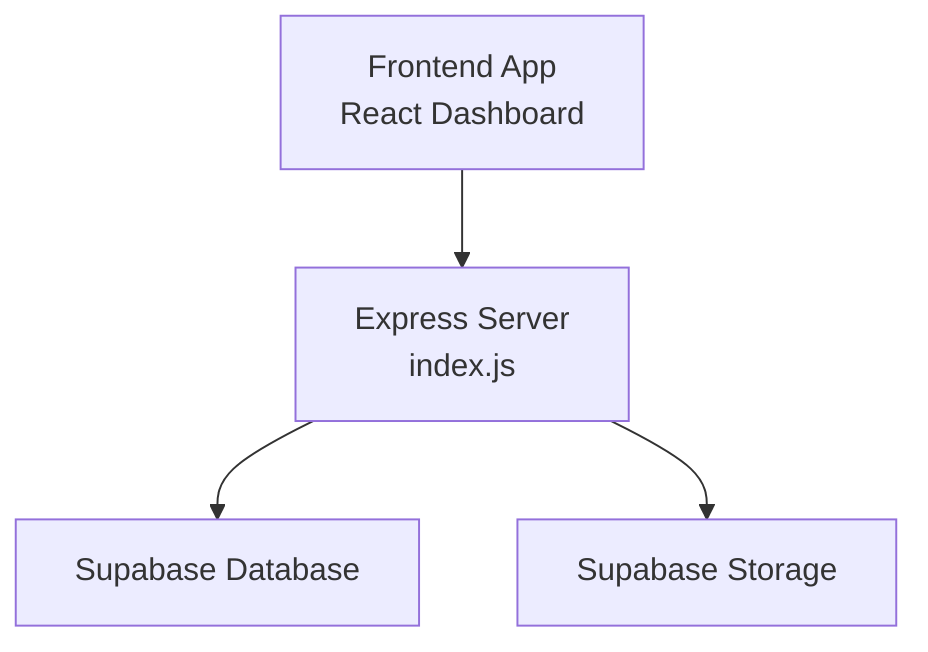
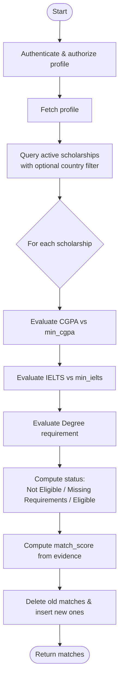
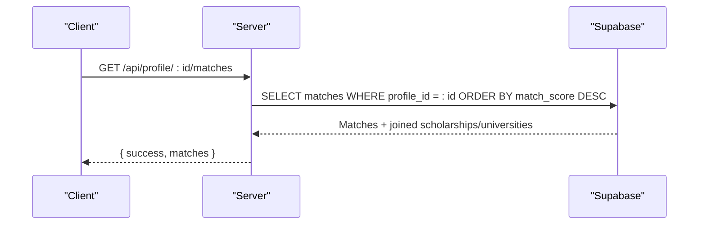
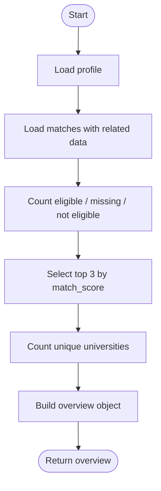
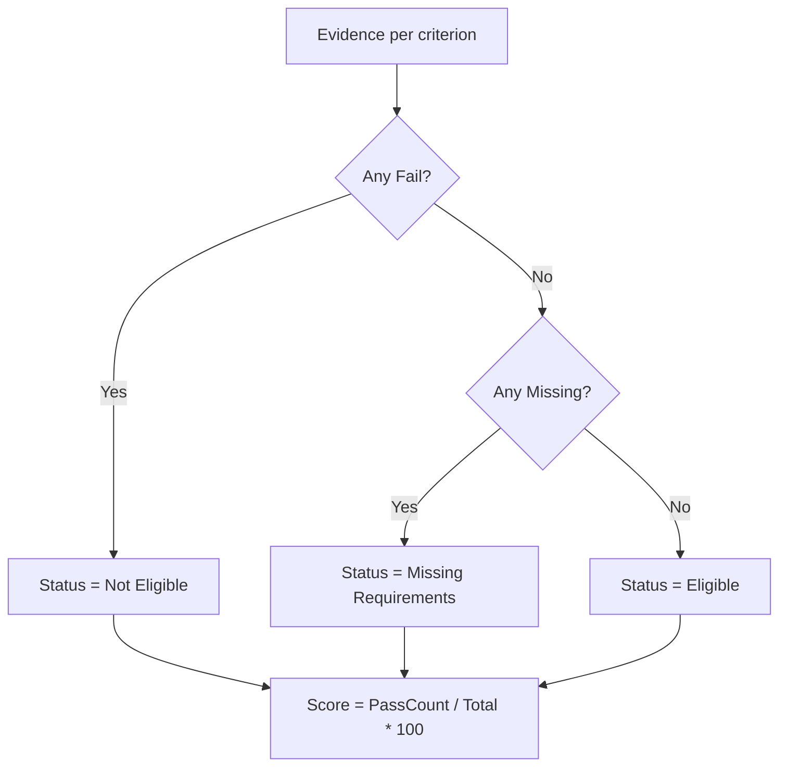
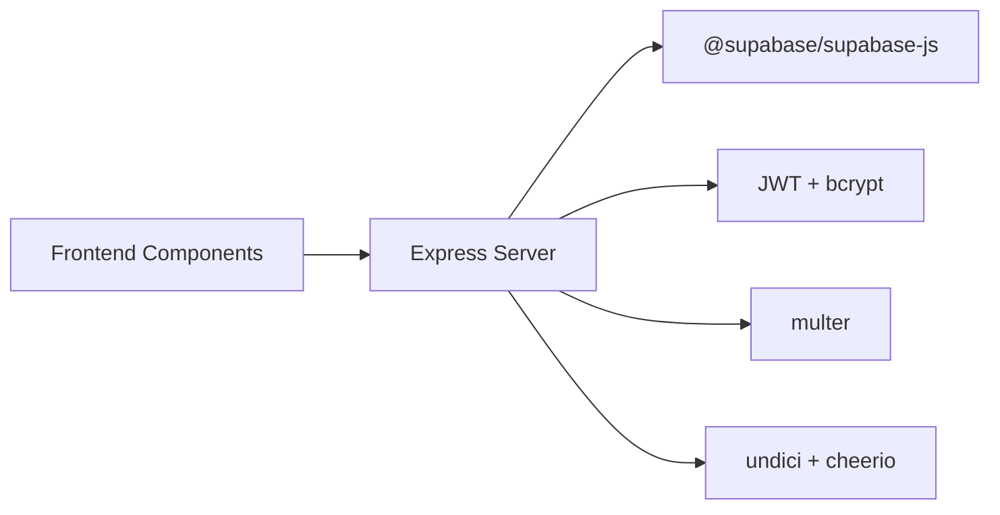

# Scholarship Matching Endpoints

<cite>
**Referenced Files in This Document**
- [index.js](file://aischolarpath-backend-main/aischolarpath-backend-main/index.js)
- [package.json](file://aischolarpath-backend-main/aischolarpath-backend-main/package.json)
- [Dashboard.jsx](file://scholarpath-frontend (2)/scholarpath/src/pages/Dashboard.jsx)
- [ScholarshipsTab.jsx](file://scholarpath-frontend (2)/scholarpath/src/pages/ScholarshipsTab.jsx)
</cite>

## Table of Contents
1. [Introduction](#introduction)
2. [Project Structure](#project-structure)
3. [Core Components](#core-components)
4. [Architecture Overview](#architecture-overview)
5. [Detailed Component Analysis](#detailed-component-analysis)
6. [Dependency Analysis](#dependency-analysis)
7. [Performance Considerations](#performance-considerations)
8. [Troubleshooting Guide](#troubleshooting-guide)
9. [Conclusion](#conclusion)

## Introduction
This document provides comprehensive API documentation for the ScholarPathAI scholarship matching system, focusing on three core endpoints:
- POST /api/profile/:id/match-scholarships: Runs eligibility evaluation and match scoring against scholarships.
- GET /api/profile/:id/matches: Retrieves stored matches with sorting by match score.
- GET /api/profile/:id/overview: Returns dashboard overview including summary statistics, eligibility counts, and top recommendations.

It also explains the matching algorithm, evidence reporting, and performance optimization strategies used by the backend.

## Project Structure
The backend is an Express application that exposes REST endpoints and integrates with Supabase for data persistence. The frontend includes a dashboard and scholarships tab that conceptually display matched opportunities and summaries.



**Diagram sources**
- [index.js:1-59](file://aischolarpath-backend-main/aischolarpath-backend-main/index.js#L1-L59)

**Section sources**
- [index.js:1-59](file://aischolarpath-backend-main/aischolarpath-backend-main/index.js#L1-L59)
- [package.json:1-14](file://aischolarpath-backend-main/aischolarpath-backend-main/package.json#L1-L14)

## Core Components
- Authentication middleware: JWT-based token verification protects profile-scoped endpoints.
- Data layer: Supabase client queries profiles, scholarships, universities, and matches.
- Matching engine: Evaluates eligibility criteria per scholarship and computes match scores.
- Evidence reporter: Records pass/fail/missing details for each criterion to explain results.
- Dashboard summarizer: Aggregates match statuses and top recommendations.

Key responsibilities are implemented within the single server file and referenced throughout this document.

**Section sources**
- [index.js:32-47](file://aischolarpath-backend-main/aischolarpath-backend-main/index.js#L32-L47)
- [index.js:50-54](file://aischolarpath-backend-main/aischolarpath-backend-main/index.js#L50-L54)
- [index.js:575-673](file://aischolarpath-backend-main/aischolarpath-backend-main/index.js#L575-L673)
- [index.js:676-692](file://aischolarpath-backend-main/aischolarpath-backend-main/index.js#L676-L692)
- [index.js:694-749](file://aischolarpath-backend-main/aischolarpath-backend-main/index.js#L694-L749)

## Architecture Overview
The matching workflow involves retrieving the user’s profile, querying active scholarships (optionally filtered by target country), evaluating eligibility criteria, computing match scores, persisting results, and returning them. The overview endpoint aggregates these results into summary metrics and top recommendations.

```mermaid
sequenceDiagram
participant C as "Client"
participant S as "Server (index.js)"
participant D as "Supabase"
C->>S : POST /api/profile/ : id/match-scholarships
S->>D : SELECT profile by id
D-->>S : Profile data
S->>D : SELECT active scholarships (optional country filter)
D-->>S : Scholarships list
S->>S : Evaluate CGPA, IELTS, Degree; compute status & score
S->>D : DELETE old matches for profile
S->>D : INSERT new matches with evidence
D-->>S : Inserted matches
S-->>C : { success, matches }
C->>S : GET /api/profile/ : id/matches
S->>D : SELECT matches ordered by match_score desc
D-->>S : Matches with scholarship/university details
S-->>C : { success, matches }
C->>S : GET /api/profile/ : id/overview
S->>D : SELECT profile
S->>D : SELECT matches with related data
S->>S : Compute eligible/missing/not eligible counts and top 3
S-->>C : { success, overview }
```

**Diagram sources**
- [index.js:575-673](file://aischolarpath-backend-main/aischolarpath-backend-main/index.js#L575-L673)
- [index.js:676-692](file://aischolarpath-backend-main/aischolarpath-backend-main/index.js#L676-L692)
- [index.js:694-749](file://aischolarpath-backend-main/aischolarpath-backend-main/index.js#L694-L749)

## Detailed Component Analysis

### Endpoint: POST /api/profile/:id/match-scholarships
- Purpose: Run eligibility checks for all active scholarships against the authenticated user’s profile and store match results.
- Authentication: Requires valid JWT; ensures profile ownership via route parameter.
- Eligibility criteria evaluated:
  - CGPA: Compares profile.cgpa with scholarship.eligibility_criteria.min_cgpa.
  - IELTS: Compares profile.ielts_score with scholarship.eligibility_criteria.min_ielts.
  - Degree: Checks equality between profile.target_degree and scholarship.eligibility_criteria.required_degree.
- Status determination:
  - Not Eligible if any criterion fails.
  - Missing Requirements if any required field is missing.
  - Eligible otherwise.
- Match scoring methodology:
  - For each scholarship, evidence entries are created per criterion.
  - match_score = (number of Pass entries / total evidence entries) * 100.
  - If no evidence exists, match_score defaults to 100.
- Persistence:
  - Deletes existing matches for the profile to ensure fresh computation.
  - Inserts computed matches with fields: profile_id, scholarship_id, university_id, match_score, status, evidence.
- Response:
  - Returns success flag and array of matches with detailed evidence.



**Diagram sources**
- [index.js:575-673](file://aischolarpath-backend-main/aischolarpath-backend-main/index.js#L575-L673)

**Section sources**
- [index.js:575-673](file://aischolarpath-backend-main/aischolarpath-backend-main/index.js#L575-L673)

### Endpoint: GET /api/profile/:id/matches
- Purpose: Retrieve stored matches for the authenticated user’s profile.
- Filtering and sorting:
  - Filters by profile_id (ownership enforced).
  - Sorts by match_score descending to prioritize best matches.
- Enrichment:
  - Joins with scholarships (title, country, deadline, apply_url) and universities (name).
- Response:
  - Returns success flag and array of matches with enriched data.



**Diagram sources**
- [index.js:676-692](file://aischolarpath-backend-main/aischolarpath-backend-main/index.js#L676-L692)

**Section sources**
- [index.js:676-692](file://aischolarpath-backend-main/aischolarpath-backend-main/index.js#L676-L692)

### Endpoint: GET /api/profile/:id/overview
- Purpose: Provide dashboard overview with summary statistics and top recommendations.
- Data aggregation:
  - Loads profile and all matches for the profile.
  - Counts eligible, missing requirements, and not eligible matches.
  - Computes unique universities covered.
  - Selects top 3 recommendations sorted by match_score descending.
- Response structure:
  - profile_completeness flags (e.g., has cgpa, ielts, cv, target degree).
  - summary totals (total checked, eligible, missing, not eligible, universities covered).
  - top_recommendations array with match details.



**Diagram sources**
- [index.js:694-749](file://aischolarpath-backend-main/aischolarpath-backend-main/index.js#L694-L749)

**Section sources**
- [index.js:694-749](file://aischolarpath-backend-main/aischolarpath-backend-main/index.js#L694-L749)

### Matching Algorithm Details
- Criteria evaluation:
  - CGPA: If min_cgpa is defined, compare with profile.cgpa; record Pass/Fail/Missing.
  - IELTS: If min_ielts is defined, compare with profile.ielts_score; record Pass/Fail/Missing.
  - Degree: If required_degree is defined, compare with profile.target_degree; record Pass/Fail/Missing.
- Status logic:
  - Any Fail => Not Eligible.
  - Any Missing (and no Fail) => Missing Requirements.
  - All Pass => Eligible.
- Scoring:
  - match_score = (Pass count / total evidence count) * 100.
  - If no evidence, default to 100.



**Diagram sources**
- [index.js:606-658](file://aischolarpath-backend-main/aischolarpath-backend-main/index.js#L606-L658)

**Section sources**
- [index.js:606-658](file://aischolarpath-backend-main/aischolarpath-backend-main/index.js#L606-L658)

### Evidence Reporting System
- Each match includes an evidence array detailing:
  - criterion: One of CGPA, IELTS, Degree.
  - required: Minimum threshold or expected value.
  - actual: User’s value or null if missing.
  - result: Pass, Fail, or Missing.
- This enables transparent explanations for why a scholarship is eligible, missing requirements, or not eligible.

**Section sources**
- [index.js:606-658](file://aischolarpath-backend-main/aischolarpath-backend-main/index.js#L606-L658)

### Performance Optimization Strategies
- Connection pooling: Uses undici Agent with connection limits and timeouts to manage HTTP concurrency efficiently.
- Query filtering: Optional country filter reduces dataset size during matching.
- Batch operations: Deletes old matches then inserts new ones in a single transactional flow to avoid stale data.
- Sorting at database level: Orders matches by match_score to minimize client-side processing.
- Scoped access: Middleware enforces authorization early to prevent unnecessary DB calls.

**Section sources**
- [index.js:18-25](file://aischolarpath-backend-main/aischolarpath-backend-main/index.js#L18-L25)
- [index.js:591-604](file://aischolarpath-backend-main/aischolarpath-backend-main/index.js#L591-L604)
- [index.js:660-673](file://aischolarpath-backend-main/aischolarpath-backend-main/index.js#L660-L673)
- [index.js:682-692](file://aischolarpath-backend-main/aischolarpath-backend-main/index.js#L682-L692)

## Dependency Analysis
- External libraries:
  - express: Web framework for routing and middleware.
  - cors: Cross-origin request handling.
  - dotenv: Environment variable loading.
  - @supabase/supabase-js: Database and storage client.
  - bcrypt: Password hashing for authentication.
  - jsonwebtoken: Token issuance and verification.
  - multer: File upload handling.
  - cheerio: HTML parsing for discovery/scraping features.
  - undici: HTTP agent configuration for connection management.
- Internal dependencies:
  - Routes depend on Supabase tables: profiles, scholarships, universities, matches, shortlist, applications, notifications, discovery_log.
  - Frontend components reference mock data but can be wired to these endpoints.



**Diagram sources**
- [package.json:1-14](file://aischolarpath-backend-main/aischolarpath-backend-main/package.json#L1-L14)
- [index.js:1-27](file://aischolarpath-backend-main/aischolarpath-backend-main/index.js#L1-L27)

**Section sources**
- [package.json:1-14](file://aischolarpath-backend-main/aischolarpath-backend-main/package.json#L1-L14)
- [index.js:1-27](file://aischolarpath-backend-main/aischolarpath-backend-main/index.js#L1-L27)

## Performance Considerations
- Use environment variables for credentials and secrets to avoid runtime overhead.
- Keep match computations efficient by limiting queries (e.g., only active scholarships).
- Leverage database ordering to reduce client-side sorting costs.
- Consider caching frequently accessed profile data if usage patterns indicate high read volume.
- Monitor connection pool settings in undici to balance throughput and resource usage.

[No sources needed since this section provides general guidance]

## Troubleshooting Guide
- Authorization errors:
  - Ensure JWT is present and valid; verify profile ownership checks.
- Data not found:
  - Confirm profile exists and matches exist before requesting overview or matches.
- Database errors:
  - Check Supabase connectivity and permissions; inspect error messages returned by the server.
- Unexpected match scores:
  - Review evidence arrays to understand which criteria contributed to the score.
- Network issues:
  - Validate environment variables (SUPABASE_URL, SUPABASE_KEY, JWT_SECRET) and network reachability.

**Section sources**
- [index.js:32-47](file://aischolarpath-backend-main/aischolarpath-backend-main/index.js#L32-L47)
- [index.js:575-673](file://aischolarpath-backend-main/aischolarpath-backend-main/index.js#L575-L673)
- [index.js:676-692](file://aischolarpath-backend-main/aischolarpath-backend-main/index.js#L676-L692)
- [index.js:694-749](file://aischolarpath-backend-main/aischolarpath-backend-main/index.js#L694-L749)

## Conclusion
The ScholarPathAI backend provides robust endpoints to compute and retrieve scholarship matches based on explicit eligibility criteria and a transparent scoring mechanism. The evidence reporting system offers clear insights into match outcomes, while the dashboard overview consolidates key metrics and top recommendations. Performance optimizations such as connection pooling, scoped queries, and database-level sorting help maintain responsiveness under load.

[No sources needed since this section summarizes without analyzing specific files]