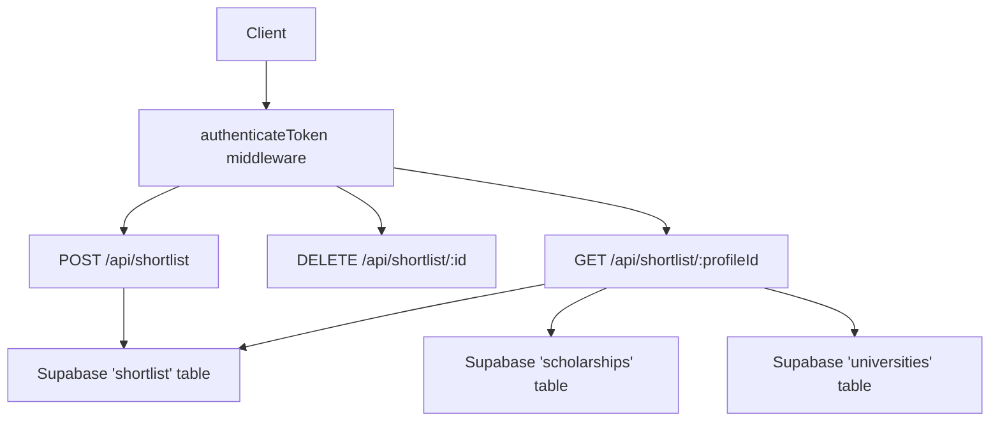
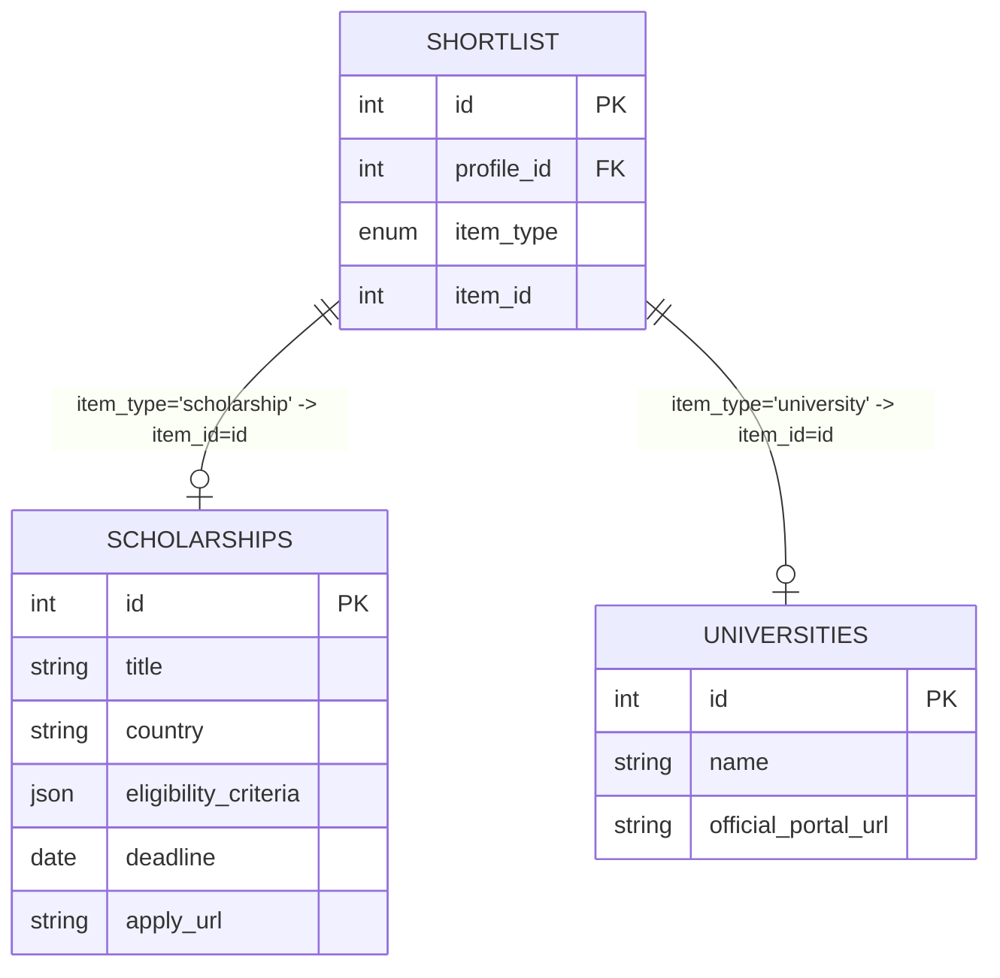
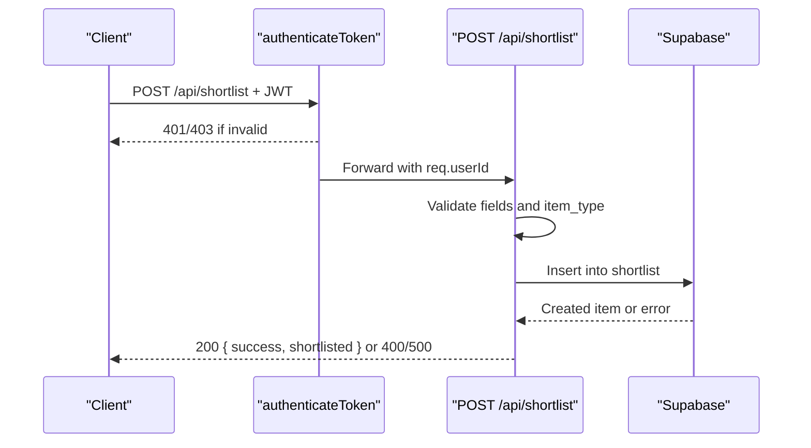
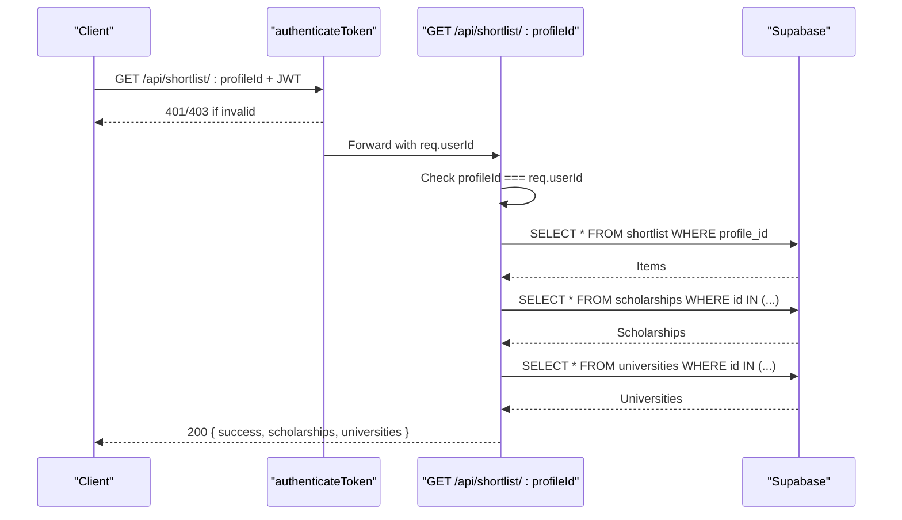
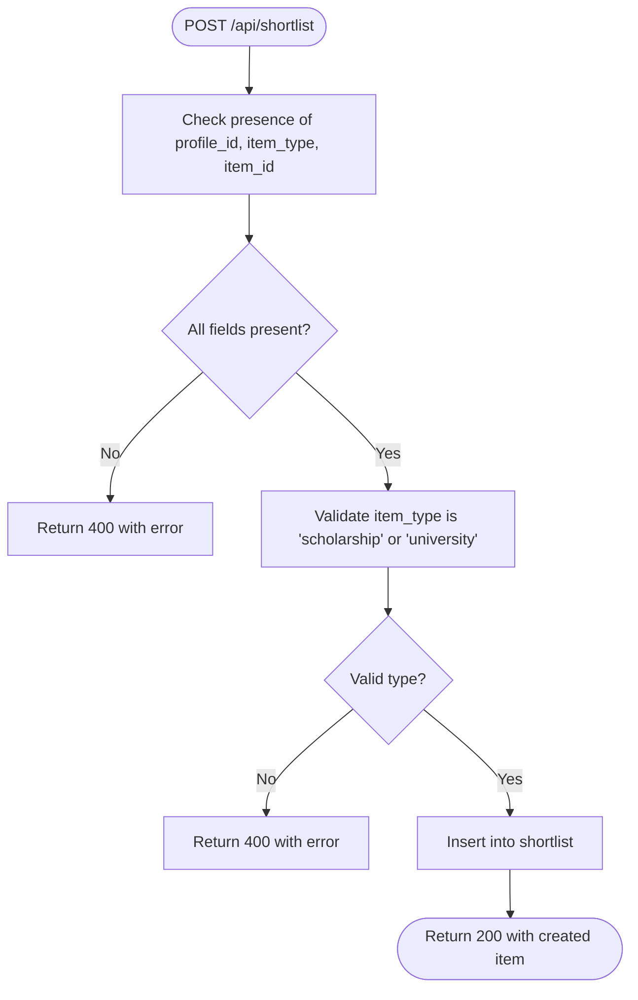
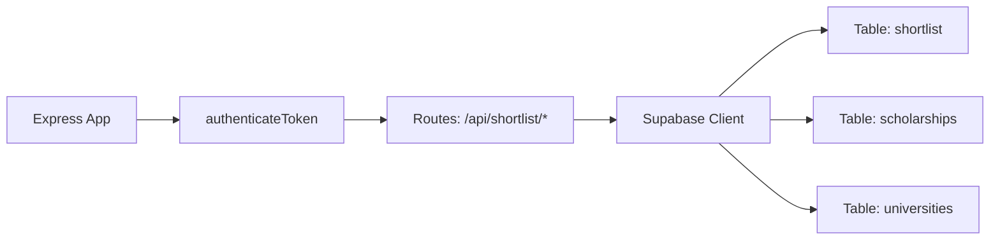

# Shortlist Management Endpoints

<cite>
**Referenced Files in This Document**
- [index.js](file://aischolarpath-backend-main/aischolarpath-backend-main/index.js)
</cite>

## Table of Contents
1. [Introduction](#introduction)
2. [Project Structure](#project-structure)
3. [Core Components](#core-components)
4. [Architecture Overview](#architecture-overview)
5. [Detailed Component Analysis](#detailed-component-analysis)
6. [Dependency Analysis](#dependency-analysis)
7. [Performance Considerations](#performance-considerations)
8. [Troubleshooting Guide](#troubleshooting-guide)
9. [Conclusion](#conclusion)

## Introduction
This document provides comprehensive API documentation for the ScholarPathAI shortlist management endpoints. It covers:
- Adding items to a user’s shortlist (scholarships and universities)
- Removing items from a shortlist
- Retrieving a profile’s shortlist with enriched item details
It also specifies authentication, authorization, validation rules, data structures, error handling, and integration points with the database.

## Project Structure
The shortlist endpoints are implemented in a single Express application file that defines routes, middleware, and database interactions using Supabase. The relevant implementation is contained within one server file.



**Diagram sources**
- [index.js:32-47](file://aischolarpath-backend-main/aischolarpath-backend-main/index.js#L32-L47)
- [index.js:750-820](file://aischolarpath-backend-main/aischolarpath-backend-main/index.js#L750-L820)

**Section sources**
- [index.js:1-59](file://aischolarpath-backend-main/aischolarpath-backend-main/index.js#L1-L59)
- [index.js:750-820](file://aischolarpath-backend-main/aischolarpath-backend-main/index.js#L750-L820)

## Core Components
- Authentication middleware validates JWT tokens and attaches the authenticated user ID to requests.
- Shortlist endpoints enforce ownership checks and interact with the shortlist, scholarships, and universities tables.
- Validation ensures required fields and allowed values are provided when adding items.

Key responsibilities:
- POST /api/shortlist: Validate input, insert into shortlist, return created item
- DELETE /api/shortlist/:id: Delete a specific shortlist entry by its internal id
- GET /api/shortlist/:profileId: Fetch all shortlist entries for a profile and enrich with scholarship/university details

**Section sources**
- [index.js:32-47](file://aischolarpath-backend-main/aischolarpath-backend-main/index.js#L32-L47)
- [index.js:750-820](file://aischolarpath-backend-main/aischolarpath-backend-main/index.js#L750-L820)

## Architecture Overview
The shortlist feature integrates three main layers:
- HTTP layer: Express routes define endpoints and handle request/response lifecycle
- Authorization layer: JWT-based middleware ensures only authenticated users access protected routes and enforces ownership where applicable
- Data layer: Supabase client performs CRUD operations on shortlist, scholarships, and universities tables

```mermaid
sequenceDiagram
participant C as "Client"
participant M as "authenticateToken"
participant R as "Route Handler"
participant S as "Supabase"
C->>M : Request with Authorization header
M-->>C : 401 if no token; 403 if invalid/expired
M->>R : Forward request with req.userId set
R->>S : Query/Insert/Delete shortlist and related tables
S-->>R : Data or error
R-->>C : JSON response with success/error
```

**Diagram sources**
- [index.js:32-47](file://aischolarpath-backend-main/aischolarpath-backend-main/index.js#L32-L47)
- [index.js:750-820](file://aischolarpath-backend-main/aischolarpath-backend-main/index.js#L750-L820)

## Detailed Component Analysis

### Authentication and Authorization
- All shortlist endpoints require a valid JWT in the Authorization header.
- On missing or invalid token, the middleware returns 401 or 403 respectively.
- For retrieval, the endpoint verifies that the requested profileId matches the authenticated user’s id; otherwise it returns 403.

Behavior summary:
- Missing token: 401 Unauthorized
- Invalid/expired token: 403 Forbidden
- Accessing another user’s shortlist: 403 Forbidden

**Section sources**
- [index.js:32-47](file://aischolarpath-backend-main/aischolarpath-backend-main/index.js#L32-L47)
- [index.js:786-792](file://aischolarpath-backend-main/aischolarpath-backend-main/index.js#L786-L792)

### POST /api/shortlist — Add Item to Shortlist
Purpose:
- Add a scholarship or university to a user’s shortlist.

Authentication:
- Required via JWT.

Request body:
- profile_id: string or number (required)
- item_type: string (required; must be "scholarship" or "university")
- item_id: string or number (required)

Validation rules:
- All three fields must be present
- item_type must be exactly "scholarship" or "university"

Data integrity:
- Inserts a row into the shortlist table with the provided fields
- No explicit existence check for referenced scholarship/university is performed at this route

Response:
- Success: 200 OK with { success: true, shortlisted: <created item> }
- Validation error: 400 Bad Request with descriptive error message
- Database error: 500 Internal Server Error with error.message

Example response shape (success):
{
  "success": true,
  "shortlisted": {
    "id": "<auto-generated>",
    "profile_id": "<provided>",
    "item_type": "<provided>",
    "item_id": "<provided>"
  }
}

Error responses:
- 400: Missing required fields or invalid item_type
- 500: Database insertion error

**Section sources**
- [index.js:750-771](file://aischolarpath-backend-main/aischolarpath-backend-main/index.js#L750-L771)

### DELETE /api/shortlist/:id — Remove Item from Shortlist
Purpose:
- Remove a specific shortlist entry by its internal id.

Authentication:
- Required via JWT.

Path parameters:
- id: the primary key of the shortlist entry to delete

Behavior:
- Deletes the row matching the given id from the shortlist table
- No cascade logic is implemented in this route

Response:
- Success: 200 OK with { success: true, message: "Removed from shortlist" }
- Database error: 500 Internal Server Error with error.message

Notes:
- There is no ownership check in this route; any authenticated user can delete any shortlist entry by id. If stricter security is needed, add an ownership verification step before deletion.

**Section sources**
- [index.js:773-783](file://aischolarpath-backend-main/aischolarpath-backend-main/index.js#L773-L783)

### GET /api/shortlist/:profileId — Retrieve Profile Shortlist with Details
Purpose:
- Return all shortlist entries for a given profile, enriched with full scholarship and/or university details.

Authentication:
- Required via JWT.

Authorization:
- The profileId in the path must match the authenticated user’s id; otherwise returns 403 Forbidden.

Query behavior:
- Retrieves all shortlist rows for the specified profile_id
- Separates item_ids by type and fetches corresponding records from scholarships and universities tables
- Returns two arrays: scholarships and universities

Response:
- Success: 200 OK with { success: true, scholarships: [...], universities: [...] }
- Authorization error: 403 Forbidden
- Database error: 500 Internal Server Error with error.message

Enrichment process:
- Collects scholarshipIds and universityIds from shortlist items
- Queries scholarships table for matching ids
- Queries universities table for matching ids
- Returns both datasets alongside success flag

**Section sources**
- [index.js:785-820](file://aischolarpath-backend-main/aischolarpath-backend-main/index.js#L785-L820)

### Data Models and Relationships
Shortlist item model (as used by the API):
- id: auto-generated primary key
- profile_id: references the user profile
- item_type: "scholarship" | "university"
- item_id: id of the referenced scholarship or university

Relationships:
- A shortlist item links a profile to either a scholarship or a university
- Retrieval enriches each item with full details from the respective table



[No sources needed since this diagram shows conceptual structure inferred from usage]

### Sequence Diagrams

#### Add Item to Shortlist


**Diagram sources**
- [index.js:32-47](file://aischolarpath-backend-main/aischolarpath-backend-main/index.js#L32-L47)
- [index.js:750-771](file://aischolarpath-backend-main/aischolarpath-backend-main/index.js#L750-L771)

#### Retrieve Shortlist with Enriched Details


**Diagram sources**
- [index.js:32-47](file://aischolarpath-backend-main/aischolarpath-backend-main/index.js#L32-L47)
- [index.js:785-820](file://aischolarpath-backend-main/aischolarpath-backend-main/index.js#L785-L820)

### Flowchart: Input Validation for Add Endpoint


**Diagram sources**
- [index.js:750-771](file://aischolarpath-backend-main/aischolarpath-backend-main/index.js#L750-L771)

## Dependency Analysis
- Middleware dependency: authenticateToken depends on JWT_SECRET environment variable and uses jsonwebtoken to verify tokens
- Database dependencies: Supabase client configured with SUPABASE_URL and SUPABASE_KEY
- Tables accessed:
  - shortlist: create, read, delete
  - scholarships: read (enrichment)
  - universities: read (enrichment)



**Diagram sources**
- [index.js:32-47](file://aischolarpath-backend-main/aischolarpath-backend-main/index.js#L32-L47)
- [index.js:50-54](file://aischolarpath-backend-main/aischolarpath-backend-main/index.js#L50-L54)
- [index.js:750-820](file://aischolarpath-backend-main/aischolarpath-backend-main/index.js#L750-L820)

**Section sources**
- [index.js:50-54](file://aischolarpath-backend-main/aischolarpath-backend-main/index.js#L50-L54)
- [index.js:750-820](file://aischolarpath-backend-main/aischolarpath-backend-main/index.js#L750-L820)

## Performance Considerations
- Retrieval endpoint batches enrichment queries by collecting IDs and performing IN queries for scholarships and universities separately, reducing round trips
- Ensure indexes exist on shortlist.profile_id, scholarships.id, and universities.id for efficient lookups
- Avoid duplicate shortlist entries by enforcing uniqueness constraints at the database level (e.g., unique constraint on profile_id + item_type + item_id)

[No sources needed since this section provides general guidance]

## Troubleshooting Guide
Common issues and resolutions:
- 401 Unauthorized: Missing or malformed Authorization header; ensure a valid JWT is included
- 403 Forbidden:
  - Invalid/expired token
  - Attempting to access another user’s shortlist (profileId mismatch)
- 400 Bad Request:
  - Missing required fields in POST body
  - Invalid item_type value
- 500 Internal Server Error:
  - Database connectivity or query errors; inspect error.message in response

Operational notes:
- Environment variables required: SUPABASE_URL, SUPABASE_KEY, JWT_SECRET
- If DELETE does not remove expected rows, verify the id corresponds to a shortlist entry and that the authenticated user has permission (note: current implementation lacks ownership check on delete)

**Section sources**
- [index.js:32-47](file://aischolarpath-backend-main/aischolarpath-backend-main/index.js#L32-L47)
- [index.js:750-820](file://aischolarpath-backend-main/aischolarpath-backend-main/index.js#L750-L820)

## Conclusion
The ScholarPathAI shortlist management endpoints provide secure, validated, and enriched operations for managing a user’s shortlist of scholarships and universities. Authentication and authorization are enforced via JWT middleware, with strict validation on creation and ownership checks on retrieval. The retrieval endpoint efficiently enriches shortlist items with detailed scholarship and university data. For improved robustness, consider adding database-level uniqueness constraints and ownership checks on deletion.