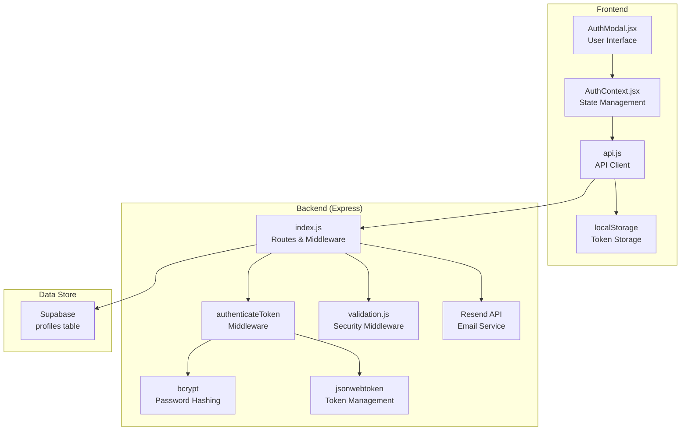
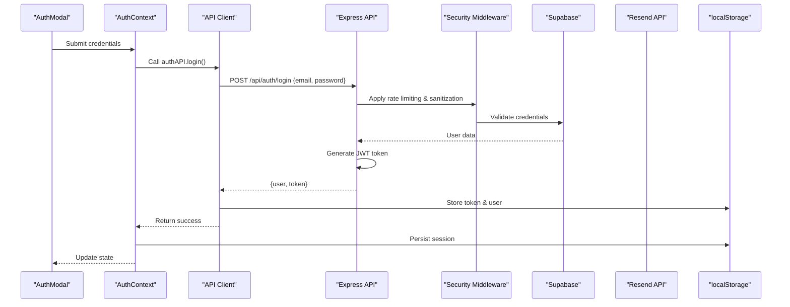
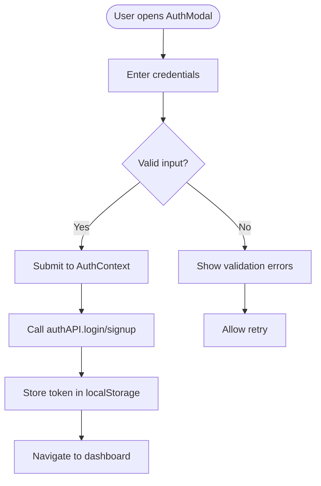
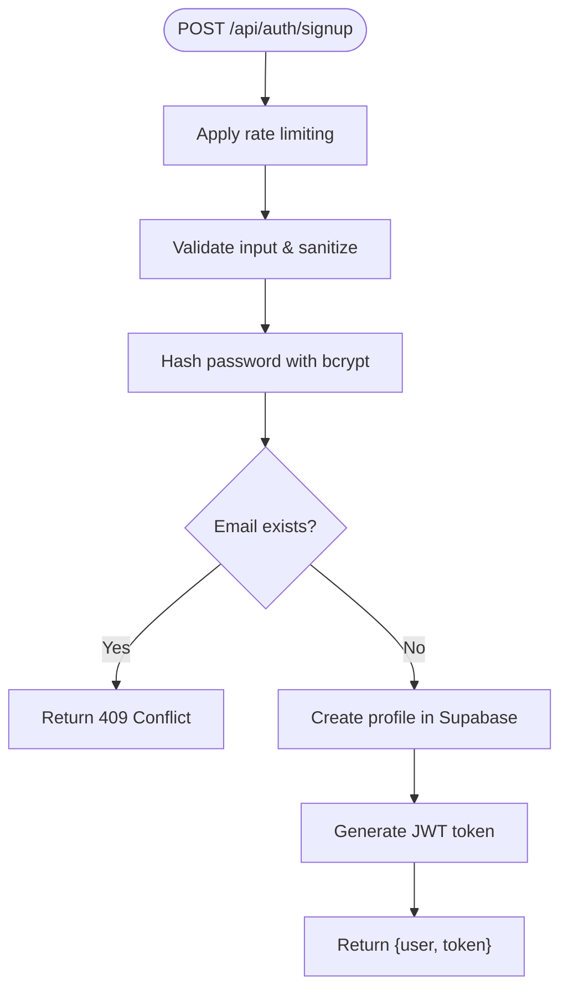
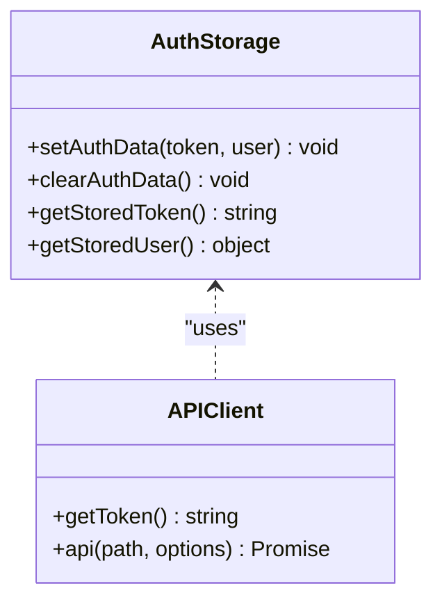
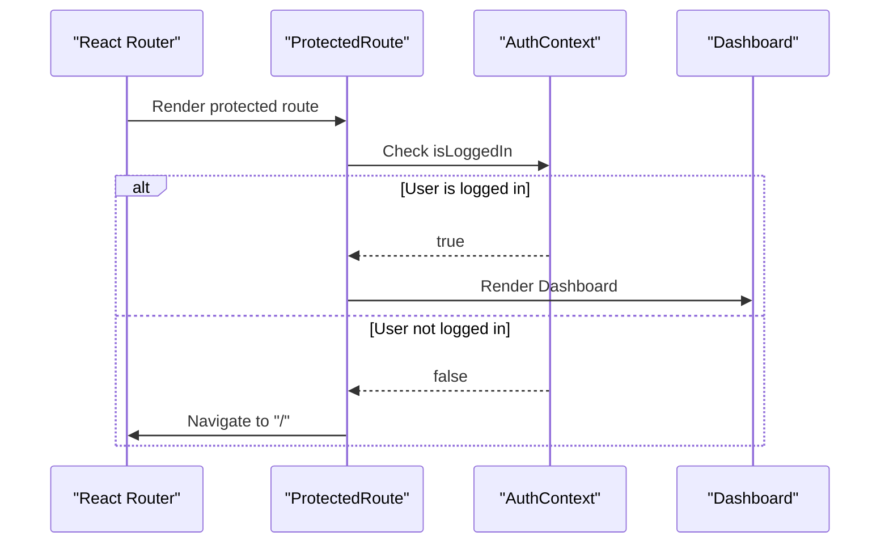
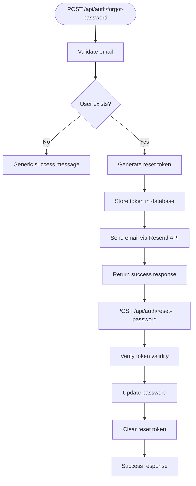
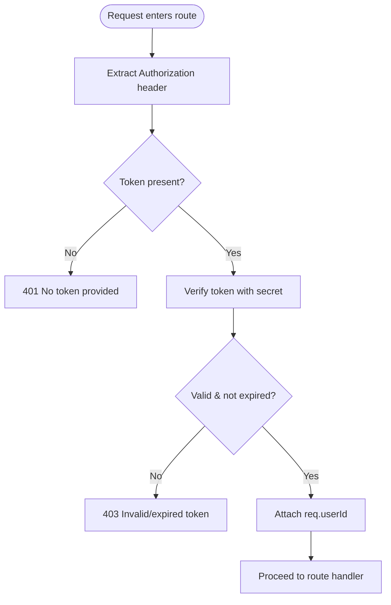
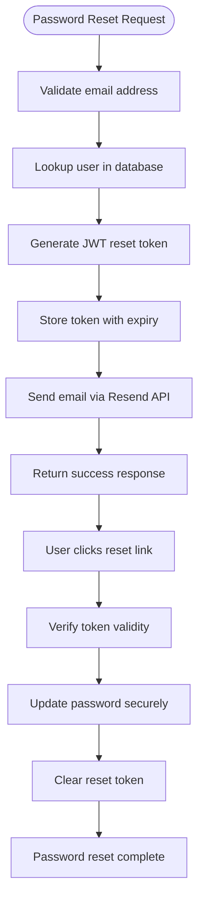
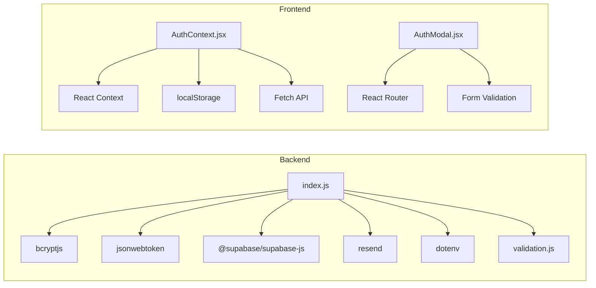

# Authentication System

<cite>
**Referenced Files in This Document**
- [index.js](file://aischolarpath-backend-main/aischolarpath-backend-main/index.js)
- [validation.js](file://aischolarpath-backend-main/aischolarpath-backend-main/validation.js)
- [package.json](file://aischolarpath-backend-main/aischolarpath-backend-main/package.json)
- [AuthModal.jsx](file://scholarpath-frontend (2)/scholarpath/src/components/AuthModal.jsx)
- [AuthContext.jsx](file://scholarpath-frontend (2)/scholarpath/src/components/AuthContext.jsx)
- [api.js](file://scholarpath-frontend (2)/scholarpath/src/api.js)
- [App.jsx](file://scholarpath-frontend (2)/scholarpath/src/App.jsx)
</cite>

## Update Summary
**Changes Made**
- Enhanced security measures with comprehensive input sanitization and rate limiting for authentication endpoints
- Integrated Resend API for password reset email functionality with professional HTML templates
- Implemented robust validation middleware with XSS protection and request throttling
- Added secure token management with 1-hour expiry for password reset tokens
- Enhanced frontend authentication flow with complete password reset workflow

## Table of Contents
1. [Introduction](#introduction)
2. [Project Structure](#project-structure)
3. [Core Components](#core-components)
4. [Architecture Overview](#architecture-overview)
5. [Detailed Component Analysis](#detailed-component-analysis)
6. [Security Enhancements](#security-enhancements)
7. [Password Reset Email System](#password-reset-email-system)
8. [Dependency Analysis](#dependency-analysis)
9. [Performance Considerations](#performance-considerations)
10. [Troubleshooting Guide](#troubleshooting-guide)
11. [Conclusion](#conclusion)
12. [Appendices](#appendices)

## Introduction
This document explains the enhanced JWT-based authentication system implemented in both backend and frontend. The system now includes comprehensive user registration with bcrypt password hashing, secure login flow with credential validation, JWT token generation with 7-day expiration, and persistent session management through localStorage. **Enhanced security measures include advanced input sanitization, rate limiting, and XSS protection.** The authenticateToken middleware validates JWT tokens on protected routes, extracts user IDs from decoded tokens, and enforces authorization checks. **New password reset functionality via Resend API provides secure email-based password recovery.** Security considerations include password storage, token management, protection against common vulnerabilities, and comprehensive input validation.

## Project Structure
The authentication system spans both backend Express server and React frontend with enhanced security features:

**Backend Components:**
- Express server with JWT authentication middleware
- bcrypt for secure password hashing
- Supabase integration for user data storage
- Rate limiting and input sanitization middleware
- Resend API integration for password reset emails

**Frontend Components:**
- AuthContext for global authentication state management
- AuthModal for user interface interactions with password reset
- LocalStorage-based token persistence
- Protected route implementation



**Diagram sources**
- [AuthModal.jsx:1-282](file://scholarpath-frontend (2)/scholarpath/src/components/AuthModal.jsx#L1-L282)
- [AuthContext.jsx:1-64](file://scholarpath-frontend (2)/scholarpath/src/components/AuthContext.jsx#L1-L64)
- [api.js:1-179](file://scholarpath-frontend (2)/scholarpath/src/api.js#L1-L179)
- [index.js:123-142](file://aischolarpath-backend-main/aischolarpath-backend-main/index.js#L123-L142)
- [validation.js:76-106](file://aischolarpath-backend-main/aischolarpath-backend-main/validation.js#L76-L106)

**Section sources**
- [index.js:1-24](file://aischolarpath-backend-main/aischolarpath-backend-main/index.js#L1-L24)
- [package.json:1-32](file://aischolarpath-backend-main/aischolarpath-backend-main/package.json#L1-L32)
- [AuthModal.jsx:1-282](file://scholarpath-frontend (2)/scholarpath/src/components/AuthModal.jsx#L1-L282)
- [AuthContext.jsx:1-64](file://scholarpath-frontend (2)/scholarpath/src/components/AuthContext.jsx#L1-L64)
- [api.js:1-179](file://scholarpath-frontend (2)/scholarpath/src/api.js#L1-L179)

## Core Components
- **User Registration**: Creates profiles with hashed passwords and issues access tokens with rate limiting
- **User Login**: Validates credentials with input sanitization and provides authenticated sessions
- **Session Management**: Persistent authentication state using localStorage
- **Protected Routes**: Route-level authentication with automatic redirects
- **Password Reset**: Complete forgot-password workflow with Resend API email integration
- **Token Management**: Automatic header injection for API requests
- **Input Validation**: Comprehensive validation with XSS protection and rate limiting

Key endpoints:
- POST /api/auth/signup - User registration with rate limiting
- POST /api/auth/login - User authentication with rate limiting
- POST /api/auth/forgot-password - Password reset initiation with email delivery
- POST /api/auth/reset-password - Password reset completion with token verification
- Protected routes guarded by authenticateToken middleware

Security highlights:
- Passwords hashed with bcrypt before storage
- JWT tokens with minimal payload (user ID only)
- Rate limiting on auth endpoints (5 requests/min for signup, 10 requests/min for login)
- Secure token storage in localStorage
- Protected routes with ownership verification
- Input sanitization preventing XSS attacks
- Professional email templates via Resend API

**Section sources**
- [index.js:737-800](file://aischolarpath-backend-main/aischolarpath-backend-main/index.js#L737-L800)
- [index.js:1825-1947](file://aischolarpath-backend-main/aischolarpath-backend-main/index.js#L1825-L1947)
- [validation.js:76-106](file://aischolarpath-backend-main/aischolarpath-backend-main/validation.js#L76-L106)
- [AuthContext.jsx:20-50](file://scholarpath-frontend (2)/scholarpath/src/components/AuthContext.jsx#L20-L50)
- [api.js:79-85](file://scholarpath-frontend (2)/scholarpath/src/api.js#L79-L85)

## Architecture Overview
The enhanced authentication architecture follows a modern stateful pattern with persistent sessions and comprehensive security:



**Diagram sources**
- [AuthModal.jsx:42-66](file://scholarpath-frontend (2)/scholarpath/src/components/AuthModal.jsx#L42-L66)
- [AuthContext.jsx:33-44](file://scholarpath-frontend (2)/scholarpath/src/components/AuthContext.jsx#L33-L44)
- [api.js:79-85](file://scholarpath-frontend (2)/scholarpath/src/api.js#L79-L85)
- [index.js:737-800](file://aischolarpath-backend-main/aischolarpath-backend-main/index.js#L737-L800)
- [validation.js:76-91](file://aischolarpath-backend-main/aischolarpath-backend-main/validation.js#L76-L91)

## Detailed Component Analysis

### Enhanced Frontend Authentication Flow
The frontend implements a complete authentication system with persistent sessions and password reset capabilities:

**AuthContext Component:**
- Manages global authentication state
- Handles token persistence in localStorage
- Provides signup, login, and logout functions
- Maintains loading states for better UX

**AuthModal Component:**
- Beautiful UI for login/signup forms
- Complete forgot password functionality with two-step process
- Form validation and error handling
- Integration with AuthContext and Resend API



**Diagram sources**
- [AuthModal.jsx:42-66](file://scholarpath-frontend (2)/scholarpath/src/components/AuthModal.jsx#L42-L66)
- [AuthContext.jsx:20-44](file://scholarpath-frontend (2)/scholarpath/src/components/AuthContext.jsx#L20-L44)

**Section sources**
- [AuthModal.jsx:1-282](file://scholarpath-frontend (2)/scholarpath/src/components/AuthModal.jsx#L1-L282)
- [AuthContext.jsx:1-64](file://scholarpath-frontend (2)/scholarpath/src/components/AuthContext.jsx#L1-L64)

### Backend Authentication Endpoints
Enhanced backend with comprehensive authentication endpoints and security measures:

**Registration Endpoint:**
- Input validation with rate limiting (5 requests per minute)
- Password hashing with bcrypt
- Duplicate email checking
- JWT token generation with 7-day expiration

**Login Endpoint:**
- Credential validation with input sanitization
- Password comparison with bcrypt.compare
- Session token generation
- User data sanitization

**Password Reset Endpoints:**
- Token generation with 1-hour expiry
- Secure token storage in database
- Password update with validation
- Email delivery via Resend API
- Token cleanup after use



**Diagram sources**
- [index.js:737-765](file://aischolarpath-backend-main/aischolarpath-backend-main/index.js#L737-L765)
- [validation.js:76-91](file://aischolarpath-backend-main/aischolarpath-backend-main/validation.js#L76-L91)

**Section sources**
- [index.js:737-800](file://aischolarpath-backend-main/aischolarpath-backend-main/index.js#L737-L800)
- [index.js:1825-1947](file://aischolarpath-backend-main/aischolarpath-backend-main/index.js#L1825-L1947)
- [validation.js:23-74](file://aischolarpath-backend-main/aischolarpath-backend-main/validation.js#L23-L74)

### Token Storage and Session Management
Enhanced session management with localStorage persistence:

**LocalStorage Functions:**
- `setAuthData(token, user)` - Stores authentication data
- `clearAuthData()` - Clears session on logout
- `getStoredToken()` - Retrieves current token
- `getStoredUser()` - Retrieves stored user data

**Automatic Header Injection:**
- All API requests automatically include Authorization header
- Token retrieval from localStorage before each request
- Consistent authentication across all API calls



**Diagram sources**
- [api.js:7-27](file://scholarpath-frontend (2)/scholarpath/src/api.js#L7-L27)
- [api.js:29-77](file://scholarpath-frontend (2)/scholarpath/src/api.js#L29-L77)

**Section sources**
- [api.js:1-179](file://scholarpath-frontend (2)/scholarpath/src/api.js#L1-L179)

### Protected Routes Implementation
Route-level authentication with automatic redirects:

**ProtectedRoute Component:**
- Checks authentication status via AuthContext
- Redirects unauthenticated users to landing page
- Wraps protected routes with authentication guard

**Authentication State:**
- Global isLoggedIn flag in AuthContext
- Automatic state updates on login/logout
- Persistent authentication across page refreshes



**Diagram sources**
- [App.jsx:6-9](file://scholarpath-frontend (2)/scholarpath/src/App.jsx#L6-L9)
- [AuthContext.jsx:52-56](file://scholarpath-frontend (2)/scholarpath/src/components/AuthContext.jsx#L52-L56)

**Section sources**
- [App.jsx:1-23](file://scholarpath-frontend (2)/scholarpath/src/App.jsx#L1-L23)

### Password Reset Workflow
Complete password reset functionality with secure token handling and email delivery:

**Forgot Password Flow:**
- Email validation and user lookup
- JWT token generation with 1-hour expiry
- Secure token storage in database
- Professional HTML email template via Resend API
- Development mode returns token directly

**Reset Password Flow:**
- Token validation and expiry checking
- Password strength validation
- Secure password update with bcrypt
- Token cleanup after successful reset



**Diagram sources**
- [index.js:1825-1904](file://aischolarpath-backend-main/aischolarpath-backend-main/index.js#L1825-L1904)
- [index.js:1907-1947](file://aischolarpath-backend-main/aischolarpath-backend-main/index.js#L1907-L1947)

**Section sources**
- [index.js:1825-1947](file://aischolarpath-backend-main/aischolarpath-backend-main/index.js#L1825-L1947)

### authenticateToken Middleware
Enhanced middleware for protecting API routes:

**Token Validation:**
- Extracts Authorization header from requests
- Parses bearer token format
- Verifies token signature and expiration
- Attaches decoded user ID to request object

**Error Handling:**
- Returns appropriate HTTP status codes
- Provides clear error messages
- Prevents unauthorized access attempts



**Diagram sources**
- [index.js:123-138](file://aischolarpath-backend-main/aischolarpath-backend-main/index.js#L123-L138)

**Section sources**
- [index.js:123-138](file://aischolarpath-backend-main/aischolarpath-backend-main/index.js#L123-L138)

## Security Enhancements

### Input Sanitization and XSS Protection
The system now includes comprehensive input sanitization to prevent Cross-Site Scripting (XSS) attacks:

**Sanitization Features:**
- HTML tag stripping from all string inputs
- Whitespace trimming for cleaner data
- Protection against script injection attacks
- Applied globally to all request bodies

**Implementation:**
- Global middleware applied after JSON parsing
- Recursive processing of nested objects
- Safe handling of missing or invalid request bodies

### Rate Limiting and Brute Force Protection
Advanced rate limiting prevents brute force attacks and API abuse:

**Rate Limiting Configuration:**
- Signup endpoint: 5 requests per minute per IP
- Login endpoint: 10 requests per minute per IP
- In-memory request tracking with automatic cleanup
- Graceful 429 responses when limits are exceeded

**Security Benefits:**
- Prevents automated attack tools
- Protects against credential stuffing
- Reduces server load during attacks
- Maintains service availability

### Enhanced Validation Framework
Comprehensive validation middleware ensures data integrity and security:

**Validation Rules:**
- Email format validation with regex patterns
- CNIC (Pakistani ID) validation
- Length constraints (min/max)
- Numeric range validation
- Pattern matching for complex formats
- Enum validation for predefined values

**Section sources**
- [validation.js:1-109](file://aischolarpath-backend-main/aischolarpath-backend-main/validation.js#L1-L109)
- [index.js:141-142](file://aischolarpath-backend-main/aischolarpath-backend-main/index.js#L141-L142)

## Password Reset Email System

### Resend API Integration
The system integrates with Resend API for professional password reset email delivery:

**Email Template Features:**
- Professional HTML design with branding
- Responsive layout for mobile devices
- Clear call-to-action buttons
- Security warnings and instructions
- Expiration notices for reset links

**Security Measures:**
- 1-hour token expiration for reset links
- Secure token generation with JWT
- Database-stored token verification
- Automatic token cleanup after use
- Generic success messages to prevent user enumeration

**Configuration:**
- Environment-based API key configuration
- Graceful fallback when API key is missing
- Development mode support for testing
- Error handling for email delivery failures



**Diagram sources**
- [index.js:1825-1904](file://aischolarpath-backend-main/aischolarpath-backend-main/index.js#L1825-L1904)

**Section sources**
- [index.js:1825-1904](file://aischolarpath-backend-main/aischolarpath-backend-main/index.js#L1825-L1904)

## Dependency Analysis
The enhanced authentication system depends on:

**Backend Dependencies:**
- bcryptjs for password hashing
- jsonwebtoken for token management
- @supabase/supabase-js for database operations
- resend for email delivery
- dotenv for environment configuration
- Custom validation and rate limiting modules

**Frontend Dependencies:**
- React Context API for state management
- React Router for navigation
- LocalStorage for persistent sessions
- Fetch API for HTTP requests



**Diagram sources**
- [package.json:8-23](file://aischolarpath-backend-main/aischolarpath-backend-main/package.json#L8-L23)
- [AuthContext.jsx:1-64](file://scholarpath-frontend (2)/scholarpath/src/components/AuthContext.jsx#L1-L64)
- [AuthModal.jsx:1-282](file://scholarpath-frontend (2)/scholarpath/src/components/AuthModal.jsx#L1-L282)

**Section sources**
- [package.json:1-32](file://aischolarpath-backend-main/aischolarpath-backend-main/package.json#L1-L32)
- [AuthContext.jsx:1-64](file://scholarpath-frontend (2)/scholarpath/src/components/AuthContext.jsx#L1-L64)

## Performance Considerations
- **bcrypt cost factor**: Using salt rounds of 10 for optimal balance between security and performance
- **Token size**: Minimal JWT payloads reduce network overhead
- **Rate limiting**: Configured limits prevent brute force attacks while maintaining usability
- **Local caching**: AuthContext maintains in-memory state for faster access
- **Database queries**: Optimized queries for user lookups and profile updates
- **Memory management**: Proper cleanup of authentication data on logout
- **Email delivery**: Asynchronous email sending doesn't block authentication flows
- **Input sanitization**: Efficient regex-based sanitization with minimal overhead

## Troubleshooting Guide
Common issues and resolutions:

**Authentication Issues:**
- Missing environment variables: Ensure SUPABASE_URL, SUPABASE_KEY, JWT_SECRET, and RESEND_API_KEY are configured
- Token expiration: Tokens expire after 7 days; implement refresh logic for long sessions
- CORS errors: Configure allowed origins in CORS settings
- LocalStorage issues: Check browser privacy settings that may block localStorage

**Security Issues:**
- Rate limiting errors: Users may be temporarily blocked; implement user-friendly error messages
- Input validation failures: Provide clear error messages indicating required fields and formats
- XSS prevention: Ensure frontend properly handles sanitized data display

**Password Reset Issues:**
- Email delivery failures: Check Resend API key configuration and network connectivity
- Token expiration: Reset links expire after 1 hour; implement resend functionality
- Database connection: Verify Supabase client initialization for token storage

**Backend Issues:**
- Database connection: Verify Supabase client initialization
- Password hashing: Ensure bcrypt is properly configured
- Token verification: Check JWT_SECRET consistency between environments
- Email service: Validate Resend API key format and permissions

**Section sources**
- [index.js:5-11](file://aischolarpath-backend-main/aischolarpath-backend-main/index.js#L5-L11)
- [index.js:123-138](file://aischolarpath-backend-main/aischolarpath-backend-main/index.js#L123-L138)
- [api.js:29-77](file://scholarpath-frontend (2)/scholarpath/src/api.js#L29-L77)

## Conclusion
The enhanced authentication system provides a complete, secure, and user-friendly authentication solution with advanced security measures. With JWT-based authentication, persistent sessions, comprehensive input validation, rate limiting, XSS protection, and robust security measures, it supports modern web application requirements. The system includes user registration, login, password reset with professional email delivery, protected routes, and session management, all while maintaining high security standards and excellent user experience. The integration of Resend API ensures reliable password reset email delivery with professional templates.

## Appendices

### Security Considerations
- **Password Storage**: Always hash passwords with bcrypt before storing; never store plaintext
- **Token Management**: Use short-lived access tokens (7 days); consider implementing refresh tokens for long sessions
- **Secret Management**: Store JWT_SECRET and database credentials in environment variables; do not hardcode
- **Rate Limiting**: Implement rate limiting on authentication endpoints to prevent brute force attacks
- **XSS Protection**: Sanitize all user inputs and configure Content Security Policy
- **CSRF Protection**: Use appropriate CSRF protection mechanisms for state-changing operations
- **Secure Communication**: Always use HTTPS in production environments
- **Session Security**: Clear sensitive data from memory when no longer needed
- **Email Security**: Use secure email services with proper authentication and encryption

### Implementation Examples: Client-Side Authentication

**Basic Login Flow:**
```javascript
// In your component
const { login } = useAuth();

const handleLogin = async (email, password) => {
  try {
    await login(email, password);
    // User is now authenticated and redirected
  } catch (error) {
    console.error('Login failed:', error);
  }
};
```

**Password Reset Flow:**
```javascript
// Forgot password
const handleForgotPassword = async (email) => {
  try {
    const result = await authAPI.forgotPassword({ email });
    // Show success message
  } catch (error) {
    // Handle error
  }
};

// Reset password with token
const handleResetPassword = async (token, newPassword) => {
  try {
    const result = await authAPI.resetPassword({ 
      reset_token: token, 
      new_password: newPassword 
    });
    // Redirect to login
  } catch (error) {
    // Handle error
  }
};
```

**Protected Route Usage:**
```javascript
// Wrap protected routes with ProtectedRoute
<Route path="/dashboard" element={
  <ProtectedRoute>
    <Dashboard />
  </ProtectedRoute>
} />
```

**API Calls with Authentication:**
```javascript
// All API calls automatically include authentication headers
const { get } = profileAPI;
const profile = await get(userId); // Automatically includes Authorization header
```

### Token Refresh Strategy
- **Access Token**: Short-lived (7 days) for immediate requests
- **Refresh Token**: Long-lived, stored securely; used to obtain new access tokens
- **Automatic Refresh**: Implement background token refresh before expiration
- **Graceful Degradation**: Handle token expiration gracefully with re-authentication prompts

### Best Practices
- **Error Handling**: Provide user-friendly error messages without exposing sensitive information
- **Loading States**: Show appropriate loading indicators during authentication processes
- **Form Validation**: Implement client-side validation for better user experience
- **Security Headers**: Configure appropriate security headers in production
- **Logging**: Implement comprehensive logging for debugging and monitoring
- **Testing**: Write unit tests for authentication logic and integration tests for full flows
- **Rate Limiting**: Monitor and adjust rate limits based on usage patterns
- **Email Templates**: Regularly review and update email templates for accessibility and branding